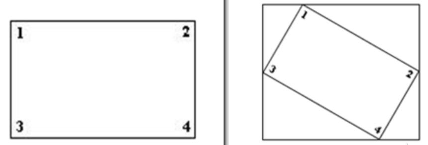
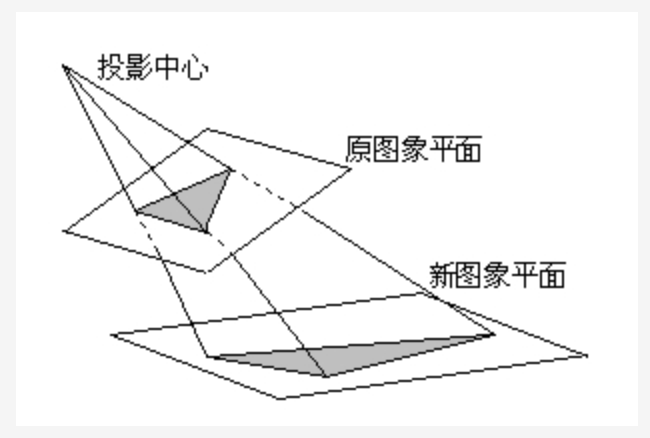

2023年11月6日20:09:50

# 课程介绍

## 定位

本课程是从事CV方向工作的基础课程，以OpenCV基础，介绍传统的图像处理算法，为图像处理算法工作打下坚实的基础。

## 主要内容

OpenCV是应用广泛的开源图像处理库，我们以其为基础，介绍相关的图像处理方法：包括基本的图像处理方法：几何变换，形态学变换，图像平滑，直方图操作，模板匹配，霍夫变换等；特征提取和描述方法：理解角点特征，Harris和Shi-Tomas算法，SIFT/SURF算法，Fast算法，ORB算法等；还有OpenCV在视频操作中的应用，最后的案例是使用OpenCV进行人脸检测。

# 一、OpenCV 简介

## 1 图像的起源

### 1.1 图像是什么

图像是人类视觉的基础，是自然景物的客观反映，是人类认识世界和人类本身的重要源泉。“图”是物体反射或透射光的分布，“像“是人的视觉系统所接受的图在人脑中所形版的印象或认识，照片、绘画、剪贴画、地图、书法作品、手写汉学、传真、卫星云图、影视画面、X光片、脑电图、心电图等都是图像。—姚敏. 数字图像处理：机械工业出版社，2014年。

### 1.2 模拟图像和数字图像

图像起源于1826年前后法国科学家Joseph Nicéphore Niépce发明的第一张可永久保存的照片，属于模拟图像。模拟图像又称连续图像，它通过某种物理量（如光、电等）的强弱变化来记录图像亮度信息，所以是连续变换的。模拟信号的特点是容易受干扰，如今已经基本全面被数字图像替代。

在第一次世界大战后，1921年美国科学家发明了Bartlane System，并从**伦敦传到纽约传输了第一幅数字图像**，其亮度用离散数值表示，将图片编码成5个灰度级，如下图所示，通过海底电缆进行传输。在发送端图片被编码并使用打孔带记录，通过系统传输后在接收方使用特殊的打印机恢复成图像。


1950年左右，计算机被发明，数字图像处理学科正式诞生。

模拟图像和数字图像的对比，我们可以看一下：


## 2 数字图像的表示

### 2.1 位数

计算机采用0/1编码的系统，数字图像也是利用0/1来记录信息，我们平常接触的图像都是8位数图像，包含0～255灰度，其中0，代表最黑，1，表示最白。


人眼对灰度更敏感一些，在16位到32位之间。


### 2.2 图像的分类

#### 2.3.1 二值图像

一幅二值图像的二维矩阵仅由0、1两个值构成，“0”代表黑色，“1”代白色。由于每一像素（矩阵中每一元素）取值仅有0、1两种可能，所以计算机中二值图像的数据类型通常为1个二进制位。二值图像通常用于文字、线条图的扫描识别（OCR）和掩膜图像的存储。

#### 2.3.2 灰度图

每个像素只有一个采样颜色的图像，这类图像通常显示为从最暗黑色到最亮的白色的灰度，尽管理论上这个采样可以任何颜色的不同深浅，甚至可以是不同亮度上的不同颜色。灰度图像与黑白图像不同，在计算机图像领域中黑白图像只有黑色与白色两种颜色；但是，灰度图像在黑色与白色之间还有许多级的颜色深度。灰度图像经常是在单个电磁波频谱如可见光内测量每个像素的亮度得到的，用于显示的灰度图像通常用每个采样像素8位的非线性尺度来保存，这样可以有256级灰度（如果用16位，则有65536级）。

#### 2.3.3 彩色图

每个像素通常是由红（R）、绿（G）、蓝（B）三个分量来表示的，分量介于（0，255）。RGB图像与索引图像一样都可以用来表示彩色图像。与索引图像一样，它分别用红（R）、绿（G）、蓝（B）三原色的组合来表示每个像素的颜色。但与索引图像不同的是，RGB图像每一个像素的颜色值（由RGB三原色表示）直接存放在图像矩阵中，由于每一像素的颜色需由R、G、B三个分量来表示，M、N分别表示图像的行列数，三个M x N的二维矩阵分别表示各个像素的R、G、B三个颜色分量。RGB图像的数据类型一般为8位无符号整形，通常用于表示和存放真彩色图像。

------

**总结**

1. 图像是什么

   图：物体反射或透射光的分布

   像：人的视觉系统所接受的图在人脑中所形版的印象或认识

2. 模拟图像和数字图像

   模拟图像：连续存储的数据

   数字图像：分级存储的数据

3. 数字图像

   位数：图像的表示，常见的就是8位

   分类：二值图像，灰度图像和彩色图像

## 3 什么是 OpenCV

### 3.1 OpenCV 简介


OpenCV是一款由Intel公司俄罗斯团队发起并参与和维护的一个计算机视觉处理开源软件库，支持与计算机视觉和机器学习相关的众多算法，并且正在日益扩展。

OpenCV的优势：

1. 编程语言

   OpenCV基于C++实现，同时提供python, Ruby, Matlab等语言的接口。OpenCV-Python是OpenCV的Python API，结合了OpenCV C++ API和Python语言的最佳特性。

2. 跨平台

   可以在不同的系统平台上使用，包括Windows，Linux，OS X，Android和iOS。基于CUDA和OpenCL的高速GPU操作接口也在积极开发中

3. 活跃的开发团队

4. 丰富的API

   完善的传统计算机视觉算法，涵盖主流的机器学习算法，同时添加了对深度学习的支持。

### 3.2 OpenCV-Python

OpenCV-Python是一个Python绑定库，旨在解决计算机视觉问题。

Python是一种由Guido van Rossum开发的通用编程语言，它很快就变得非常流行，主要是因为它的简单性和代码可读性。它使程序员能够用更少的代码行表达思想，而不会降低可读性。

与C / C++等语言相比，Python速度较慢。也就是说，Python可以使用C / C++轻松扩展，这使我们可以在C / C++中编写计算密集型代码，并创建可用作Python模块的Python包装器。这给我们带来了两个好处：首先，代码与原始C / C++代码一样快（因为它是在后台工作的实际C++代码），其次，在Python中编写代码比使用C / C++更容易。OpenCV-Python是原始OpenCV C++实现的Python包装器。

OpenCV-Python使用Numpy，这是一个高度优化的数据库操作库，具有MATLAB风格的语法。所有OpenCV数组结构都转换为Numpy数组。这也使得与使用Numpy的其他库（如SciPy和Matplotlib）集成更容易。

## 3 OpenCV 部署方法

安装OpenCV之前需要先安装numpy, matplotlib。

创建Python虚拟环境cv, 在cv中安装即可。

先安装OpenCV-Python, 由于一些经典的算法被申请了版权，新版本有很大的限制，所以选用3.4.3以下的版本

```bash
pip install opencv-python==3.4.2.17
```

现在可以测试下是否安装成功，运行以下代码无报错则说明安装成功。

```python
import cv2
# 读一个图片并进行显示(图片路径需自己指定)
lena=cv2.imread("1.jpg")
cv2.imshow("image",lena)
cv2.waitKey(0)
```

如果我们要利用SIFT和SURF等进行特征提取时，还需要安装：

```bash
pip install opencv-contrib-python==3.4.2.17
```

------

**总结**

1. OpenCV是计算机视觉的开源库

   优势：

   - 支持多种编程语言
   - 跨平台
   - 活跃的开发团队
   - 丰富的API

2. 能够独立的安装OpenCV-python

## 4 OpenCV 的模块

下图列出了OpenCV中包含的各个模块：


其中core、highgui、imgproc是最基础的模块，该课程主要是围绕这几个模块展开的，分别介绍如下：

- **core模块**实现了最核心的数据结构及其基本运算，如绘图函数、数组操作相关函数等。
- **highgui模块**实现了视频与图像的读取、显示、存储等接口。
- **imgproc模块**实现了图像处理的基础方法，包括图像滤波、图像的几何变换、平滑、阈值分割、形态学处理、边缘检测、目标检测、运动分析和对象跟踪等。

对于图像处理其他更高层次的方向及应用，OpenCV也有相关的模块实现

- **features2d模块**用于提取图像特征以及特征匹配，nonfree模块实现了一些专利算法，如sift特征。
- **objdetect模块**实现了一些目标检测的功能，经典的基于Haar、LBP特征的人脸检测，基于HOG的行人、汽车等目标检测，分类器使用Cascade Classification（级联分类）和Latent SVM等。
- **stitching模块**实现了图像拼接功能。
- **FLANN模块**（Fast Library for Approximate Nearest Neighbors），包含快速近似最近邻搜索FLANN 和聚类Clustering算法。
- **ml模块**机器学习模块（SVM，决策树，Boosting等等）。
- **photo模块**包含图像修复和图像去噪两部分。
- **video模块**针对视频处理，如背景分离，前景检测、对象跟踪等。
- **calib3d模块**即Calibration（校准）3D，这个模块主要是相机校准和三维重建相关的内容。包含了基本的多视角几何算法，单个立体摄像头标定，物体姿态估计，立体相似性算法，3D信息的重建等等。
- **G-API模块**包含超高效的图像处理pipeline引擎

------

**总结**

1. OpenCV 的模块

   core：最核心的数据结构

   highgui：视频与图像的读取、显示、存储

   imgproc：图像处理的基础方法

   features2d：图像特征以及特征匹配

# 二、OpenCV基本操作

## 1 图像的IO操作

这里我们会给大家介绍如何读取图像，如何显示图像和如何保存图像。

### 1.1 读取图像

```python
cv.imread()
```

参数：

- 要读取的图像

- 读取方式的标志

  - cv.IMREAD*COLOR：以彩色模式加载图像，任何图像的透明度都将被忽略。这是默认参数。

  - cv.IMREAD*GRAYSCALE：以灰度模式加载图像

  - cv.IMREAD_UNCHANGED：包括alpha通道的加载图像模式。

    可以使用1、0或者-1来替代上面三个标志

- 参考代码

  ```python
  import numpy as np
  import cv2 as cv
  # 以灰度图的形式读取图像
  img = cv.imread('messi5.jpg', 0)
  ```

**注意：如果加载的路径有错误，不会报错，会返回一个None值**

### 1.2 显示图像

```python
cv.imshow()
```

参数：

- 显示图像的窗口名称，以字符串类型表示
- 要加载的图像

**注意：在调用显示图像的API后，要调用cv.waitKey()给图像绘制留下时间，否则窗口会出现无响应情况，并且图像无法显示出来**。

另外我们也可使用matplotlib对图像进行展示。

1. 参考代码

   ```python
   # opencv中显示
   cv.imshow('image', img)
   cv.waitKey(0)
   # matplotlib中展示
   # openCV 是 BGR 所以此处要翻转一下
   plt.imshow(img[:, :, ::-1])
   ```

### 1.3 保存图像

1. API

   ```python
   cv.imwrite()
   ```

   参数：

   - 文件名，要保存在哪里
   - 要保存的图像

2. 参考代码

   ```python
   cv.imwrite('messigray.png', img)
   ```

### 1.4 总结

我们通过加载灰度图像，显示图像，如果按's'并退出则保存图像，或者按ESC键直接退出而不保存。

```python
import numpy as np
import cv2 as cv
import matplotlib.pyplot as plt
# 1 读取图像
img = cv.imread('messi5.jpg',0)
# 2 显示图像
# 2.1 利用opencv展示图像
cv.imshow('image',img)
# 2.2 在matplotplotlib中展示图像
plt.imshow(img[:,:,::-1])
plt.title('匹配结果'), plt.xticks([]), plt.yticks([])
plt.show()
k = cv.waitKey(0)
# 3 保存图像
cv.imwrite('messigray.png',img)
```

## 2 绘制几何图形

### 2.1 绘制直线

```
cv.line(img,start,end,color,thickness)
```

参数：

- img:要绘制直线的图像
- Start,end: 直线的起点和终点
- color: 线条的颜色
- Thickness: 线条宽度

### 2.2 绘制圆形

```python
cv.circle(img,centerpoint, r, color, thickness)
```

参数：

- img:要绘制圆形的图像
- Centerpoint, r: 圆心和半径
- color: 线条的颜色
- Thickness: 线条宽度，为-1时生成闭合图案并填充颜色

### 2.3 绘制矩形

```python
cv.rectangle(img,leftupper,rightdown,color,thickness)
```

参数：

- img:要绘制矩形的图像
- Leftupper, rightdown: 矩形的左上角和右下角坐标
- color: 线条的颜色
- Thickness: 线条宽度

### 2.4 向图像中添加文字

```python
cv.putText(img,text,station, font, fontsize,color,thickness,cv.LINE_AA)
```

参数：

- img: 图像
- text：要写入的文本数据
- station：文本的放置位置
- font：字体
- Fontsize :字体大小

### 2.5 效果展示

我们生成一个全黑的图像，然后在里面绘制图像并添加文字

```python
import cv2 as cv
import matplotlib.pyplot as plt
import numpy as np

# 创建图像
img = np.zeros(shape=(512, 512, 3), dtype=np.uint8)

# 绘制横线
cv.line(img, (0, 0), (512, 512), (255, 0, 0), 5)
# 绘制圆心
cv.circle(img, (256, 256), 60, (0, 0, 255), -1)
# 绘制方形
cv.rectangle(img, (100, 100), (400, 400), (0, 255, 0), 5)
# 写字
cv.putText(img, 'fafa', (100, 150), cv.FONT_HERSHEY_SIMPLEX, 5, (255, 255, 255), 3)

plt.imshow(img[:, :, ::-1])
plt.show()
```


## 3 获取并修改图像中的像素点

我们可以通过行和列的坐标值获取该像素点的像素值。对于BGR图像，它返回一个蓝，绿，红值的数组。对于灰度图像，仅返回相应的强度值。使用相同的方法对像素值进行修改。

```python
import numpy as np
import cv2 as cv
img = cv.imread('messi5.jpg')
# 获取某个像素点的值
px = img[100,100]
# 仅获取蓝色通道的强度值
blue = img[100,100,0]
# 修改某个位置的像素值
img[100,100] = [255,255,255]
```

## 4 获取图像的属性

图像属性包括行数，列数和通道数，图像数据类型，像素数等。

|   属性   |     API     |
| :------: | :---------: |
|   形状   | `img.shape` |
| 图像大小 | `img.size`  |
| 数据类型 | `img.dtype` |

## 5 图像通道的拆分与合并

有时需要在B，G，R通道图像上单独工作。在这种情况下，需要将BGR图像分割为单个通道。或者在其他情况下，可能需要将这些单独的通道合并到BGR图像。你可以通过以下方式完成。

```python
# 通道拆分
b,g,r = cv.split(img)
# 通道合并
img = cv.merge((b,g,r))
```

## 6 色彩空间的改变

OpenCV中有150多种颜色空间转换方法。最广泛使用的转换方法有两种，BGR↔Gray和BGR↔HSV。

API：

```python
cv.cvtColor(input_image，flag)
```

参数：

- input_image: 进行颜色空间转换的图像
- flag: 转换类型
  - cv.COLOR_BGR2GRAY : BGR↔Gray
  - cv.COLOR_BGR2HSV: BGR→HSV

```python
fafa = cv.imread('image/pink.jpg')
plt.imshow(fafa[:, :, ::-1])
plt.show()

b, g, r = cv.split(fafa)

# 用灰度图显示每个通道
plt.imshow(b, cmap=plt.cm.gray)
plt.imshow(g, cmap=plt.cm.gray)
plt.imshow(r,cmap=plt.cm.gray)

# 合并
img2 = cv.merge((b, g, r))
plt.imshow(img2[:, :, ::-1])

# 色彩空间转换
gray = cv.cvtColor(img2, cv.COLOR_BGR2GRAY)
plt.imshow(gray,cmap=plt.cm.gray)
hsv = cv.cvtColor(img2, cv.COLOR_BGR2HSV)
plt.imshow(hsv)
```

------

**总结：**

1. 图像IO操作的API：

   cv.imread(): 读取图像

   cv.imshow()：显示图像

   cv.imwrite(): 保存图像

2. 在图像上绘制几何图像

   cv.line(): 绘制直线

   cv.circle(): 绘制圆形

   cv.rectangle(): 绘制矩形

   cv.putText(): 在图像上添加文字

3. 直接使用行列索引获取图像中的像素并进行修改

4. 图像的属性

   

5. 拆分通道：cv.split()

   通道合并：cv.merge()

6. 色彩空间的改变

   cv.cvtColor(input_image，flag)

## 7 图像的加法

你可以使用OpenCV的cv.add()函数把两幅图像相加，或者可以简单地通过numpy操作添加两个图像，如res = img1 + img2。两个图像应该具有相同的大小和类型，或者第二个图像可以是标量值。

**注意：OpenCV加法和Numpy加法之间存在差异。OpenCV的加法是饱和操作，而Numpy添加是模运算。**

参考以下代码：

```python
>>> x = np.uint8([250])
>>> y = np.uint8([10])
>>> print( cv.add(x,y) ) # 250+10 = 260 => 255
[[255]]
>>> print( x+y )          # 250+10 = 260 % 256 = 4
[4]
```

这种差别在你对两幅图像进行加法时会更加明显。OpenCV 的结果会更好一点。所以我们尽量使用 OpenCV 中的函数。

我们将下面两幅图像：


代码：

```python
import numpy as np
import cv2 as cv
import matplotlib.pyplot as plt

# 1 读取图像
img1 = cv.imread("view.jpg")
img2 = cv.imread("rain.jpg")

# 2 加法操作
img3 = cv.add(img1,img2) # cv中的加法
img4 = img1+img2 # 直接相加

# 3 图像显示
fig,axes=plt.subplots(nrows=1,ncols=2,figsize=(10,8),dpi=100)
axes[0].imshow(img3[:,:,::-1])
axes[0].set_title("cv中的加法")
axes[1].imshow(img4[:,:,::-1])
axes[1].set_title("直接相加")
plt.show()
```

## 8 图像的混合

这其实也是加法，但是不同的是两幅图像的权重不同，这就会给人一种混合或者透明的感觉。图像混合的计算公式如下：
$$
g(x) = (1−α)f0(x) + αf1(x)
$$
通过修改 α 的值（0 → 1），可以实现非常炫酷的混合。

现在我们把两幅图混合在一起。第一幅图的权重是0.7，第二幅图的权重是0.3。函数cv2.addWeighted()可以按下面的公式对图片进行混合操作。
$$
dst = α⋅img1 + β⋅img2 + γ
$$
这里γ取为零。

参考以下代码：

```python
import numpy as np
import cv2 as cv
import matplotlib.pyplot as plt

# 1 读取图像
img1 = cv.imread("view.jpg")
img2 = cv.imread("rain.jpg")

# 2 图像混合
img3 = cv.addWeighted(img1,0.7,img2,0.3,0)

# 3 图像显示
plt.figure(figsize=(8,8))
plt.imshow(img3[:,:,::-1])
plt.show()
```

# 三、QpenCV 图像处理

## 几何变换

## 1 图像缩放

缩放是对图像的大小进行调整，即使图像放大或缩小。

1. API

   ```python
   cv2.resize(src,dsize,fx=0,fy=0,interpolation=cv2.INTER_LINEAR)
   ```

   参数：

   - src : 输入图像
   - dsize: 绝对尺寸，直接指定调整后图像的大小
   - fx,fy: 相对尺寸，将dsize设置为None，然后将fx和fy设置为比例因子即可
   - interpolation：插值方法，

   |        插值         |         含义         |
   | :-----------------: | :------------------: |
   | `CV2.INTER LINEAR`  |     双线性插值法     |
   | `CV2.INTER_NEAREST` |      最近邻插值      |
   |  `CV2.INTER_AREA`   | 像素区域重采样(默认) |
   |  `CV2.INTER_CUBIC`  |      双三次插值      |

2. 示例

3. ```python
   import cv2 as cv
   # 1. 读取图片
   img1 = cv.imread("./image/dog.jpeg")
   # 2.图像缩放
   # 2.1 绝对尺寸
   rows,cols = img1.shape[:2]
   res = cv.resize(img1,(2*cols,2*rows),interpolation=cv.INTER_CUBIC)
   
   # 2.2 相对尺寸
   res1 = cv.resize(img1,None,fx=0.5,fy=0.5)
   
   # 3 图像显示
   # 3.1 使用opencv显示图像(不推荐)
   cv.imshow("orignal",img1)
   cv.imshow("enlarge",res)
   cv.imshow("shrink）",res1)
   cv.waitKey(0)
   
   # 3.2 使用matplotlib显示图像
   fig,axes=plt.subplots(nrows=1,ncols=3,figsize=(10,8),dpi=100)
   axes[0].imshow(res[:,:,::-1])
   axes[0].set_title("绝对尺度（放大）")
   axes[1].imshow(img1[:,:,::-1])
   axes[1].set_title("原图")
   axes[2].imshow(res1[:,:,::-1])
   axes[2].set_title("相对尺度（缩小）")
   plt.show()
   ```


## 2 图像平移

图像平移将图像按照指定方向和距离，移动到相应的位置。

1. API

```python
cv.warpAffine(img,M,dsize)
```

参数：

- img: 输入图像

- M： 2∗∗3移动矩阵

  对于(x,y)处的像素点，要把它移动到
  $$
  (x+t_x, y+t_y)
  $$
  处时，M矩阵应如下设置：
  $$
  M=\left[ \begin{matrix}
  	1&		0&		t_x\\
  	0&		1&		t_y\\
  	&		&		\\
  \end{matrix} \right] 
  $$
  注意：将M设置为np.float32类型的Numpy数组。

- dsize: 输出图像的大小

  **注意：输出图像的大小，它应该是(宽度，高度)的形式。请记住,width=列数，height=行数。**

- 示例

需求是将图像的像素点移动(50,100)的距离：

```python
import numpy as np
import cv2 as cv
import matplotlib.pyplot as plt
# 1. 读取图像
img1 = cv.imread("./image/image2.jpg")

# 2. 图像平移
rows,cols = img1.shape[:2]
M = M = np.float32([[1,0,100],[0,1,50]])# 平移矩阵
dst = cv.warpAffine(img1,M,(cols,rows))

# 3. 图像显示
fig,axes=plt.subplots(nrows=1,ncols=2,figsize=(10,8),dpi=100)
axes[0].imshow(img1[:,:,::-1])
axes[0].set_title("原图")
axes[1].imshow(dst[:,:,::-1])
axes[1].set_title("平移后结果")
plt.show()
```


## 3 图像旋转

图像旋转是指图像按照某个位置转动一定角度的过程，旋转中图像仍保持这原始尺寸。图像旋转后图像的水平对称轴、垂直对称轴及中心坐标原点都可能会发生变换，因此需要对图像旋转中的坐标进行相应转换。

那图像是怎么进行旋转的呢？如下图所示：


假设图像逆时针旋转，则根据坐标转换可得旋转转换为：
$$
\left\{ \begin{array}{l}
	x^{\prime}=r\cos\mathrm{(}\alpha -\theta )\\
	y^{\prime}=r\sin\mathrm{(}\alpha -\theta )\\
\end{array} \right.
$$
其中
$$
r=\sqrt{x^2+y^2}, \sin \alpha=\frac{y}{\sqrt{x^2+y^2}}, \cos \alpha=\frac{x}{\sqrt{x^2+y^2}}
$$


代入上面公式
$$
\left\{\begin{array}{l}
x^{\prime}=x \cos \theta+y \sin \theta \\
y^{\prime}=-x \sin \theta+y \cos \theta
\end{array}\right.
$$
也可以写成：
$$
\left[\begin{array}{lll}
x^{\prime} & y^{\prime} & 1
\end{array}\right]=\left[\begin{array}{lll}
x & y & 1
\end{array}\right]\left[\begin{array}{ccc}
\cos \theta & -\sin \theta & 0 \\
\sin \theta & \cos \theta & 0 \\
0 & 0 & 1
\end{array}\right]
$$
同时我们要修正原点的位置，因为原图像中的坐标原点在图像的左上角，经过旋转后图像的大小会有所变化，原点也需要修正。

假设在旋转的时候是以旋转中心为坐标原点的，旋转结束后还需要将坐标原点移到图像左上角，也就是还要进行一次变换。


$$
\begin{gathered}
{\left[\begin{array}{lll}
x^{\prime \prime} & y^{\prime \prime} & 1
\end{array}\right]=\left[\begin{array}{lll}
x^{\prime} & y^{\prime} & 1
\end{array}\right]\left[\begin{array}{ccc}
1 & 0 & 0 \\
0 & -1 & 0 \\
\text { left } & \text { top } & 1
\end{array}\right]} \\
=\left[\begin{array}{lll}
x & y & 1
\end{array}\right]\left[\begin{array}{ccc}
\cos \theta & -\sin \theta & 0 \\
\sin \theta & \cos \theta & 0 \\
0 & 0 & 1
\end{array}\right]\left[\begin{array}{ccc}
1 & 0 & 0 \\
0 & -1 & 0 \\
\text { left } & \text { top } & 1
\end{array}\right]
\end{gathered}
$$
**在OpenCV中图像旋转首先根据旋转角度和旋转中心获取旋转矩阵，然后根据旋转矩阵进行变换，即可实现任意角度和任意中心的旋转效果。**

1. API

   ```python
   cv2.getRotationMatrix2D(center, angle, scale)
   ```

   参数：

   - center：旋转中心
   - angle：旋转角度
   - scale：缩放比例

   返回：

   - M：旋转矩阵

     调用cv.warpAffine完成图像的旋转

2. 示例

   ```python
   import numpy as np
   import cv2 as cv
   import matplotlib.pyplot as plt
   # 1 读取图像
   img = cv.imread("./image/image2.jpg")
   
   # 2 图像旋转
   rows,cols = img.shape[:2]
   # 2.1 生成旋转矩阵
   M = cv.getRotationMatrix2D((cols/2,rows/2),90,1)
   # 2.2 进行旋转变换
   dst = cv.warpAffine(img,M,(cols,rows))
   
   # 3 图像展示
   fig,axes=plt.subplots(nrows=1,ncols=2,figsize=(10,8),dpi=100)
   axes[0].imshow(img1[:,:,::-1])
   axes[0].set_title("原图")
   axes[1].imshow(dst[:,:,::-1])
   axes[1].set_title("旋转后结果")
   plt.show()
   ```


## 4 仿射变换

图像的仿射变换涉及到图像的形状位置角度的变化，是深度学习预处理中常到的功能,仿射变换主要是对图像的缩放，旋转，翻转和平移等操作的组合。

那什么是图像的仿射变换，如下图所示，图1中的点1, 2 和 3 与图二中三个点一一映射, 仍然形成三角形, 但形状已经大大改变，通过这样两组三点（感兴趣点）求出仿射变换， 接下来我们就能把仿射变换应用到图像中所有的点中，就完成了图像的仿射变换。


在OpenCV中，仿射变换的矩阵是一个2×3的矩阵，
$$
M=\left[\begin{array}{ll}
A & B
\end{array}\right]=\left[\begin{array}{lll}
a_{00} & a_{01} & b_0 \\
a_{10} & a_{11} & b_1
\end{array}\right]
$$
其中左边的2×2子矩阵A是线性变换矩阵，右边的2×1子矩阵B是平移项：
$$
A=\left[\begin{array}{ll}
a_{00} & a_{01} \\
a_{10} & a_{11}
\end{array}\right], B=\left[\begin{array}{l}
b_0 \\
b_1
\end{array}\right]
$$
对于图像上的任一位置(x,y)，仿射变换执行的是如下的操作：
$$
T_{\text {affine }}=A\left[\begin{array}{l}
x \\
y
\end{array}\right]+B=M\left[\begin{array}{l}
x \\
y \\
1
\end{array}\right]
$$
需要注意的是，对于图像而言，宽度方向是x，高度方向是y，坐标的顺序和图像像素对应下标一致。所以原点的位置不是左下角而是右上角，y的方向也不是向上，而是向下。

在仿射变换中，原图中所有的平行线在结果图像中同样平行。为了创建这个矩阵我们需要从原图像中找到三个点以及他们在输出图像中的位置。然后`cv2.getAffineTransform`会创建一个 2x3 的矩阵，最后这个矩阵会被传给函数`cv2.warpAffine`

```python
import numpy as np
import cv2 as cv
import matplotlib.pyplot as plt
# 1 图像读取
img = cv.imread("./image/image2.jpg")

# 2 仿射变换
rows,cols = img.shape[:2]
# 2.1 创建变换矩阵
pts1 = np.float32([[50,50],[200,50],[50,200]])
pts2 = np.float32([[100,100],[200,50],[100,250]])
M = cv.getAffineTransform(pts1,pts2)
# 2.2 完成仿射变换
dst = cv.warpAffine(img,M,(cols,rows))

# 3 图像显示
fig,axes=plt.subplots(nrows=1,ncols=2,figsize=(10,8),dpi=100)
axes[0].imshow(img[:,:,::-1])
axes[0].set_title("原图")
axes[1].imshow(dst[:,:,::-1])
axes[1].set_title("仿射后结果")
plt.show()
```

## 5 透射变换

透射变换是视角变化的结果，是指利用透视中心、像点、目标点三点共线的条件，按透视旋转定律使承影面（透视面）绕迹线（透视轴）旋转某一角度，破坏原有的投影光线束，仍能保持承影面上投影几何图形不变的变换。



它的本质将图像投影到一个新的视平面，其通用变换公式为：
$$
\left[\begin{array}{lll}
x^{\prime} & y^{\prime} & z^{\prime}
\end{array}\right]=\left[\begin{array}{lll}
u & v & w
\end{array}\right]\left[\begin{array}{lll}
a_{00} & a_{01} & a_{02} \\
a_{10} & a_{11} & a_{12} \\
a_{20} & a_{21} & a_{22}
\end{array}\right]
$$
其中，(u,v)是原始的图像像素坐标，w取值为1，(x=x'/z',y=y'/z')是透射变换后的结果。后面的矩阵称为透视变换矩阵，一般情况下，我们将其分为三部分：
$$
T=\left[\begin{array}{lll}
a_{00} & a_{01} & a_{02} \\
a_{10} & a_{11} & a_{12} \\
a_{20} & a_{21} & a_{22}
\end{array}\right]=\left[\begin{array}{cc}
T 1 & T 2 \\
T 3 & a_{22}
\end{array}\right]
$$
其中：T1表示对图像进行线性变换，T2对图像进行平移，T3表示对图像进行投射变换，a22一般设为1.

在opencv中，我们要找到四个点，其中任意三个不共线，然后获取变换矩阵T，再进行透射变换。通过函数cv.getPerspectiveTransform找到变换矩阵，将cv.warpPerspective应用于此3x3变换矩阵。

```python
import numpy as np
import cv2 as cv
import matplotlib.pyplot as plt
# 1 读取图像
img = cv.imread("./image/image2.jpg")
# 2 透射变换
rows,cols = img.shape[:2]
# 2.1 创建变换矩阵
pts1 = np.float32([[56,65],[368,52],[28,387],[389,390]])
pts2 = np.float32([[100,145],[300,100],[80,290],[310,300]])

T = cv.getPerspectiveTransform(pts1,pts2)
# 2.2 进行变换
dst = cv.warpPerspective(img,T,(cols,rows))

# 3 图像显示
fig,axes=plt.subplots(nrows=1,ncols=2,figsize=(10,8),dpi=100)
axes[0].imshow(img[:,:,::-1])
axes[0].set_title("原图")
axes[1].imshow(dst[:,:,::-1])
axes[1].set_title("透射后结果")
plt.show()
```

## 6 图像金字塔

图像金字塔是图像多尺度表达的一种，最主要用于图像的分割，是一种以多分辨率来解释图像的有效但概念简单的结构。

图像金字塔用于机器视觉和图像压缩，一幅图像的金字塔是一系列以金字塔形状排列的分辨率逐步降低，且来源于同一张原始图的图像集合。其通过梯次向下采样获得，直到达到某个终止条件才停止采样。

金字塔的底部是待处理图像的高分辨率表示，而顶部是低分辨率的近似，层级越高，图像越小，分辨率越低。


- `cv.pyrUp(img)`：对图像进行上采样
- `cv.pyrDown(img)`：对图像进行下采样

```python
import numpy as np
import cv2 as cv
import matplotlib.pyplot as plt
# 1 图像读取
img = cv.imread("./image/image2.jpg")
# 2 进行图像采样
up_img = cv.pyrUp(img)  # 上采样操作
img_1 = cv.pyrDown(img)  # 下采样操作
# 3 图像显示
cv.imshow('enlarge', up_img)
cv.imshow('original', img)
cv.imshow('shrink', img_1)
cv.waitKey(0)
cv.destroyAllWindows()
```

------

**总结**

1. 图像缩放：对图像进行放大或缩小

   cv.resize()

2. 图像平移：

   指定平移矩阵后，调用cv.warpAffine()平移图像

3. 图像旋转：

   调用cv.getRotationMatrix2D获取旋转矩阵，然后调用cv.warpAffine()进行旋转

4. 仿射变换：

   调用cv.getAffineTransform将创建变换矩阵，最后该矩阵将传递给cv.warpAffine()进行变换

5. 透射变换：

   通过函数cv.getPerspectiveTransform()找到变换矩阵，将cv.warpPerspective()进行投射变换

6. 金字塔

   图像金字塔是图像多尺度表达的一种，使用的API：

   cv.pyrUp(): 向上采样

   cv.pyrDown(): 向下采样

## 形态学操作

## 1 连通性

在图像中，最小的单位是像素，每个像素周围有8个邻接像素，常见的邻接关系有3种：4邻接、D邻接和8邻接。分别如下图所示：


- 4邻接：像素p(x,y)的4邻域是：(x+1,y)；(x-1,y)；(x,y+1)；(x,y-1)，用`N4(*p*)`表示像素p的4邻接
- D邻接：像素p(x,y)的D邻域是：对角上的点 (x+1,y+1)；(x+1,y-1)；(x-1,y+1)；(x-1,y-1)，用ND(*p*)表示像素p的D邻域
- 8邻接：像素p(x,y)的8邻域是： 4邻域的点 ＋ D邻域的点，用N8(*p*)表示像素p的8邻域

**连通性**是描述区域和边界的重要概念，两个像素连通的两个必要条件是：

1. 两个像素的位置是否相邻
2. 两个像素的灰度值是否满足特定的相 似性准则（或者是否相等

根据连通性的定义，有4联通、8联通和m联通三种。

- 4联通：对于具有值*V*的像素*p*和*q*，如果*q*在集合*N*4(*p*)中，则称这两个像素是4连通。
- 8联通：对于具有值*V*的像素*p*和*q*，如果*q*在集合*N*8(*p*)中，则称这两个像素是8连通。


对于具有值*V*的像素*p*和*q*，如果:

1. *q*在集合*N*4(*p*)中，或
2. *q*在集合*N**D*(*p*)中，并且4()*N*4(*p*)与4()*N*4(*q*)的交集为空（没有值*V*的像素）

则称这两个像素是*m*连通的，即4连通和D连通的混合连通。


## 2 形态学操作

形态学转换是基于图像形状的一些简单操作。它通常在二进制图像上执行。腐蚀和膨胀是两个基本的形态学运算符。然后它的变体形式如开运算，闭运算，礼帽黑帽等。

### 2.1 腐蚀和膨胀

腐蚀和膨胀是最基本的形态学操作，腐蚀和膨胀都是针对白色部分（高亮部分）而言的。

膨胀就是使图像中高亮部分扩张，效果图拥有比原图更大的高亮区域；腐蚀是原图中的高亮区域被蚕食，效果图拥有比原图更小的高亮区域。膨胀是求局部最大值的操作，腐蚀是求局部最小值的操作。

#### 腐蚀

具体操作是：用一个结构元素扫描图像中的每一个像素，用结构元素中的每一个像素与其覆盖的像素做“与”操作，如果都为1，则该像素为1，否则为0。如下图所示，结构A被结构B腐蚀后：


**腐蚀的作用是消除物体边界点，使目标缩小，可以消除小于结构元素的噪声点。**

```python
cv.dilate(img, kernel, iterations)
```

- `img`：要处理的图像
- `kernel`：核结构
- `iterations`：腐蚀的次数，默认是1

#### 膨胀

具体操作是：用一个结构元素扫描图像中的每一个像素，用结构元素中的每一个像素与其覆盖的像素做“与”操作，如果都为0，则该像素为0，否则为1。如下图所示，结构A被结构B腐蚀后：


**膨胀的作用是将与物体接触的所有背景点合并到物体中，使目标增大，可添补目标中的孔洞。**

```python
cv.dilate(img,kernel,iterations)
```

- `img`：要处理的图像
- `kernel`：核结构
- `iterations`：腐蚀的次数，默认是1

#### 案例

```python
import numpy as np
import cv2 as cv
import matplotlib.pyplot as plt
# 1 读取图像
img = cv.imread("./image/image3.png")
# 2 创建核结构
kernel = np.ones((5, 5), np.uint8)

# 3 图像腐蚀和膨胀
erosion = cv.erode(img, kernel) # 腐蚀
dilate = cv.dilate(img,kernel) # 膨胀

# 4 图像展示
fig,axes=plt.subplots(nrows=1,ncols=3,figsize=(10,8),dpi=100)
axes[0].imshow(img)
axes[0].set_title("原图")
axes[1].imshow(erosion)
axes[1].set_title("腐蚀后结果")
axes[2].imshow(dilate)
axes[2].set_title("膨胀后结果")
plt.show()
```


### 2.2 开闭运算

开运算和闭运算是将腐蚀和膨胀按照一定的次序进行处理。 但这两者并不是可逆的，即先开后闭并不能得到原来的图像。

#### 开运算

开运算是先腐蚀后膨胀，其**作用**是：分离物体，消除小区域。**特点**：消除噪点，去除小的干扰块，而不影响原来的图像。


#### 闭运算

闭运算与开运算相反，是先膨胀后腐蚀，**作用**是消除/“闭合”物体里面的孔洞，**特点**：可以填充闭合区域。


```
cv.morphologyEx(img, op, kernel)
```

- `img`：要处理的图像
- `op`：处理方式：若进行开运算，则设为`cv.MORPH_OPEN`，若进行闭运算，则设为`cv.MORPH_CLOSE`
- `Kernel`：核结构

```python
import numpy as np
import cv2 as cv
import matplotlib.pyplot as plt
# 1 读取图像
img1 = cv.imread("./image/image5.png")
img2 = cv.imread("./image/image6.png")
# 2 创建核结构
kernel = np.ones((10, 10), np.uint8)
# 3 图像的开闭运算
cvOpen = cv.morphologyEx(img1,cv.MORPH_OPEN,kernel) # 开运算
cvClose = cv.morphologyEx(img2,cv.MORPH_CLOSE,kernel)# 闭运算
# 4 图像展示
fig,axes=plt.subplots(nrows=2,ncols=2,figsize=(10,8))
axes[0,0].imshow(img1)
axes[0,0].set_title("原图")
axes[0,1].imshow(cvOpen)
axes[0,1].set_title("开运算结果")
axes[1,0].imshow(img2)
axes[1,0].set_title("原图")
axes[1,1].imshow(cvClose)
axes[1,1].set_title("闭运算结果")
plt.show()
```


### 2.3 礼帽和黑帽

#### 礼帽运算

原图像与“开运算“的结果图之差，如下式计算：
$$
dst = tophat(src,element) = src -open(src,element)
$$
因为开运算带来的结果是放大了裂缝或者局部低亮度的区域，因此，从原图中减去开运算后的图，得到的效果图突出了比原图轮廓周围的区域更明亮的区域，且这一操作和选择的核的大小相关。

礼帽运算用来分离比邻近点亮一些的斑块。当一幅图像具有大幅的背景的时候，而微小物品比较有规律的情况下，可以使用顶帽运算进行背景提取。

#### 黑帽运算

为”闭运算“的结果图与原图像之差。数学表达式为：
$$
dst = blackhat(src,element)= close(src,element)- src
$$
黑帽运算后的效果图突出了比原图轮廓周围的区域更暗的区域，且这一操作和选择的核的大小相关。

黑帽运算用来分离比邻近点暗一些的斑块。

```
cv.morphologyEx(img, op, kernel)
```

- `img`：要处理的图像
- `op`：处理方式
- `Kernel`：核结构


```python
import numpy as np
import cv2 as cv
import matplotlib.pyplot as plt
# 1 读取图像
img1 = cv.imread("./image/image5.png")
img2 = cv.imread("./image/image6.png")
# 2 创建核结构
kernel = np.ones((10, 10), np.uint8)
# 3 图像的礼帽和黑帽运算
cvOpen = cv.morphologyEx(img1,cv.MORPH_TOPHAT,kernel) # 礼帽运算
cvClose = cv.morphologyEx(img2,cv.MORPH_BLACKHAT,kernel)# 黑帽运算
# 4 图像显示
fig,axes=plt.subplots(nrows=2,ncols=2,figsize=(10,8))
axes[0,0].imshow(img1)
axes[0,0].set_title("原图")
axes[0,1].imshow(cvOpen)
axes[0,1].set_title("礼帽运算结果")
axes[1,0].imshow(img2)
axes[1,0].set_title("原图")
axes[1,1].imshow(cvClose)
axes[1,1].set_title("黑帽运算结果")
plt.show()
```


------

**总结**

1. 连通性 邻接关系：4邻接，8邻接和D邻接

   连通性：4连通，8连通和m连通

2. 形态学操作

   - 腐蚀和膨胀：

     腐蚀：求局部最大值

     膨胀：求局部最小值

   - 开闭运算：

     开：先腐蚀后膨胀

     闭：先膨胀后腐蚀

   - 礼帽和黑帽：

     礼帽：原图像与开运算之差

     黑帽：闭运算与原图像之差


## 3 图像平滑

### 3.1 图像噪声

由于图像采集、处理、传输等过程不可避免的会受到噪声的污染，妨碍人们对图像理解及分析处理。常见的图像噪声有高斯噪声、椒盐噪声等。

由于图像采集、处理、传输等过程不可避免的会受到噪声的污染，妨碍人们对图像理解及分析处理。常见的图像噪声有高斯噪声、椒盐噪声等。

#### 椒盐噪声

椒盐噪声也称为脉冲噪声，是图像中经常见到的一种噪声，它是一种随机出现的白点或者黑点，可能是亮的区域有黑色像素或是在暗的区域有白色像素（或是两者皆有）。椒盐噪声的成因可能是影像讯号受到突如其来的强烈干扰而产生、类比数位转换器或位元传输错误等。例如失效的感应器导致像素值为最小值，饱和的感应器导致像素值为最大值。


#### 高斯噪声

高斯噪声是指噪声密度函数服从高斯分布的一类噪声。由于高斯噪声在空间和频域中数学上的易处理性，这种噪声(也称为正态噪声)模型经常被用于实践中。高斯随机变量z的概率密度函数由下式给出：
$$
p(z)=\frac{1}{\sqrt{2 \pi} \sigma} e^{\frac{-(z-\mu)^2}{2 \sigma^2}}
$$
其中z表示灰度值，μ表示z的平均值或期望值，σ表示z的标准差。标准差的平方*σ*2称为z的方差。高斯函数的曲线如图所示。


### 3.2 图像平滑简介

图像平滑从信号处理的角度看就是去除其中的高频信息，保留低频信息。因此我们可以对图像实施低通滤波。低通滤波可以去除图像中的噪声，对图像进行平滑。

根据滤波器的不同可分为均值滤波，高斯滤波，中值滤波， 双边滤波。

#### 均值滤波

采用均值滤波模板对图像噪声进行滤除。令Sxy表示中心在(x, y)点，尺寸为m×n 的矩形子图像窗口的坐标组。 均值滤波器可表示为：
$$
\hat{f}(x, y)=\frac{1}{m n} \sum_{(s, t) \in S_{x y}} g(s, t)
$$
由一个归一化卷积框完成的。它只是用卷积框覆盖区域所有像素的平均值来代替中心元素。

例如，3x3标准化的平均过滤器如下所示：
$$
K=\frac{1}{9}\left[\begin{array}{lll}
1 & 1 & 1 \\
1 & 1 & 1 \\
1 & 1 & 1
\end{array}\right]
$$
均值滤波的优点是算法简单，计算速度较快，缺点是在去噪的同时去除了很多细节部分，将图像变得模糊。

```
cv.blur(src, ksize, anchor, borderType)
```

- src：输入图像
- ksize：卷积核的大小
- anchor：默认值 (-1,-1) ，表示核中心
- borderType：边界类型

```python
import cv2 as cv
import numpy as np
from matplotlib import pyplot as plt
# 1 图像读取
img = cv.imread('./image/dogsp.jpeg')
# 2 均值滤波
blur = cv.blur(img,(5,5))
# 3 图像显示
plt.figure(figsize=(10,8),dpi=100)
plt.subplot(121),plt.imshow(img[:,:,::-1]),plt.title('原图')
plt.xticks([]), plt.yticks([])
plt.subplot(122),plt.imshow(blur[:,:,::-1]),plt.title('均值滤波后结果')
plt.xticks([]), plt.yticks([])
plt.show()
```


#### 高斯滤波

二维高斯是构建高斯滤波器的基础，其概率分布函数如下所示：
$$
G(x, y)=\frac{1}{2 \pi \sigma^2} \exp \left\{-\frac{x^2+y^2}{2 \sigma^2}\right\}
$$
G(x,y)的分布是一个突起的帽子的形状。这里的σ可以看作两个值，一个是x方向的标准差*σ**x*，另一个是y方向的标准差σ**y*。

当*σ**x*和*σ**y*取值越大，整个形状趋近于扁平；当*σ**x*和*σ**y*，整个形状越突起。

正态分布是一种钟形曲线，越接近中心，取值越大，越远离中心，取值越小。计算平滑结果时，只需要将"中心点"作为原点，其他点按照其在正态曲线上的位置，分配权重，就可以得到一个加权平均值。

高斯平滑在从图像中去除高斯噪声方面非常有效。

**高斯平滑的流程：**

- 首先确定权重矩阵

假定中心点的坐标是（0,0），那么距离它最近的8个点的坐标如下：


更远的点以此类推。

为了计算权重矩阵，需要设定σ的值。假定σ=1.5，则模糊半径为1的权重矩阵如下：


这9个点的权重总和等于0.4787147，如果只计算这9个点的加权平均，还必须让它们的权重之和等于1，因此上面9个值还要分别除以0.4787147，得到最终的权重矩阵。


- 计算高斯模糊

有了权重矩阵，就可以计算高斯模糊的值了。

假设现有9个像素点，灰度值（0-255）如下：


每个点乘以对应的权重值：


得到


将这9个值加起来，就是中心点的高斯模糊的值。

对所有点重复这个过程，就得到了高斯模糊后的图像。如果原图是彩色图片，可以对RGB三个通道分别做高斯平滑。

```python
cv2.GaussianBlur(src,ksize,sigmaX,sigmay,borderType)
```

- `src：输入图像
- `ksize`：高斯卷积核的大小，**注意**：卷积核的宽度和高度都应为奇数，且可以不同
- `sigmaX`：水平方向的标准差
- `sigmaY`：垂直方向的标准差，默认值为0，表示与`sigmaX`相同
- `borderType`：填充边界类型

```python
import cv2 as cv
import numpy as np
from matplotlib import pyplot as plt
# 1 图像读取
img = cv.imread('./image/dogGasuss.jpeg')
# 2 高斯滤波
blur = cv.GaussianBlur(img,(3,3),1)
# 3 图像显示
plt.figure(figsize=(10,8),dpi=100)
plt.subplot(121),plt.imshow(img[:,:,::-1]),plt.title('原图')
plt.xticks([]), plt.yticks([])
plt.subplot(122),plt.imshow(blur[:,:,::-1]),plt.title('高斯滤波后结果')
plt.xticks([]), plt.yticks([])
plt.show()
```


#### 中值滤波

中值滤波是一种典型的非线性滤波技术，基本思想是用像素点邻域灰度值的中值来代替该像素点的灰度值。

中值滤波对椒盐噪声（salt-and-pepper noise）来说尤其有用，因为它不依赖于邻域内那些与典型值差别很大的值。

```python
cv.medianBlur(src, ksize )
```

- src：输入图像
- ksize：卷积核的大小

```python
import cv2 as cv
import numpy as np
from matplotlib import pyplot as plt
# 1 图像读取
img = cv.imread('./image/dogsp.jpeg')
# 2 中值滤波
blur = cv.medianBlur(img,5)
# 3 图像展示
plt.figure(figsize=(10,8),dpi=100)
plt.subplot(121),plt.imshow(img[:,:,::-1]),plt.title('原图')
plt.xticks([]), plt.yticks([])
plt.subplot(122),plt.imshow(blur[:,:,::-1]),plt.title('中值滤波后结果')
plt.xticks([]), plt.yticks([])
plt.show()
```


------

**总结**

1. 图像噪声

   - 椒盐噪声：图像中随机出现的白点或者黑点
   - 高斯噪声：噪声的概率密度分布是正态分布

2. 图像平滑

   - 均值滤波：算法简单，计算速度快，在去噪的同时去除了很多细节部分，将图像变得模糊

     `cv.blur()`

   - 高斯滤波: 去除高斯噪声

     `cv.GaussianBlur()`

   - 中值滤波: 去除椒盐噪声

     `cv.medianBlur()`

## 4 直方图

### 4.1 灰度直方图

#### 原理

直方图是对数据进行统计的一种方法，并且将统计值组织到一系列实现定义好的 bin 当中。其中， bin 为直方图中经常用到的一个概念，可以译为 “直条” 或 “组距”，其数值是从数据中计算出的特征统计量，这些数据可以是诸如梯度、方向、色彩或任何其他特征。

图像直方图（Image Histogram）是用以表示数字图像中亮度分布的直方图，标绘了图像中每个亮度值的像素个数。这种直方图中，横坐标的左侧为较暗的区域，而右侧为较亮的区域。因此一张较暗图片的直方图中的数据多集中于左侧和中间部分，而整体明亮、只有少量阴影的图像则相反。


注意：直方图是根据灰度图进行绘制的，而不是彩色图像。   假设有一张图像的信息（灰度值 0 - 255，已知数字的范围包含 256 个值，于是可以按一定规律将这个范围分割成子区域（也就是 bins）。如：
$$
[0,255]=[0,15] \cup[16,30] \cdots \cup[240,255]
$$
然后再统计每一个 bin(i) 的像素数目。可以得到下图（其中 x 轴表示 bin，y 轴表示各个 bin 中的像素个数）：


直方图的一些**术语和细节**：

- dims：需要统计的特征数目。在上例中，dims = 1 ，因为仅仅统计了灰度值。
- bins：每个特征空间子区段的数目，可译为 “直条” 或 “组距”，在上例中， bins = 16。
- range：要统计特征的取值范围。在上例中，range = [0, 255]。

直方图的**意义**：

- 直方图是图像中像素强度分布的图形表达方式。   
- 它统计了每一个强度值所具有的像素个数。
- 不同的图像的直方图可能是相同的

#### 直方图的计算和绘制

我们使用OpenCV中的方法统计直方图，并使用matplotlib将其绘制出来。

```python
cv2.calcHist(images,channels,mask,histSize,ranges[,hist[,accumulate]])
```

参数：

- images: 原图像。当传入函数时应该用中括号 [] 括起来，例如：[img]。
- channels: 如果输入图像是灰度图，它的值就是 [0]；如果是彩色图像的话，传入的参数可以是 [0]，[1]，[2] 它们分别对应着通道 B，G，R。 　　
- mask: 掩模图像。要统计整幅图像的直方图就把它设为 None。但是如果你想统计图像某一部分的直方图的话，你就需要制作一个掩模图像，并使用它。（后边有例子） 　　
- histSize:BIN 的数目。也应该用中括号括起来，例如：[256]。 　　
- ranges: 像素值范围，通常为 [0，256]

```python
import numpy as np
import cv2 as cv
from matplotlib import pyplot as plt
# 1 直接以灰度图的方式读入
img = cv.imread('./image/cat.jpeg',0)
# 2 统计灰度图
histr = cv.calcHist([img],[0],None,[256],[0,256])
# 3 绘制灰度图
plt.figure(figsize=(10,6),dpi=100)
plt.plot(histr)
plt.grid()
plt.show()
```


#### 掩膜的应用

掩膜是用选定的图像、图形或物体，对要处理的图像进行遮挡，来控制图像 处理的区域。

在数字图像处理中，我们通常使用二维矩阵数组进行掩膜。掩膜是由0和1组成一个二进制图像，利用该掩膜图像要处理的图像进行掩膜，其中1值的区域被处理，0 值区域被屏蔽，不会处理。

掩膜的主要用途是：

- 提取感兴趣区域：用预先制作的感兴趣区掩模与待处理图像进行”与“操作，得到感兴趣区图像，感兴趣区内图像值保持不变，而区外图像值都为0。
- 屏蔽作用：用掩模对图像上某些区域作屏蔽，使其不参加处理或不参加处理参数的计算，或仅对屏蔽区作处理或统计。
- 结构特征提取：用相似性变量或图像匹配方法检测和提取图像中与掩模相似的结构特征。
- 特殊形状图像制作

掩膜在遥感影像处理中使用较多，当提取道路或者河流，或者房屋时，通过一个掩膜矩阵来对图像进行像素过滤，然后将我们需要的地物或者标志突出显示出来。

我们使用`cv.calcHist()`来查找完整图像的直方图。 如果要查找图像某些区域的直方图，该怎么办？ 只需在要查找直方图的区域上创建一个白色的掩膜图像，否则创建黑色， 然后将其作为掩码mask传递即可。

```python
import numpy as np
import cv2 as cv
from matplotlib import pyplot as plt
# 1. 直接以灰度图的方式读入
img = cv.imread('./image/cat.jpeg',0)
# 2. 创建蒙版
mask = np.zeros(img.shape[:2], np.uint8)
mask[400:650, 200:500] = 255
# 3.掩模
masked_img = cv.bitwise_and(img,img,mask = mask)
# 4. 统计掩膜后图像的灰度图
mask_histr = cv.calcHist([img],[0],mask,[256],[1,256])
# 5. 图像展示
fig,axes=plt.subplots(nrows=2,ncols=2,figsize=(10,8))
axes[0,0].imshow(img,cmap=plt.cm.gray)
axes[0,0].set_title("原图")
axes[0,1].imshow(mask,cmap=plt.cm.gray)
axes[0,1].set_title("蒙版数据")
axes[1,0].imshow(masked_img,cmap=plt.cm.gray)
axes[1,0].set_title("掩膜后数据")
axes[1,1].plot(mask_histr)
axes[1,1].grid()
axes[1,1].set_title("灰度直方图")
plt.show()
```


### 4.2 直方图均衡化

#### 原理与应用

想象一下，如果一副图像中的大多数像素点的像素值都集中在某一个小的灰度值值范围之内会怎样呢？如果一幅图像整体很亮，那所有的像素值的取值个数应该都会很高。所以应该把它的直方图做一个横向拉伸（如下图），就可以扩大图像像素值的分布范围，提高图像的对比度，这就是直方图均衡化要做的事情。


“直方图均衡化”是把原始图像的灰度直方图从比较集中的某个灰度区间变成在更广泛灰度范围内的分布。直方图均衡化就是对图像进行非线性拉伸，重新分配图像像素值，使一定灰度范围内的像素数量大致相同。

这种方法提高图像整体的对比度，特别是有用数据的像素值分布比较接近时，在X光图像中使用广泛，可以提高骨架结构的显示，另外在曝光过度或不足的图像中可以更好的突出细节。

使用opencv进行直方图统计时，使用的是：

```python
dst = cv.equalizeHist(img)
```

- img: 灰度图像
- dst : 均衡化后的结果

```python
import numpy as np
import cv2 as cv
from matplotlib import pyplot as plt
# 1. 直接以灰度图的方式读入
img = cv.imread('./image/cat.jpeg',0)
# 2. 均衡化处理
dst = cv.equalizeHist(img)
# 3. 结果展示
fig,axes=plt.subplots(nrows=2,ncols=2,figsize=(10,8),dpi=100)
axes[0].imshow(img,cmap=plt.cm.gray)
axes[0].set_title("原图")
axes[1].imshow(dst,cmap=plt.cm.gray)
axes[1].set_title("均衡化后结果")
plt.show()
```


#### 自适应的直方图均衡化

上述的直方图均衡，我们考虑的是图像的全局对比度。 的确在进行完直方图均衡化之后，图片背景的对比度被改变了，在猫腿这里太暗，我们丢失了很多信息，所以在许多情况下，这样做的效果并不好。如下图所示，对比下两幅图像中雕像的画面，由于太亮我们丢失了很多信息。


为了解决这个问题， 需要使用自适应的直方图均衡化。 此时， 整幅图像会被分成很多小块，这些小块被称为“tiles”（在 OpenCV 中 tiles 的 大小默认是 8x8），然后再对每一个小块分别进行直方图均衡化。 所以在每一个的区域中， 直方图会集中在某一个小的区域中）。如果有噪声的话，噪声会被放大。为了避免这种情况的出现要使用对比度限制。对于每个小块来说，如果直方图中的 bin 超过对比度的上限的话，就把 其中的像素点均匀分散到其他 bins 中，然后在进行直方图均衡化。


最后，为了 去除每一个小块之间的边界，再使用双线性差值，对每一小块进行拼接。

```python
cv.createCLAHE(clipLimit, tileGridSize)
```

- `clipLimit`：对比度限制，默认是40
- `tileGridSize`：分块的大小，默认为8∗8

```python
import numpy as np
import cv2 as cv
# 1. 以灰度图形式读取图像
img = cv.imread('./image/cat.jpeg',0)
# 2. 创建一个自适应均衡化的对象，并应用于图像
clahe = cv.createCLAHE(clipLimit=2.0, tileGridSize=(8,8))
cl1 = clahe.apply(img)
# 3. 图像展示
fig,axes=plt.subplots(nrows=1,ncols=2,figsize=(10,8),dpi=100)
axes[0].imshow(img,cmap=plt.cm.gray)
axes[0].set_title("原图")
axes[1].imshow(cl1,cmap=plt.cm.gray)
axes[1].set_title("自适应均衡化后的结果")
plt.show()
```


------

**总结**

1. 灰度直方图：

   - 直方图是图像中像素强度分布的图形表达方式。
   - 它统计了每一个强度值所具有的像素个数。
   - 不同的图像的直方图可能是相同的

   `cv.calcHist（images，channels，mask，histSize，ranges [，hist [，accumulate]]）`

2. 掩膜

   创建蒙版，透过mask进行传递，可获取感兴趣区域的直方图

3. 直方图均衡化：增强图像对比度的一种方法

   `cv.equalizeHist()`：输入是灰度图像，输出是直方图均衡图像

4. 自适应的直方图均衡

   将整幅图像分成很多小块，然后再对每一个小块分别进行直方图均衡化，最后进行拼接

   `clahe = cv.createCLAHE(clipLimit, tileGridSize)`

## 5 边缘检测

### 5.1 原理

边缘检测是图像处理和计算机视觉中的基本问题，边缘检测的目的是标识数字图像中亮度变化明显的点。图像属性中的显著变化通常反映了属性的重要事件和变化。边缘的表现形式如下图所示：


图像边缘检测大幅度地减少了数据量，并且剔除了可以认为不相关的信息，保留了图像重要的结构属性。有许多方法用于边缘检测，它们的绝大部分可以划分为两类：**基于搜索**和**基于零穿越**。

- 基于搜索：通过寻找图像一阶导数中的最大值来检测边界，然后利用计算结果估计边缘的局部方向，通常采用梯度的方向，并利用此方向找到局部梯度模的最大值，代表算法是Sobel算子和Scharr算子。


- 基于零穿越：通过寻找图像二阶导数零穿越来寻找边界，代表算法是Laplacian算子。


### 5.2 Sobel检测算子

Sobel边缘检测算法比较简单，实际应用中效率比canny边缘检测效率要高，但是边缘不如Canny检测的准确，但是很多实际应用的场合，sobel边缘却是首选，Sobel算子是高斯平滑与微分操作的结合体，所以其抗噪声能力很强，用途较多。尤其是效率要求较高，而对细纹理不太关心的时候。

#### 方法

对于不连续的函数，一阶导数可以写作：
$$
f^{\prime}(x)=f(x)-f(x-1)
$$
或
$$
f^{\prime}(x)=f(x+1)-f(x)
$$
所以有：
$$
f^{\prime}(x)=\frac{f(x+1)-f(x-1)}{2}
$$
假设要处理的图像为*I*，在两个方向求导:

-  **水平变化**: 将图像*I* 与奇数大小的模版进行卷积，结果为*G**x*。比如，当模板大小为3时, *G**x*为:

$$
G_x=\left[\begin{array}{lll}
-1 & 0 & +1 \\
-2 & 0 & +2 \\
-1 & 0 & +1
\end{array}\right] * I
$$

- **垂直变化**: 将图像*I*与奇数大小的模板进行卷积，结果为*G**y*。比如，当模板大小为3时, *G**y*为:

$$
G_y=\left[\begin{array}{ccc}
-1 & -2 & -1 \\
0 & 0 & 0 \\
+1 & +2 & +1
\end{array}\right] * I
$$

在图像的每一点，结合以上两个结果求出：
$$
G=\sqrt{G_{x}^{2}+G_{y}^{2}}
$$
统计极大值所在的位置，就是图像的边缘。

**注意**：当内核大小为3时, 以上Sobel内核可能产生比较明显的误差， 为解决这一问题，我们使用Scharr函数，但该函数仅作用于大小为3的内核。该函数的运算与Sobel函数一样快，但结果却更加精确，其计算方法为:
$$
G_x=\left[ \begin{matrix}
	-3&		0&		+3\\
	-10&		0&		+10\\
	-3&		0&		+3\\
\end{matrix} \right] *I
\\
G_y=\left[ \begin{matrix}
	-3&		0&		+3\\
	0&		0&		0\\
	-3&		0&		+3\\
\end{matrix} \right] *I
$$

#### 应用

利用OpenCV进行sobel边缘检测的API是：

```python
Sobel_x_or_y = cv2.Sobel(src, ddepth, dx, dy, dst, ksize, scale, delta, borderType)
```

- src：传入的图像

- ddepth: 图像的深度

- dx和dy: 指求导的阶数，0表示这个方向上没有求导，取值为0、1。

- ksize: 是Sobel算子的大小，即卷积核的大小，必须为奇数1、3、5、7，默认为3。

  注意：如果ksize=-1，就演变成为3x3的Scharr算子。

- scale：缩放导数的比例常数，默认情况为没有伸缩系数。

- borderType：图像边界的模式，默认值为cv2.BORDER_DEFAULT。

Sobel函数求完导数后会有负值，还有会大于255的值。而原图像是uint8，即8位无符号数，所以Sobel建立的图像位数不够，会有截断。因此要使用16位有符号的数据类型，即`cv2.CV_16S`。处理完图像后，再使用`cv2.convertScaleAbs()`函数将其转回原来的uint8格式，否则图像无法显示。

Sobel算子是在两个方向计算的，最后还需要用`cv2.addWeighted( )`函数将其组合起来

```python
Scale_abs = cv2.convertScaleAbs(x)  # 格式转换函数
result = cv2.addWeighted(src1, alpha, src2, beta) # 图像混合
```

```python
import cv2 as cv
import numpy as np
from matplotlib import pyplot as plt
# 1 读取图像
img = cv.imread('./image/horse.jpg',0)
# 2 计算Sobel卷积结果
x = cv.Sobel(img, cv.CV_16S, 1, 0)
y = cv.Sobel(img, cv.CV_16S, 0, 1)
# 3 将数据进行转换
Scale_absX = cv.convertScaleAbs(x)  # convert 转换  scale 缩放
Scale_absY = cv.convertScaleAbs(y)
# 4 结果合成
result = cv.addWeighted(Scale_absX, 0.5, Scale_absY, 0.5, 0)
# 5 图像显示
plt.figure(figsize=(10,8),dpi=100)
plt.subplot(121),plt.imshow(img,cmap=plt.cm.gray),plt.title('原图')
plt.xticks([]), plt.yticks([])
plt.subplot(122),plt.imshow(result,cmap = plt.cm.gray),plt.title('Sobel滤波后结果')
plt.xticks([]), plt.yticks([])
plt.show()
```


将上述代码中计算sobel算子的部分中将ksize设为-1，就是利用Scharr进行边缘检测。

```python
x = cv.Sobel(img, cv.CV_16S, 1, 0, ksize = -1)
y = cv.Sobel(img, cv.CV_16S, 0, 1, ksize = -1)
```


### 5.3 Laplacian算子

Laplacian是利用二阶导数来检测边缘 。 因为图像是 “*2维*”, 我们需要在两个方向求导，如下式所示：
$$
\bigtriangleup src=\frac{\partial ^2src}{\partial x^2}+\frac{\partial ^2src}{\partial y^2}
$$
那不连续函数的二阶导数是：
$$
f^{''}\left( x \right) =f^{\prime}\left( x+1 \right) -f^{\prime}\left( x \right) =f\left( x+1 \right) +f\left( x-1 \right) -2f\left( x \right) 
$$
那使用的卷积核是：
$$
kernel=\left[ \begin{matrix}
	0&		1&		0\\
	1&		-1&		1\\
	0&		1&		0\\
\end{matrix} \right]
$$

```python
laplacian = cv2.Laplacian(src, ddepth[, dst[, ksize[, scale[, delta[, borderType]]]]])
```

- Src: 需要处理的图像，
- Ddepth: 图像的深度，-1表示采用的是原图像相同的深度，目标图像的深度必须大于等于原图像的深度；
- ksize：算子的大小，即卷积核的大小，必须为1,3,5,7。

```python
import cv2 as cv
import numpy as np
from matplotlib import pyplot as plt
# 1 读取图像
img = cv.imread('./image/horse.jpg',0)
# 2 laplacian转换
result = cv.Laplacian(img,cv.CV_16S)
Scale_abs = cv.convertScaleAbs(result)
# 3 图像展示
plt.figure(figsize=(10,8),dpi=100)
plt.subplot(121),plt.imshow(img,cmap=plt.cm.gray),plt.title('原图')
plt.xticks([]), plt.yticks([])
plt.subplot(122),plt.imshow(Scale_abs,cmap = plt.cm.gray),plt.title('Laplacian检测后结果')
plt.xticks([]), plt.yticks([])
plt.show()
```


### 5.4 Canny边缘检测

Canny 边缘检测算法是一种非常流行的边缘检测算法，是 John F. Canny 于 1986年提出的，被认为是最优的边缘检测算法。

#### 原理

Canny边缘检测算法是由4步构成，分别介绍如下：

- 第一步：噪声去除

由于边缘检测很容易受到噪声的影响，所以首先使用$5*5$高斯滤波器去除噪声，在图像平滑那一章节中已经介绍过。

- 第二步：计算图像梯度

对平滑后的图像使用 Sobel 算子计算水平方向和竖直方向的一阶导数（Gx 和 Gy）。根据得到的这两幅梯度图（Gx 和 Gy）找到边界的梯度和方向，公式如下:
$$
Edge\_Gradient(G)=\sqrt{G_{x}^{2}+G_{y}^{2}}
\\
Angle\left( \theta \right) =\tan ^{-1}\left( \frac{G_y}{G_x} \right) 
$$
如果某个像素点是边缘，则其梯度方向总是垂直与边缘垂直。梯度方向被归为四类：垂直，水平，和两个对角线方向。

- 第三步：非极大值抑制

在获得梯度的方向和大小之后，对整幅图像进行扫描，去除那些非边界上的点。对每一个像素进行检查，看这个点的梯度是不是周围具有相同梯度方向的点中最大的。如下图所示：


A点位于图像的边缘，在其梯度变化方向，选择像素点B和C，用来检验A点的梯度是否为极大值，若为极大值，则进行保留，否则A点被抑制，最终的结果是具有“细边”的二进制图像。

- 第四步：滞后阈值

现在要确定真正的边界。 我们设置两个阈值： minVal 和 maxVal。 当图像的灰度梯度高于 maxVal 时被认为是真的边界， 低于 minVal 的边界会被抛弃。如果介于两者之间的话，就要看这个点是否与某个被确定为真正的边界点相连，如果是就认为它也是边界点，如果不是就抛弃。如下图：


如上图所示，A 高于阈值 maxVal 所以是真正的边界点，C 虽然低于 maxVal 但高于 minVal 并且与 A 相连，所以也被认为是真正的边界点。而 B 就会被抛弃，因为低于 maxVal 而且不与真正的边界点相连。所以选择合适的 maxVal 和 minVal 对于能否得到好的结果非常重要。

#### 应用

在OpenCV中要实现Canny检测使用的API:

```python
canny = cv2.Canny(image, threshold1, threshold2)
```

- image:灰度图，
- threshold1: minval，较小的阈值将间断的边缘连接起来
- threshold2: maxval，较大的阈值检测图像中明显的边缘

```python
import cv2 as cv
import numpy as np
from matplotlib import pyplot as plt
# 1 图像读取
img = cv.imread('./image/horse.jpg',0)
# 2 Canny边缘检测
lowThreshold = 0
max_lowThreshold = 100
canny = cv.Canny(img, lowThreshold, max_lowThreshold) 
# 3 图像展示
plt.figure(figsize=(10,8),dpi=100)
plt.subplot(121),plt.imshow(img,cmap=plt.cm.gray),plt.title('原图')
plt.xticks([]), plt.yticks([])
plt.subplot(122),plt.imshow(canny,cmap = plt.cm.gray),plt.title('Canny检测后结果')
plt.xticks([]), plt.yticks([])
plt.show()
```


------

**总结**

1. 边缘检测的原理

   - 基于搜索：利用一阶导数的最大值获取边界
   - 基于零穿越：利用二阶导数为0获取边界

2. Sobel算子

   基于搜索的方法获取边界

   `cv.sobel()`

   `cv.convertScaleAbs()`

   `cv.addweights()`

3. Laplacian算子

   基于零穿越获取边界

   `cv.Laplacian()`

4. Canny算法

   流程：

   - 噪声去除：高斯滤波
   - 计算图像梯度：sobel算子，计算梯度大小和方向
   - 非极大值抑制：利用梯度方向像素来判断当前像素是否为边界点
   - 滞后阈值：设置两个阈值，确定最终的边界

5. 算子比较


## 6 模版匹配和霍夫变换

### 6.1 模版匹配

#### 原理

所谓的模板匹配，就是在给定的图片中查找和模板最相似的区域，该算法的输入包括模板和图片，整个任务的思路就是按照滑窗的思路不断的移动模板图片，计算其与图像中对应区域的匹配度，最终将匹配度最高的区域选择为最终的结果。

**实现流程：**

- 准备两幅图像：

  1.原图像(I)：在这幅图中，找到与模板相匹配的区域

  2.模板(T)：与原图像进行比对的图像块


- 滑动模板图像和原图像进行比对：


将模板块每次移动一个像素 (从左往右，从上往下)，在每一个位置，都计算与模板图像的相似程度。

- 对于每一个位置将计算的相似结果保存在结果矩阵（R）中。如果输入图像的大小（WxH）且模板图像的大小(wxh)，则输出矩阵R的大小为（W-w + 1,H-h + 1）将R显示为图像，如下图所示：


- 获得上述图像后，查找最大值所在的位置，那么该位置对应的区域就被认为是最匹配的。对应的区域就是以该点为顶点，长宽和模板图像一样大小的矩阵。

#### 实现

我们使用OpenCV中的方法实现模板匹配。

```Python
res = cv.matchTemplate(img,template,method)
```

- img: 要进行模板匹配的图像
- Template ：模板
- method：实现模板匹配的算法，主要有：
  1. 平方差匹配(`CV_TM_SQDIFF`)：利用模板与图像之间的平方差进行匹配，最好的匹配是0，匹配越差，匹配的值越大。
  2. 相关匹配(`CV_TM_CCORR`)：利用模板与图像间的乘法进行匹配，数值越大表示匹配程度较高，越小表示匹配效果差。
  3. 利用相关系数匹配(`CV_TM_CCOEFF`)：利用模板与图像间的相关系数匹配，1表示完美的匹配，-1表示最差的匹配。

完成匹配后，使用`cv.minMaxLoc()`方法查找最大值所在的位置即可。如果使用平方差作为比较方法，则最小值位置是最佳匹配位置。

**示例：**

在该案例中，载入要搜索的图像和模板，图像如下所示：


模板如下所示：


通过matchTemplate实现模板匹配，使用minMaxLoc定位最匹配的区域，并用矩形标注最匹配的区域。

```python
import cv2 as cv
import numpy as np
from matplotlib import pyplot as plt
# 1 图像和模板读取
img = cv.imread('./image/wulin2.jpeg')
template = cv.imread('./image/wulin.jpeg')
h,w,l = template.shape
# 2 模板匹配
# 2.1 模板匹配
res = cv.matchTemplate(img, template, cv.TM_CCORR)
# 2.2 返回图像中最匹配的位置，确定左上角的坐标，并将匹配位置绘制在图像上
min_val, max_val, min_loc, max_loc = cv.minMaxLoc(res)
# 使用平方差时最小值为最佳匹配位置
# top_left = min_loc
top_left = max_loc
bottom_right = (top_left[0] + w, top_left[1] + h)
cv.rectangle(img, top_left, bottom_right, (0,255,0), 2)
# 3 图像显示
plt.imshow(img[:,:,::-1])
plt.title('匹配结果'), plt.xticks([]), plt.yticks([])
plt.show()
```


拓展：模板匹配不适用于尺度变换，视角变换后的图像，这时我们就要使用关键点匹配算法，比较经典的关键点检测算法包括SIFT和SURF等，主要的思路是首先通过关键点检测算法获取模板和测试图片中的关键点；然后使用关键点匹配算法处理即可，这些关键点可以很好的处理尺度变化、视角变换、旋转变化、光照变化等，具有很好的不变性。

### 6.2 霍夫变换

霍夫变换常用来提取图像中的直线和圆等几何形状，如下图所示：


#### 原理

在笛卡尔坐标系中，一条直线由两个点A*=(*x*1,*y1)和*B*=(*x*2,*y*2)确定，如下图所示:


