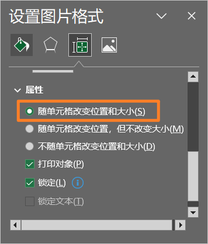

# 通信领域

## 1.1 自动化发邮件

```python
import smtplib
from email.mime.text import MIMEText


def send_email(title: str, content: str, receivers: list[str]):
    """
    发邮件的 demo
    使用的是 163.com 邮箱
    参考：https://zhuanlan.zhihu.com/p/24180606
    错误码：https://blog.csdn.net/pingsha_luoyan/article/details/107582949
    注意 163 邮箱明天最多 600 封！
    :param title: 邮件标题
    :param content: 邮件正文
    :param receivers: 邮件接受方邮箱地址，注意需要[]包裹，这意味着你可以写多个邮件地址群发
    :return:
    """
    # 设置服务器所需信息
    # 163 邮箱服务器地址
    mail_host = 'smtp.163.com'
    # 163 用户名
    mail_user = '13619088487'
    # 密码(部分邮箱为授权码)
    # todo：上面有参考的网址
    mail_pass = ''
    # 邮件发送方邮箱地址
    sender = '13619088487@163.com'

    # 设置email信息
    # 邮件内容设置
    message = MIMEText(content, 'plain', 'utf-8')
    # 邮件主题
    message['Subject'] = title
    # 发送方信息
    message['From'] = sender
    # 接受方信息
    message['To'] = receivers[0]

    # 登录并发送邮件
    try:
        smtpObj = smtplib.SMTP()
        # 连接到服务器
        smtpObj.connect(mail_host, 25)
        # 登录到服务器
        smtpObj.login(mail_user, mail_pass)
        # 发送
        smtpObj.sendmail(
            sender, receivers, message.as_string())
        # 退出
        smtpObj.quit()
        # print('success')
    except smtplib.SMTPException as e:
        print('error', e)  # 打印错误
```

# PDF 自动化

## 1 PyMuPDF

> - https://zhuanlan.zhihu.com/p/517737462

### 1.1 安装与导包

```shell
pip install PyMuPDF
```

```python
import fitz
```

### 1.2 打开文档

```text
doc = fitz.open(filename)
```

这将创建`Document`对象`doc`。也可以从内存数据打开文档，或创建新的空PDF。您还可以将文档用作上下文管理器。

### 1.3 Document 的方法和属性

|       方法/属性       |      描述      |
| :-------------------: | :------------: |
|  Document.page_count  |   页数(int)    |
|   Document.metadata   |  元数据(dict)  |
|  Document.get toc()   | 获取目录(list) |
| Document.load_page( ) |    读取页面    |

### 1.4 获取元数据

`PyMuPDF`完全支持标准元数据。`Document.metadata`是一个具有以下键的 Python 字典。它适用于所有文档类型，但并非所有条目都始终包含数据。元数据字段为字符串，如果未另行指示，则为无。还要注意的是，并非所有数据都始终包含有意义的数据——即使它们不是一个都没有。

|     Key      |             Value             |
| :----------: | :---------------------------: |
|   producer   | producer (producing software) |
|    format    |  format: 'PDF-1.4，EPUB, etc  |
|  encryption  | encryption method used if any |
|    author    |            author             |
|   modDate    |   date of last modification   |
|   keywords   |           keywords            |
|    title     |             title             |
| creationDate |       date of creation        |
|   creator    |     creating application      |
|   subject    |            subject            |

### 1.5 获取目标大纲

```text
toc = doc.get_toc()
```

### 1.6 页面 (Page)

#### 1.6.1 获取

页面处理是`MuPDF`功能的核心。

- 您可以将页面呈现为光栅或矢量（`SVG`）图像，可以选择缩放、旋转、移动或剪切页面。
- 您可以提取**多种格式**的页面文本和图像，并**搜索文本字符串**。
- 对于`PDF`文档，可以使用更多的方法向页面添加文本或图像。

首先，必须创建一个页面`Page`。

这是`Document`的一种方法：

```python
page = doc.load_page(pno)  # 通过页码 load page
page = doc[pno]  # 简写
```

这里可以使用任何整数`-inf<pno<page_count`。负数从末尾开始倒数，所以`doc[-1]`是最后一页，就像Python序列一样。

更高级的方法是将文档用作页面的迭代器：

```python
for page in doc:
    # do something with 'page'
    
# ... or read backwards
for page in reversed(doc):
    # do something with 'page'
    
# ... or even use 'slicing'
for page in doc.pages(start, stop, step):
    # do something with 'page'
```

#### 1.6.2 Page 的常用操作

##### a. 检查页面的链接、批注或表单字段

使用某些查看器软件显示文档时，链接显示为==“热点区域”==。如果您在光标显示**手形符号**时单击，您通常会被带到该热点区域中编码的标记。以下是如何获取所有链接：

```python
# get all links on a page
links = page.get_links()
```

`links`是一个 Python 字典列表。

还可以作为迭代器使用：

```python
for link in page.links():
    # do something with 'link'
```

如果处理PDF文档页面，还可能存在注释（`Annot`）或表单字段（`Widget`），每个字段都有自己的迭代器：

```Python
for annot in page.annots():
    # do something with 'annot'
    
for field in page.widgets():
    # do something with 'field'
```

##### b. 呈现页面

此示例创建页面内容的光栅图像：

```python
pix = page.get_pixmap()
```

`pix`是一个`Pixmap`对象，它（在本例中）包含页面的RGB图像，可用于多种用途。

方法`Page.get_pixmap()`提供了许多用于控制图像的变体：分辨率、颜色空间（例如，生成灰度图像或具有减色方案的图像）、透明度、旋转、镜像、移位、剪切等。

例如：创建RGBA图像（即，包含alpha通道），指定`pix=page.get_pixmap（alpha=True）`。

`Pixmap`包含以下引用的许多方法和属性。其中包括整数**宽度**、**高度**（每个像素）和**跨距**（一个水平图像行的字节数）。属性示例表示表示图像数据的**矩形字节区域**（Python字节对象）。

还可以使用`page.get_svg_image()`创建页面的矢量图像。

##### c. 将页面图像保存到文件中

我们可以简单地将图像存储在`PNG`文件中：

```python
pix.save("page-%i.png" % page.number)
```

##### d. 提取文本和图像

我们还可以以多种不同的形式和细节级别提取页面的所有文本、图像和其他信息：

```python
text = page.get_text(opt)
```

对`opt`使用以下字符串之一以获取不同的格式：

- `"text"`：（默认）带换行符的纯文本。无格式、无文字位置详细信息、无图像
- `"blocks"`：生成文本块（段落）的列表
- `"words"`：生成单词列表（不包含空格的字符串）
- `"html"`：创建页面的完整视觉版本，包括任何图像。这可以通过 internet 浏览器显示
- `"dict"/"json"`：与`HTML`相同的信息级别，但作为Python字典或`resp.JSON`字符串。
- `"rawdict"/"rawjson"`：`"dict"/"json"`的超级集合。它还提供诸如`XML`之类的字符详细信息。
- `"xhtml"`：文本信息级别与文本版本相同，但包含图像。
- `"xml"`：不包含图像，但包含每个文本字符的**完整位置和字体信息**。使用`XML`模块进行解释。

##### e. 搜索文本

您可以找到某个文本字符串在页面上的确切位置：

```Python
areas = page.search_for("mupdf")
```

这将提供一个**矩形列表**，每个矩形都包含一个字符串`“mupdf”`（不区分大小写）。您可以使用此信息来突出显示这些区域（仅限PDF）或创建文档的交叉引用。

### 1.7 PDF 操作

`PDF`是唯一可以使用`PyMuPDF`**修改**的文档类型。其他文件类型是只读的。

但是，您可以将任何文档（包括图像）**转换为PDF**，然后将所有`PyMuPDF`功能应用于转换结果，`Document.convert_to_pdf()`。

`Document.save()`始终将PDF以其当前（可能已修改）状态存储在磁盘上。

通常，您可以选择是保存到新文件，还是仅将修改附加到现有文件（“增量保存”），这通常要快得多。

下面介绍如何操作PDF文档。

#### a. 修改、创建、重新排列和删除页面

有几种方法可以操作所谓页面树（描述所有页面的结构）：

- `Document.delete_page()`和`Document.delete_pages()`删除页面
- `Document.copy_page()`、`Document.fullcopy_page()`和`Document.move_page()`将页面**复制或移动**到同一文档中的其他位置。
- `Document.select()`将PDF压缩到选定页面，参数是要保留的页码序列。这些整数都必须在`0<=i<page_ count`范围内。执行时，此列表中缺少的所有页面都将被删除。剩余的页面将按顺序出现，次数相同！正如您所指定的那样。因此，您可以轻松地使用创建新的PDF：
  - 保存的新文档将包含仍然有效的链接、注释和书签（i.a.w.指向所选页面或某些外部资源）。
  - 第一页或最后10页
  - 仅奇数页或偶数页（用于双面打印）
  - 包含或不包含给定文本的页
  - 颠倒页面顺序
- `Document.insert_page()`和`Document.new_page()`插入新页面。

此外，页面本身可以通过一系列方法进行修改（例如页面旋转、注释和链接维护、文本和图像插入）。

#### b. 连接和拆分PDF文档

方法`Document.insert_pdf()`在不同的pdf文档之间复制页面。下面是一个简单的`joiner`示例（doc1和doc2在PDF中打开）：

```python
# append complete doc2 to the end of doc1
doc1.insert_pdf(doc2)
```

下面是一个**拆分doc1**的片段。它将创建第一页和最后10页的新文档：

```python
doc2 = fitz.open() # new empty PDF
doc2.insert_pdf(doc1, to_page = 9) # first 10 pages
doc2.insert_pdf(doc1, from_page = len(doc1) - 10) # last 10 pages
doc2.save("first-and-last-10.pdf")
```

##### c. 保存

`Document.save()`将始终以当前状态保存文档。

您可以通过指定选项`incremental=True`将更改写回原始PDF。这个过程（通常）非常快，因为更改会**附加**到原始文件，而不会完全重写它。

##### d. 关闭

在程序继续运行时，通常需要“关闭”文档以将底层文件的控制权交给操作系统。

这可以通过`Document.close()`方法实现。除了关闭基础文件外，还将释放与文档关联的缓冲区。

### 小例子：对特定文字标注

> - https://cloud.tencent.com/developer/ask/sof/1372807/answer/1888851

```python
doc: fitz.Document = fitz.open(abs_file)

for page in doc.pages():
    text_instances = page.search_for(search_text)
    for inst in text_instances:
        highlight = page.add_highlight_annot(inst)
        highlight.set_colors(stroke=[1, 0.8, 0.8])  # light red color (r, g, b)
        highlight.update()

doc.save('0.'.join(abs_file.rsplit('.', 1)))
```


# Word 自动化


# Excel自动化

## 1 openpyxl

> 注意：该库是针对于操作或处理```Excel```文件，而不是处理数据！
>
> 例如，更改```Excel```中字体字号，背景颜色，图片大小，插入```Excel```公式等，是应该选择该库的。而处理保存在```Excel```中的数据（重点是**处理数据**），即表单样式的数据，应当选择```pandas```模块。
>
> 哪怕是读写```Excel```文件数据，也应当使用```pandas```模块的```read_excel()```和```to_excel()```函数，使代码更加简洁。只有涉及到对```Excel```**文件内的处理**，才应当考虑使用该模块。

### 1.1 简介

- openpyxl - 读/写 Excel 2010 xlsx/xlsm 文件的 Python 库
- [官方文档](https://openpyxl-chinese-docs.readthedocs.io/zh_CN/latest/index.html)
- 由于我之前该库的入门知识，所以本部分仅记录我**现在学的进阶的知识点**。
- 入门可参考这本书：Python编程快速上手—让繁琐工作自动化(Automate the boring stuff with python) (Al, Sweigart 王海鹏) (z-lib.org)

### 1.2 图片处理

自己开个```Excel```，随便丢张图片进去...

- 获得图片对象

  ```python
  workbook = load_workbook(r'C:\Users\lenovo\Desktop\1.xlsx')
  worksheet = workbook.active
  for image in worksheet._images:
      print(image)  # openpyxl.drawing.image.Image
  ```

- 添加图片

  ```python
  from openpyxl.drawing.image import Image
  
  image = Image(r'logo.png')
  worksheet.add_image(image)
  ```

  ```add_image()```函数源码如下。```anchor```参数在此处，可传一个字符串，表示插入的这张图片的左上角位于哪一个单元格，例如```anchor='A7'```。当然也可以传入其他参数，会```anchor```部分细说。

  ```python
  def add_image(self, img, anchor=None):
      """
      Add an image to the sheet.
      Optionally provide a cell for the top-left anchor
      """
      if anchor is not None:
          img.anchor = anchor
      self._images.append(img)
  ```

- 图片对象

  ```openpyxl.drawing.image.Image```，即```add_image()```函数的第一个参数。

  - 属性

    - ```anchor```：会在后面细说。如果是一个字符串，表示这张图片的左上角位于哪一个单元格。

    - ```width```和```height```：图片大小，单位为像素。底层由```Pillow```模块读取图像。

  - 方法

    - ```_data()```：返回图片的二进制数据。
    - ```path()```：返回图片在压缩包的路径。（本质上```Excel```是一个压缩包，可改后缀为```.zip```感受。）

  ```python
  for image in worksheet._images:
      print(image.path)  # /xl/media/image1.png
      with open('pic.jpg', mode='wb') as f:
          f.write(image._data())
  ```

- ```anchor```对象

  > 参考：如何用python向excel中以嵌入单元格的方式插入图片？ - 中等难度的贪吃蛇的回答 - 知乎 https://www.zhihu.com/question/545128505/answer/2592296060

  为了解决插入的图片是有这个属性，才学了```anchor```对象

  

  方法```openpyxl.drawing.spreadsheet_drawing.AnchorMarker()```用于标记一个**锚点**，方法```openpyxl.drawing.spreadsheet_drawing.TwoCellAnchor()```用于将两个锚点组合成一个**锚点对**，将图片的`anchor`属性设置为这个锚点对，插入图片时即可获得上述效果。

  其中，```AnchorMarker()```方法接收四个参数，分别是列号、列偏移、行号、行偏移。列号与行号表示锚点所在的单元格坐标，从0开始。两个偏移量则表示锚点相对于单元格左上角的偏移量。

  例如，以下代码表示锚点位于`A1`单元格的左上角：

  ```python
  AnchorMarker(0, 0, 0, 0)
  ```

  以下代码表示锚点位于`C5`单元格的左上角：

  ```python3
  AnchorMarker(2, 0, 4, 0)
  ```

  偏移量为正表示锚点向右/向下偏移，为负则是向左/向上。它的单位非常小（因此数值要设得很大才能看到效果，这可能是为了即便表格缩放至最大，也能精细地调整对象的位置）。以下代码表示锚点位于`A1`单元格离左上角有些许距离（向右下方偏移）的位置：

  ```python3
  AnchorMarker(0, 50000, 0, 50000)
  ```

  以下代码表示锚点位于`C5`单元格向左上方有些许偏移的位置：

  ```python3
  AnchorMarker(2, -50000, 4, -50000)
  ```

  注意此时这个锚点落在了`B4`单元格内，但它**所属的单元格仍然是`C5`**。

  `TwoCellAnchor()`方法接收三个参数，第一个参数需要字符串形式的**描述**，设置锚点对时这个参数应设为`'twoCell'`。第二和第三个参数则分别是两个由`AnchorMarker()`方法生成的锚点。

  以下代码将上述两个锚点组合成锚点对放进变量`anchor`：

  ```python3
  _from = AnchorMarker(0, 50000, 0, 50000)
  to = AnchorMarker(2, -50000, 4, -50000)
  anchor = TwoCellAnchor('twoCell', _from, to)
  ```

  所以，下面这个捏：

  ```py
  from openpyxl import load_workbook
  from openpyxl.drawing.image import Image
  from openpyxl.drawing.spreadsheet_drawing import TwoCellAnchor, AnchorMarker
  
  wb = load_workbook(r'C:\Users\lenovo\Desktop\11.xlsx')
  worksheet = wb.active
  
  # 设置图片锚点和大小
  _from = AnchorMarker(col=4, colOff=0, row=4, rowOff=0)
  to = AnchorMarker(col=5, colOff=47543, row=6, rowOff=154242)
  anchor = TwoCellAnchor('twoCell', _from, to)
  
  image = Image(r'pic.jpg')
  image.anchor = anchor
  image.width, image.height = 100, 100
  
  # 将图片插入到目标Excel文件中
  worksheet.add_image(image)
  
  wb.save(r'C:\Users\lenovo\Desktop\110.xlsx')
  ```

  - [图片单元格居中](https://blog.csdn.net/chenliang1038/article/details/121659981)
  
  ```python
  import openpyxl
  from openpyxl.styles import Alignment, Font, PatternFill, Border
  import logging
  from openpyxl.cell.cell import get_column_letter
  from openpyxl.drawing.image import Image
  from openpyxl.drawing.xdr import XDRPoint2D, XDRPositiveSize2D
  from openpyxl.drawing.spreadsheet_drawing import AnchorMarker, OneCellAnchor
  from openpyxl.utils.units import pixels_to_EMU
  
  logger = logging.getLogger('error')
  
  
  def insert_image(worksheet, start_row, start_col, height, image_url, image_size=None):
      """
      # 计算图片大小 img_size[0]=180; img_size[1]=80
      :param worksheet:  openpyxl.Worksheet对象
      :param start_row:   # 哪一行开始
      :param start_col:   # 那一列
      :param height:      # 合并了多少行
      :param image_url:   # 图片路径
      :param image_size:  # 在excel中图片显示的最大宽高
      :return:  # None
      """
      try:
          # 像素转换为EMU
          p2e = pixels_to_EMU
          # 获取图片
          img = Image(image_url)
          # 计算原图片的宽高比例
          per = img.width / img.height
          # 固定图片高为80，通过（原图片宽高比例）计算出宽为多少
          shr_image_width = image_size[1] * per  # w:h     shr_image_width:80
          # 计算出的宽高
          img_size = shr_image_width, image_size[1]
          # 如果图片的宽大于160，就以宽为固定边为160，计算高
          if shr_image_width > image_size[0]:
              shr_image_height = image_size[0] / per  # w:h     150:shr_image_hieght
              # 计算出实际的宽高
              img_size = image_size[0], shr_image_height
          # 把原图片固定为实际的宽高
          img.height, img.width = img_size
          # 计算出图片在excel中位置，是图片的大小
          size = XDRPositiveSize2D(p2e(img.height), p2e(img.width))
          # 设置图片在左右居中
          col_letter = get_column_letter(start_col)  # 定位哪一列
          width = worksheet.column_dimensions[col_letter].width
          _col = int((width * 8 - img.height) / 2)   # 左右偏移量，左右相等就居中
          # 设置图片上下居中（因为行方向合并了多个单元格）
          h2_lst = []   # 每个单元格累计的高度
          acc_height = 0
          for row in range(start_row, start_row + height):
              h = worksheet.row_dimensions[row].height
              if not h:
                  worksheet.row_dimensions[row].height = 15
                  acc_height += 15
                  h2_lst.append(int(acc_height * 20 / 15))
              else:
                  acc_height += h
                  h2_lst.append(int(acc_height * 20 / 15))
          h2_lst.insert(0, 0)   # 从0开始
          top = int((h2_lst[-1] - img.width) / 2)  # 距离顶部的距离
          pos = []
          for nid, ele in enumerate(h2_lst):
              if top < ele:
                  pos.append((nid, top))
          row = start_row + pos[0][0] - 1    # 定位哪一行
          index = pos[0][0]
          _row = pos[0][1] - h2_lst[index]   # 上下偏移量（相对于这个单元格）
          # 相对于单元格内的(x,y,top,left)偏移量
          marker = AnchorMarker(col=start_col - 1, colOff=p2e(_col), row=row, rowOff=p2e(_row))
          img.anchor = OneCellAnchor(_from=marker, ext=size)
          worksheet.add_image(img)
      except Exception as e:
          logger.error(e)
          pass
  
  
  if __name__ == '__main__':
      wb = openpyxl.Workbook()
      ws = wb.active
      ws.merge_cells(start_row=5, end_row=14, start_column=5, end_column=5)
      col_letter = get_column_letter(5)  # 定位哪一列
      ws.column_dimensions[col_letter].width = 25
      insert_image(ws, 5, 5, 9, '111.jpg', (160, 80))
      wb.save('xxx.xlsx')
  ```
  
  


