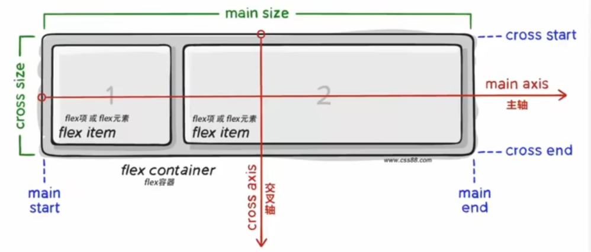

#  day 01

# 一、字体图标

展示的是图标，本质上是字。处理简单的、颜色单一的图片

## 1 使用

- 引入字体图标样式表

  ```html
  <link rel="stylesheet" href="./iconfont/iconfont.css">
  ```

- 调用图标对应的类名，需要两个类名

  - iconfont类：基本样式
  - icon-xxx：图标对应的类名

```html
<!DOCTYPE html>
<html lang="en">
<head>
    <meta charset="UTF-8">
    <meta http-equiv="X-UA-Compatible" content="IE=edge">
    <meta name="viewport" content="width=device-width, initial-scale=1.0">
    <title>Document</title>
    <link rel="stylesheet" href="./iconfont/iconfont.css">
    <style>
        .iconfont {
            font-size: 300px;
            color: skyblue;
        }
    </style>
</head>
<body>
    <span class="iconfont icon-fabulous"></span>
</body>
</html>
```

## 2 案例：淘宝购物车

```html
<!DOCTYPE html>
<html lang="en">
<head>
    <meta charset="UTF-8">
    <meta http-equiv="X-UA-Compatible" content="IE=edge">
    <meta name="viewport" content="width=device-width, initial-scale=1.0">
    <title>Document</title>
    <link rel="stylesheet" href="./iconfont/iconfont.css">
    <style>
        * {
            margin: 0;
            padding: 0;
        }
        a {
            color: #333;
            text-decoration: none;
        }
        li {
            list-style: none;
        }
        .nav {
            width: 300px;
            margin: 50px auto;
        }
        .icon-ashbin {
            color: orange;
        }
        .icon-ashbin, 
        .icon-arrow-right {
            font-size: 50px;
        }
        .nav a span {
            font-size: 50px;
        }
    </style>
</head>
<body>
    <div class="nav">
        <ul>
            <li>
                <a href="#">
                    <span class="iconfont icon-ashbin"></span>
                    <span>购物车</span>
                    <span class="iconfont icon-arrow-right"></span>
                </a>
            </li>
        </ul>
    </div>
</body>
</html>
```

# 二、平面转换

## 1 介绍

- 使用```transform```属性实现元素的位移、旋转、缩放等效果
- 平面转换
  - 改变盒子在平面内的形态（位移、旋转、缩放）
  - 也叫 2D转换
- 属性名：```transform```


## 2 位移

### 2.1 位移简介

```transform: translate(水平移动距离, 垂直移动距离)```

- 取值（正负都可）

  - 像素单位

  - 百分百（参考盒子自身的尺寸计算）

  - X轴正向为右，Y轴正向为下

    

  - 技巧

    - 只给一个值，表示X轴的
    - 单独设置某个方向的
      - ```translateX()```
      - ```translateY()```

```html
<!DOCTYPE html>
<html lang="en">
<head>
    <meta charset="UTF-8">
    <meta http-equiv="X-UA-Compatible" content="IE=edge">
    <meta name="viewport" content="width=device-width, initial-scale=1.0">
    <title>Document</title>
    <style>
        .father {
            width: 500px;
            height: 300px;
            margin: 50px auto;
            border: 1px solid #000;
        }
        .son {
            width: 200px;
            height: 100px;
            background-color: pink;
            /* 加一个过渡 */
            transition: all 0.4s;
        }
        .father:hover .son {
            transform: translate(50px, 100px);
            /* 百分百参考自身的尺寸计算结果 */
            transform: translate(100%, 100%);
            /* 由于有层叠性，只有最后一个生效 */

            transform: translateX(50px);
        }
    </style>
</head>
<body>
    <div class="father">
        <div class="son">
        </div>
    </div>
</body>
</html>
```

### 2.2 绝对定位元素居中的两个方法

```html
<!DOCTYPE html>
<html lang="en">
<head>
    <meta charset="UTF-8">
    <meta http-equiv="X-UA-Compatible" content="IE=edge">
    <meta name="viewport" content="width=device-width, initial-scale=1.0">
    <title>Document</title>
    <style>
        .father {
            position: relative;
            width: 500px;
            height: 300px;
            margin: 50px auto;
            border: 1px solid #000;
        }
        .son {
            position: absolute;
            left: 50%;
            top: 50%;
            
            /* 以前学的 */
            /* margin-left: -100px;
            margin-top: -50px; */

            /* 位移实现 */
            transform: translate(-50%, -50%);

            width: 200px;
            height: 100px;
            background-color: pink;
        }
    </style>
</head>
<body>
    <div class="father">
        <div class="son">
        </div>
    </div>
</body>
</html>
```

### 2.3 案例：双开门

```html
<!DOCTYPE html>
<html lang="en">
<head>
    <meta charset="UTF-8">
    <meta http-equiv="X-UA-Compatible" content="IE=edge">
    <meta name="viewport" content="width=device-width, initial-scale=1.0">
    <title>Document</title>
    <style>
        * {
            margin: 0;
            padding: 0;
        }
        .box {
            /* 超出父级的隐藏 */
            overflow: hidden;
            width: 1366px;
            height: 600px;
            margin: 0 auto;
            background-image: url(./images/bg.jpg);
        }
        .box::before,
        .box::after {
            float: left;
            content: '';
            width: 50%;
            height: 100%;
            background-image: url(./images/fm.jpg);
            transition: all 0.4s;
        }
        .box::after {
            background-position: right 0;
        }
        .box:hover::before {
            transform: translateX(-100%);
        }
        .box:hover::after {
            transform: translateX(100%);
        }
    </style>
</head>
<body>
    <div class="box">
    </div>
</body>
</html>
```

## 3 旋转

### 3.1 旋转简介

- 语法：```transform: rotate deg```
- 取值正负都可
  - 正为顺时针
  - 负为逆时针

```html
<!DOCTYPE html>
<html lang="en">
<head>
    <meta charset="UTF-8">
    <meta http-equiv="X-UA-Compatible" content="IE=edge">
    <meta name="viewport" content="width=device-width, initial-scale=1.0">
    <title>Document</title>
    <style>
        img {
            width: 250px;
            transition: all 5s;
        }
        img:hover {
            transform: rotate(-360deg);
        }
    </style>
</head>
<body>
    
</body>
</html>
```

### 3.2 转换原点

- 语法
  - 默认原点是盒子中心点
  - ```transform-origin: 原点水平位置 原点垂直位置```
  - 添加给标签本身，而不是```hover```
- 取值
  - **方位名词**
    - ```left```、```top```、```bottom```、```right```、```center```
  - 像素单位数值
  - 百分比

```html
<!DOCTYPE html>
<html lang="en">
<head>
    <meta charset="UTF-8">
    <meta http-equiv="X-UA-Compatible" content="IE=edge">
    <meta name="viewport" content="width=device-width, initial-scale=1.0">
    <title>Document</title>
    <style>
        img {
            width: 250px;
            border: 1px solid #503;
            transition: all 2s;
            transform-origin: right bottom;
        }
        img:hover {
            transform: rotate(360deg);
        }
    </style>
</head>
<body>
    
</body>
</html>
```

### 3.3 多重转换

```transform: translate(600px) rotate(360deg);```

> 旋转会改变指标轴向，所以如果先是旋转，再位移，就会奇奇怪怪
>
> 也不能分开写，否则会发生层叠
>
> ```css
> transform: translate(600px)
> transform: rotate(360deg)
> ```

```html
<!DOCTYPE html>
<html lang="en">
<head>
    <meta charset="UTF-8">
    <meta http-equiv="X-UA-Compatible" content="IE=edge">
    <meta name="viewport" content="width=device-width, initial-scale=1.0">
    <title>Document</title>
    <style>
        .box {
            width: 800px;
            height: 200px;
            margin: 50px auto;
            border: 1px solid #000;
        }
        img {
            height: 200px;
            transition: all 2s;
        }
        .box:hover img {
            transform: translate(600px) rotate(360deg);
        }
    </style>
</head>
<body>
    <div class="box">
        
    </div>
</body>
</html>
```

## 4 缩放

### 4.1 缩放简介

- 语法
  - ```transform: scale(X轴缩放倍数, Y轴缩放倍数)```
- 提示
  - 如果只有一个，就是x和y


```html
<!DOCTYPE html>
<html lang="en">
<head>
    <meta charset="UTF-8">
    <meta http-equiv="X-UA-Compatible" content="IE=edge">
    <meta name="viewport" content="width=device-width, initial-scale=1.0">
    <title>Document</title>
    <style>
        .box {
            width: 300px;
            height: 210px;
            margin: 100px auto;
            background-color: pink;
        }
        .box img {
            width: 100%;
            transition: all 0.5s;
        }
        .box:hover img {
            transform: scale(1.2);
        }
    </style>
</head>
<body>
    <div class="box">
        
    </div>
</body>
</html>
```

### 4.2 案例：和平精英

> 绝对定位的盒子如何居中？
>
> 如何处理```transform```层叠的bug

```html
<!DOCTYPE html>
<html lang="en">
<head>
    <meta charset="UTF-8">
    <meta http-equiv="X-UA-Compatible" content="IE=edge">
    <meta name="viewport" content="width=device-width, initial-scale=1.0">
    <title>Document</title>
    <style>
        * {
            margin: 0;
            padding: 0;
        }
        li {
            list-style: none;
        }
        img {
            width: 100%;
        }
        .box {
            width: 249px;
            height: 210px;
            margin: 50px auto;
            /* .box 外的看不见 */
            overflow: hidden;
        }
        .box p {
            color: #3b3bb3;
            padding: 10px 10px 0 10px;
        }
        .box .pic {
            position: relative;
        }
        .box ul li .pic::after {
            position: absolute;
            content: "";
            left: 50%;
            top: 50%;

            /* 定位的居中：移回去 */
            margin-left: -29px;
            margin-top: -29px;
            /* 如果 transform: translate(-50%, -50%) 不会生效 因为会被下面的层叠 只能这样 */
            /* transform: translate(-50%, -50%) scale(5); */
            
            width: 58px;
            height: 58px;
            background-image: url(./images/play.png);

            /* 特别大 */
            transform: scale(5);
            opacity: 0;
            transition: all 0.2s;
        }
        .box ul li:hover .pic::after {
            transform: scale(1);
            /* 解决上面那个 bug  */
            /* transform: translate(-50%, -50%) scale(1); */
            opacity: 100%;
        }
    </style>
</head>
<body>
    <div class="box">
        <ul>
            <li>
                <div class="pic">
                    
                    <!-- 伪元素 -->
                </div>
                <p>【和平精英】“初火”音乐概念片：四圣觉醒</p>
            </li>
        </ul>
    </div>
</body>
</html>
```

# 三、渐变

## 1 简介

- 多个颜色逐渐变化的视觉效果
- 一般是盒子的背景

```html
<style>
    .box {
        width: 300px;
        height: 200px;
        background-image: linear-gradient(pink, green, blue);

        /* 工作中更这么用 */
        background-color: pink;
        background-image: linear-gradient(transparent, rgba(0, 0, 0, 0.6));
    }
</style>
```

# 四、综合案例：华为新闻

> 平面转换+缩放

# day 02

# 一、空间转换

## 1 介绍


## 2 位移

- 语法

  - ```transform: translate3d(x, y, z)```
  - ```transform: translateX(x)```
  - ```transform: translateY(x)```
  - ```transform: translateZ(x)```
- 取值
  - 像素单位数值
  - 百分百

## 3 透视

- 近大远小，近实远虚
- 加给父级
- 属性名：```perspective```
- 属性值：像素单位数值，一般是800-1200
- 透视距离也称视距，就是人的眼睛到屏幕的距离


```html
<!DOCTYPE html>
<html lang="en">
<head>
    <meta charset="UTF-8">
    <meta http-equiv="X-UA-Compatible" content="IE=edge">
    <meta name="viewport" content="width=device-width, initial-scale=1.0">
    <title>Document</title>
    <style>
        body {
            perspective: 1000px;
        }
        .box {
            width: 200px;
            height: 200px;
            margin: 100px auto;
            background-color: coral;
            transition: all 0.5s;
        }
        .box:hover {
            transform: translateZ(200px);
        }
    </style>
</head>
<body>
    <div class="box"></div>
</body>
</html>
```

## 4 空间旋转

- 语法

  - ```transfrom: rotateX(值)```
  - ```transfrom: rotateY(值)```
  - ```transfrom: rotateZ(值)```（和```rotate```效果一样）

- x轴

  ```python
  <!DOCTYPE html>
  <html lang="en">
  <head>
      <meta charset="UTF-8">
      <meta http-equiv="X-UA-Compatible" content="IE=edge">
      <meta name="viewport" content="width=device-width, initial-scale=1.0">
      <title>Document</title>
      <style>
          .box {
              width: 200px;
              margin: 100px auto;
              perspective: 1000px;
          }
          img {
              width: 300px;
              transition: all 0.7s;
          }
          .box img:hover {
              transform: rotateX(60deg);
          }
      </style>
  </head>
  <body>
      <div class="box">
          
      </div>
  </body>
  </html>
  ```

- y轴

  一样的

- 拓展

  自定义旋转轴的位置及旋转角度

  ```rotate3d(x, y, z 角度度数)```

  x, y, z取值为0-1之间的数字

## 5 立体呈现

- 实现方法
  - 父级添加```transform-style: preserve-3d```
  - 子元素则处于真正的3d空间
  - 默认是```flat```，即子元素处于2d平面呈现

```html
<!DOCTYPE html>
<html lang="en">
<head>
    <meta charset="UTF-8">
    <meta http-equiv="X-UA-Compatible" content="IE=edge">
    <meta name="viewport" content="width=device-width, initial-scale=1.0">
    <title>Document</title>
    <style>
        .cube {
            position: relative;
            width: 200px;
            height: 200px;
            margin: 100px auto;
            /* background-color: palegreen; */
            transition: all 1s;
            transform-style: preserve-3d;
        }
        .cube div {
            width: 200px;
            height: 200px;
        }
        .front {
            position: absolute;
            background-color: bisque;
        }
        .back {
            position: absolute;
            background-color: cadetblue;
            transform: translateZ(-200px);
        }
        .cube:hover {
            transform: rotateY(180deg);
        }
    </style>
</head>
<body>
    <div class="cube">
        <div class="front">前面</div>
        <div class="back">后面</div>
    </div>
</body>
</html>
```

## 6 空间缩放

- ```transform: scaleX(倍数)```
- ```transform: scaleY(倍数)```
- ```transform: scaleZ(倍数)```
- ```transform: scale3d(x, y, z)```

# 二、动画

## 1 简介

- 两个状态是过渡
- 多个状态就是动画效果了
- 过程可控：重复播放、最终画面、是否暂停

## 2 语法

- 属性名

  - ```animation```

- 定义动画

  - 方法一

    ```html
    @keyframes 动画名称 {
      from {}
      to {}
    }
    ```

  - 方法二

    ```html
    @keyframes 动画名称 {
      0% {}
      10% {}
      15% {}
      100% {}
    }
    ```

- 使用动画

  ```html
  animation: 动画名称 动画花费时长;
  ```

## 3 简单使用

```html
<!DOCTYPE html>
<html lang="en">
<head>
    <meta charset="UTF-8">
    <meta http-equiv="X-UA-Compatible" content="IE=edge">
    <meta name="viewport" content="width=device-width, initial-scale=1.0">
    <title>Document</title>
    <style>
        .box {
            width: 200px;
            height: 100px;
            background-color: antiquewhite;
            /* 使用动画 */
            animation: change2 1s;
        }
        /* 定义动画 1 */
        @keyframes change1 {
            from {
                width: 200px;
            }
            to {
                width: 600px;
            }
        }
        /* 定义动画 2 */
        @keyframes change2 {
            0% {
                width: 200px;
                height: 100px;
            }
            30% {
                width: 500px;
                height: 300px;
            }
            100% {
                width: 800px;
                height: 300px;
            }
        }
    </style>
</head>
<body>
    <div class="box"></div>
</body>
</html>
```

## 4 动画属性

- 属性名：```animation: 动画名称 动画时长 速度曲线 延迟时间 重复次数 动画方向 执行完毕时状态```
- 属性值：
  - 速度曲线
    - ```lines```：匀速
    - ```steps(num)```：类似于帧
    
  - 重复次数
  
    - ```num```：具体次数
    - ```infinite```：无限循环
  
  - 动画方向
  
    - ```alternate```：反复
  
  - 执行完毕时状态
  
    > 删掉```infinite```和```alternate```
  
    - ```backward```：默认值，第一帧状态
    - ```forrwards```：最后一帧状态
- 注意

  - 动画名称和动画时长必须赋值
  - 不分先后顺序
  - 两个时间值，则第一个是动画时长 第二个是延迟时间

## 5 拆分写法*

|              属性               |        作用        |                             取值                             |
| :-----------------------------: | :----------------: | :----------------------------------------------------------: |
|      ```animation-name```       |      动画名称      |                                                              |
|    ```animation-duration```     |      动画时长      |                                                              |
|      ```animation-delay```      |      延迟时间      |                                                              |
|    ```animation-fill-mode```    | 动画执行完毕是状态 | ```backward```：默认值，第一帧状态<br> ```forrwards```：最后一帧状态 |
| ```animation-timing-function``` |      速度曲线      |                 ```steps(数字)```：逐帧动画                  |
| ```animation-iteration-count``` |      重复次数      |                   ```infinite```：无限循环                   |
|    ```animation-direction```    |    动画执行方向    |                    ```alternate```：反向                     |
|   ```animation-play-state```    |      暂停动画      |         ```paused```为暂停，通常搭配```:hover```使用         |

## 6 逐帧动画

- 补间动画和逐帧动画
  - 补间动画不配合精灵图，使用更多
  - 逐帧动画配合精灵图
  
- 使用

  - ```animation-timing-function: steps(N)```

    - 将动画过程等分为N份

  - 步骤

    - 准备显示区域

      盒子大小是精灵图一个图的大小，背景图为当前精灵图

    - 定义动画

      改变背景图位置，移动距离是精灵图的宽度

    - 使用动画

      - 速度曲线```step(N)```，N和精灵图上小图个数相同
      - 添加无限重复效果

  - 多个动画

    ```html
    animation: 
      动画1,
      动画2,
      动画N
    ;
    ```

  - 如果动画的开始状态和盒子的默认样式相同，可以省略开始状态的代码


```html
<!DOCTYPE html>
<html lang="en">
<head>
    <meta charset="UTF-8">
    <meta http-equiv="X-UA-Compatible" content="IE=edge">
    <meta name="viewport" content="width=device-width, initial-scale=1.0">
    <title>Document</title>
    <style>
        .box {
            width: 140px;
            height: 140px;
            /* border: 1px solid; */
            background-image: url(../images/bg.png);
            animation: 
              move 1s steps(12) infinite, 
              run 2s forwards
            ;
        }
        @keyframes move {
            /* 可以不加这个东西哦 */
            /* from {
                background-position: 0 0;
            } */
            to {
                background-position: -1680px 0;
            }
        }
        @keyframes run {
            /* from {
                transform: translateX(0);
            } */
            to {
                transform: translateX(800px);
            }
        }
    </style>
</head>
<body>
    <div class="box"></div>
</body>
</html>
```


# 三、综合案例

## 1 3D导航


```html
<!DOCTYPE html>
<html lang="en">
<head>
    <meta charset="UTF-8">
    <meta http-equiv="X-UA-Compatible" content="IE=edge">
    <meta name="viewport" content="width=device-width, initial-scale=1.0">
    <title>Document</title>
    <style>
        ul {
            margin: 0;
            padding: 0;
            list-style: none;
        }
        .navs {
            width: 300px;
            height: 40px;
            margin: 50px auto;
        }
        .navs li {
            float: left;
            width: 100px;
            height: 40px;
            line-height: 40px;
            transform-style: preserve-3d;
            transition: all 0.5s;
            /* 辅助 */
            /* transform: rotateX(-20deg) rotateY(30deg); */
            /* 3d 缩放 */
            transform: scale3d(0.5, 1.1, 5);
        }
        .navs li a {
            position: absolute;
            display: block;
            width: 100%;
            height: 100%;
            text-align: center;
            text-decoration: none;
            color: aliceblue;
        }
        .navs li a:first-child {
            background-color: green;
            /* 移动 */
            transform: translateZ(20px);
        }
        .navs li a:last-child {
            background-color: orange;
            /* 放倒 移动 */
            transform: rotateX(90deg) translateZ(20px);
        }
        .navs li:hover {
            transform: rotateX(-90deg);
        }
    </style>
</head>
<body>
    <div class="navs">
        <ul>
            <li>
                <a href="#">首页</a><a href="#">index</a>
            </li>
            <li>
                <a href="#">登录</a><a href="#">login</a>
            </li>
            <li>
                <a href="#">注册</a><a href="#">register</a>
            </li>
        </ul>
    </div>
</body>
</html>
```

## 2 走马灯

> 逐帧动画 无缝动画

```html
<!DOCTYPE html>
<html lang="en">
<head>
    <meta charset="UTF-8">
    <meta http-equiv="X-UA-Compatible" content="IE=edge">
    <meta name="viewport" content="width=device-width, initial-scale=1.0">
    <title>Document</title>
    <style>
    * {
        padding: 0;
        margin: 0;
      }
      li {
        list-style: none;
      }
      img {
        width: 200px;
      }
      .box {
        width: 600px;
        height: 112px;
        border: 5px solid #000;
        margin: 100px auto;
        overflow: hidden;
      }
      .box ul {
        width: 2000px;
        animation: move 5s infinite linear;
      }
      .box li {
        float: left;
      }
      @keyframes move {
        to {
            transform: translateX(-1400px)
        }
      }
      .box:hover ul {
        animation-play-state: paused
      }
    </style>
</head>
<body>
    <div class="box">
        <ul>
          <li></li>
          <li></li>
          <li></li>
          <li></li>
          <li></li>
          <li></li>
          <li></li>
          <!-- 第567移动的时候,显示区域不能留白 -->
          <li></li>
          <li></li>
          <li></li>
        </ul>
      </div>
</body>
</html>
```

## 3 全民出游季

> 动画综合使用

# day 03

# 一、移动端特点

## 1 PC网页和移动端网页的区别

- PC屏幕**大**，网页固定版心
- 手机屏幕**小**，网页宽度多为100%

## 2 谷歌模拟器

## 3 屏幕分辨率

## 4 视口

> 视口标签由vosecode自动生成
>
> 视口标签会默认HTML的宽度和设备宽度（逻辑分辨率）相同，若没有则宽度为```980px```

```html
<meta name="viewport" content="width=device-width, initial-scale=1.0">
```

## 5 二倍图


# 二、百分比布局

## 1 简介

- 百分比布局，也叫流式布局
- 效果：**宽度自适应，高度固定**
- 古老的布局方式

## 2 京东

```html
<style>
    * {
        margin: 0;
        padding: 0;
    }
    li {
        list-style: none;
    }
    .toolbar {
        /* 固定定位 */
        position: fixed;
        bottom: 0;
        /* 百分比布局 流式布局 */
        width: 100%;
        height: 50px;
        background-color: pink;
    }
    .toolbar li img {
        height: 100%;
    }
    .toolbar li {
        float: left;
        width: 20%;
        height: 50px;
    }
</style>
```

# 三、Flex布局

## 1 简介

- Flex布局/弹性布局

  - 是一种**浏览器提倡**的**布局模型**
  - 布局网页更**简单**、**灵活**
  - 避免**浮动脱标**问题
  - IE 不兼容

- 查询是否兼容

  https://caniuse.com/

## 2 使用方法

- 给父元素添加```display: flex```，则子元素可以自动的挤压或拉伸

- 组成部分

  - 弹性容器
  - 弹性盒子
  - **主轴**：默认水平方向。弹性盒子默认排列方向。
  - **侧轴/交叉轴**：默认垂直方向

  


## 3 主轴对齐方式

> 通过调节主轴或侧轴的对齐方式，来设置盒子之间的间距

属性名：```justify-content```

|       属性值        |                        作用                        |
| :-----------------: | :------------------------------------------------: |
|  ```flex-start```   |              默认值，起点开始依次排列              |
|   ```flex-end```    |                  终点开始依次排列                  |
|    ```center```     |                   沿主轴居中排列                   |
| ```space-around```  |  弹性盒子沿主轴均匀排列，空白间距分在弹性盒子两侧  |
| ```space-between``` |  弹性盒子沿主轴均匀排列，空白间距分在相邻盒子之间  |
| ```space-evenly```  | 弹性盒子沿主轴均匀排列，弹性盒子与容器之间间距相等 |

## 4 侧轴对齐方式

- 属性名
  - ```align-items```：添加到弹性容器
  - ```align-self```：添加到弹性盒子，控制某个弹性盒子在侧轴的对齐方式

|      属性值      |                            作用                            |
| :--------------: | :--------------------------------------------------------: |
| ```flex-start``` |                  默认值，起点开始依次排列                  |
|  ```flex-end```  |                      终点开始依次排列                      |
|   ```center```   |                       沿侧轴居中排列                       |
|  ```stretch```   | 默认值，弹性盒子沿主轴线被拉伸至铺满容器（但是要注释高度） |

- 注意
  - 当弹性盒子没给宽高，给了```stretch```或没给（此时仍是默认的```stretch```），则会默认拉伸铺满
  - 若没给宽高，是其他属性值，则高度和内容相同

## 5 伸缩比

- 属性名：```flex```
- 属性值：数值（整数）。占用父盒子剩余尺寸

# 四、小兔鲜儿移动端

支付页面

# day 04

# 一、Flex布局

## 1 主轴方向

属性名：```flex-direction```

|        属性值        |        作用        |
| :------------------: | :----------------: |
|      ```row```       | 行，水平（默认值） |
|   **```column```**   |    **列，垂直**    |
|  ```row-reverse```   |    行，从右到左    |
| ```column-reverse``` |    列，从下到上    |

## 2 居中

```html
<style>
    .box li {
        display: flex;
        /* 现在主轴在垂直方向 */
        flex-direction: column;
        /* 侧轴居中 此时侧轴横着的 即水平居中 */
        align-items: center;
        /* 主轴居中 此时主轴竖着的 即垂直居中 */
        justify-content: center;

        width: 80px;
        height: 80px;
        border: 1px solid #ccc;
    }
</style>
```

## 3 弹性盒子换行

- 使用
  - 属性：```flex-wrap```
  - 属性值：
    - ```wrap```：换行
    - ```nowrap```：不换行，默认值

- 行距
  - 换行后有默认的行距
  - 调整
    - 属性名：```align-content```
    - 属性值：和```justify-content```的属性值基本上一样


# 三、小兔鲜儿PC


