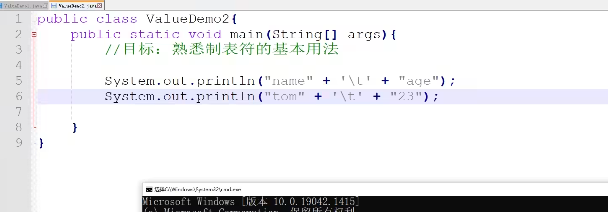

# day 00

## 1 说明文件

鄙人不才，学过```python```，所以这个笔记比较飞，极其基础的就没有记录了...

## 2 idea的快捷键

- ```ctrl+alt+a```：在方法上使用，会自动补全接收方法返回值的变量。
- ```shift+f6```：批量选中变量名以修改。
- ```ctrl+alt+m```：把选中的代码抽取到一个新的方法中，并提供友好的方法命名方式。
- ```ctrl+alt+t```：可供选择使用什么函数快速包裹选中的代码。
- ```ctrl+alt+←```：回到光标上一处。
- ```ctrl+F12```：展开类的大纲
- ```alt+7```：罗列大纲
- ```ctrl+p```：看方法形参
- ```ctrl+alt+l```：格式化代码

# day 01

## 一、Java入门

### 1 cmd

- ```盘符名称:```：盘符切换
- ```dir```：当前路径下内容
- ```cd ..```：回退上一级目录
- ```cd 目录1\目录2\```：进入多级目录
- ```cd \```：回退到根目录
- ```cls```：清屏
- ```exit```：退出

### 2 HelloWorld 案例

```java
public class A {  // public 暂时理解为：类名和文件名一直
	public static void main (String[] args) {  // 入口
		System.out.println("hellow java");  // 输出语句
	}
}
```

### 3 java三大分类

- ```JavaSE```
- ~~```JavaME```~~
- ```JavaEE```

### 4``` JDK```的组成

- ```JDK```（Java Development Kit）：Java开发工具包
- ```JRE```（Java Runtime Environment）：Java的运行环境
- ```JVM```（Java Virtual Machine）：Java虚拟机 真正运行Java的地方
- 核心类库：Java自己写好的程序


## 二、IDEA下载

### 1 项目结构

- ```project```：项目、工程
- ```module```：模块
- ```package```：包
- ```class```：类

## 三、Java基础概念

### 1 注释

#### 1.1 单行注释

```// 注释信息```

#### 1.2 多行注释

```/* 注释信息 */```

#### 1.3 文档注释

```/** 注释信息 */```

### 2 关键字

#### 2.1 什么是

被Java赋予了特定含义的英文单词。

全部**小写**。

#### 2.1 class

```class```关键字用于创建或定义一个类。类是Java最基本的组成单元。

### 3 字面量

#### 3.1 分类

| 字面量类型 |                     说明                     |                             举例                             |
| :--------: | :------------------------------------------: | :----------------------------------------------------------: |
|  整数类型  |                                              |                                                              |
|  小数类型  |                                              |                                                              |
| 字符串类型 |           用**双引号**括起来的内容           |                                                              |
|  字符类型  | 用**单引号**括起来的内容，内容只能有**一个** |               ```'A'```、```'0'```、```'我'```               |
|  布尔类型  |                                              |                                                              |
|   空类型   |              一个特殊的值，空值              | 值是：```null```。<br>```null```不能直接打印，要放到字符串里面。 |

#### 3.2 更多的字符串

- 制表符：```\t```

  > 在打印的时候

  

```java
// 这个代码好简单诶 还是浅浅的放出来吧
public class ConstantTest {
    public static void main(String[] args) {
        System.out.println("fafa");
        System.out.println(18);
        System.out.println(false);
    }
}
```

# day 02

 ## 一、变量

> 变量就是内存中的存储空间，空间中存储着经常发生改变的数据

### 1 定义变量

```数据类型 变量名 = 变量值;```

```java
public class VariableDemo1 {
    public static void main(String[] args) {
        int salary = 12000;
        salary = 15000;
        System.out.println(salary);

        int age = 18;
        System.out.println(age);
    }
}
```

### 2 debug工具

有手就行...<br>一个课好不好，其中一个判断依据就是教不教你```debug```

### 3 注意事项

- 变量名不能重复定义

- 一条语句，可以定义多个变量，中间使用逗号分隔

  ```java
  int a = 10, b = 20, c = 30;
  ```

- 变量在使用之前，必须要赋值

  ```java
  int age;
  age = 10;
  System.out.println(age);
  ```

- 变量的作用域

## 二、标识符

就是给类、方法、变量等起名字的符号。

### 1 命名规则

- 数字、字母、下划线和美元符组成
- 不能数字开头
- 不能是关键字
- 区分大小写

### 2 命名规范

- 小驼峰命名法

  变量起名字

- 大驼峰命名法

  类起名字

## 三、数据类型


### 1 整数

|      关键字       |           取值范围            | 内存占用 |
| :---------------: | :---------------------------: | :------: |
|    ```byte```     |        ```-128~127```         |    1     |
|    ```short```    |      ```-32768~32767```       |    2     |
| ```int```（默认） | ```-2147483948~-2147483947``` |    4     |
|    ```long```     |                               |    8     |

### 2 浮点数

|        关键字        | 取值范围 | 内存占用 |
| :------------------: | :------: | :------: |
|     ```float```      |          |    4     |
| ```double```（默认） |          |    8     |

### 3 字符

|   关键字   |   取值范围    | 内存占用 |
| :--------: | :-----------: | :------: |
| ```char``` | ```0~65535``` |    2     |

### 4 布尔

|    关键字     |        取值范围         | 内存占用 |
| :-----------: | :---------------------: | :------: |
| ```boolean``` | ```true```、```false``` |    1     |

### 5 小例子

```java
public class DataTypeDemo1 {
    public static void main(String[] args) {
        // 定义 long 类型 最后要加一个大写或者小写的 L
        long tel = 13611111111L;

        // 小数首选双精度 double 非要使用 float 最后要加一个大写或者小写的 f
        double height = 123.5;
        float height1 = 123.5f;
    }
}

public class VariableTest {
    public static void main(String[] args) {
        String name = "fafa";
        int age = 18;
        char gender = '男';
        double height = 180.1;
        boolean flag = true;
    }
}
```

## 四、键盘录入

### 1 基本步骤

```java
import java.util.Scanner;
public class ScannerDemo {
    public static void main(String[] args) {
        Scanner sc = new Scanner(System.in);
        int age = sc.nextInt();
        System.out.println(age);
    }
}
```

### 2 小例子

```java
import java.util.Scanner;
public class ScannerTest1 {
    public static void main(String[] args) {
        Scanner sc = new Scanner(System.in);

        System.out.println("请输入您的姓名：");
        String name = sc.next();

        System.out.println("请输入您的年龄：");
        int age = sc.nextInt();

        System.out.println("请输入您的身高：");
        double width = sc.nextDouble();

        System.out.println("请输入你的婚姻状况：");
        boolean flag = sc.nextBoolean();

        System.out.println("注册成功");
    }
}
```

## 五、运算符（上）

### 1 简介

整数相除，结果只能得到整数想要得到带有小数的结果，需要小数参与运算。举个例子：

```java
int res = 5 / 2;  // 2.0
// 解决办法
int res = (5 * 1.0) / 2;  // 2.5
```

小例子：

```java
import java.util.Scanner;
public class OperatorTest1 {
    public static void main(String[] args) {
        Scanner sc = new Scanner(System.in);
        System.out.println("请输入一个整数：");
        int num = sc.nextInt();
        int ge = num % 10;

        System.out.println("整数" + num + "的个位为" + ge);
    }
}
```

### 2 字符串的拼接

当```+```遇到了字符串，就会进行字符串的拼接。

```java
System.out.println("5+5=" + 5 + 5);  // 5+5=55
System.out.println("5+5=" + (5 + 5));  // 5+5=10
```

### 3 自增自减运算符

- 运算符

  - ```++```：让变量自身的值```+1```
  - ```--```：让变量自身的值```-1```

- 使用

  - 单独使用：放在前后都可以

    ```java
    a++
    ++a
    ```

  - 参与运算使用

    - 在前：先自增，再操作

      ```java
      int a = 10;
      int b = ++a;
      
      // a = 11
      // b = 11
      ```

    - 在后：将变量原本的值提取出来进行运算后，然后再自增

      ```java
      int a = 10;
      int b = a++;
      
      // a = 11
      // b = 10
      ```

- 面试题

  ```java
  int a = 3;
  int b = (++a) + (a++) + (a * 10)
      
      b = (4) + (4) + ((4 + 1) * 10) = 58
  ```

## 六、类型转换

### 1 隐式转换

#### 1.1 基本的

> 把**取值范围小**的数值或变量，赋值给另一个取值范围大的变量
>
> 这个地方的大与小，是**取值范围**

```java
int a = 10;
double b = a;
// b = 10.0
```

#### 1.2 运算过程的隐式转换

- 取值范围小的数据，和取值范围大的数据进行运算，小的会提升为大的之后，再进行运算

- ```byte```、```short```、```char```三种数据在运算的时候，都会提升为```int```，然后在进行运算

  > 注意```char```是单引号 字符串是双引号

  ```java
  // 所以这个要报错
  byte a = 10;
  byte b = 20;
  byte c = a + b;  // 相当于这个地方要把 int 给 byte
  ```

  ```java
  int a = 1;
  char b = 'a';
  int c = a + b; // c = a + 97 = 98
  ```

### 2 强制转换

为什么不讲捏

### 3 常量优化进制

> 在编译的时候（```Javac```）会进行运算

比如说：

```java
byte a = 3;
byte b = 4;
byte c = a + b;  // 会报错
byte c = (byte)(a + b);  // 直接强转就可以了
```

但是这样就不会报错：

```java
byte b = 3 + 4;
// 虽然说 3 和 4 是 字面量的 int 类型，但是在编译时会计算 3 + 4 = 7，即 byte b = 7
// 当然超出了 byte 的取值范围，还是会报错
```

## 七、进制

### 1 进制的书写

```java
System.out.println(110);  // 十进制
System.out.println(0b110);  // 二进制
System.out.println(0110);  // 八进制
System.out.println(0x110);  // 十六进制
```

### 2 原码反码补码

大学计算机基础

# day 03

## 一、package

## 二、运算符（下）

### 1 扩展的赋值运算符

所谓的```+=```、```-=```、...<br>注意扩展的赋值运算符**隐含**了强制类型转换。

```java
int a = 10;
a += 12.5;  // a = (int)(10 + 12.5)
// a = 22
```

### 2 关系运算符

所谓的```>```、```<=```、```==```、...

- ```==```：
  - 基本数据类型：比较数据值
  - 引用数据类型：比较地址值

### 3 逻辑运算符

- ```&```：逻辑与

- ```|```：逻辑或

- ```!```：逻辑非

- ```^```：逻辑异或
  - 相同为```flase```，不同为```true```
  
  - 异或操作数值运算的过程
  
    1. 把需要运算的转换为而二进制
  
       ```10```：```0000 1010```
  
       ```2```：```0000 0010```
  
    2. 二进制数据，```0```当```false```，```1```当```true```，运算
  
       ```
         	0000 1010
       ^	0000 0010
       --------------
           0000 1000
       ```
  
    3. 运算后的转化为十进制
  
       8
  
  - 异或的特点
  
    - 一个数被另一个数异或两次，该数本身不变

#### 面试题：交换两个数不用中间变量

```java
int a = 10;
int b = 20;

a = a ^ b;  // a = 10 ^ 20
b = a ^ b;  // b = 10 ^ 20 ^ 20 = 10
a = a ^ b;  // a = 10 ^ 20 ^ 10 = 20
```

### 4 短路的逻辑运算符

- ```&&```：左边为```false```，右边就不执行了
- ```||```：左边为```true```，右边就不执行了

### 5 三元运算符

- 使用场景
  - 根据条件，从二者选其一
- 格式
  - ```判断条件 ? 值1 : 值2```
- 执行流程
  - 判断条件值为```true```，```值1```就是运算结果
  - 判断条件值为```flase```，```值2```就是运算结果

```java
import java.util.Scanner;
public class OperatorTest1 {
    /*
    三个数找最大值
     */
    public static void main(String[] args) {
        Scanner sc = new Scanner(System.in);
        System.out.println("请输入三个整数");

        int num1 = sc.nextInt();
        int num2 = sc.nextInt();
        int num3 = sc.nextInt();

        int temMax = num1 > num2 ? num1 : num2;
        int max = temMax > num3 ? temMax : num3;

        System.out.println("最大值为" + max);
    }
}
```

### 6 运算符优先级


## 三、方法（函数）

### 1 介绍

方法```(method)```一段具有独立功能的代码块，不调用就不执行

### 2 定义与调用

- 定义

  ```java
  public static void 方法名() {
      // 方法体
  }
  ```

- 调用

  ```java
  方法名();
  ```

```java
public class MethodDemo1 {
    public static void main(String[] args) {
        eat();
    }
    public static void eat() {
        System.out.println("饿饿...");
    }
}
```

### 4 方法调用内存

- 方法**没有被调用**的时候，在**方法区**中的字节码文件中存放
- 方法**被调用**的时候，需要进入到**栈内存**中运行

### 5 带参数方法的定义与调用

```java
public class MethodTest {
    public static void main(String[] args) {
        getMax(10, 20);
    }
    public static void getMax(int num1, int num2) {
        int max = num1 > num2 ? num1 : num2;
        System.out.println(max);
    }
}
```

### 6 带返回值方法的定义与调用

```java
public class MethodTest {
    public static void main(String[] args) {
        int result = getMax(10, 20);
        System.out.println(result);
    }
    
    // void 当前方法 没有返回值
    public static int getMax(int num1, int num2) {
        int max = num1 > num2 ? num1 : num2;
        System.out.println(max);
        return max;
    }
}
```

### 7 方法通用定义格式

```java
public static 返回值类型 方法名(参数) {
    方法体;
    return 返回值;
}
```

### 3 常见问题

- 不调用不执行
- 方法与方法是平级关系，不允许嵌套定义
- 方法的定义与执行顺序无关
- 返回值类型为```void```，表示没有返回值，可以不写```return```。如果非要写```return```，可以不写返回值。
- ```return```下面不能写代码，不会被执行。

### 4 方法重载（Overload）

- 同一个类中，定义了多个**同名的方法**，但每个方法具有**不同的参数类型**或**参数格式**，这些同名的方法，就构成了重载关系。（注意只看方法名和参数，不看返回值。）

```java
public class OverLoadDemo {
    public static void main(String[] args) {
    }
    
    public static void add(int a, int b) {
    }
    
    public static void add(int a, int b, int c) {
    }
}
```

- 好处

  不需要记忆过多繁琐的方法名

# day 04

## 一、流程控制语句

- 顺序结构

  程序默认

- 分支结构

  ```if```、```switch```

- 循环结构

  ```for```、```while```、```do...while```

## 二、分支语句

### 1 if  语句

```java
if () {
    
} else if () {
    
} else if () {
    
}
...
else {
    
}
```

- ```if```语句中，如果大括号控制的是一条语句，大括号可以省略不写。
- ```if```语句中的```( )```和```{ }```之间不要写```;```。

### 2 switch 语句

#### 2.1 基本的格式

```java
public static void mySwitch(int age) {
    switch (age) {
        case 1:
            System.out.println("1岁");
            break;
        case 2:
            System.out.println("2岁");
            break;
        default:
            System.out.println("其他");
            break;
    }
}
```

#### 2.2 注意事项

- ```case```后面的值不能重复
- ```case```后面的值，只能是字面量，不能是变量
- ```switch()```中科院接受的数据类型
  - 基本数据类型：byte、short、char、int
  - 引用数据类型：jdk5开始可以是枚举，jdk7开始可以是String字符串

#### 2.3 switch穿透

如果没有```break```，程序会继续向下执行```case```里面的东西，直到遇到```break```

```java
public static void mySwitch1() {
    int week = 1;
    switch (week) {
        case 1:
            System.out.println("星期一");  // 执行
        case 2:
            System.out.println("星期二");  // 执行
            break;  // 执行
        case 3:
            System.out.println("星期三");
            break;
        default:
            System.out.println("您的输入有误");
            break;
    }
}
```

#### 2.4 switch穿透优化代码

多个```case```有相同的代码 可以用```Switch```穿透优化

```java
public static void mySwitch3() {
    Scanner sc = new Scanner(System.in);
    System.out.println("00");
    int week = sc.nextInt();
    switch (week) {
        case 1, 2, 3, 5, 4:  // 这样是jdk14之后的
            System.out.println("工作日");
            break;
        case 6, 7:
            System.out.println("休息日");
            break;
        default:
            System.out.println("您的输入有误");
            break;
    }
}
```

#### 2.5 简化形式

> 如果是2.3中的那种形式，似乎不能这样简化

```java
public static void mySwitch4() {
    int week = 4;
    switch (week) {
        case 1, 2, 3, 5, 4 -> System.out.println("工作日");
        case 6, 7 -> System.out.println("休息日");
        default -> System.out.println("您的输入有误");
    }
}
```

#### 2.6 和if的关系

- ```if```语句：适用于范围性的判断
- ```switch```语句：适用于固定值的匹配

## 三、循环语句

### 1 for语句

#### 1.1 基本格式

``` java
x for (初始化语句; 条件判断语句; 条件控制语句) {
    循环体语句;
}

for (int i=1; i<=5; i++) {
    循环体语句;
}
```

#### 1.2 执行流程

1. 执行初始化语句，整个循环过程中，只执行一次

2. 执行判断条件

   ```true```：执行第三步

   ```false```：循环结束

3. 执行循环体语句

4. 执行条件控制语句

5. 回到2

#### 1.3 水仙花数

```java
public static void daffodilNumber() {
    // 准备计数
    int count = 0;
    for (int i = 100; i <= 999; i++) {
        // 提取位
        int ge = i % 10;
        int shi = i / 10 % 10;
        int bai = i / 100;
        // 判断
        if (ge * ge * ge + shi * shi * shi + bai *bai * bai == i) {
            System.out.println(i);
            count++;
        }
    }
    System.out.println("水仙花数的个数是：" + count);
}
```

#### 1.5 注意事项

- ```for```循环```{}```中定义的变量，在**每一轮**循环结束后，都会从内存中释放。
- ```for```循环```()```中定义的变量，在**整个**循环结束后，都会从内存中释放。
- ```for```循环```()```和```{}```之间不要写分号。

### 2 循环嵌套

心情不好，不想学了 —— 20230110

- 经典打印小星星
    ```java
    public static void printRectangle() {
        for (int i = 1; i <= 5; i++) {
            for (int j = 1; j <=i; j++) {
                System.out.print("*");
            }
            System.out.println();
        }
    }
    
    /*
    *
    **
    ***
    ****
    *****
    */
    ```

- 经典99乘法表

  ```java
  public static void print99() {
      for (int i = 1; i<=9; i++) {
          for (int j = 1; j<=i; j++) {
              System.out.print(j + "*" + i + "=" + i*j + "\t");
          }
          System.out.println();
      }
  }

### 3 while循环

```java
public static void main(String[] args) {
    int i = 1;
    while (i <= 5) {
        System.out.println("好好学习");
        i++;
    }
}
```

### 4 do...while循环

> 用的很少

```java
public static void main(String[] args) {
    int i = 1;
    do {
        System.out.println("好好学习");  // 无论条件是否满足，都会至少执行一次这个循环体
        i++;
    } while (i <= 5);
}
```

### 5 三个循环的区别

1. 先判断还是先执行

2. ```for```和```while```的区别

   - ```for```循环：用于控制循环的那个变量，在循环结束后，会从内存中消失，循环结束，不能继续使用。
   - ```while```循环：用于控制循环的那个变量，在循环结束后，不会从内存中消失，循环结束，能继续使用。

   其实这个也影响不大，因为```for```循环的用于控制循环的那个变量，可以定义到括号外面

   ```java
   int i = 1;  // 这样，在循环结束后，i 不会从内存中消失，循环结束，i 能继续使用。
   for (; i<=5; i++) {
       循环体语句;
   }
   ```

   进一步变化，会发现，两者几乎一模一样了

   - ```for```循环

     ```java
     int i = 1;
     for (; i<=5; ) {
         i++;
         循环体语句;
     }
     ```

   - ```while```循环

     ```java
     int i = 1;
     while (i <= 5) {
         i++;
         循环体语句;
     }
     ```

   所以两者其实并没有什么区别，但有一个选择的习惯

   - 明确循环次数的，一般用```for```循环
   - 不明确循环次数的，一般用```while```循环

### 6 跳转控制语句

#### 6.1 关键字

- ```break```
- ```continue```

#### 6.2 注意事项

她们下面不能写代码，因为不会被执行

#### 6.3 死循环

```java
for (;;) {}

while (true) {}

do {} while (true)
```

#### 6.4 标号

给循环起一个名字，在使用```break```时，可以指定退出哪一层的循环

```java
lo:  // 标号：给循环取一个名字
while (true) {
    ...
    switch (choice) {
        case 1:
            ...;
            break;
        case 2:
            ...;
            break lo;  // 跳出死循环
    }
}
```

###  7 猜数字大小

经典...

```java
public static void guessNumber() {
    Random r = new Random();
    Scanner sc = new Scanner(System.in);

    int num = r.nextInt(1, 101);

    while (true) {
        System.out.println("\n请输入：");
        int guess = sc.nextInt();

        if (guess < num) {
            System.out.println("猜小了...");
        } else if (guess > num) {
            System.out.println("猜大了...");
        } else {
            System.out.println("猜对了...");
            System.out.println("恭喜！");
            break;
        }
    }
}
```

# day 05

## 一、数组

### 1 数组介绍

数组指的是一种**容器**，可以用来存储同种数据类型的**多个值**。

### 2 数组静态初始化

#### 2.1 初始化

就是在内存中，为数组容器开辟空间，并将数据存入容器中的过程。

#### 2.2 定义数组

- ```数据类型[] 数组名;```
- ```数据类型 数组名[];```

注：如果要覆盖原数组，需要用完整格式

```java
data = new int[][]{
    {1, 2, 3, 4},
    {5, 6, 7, 8},
    {9, 10, 11, 12},
    {13, 14, 15, 0}
};
```

```java
public static void arrayTest2() {
    // 完整格式
    int[] arr1 = new int[]{1, 2, 3};
    // 简化格式
    int[] arr2 = {11, 22, 33};
    double[] arr3 = {1.1, 1.2, 1.3};

    System.out.println(arr1);  // [I@254989ff
    System.out.println(arr2);  // [I@5d099f62
    System.out.println(arr3);  // [I@5d099f62

    /*
        [I@5d099f62

        @：分隔符
        [：当前空间是数组类型的
        I：当前数组类型，是 int 类型
        5d099f62：数组的十六进制地址
         */
}
```

注意事项：打印字符型数组，看到的不是地址值，而是数值。

### 3 数组元素访问

- 格式：```数组名[索引值];```

```java
public static void arrayTest() {
    int[] arr = {11, 22, 33, 55};
    // 取值
    System.out.println(arr[0]);
    // 改值
    arr[2] = 66;
    System.out.println(arr[2]);
}
```

### 4 数组遍历操作

> 20230114 00:30 心情不好 学习一会 好想回学校啊

```java
public static void printArray() {
    int[] arr = {11, 22, 3, 44, 55, 66};
    for(int i = 0; i < arr.length; i++) {
        System.out.println(arr[i]);
    }
    // 快捷操作 数组名.fori
    for (int j = 0; j < arr.length; j++) {
        System.out.println(arr[j]);
    }
    // idea 提示可以
    for (int i : arr) {
        System.out.println(i);
    }
}
```

### 5 数组动态初始化

#### 5.1 定义

动态初始化：初始化是指指定数组长度，由系统为数组分配初始值（默认值）。

- 格式

  - ```数据类型[] 数组名 = new 数据类型[长度];```

- 默认值分类

  - 整数：```0```

  - 小数：```0.0```

  - 布尔：```false```

  - 字符：```'\u0000'```

  - 引用数据类型：```null```

    比如说字符串```String```是引用数据类型，所以字符串也是```null```

    比如说数组```arr```是引用数据类型，所以**二维数组**也是```null```

```java
public static void arrayTest() {
    int[] arr = new int[3];  // 动态初始化
    for (int i: arr) {
        System.out.println(i);  // 默认值 0
    }
}
```

#### 5.2 使用场景

- 静态初始化
  - 需求已经明确给出了数据
- 动态参数化
  - 只明确元素个数，不明确具体的数值

#### 5.3 填充值

```java
public static void arrayTest() {
    int[] arr = new int[5];
    Scanner sc = new Scanner(System.in);
    for (int i=0; i < arr.length; i++) {
        System.out.println("请输入第" + (i + 1) + "个数：");
        arr[i] = sc.nextInt();
    }
}
```

### 6 数组内存图

#### 6.1 内存分配介绍

- **方法区**

  字节码文件加载时进入的内存

- **栈**

  方法运行时所进入的内存

- **堆**

  ```new```出来的东西会在这块内存中开辟空间并产生地址

- 本地方法栈

- 寄存器


#### 6.2 方法的参数传递问题

1. 基本数据类型：传递的是数据值；
2. 引用数据类型：传递的是地址值。

### 7 数组常见问题

#### 7.1 索引越界异常（exception）

```ArrayIndex0ut0fBoundsException```：当访问了数组中不存在的索引，就会引发索引越界异常。

 #### 7.2 空指针异常

```NullPointException```：当引用数据类型的变量，被赋值为```null``之后，就代表跟堆内存的连接被切断了。这时候还想去访问堆内存的数据，就会出现空指针异常。

## 二、二维数组

### 1 简介

二维数组是一种**容器**，用于存储一维数组。

### 2 二维数组静态初始化

#### 2.1 完整格式

```数据类型[][] 数组名 = new 数据类型[][] {{元素1, 元素2}, {元素1, 元素2}}```

#### 2.2 简化格式

```数据类型[][] 数组名 = {{元素1, 元素2}, {元素1, 元素2}}```

### 3 二维数组的创建与元素访问

```java
public static void main(String[] args) {
    int [][] arr = {
        {11, 22, 33},
        {44, 55, 66}
    };
    System.out.println(arr);  // [[I@254989ff

    //  二维数组存储一维数组时，是一维数组的地址值
    System.out.println(arr[0]);  // [I@5d099f62
    System.out.println(arr[1]);  // [I@37f8bb67

    System.out.println(arr[0][0]);  // 11
}
```

### 4 二维数组的遍历

```java
public class ArrayTest1 {
    public static void main(String[] args) {
        int [][] arr = {
                {11, 22, 33},
                {44, 55, 66}
        };
        printArray(arr);
    }
    public static void printArray(int [][] arr) {
        for (int[] i: arr) {
            for (int j: i) {
                System.out.println(j);
            }
        }
    }
}
```

### 5 二维数组动态初始化

#### 5.1 格式

```数据类型[][] 数组名 = new 数据类型[m][n]```

# day 06

## 一、逢七过

```java
package com.itheima.test;

public class Test1 {
    public static void main(String[] args) {
        knockSeven();
    }
    public static void knockSeven() {
        for (int i = 1; i <= 100; i++){
            int ge = i % 10;
            int shi = i / 10 % 10;

            if (ge == 7 || shi == 7 || i % 7 == 0) {
                System.out.println("过");
            } else {
                System.out.println(i);
            }
        }
    }
}
```

## 二、数组元素求和

```java
public static void getEventNumberSum () {
    int[] arr = {68, 27, 95, 88, 171, 996, 51, 210};
    int sum = 0;
    for (int i : arr) {
        int ge = i % 10;
        int shi = i / 10 % 10;
        if (ge != 7 && shi != 7 && i % 2 == 0) {
            sum += i;
        }
    }
    System.out.println(sum);
}
```

## 三、数组比较

```java
public static boolean checkArrayContent(int[] arr1, int[] arr2) {
    /*
        比较两个数组内容是否相同
        长度，内容，顺序完全相同
    */
    if (arr1.length != arr2.length) {
        return false;
    }
    for (int i = 0; i < arr1.length; i++) {
        if (arr1[i] != arr2[i]) {
            return false;
        }
    }
    return true;
}
```

## 四、查找元素在数组中的索引

```java
public static int getIndex(int num, int[] arr) {
    int index = -1;
    for (int i = 0; i < arr.length; i++) {
        if (arr[i] == num) {
            index = i;
            break;
        }
    }
    return index;
}
```

## 五、数组元素反转

### 5.1 方法一：一个指针

```java
private static void reverseArray1() {
    /*
    数组元素逆序

        第一个和倒数第一个  arr[0] arr[arr.length - 1 - 0]
        第二个和倒数第二个  arr[1] arr[arr.length - 1 - 1]
        第三个和倒数第三个  arr[2] arr[arr.length - 1 - 2]
        ...
        arr[i] arr[arr.length - 1 - i]
     */
    int[] arr = {1, 2, 3, 4, 5};
    for (int i = 0; i < arr.length / 2; i++) {
        int tem = arr[i];
        arr[i] = arr[arr.length - 1 - i];
        arr[arr.length - 1 - i] = tem;
    }
    for (int i : arr) {
        System.out.println(i);
    }
}
```

### 5.2 方法二：两个指针

```java
public static void reverseArray2() {
    /*
        准备两个指针 从两边往中间走 每走一步交换一下
        两者相遇 结束
     */
    int[] arr = {1, 2, 3, 4, 5, 6};
    int star = 0;
    int end = arr.length - 1;
    while (true) {
        int tem = arr[star];
        arr[star] = arr[end];
        arr[end] = tem;
        star ++;
        end --;
        if (end - star <= 1) {
            break;
        }
    }
    for (int i :arr) {
        System.out.println(i);
    }
}
```

## 六、评委打分

```java
public class Test6 {
    public static void main(String[] args) {
        /*
            在编程竞赛中，有6个评委为参赛的选手打分，分数为 0-100 的整数分
            选手的最后得分为:去掉一个最高分和一个最低分后 的4个评委平均值
         */
        int[] arr = initArray();

        double avg = getAvg(arr);
        System.out.println("平均分是" + avg);
    }

    private static double getAvg(int[] arr) {
        int max = arr[0];
        int min = arr[0];
        int sum = 0;
        for (int i: arr) {
            if (i > max) {
                max = i;
            }
            if (i < min) {
                min = i;
            }
            sum += i;
        }
        return (sum - max - min) / ((arr.length - 2) * 1.0);
    }

    private static int[] initArray() {
        /**
         * 用于初始化数组
         */
        Scanner sc = new Scanner(System.in);
        System.out.println("请输入 6 个评委的分数...");
        int[] arr = new int[6];
        for (int i = 0; i < arr.length; i++) {
            while (true) {
                System.out.println("请输入第" + i + "个评委的打分：");
                int score = sc.nextInt();
                if (score > 0 && score < 100){
                    arr[i] = score;
                    break;
                } else {
                    System.out.println("请输入分数为 0-100 的整数分！");
                }
            }
        }
        return arr;
    }
}
```

## 七、随机产生验证码

```java
public class Test7 {
    public static void main(String[] args) {

        char[] chs = initArray();
        System.out.println(chs);
        String s = getCheckCode(chs);
        System.out.println(s);
    }

    private static String getCheckCode(char[] chs) {
        Random r = new Random();
        String s = "";
        for (int i = 1; i <= 5; i++) {
            s += chs[r.nextInt(chs.length)];
        }
        return s;
    }

    private static char[] initArray() {
        char[] chs = new char[26 +26 +10];

        int index = 0;
        for (char i = 'A'; i <= 'Z'; i++) {
            chs[index] = i;
            index ++;
        }
        for (char i = 'a'; i <= 'z'; i++) {
            chs[index] = i;
            index ++;
        }
        for (char i = '0'; i <= '9'; i++) {
            chs[index] = i;
            index ++;
        }
        return chs;
    }
}
```

# day 07 面向对象

## 1 类和对象

### 1.1 类

- 类指的是一组相关属性和行为的集合
- 一个类，可以创建多个对象

定义类

```java
package com.itheima.oop;

public class Student {
    String name = "发发";
    int age = 21;

    public void eat() {
        System.out.println("吃饭");
    }
    public void drink() {
        System.out.println("喝水");
    }
}
```

实例化

```java
package com.itheima.oop;

public class StudentTest {
    public static void main(String[] args) {
        // 1.创建类
        Student stu1 = new Student();
        System.out.println(stu1);  // com.itheima.oop.Student@5d099f62

        // 2.使用对象成员变量
        System.out.println(stu1.name);
        System.out.println(stu1.age);

        // 3.使用对象成员方法
        stu1.eat();
        stu1.drink();
    }
}
```

### 1.2 细节

- 打印的类

  ```com.itheima.oop.Student@5d099f62```

  这个是全类名：包名+类名

- 成员变量就算没有赋值，也可以用，但是是默认值，没有用

## 2 对象内存图


## 3 成员变量和局部变量

### 3.1 成员变量和局部变量的区别

|     区别     |                  成员变量                  |                    局部变量                    |
| :----------: | :----------------------------------------: | :--------------------------------------------: |
|  类中的位置  |                   方法外                   |                     方法内                     |
| 初始化值不同 |               有默认初始化值               |           没有，使用之前需要完成赋值           |
| 内存位置不同 |                   堆内存                   |                     栈内存                     |
| 生命周期不同 | 随着对象的创建而存在，随着对象的消失而消失 | 随着方法的调用而存在，随着方法的运行结束而消失 |
|    作用域    |           在自己所归属的大括号中           |             在自己所归属的大括号中             |

## 4 this关键字

### 4.1 this介绍

- ```this```是当前类 对象的引用（地址）
- 谁来调用我，我就代表谁

### 4.2 this使用

不就是```py```的```self```嘛

```java
package com.itheima.myThis;

public class Student {
    String name;

    public void sayHello(String name) {
        System.out.println(name);  // 西域狂鸭
        System.out.println(this.name);  // 肛门吹雪
        this.method();  // this 可以调本类的方法
    }
    public void method() {
        System.out.println("method...");
    }
}
```

```java
package com.itheima.myThis;

public class ThisDemo {
    public static void main(String[] args) {
        Student stu = new Student();
        stu.name = "肛门吹雪";
        stu.sayHello("西域狂鸭");
    }
}
```

### 4.3 this关键字的省略原则

- 本类成员方法：没有限制条件，可以直接省略

- 本类成员变量：方法中没有重名的变量，```this```才可以省略

  ```java
  public class Student {
      String name;
  
      public void sayHello(String name) {
          System.out.println(name);  // 这个地方重名了 根据就近原则 name 就是局部变量 而不是成员变量
          System.out.println(this.name);  // 所以这个地方使用了 this 才是成员变量
      }
  ```

### 4.4 this内存图


## 5 构造方法

### 5.1 构造器

> 感觉和```py```的```__init__```差不多诶

初始化一个新建对象 构建、创造对象的时候，所调用的方法。

### 5.2 格式

1. 方法名与类名相同，大小写也要一致
2. 没有返回值类型，连```void```都没有
3. 没有具体的返回值（不能由```return```带回结果数据）

类

```java
public class Student {
    public Student() {
        System.out.println("我是 Student 类的构造方法...");
    }
}
```

实例化

```java
public class Student {
    public Student() {
        System.out.println("我是 Student 类的构造方法...");
    }
}
```

控制台

```
我是 Student 类的构造方法...
```

### 5.3 执行时机

- 在创建对象的时候， 被调用执行
- 每创建一次对象，就会执行一次构适方法

### 5.4 构造方法的作用

- 本质的作用：创建对象
- 综合执行时机的作用：可以创建对象的时候，给对象中的数据初始化

类

```java
public class Student {
    String name;
    int age;
    public Student(String name, int age) {
        // System.out.println("我是 Student 类的构造方法...");
        this.name = name;
        this.age = age;
    }
}
```

实例化

```java
public class StudentTest {
    public static void main(String[] args) {
        Student stu1 = new Student("张三", 14);
        System.out.println(stu1.name + stu1.age);

        Student stu2 = new Student("发发", 22);
        System.out.println(stu2.name + stu2.age);
    }
}
```

### 5.5 注意事项

- 一个类中，没有编写构造方法，系统会提供一个**默认**的**无参数**的构造方法

  ```java
  public class Phone {
      public Phone() {
          
      }
  }
  ```

- 一个类中，如果手动编写了构造方法，系统将不会再提供那个默认的无参构造

- 构造方法不允许手动调用

  比如说，不能```Phone.Phone()```

- 推荐**无参构造**与**有参构造**都手动添加

### 5.6 内存图


创建对象时，```new```是负责创建堆内存地址，```new```后面的，其实是在调用构造方法。

## 6 封装

### 6.1 定义

使用类设计对象时，将需要处理的**数据**，以及处理这些数据的**方法**，设计到对象中。

### 6.2 好处

- 更好维护数据
- 使用者无需关心内部实现，只要知道怎么使用就可以了

### 6.3 设计规范（权限修饰符）

合理隐藏，合理暴露

- 权限修饰符

  > 可以修饰**成员变量**和**成员方法**

  |   权限修饰符    | 同一个类 | 同一个包 | 不同包的子类 | 不同包的无关类 |
  | :-------------: | :------: | :------: | :----------: | :------------: |
  |  ```private```  |    √     |          |              |                |
  | ```(default)``` |    √     |    √     |              |                |
  | ```protected``` |    √     |    √     |      √       |                |
  |  ```public```   |    √     |    √     |      √       |       √        |

  

  - private

    同一个类 中可以访问

  - (default)

    同一个类，同一个包 中可以访问

  - protected

    同一个类，同一个包，不同包的子类 中可以访问

  - public

    任意位置 中可以访问

- 举个例子

  ```java
  package com.itheima.permission;
  
  public class Student {
      /*
          1.私有成员变量的目的 保证安全性
  
          2.针对私有的成员变量，提供对应的 setXxx 和 getXxx 方法
  
              set：设置
              get：获取
       */
      private int age;
      public void setAge(int age) {
          if (age > 1 && age <= 120){
              this.age = age;
          } else {
              System.out.println("年龄有误...");
          }
      }
      public int getAge() {
          return age;
      }
  }
  ```

  ```java
  package com.itheima.permission;
  
  public class StudentTest {
      public static void main(String[] args) {
          Student stu = new Student();
          // stu.age = -23;
          stu.setAge(-23);
  
          System.out.println(stu.getAge());
      }
  }
  ```

## 7 Java Bean

### 7.1 规范

1. 所有成员变量都要私有化，并且提供对应的```setXxx```和```getXxx```方法
2. 类中提供无参、带参的构造方法

### 7.2 生成方法

- 右键```Generate```
- ```ptg```插件

```java
package com.itheima.domain;

public class Student {
    // 1.成员变量私有化
    private String name;
    private int age;

    public Student() {
    }

    public Student(String name, int age) {
        this.name = name;
        this.age = age;
    }

    /**
     * 获取
     * @return name
     */
    public String getName() {
        return name;
    }

    /**
     * 设置
     * @param name
     */
    public void setName(String name) {
        this.name = name;
    }

    /**
     * 获取
     * @return age
     */
    public int getAge() {
        return age;
    }

    /**
     * 设置
     * @param age
     */
    public void setAge(int age) {
        this.age = age;
    }

    public String toString() {
        return "Student{name = " + name + ", age = " + age + "}";
    }
}
```

### 7.3 实体类应用场景

实体类只负责数据存取，而对数据的处理交给其他类来完成，以实现数据和数据业务处理相分离。

## 8 小案例：电影管理系统

哇咔咔 好有意思 这不就是```py```的那个学生管理系统嘛

# day 08 常用API

API (Application Programming Interface) : 应用程序编程接口

## 1 scanner 补充

- ```sc.next()```：遇到了空格，或者```tab```键就不再录入了
- ```sc.nextLine()```：以回车作为录入结束的标记

...不想学了 留个坑吧...

## 2 String

### 2.1 String 对象的特点

- Java程序中的所有双引号字符串，都是String这个类的对象

- 字符串一旦被创建，就不可更改，字符串内容不可更改。如果要更改，只能用新的东西做替换。

- String字符串虽然不可更改，但是可以被共享。

  - 字符串常量池：当我们使用双引号创建字符串对象时，会检查常量池中是否存在改数据

    ```jdk7```版本之前，```StringTable```在方法区中

    ```jdk7```版本开始，```StringTable```被挪到了堆内存

    - 不存在：创建
    - 存在：复用

    ```java
    String s1 = "abc";
    String s2 = "abc";
    
    s1 == s2;  // 字符串是引用数据类型 == 会比较地址值 因为字符串常量池的存在 所以这个地方是 true
    ```

  

### 2.2 字符串常见构造方法

```java
public class StringDemo1 {
    public static void main(String[] args) {
        // public String()：创建一个空白字符串 里面不含任何内容
        String s1 = new String();
        System.out.println(s1);

        // public String(char[] chs)：根据传入的字符组 创建字符串对象
        char[] chs = {'a', 'a', 'c'};
        String s2 = new String(chs);
        System.out.println(s2);  // aac

        // public String(String original)
        String s3 = new String("abc");
        System.out.println(s3);
    }
}
```

### 2.3 面试题

> 

1. 考察字符串常量池

2. 考察构造方法

   下面这两个字符串

   一个在字符串常量池```StringTable```，一个在堆内存中

   

   注：字符串在底层 是记录这个字符串字节值的数组

3. 考察字符串拼接的原理

   

4. 考察常量优化机制

   由于Java有常量优化机制，所以在编译为字节码文件时，会把```"a" + "b" + "c"```编译为```"abc"```。

   

### 2.4 字符串比较内容

- ```public boolean equals(要比较的字符串)```

- ```public boolean equalsIgnoreCase(要比较的字符串)```

  ```java
  String s1 = "abc";
  String s2 = new String("abc");
  System.out.println(s1 == s2);  // false
  System.out.println(s1.equals(s2));  // true
  
  String ss1 = "abc";
  String ss2 = "Abc";
  System.out.println(ss1.equals(ss2));  // false
  System.out.println(ss1.equalsIgnoreCase(ss2));  // true
  ```

### 2.5 字符串的遍历

- 方法一

  ```public char[] toCharArray()```：将字符串转换为字符数组

  这个方法效率更高

- 方法二

  ```public char charAt(int index)```：根据索引找字符

- 这个不是方法

  ```public int length()```：返回字符串长度

```java
public class StringMethodDemo2 {
    public static void main(String[] args) {
        print1();
        print2();
    }

    private static void print2() {
        String s = "fafafafa";
        for (int i = 0; i < s.length(); i++) {
            System.out.println(s.charAt(i));
        }
    }

    private static void print1() {
        String s = "fafafafa";
        char[] chars = s.toCharArray();
        for (int i = 0; i < chars.length; i++) {
            System.out.println(chars[i]);
        }
    }
}
```

### 2.6 小案例：统计字符次数

```java
public class StringTest1 {
    /*
        需求:键盘录入一个字符串，统计该字符串中大写字母字符，小写字母字符，数字字符出现的次数(不考虑其他字符)

        例如:aAb3&c2B4CD1

        小写字母:3个
        大写字母:4个
        数字字母:4个
     */
    public static void main(String[] args) {
        Scanner sc = new Scanner(System.in);
        System.out.println("请输入一个字符串：");
        String input = sc.nextLine();

        int small = 0;
        int big = 0;
        int number = 0;

        for (char i : input.toCharArray()) {
            if (i > 'a' && i < 'z') {
                small ++;
            } else if (i > 'A' && i < 'Z') {
                big ++;
            } else if (i > '0' && i < '9') {
                number ++;
            }
        }
        
        System.out.println("小写字符：" + small + "个");
        System.out.println("大写字符：" + big + "个");
        System.out.println("数字字符：" + number + "个");
    }
}
```

### 2.7 字符串的截取

- ```public String substring(int beginIndex)```
- ```public String substring(int beginIndex, int endIndex)```

```java
String s = "itheima";
String result1 = s.substring(2);
System.out.println(result1);

String result2 = s.substring(2, 5);
System.out.println(result2);
```

### 2.8 字符串替换

- ```public String replace(CharSequence target, CharSequence replacement)```

```java
String s = "itheima";
String result = s.replace("hei", "bai");
System.out.println(result);
```

### 2.9 字符串分割

- ```public String split(String regex)```

```java
String s = "192.168.2.2";
String[] sArr = s.split("\\.");
for (int i = 0; i < sArr.length; i++) {
    System.out.println(sArr[i]);
}
```

## 3 StringBuilder

### 3.1 引入

- 一个可变的字符串序列
- ```StringBuilder```是字符串的缓冲区，将其理解为容器，可以储存任意数据类型。只要进入到这个容器，全部都变成字符串。

可以提高字符串的处理速度？

```java
StringBuilder sb = new StringBuilder();

sb.append("fafa");
sb.append(true);
sb.append(123);

System.out.println(sb);  // fafatrue123
```

### 3.2 构造方法

- ```public StringBuilder()```：构造一个不带任何字符的字符申生成器，其初始容量为16个字符。
- ```public StringBuilder(String str)```：创建一个字符串缓冲区，并初始化好指定的参数内容。

### 3.3 常用成员方法

- ```public StringBuilder append(任意类型)```：添加数据，并返回对象自己。

  所以说，这个地方，可以**链式编程**：调用的方法，返回的结果是对象， 就可以继续向下调用方法。

- ```public StringBuilder reverse()```：将缓冲区的内容，进行反转。

- ```public StringBuilder toString()```：将缓冲区的内容，以```String```字符串类型返回。

# day 09 集合基础

## 1 ArrayList

### 1.1 ArrayList 程度可变原理

1. 当创建```ArrayList```集合容器的时候，底层会存在一个长度为10个大小的空数组
2. 扩容原数组 1.5倍大小的新数组
3. 将原数组数据，拷贝到新数组中
4. 将新元素添加到新数组

### 1.2 集合和数组的使用选择

- 数组：存储的元素个数固定不变
- 集合：存储的元素个数经常发生改变

### 1.3 构造方法

- ```public ArrayList()```：创建一个空的集合器

  ```java
  ArrayList list = new ArrayList();
  ```

  可以添加任意类型的数据 但是非常不严谨

- 所以应该类型限制

  ```java
  // jdk 前
  ArrayList<String> list = new ArrayList<String>();
  
  // jdk 7开始
  ArrayList<String> list = new ArrayList<>();
  
  // 这个地方的 <> 是泛型 泛型不能写基本数据类型 只能写引用数据类型
  // 但是基本数据类型怎么办呢 写对应的包装类
  ```

```java
ArrayList<String> list = new ArrayList<>();
list.add("张三");
list.add("张三");
list.add("李四");
System.out.println(list);  // [张三, 张三, 李四]

ArrayList<Double> list1 = new ArrayList<>();
list1.add(1.1);
list1.add(2.3);
System.out.println(list1);  // [1.1, 2.3]
```

### 1.4 常用成员方法

|                   方法名                   |                  说明                  |
| :----------------------------------------: | :------------------------------------: |
|       ```public boolean add(E e)```        |     将指定的元素添加到此集合的末尾     |
|             ```addAll(list)```             |              添加多个元素              |
| ```public void add(int index,E element)``` |   在此集合中的指定位置插入指定的元素   |
|       ```public E get(int index)```        |          返回指定索引处的元素          |
|          ```public int size()```           |         返回集合中的元素的个数         |
|      ```public E remove(int index)```      | 删除指定索引处的元素，返回被删除的元素 |
|   ```public boolean remove(Object o)```    |    删除指定的元素，返回删除是否成功    |
|  ```public E set(int index,E element)```   | 修改指定索引处的元素，返回被修改的元素 |

```java
private static void readMethod() {
    ArrayList<String> list = new ArrayList<>();
    list.add("张三");
    list.add("张三1");
    list.add("张三2");

    String res = list.get(1);
    System.out.println(res);

    System.out.println(list.size());
}

private static void updateMethod() {
    ArrayList<String> list = new ArrayList<>();
    list.add("张三");
    list.add("张三1");
    list.add("张三2");

    String res = list.set(0, "李四");  // 返回被覆盖的
    System.out.println(res);
    System.out.println(list);
}

private static void removeMethod() {
    ArrayList<String> list = new ArrayList<>();
    list.add("张三");
    list.add("张三1");
    list.add("张三2");

    System.out.println(list);
    String res = list.remove(1);
    System.out.println(res);  // 返回删除的
    System.out.println(list);

    boolean flag = list.remove("张三");  // 返回删除是否成功
    boolean flag2 = list.remove("张三5");  // 返回删除是否成功
    System.out.println(flag);
    System.out.println(flag2);
}

private static void addMethod() {
    ArrayList<String> list = new ArrayList<>();
    // 居然还有返回值
    // 返回值都是 true 所以没有必要接
    // 但是 所以就不能 链式编程
    boolean b1 = list.add("张三");
    System.out.println(b1);

    list.add(0, "张三4");
}
```

### 1.5 集合遍历删除的注意事项

```java
private static void methodTwo() {
    ArrayList<String> list = new ArrayList<>();
    list.add("张三");
    list.add("李四");
    list.add("test");
    list.add("张三");
    list.add("test");
    list.add("test");

    // 倒着遍历 就可以不用 i--
    for (int i = list.size() - 1; i >=0; i--) {
        if ("test".equals(list.get(i))) {
            list.remove(i);
        }
    }
}

private static void methodOne() {
    ArrayList<String> list = new ArrayList<>();
    list.add("张三");
    list.add("李四");
    list.add("test");
    list.add("张三");
    list.add("test");
    list.add("test");

    for (int i = 0; i < list.size(); i++) {
        // 这个地方 变量和常量 之间比较 如果是
        // list.get(i).equals("test")
        // 有可能取出来的东西 不是字符串 就会报错 比如说 null 报空指针异常
        if ("test".equals(list.get(i))) {
            list.remove(i);
            i--;  // 我觉得你应该知道为什么这个地方要 i-- 我就不写注释了
        }
    }
}
```

太棒啦，恭喜发发在 2023年1月20日23:37:32搞定了JavaSE基础篇 (*^▽^*)
