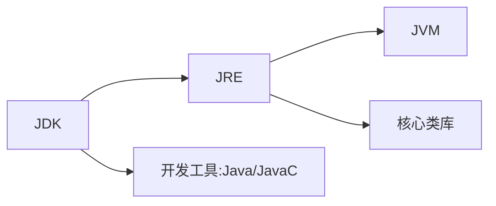
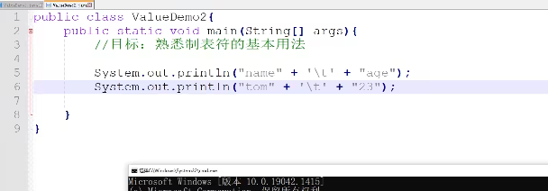
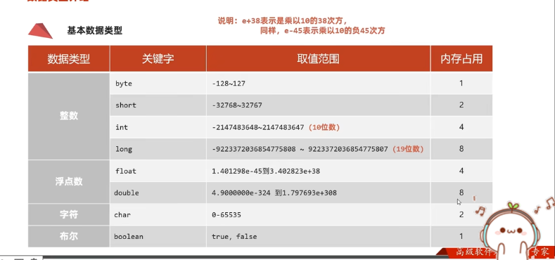

# day 01

## 一、Java入门

### 1 cmd

- ```盘符名称:```：盘符切换
- ```dir```：当前路径下内容
- ```cd ..```：回退上一级目录
- ```cd 目录1\目录2\```：进入多级目录
- ```cd \```：回退到根目录
- ```cls```：清屏
- ```exit```：退出

### 2 HelloWorld 案例

```java
public class A {  // public 暂时理解为：类名和文件名一直
	public static void main (String[] args) {  // 入口
		System.out.println("hellow java");  // 输出语句
	}
}
```

### 3 java三大分类

- JavaSE
- ~~JavaME~~
- JavaEE

### 4 JDK的组成

- JDK（Java Development Kit）：Java开发工具包
- JRE（Java Runtime Environment）：Java的运行环境
- JVM（Java Virtual Machine）：Java虚拟机 真正运行Java的地方
- 核心类库：Java自己写好的程序



## 二、IDEA下载

### 1 项目结构

- ```project```：项目、工程
- ```module```：模块
- ```package```：包
- ```class```：类

## 三、Java基础概念

### 1 注释

#### 1.1 单行注释

```// 注释信息```

#### 1.2 多行注释

```/* 注释信息 */```

#### 1.3 文档注释

```/** 注释信息 */```

### 2 关键字

#### 2.1 什么是

被Java赋予了特定含义的英文单词。

全部**小写**。

#### 2.1 class

```class```关键字用于创建或定义一个类。类是Java最基本的组成单元。

### 3 字面量

#### 3.1 分类

| 字面量类型 |                     说明                     |                             举例                             |
| :--------: | :------------------------------------------: | :----------------------------------------------------------: |
|  整数类型  |                                              |                                                              |
|  小数类型  |                                              |                                                              |
| 字符串类型 |           用**双引号**括起来的内容           |                                                              |
|  字符类型  | 用**单引号**括起来的内容，内容只能有**一个** |               ```'A'```、```'0'```、```'我'```               |
|  布尔类型  |                                              |                                                              |
|   空类型   |              一个特殊的值，空值              | 值是：```null```。<br>```null```不能直接打印，要放到字符串里面。 |

#### 3.2 更多的字符串

- 制表符：```\t```

  > 在打印的时候

  

```java
// 这个代码好简单诶 还是浅浅的放出来吧
public class ConstantTest {
    public static void main(String[] args) {
        System.out.println("fafa");
        System.out.println(18);
        System.out.println(false);
    }
}
```

# day 02

 ## 一、变量

> 变量就是内存中的存储空间，空间中存储着经常发生改变的数据

### 1 定义变量

```数据类型 变量名 = 变量值;```

```java
public class VariableDemo1 {
    public static void main(String[] args) {
        int salary = 12000;
        salary = 15000;
        System.out.println(salary);

        int age = 18;
        System.out.println(age);
    }
}
```

### 2 debug工具

有手就行...<br>一个课好不好，其中一个判断依据就是教不教你```debug```

### 3 注意事项

- 变量名不能重复定义

- 一条语句，可以定义多个变量，中间使用逗号分隔

  ```java
  int a = 10, b = 20, c = 30;
  ```

- 变量在使用之前，必须要赋值

  ```java
  int age;
  age = 10;
  System.out.println(age);
  ```

- 变量的作用域

## 二、标识符

就是给类、方法、变量等起名字的符号。

### 1 命名规则

- 数字、字母、下划线和美元符组成
- 不能数字开头
- 不能是关键字
- 区分大小写

### 2 命名规范

- 小驼峰命名法

  变量起名字

- 大驼峰命名法

  类起名字

## 三、数据类型



### 1 整数

|      关键字       |           取值范围            | 内存占用 |
| :---------------: | :---------------------------: | :------: |
|    ```byte```     |        ```-128~127```         |    1     |
|    ```short```    |      ```-32768~32767```       |    2     |
| ```int```（默认） | ```-2147483948~-2147483947``` |    4     |
|    ```long```     |                               |    8     |

### 2 浮点数

|        关键字        | 取值范围 | 内存占用 |
| :------------------: | :------: | :------: |
|     ```float```      |          |    4     |
| ```double```（默认） |          |    8     |

### 3 字符

|   关键字   |   取值范围    | 内存占用 |
| :--------: | :-----------: | :------: |
| ```char``` | ```0~65535``` |    2     |

### 4 布尔

|    关键字     |        取值范围         | 内存占用 |
| :-----------: | :---------------------: | :------: |
| ```boolean``` | ```true```、```false``` |    1     |

### 5 小例子

```java
public class DataTypeDemo1 {
    public static void main(String[] args) {
        // 定义 long 类型 最后要加一个大写或者小写的 L
        long tel = 13611111111L;

        // 小数首选双精度 double 非要使用 float 最后要加一个大写或者小写的 f
        double height = 123.5;
        float height1 = 123.5f;
    }
}

public class VariableTest {
    public static void main(String[] args) {
        String name = "fafa";
        int age = 18;
        char gender = '男';
        double height = 180.1;
        boolean flag = true;
    }
}
```

## 四、键盘录入

### 1 基本步骤

```java
import java.util.Scanner;
public class ScannerDemo {
    public static void main(String[] args) {
        Scanner sc = new Scanner(System.in);
        int age = sc.nextInt();
        System.out.println(age);
    }
}
```

### 2 小例子

```java
import java.util.Scanner;
public class ScannerTest1 {
    public static void main(String[] args) {
        Scanner sc = new Scanner(System.in);

        System.out.println("请输入您的姓名：");
        String name = sc.next();

        System.out.println("请输入您的年龄：");
        int age = sc.nextInt();

        System.out.println("请输入您的身高：");
        double width = sc.nextDouble();

        System.out.println("请输入你的婚姻状况：");
        boolean flag = sc.nextBoolean();

        System.out.println("注册成功");
    }
}
```

## 五、运算符（上）

### 1 简介

整数相除，结果只能得到整数想要得到带有小数的结果，需要小数参与运算。

```java
import java.util.Scanner;
public class OperatorTest1 {
    public static void main(String[] args) {
        Scanner sc = new Scanner(System.in);
        System.out.println("请输入一个整数：");
        int num = sc.nextInt();
        int ge = num % 10;

        System.out.println("整数" + num + "的个位为" + ge);
    }
}
```

### 2 字符串的拼接

当```+```遇到了字符串，就会进行字符串的拼接。

```java
System.out.println("5+5=" + 5 + 5);  // 5+5=55
System.out.println("5+5=" + (5 + 5));  // 5+5=10
```

### 3 自增自减运算符

- 运算符

  - ```++```：让变量自身的值```+1```
  - ```--```：让变量自身的值```-1```

- 使用

  - 单独使用：放在前后都可以

    ```java
    a++
    ++a
    ```

  - 参与运算使用

    - 在前：先自增，再操作

      ```java
      int a = 10;
      int b = ++a;
      
      // a = 11
      // b = 11
      ```

    - 在后：将变量原本的值提取出来进行运算后，然后再自增

      ```java
      int a = 10;
      int b = a++;
      
      // a = 11
      // b = 10
      ```

- 面试题

  ```java
  int a = 3;
  int b = (++a) + (a++) + (a * 10)
      
      b = (4) + (4) + ((4 + 1) * 10) = 58
  ```

## 六、类型转换

### 1 隐式转换

#### 1.1 基本的

> 把**取值范围小**的数值或变量，赋值给另一个取值范围大的变量
>
> 这个地方的大与小，是**取值范围**

```java
int a = 10;
double b = a;
// b = 10.0
```

#### 1.2 运算过程的隐式转换

- 取值范围小的数据，和取值范围大的数据进行运算，小的会提升为大的之后，再进行运算

- ```byte```、```short```、```char```三种数据在运算的时候，都会提升为```int```，然后在进行运算

  > 注意```char```是单引号 字符串是双引号

  ```java
  // 所以这个要报错
  byte a = 10;
  byte b = 20;
  byte c = a + b;  // 相当于这个地方要把 int 给 byte
  ```

  ```java
  int a = 1;
  char b = 'a';
  int c = a + b; // c = a + 97 = 98
  ```

### 2 强制转换

为什么不讲捏

### 3 常量优化进制

> 在编译的时候（Javac）会进行运算

比如说：

```java
byte a = 3;
byte b = 4;
byte c = a + b;  // 会报错
byte c = (byte)(a + b);  // 直接强转就可以了
```

但是这样就不会报错：

```java
byte b = 3 + 4;
// 虽然说 3 和 4 是 字面量的 int 类型，但是在编译时会计算 3 + 4 = 7，即 byte b = 7
// 当然超出了 byte 的取值范围，还是会报错
```

## 七、进制

### 1 进制的书写

```java
System.out.println(110);  // 十进制
System.out.println(0b110);  // 二进制
System.out.println(0110);  // 八进制
System.out.println(0x110);  // 十六进制
```

### 2 原码反码补码

大学计算机基础

# day 03

## 一、package

## 二、运算符（下）

### 1 扩展的赋值运算符

所谓的```+=```、```-=```、...<br>注意扩展的赋值运算符**隐含**了强制类型转换。

```java
int a = 10;
a += 12.5;  // a = (int)(10 + 12.5)
// a = 22
```

### 2 关系运算符

所谓的```>```、```<=```、```==```、...

### 3 逻辑运算符

- ```&```：逻辑与
- ```|```：逻辑或
- ```!```：逻辑非
- ```^```：逻辑异或
  - 相同为```flase```，不同为```true```

### 4 短路的逻辑运算符

- ```&&```：左边为```false```，右边就不执行了
- ```||```：左边为```true```，右边就不执行了

### 5 三元运算符

