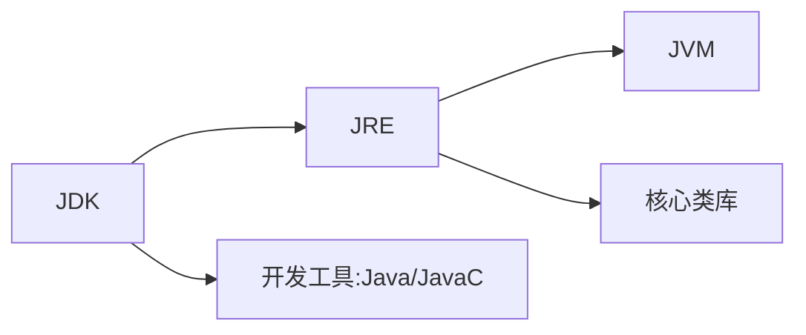

# day 01

## 一、Java入门

### 1 cmd

- ```盘符名称:```：盘符切换
- ```dir```：当前路径下内容
- ```cd ..```：回退上一级目录
- ```cd 目录1\目录2\```：进入多级目录
- ```cd \```：回退到根目录
- ```cls```：清屏
- ```exit```：退出

### 2 HelloWorld 案例

```java
public class A {  // public 暂时理解为：类名和文件名一直
	public static void main (String[] args) {  // 入口
		System.out.println("hellow java");  // 输出语句
	}
}
```

### 3 java三大分类

- JavaSE
- ~~JavaME~~
- JavaEE

### 4 JDK的组成

- JDK（Java Development Kit）：Java开发工具包
- JRE（Java Runtime Environment）：Java的运行环境
- JVM（Java Virtual Machine）：Java虚拟机 真正运行Java的地方
- 核心类库：Java自己写好的程序



## 二、IDEA下载

### 1 项目结构

- ```project```：项目、工程
- ```module```：模块
- ```package```：包
- ```class```：类

## 三、Java基础概念

### 1 注释

#### 1.1 单行注释

```// 注释信息```

#### 1.2 多行注释

```/* 注释信息 */```

#### 1.3 文档注释

```/** 注释信息 */```

### 2 关键字

#### 2.1 什么是

被Java赋予了特定含义的英文单词。

全部**小写**。

#### 2.1 class

```class```关键字用于创建或定义一个类。类是Java最基本的组成单元。

### 3 字面量

#### 3.1 分类

| 字面量类型 |                     说明                     |                             举例                             |
| :--------: | :------------------------------------------: | :----------------------------------------------------------: |
|  整数类型  |                                              |                                                              |
|  小数类型  |                                              |                                                              |
| 字符串类型 |           用**双引号**括起来的内容           |                                                              |
|  字符类型  | 用**单引号**括起来的内容，内容只能有**一个** |               ```'A'```、```'0'```、```'我'```               |
|  布尔类型  |                                              |                                                              |
|   空类型   |              一个特殊的值，空值              | 值是：```null```。<br>```null```不能直接打印，要放到字符串里面。 |

#### 3.2 更多的字符串

- 制表符：```\t```

  > 在打印的时候

  

```java
// 这个代码好简单诶 还是浅浅的放出来吧
public class ConstantTest {
    public static void main(String[] args) {
        System.out.println("fafa");
        System.out.println(18);
        System.out.println(false);
    }
}
```

# day 02

 ## 一、变量

> 变量就是内存中的存储空间，空间中存储着经常发生改变的数据

### 1 定义变量

```数据类型 变量名 = 变量值;```

```java
public class VariableDemo1 {
    public static void main(String[] args) {
        int salary = 12000;
        salary = 15000;
        System.out.println(salary);

        int age = 18;
        System.out.println(age);
    }
}
```

### 2 debug工具

有手就行...<br>一个课好不好，其中一个判断依据就是教不教你```debug```

### 3 注意事项

- 变量名不能重复定义

- 一条语句，可以定义多个变量，中间使用逗号分隔

  ```java
  int a = 10, b = 20, c = 30;
  ```

- 变量在使用之前，必须要赋值

  ```java
  int age;
  age = 10;
  System.out.println(age);
  ```

- 变量的作用域

## 二、标识符


