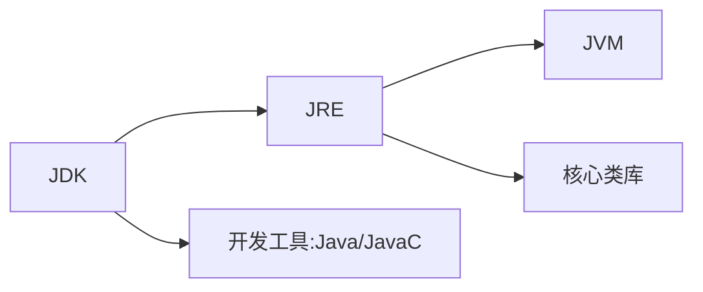

# day 00

## 1 说明文件

鄙人不才，学过```python```，所以这个笔记比较飞，极其基础的就没有记录了...

## 2 idea的快捷键

- ```ctrl+alt+a```：在方法上使用，会自动补全接收方法返回值的变量。

# day 01

## 一、Java入门

### 1 cmd

- ```盘符名称:```：盘符切换
- ```dir```：当前路径下内容
- ```cd ..```：回退上一级目录
- ```cd 目录1\目录2\```：进入多级目录
- ```cd \```：回退到根目录
- ```cls```：清屏
- ```exit```：退出

### 2 HelloWorld 案例

```java
public class A {  // public 暂时理解为：类名和文件名一直
	public static void main (String[] args) {  // 入口
		System.out.println("hellow java");  // 输出语句
	}
}
```

### 3 java三大分类

- JavaSE
- ~~JavaME~~
- JavaEE

### 4 JDK的组成

- JDK（Java Development Kit）：Java开发工具包
- JRE（Java Runtime Environment）：Java的运行环境
- JVM（Java Virtual Machine）：Java虚拟机 真正运行Java的地方
- 核心类库：Java自己写好的程序



## 二、IDEA下载

### 1 项目结构

- ```project```：项目、工程
- ```module```：模块
- ```package```：包
- ```class```：类

## 三、Java基础概念

### 1 注释

#### 1.1 单行注释

```// 注释信息```

#### 1.2 多行注释

```/* 注释信息 */```

#### 1.3 文档注释

```/** 注释信息 */```

### 2 关键字

#### 2.1 什么是

被Java赋予了特定含义的英文单词。

全部**小写**。

#### 2.1 class

```class```关键字用于创建或定义一个类。类是Java最基本的组成单元。

### 3 字面量

#### 3.1 分类

| 字面量类型 |                     说明                     |                             举例                             |
| :--------: | :------------------------------------------: | :----------------------------------------------------------: |
|  整数类型  |                                              |                                                              |
|  小数类型  |                                              |                                                              |
| 字符串类型 |           用**双引号**括起来的内容           |                                                              |
|  字符类型  | 用**单引号**括起来的内容，内容只能有**一个** |               ```'A'```、```'0'```、```'我'```               |
|  布尔类型  |                                              |                                                              |
|   空类型   |              一个特殊的值，空值              | 值是：```null```。<br>```null```不能直接打印，要放到字符串里面。 |

#### 3.2 更多的字符串

- 制表符：```\t```

  > 在打印的时候

  

```java
// 这个代码好简单诶 还是浅浅的放出来吧
public class ConstantTest {
    public static void main(String[] args) {
        System.out.println("fafa");
        System.out.println(18);
        System.out.println(false);
    }
}
```

# day 02

 ## 一、变量

> 变量就是内存中的存储空间，空间中存储着经常发生改变的数据

### 1 定义变量

```数据类型 变量名 = 变量值;```

```java
public class VariableDemo1 {
    public static void main(String[] args) {
        int salary = 12000;
        salary = 15000;
        System.out.println(salary);

        int age = 18;
        System.out.println(age);
    }
}
```

### 2 debug工具

有手就行...<br>一个课好不好，其中一个判断依据就是教不教你```debug```

### 3 注意事项

- 变量名不能重复定义

- 一条语句，可以定义多个变量，中间使用逗号分隔

  ```java
  int a = 10, b = 20, c = 30;
  ```

- 变量在使用之前，必须要赋值

  ```java
  int age;
  age = 10;
  System.out.println(age);
  ```

- 变量的作用域

## 二、标识符

就是给类、方法、变量等起名字的符号。

### 1 命名规则

- 数字、字母、下划线和美元符组成
- 不能数字开头
- 不能是关键字
- 区分大小写

### 2 命名规范

- 小驼峰命名法

  变量起名字

- 大驼峰命名法

  类起名字

## 三、数据类型


### 1 整数

|      关键字       |           取值范围            | 内存占用 |
| :---------------: | :---------------------------: | :------: |
|    ```byte```     |        ```-128~127```         |    1     |
|    ```short```    |      ```-32768~32767```       |    2     |
| ```int```（默认） | ```-2147483948~-2147483947``` |    4     |
|    ```long```     |                               |    8     |

### 2 浮点数

|        关键字        | 取值范围 | 内存占用 |
| :------------------: | :------: | :------: |
|     ```float```      |          |    4     |
| ```double```（默认） |          |    8     |

### 3 字符

|   关键字   |   取值范围    | 内存占用 |
| :--------: | :-----------: | :------: |
| ```char``` | ```0~65535``` |    2     |

### 4 布尔

|    关键字     |        取值范围         | 内存占用 |
| :-----------: | :---------------------: | :------: |
| ```boolean``` | ```true```、```false``` |    1     |

### 5 小例子

```java
public class DataTypeDemo1 {
    public static void main(String[] args) {
        // 定义 long 类型 最后要加一个大写或者小写的 L
        long tel = 13611111111L;

        // 小数首选双精度 double 非要使用 float 最后要加一个大写或者小写的 f
        double height = 123.5;
        float height1 = 123.5f;
    }
}

public class VariableTest {
    public static void main(String[] args) {
        String name = "fafa";
        int age = 18;
        char gender = '男';
        double height = 180.1;
        boolean flag = true;
    }
}
```

## 四、键盘录入

### 1 基本步骤

```java
import java.util.Scanner;
public class ScannerDemo {
    public static void main(String[] args) {
        Scanner sc = new Scanner(System.in);
        int age = sc.nextInt();
        System.out.println(age);
    }
}
```

### 2 小例子

```java
import java.util.Scanner;
public class ScannerTest1 {
    public static void main(String[] args) {
        Scanner sc = new Scanner(System.in);

        System.out.println("请输入您的姓名：");
        String name = sc.next();

        System.out.println("请输入您的年龄：");
        int age = sc.nextInt();

        System.out.println("请输入您的身高：");
        double width = sc.nextDouble();

        System.out.println("请输入你的婚姻状况：");
        boolean flag = sc.nextBoolean();

        System.out.println("注册成功");
    }
}
```

## 五、运算符（上）

### 1 简介

整数相除，结果只能得到整数想要得到带有小数的结果，需要小数参与运算。

```java
import java.util.Scanner;
public class OperatorTest1 {
    public static void main(String[] args) {
        Scanner sc = new Scanner(System.in);
        System.out.println("请输入一个整数：");
        int num = sc.nextInt();
        int ge = num % 10;

        System.out.println("整数" + num + "的个位为" + ge);
    }
}
```

### 2 字符串的拼接

当```+```遇到了字符串，就会进行字符串的拼接。

```java
System.out.println("5+5=" + 5 + 5);  // 5+5=55
System.out.println("5+5=" + (5 + 5));  // 5+5=10
```

### 3 自增自减运算符

- 运算符

  - ```++```：让变量自身的值```+1```
  - ```--```：让变量自身的值```-1```

- 使用

  - 单独使用：放在前后都可以

    ```java
    a++
    ++a
    ```

  - 参与运算使用

    - 在前：先自增，再操作

      ```java
      int a = 10;
      int b = ++a;
      
      // a = 11
      // b = 11
      ```

    - 在后：将变量原本的值提取出来进行运算后，然后再自增

      ```java
      int a = 10;
      int b = a++;
      
      // a = 11
      // b = 10
      ```

- 面试题

  ```java
  int a = 3;
  int b = (++a) + (a++) + (a * 10)
      
      b = (4) + (4) + ((4 + 1) * 10) = 58
  ```

## 六、类型转换

### 1 隐式转换

#### 1.1 基本的

> 把**取值范围小**的数值或变量，赋值给另一个取值范围大的变量
>
> 这个地方的大与小，是**取值范围**

```java
int a = 10;
double b = a;
// b = 10.0
```

#### 1.2 运算过程的隐式转换

- 取值范围小的数据，和取值范围大的数据进行运算，小的会提升为大的之后，再进行运算

- ```byte```、```short```、```char```三种数据在运算的时候，都会提升为```int```，然后在进行运算

  > 注意```char```是单引号 字符串是双引号

  ```java
  // 所以这个要报错
  byte a = 10;
  byte b = 20;
  byte c = a + b;  // 相当于这个地方要把 int 给 byte
  ```

  ```java
  int a = 1;
  char b = 'a';
  int c = a + b; // c = a + 97 = 98
  ```

### 2 强制转换

为什么不讲捏

### 3 常量优化进制

> 在编译的时候（```Javac```）会进行运算

比如说：

```java
byte a = 3;
byte b = 4;
byte c = a + b;  // 会报错
byte c = (byte)(a + b);  // 直接强转就可以了
```

但是这样就不会报错：

```java
byte b = 3 + 4;
// 虽然说 3 和 4 是 字面量的 int 类型，但是在编译时会计算 3 + 4 = 7，即 byte b = 7
// 当然超出了 byte 的取值范围，还是会报错
```

## 七、进制

### 1 进制的书写

```java
System.out.println(110);  // 十进制
System.out.println(0b110);  // 二进制
System.out.println(0110);  // 八进制
System.out.println(0x110);  // 十六进制
```

### 2 原码反码补码

大学计算机基础

# day 03

## 一、package

## 二、运算符（下）

### 1 扩展的赋值运算符

所谓的```+=```、```-=```、...<br>注意扩展的赋值运算符**隐含**了强制类型转换。

```java
int a = 10;
a += 12.5;  // a = (int)(10 + 12.5)
// a = 22
```

### 2 关系运算符

所谓的```>```、```<=```、```==```、...

### 3 逻辑运算符

- ```&```：逻辑与
- ```|```：逻辑或
- ```!```：逻辑非
- ```^```：逻辑异或
  - 相同为```flase```，不同为```true```

### 4 短路的逻辑运算符

- ```&&```：左边为```false```，右边就不执行了
- ```||```：左边为```true```，右边就不执行了

### 5 三元运算符

- 使用场景
  - 根据条件，从二者选其一
- 格式
  - ```判断条件 ? 值1 : 值2```
- 执行流程
  - 判断条件值为```true```，```值1```就是运算结果
  - 判断条件值为```flase```，```值2```就是运算结果

```java
import java.util.Scanner;
public class OperatorTest1 {
    /*
    三个数找最大值
     */
    public static void main(String[] args) {
        Scanner sc = new Scanner(System.in);
        System.out.println("请输入三个整数");

        int num1 = sc.nextInt();
        int num2 = sc.nextInt();
        int num3 = sc.nextInt();

        int temMax = num1 > num2 ? num1 : num2;
        int max = temMax > num3 ? temMax : num3;

        System.out.println("最大值为" + max);
    }
}
```

### 6 运算符优先级


## 三、方法（函数）

### 1 介绍

方法```(method)```一段具有独立功能的代码块，不调用就不执行

### 2 定义与调用

- 定义

  ```java
  public static void 方法名() {
      // 方法体
  }
  ```

- 调用

  ```java
  方法名();
  ```

```java
public class MethodDemo1 {
    public static void main(String[] args) {
        eat();
    }
    public static void eat() {
        System.out.println("饿饿...");
    }
}
```

### 4 方法调用内存

- 方法**没有被调用**的时候，在**方法区**中的字节码文件中存放
- 方法**被调用**的时候，需要进入到**栈内存**中运行

### 5 带参数方法的定义与调用

```java
public class MethodTest {
    public static void main(String[] args) {
        getMax(10, 20);
    }
    public static void getMax(int num1, int num2) {
        int max = num1 > num2 ? num1 : num2;
        System.out.println(max);
    }
}
```

### 6 带返回值方法的定义与调用

```java
public class MethodTest {
    public static void main(String[] args) {
        int result = getMax(10, 20);
        System.out.println(result);
    }
    
    // void 当前方法 没有返回值
    public static int getMax(int num1, int num2) {
        int max = num1 > num2 ? num1 : num2;
        System.out.println(max);
        return max;
    }
}
```

### 7 方法通用定义格式

```java
public static 返回值类型 方法名(参数) {
    方法体;
    return 返回值;
}
```

### 3 常见问题

- 不调用不执行
- 方法与方法是平级关系，不允许嵌套定义
- 方法的定义与执行顺序无关
- 返回值类型为```void```，表示没有返回值，可以不写```return```。如果非要写```return```，可以不写返回值。
- ```return```下面不能写代码，不会被执行。

### 4 方法重载（Overload）

- 同一个类中，定义了多个**同名的方法**，但每个方法具有**不同的参数类型**或**参数格式**，这些同名的方法，就构成了重载关系。（注意只看方法名和参数，不看返回值。）

```java
public class OverLoadDemo {
    public static void main(String[] args) {
    }
    
    public static void add(int a, int b) {
    }
    
    public static void add(int a, int b, int c) {
    }
}
```

- 好处

  不需要记忆过多繁琐的方法名

# day 04

## 一、流程控制语句

- 顺序结构

  程序默认

- 分支结构

  ```if```、```switch```

- 循环结构

  ```for```、```while```、```do...while```

## 二、分支语句

### 1 if  语句

```java
if () {
    
} else if () {
    
} else if () {
    
}
...
else {
    
}
```

- ```if```语句中，如果大括号控制的是一条语句，大括号可以省略不写。
- ```if```语句中的```( )```和```{ }```之间不要写```;```。

### 2 switch 语句

#### 2.1 基本的格式

```java
public static void mySwitch(int age) {
    switch (age) {
        case 1:
            System.out.println("1岁");
            break;
        case 2:
            System.out.println("2岁");
            break;
        default:
            System.out.println("其他");
            break;
    }
}
```

#### 2.2 注意事项

- ```case```后面的值不能重复
- ```case```后面的值，只能是字面量，不能是变量
- ```switch()```中科院接受的数据类型
  - 基本数据类型：byte、short、char、int
  - 引用数据类型：jdk5开始可以是枚举，jdk7开始可以是String字符串

#### 2.3 switch穿透

如果没有```break```，程序会继续向下执行```case```里面的东西，直到遇到```break```

```java
public static void mySwitch1() {
    int week = 1;
    switch (week) {
        case 1:
            System.out.println("星期一");  // 执行
        case 2:
            System.out.println("星期二");  // 执行
            break;  // 执行
        case 3:
            System.out.println("星期三");
            break;
        default:
            System.out.println("您的输入有误");
            break;
    }
}
```

#### 2.4 switch穿透优化代码

多个```case```有相同的代码 可以用```Switch```穿透优化

```java
public static void mySwitch3() {
    Scanner sc = new Scanner(System.in);
    System.out.println("00");
    int week = sc.nextInt();
    switch (week) {
        case 1, 2, 3, 5, 4:  // 这样是jdk14之后的
            System.out.println("工作日");
            break;
        case 6, 7:
            System.out.println("休息日");
            break;
        default:
            System.out.println("您的输入有误");
            break;
    }
}
```

#### 2.5 简化形式

> 如果是2.3中的那种形式，似乎不能这样简化

```java
public static void mySwitch4() {
    int week = 4;
    switch (week) {
        case 1, 2, 3, 5, 4 -> System.out.println("工作日");
        case 6, 7 -> System.out.println("休息日");
        default -> System.out.println("您的输入有误");
    }
}
```

#### 2.6 和if的关系

- ```if```语句：适用于范围性的判断
- ```switch```语句：适用于固定值的匹配

## 三、循环语句

### 1 for语句

#### 1.1 基本格式

``` java
x for (初始化语句; 条件判断语句; 条件控制语句) {
    循环体语句;
}

for (int i=1; i<=5; i++) {
    循环体语句;
}
```

#### 1.2 执行流程

1. 执行初始化语句，整个循环过程中，只执行一次

2. 执行判断条件

   ```true```：执行第三步

   ```false```：循环结束

3. 执行循环体语句

4. 执行条件控制语句

5. 回到2

#### 1.3 水仙花数

```java
public static void daffodilNumber() {
    // 准备计数
    int count = 0;
    for (int i = 100; i <= 999; i++) {
        // 提取位
        int ge = i % 10;
        int shi = i / 10 % 10;
        int bai = i / 100;
        // 判断
        if (ge * ge * ge + shi * shi * shi + bai *bai * bai == i) {
            System.out.println(i);
            count++;
        }
    }
    System.out.println("水仙花数的个数是：" + count);
}
```

#### 1.5 注意事项

- ```for```循环```{}```中定义的变量，在**每一轮**循环结束后，都会从内存中释放。
- ```for```循环```()```中定义的变量，在**整个**循环结束后，都会从内存中释放。
- ```for```循环```()```和```{}```之间不要写分号。

### 2 循环嵌套

心情不好，不想学了 —— 20230110

- 经典打印小星星
    ```java
    public static void printRectangle() {
        for (int i = 1; i <= 5; i++) {
            for (int j = 1; j <=i; j++) {
                System.out.print("*");
            }
            System.out.println();
        }
    }
    
    /*
    *
    **
    ***
    ****
    *****
    */
    ```

- 经典99乘法表

  ```java
  public static void print99() {
      for (int i = 1; i<=9; i++) {
          for (int j = 1; j<=i; j++) {
              System.out.print(j + "*" + i + "=" + i*j + "\t");
          }
          System.out.println();
      }
  }

### 3 while循环

```java
public static void main(String[] args) {
    int i = 1;
    while (i <= 5) {
        System.out.println("好好学习");
        i++;
    }
}
```

### 4 do...while循环

> 用的很少

```java
public static void main(String[] args) {
    int i = 1;
    do {
        System.out.println("好好学习");  // 无论条件是否满足，都会至少执行一次这个循环体
        i++;
    } while (i <= 5);
}
```

### 5 三个循环的区别

1. 先判断还是先执行

2. ```for```和```while```的区别

   - ```for```循环：用于控制循环的那个变量，在循环结束后，会从内存中消失，循环结束，不能继续使用。
   - ```while```循环：用于控制循环的那个变量，在循环结束后，不会从内存中消失，循环结束，能继续使用。

   其实这个也影响不大，因为```for```循环的用于控制循环的那个变量，可以定义到括号外面

   ```java
   int i = 1;  // 这样，在循环结束后，i 不会从内存中消失，循环结束，i 能继续使用。
   for (; i<=5; i++) {
       循环体语句;
   }
   ```

   进一步变化，会发现，两者几乎一模一样了

   - ```for```循环

     ```java
     int i = 1;
     for (; i<=5; ) {
         i++;
         循环体语句;
     }
     ```

   - ```while```循环

     ```java
     int i = 1;
     while (i <= 5) {
         i++;
         循环体语句;
     }
     ```

   所以两者其实并没有什么区别，但有一个选择的习惯

   - 明确循环次数的，一般用```for```循环
   - 不明确循环次数的，一般用```while```循环

### 6 跳转控制语句

#### 6.1 关键字

- ```break```
- ```continue```

#### 6.2 注意事项

她们下面不能写代码，因为不会被执行

#### 6.3 死循环

```java
for (;;) {}

while (true) {}

do {} while (true)
```

#### 6.4 标号

给循环起一个名字，在使用```break```时，可以指定退出哪一层的循环

```java
lo:  // 标号：给循环取一个名字
while (true) {
    ...
    switch (choice) {
        case 1:
            ...;
            break;
        case 2:
            ...;
            break lo;  // 跳出死循环
    }
}
```

###  7 猜数字大小

经典...

```java
public static void guessNumber() {
    Random r = new Random();
    Scanner sc = new Scanner(System.in);

    int num = r.nextInt(1, 101);

    while (true) {
        System.out.println("\n请输入：");
        int guess = sc.nextInt();

        if (guess < num) {
            System.out.println("猜小了...");
        } else if (guess > num) {
            System.out.println("猜大了...");
        } else {
            System.out.println("猜对了...");
            System.out.println("恭喜！");
            break;
        }
    }
}
```

# day 06

## 一、数组

### 1 数组介绍

数组指的是一种**容器**，可以用来存储同种数据类型的**多个值**。

### 2 数组静态初始化

#### 2.1 初始化

就是在内存中，为数组容器开辟空间，并将数据存入容器中的过程。

#### 2.2 定义数组

- ```数据类型[] 数组名;```
- ```数据类型 数组名[];```

```java
public static void arrayTest2() {
    // 完整格式
    int[] arr1 = new int[]{1, 2, 3};
    // 简化格式
    int[] arr2 = {11, 22, 33};
    double[] arr3 = {1.1, 1.2, 1.3};

    System.out.println(arr1);  // [I@254989ff
    System.out.println(arr2);  // [I@5d099f62
    System.out.println(arr3);  // [I@5d099f62

    /*
        [I@5d099f62

        @：分隔符
        [：当前空间是数组类型的
        I：当前数组类型，是 int 类型
        5d099f62：数组的十六进制地址
         */
}
```

### 3 数组元素访问

- 格式：```数组名[索引值];```

```java
public static void arrayTest() {
    int[] arr = {11, 22, 33, 55};
    // 取值
    System.out.println(arr[0]);
    // 改值
    arr[2] = 66;
    System.out.println(arr[2]);
}
```

### 4 数组遍历操作


### 5 数组动态初始化


### 6 数组内存图

### 7 数组常见问题


## 二、二维数组

