# day 01 面向对象高级编程

## 1 static 关键字

```static```是静态的意思，可以修饰成员变量，也可以修饰成员方法

### 1.1 特点

- 被类的所有对象所共享
- 多了一种调用的方法（之前是实例化后的```对象.```），可以通过类名进行调用。也推荐这种方式。
- 随着类的加载而加载，优先于对象存在

```java
public class Student {
    String name;
    int age;
    static String school;  // 这个地方 static 静态修饰了
}

public static void main(String[] args) {
    System.out.println(Student.school);  // 随着类的加载而加载，优先于对象存在

    Student stu1 = new Student();

    stu1.name = "fafa";
    stu1.age = 22;
    stu1.school = "双流一带专";
    System.out.println(stu1.name + "---" + stu1.age + "---" + stu1.school);

    Student stu2 = new Student();
    stu2.name = "fafafa";
    stu2.age = 24;
    // stu2.school = "双流一带专";  // 可以不需要 因为可以共享
    System.out.println(stu2.name + "---" + stu2.age + "---" + stu2.school);
    System.out.println(Student.school);  // 多了一种调用方法 类名.
}
```

### 1.2 内存图


### 1.3 修饰成员方法

常用于工具类

```java
package com.itheima.tools;

public class ArrayTools {

    // 私有构造方法 没有必要暴露
    private ArrayTools() {}

    // 加了 static 就可以直接调
    public static int getMax(int[] arr) {
        int max = arr[0];
        for (int i = 1; i < arr.length; i++) {
            if (arr[i] > max) {
                max = arr[i];
            }
        }
        return max;
    }

    public static int getMin(int[] arr) {
        int min = arr[0];
        for (int i = 1; i < arr.length; i++) {
            if (arr[i] < min) {
                min = arr[i];
            }
        }
        return min;
    }

    public static void printArray(int[] arr) {
        System.out.print("{");
        for (int i = 0; i < arr.length - 1; i++) {
            System.out.print(arr[i] + ", ");
        }
        System.out.print(arr[arr.length - 1] + "}");
    }
}
```

```java
package com.itheima.tools;

public class Test {
    public static void main(String[] args) {
        int[] arr = {11, 22, 33, 58};

        // ArrayTools tools = new ArrayTools();  // 私有了构造方法

        // 直接 对象名. 调用
        System.out.println(ArrayTools.getMax(arr));
        System.out.println(ArrayTools.getMin(arr));
        ArrayTools.printArray(arr);

        // 比如说这个就是
        System.exit(0);
    }
}
```

### 1.4 注意事项

- ```static```方法中，只能访问静态成员（直接访问）
- ```static```中不允许使用```this```关键字

### 1.5 重新认识main方法

```java
public class HelloWorld {
    public static void main(String[] args) {
        System.out.println("HelloWorld");
    }
}
```

- ```public```：被```JVM```调用，访问权限足够大。
- ```static```：被```JVM```调用，不用创建对象。因为```main```方法是静态的，所以测试类中其他方法也需要是静态的。
- ```void```：被```JVM```调用，不需要给```JVM```返回值。
- ```main```：一个通用的名称，虽然不是关键字，但是被```JVM```识别。
- ```String[] args```：以前用于接收键盘录入数据的，现在没用。

## 2 继承

继承：让**类与类之间产生关系**（子父类关系），**子类**可以**直接使用**父类中**非私有的成员**

### 2.1 格式

- 格式：```public class 子类名 extends 父类名```
- 范例：```public class Zi extends Fu {}```
- ```Fu```：是父类，也被称为基类、超类
- ```Zi```：是子类，也被称为派生类

```java
public class ExtendsDemo1 {
    public static void main(String[] args) {
        Coder c = new Coder();
        c.setAge(2);
        c.setName("fafa");

        System.out.println(c.getName() + "---" + c.getAge());
    }
}

class Employee {
    private String name;
    private int age;

    private double salary;

    public String getName() {
        return name;
    }

    public void setName(String name) {
        this.name = name;
    }

    public int getAge() {
        return age;
    }

    public void setAge(int age) {
        this.age = age;
    }

    public double getSalary() {
        return salary;
    }

    public void setSalary(double salary) {
        this.salary = salary;
    }
}

// 继承
class Coder extends Employee {

}
class Manager extends Employee {

}
```

### 2.2 什么时候使用继承

- 当类与类之间，存在相同（共性）的内容，并且产生了 is a 的关系，就可以考虑使用继承，来优化代码。

### 2.3 成员变量

- 子父类，如果出现了重名的成员变量，使用的时候会优先使用？

  - 根据就近原则，必定是使用子类的

  - 但是非要使用父类的，可以用```super```关键字

    ```java
    public class ExtendsDemo2 {
        public static void main(String[] args) {
            Zi z = new Zi();
            z.method();
        }
    }
    
    class Fu {
        int num = 10;
    }
    
    class Zi extends Fu {
        int num = 20;
        public void method() {
            System.out.println(num);  // 20
            System.out.println(super.num);  // 10
        }
    }
    ```

### 2.4 成员方法

- 子父类中，出现了方法声明一模一样的方法（方法名，参数，返回值）。在创建子类对象，调用方法的时候，会优先使用子类的方法。逻辑上这虽然是就近原则的现象，但其实是子类的方法，对父类的方法，进行了重写操作。
  - 区别
    - 方法重载（Overload）：在同一个类中，方法名相同，参数不同，与返回值无关。参数不同: 类型不同，个数不同，顺序不同。
    - 方法重写（Override）： 在子父类当中，出现了方法声明一模一样的方法（方法名，参数，返回值）。
- 注意事项
  - 父类中私有方法不能被重写
  - 子类重写父类方法时，访问权限必须大于等于父类

### 2.5 protected修饰符

用的很少...


### 2.6 Java继承的特点

- Java只支持**单继承**，不支持**多继承**，但支持**多层继承**

```java
public class ExtendsDemo4 {
    public static void main(String[] args) {
        C c = new C();
        c.methodA();
        c.methodB();
        c.methodC();
    }
}

class A {
    public void methodA() {
        System.out.println("A...");
    }
}

class B extends A{
    public void methodB() {
        System.out.println("B...");
    }
}

class C extends B{
    public void methodC() {
        System.out.println("C...");
    }
}
```

### 2.7 构造方法

- 父类的构造方法 子类无法继承

- 子类在初始化前 需要先完成父类的初始化 因为子类的构造方法中可能会使用父类的数据

  所以，除了```object```类，在所有构造方法中，都默认隐藏一句```super()```。通过这行代码，访问父类的**空参**构造方法。

  细节：Java当中所有的类，都直接或者问接的继承到了```object```类。

```java
public class Test {
    public static void main(String[] args) {
        Zi z1 = new Zi();
        Zi z2 = new Zi(3);
    }
}

class Fu {
    public Fu() {
        System.out.println("Fu类的空参构造");
    }
    public Fu(int num) {
        System.out.println("Fu类的带参构造");
    }
}

class Zi extends Fu {
    public Zi () {
        // super();  // 默认隐藏的
        System.out.println("Zi类的空参构造");
    }
    public Zi (int num) {
        // super();  // 默认隐藏的
        System.out.println("Zi类的带参构造");
    }
}
```

### 2.8 继承中的构造方法内存图

- 子类中会专门开辟一块内存空间，继承父类的成员变量。就算是私有的，也是会继承的，只是说因为权限问题不能直接访问，但是可以通过```get()```进行访问。


### 2.9 this和supper

- 概念

  - ```this```：代表**本类**对象的引用
  - ```supper```：代表**父类**存储空间的标识

- 调用格式

  |    关键字    |         访问成员变量         |        访问成员方法        |             访问构造方法             |
  | :----------: | :--------------------------: | :------------------------: | :----------------------------------: |
  |  ```this```  |  ```this.本类的成员变量;```  | ```this.本类的成员方法;``` | ```this(); this(...);```本类构造方法 |
  | ```supper``` | ```supper.父类的成员变量;``` | ```this.父类的成员方法;``` | ```this(); this(...);```父类构造方法 |

- ```supper```的省略

  从本质上来说，子类是继承了父类的成员变量和成员方法。所以```supper```的省略，其实是```this```的省略：子类没有重名的成员变量和成员方法，就可以省略。

- ```this()```调用本类构造方法的场景——版本升级

  ```java
  package com.itheima.myExtend;
  
  public class ExtendsDemos {
      public static void main(String[] args) {
          AA a1 = new AA(1, 2, 3);
          AA a2 = new AA(1, 2, 3);
          // 新需求
          AA a3 = new AA(1, 2, 6, 7);
      }
  }
  
  class AA {
      int a;
      int b;
      int c;
      // 需求多了一个 d
      int d;
  
      public AA(int a, int b, int c) {
          this.a = a;
          this.b = b;
          this.c = c;
          // 如果在这个地方给 d 赋值 会改其他使用这个构造方法的代码
          // this.d = d
      }
      
      // 解决办法 方法重载
      public AA(int a, int b, int c, int d) {
          // this.a = a;
          // this.b = b;
          // this.c = c;
          
          // 简写了...
          this(a, b, c);
          this.d = d;
      }   
  }
  ```

- 注意：```this()```和```super()```都在争夺构造方法第一行的位置，所以二者不能共存

## 3 final关键字

### 3.1 使用

- ```final```关键字是最终的意思，可以修饰（方法，类，变量）
- 修饰方法：表明该方法是最终方法，不能被重写
- 修饰类：表明该类是最终类，不能被继承
- 修饰变量：表明该变量是常量，不能再次被赋值

```java
public class FinalDemo {
    public static void main(String[] args) {
        final int num = 10;
        // num = 20;  // 不能修改
        System.out.println(num);

        final int[] arr = {1, 2, 3};
        // arr = new int[3];  // 不能改地址值
        arr[0] = 0;  // 可以改内容
        System.out.println(arr[0]);  // 0
    }
}

final class Fu extends Object {
    public final void method() {
        System.out.println("父类中的重要方法，不希望子类进行修改...");
    }
}

class Student {
    //final int num;  // final 修饰成员变量 不能修饰默认值 但是 可以在构造方法中赋值 则该句不报错
    final int num = 0;
}
```

### 3.2 细节补充

- 变量是基本类型：```final```修饰指的是基本类型的数据，值不能发生改变。
- 变量是引用类型：```final```修饰指的是引用类型，地址值不能发生改变，但是地址里面的内容是可以发生改变的。
- 成员变量如果被```final```修饰，需要在构造方法结束之前，完成赋值。

### 3.3```final```修饰变量名的规范

- 如果变量名是一个单词，所有字母大写：```MAX```
- 如果变量名是多个单词， 所有字母大写， 中间使用下划线分割```MAX_VALUE```

# day 02 面向对象高级

## 1 包

### 1.1 定义

- 包本质来说就是文件夹，用来管理类文件的

### 1.2 导包

- 相同包下的类可以直接访问，不同包下的类必须导包，才可以使用！导包格式：```import 包名.类名```
- 假如一个类中需要用到不同类，而这个两个类的名称是一样的，那么默认只能导入一个类，另一个类要带包名访问。

```java
public class Test {
    public static void main(String[] args) {
        Student stu1 = new Student();
        stu1.eat();

        // 使用全类名创建对象
        com.itheima.b.Student stu2 = new com.itheima.b.Student();
        stu2.sleep();
    }
}
```

```java
public class Scanner {
    public static void main(String[] args) {
        java.util.Scanner sc = new java.util.Scanner(System.in);
    }
}
```

## 2 抽象类

### 2.1 定义抽象类

- 抽象类是一种特殊的父类，内部可以编写抽象代码。
- 抽象方法：将共性的行为（方法）抽取到父类之后，发现该方法的**实现逻辑**无法在**父类中给出具体明确**，该方法就可以定义为抽象方法。

```java
public class AbstractDemo1 {
    public static void main(String[] args) {
        Cat c = new Cat();
        c.eat();

        Dog d = new Dog();
        d.eat();
    }
}

abstract class Animal {
    public abstract void eat();  // 每个动物吃什么 都不一样 干脆就抽象类吧
}

class Cat extends Animal{
    // 重写
    public void eat() {
        System.out.println("猫吃鱼");
    }
}

class Dog extends Animal {
    public void eat() {
        System.out.println("狗吃屎");
    }
}
```

### 2.2 注意事项

- 抽象类不能实例化
  - 因为如果抽象类允许创建刘象， 就可以调用内部没有方法体的，抽象方法了
- 抽象类有构造方法
  - 交给子类，通过```super()```进行访问
- 抽象类可以编写普通方法
  - 让子类继承使用
- 抽象类的子类
  - 要么重写抽象类的抽象方法
  - 要么是抽象类

### 2.3 abstract 关键字的冲突

- ```final```：被```abstract```修饰的方法，强制要求子类重写，被```final```修饰的方法子类不能重写
- ```private```：被```abstract```修饰的方法，强制要求子类重写，被```private```修饰的方法子类不能重写
- ```static```：被```static```修饰的方法可以类名调用，类名调用抽象方法没有意义

## 3 接口

### 3.1 定义接口

接口：体现的思想是对规则的声明。Java 中的接口更多体现的是对行为的抽象。

思路: 如果发现一个类，所有的组成，都是抽象方法，即没有成员变量，没有普通方法。这种类，我们通常会设计为 Java 中的接口，因为现在这个类存在的唯一价值，就只是声明规则了。

- 接口用关键字```interface```来定义

  ```public interface 接口名 {}```

- 接口不能实例化

- 接口和类之间是实现关系，通过```implements```关键字表示

  ```public class 类名 implements 接口名 {}```

- 接口的子类（实现类）

  - 要么重写接口中的所有抽象方法
  - 要么是抽象类（很少使用）

```java
public class InterfaceDemo1 {
    public static void main(String[] args) {
        // 创建实现类对象
        InterImp1 ii = new InterImp1();
        ii.method();
        ii.show();
    }
}

// 定义接口
interface Inter {
    public abstract void show();  // 因为是定义接口 所以这个地方只能是 abstract
    public abstract void method();
}

// 实现类
// 方法一：重写所有抽象对象
class InterImp1 implements Inter {

    @Override
    public void show() {

    }

    @Override
    public void method() {

    }
}

// 实现类
// 方法二：将实现类变为抽象类（很少使用）
abstract class InterImp2 implements Inter {
}
```

### 3.2 接口成员的特点

```java
public class InterfaceTest1 {
    /*
        接口成员的特点
            1. 成员变量：只能定义常量
                系统会默认加上 public static final 所以要大写
            2. 成员方法：只能是抽象方法
                系统会默认加上 public abstract
            4. 构造方法：没有
                接口没有构造方法 接口的实现类（可以理解为接口的干爹）有 super
                这个 super 是 object
     */
    public static void main(String[] args) {
        System.out.println(MyInter.num);  // 说明带了 static
        // MyInter.num = 20; // 报错 说明有 final
    }
}

interface MyInter {
    // 接口没有构造方法 接口的实现类（可以理解为接口的干爹）有 super
    // 这个 super 是 object
    int num = 10;  // num 所以要大写
}
```

### 3.3 类和接口之间的各种关系

- 类和类之间：继承关系，只支持单承，不支持多继承，但是可以多层继承
- 类和接口之间：实观关系，可以单实现，也可以多实现，甚至可以在继承一个类的同时，实现多个接口
- 接口和接口之问：继承关系，可以单继承，也可以多继承

```java
public class InterfaceTest3 {
    public static void main(String[] args) {

    }
}

interface A {
    void showA();
    void showAll();
}

interface B {
    void showB();
    void showAll();
}

// 可以单实现，也可以多实现
class ABIml implements A, B {

    @Override
    public void showA() {

    }

    @Override
    public void showAll() {

    }

    @Override
    public void showB() {

    }
}

class Fu {
    public void showAll() {
        System.out.println("showAll...");
    }
}

//甚至可以在继承一个类的同时，实现多个接口
class Zi extends Fu implements A, B {
    // 这个时候 showAll() 已经被继承的父类重写了
    @Override
    public void showA() {

    }

    @Override
    public void showB() {

    }
}

// 3.接口和接口之问：维承关系，可以单继承，也可以多继承
interface InterC extends A, B {
    // 比如说还有一个 抽象方法
    void showC();
}
// 实现时
class InterCImpl implements InterC {

    @Override
    public void showA() {

    }

    @Override
    public void showB() {

    }

    // 这个地方就没有逻辑冲突
    @Override
    public void showAll() {

    }

    @Override
    public void showC() {

    }
}
```

### 3.4 抽象类和接口的区别

- 成员变量:
  - 抽象类：可以定义变量，也可以定义常量
  - 接口：只能定义常量
- 成员方法
  - 抽象类：可以是定义具体方法，也可以定义抽象方法
  - 接口：只能定义抽象方法
- 构造方法
  - 抽象类：有
  - 接口：没有

### 3.5 抽象类的应用场景

### 3.6 接口的应用场景

接口可以为程序制定规则，代码更加规范。

### 3.7 抽象类和接口的对比

- 抽象类：对事物做抽象（描述事物）
- 接口：对行为抽象（制定规则）

## 4 多态

同一个行为具有多个不同表现形式或形态的能力。

### 4.1 多态前提

- 有继承 / 实现关系
- 有方法重写
- 有父类引用指向子类对象

### 4.2 对象多态

```java
Animal a1 = new Dog();
Animal a2 = new Cat();
```

好处：方法的形参定义为父类类型，这个方法可以接收到该父类的任意子类对象了。

### 4.3 行为多态

好处：同一个方法，具有多种不同表现形式，或形态的能力

### 4.4 多态的成员访问特点

- 成员变量：编译看左边（父类），运行看左边（父类）

- 成员方法：编译看左边（父类），运行看右边（子类）

  - 在编译的时候，会检查父类是否有这个方法

    - 没有：编译出错

    - 有：编译通过，但是运行一定是执行子类的方法逻辑

      为什么呢？担心父类是一个抽象方法

- 多态创建对象，调用静态成员

  结果是父类的

  为什么呢？

  我们虽然可以使用对象名进行调用，但是这是一个假象。在生成```.class```字节码文件后，会自动把对象名调用改成类名调用。

```java
public class PolymorphismTest2 {
    public static void main(String[] args) {
        // 继承的例子
        Fu f = new Zi();
        System.out.println(f.num);  // 编译看左边（父类），运行看左边（父类）
        f.show();  // 编译看左边（父类），运行看右边（子类）
        f.print();  // 调用静态成员 是父类的 因为编译是时会变成 Fu.print()

        System.out.println("----------------");

        // 实现的例子
        Inter i = new InterImpl();
        i.method();  // 编译看左边（父类），运行看右边（子类）
    }
}

interface Inter {
    void method();
}

class InterImpl implements Inter {

    @Override
    public void method() {
        System.out.println("show...");
    }
}

class Fu {
    int num = 10;
    public void show() {
        System.out.println("Fu...show");
    }
    // 这是一个静态的成员
    public static void print() {
        System.out.println("Fu...print");
    }
}

class Zi extends Fu {
    int num = 20;
    public void show() {
        System.out.println("Zi...show");
    }
    // 这是一个静态的成员
    public static void print() {
        System.out.println("Zi...print");
    }
}
```

### 4.5 多态的好处和弊端

- 多态的好处：提高了程序的扩展性
  - 对象多态：将方法的形参定义为父类类型，这个方法可以接收该父类的任意子类对象
  - 行为多态：同一个行为，具有多个不同表现形式或形态的能力
- 多态的弊端：不能使用子类特有的方法（非要使用就见下一节）

### 4.6 多态的转型


好难啊 不想写代码了...

概述：如果被转的引用类型变量，对应的实际类型和目标类型不是同一种类型，那么在转换的时候就会出现```ClassCastException```。

关键字：```instanceof```
使用格式：
```对象名 instanceof 类型```
判断一个对象是否是一个类的实例。通俗的理解: 判断关键字左边的对象，是否是右边的类型，返回```boolean```类型结果

# day 03 面向对象高级

## 1 接口新特性

### 1.1 JDK8 接口特性

- 允许在接口中定义非抽象方法，但是需要使用关键字```default```修饰，这些方法就是默认方法
- 作用：解决接口升级的问题
- 接口中默认方法的定义格式
  - 格式：```public default 返回值类型 方法名(参数列表)```
  - 范例：```public default void show()```

- 允许定义非抽象方法，需要加入```default```关键字

  - 作用：解决接口的升级问题
  - 注意事项
    - ```public```可以省略，但是```default```不能省略
    - 默认方法，实现类是允许重写的，但是需要去掉```default```关键字
    - 如果实现了多个接口，多个接口中存在相同的默认方法，实现类必须重写默认方法

- 允许定义静态方法

  - 理解：既然接口已经允许方法带有方法体了，干脆也放开静态方法，可以类名调用

  - 注意事项

    - ```public```可以省略，但是```static```不能省略

    - 接口中的静态方法，只允许接口名进行调用，不允许实现类通过对象调用

### 1.2 JDK9 接口特性

- 接口中允许定义private 私有方法
- 定义格式
  - 格式1：```private 返回值类型 方法名(参数列表){}```
  - 范例1：```private void show() [}```
  - 格式2：```private static 返回值类型 方法名(参数列表)```
  - 范例2：```private static void method() {}```

## 2 代码块

使用```{}```括起来的代码被称为代码块

### 2.1 分类

- 局部代码块
- 构造代码块
- 静态代码块
- ~~同步带模块~~（多线程讲）

### 2.2 局部代码块（用的很少）

- 位置：方法中的一对大括号
- 作用：限定变量的生命周期，提早释放内存

```java
public static void main(String[] args) {
    {
        // 局部代码块
        int num = 10;
        System.out.println(num);
    }
    // System.out.println(num);
}
```

### 2.3 构造代码块（用的很少）

- 位置：类中方法外的一对大括号
- 特点：在创建对象，执行构造方法的时候，就会执行构造代码块（优先于构造方法执行）
- 在编译后，会把构造代码块的代码分散都每一个构造方法里，在构造方法的最开始
- 作用：将多个构造方法中， 重复的代码， 抽取到构造代码块中， 从而提升代码的复用性

代码在下面哦...

### 2.4 静态代码块

- 位置：类中方法外的一对大括号，需要加入```static```代码块
- 特点：随着类的加载而执行，因为类只加载一次，所以也就只执行一次
- 作用：对数据进行初始化，加载配置文件

```java
class Student {
    
    static String school;
    
    // 静态代码块
    static {
        school = "黑马程序员";
        System.out.println("Student 类的静态代码块");
    }

    // 构造代码块
    {
        System.out.println("Student 类的构造代码块");
        System.out.println("好好学习，天天向上");
    }

    public Student() {
        System.out.println("空参构造...");
    }

    public Student(int num) {
        System.out.println("带参构造...");
    }
}
```

## 3 内部类

> 内部类就是定义在一个类里面的类

### 3.1 创建内部类

- 格式：```外部类名.内部类名 对象名 = new 外部类对象().new 内部类对象();```
- 范例：```Outer.Inner in = new Outer().new Inner();```

### 3.2 成员内部类（用的很少）

- 内部类中，访问外部类成员：直接访问，包括私有
- 外部类中，访问内部类成员：需要创建对象访问
- 注意：在成员内部类中访问所在外部类对象，格式：```外部类名.this```

```java
public class InnerTest {
    public static void main(String[] args) {
        Outer.Inner oi = new Outer().new Inner();
        System.out.println(oi.num);
        oi.show();

        System.out.println("----------------");

        MyOut.MyInner mm = new MyOut().new MyInner();
        mm.show();
    }
}

class Outer {
    private void method() {
        System.out.println("method");
        Inner i = new Inner();  // 外部类中，访问内部类成员：需要创建对象访问
        System.out.println(i.num);
    }

    class Inner {
        int num = 10;
        public void show() {
            System.out.println("show");
            method();  // 内部内访问外部类的方法
        }
    }
}

// 面试题
class MyOut {
    int num = 10;

    class MyInner {
        int num = 20;

        public void show() {
            int num = 30;
            System.out.println(num);  // 30
            System.out.println(this.num);  // 20
            System.out.println(MyOut.this.num);  // 10
        }
    }
}
```

### 3.3 静态内部类（用的很少）

> 有```static```修饰成员内部类

```java
public class StaticInnerTest {
    public static void main(String[] args) {
        // 非静态 要实例化才能调
        OuterClass.InnerClass oi = new OuterClass.InnerClass();
        oi.show();

        OuterClass.InnerClass.showStatic();  // 静态直接调
    }
}

class OuterClass {
    
    int num1 = 10;
    static int num2 = 10;
    
    static class InnerClass {
        // 成员内部类
        public void show() {
            System.out.println("show...");
        }
		
        // 静态内部类
        public static void showStatic() {
            System.out.println("show...");

            // 静态只能调静态
            System.out.println(num2);

            // 非静态 需要 new
            OuterClass o = new OuterClass();
            System.out.println(o.num1);
        }
    }
}
```

### 3.4 局部内部类（用的很少）

> 放在方法、代码块、构造器等执行体中

```java
public class LocalClassTest {
    public static void main(String[] args) {
        A a = new A();
        a.show();
    }
}

class A {
    public void show() {
        class B {
            public void method() {
                System.out.println("method...");
            }
        }
        // method() 只有 B 被实例化了才能用 而实例化 B 必须要 调用了 show()
        B b = new B();
        b.method();
    }
}
```

### 3.5 匿名内部类

- 概述：匿名内部类本质上是一个特殊的局部内部类（定义在方法内部）

- 前提：需要存在一个接口或类

- 格式

  ```java
  new 类名 / 接口 {
      
  }
  ```

- 应用场景

  - 当实现一个接口 或 继承一个类时，需要传入的参数是一个 接口 或 类

    - 解决办法一：

      实现或继承后，传进去

    - 解决办法二：

      匿名内部类（抽象方法不多时，使用这个方法）

```java
public class AnonClassTest1 {
    public static void main(String[] args) {
        // 方法的形参是接口类型 我们应该传入接口的实现类对象 可以看到 这很麻烦
        userInter(new InterImpl());

        // 使用匿名内部类 在定义这个类的同时就进行了实例化
        userInter(new Inter() {
            @Override
            public void show() {
                System.out.println("匿名内部类...show...");
            }
        });
    }

    public static void userInter(Inter i) {
        i.show();
    }
}

// 这是一个接口
interface Inter {
    void show();
}

// 实现这个接口
class InterImpl implements Inter {
    // 重写方法
    @Override
    public void show() {
        System.out.println("Inter..show...");
    }
}
```

## 4 Lambda 表达式

### 4.1 使用

- ```Lambda```表达式是```JDK8```开始后的一种新语法形式。

- 作用：简化匿名内部类的代码写法。

- 简化格式

  ``` () -> {} ```

  ```java
  (匿名内部类被重写方法的形参列表) -> {
      被重写方法的方法体代码。
  }
  注：-> 是语法形式，无实际含义
  ```

```java
public class LambdaDemo1 {
    public static void main(String[] args) {
        // 匿名内部类
        userInterA(new InterA() {
            @Override
            public void show() {
                System.out.println("匿名内部类，重写后的 show 方法...");
            }
        });
        
        // Lambda 表达式
        userInterA( () -> {
            System.out.println("Lambda，重写后的 show 方法...");
        });
    }

    public static void userInterA(InterA a) {
        a.show();
    }
}

interface InterA {
    void show();
}
```

### 4.2 注意事项

注意：```Lambda```表达式只能简化函数式接口的匿名内部类的写法形式

函数式接口

- 首先必须是接口、其次接口中有且仅有一个抽象方法的形式
- 通常我们会在接口上加上一个```@FunctionalInterface```注解，标记该接口必须是满足函数式接口。

```java
public class LambdaDemo2 {
    public static void main(String[] args) {
        userInterB(new InterB() {
            @Override
            public void show1() {
                System.out.println("匿名内部类...show1...");
            }

            @Override
            public void show2() {
                System.out.println("匿名内部类...show2...");
            }
        });

        System.out.println("--------------------");

        // userInterB( () -> {});
        // Lambda 表达式只允许操作函数式接口
    }

    public static void userInterB(InterB b) {
        b.show1();
        b.show2();
    }

}

// @FunctionalInterface  // 校验是否是函数式接口
interface InterB {
    void show1();
    void show2();
}
```

### 4.3 Lambda 表达式的省略写法

- 参数类型可以省略不写。

- 如果只有一个参数，参数类型可以省略，同时```()```也可以省略

- 如果Lambda表达式的方法体代码只有一行代码

  可以省略大括号不写，同时要省略分号

  此时，如果这行代码是```return```语句，必须省略```return```不写，同时也必须省略```;```不写

### 4.4 匿名内部类和Lambda的区别

- 使用限制不同
  - 匿名内部类：可以操作类，接口
  - ```Lambda```表达式：只能操作函数式接口
- 实现原理不同
  - 匿名内部类：编译之后，产生一个单独的```.class```字节码文件
  - ```Lambda```表达式：编译之后，没有一个单独的```.class```字节码文件

## 5 窗体、组件、事件

### 5.1 窗体对象 JFrame

```java
package com.itheima.frame;

import javax.swing.*;

public class JFrameTest {
    public static void main(String[] args) {
        // 创建窗体对象
        JFrame frame = new JFrame();

        // 设置窗体大小
        frame.setSize(500, 300);

        // 修改窗口关闭模式
        frame.setDefaultCloseOperation(WindowConstants.EXIT_ON_CLOSE);

        // 设置窗体标题
        frame.setTitle("这是我的第一个窗体...");

        // 设置窗体可见 这句放最后
        frame.setVisible(true);
    }
}
```

### 5.2 组件

创建组件 给面板对象

- 按钮对象```JButtom()```

  - ```JButton()```

    创建一个没有设置文本或图标的按钮。

  - ```JButton(String text)```

    创建一个带文本的按钮。

```java
import javax.swing.*;

public class JButtonTest {
    public static void main(String[] args) {
        JFrame frame = new JFrame();

        frame.setSize(500, 500);
        frame.setDefaultCloseOperation(WindowConstants.EXIT_ON_CLOSE);

        // 取消默认窗体布局
        // 随后需要指定布局
        frame.setLayout(null);

        // 1. 创建按钮对象
        JButton btn = new JButton("点我呀~~~");
        // 设置摆放位置
        btn.setBounds(50, 50, 100, 100);

        // 2. 将按钮对象添加给窗体的 面板对象
        frame.getContentPane().add(btn);

        frame.setVisible(true);
    }
}
```

- ```JLabel```组件

  - ```JLabel(String text)```

    使用指定的文本创建一个```JLabel```对象

  - ```JLabel(Icon image)```

    创建一个具有指定图像的```JLabel```对象

  - 注意：如果多个组件摆放在同一个位置，后添加的组件，会被压在底部

```java
import javax.swing.*;

public class JLabelTest {
    public static void main(String[] args) {
        JFrame frame = new JFrame();

        frame.setSize(500, 500);
        frame.setDefaultCloseOperation(WindowConstants.EXIT_ON_CLOSE);
        frame.setLayout(null);

        JLabel jL1 = new JLabel("听君一席话");
        jL1.setBounds(50, 50, 100, 100);
        frame.getContentPane().add(jL1);

        JLabel jL2 = new JLabel("胜读十年书");
        jL2.setBounds(150, 50, 100, 100);
        frame.getContentPane().add(jL2);

        ImageIcon icon = new ImageIcon("E:\\程序员\\发发的笔记\\advancedJava\\day03-code\\src\\com\\itheima\\frame\\label\\pink.jpg");
        JLabel imgLabel = new JLabel(icon);
        imgLabel.setBounds(250, 50, 100, 100);

        frame.getContentPane().add(imgLabel);

        frame.setVisible(true);
    }
}
```

### 5.3 事件

事件是可以被组件识别的操作。当你对组件干了某件操作之后，就会执行对应的代码。

- 事件源
  - 按钮 图片 窗体...
- 事件操作
  - 鼠标单击
  - 键盘按下
- 绑定监听
  - 当事件源上发生了事件操作，处罚执行某段代码

- 点击事件

  可以监听鼠标点击和空格键

  ```java
  import javax.swing.*;
  import java.awt.event.ActionEvent;
  import java.awt.event.ActionListener;
  
  public class ActionListenerTest {
      public static void main(String[] args) {
          JFrame frame = new JFrame();
          frame.setSize(1200, 800);
          frame.setDefaultCloseOperation(WindowConstants.EXIT_ON_CLOSE);
          frame.setLayout(null);
  
          JButton btn = new JButton("按钮");
          btn.setBounds(0, 0, 50, 50);
          frame.getContentPane().add(btn);
  
          // 匿名内部类
          btn.addActionListener(new ActionListener() {
              @Override
              public void actionPerformed(ActionEvent e) {
                  System.out.println("我被点了...");
              }
          });
  
          frame.setVisible(true);
      }
  }
  ```

- 键盘事件

  可以监听键盘的 按下 松开 敲击

  ```java
  import javax.swing.*;
  import java.awt.event.KeyEvent;
  import java.awt.event.KeyListener;
  
  public class KeyListenerTest {
      public static void main(String[] args) {
          JFrame frame = new JFrame();
  
          frame.setSize(1200, 800);
          frame.setDefaultCloseOperation(WindowConstants.EXIT_ON_CLOSE);
          frame.setLayout(null);
  
          frame.addKeyListener(new KeyListener() {
              @Override
              public void keyTyped(KeyEvent e) {
  
              }
  
              @Override
              public void keyPressed(KeyEvent e) {
                  System.out.println("键盘按下了...");
                  int keyCode = e.getKeyCode();
                  if (keyCode == 37) {
                      System.out.println("左");
                  } else if (keyCode == 38) {
                      System.out.println("上");
                  } else if (keyCode == 39) {
                      System.out.println("右");
                  } else if (keyCode == 40) {
                      System.out.println("下");
                  }
              }
  
              @Override
              public void keyReleased(KeyEvent e) {
  
              }
          });
  
          frame.setVisible(true);
      }
  }
  ```

### 5.4 事件冲突

焦点：程序的注意力集中在了某一个组件上

注意: 按组件比较特殊，在创建好之后，程序的焦点，默认就停留在按组件上面。但按钮组件，其实不需要占用程序的焦点
可以通过下面这个取消掉按钮的焦点

```java
btn.setFocusable(false)
```

### 5.5 适配器设计模式
设计模式（Design pattern）是一套被反复使用、多数人知晓的、经过分类编目的、代码设计经验的总结。使用设计模式是为了可重用代码、让代码更容易被他人理解、保证代码可靠性、程序的重用性。

适配器设计模式：解决接口与接口实现类之间的矛盾问题。

实现步骤

1. 编写一个```xxxAdapter```类
2. 重写内部所有抽象方法， 但方法都是空实现
3. 让自己的类去继承适配器类，重写自己需要的方法即可
4. 为了避免其他类创建适配器类的对象， 使用```abstract```进行修饰

### 5.6 模板设计模式

> 把抽象类整体就可以看做成一个模板，模板中不能决定的东西定义成抽象方法。让使用模板的类（继承抽象类的类）去重写抽象方法，实现需求。

```java
public abstract class CompositionTemplate {
    // 加 final 是为了防止重写 write()
    public final void write() {
        System.out.println("开头");

        body();

        System.out.println("结尾");
    }

    public abstract void body();
}
```

```java
public class Tom extends CompositionTemplate {
    @Override
    public void body() {
        System.out.println("这是 Tom 的正文");
    }
}
```

```java
public class Test {
    public static void main(String[] args) {
        Tom t = new Tom();
        t.write();
    }
}
```

# day 04 石头迷阵

哦哟 搞定啦

# day 05 常用 API

> API(Application Programming interface) 应用程序编程接口。

## 1 Object 类

### 1.1 toString 方法

|             方法名             |                             说明                             |
| :----------------------------: | :----------------------------------------------------------: |
| ```public String toString()``` | 默认是返回当前对象在堆内存中的地址信息：```类的全类名@十六进制哈希值``` |

- 开发中直接输出对象，默认输出对象的地址其实是毫无意义的。

- 开发中输出对象变量，更多的时候是希望看到对象的内容数据而不是对象的地址信息

- ```toString```存在的意义

  父类```toString()```方法存在的意义就是为了被子类重写，以便返回对象的内容信息，而不是地址信息!!

```java
package com.itheima.object.tostring;

import java.util.ArrayList;

public class ToStringDemo {
    /*
        Object.toString()

            public String toString() {
                return getClass().getName() + "@" + Integer.toHexString(hashCode());
            }

        getCLass().getName(): 类名称，全类名(包名 + 类名)
        Integer.toHexString(hashCode()): 转十六进制
        hashCode(): 返回对象的内存地址 + 哈希算法，算出来的整数（哈希值）

        ------------------------------------------

        细节：使用打印语句，打印对象名的时候，println 方法，源码层面，会自动调用该对象的 toString 方祛
            public static string valueDf(Object obj) {
                return (obj == null] ? "nul" : obj.toString();
            }

     */
    public static void main(String[] args) {
        A a = new A();

        System.out.println(a);  // com.itheima.object.tostring.A@3b07d329
        System.out.println(a.toString());  // com.itheima.object.tostring.A@3b07d329

        Student stu = new Student("张三", 23);
        System.out.println(stu);

        // 所以 arrayList 重写了 toString
        ArrayList<String> arr = new ArrayList<>();
        arr.add("123");
        arr.add("123");
        arr.add("123");
        System.out.println(arr);
    }
}

class A {
    @Override
    public String toString() {
        return "大哥重写了 toString 方法";
    }
}
```

### 1.2 equals 方法

|                方法名                 |                             说明                             |
| :-----------------------------------: | :----------------------------------------------------------: |
| ```public boolean equals(Object o)``` | 默认是比较当前对象与另一个对象的地址是否相同。相同返回```true```，不同返回```false``` |

- ```equals```存在的意义

  父类```equals```方法存在的意义就是为了被子类重写，以便子类自己来定制比较规则。

```java
public class EqualsDemo {
    /*
        Object 的 equals 方法
            public boolean equals(Object obj) {
                // this: stu1
                // obj: stu2
                return (this == obj);
            }

        结论：默认比较的是内存地址，通常会重写这个方法
     */
    public static void main(String[] args) {
        Student stu1 = new Student("张三", 23);
        Student stu2 = new Student("张三", 23);

        System.out.println(stu1 == stu2); // false
        System.out.println(stu1.equals(stu2));  // false / true
    }
}
```

- 手写```euqals```

  ```java
  @Override
  public boolean equals(Object obj) {
      // this：谁调用 this 谁就是 this
      // obj：stu2
  
      // 判断类型
      if (obj instanceof Student) {
          // 向下转型
          Student stu = (Student) obj;
          return this.age == stu.age && this.name.equals(stu.name);
      } else {
          return false;
      }
  }
  ```

- 快捷键生成```equals```

  ```java
  // 快捷键
  @Override
  public boolean equals(Object o) {
      // 地址值相同就直接 true
      if (this == o) {
          return true;
      }
      // 代码能走到这 调用者不是 null 如果是会空指针异常
      // o 是 null 就可以 false 了
      if (o == null ||
          // getClass() 是 Object 的
          // 这个地方在比较字节码是否相同 字节码不同则 false
          getClass() != o.getClass()) {
          return false;
      }
      // 代码能到这 相当于字节码相同 即类型相同 所以开始向下转型
      Student student = (Student) o;
      // 属性比较
      return age == student.age && name.equals(student.name);
  }
  ```

### 1.3 Objects 类的常见方法

| 方法名                                                 | 说明                                                         |
| ------------------------------------------------------ | ------------------------------------------------------------ |
| ```public static boolean equals(Object a，Object b)``` | 比较两个对象的，底层会先进行非空判断，从而可以避免空指针异常。<br>再进行```equals```比较 |
| ```public static boolean isNull(Object obj)```         | 判断变量是否为```null```                                     |

```java
// equals 还是依赖我们自己编写的 equals方法 但是好处是内部会判断是否为 null
/*
                public static boolean equals(Object a, Object b) {
                    // a == b : 地址相同 返回 true 这里是 短路的 或 左边为 true 右边不执行
                                地址不相同 为 false 短路或还要执行右边
                -------------------------------------------------------
                    // a != null : 我们假设 a 为 null 那么 null != null 为 false
                    // 这个地方是双与 就不执行右边了 所以这个地方 null 是调用不了 equals 就不会空指针异常了
                -------------------------------------------------------
                    // a != null : 我们假设 a 不为 null 那么 不是null != null 为 true
                    // 这个地方是双与 执行右边了 但是现在不是 null 的调用了 equals 就不会空指针异常了

                    return (a == b) || (a != null && a.equals(b));
                }
         */
System.out.println(Objects.equals(stu1, stu2));
```


## 2 Math 类

```java
System.out.println(Math.abs(-123.452));
System.out.println("-----------------------");
// 向上取整
System.out.println(Math.ceil(12.0));  // 12.0
System.out.println(Math.ceil(12.2));  // 13.0
System.out.println(Math.ceil(12.5));  // 13.0
System.out.println(Math.ceil(12.9));  // 13.0
System.out.println("-----------------------");
// 向下取整
System.out.println(Math.floor(12.0));  // 12.0
System.out.println(Math.floor(12.2));  // 12.0
System.out.println(Math.floor(12.5));  // 12.0
System.out.println(Math.floor(12.9));  // 12.0
System.out.println("-----------------------");
// 四舍五入
System.out.println(Math.round(12.3));

System.out.println(Math.max(12, 0.85));
System.out.println(Math.min(12, 0.85));

System.out.println(Math.pow(2, 3));  // 2 的 3 次幂

System.out.println(Math.random());  // [0.0, 1.0) 随机数
```

## 3 System 类

|                            方法名                            |                    说明                    |
| :----------------------------------------------------------: | :----------------------------------------: |
|          ```public static void exit(int status)```           | 终止当前运行的Java虚拟机，非零表示异常终止 |
|         ```public static long currentTimeMillis()```         |        返回当前系统的时间毫秒值形式        |
| ```public static void arraycopy(Object src, int srcPos, Object dest, int destPos， int length)``` |                  数组拷贝                  |

```public static void arraycopy(Object src, int srcPos, Object dest, int destPos， int length)```

- ```src```：数据源数组
- ```srcPos```：起始索引
- ```dest```：目的地数组
- ```destPos```：起始索引
- ```length```：拷贝个数

```java
public class SystemDemo {
    public static void main(String[] args) {
        int[] arr = {11, 22, 33, 44, 55};
        int [] destArr = new int[3];
        System.arraycopy(arr, 2, destArr, 0, 3);

        for (int i : destArr) {
            System.out.println(i);
        }
    }
}
```

## 4 BigDecimal 类

> 用于解决小数运算中，出现的不精确问题。

### 4.1 创建对象

- ```public BigDecimal(double val)```
- ```public BigDecimal(String val)```
- ```public static BigDecimal valueOf(double val)```

```java
// 方法一：不推荐
BigDecimal bd11 = new BigDecimal(0.1);
BigDecimal bd12 = new BigDecimal(0.2);

System.out.println(bd11.add(bd12));  // 0.3000000000000000166533453693773481063544750213623046875

// 方法二
BigDecimal bd21 = new BigDecimal("0.1");
BigDecimal bd22 = new BigDecimal("0.2");

System.out.println(bd21.add(bd22));  // 0.3

// 方法三
BigDecimal bd31 = BigDecimal.valueOf(0.1);
BigDecimal bd32 = BigDecimal.valueOf(0.2);

System.out.println(bd31.add(bd32));  // 0.3
```

### 4.2 加减乘除

```java
System.out.println(bd31.add(bd32));  // 加
System.out.println(bd31.subtract(bd32));  // 减
System.out.println(bd31.multiply(bd32));  // 乘
System.out.println(bd31.divide(bd32));  // 除
```

### 4.3 除法细节

```BigDecimal divide = bd1.divide(参与运算的对象，小数点后精确到多少位，舍入模式);```

- 参数1，表示参与运算的BigDecimal 对象。
- 参数2，表示小数点后面精确到多少位
- 参数3，舍入模式
  - RoundingMode.UP 进一法
  - RoundingMode.DOWN 去尾法
  - RoundingMode.HALF_UP 四舍五入

```java
BigDecimal bd41 = BigDecimal.valueOf(10.0);
BigDecimal bd42 = BigDecimal.valueOf(3.0);
// 下面这个是除不尽 要报错
// System.out.println(bd41.divide(bd42));
// 如果除不尽 提供了 方法重载的
System.out.println(bd41.divide(bd42, 2, RoundingMode.HALF_UP));  // 3.33
System.out.println(bd41.divide(bd42, 2, RoundingMode.UP));  // 3.34
System.out.println(bd41.divide(bd42, 2, RoundingMode.DOWN));  // 3.33
```

### 4.3 返回类型

```java
// 默认是 BigDecimal 类型
BigDecimal res = bd41.divide(bd42, 2, RoundingMode.UP);
// 转换
double res_double = res.doubleValue();
System.out.println(Math.abs(res_double));  // 这样就不会报错了
```

## 5 包装类

> 将基本数据类型，包装成类（变成引用数据类型）

| 基本数据类型  |  引用数据类型   |
| :-----------: | :-------------: |
|  ```byte```   |   ```Byte```    |
|  ```short```  |   ```Short```   |
|   ```int```   |  ```Integer```  |
|  ```long```   |   ```Long```    |
|  ```char```   | ```Character``` |
|  ```float```  |   ```Float```   |
| ```double```  |  ```Double```   |
| ```boolean``` |  ```Boolean```  |

### 5.1 Integer 类

- ```public Integer(int value)```

  不推荐

- ```public static Integer valueOf(int i)```

### 5.2 拆装箱

- 手动装箱：调用方法，手动将基本微据类型，包装成类
  - ```public Integer(int value)```：通过构造方法（不推荐）
  - ```public static Integer valueOf(int i)``` ：通过静态方法
- 手动拆箱：调用方法，手动将包装类，拆成（转换）基本数据类型
  - ```public int intValue()```：以```int```类型返回该```Integer```的值

```java
int num = 10;
Integer i1 = Integer.valueOf(num);
System.out.println(i1);

int i = i1.intValue();
System.out.println(i);
```

```JDK5```版本开始，出现了自动拆装箱：

- 自动装箱：可以将基本数据类型，直接赋值给包装类的变量
- 自动拆箱：可以将包装类的数据， 直接赋值给基本数据类型

```java
int num = 10;
Integer i1 = num;
System.out.println(i1);

int i = i1;
System.out.println(i);
```

### 5.3 Integer 成员方法

|                      方法名                      |                   说明                    |
| :----------------------------------------------: | :---------------------------------------: |
| ```public static String toBinaryString(int i)``` |                得到二进制                 |
| ```public static String toOctalString(int i)```  |                得到八进制                 |
|  ```public static String toHexString(int i)```   |               得到十六进制                |
|    ```public static int parselnt(String s)```    | 将字符串类型的整数转成```int```类型的整数 |

```java
int num = 100;
System.out.println(Integer.toBinaryString(num));
System.out.println(Integer.toOctalString(num));
System.out.println(Integer.toHexString(num));

String s = "100";
System.out.println(s + 100);  // "100100"
System.out.println(Integer.parseInt(s) + 100);  // 200
```

### 5.4 小案例

```java
public class IntegerTest {
    /*
        已知字符串 String s = "10,50,30,20,40"
        请将该字符串转换为整数并存入数组
        随后求出最大值打印在控制台
     */
    public static void main(String[] args) {
        String s = "10,50,30,20,40";

        String[] sArr = s.split(",");
        int[] nums = new int[sArr.length];

        for (int i = 0; i < sArr.length; i++) {
            nums[i] = Integer.parseInt(sArr[i]);
        }

        int max = nums[0];
        for (int i = 1; i < nums.length; i++) {
            if (max < nums[i]) {
                max = nums[i];
            }
        }

        System.out.println(max);  // 50
    }
}
```

### 5.5 面试题

自动装箱的时候，如果装箱的数据范围，是```-128~127```，```==```号比较的结果就是```true```，反之都是```false```

```java
public class InterView {
    /*
        public static Integer valueOf(int i) {
            if (i >= IntegerCache.low && i <= IntegerCache.high) {
                // 从底层的一个数组中取出一个提前创建好的 Integer 对象
                return IntegerCache.cache[i + (-IntegerCache.low)];
            }
            // 如果装箱的数据，不在 -128 ~ 127 之间，会重新创建新的对象
            return new Integer(i);
        }

        Integer类中，底层存在一个长度为 256 个大小的数组，Integer[] cache 在数组中，存储了 256 个 Integer 对象，分别是 -128 ~ 127
     */
    public static void main(String[] args) {
        Integer i1 = 127;
        Integer i2 = 127;
        System.out.println(i1 == i2);  // true

        Integer i3 = 129;
        Integer i4 = 129;
        System.out.println(i3 == i4);  // false

        Long i11 = 129L;
        Long i22 = 129L;
        System.out.println(i11 == i22);  // false
        System.out.println(i11.equals(i22));  // true 说明重写了 equals 比较的是内容而不是地址
    }
}
```

# day 06 常用 API

## 1 Arrays 工具类

> 数组操作工具类，专门用于操作数组元素


| 方法名                                               | 说明                                 |
| ---------------------------------------------------- | ------------------------------------ |
| ```public static String toString(类型] a)```         | 将数组元素拼接为带有格式的字符串     |
| ```public static boolean equals(类型门a,类型b)```    | 比较两个数组内容是否相同             |
| ```public static int binarySearch(int/ a int key)``` | 查找元素在数组中的索引（二分查找法） |
| ```public static void sort(类型a)```                 | 对数组进行默认升序排序               |

```java
public static void main(String[] args) {
    int[] arr1 = {11, 22, 33, 44, 55};
    int[] arr2 = {11, 22, 33, 44, 550};

    System.out.println(Arrays.toString(arr1));  // [11, 22, 3, 44, 55]
    System.out.println(Arrays.equals(arr1, arr2));  // false
    System.out.println(Arrays.binarySearch(arr1, 44));  // 3

    int[] arr3 = {22, 11, 55, 44, 33};
    System.out.println(Arrays.binarySearch(arr3, 11));  // -1 未排序会报错

    Arrays.sort(arr3);
    // todo: 学了红黑树再补充
    System.out.println(Arrays.toString(arr3));  // [11, 22, 33, 44, 55]
}
```

## 2 冒泡排序

> 相邻的两个数进行比较，如果第一个比第二个大，就交换他们两个

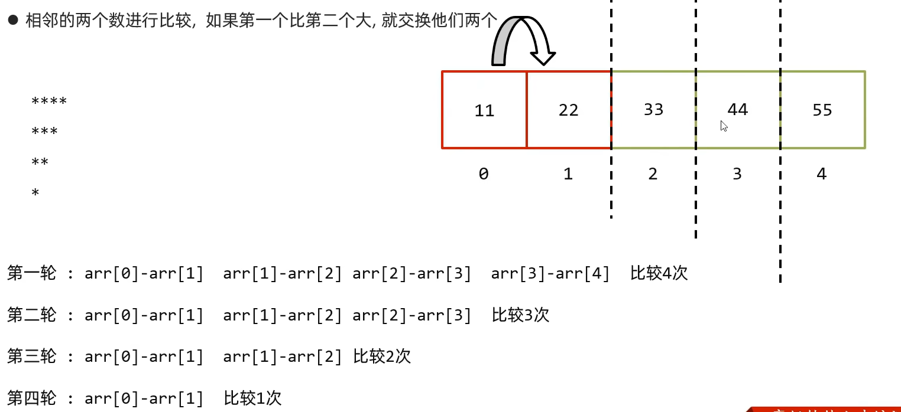

```java
public class BubbleSort {
    public static void main(String[] args) {
        int[] arr = {11, 520, 55, 152, 54};

        for (int i = 0; i < arr.length - 1; i++) {
            for (int j = 0; j < arr.length - 1 - i; j++) {
                if (arr[j] > arr[j + 1]) {
                    int tem = arr[j];
                    arr[j] = arr[j + 1];
                    arr[j + 1] = tem;
                }
            }
        }

        System.out.println(Arrays.toString(arr));
    }
}
```

## 3 选择排序

> 从```0```索引开始，拿着每一个索引上的元素跟后面的元素依次比较

```java
public class SelectSort {
    public static void main(String[] args) {
        int[] arr = {11, 520, 55, 152, 54};

        for (int i = 0; i < arr.length - 1; i++) {
            for (int j = i + 1; j < arr.length; j++) {
                if (arr[i] > arr[j]) {
                    int tem = arr[i];
                    arr[i] = arr[j];
                    arr[j] = tem;
                }
            }
        }
        System.out.println(Arrays.toString(arr));  // [11, 54, 55, 152, 520]
    }
}
```

## 4 二分查找

```java
public class BinarySearch {
    public static void main(String[] args) {

        int[] arr = {11, 22, 33, 44, 55, 66, 77, 88, 99};

        int index = binarySearch(arr, 33);
        System.out.println(index);
    }

    private static int binarySearch(int[] arr, int num) {
        int min = 0;
        int max = arr.length;
        int mid;

        while (min <= max) {
            mid = (min + max) / 2;
            if (num > arr[mid]) {
                min = mid + 1;
            } else if (num < arr[mid]) {
                max = mid - 1;
            } else {
                return mid;
            }
        }

        return -1;

    }
}
```

## 5 正则表达式

> 学了爬虫有手就行 回头啃《正则指引》

```java
String qqRegex = "[1-9]\\d{4,11}";
System.out.println("123456".matches(qqRegex));

String telRegex = "1[3-9]\\d{9}";
System.out.println("13619088888".matches(telRegex));

String emailRegex = "\\w+@[\\w&&[^_]]+(\\.[a-z]{2,3})+";
System.out.println("13619088888@163.com".matches(emailRegex));
```

| 方法名                                                     | 说明                                                       |
| ---------------------------------------------------------- | ---------------------------------------------------------- |
| ```public String replaceAll(String regex,String newStr)``` | 按照正则表达式匹配的内容进行替换                           |
| ```public String split(String regex)```                    | 按照正则表达式匹配的内容进行分割字符串，返回一个字符串数组 |


```java
public class PatternTest {
    public static void main(String[] args) {
        String data = "我的电话是：13619088888 + 我的电话是：13619088888 + 我的电话是：13619088888 + 我的电话是：13619088882";
        // 定义正则表达式
        String regex = "1[3-9]\\d{9}";
        // 将正则表达式封装为一个 Pattern 对象
        Pattern pattern = Pattern.compile(regex);
        // 获取匹配器对象
        Matcher matcher = pattern.matcher(data);
        // 通过匹配器，从内容中爬取信息
        while (matcher.find()) {
            System.out.println(matcher.group());
        }
    }
}
```

# day 07 集合进阶（上）

## 1 集合体系结构

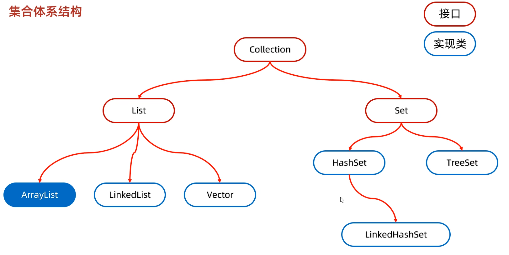

### 1.1 List 系列集合

添加的元素是有序（存和取的顺序相同）、可重复、有索引。

### 1.2 set 系列集合

添加的元素是无序（存和取的顺序可能会不相同）、不可重复、无索引。

## 2 Collection集合

> Collection是单列集合的祖宗接口，它的功能是全部单列集合都可以继承使用的。

### 2.1 成员方法

| 方法名称                            | 说明                             |
| ----------------------------------- | -------------------------------- |
| public boolean add(E e)             | 把给定的对象添加到当前集合中     |
| public void clear()                 | 清空集合中所有的元素             |
| public boolean remove(E e)          | 把给定的对象在当前集合中删除     |
| public boolean contains(Object obj) | 判断当前集合中是否包含给定的对象 |
| public boolean isEmpty()            | 判断当前集合是否为空             |
| public int size()                   | 返回集合中元素的个数/集合的长度  |

```java
public class A01_CollectionDemo1 {
    public static void main(String[] args) {
        Collection<String> coll = new ArrayList<>();
        // 1. 添加元素
        // 细节1：如果我们要往 List 系列集合中添加数据，那么方法永远返回 true，因为 List 系列的是允许元素重复的。
        // 细节2：如果我们要往 Set 系列集合中添加数帮，如果当前要添加元素不存在，方法返回 true，表示添加成功。
        //       如果当前要添加的元素已经存在，方法返回 false，表示添加失败 因为 Set 系列的集合不允许重复。
        coll.add("aa0");
        coll.add("aa1");
        coll.add("aa2");
        coll.add("aa3");
        System.out.println(coll);

        // 2. 清空
        coll.clear();
        System.out.println();

        // 3. 删除
        // 细节1: 因为 Collection 里面定义的是共性的方法 set 没有索引 所以这个地方不能通过索引进行删除 只能通过元素的对象进行删除
        // 细节2: 方法会有一个布尔类型的返回值，删除成功返回 true，刚除失败返回 false
        //       如果要删除的元素不存在，就会删除失败。
        coll.add("aa0");
        coll.add("aa1");
        coll.add("aa2");
        coll.add("aa3");
        coll.remove("aa3");
        System.out.println(coll);

        // 4. 判断元素是否存在
        // 底层依赖 equals 方法进行判断是否存在的
        // 所以自定义对象 默认继承 object 的 equals 的方法 比较地址值 所以就会错 所以自定义对象需要重写 equals 方法
        boolean result = coll.contains("aa3");
        System.out.println(result);

        // 5. 判断集合是否为空
        /*
            public boolean isEmpty() {
                return size == 0;
            }
         */
        boolean result2 = coll.isEmpty();
        System.out.println(result2);

        // 6. 获取集合的长度
        System.out.println(coll.size());
    }
}
```

注意：因为```contains```方法在底层依赖```equals```方法判断对象是否一致的。如果在的是自定义对象，没有重写```equals```方法，那么默认他用```object```类中的```equals```方法进行判断，而```object```类中```equals```方法，依赖地址值进行判断。所以需要重写```equals```方法。

### 2.2 Collection 的遍历方式——迭代器遍历

>  迭代器在Java中的类是```lterator```，迭代器是集合专用的遍历方式。
>
> 虽然之前学过```for```遍历，但是```Collection```的```set```集合是没有索引的，就不能```for```了，所以这个地方学习一个通用的，不依赖索引的迭代器...

```Collection```集合获取迭代器

|           方法名称           |                      说明                       |
| :--------------------------: | :---------------------------------------------: |
| ```Iterator<E> iterator()``` | 返回迭代器对象，默认指向当前集合的```0```索引。 |

```lterator```中的常用方法

|        方法名称         |                             说明                             |
| :---------------------: | :----------------------------------------------------------: |
| ```boolean hasNext()``` | 判断当前位置是否有元素<br/>有元素返回```true```，没有元素返回```false```。 |
|     ```E next()```      |      获取当前位置的元素，并将迭代器对象移向下一个位置。      |

```java
import java.util.ArrayList;
import java.util.Collection;
import java.util.Iterator;

public class A03_CollectionDemo3 {
    public static void main(String[] args) {
        Collection<String> coll = new ArrayList<>();
        coll.add("aaa");
        coll.add("bbb");
        coll.add("ccc");
        coll.add("ddd");

        // 获取迭代器对象
        // 迭代器就好比是一个箭头，默认指向集合的 0 索引处
        Iterator<String> it = coll.iterator();
        // 利用循环不断的去获取集合中的每一个元系
        while (it.hasNext()) {
            // next 方法的两件事情：获取元素并移动指针
            String str = it.next();
            System.out.println(str);
        }
    }
}
```

- 细节注意点

  - 如果```hasNext```为```false```，仍要去用```next```获取，则报错```NoSuchElementException```（迭代器遍历，不依赖索引，所以不报索引越界）

  - 迭代器遍历完毕，指针不会复位。如果想要再遍历一次，就重新获取一个新的迭代器对象。

  - 循环中只能用一次```next```方法。因为每用一次，就会获取元素，并移动指针。非要多次使用，就用一个变量接收叭。

  - 迭代器遍历时，不能用集合的方法进行增加（```add```）或者删除（```remove```）。

    如果非要删除，可以用迭代器提供的```remove```方法：```迭代器.remove()```。

### 2.3 Collection 的遍历方式——增强 for

> 增强```for```的底层就是迭代器，为了简化迭代器的代码书写的。<br>它是```JDK5```之后出现的，其内部原理就是一个```iterator```迭代器。<br>所有的单列集合和数组才能用增强```for```进行遍历。

```java
Collection<String> coll = new ArrayList<>();
coll.add("aaa");
coll.add("bbb");
coll.add("ccc");
coll.add("ddd");

for (String s : coll) {
    System.out.println(s);
}
```

注意：修改增强```for```中的变量，不会改变集合中原本的数据。

### 2.4 Collection 的遍历方式——Lambda 表达式

> 得益于```JDK 8```开始的新技术```Lambda```表达式，提供了一种更简单、更直接的遍历集合的方式。

|                        方法名称                        |           说明           |
| :----------------------------------------------------: | :----------------------: |
| ```default void forEach(Consumer<? super T> action)``` | 结合```lambda```遍历集合 |

```java
import java.util.ArrayList;
import java.util.Collection;
import java.util.function.Consumer;

public class A05_CollectionDemo5 {
    public static void main(String[] args) {
        Collection<String> coll = new ArrayList<>();
        coll.add("aaa");
        coll.add("bbb");
        coll.add("ccc");
        coll.add("ddd");
        
        // 匿名内部类实现
        /*
            for (int i = 0; modCount == expectedModCount && i < size; i++){
                action.accept(elementAt(es, i));
            }
            方法的底层是遍历这个集合 把每一次的遍历传给 accept
         */
        coll.forEach(new Consumer<String>() {
            @Override
            // s 就是依次表示集合的每个数据
            public void accept(String s) {
                System.out.println(s);
            }
        });
        
        // lambda 表达式
        coll.forEach(s -> System.out.println(s));
    }
}
```

## 3 List集合

> 有序：存和取的元素顺序一致<br>有索引：可以通过索引操作元素<br>可重复：存储的元素可以重复

### 3.1 List 集合的特有方法

- ```Collection```的方法```List```都继承了
- ```List```集合因为有索引，所以多了很多索引操作的方法

| 方法名称                             | 说明                                   |
| ------------------------------------ | -------------------------------------- |
| ```void add(int index, E element)``` | 在此集合中的指定位置插入指定的元素     |
| ```E remove(int index)```            | 删除指定索引处的元素，返回被删除的元素 |
| ```E set(int index,E element)```     | 修改指定索引处的元素，返回被修改的元素 |
| ```E get(int index)```               | 返回指定索引处的元素                   |

```java
import java.util.ArrayList;
import java.util.List;

public class A01_ListDemo1 {
    public static void main(String[] args) {
        List<String> list = new ArrayList<>();

        // 1. 添加
        list.add("aaa");
        list.add("bbb");
        list.add("ccc");
        System.out.println(list);  // [aaa, bbb, ccc]

        // 2. 删除
        String remove = list.remove(0);
        System.out.println(remove);  // aaa

        // 3. 改值
        String result = list.set(0, "qqq");
        System.out.println(result);  // bbb

        // 4. 取值
        String s = list.get(0);
        System.out.println(s);  // qqq
    }
}
```

细节：

```java
import java.util.ArrayList;
import java.util.List;

public class A02_ListDemo2 {
    public static void main(String[] args) {
        List<Integer> list = new ArrayList<>();

        list.add(1);
        list.add(2);
        list.add(3);
        list.add(4);

        // 因为在调用方法的时候，如果方法出现了重载现象
        // 优先调用，实参跟形参类型一致的那个方法。(所以 remove 不会自动装箱)
        list.remove(1);  // 删的是索引
        System.out.println(list);

        // 手动装箱
        Integer i = Integer.valueOf(1);  // [1, 3, 4]
        list.remove(i);

        System.out.println(list);  // [3, 4]
    }
}
```

### 3.3 List 集合的遍历方式

- 选代器
- 列表选代器
- 增强```for```
- ```Lambda```表达式 / 匿名内部类
- 普通```for```循环

```java
import java.util.ArrayList;
import java.util.Iterator;
import java.util.List;
import java.util.ListIterator;
import java.util.function.Consumer;

public class A03_ListDemo3 {
    public static void main(String[] args) {
        List<String> list = new ArrayList<>();
        list.add("aaa");
        list.add("bbb");
        list.add("ccc");
        list.add("ddd");

        // 1. 迭代器
        Iterator<String> it = list.iterator();
        while (it.hasNext()) {
            System.out.println(it.next());
        }

        // 2. 增强 for
        for (String s : list) {
            System.out.println(s);
        }

        // 3. lambda
        list.forEach(new Consumer<String>() {
            @Override
            public void accept(String s) {
                System.out.println(s);
            }
        });

        list.forEach(s -> System.out.println(s));

        // 4. 普通 for
        for (int i = 0; i < list.size(); i++) {
            System.out.println(list.get(i));
        }

        // 5. 列表迭代器
        // 获取列表迭代器对象
        ListIterator<String> it1 = list.listIterator();
        while (it1.hasNext()) {
            String str = it1.next();
            System.out.println(str);

            // 提供了添加的方法
            if ("aaa".equals(str)) {
                it1.add("qqq");
            }

        }
        System.out.println(list);  // [aaa, qqq, bbb, ccc, ddd]
    }
}
```

- 五种遍历方法的比较
  - 在遍历的过程中需要删除元素，请使用迭代器。
  - 在遍历的过程中需要添加元素，请使用列表迭代器
  - 仅仅想遍历，那么使用增强```for```或```Lambda```表达式 / 匿名内部类。
  - 如果遍历的时候想操作索引，可以用普通```for```。

### 3.4 数据结构

> 数据结构是计算机底层存储、组织数据的方式是指数据相互之间是以什么方式排列在一起的。<br>数据结构是为了更加方便的管理和使用数据，需要结合具体的业务场景来进行选择。<br>一般情况下，精心选择的数据结构可以带来更高的运行或者存储效率。
>
> 不同的业务场景下，要使用不同的数据结构。而Java的不同的集合，他们的数据结构是不一样的，所以为了更好的选择集合，所以我们先要学习数据结构...

> - 栈：后进先出，先进后出。
> - 队列：先进先出，后进后出。
> - 数组：内存连续区域，查询快，增删慢。
> - 链表：元素是游离的查询慢，首尾操作极快。

#### 3.4.1 栈

- 栈的特点：后进先出，先进后出
- 数据进入栈模型的过程称为：压 / 进栈
- 数据离开栈模型的过程称为：弹 / 出栈

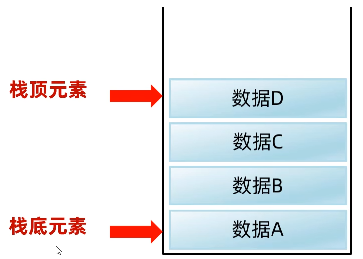

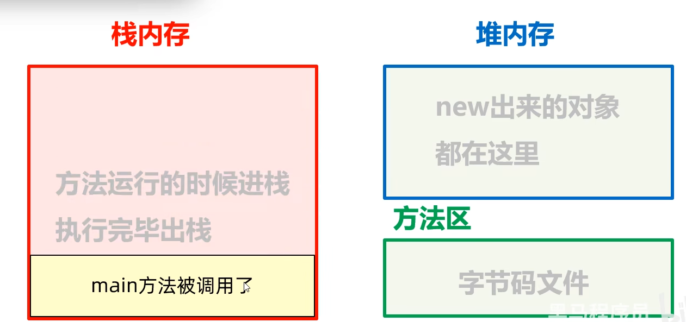

#### 3.4.2 队列

- 队列的特点：先进先出，后进后出
- 数据从后端进入队列模型的过程称为：入队列
- 数据从前端离开队列模型的过程称为：出队列

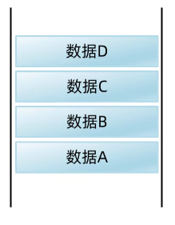

#### 3.4.3 数组

> 数组是一种查询快，增删慢的模型

- 查询速度快：查询数据通过地址值和索引定位，查询任意数据耗时相同。（元素在内存中是连续存储的）
- 删除效率低：要将原始数据删除，同时后面每个数据前移
- 添加效率极低：添加位置后的每个数据后移，再添加元素。

#### 3.4.4 链表

> 链表中的结点是独立的对象，在内存中是不连续的。每个结点包含数据值和下一个结点的地址。

- 链表查询慢，无论查询哪个数据都要从头开始找
- 链表增删相对快

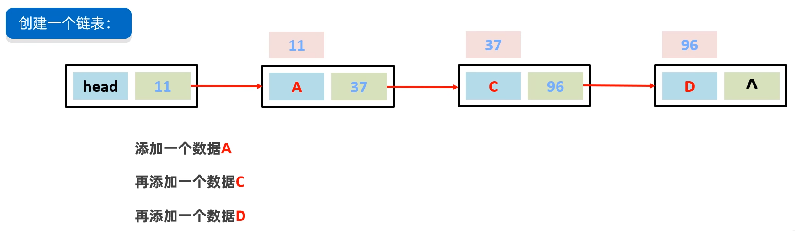

## 4 ArrayList 集合

### 4.1 ArrayList 集合底层原理

1. 利用空参创建的集合，在底层创建一个默认长度为```0```的数组，叫做```elementData```。同时有一个成员变量```size```，记录个数。

2. 添加第一个元素时，底层会创建一个新的长度为```10```的数组。

   ```java
   elementData = {"a", null, null, null, null, null, null, null, null, null}
   size = 1
   ```

   - ```size```的意义

     - 元素个数
     - 下次存入的位置

     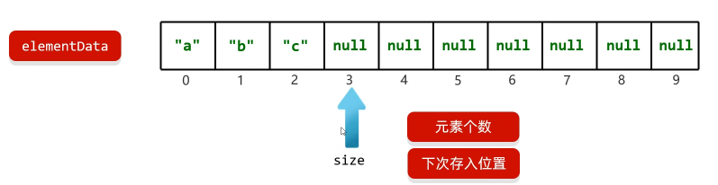

3. 存满时，会扩容```1.5```倍。

4. 如果一次添加多个元素，```1.5```倍还放不下，则新创建数组的长度以实际为准。

他喵的这就是八股文要背的？

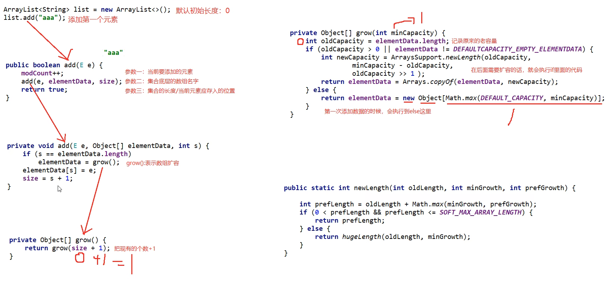

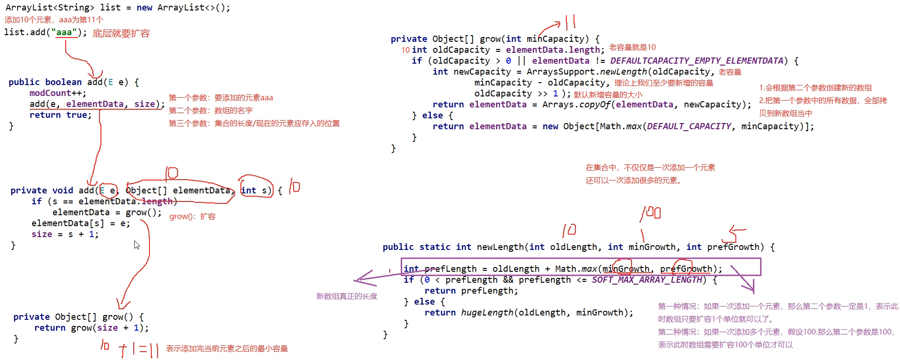

## 5 LinkedList 集合

> 底层数据结构是双链表，查询慢，增删快，但是如果操作的是首尾元素，速度也是极快的，所以多了很多首尾操作的特有API。

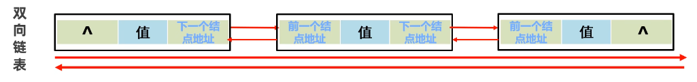

### 5.1 特有方法

|            特有方法             |               说明               |
| :-----------------------------: | :------------------------------: |
| ```public void addFirst(E e)``` |    在该列表开头插入指定的元素    |
| ```public void addLast(E e)```  |  将指定的元素追加到此列表的末尾  |
|    ```public E getFirst()```    |     返回此列表中的第一个元素     |
|    ```public E getLast()```     |    返回此列表中的最后一个元素    |
|  ```public E removeFirst()```   |  从此列表中删除并返回第一个元素  |
|   ```public E removeLast()```   | 从此列表中删除并返回最后一个元素 |

### 5.2 源码

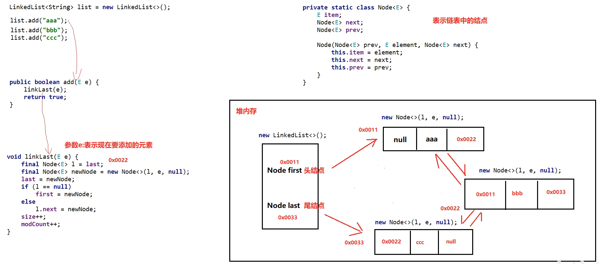


## 6 迭代器源码

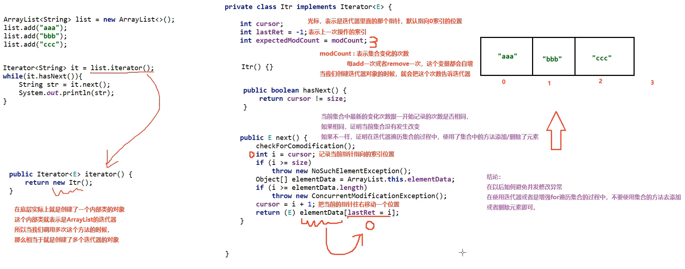

# day 08 集合进阶（下）

## 1 泛型深入

> 是```JDK5```中引入的特性，可以在编译阶段约束操作的数据类型，并进行检查。

- 泛型的格式：```<数据类型>```
- 注意：泛型只能支持引用数据类型

### 1.1 泛型的好处

```java
import java.util.ArrayList;
import java.util.Iterator;

public class GenericsDemo1 {
    public static void main(String[] args) {
        // 没有泛型时 怎么存储数据
        ArrayList list = new ArrayList<>();
        // 如果我们没有给集合指定类型，默认认为所有的数据类型都是 object 类型
        // 此时可以往集合添加任意的数据类型。
        // 带来一个坏处：我们在获取数据的时候，无法使用他的特有行为。
        list.add(123);
        list.add("aaa");
        list.add(new Student("张三", 123));
        // 遍历集合
        Iterator it = list.iterator();
        while (it.hasNext()) {
            Object obj = it.next();
            // 多态的弊端是不能范围子类特有功能 这个地方如果要强转 但是不知道强转成什么类型
            System.out.println(obj);
        }
        // 为了解决上面这个问题 便引入了泛型这个概念
    }
}
```

- 统一数据类型
- 把运行时期的问题提前到了编译期间，避免了强制类型转换可能出现的异常，因为在编译阶段类型就能确定下来.

### 1.2 扩展

- Java中的泛型是伪泛型
- 泛型的擦除：Java文件中，使用泛型在编译阶段约束操作的数据类型。在编译为```.class```文件后，泛型部分会被删掉。

### 1.3 泛型的细节

- 泛型中不能写基本数据类型
- 指定泛型的具体类型后，传递数据时，可以传入该类类型或者其子类类型
- 如果不写泛型，类型默认是```Object```

### 1.4 泛型类

> 当一个类中，某个变量的数据类型不确定时，就可以定义带有泛型的类。

- 格式

  ```java
  修饰符 class 类名<类型>{
      
  }
  ```

- 举个例子

  ```java
  public class ArryList<E> {
      
  }
  ```

- 此处```E```可以理解为变量，但是不是用来记录数据的，而是记录数据的类型，可以写成：```T```、```E```、```K```、```V```等。

- 比如说我们自己写一个泛型类

  ```java
  import java.util.Arrays;
  
  /*
  *  当我在编写个类的叫候，如果不确定类型，耶么这个类就可以定义为泛型类
   */
  public class MyArrayList<E> {
  
      Object[] obj = new Object[10];
      int size;
      /*
      E：不确定的类型 在类名后面已经定义了
      e：形参名，变量名
       */
      public boolean add(E e){
          obj[size] = e;
          size ++;
          return true;
      }
  
      public E get(int index) {
          return (E) obj[index];
      }
  
      @Override
      public String toString() {
          return Arrays.toString(obj);
      }
  }
  ```

  ```java
  public class GenericsDemo2 {
      public static void main(String[] args) {
          MyArrayList<String> list = new MyArrayList<>();
          list.add("aaa");
          list.add("bbb");
          list.add("ccc");
  
          System.out.println(list);  // [aaa, bbb, ccc, null, null, null, null, null, null, null]
  
          MyArrayList<Integer> list1 = new MyArrayList<>();
          list1.add(123);
          list1.add(1007);
          list1.add(456);
  
          int i = list1.get(1);
          System.out.println(i);  // 1007
      }
  }
  ```

### 1.5 泛型方法

> 方法中形参类型不确定时

- 格式

  ```java
  修饰符<类型> 返回值类型 方法名(类型 变量名) {
      
  }
  ```

- 举个例子

  ```java
  public <T> void show (T t) {
      
  }
  ```

- 比如说我们有一个```ListUtil```这个工具类

  ```java
  import java.util.ArrayList;
  
  public class ListUtil {
      private ListUtil(){}
  
      /*
      *  参数一：集合
      *  参数二：要添加的元素
      * */
      public static<E> void addAll(ArrayList<E> list, E e1, E e2,E e3,E e4){
          list.add(e1);
          list.add(e2);
          list.add(e3);
          list.add(e4);
      }
  
      public void show() {
          System.out.println("阿伟...");
      }
  }
  ```

  ```java
  import java.util.ArrayList;
  
  public class GenericsDemo3 {
      public static void main(String[] args) {
  
          ArrayList<String> list1 = new ArrayList<>();
          ListUtil.addAll(list1, "aaa", "bbb", "ccc", "ddd");
          System.out.println(list1);  // [aaa, bbb, ccc, ddd]
  
          ArrayList<Integer> list2 = new ArrayList<>();
          ListUtil.addAll(list2, 123, 456, 789, 101);
          System.out.println(list2);  // [123, 456, 789, 101]
      }
  }
  ```

### 1.6 泛型接口

- 格式

  ```java
  修饰符 interface 接口名<类型>{
      
  }
  ```

- 举例

  ```java
  public interface Liste<E> {
      
  }
  ```

- 使用

  - 方式1：实现类给出具体类型

    我们在实现```List```接口时给出了类型

    ```java
    public class MyArrayList2 implements List<String> {
        @Override
        public int size() {
            return 0;
        }
        ...
    }
    ```

    使用

    ```java
    MyArrayList2 list = new MyArrayList2();
    list.add("aaa");
    System.out.println(list);
    ```

  - 方式2：实现类延续泛型，创建对象时再有定

    我们在实现```List```接口时，延续了泛型

    ```java
    public class MyArrayList3<E> implements List<E> {
        @Override
        public int size() {
            return 0;
        }
    	...
    }
    ```

    创建对象时，给了```String```类型

    ```java
    MyArrayList3<String> list3 = new MyArrayList3();
    list3.add("aaa");
    list3.add("bbb");
    System.out.println(list3);
    ```

### 1.7 泛型的教程和通配符

> 泛型不具备继承性，但是数据具备继承性

- 比如说场景

  想接收```Ye```，```Fu```，```Zi```三个类型，由于泛型不具备继承性，所以比如说泛型为```<Ye>```，则只能接收```Ye```，不能接收```Fu```，```Zi```。

  如果我们写成```<E>```，那么虽然可以接收```Ye```，```Fu```，```Zi```三个类型，但是其他类型也可以传入 ...

- 此时我们就可以使用泛型的通配符

  - ```?```也表示不确定的类型，他可以进行类型的限定
  - ```? extends E```：表示可以传递```E```或者```E```所有的子类类型
  - ```? super E```：表示可以传递```E```或者```E```所有的父类类型

- 应用场景

  - 如果我们在定义类、方法、接口的时候，如果类型不确定，就可以定义泛型类、泛型方法、泛型接
  - 如果类型不确定，但是能知道以后只能传递某个继承体系中的，就可以泛型的通配符

- 关键点：可以限定类型的范围。

### 1.8 总结

1. 什么是泛型?

   ```JDK5```引入的特性，可以在编译阶段约束操作的数据类型，并进行检查

2. 泛型的好处?

   统一数据类型

   把运行时期的问题提前到了编译期间，避免了强制类型转换可能出现的异常，因为在编译阶段类型就能确定下来

3. 泛型的细节?

   泛型中不能写基本数据类型

   指定泛型的具体类型后，传递数据时，可以传入该类型和他的子类类型

   如果不写泛型，类型默认是```object```

4. 哪里定义泛型?

   泛型类：在类名后面定义泛型，创建该类对象的时候，确定类型

   泛型方法：在修饰符后面定义方法，调用该方法的时候，确定类型

   泛型接口：在接口名后面定义泛型，实现类确定类型，实现类延续泛型
5. 泛型的继承和通配符

   泛型不具备继承性，但是数据具备继承性

   泛型的通配符：```?```

   - ```? extend E```
   - ```? super E```

6. 使用场景

   定义类、方法、接口的时候，如果类型不确定，就可以定义泛型

   如果类型不确定，但是能知道是哪个继承体系中的，可以使用泛型的通配符

## 2 数据结构——树

### 2.1 相关概念

- 度：每一个节点的子节点数量

  二叉树：任意节点的度```≤2```

- 树高：树的总层数

- 根节点：最顶层的节点

- 左子节点：左下方的节点

- 右子节点：右下方的节点

- 根节点的左子树：蓝色虚线

- 根节点的右子树：绿色虚线

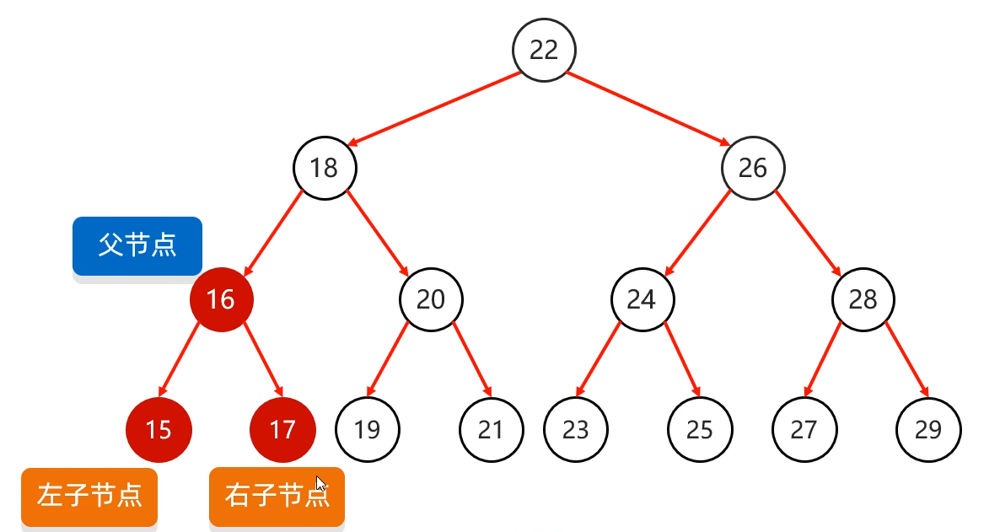

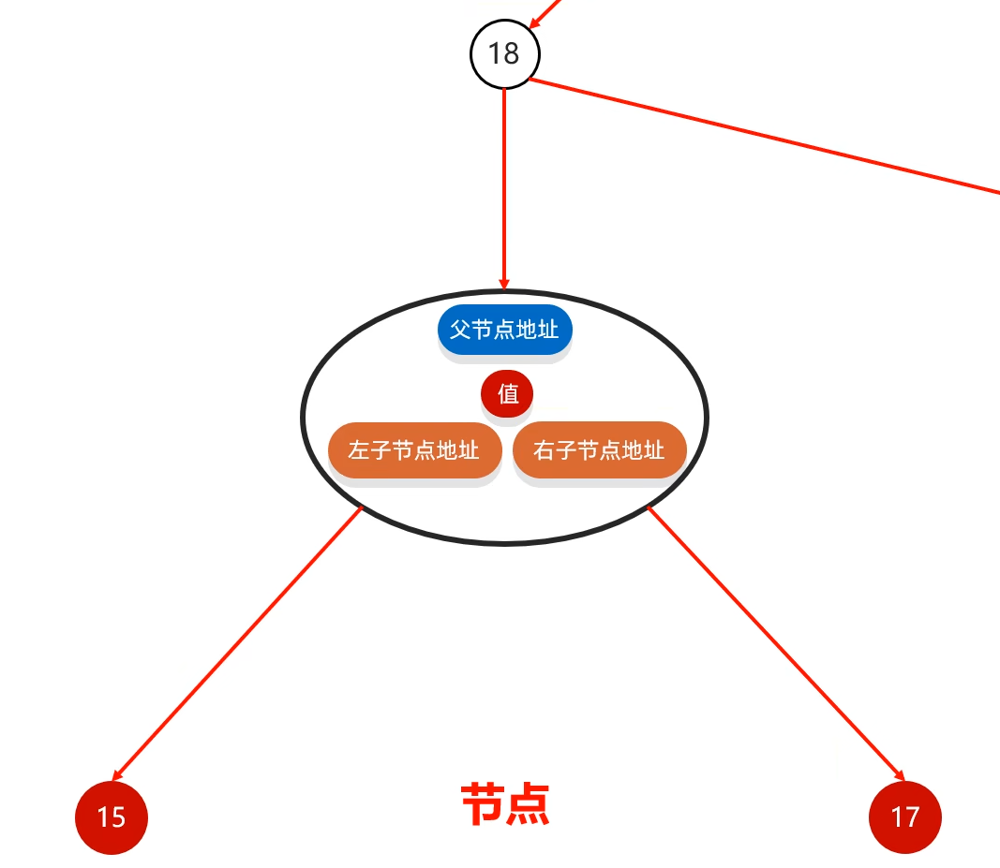

### 2.2 二叉查找树

> 二叉查找树，又称二叉排序树或者二叉搜索树

- 特点
  - 每一个节点上最多有两个子节点
  - 任意节点左子树上的值都小于当前节点
  - 任意节点右子树上的值都大于当前节点
- 添加节点
  - 小的存左边
  - 大的存右边
  - 一样的不存


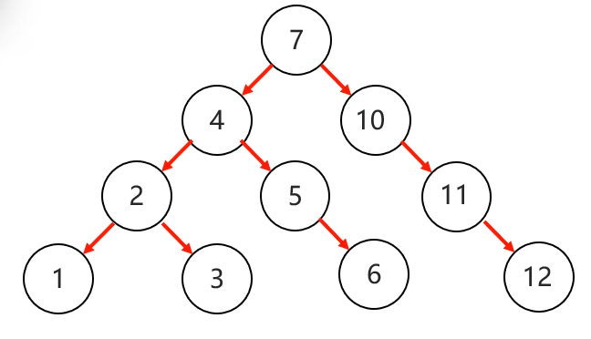

### 2.3 二叉树遍历方式

- 前序遍历

  从根结点开始，然后按照**当前结点**，左子结点，右子结点的顺序遍历

- **中序遍历**（遍历结果是从小到大）

  从最左边的子节点开始，然后按照左子结点，**当前结点**，右子结点的顺序遍历

- 后序遍历

  从最左边的子节点开始，然后按照左子结点，右子结点，当前结点的顺序遍历

- 层序遍历

  从根节点开始一层一层的遍历

### 2.4 二叉查找树的弊端

有可能，会，嗯，就是，成一个链表...

### 2.5 平衡二叉树

> 任意节点左右子树高度差不超过```1```

### 2.6 平衡二叉树的旋转机制

> 当添加一个节点之后，该树不再是一颗平衡二叉树，便触发
>
> - 规则1：左旋
> - 规则2：右旋

- 左旋

  1. 从添加的节点开始，不断的往父节点找不平衡的节点
  2. 以不平衡的点作为支点
  3. 把支点左旋降级，变成左子节点
  4. 晋升原来的右子节点

  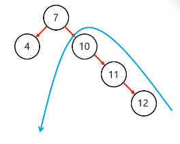

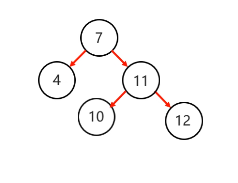

- 举个例子

  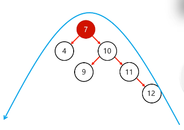

  1. 以不平衡的点作为支点
  2. 将根节点的右侧往左拉
  3. 原先的右子节点变成新的父节点，并把多余的左子节点出让，给已经降级的根节点当右子节点

  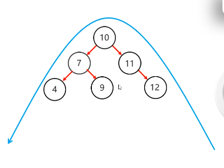

- 右旋

  同理可得

- 四种情况

  - 左左：一次右旋
  - 左右：先局部左旋，再整体右旋
  - 右右：一次左旋
  - 右左：先局部右旋，再整体左旋

### 2.7 红黑树

- 红黑树是一种自平衡的二叉查找树，是计算机科学中用到的一种数据结构。
- 1972年出现，当时被称之为平衡二叉B树。后来，1978年被修改为如今的“红黑树”。
- 它是一种特殊的二叉查找树，红黑树的每一个节点上都有存储位表示节点的颜色。
- 每一个节点可以是红或者黑，红黑树**不是高度平衡的**，它的平衡是通过“**红黑规则**”进行实现的

对比

- 平衡二叉树
  - 高度平衡
  - 当左右子树高度差超过```1```时，通过旋转保持平衡
- 红黑树
  - 是一个二叉查找树
  - 但是不是高度平衡的
  - 条件：**特有的红黑规则**

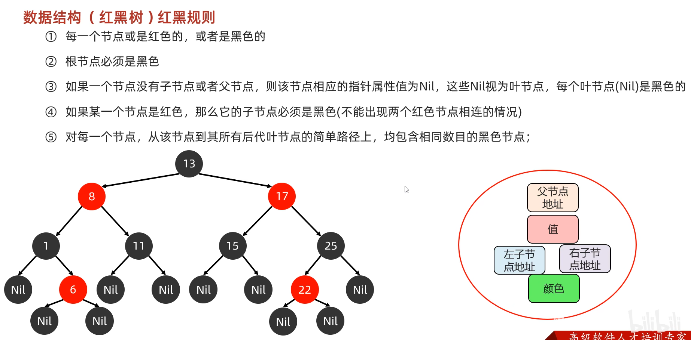

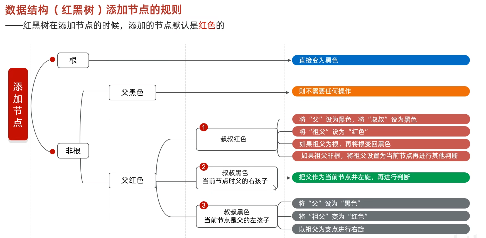

## 3 Set系列集合

> - 无序：存取顺序不一致
> - 不重复：可以去除重复
> - 无索引：没有带索引的方法，所以不能使用普通```for```循环遍历，也不能通过索引来获取元素

### 3.0 Set 集合的实现类

- ````HashSet```：无序、不重复、无索引
- ```LinkedHashSet```：**有序**、不重复、无索引
- ```TreeSet```：**可排序**、不重复、无索引

```Set```接口中的方法上基本上与```Collection```的```API```一致

### 3.1 set 集合遍历方式

```java
import java.util.HashSet;
import java.util.Iterator;
import java.util.Set;
import java.util.function.Consumer;

public class A01_SetDemo1 {
    public static void main(String[] args) {
        Set<String> s = new HashSet<>();

        // 1. 添加元素
        // 如果当前元素是第一次添加，那么可以添加成功，返回 true
        // 如果当前元素是第二次添加，那么添加失败，返回 false
        boolean r1 = s.add("aaa");  // true
        boolean r2 = s.add("aaa");  // false
        boolean r3 = s.add("bbb");  // true
        boolean r4 = s.add("ccc");  // true

        // 迭代器遍历
        Iterator<String> it = s.iterator();
        while (it.hasNext()) {
            String res = it.next();
            System.out.println(res);
        }

        // 增强 for
        for (String s1 : s) {
            System.out.println(s1);
        }

        // Lambda 表达式
        s.forEach(new Consumer<String>() {
            @Override
            public void accept(String str) {
                System.out.println(str);
            }
        });

        s.forEach(s1 -> System.out.println(s1));
    }
}
```

## 4 HashSet

### 4.1 HashSet 底层原理

- HashSet 集合底层采取哈希表存储数据
- 哈希表是一种对于增删改查数据性能都较好的结构

### 4.2 哈希表组成

- ```JDK8```之前：数组+链表
- ```JDK8```开始：数组+链表+红黑树

### 4.3 哈希值

- 根据```hashCode```方法算出来的```int```类型的整数
- 该方法定义在```Object```类中，所有对象都可以调用，默认使用地址值进行计算
- 一般情况下，会重写```hashCode```方法，利用对象内部的属性值计算哈希值

### 4.4 对象的哈希值特点

- 如果没有重写```hashCode```方法，不同对象计算出的哈希值是不同的
- 如果已经重写```hashcode```方法，不同的对象只要属性值相同，计算出的哈希值就是一样的
- 在小部分情况下，不同的属性值或者不同的地址值计算出来的哈希值也有可能一样。（哈希碰撞）

```java
Student stu1 = new Student("张三", 23);
Student stu2 = new Student("张三", 23);

System.out.println(stu1.hashCode());  // 24022543
System.out.println(stu2.hashCode());  // 24022543

System.out.println("abc".hashCode());  // 96354
System.out.println("acD".hashCode());  // 96354
```

### 4.5 HashSet JDK8 底层原理

1. 默认长度16，默认加载因子0.75的数组，数组名```table```

   ```java
   HashSet<String> hm = new HashSet<>();
   ```

2. 根据元素的哈希值跟数组的长度计算出应存入的位置

   ```java
   int index = (数组长度 - 1) & 哈希值;
   ```

3. 判断当前位置是否为```null```，如果是```null```直接存入

4. 如果位置不为```null```，表示有元素，则调用```equals```方法比较属性值

5. 一样：不存；不一样：存入数组，形成链表

   ```JDK8```以前：新元素存入数组，老元素挂在新元素下面

   ```JDK8```及以后：新元素直接挂在老元素下面

- 加载因子：数组中的元素个数 > 数组长度 * 0.75 = 12,时，数组会扩容到原来的两倍
- ```JDK8```及以后，当链表长度大于8，而且数组长度大于等于64，会自动转为红黑树
- 如果集合中存储的是自定义对象，必须要重写```hashCode```和```equals```方法

### 4.6 HashSet 的三个问题

- 问题1：HashSet为什么存和取的顺序不一样?
- 问题2：HashSet为什么没有索引?
- 问题3：HashSet是利用什么机制保证数据去重的?

## 5 LinkedHashSet

> - **有序**、不重复、无索引。
> - 这里的有序指的是保证存储和取出的元素顺序一致
> - 原理：底层数据结构是依然哈希表，只是每个元素又额外的多了一个双链表的机制记录存储的顺序。

```java
public static void main(String[] args) {
    Student stu1 = new Student("zhangsan", 23);
    Student stu2 = new Student("lisi", 23);
    Student stu3 = new Student("zhangsan", 23);
    Student stu4 = new Student("zhangsan", 203);

    LinkedHashSet<Student> lhs = new LinkedHashSet<>();

    System.out.println(lhs.add(stu1));
    System.out.println(lhs.add(stu2));
    System.out.println(lhs.add(stu3));
    System.out.println(lhs.add(stu4));

    System.out.println(lhs);

}
```

- 在以后如果要数据去重，我们使用哪个?

  默认使用```HashSet```。如果要求去重且存取有序，才使用```LinkedHashSet```

## 6 TreeSet

> - 不重复、无索引、可排序
> - 可排序: 按照元素的默认规则（有小到大）排序。
> - ```TreeSet```集合底层是基于红黑树的数据结构实现排序的，增删改查性能都较好

### 6.1 举个栗子

```java
import java.util.Iterator;
import java.util.TreeSet;
import java.util.function.Consumer;

public class A05_TreeSetDemo1 {
    public static void main(String[] args) {
        TreeSet<Integer> ts = new TreeSet<>();

        ts.add(3);
        ts.add(4);
        ts.add(1);
        ts.add(2);
        ts.add(5);

        System.out.println(ts);

        // 迭代器遍历
        Iterator<Integer> it = ts.iterator();
        while (it.hasNext()) {
            System.out.println(it.next());
        }

        // 增强 for
        for (Integer t : ts) {
            System.out.println(t);
        }

        // lambda
        ts.forEach(new Consumer<Integer>() {
            @Override
            public void accept(Integer i) {
                System.out.println(i);
            }
        });

        ts.forEach(i -> System.out.println(i));
    }
}
```

### 6.2 TreeSet 集合默认的规则

> 默认排序 / 自然排序：```Javabean```类实现```Comparable```接口指定比较规则

- 对于数值类型：```Integer```，```Double```，默认按照从小到大的顺序进行排序
- 对于字符、字符串类型：按照字符在```ASCII```码表中的数字升序进行排序

```java
import com.itheima.a01mycollection.Student;

import java.util.TreeSet;

public class A06_TreeSetDemo2 {
    public static void main(String[] args) {
        Student stu1 = new Student("zhangsan", 23);
        Student stu2 = new Student("lisi", 24);
        Student stu3 = new Student("wangwu", 25);

        TreeSet<Student> ts = new TreeSet<>();

        ts.add(stu1);
        ts.add(stu2);
        ts.add(stu3);

        System.out.println(ts);
        // [Student{name = zhangsan, age = 23}, Student{name = lisi, age = 24}, Student{name = wangwu, age = 25}]
    }
}
```

自定义对象，为了能够排序，必须要教程```Comparable```接口，重写```compareTo```方法

```java
import java.util.Objects;

public class Student implements Comparable<Student>{
    private String name;
    private int age;

    ...
        
    @Override
    public int compareTo(Student o) {
        // 指定排序规则
        // this: 表示当前要添加的元素
        // o: 表示已经在红照树存在的元素

        // 返回值:
        // 负数:表示当前要添加的元素是小的，存左边
        // 正数:表示当前要添加的元素是大的，存右边
        // 0:表示当前要添加的元素已经存在，舍弃
        System.out.println("this:" + this);
        System.out.println("o:" + o);
        System.out.println("--------------");
        return this.getAge() - o.getAge();
}
}

```

### 6.3 TreeSet 集合比较器排序

> 比较器排序：创建```TreeSet```对象时候，传递比较器```Comparator```指定规则
>
> 默认使用第一种，如果第一种不能满足当前需求，就使用第二种

```java
import java.util.TreeSet;

public class A07_TreeSetDemo3 {
    public static void main(String[] args) {
        /*
            需求:请自行选择比较器排序和自然排序两种方式;
            要求:存入四个字符串，“c”，“ab”，“df”，“qwer”
            按照长度排序，如果一样长则按照首宁字母排序
         */
        TreeSet<String> ts = new TreeSet<>((o1, o2) -> {
                // o1：当前要添加的元素
                // o2：已经在红黑树的元素
                // 返回值：和之前一样
                int i = o1.length() - o2.length();
                // 如果长度一样 就按照首字母（调用 String 已经写好的）
                i = i == 0 ? o1.compareTo(o2) : i;
                return i;
        });

        ts.add("c");
        ts.add("ab");
        ts.add("df");
        ts.add("qwer");

        System.out.println(ts);  // [c, ab, df, qwer]
    }
}
```

### 6.4 小案例

```java
        /*
            需求:创建5个学生对象
            属性:(姓名,年龄，语文成绩,数学成绩,英语成绩),
            按照总分从高到低输出到控制台
            如果总分一样，按照语文成绩排如果语文一样，
            按照数学成绩排如果数学成绩一样，按照英语成绩排
            如果英文成绩一样，按照年龄排
            如果年龄一样，按照姓名的字母顺序排
            如果都一样，认为是同一个学生，不存。
         */
@Override
public int compareTo(Student o) {
    // 比较总分
    int sum1 = this.getChinese() + this.getMath() + this.getEnglish();
    int sum2 = o.getChinese() + o.getMath() + o.getEnglish();
    int i = sum1 - sum2;
    // 比较语文
    i = i == 0 ? this.getChinese() - o.getChinese() : i;
    // 比较数学
    i = i == 0 ? this.getMath() - o.getMath() : i;
    // 总分和语文数学一样了 英语也就一样了
    i = i == 0 ? this.getAge() - o.getAge() : i;
    // 都一样 比较名字
    i = i == 0 ? this.getName().compareTo(o.getName()) : i;

    return i;

}
```

### 6.4 总结

1. ```TreeSet```集合的特点是怎么样的？

   - 可排序、不重复、无索引

   - 底层基于红黑树实现排序，增删改查性能较好

2. ```TreeSet```集合自定义排序规则有几种方式
   - 方式一：```Javabean```类实现```Comparable```接口，指定比较规则
   - 方式二：创建集合时，自定义```Comparator```比较器对象，指定比较规则

3. 方法返回值的特点
   - 负数：表示当前要添加的元素是小的，存左边
   - 正数：表示当前要添加的元素是大的，存右边
   - ```0```：表示当前要添加的元素已经存在，舍弃

## 7 总结与源码分析

### 7.1 使用场景

1. **如果想要集合中的元素可重复**

   **用```ArrayList```集合，基于数组的。 （用的最多）**

2. 如果想要集合中的元素可重复，而且当前的**增删操作明显多于查询**

   用```LinkedList```集合，基于链表的

3. **如果想对集合中的元素去重**

   **用```HashSet```集合，基于哈希表的。（用的最多）**

4. 如果想对集合中的元素去重，而且**保证存取顺序**

   用```LinkedHashSet```集合，基于哈希表和双链表，效率低于```HashSet```

5. 如果想对集合中的元素进行**排序**

   用```TreeSet```集合，基于红黑树。后续也可以用```List```集合实现排序

恭喜发发在2023年2月9日```00:19:15```看完上片

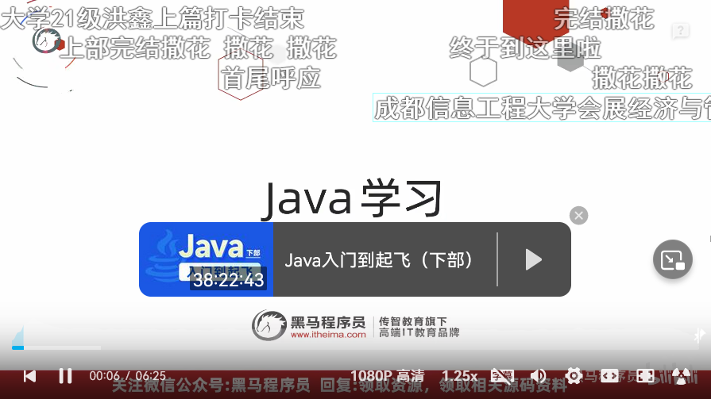
