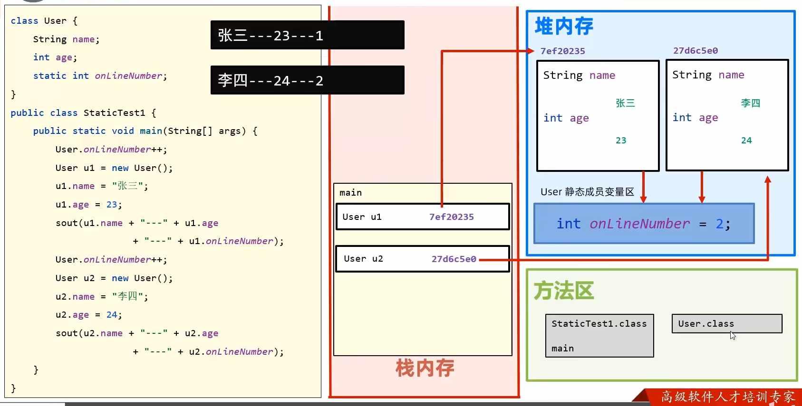
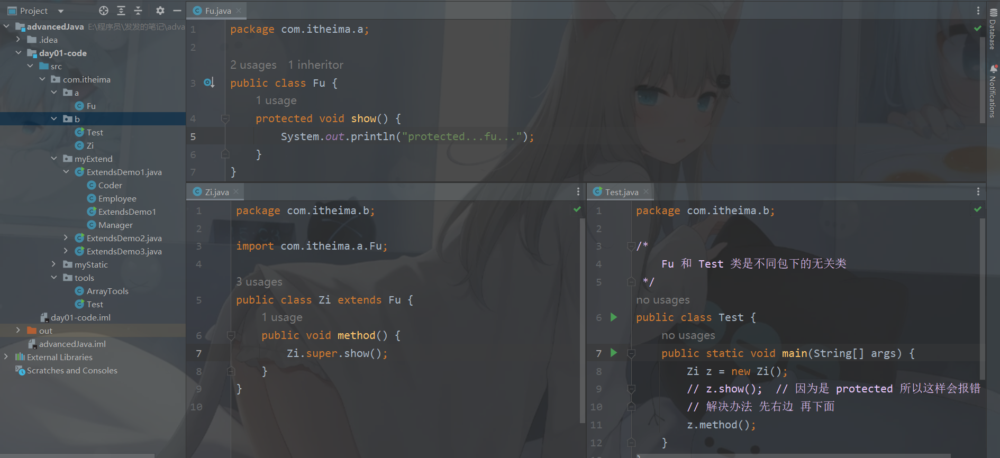
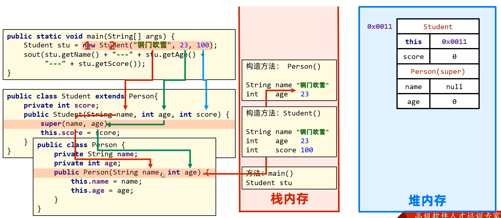
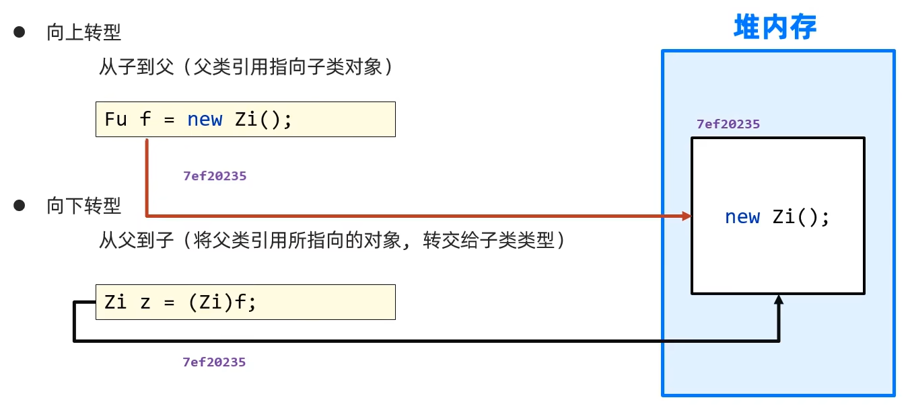

# day 01 面向对象高级编程

## 1 static 关键字

```static```是静态的意思，可以修饰成员变量，也可以修饰成员方法

### 1.1 特点

- 被类的所有对象所共享
- 多了一种调用的方法（之前是实例化后的```对象.```），可以通过类名进行调用。也推荐这种方式。
- 随着类的加载而加载，优先于对象存在

```java
public class Student {
    String name;
    int age;
    static String school;  // 这个地方 static 静态修饰了
}

public static void main(String[] args) {
    System.out.println(Student.school);  // 随着类的加载而加载，优先于对象存在

    Student stu1 = new Student();

    stu1.name = "fafa";
    stu1.age = 22;
    stu1.school = "双流一带专";
    System.out.println(stu1.name + "---" + stu1.age + "---" + stu1.school);

    Student stu2 = new Student();
    stu2.name = "fafafa";
    stu2.age = 24;
    // stu2.school = "双流一带专";  // 可以不需要 因为可以共享
    System.out.println(stu2.name + "---" + stu2.age + "---" + stu2.school);
    System.out.println(Student.school);  // 多了一种调用方法 类名.
}
```

### 1.2 内存图



### 1.3 修饰成员方法

常用于工具类

```java
package com.itheima.tools;

public class ArrayTools {

    // 私有构造方法 没有必要暴露
    private ArrayTools() {}

    // 加了 static 就可以直接调
    public static int getMax(int[] arr) {
        int max = arr[0];
        for (int i = 1; i < arr.length; i++) {
            if (arr[i] > max) {
                max = arr[i];
            }
        }
        return max;
    }

    public static int getMin(int[] arr) {
        int min = arr[0];
        for (int i = 1; i < arr.length; i++) {
            if (arr[i] < min) {
                min = arr[i];
            }
        }
        return min;
    }

    public static void printArray(int[] arr) {
        System.out.print("{");
        for (int i = 0; i < arr.length - 1; i++) {
            System.out.print(arr[i] + ", ");
        }
        System.out.print(arr[arr.length - 1] + "}");
    }
}
```

```java
package com.itheima.tools;

public class Test {
    public static void main(String[] args) {
        int[] arr = {11, 22, 33, 58};

        // ArrayTools tools = new ArrayTools();  // 私有了构造方法

        // 直接 对象名. 调用
        System.out.println(ArrayTools.getMax(arr));
        System.out.println(ArrayTools.getMin(arr));
        ArrayTools.printArray(arr);

        // 比如说这个就是
        System.exit(0);
    }
}
```

### 1.4 注意事项

- ```static```方法中，只能访问静态成员（直接访问）
- ```static```中不允许使用```this```关键字

### 1.5 重新认识main方法

```java
public class HelloWorld {
    public static void main(String[] args) {
        System.out.println("HelloWorld");
    }
}
```

- ```public```：被```JVM```调用，访问权限足够大。
- ```static```：被```JVM```调用，不用创建对象。因为```main```方法是静态的，所以测试类中其他方法也需要是静态的。
- ```void```：被```JVM```调用，不需要给```JVM```返回值。
- ```main```：一个通用的名称，虽然不是关键字，但是被```JVM```识别。
- ```String[] args```：以前用于接收键盘录入数据的，现在没用。

## 2 继承

继承：让**类与类之间产生关系**（子父类关系），**子类**可以**直接使用**父类中**非私有的成员**

### 2.1 格式

- 格式：```public class 子类名 extends 父类名```
- 范例：```public class Zi extends Fu {}```
- ```Fu```：是父类，也被称为基类、超类
- ```Zi```：是子类，也被称为派生类

```java
public class ExtendsDemo1 {
    public static void main(String[] args) {
        Coder c = new Coder();
        c.setAge(2);
        c.setName("fafa");

        System.out.println(c.getName() + "---" + c.getAge());
    }
}

class Employee {
    private String name;
    private int age;

    private double salary;

    public String getName() {
        return name;
    }

    public void setName(String name) {
        this.name = name;
    }

    public int getAge() {
        return age;
    }

    public void setAge(int age) {
        this.age = age;
    }

    public double getSalary() {
        return salary;
    }

    public void setSalary(double salary) {
        this.salary = salary;
    }
}

// 继承
class Coder extends Employee {

}
class Manager extends Employee {

}
```

### 2.2 什么时候使用继承

- 当类与类之间，存在相同（共性）的内容，并且产生了 is a 的关系，就可以考虑使用继承，来优化代码。

### 2.3 成员变量

- 子父类，如果出现了重名的成员变量，使用的时候会优先使用？

  - 根据就近原则，必定是使用子类的

  - 但是非要使用父类的，可以用```super```关键字

    ```java
    public class ExtendsDemo2 {
        public static void main(String[] args) {
            Zi z = new Zi();
            z.method();
        }
    }
    
    class Fu {
        int num = 10;
    }
    
    class Zi extends Fu {
        int num = 20;
        public void method() {
            System.out.println(num);  // 20
            System.out.println(super.num);  // 10
        }
    }
    ```

### 2.4 成员方法

- 子父类中，出现了方法声明一模一样的方法（方法名，参数，返回值）。在创建子类对象，调用方法的时候，会优先使用子类的方法。逻辑上这虽然是就近原则的现象，但其实是子类的方法，对父类的方法，进行了重写操作。
  - 区别
    - 方法重载（Overload）：在同一个类中，方法名相同，参数不同，与返回值无关。参数不同: 类型不同，个数不同，顺序不同。
    - 方法重写（Override）： 在子父类当中，出现了方法声明一模一样的方法（方法名，参数，返回值）。
- 注意事项
  - 父类中私有方法不能被重写
  - 子类重写父类方法时，访问权限必须大于等于父类

### 2.5 protected修饰符

用的很少...



### 2.6 Java继承的特点

- Java只支持**单继承**，不支持**多继承**，但支持**多层继承**

```java
public class ExtendsDemo4 {
    public static void main(String[] args) {
        C c = new C();
        c.methodA();
        c.methodB();
        c.methodC();
    }
}

class A {
    public void methodA() {
        System.out.println("A...");
    }
}

class B extends A{
    public void methodB() {
        System.out.println("B...");
    }
}

class C extends B{
    public void methodC() {
        System.out.println("C...");
    }
}
```

### 2.7 构造方法

- 父类的构造方法 子类无法继承

- 子类在初始化前 需要先完成父类的初始化 因为子类的构造方法中可能会使用父类的数据

  所以，除了```object```类，在所有构造方法中，都默认隐藏一句```super()```。通过这行代码，访问父类的**空参**构造方法。

  细节：Java当中所有的类，都直接或者问接的继承到了```object```类。

```java
public class Test {
    public static void main(String[] args) {
        Zi z1 = new Zi();
        Zi z2 = new Zi(3);
    }
}

class Fu {
    public Fu() {
        System.out.println("Fu类的空参构造");
    }
    public Fu(int num) {
        System.out.println("Fu类的带参构造");
    }
}

class Zi extends Fu {
    public Zi () {
        // super();  // 默认隐藏的
        System.out.println("Zi类的空参构造");
    }
    public Zi (int num) {
        // super();  // 默认隐藏的
        System.out.println("Zi类的带参构造");
    }
}
```

### 2.8 继承中的构造方法内存图

- 子类中会专门开辟一块内存空间，继承父类的成员变量。就算是私有的，也是会继承的，只是说因为权限问题不能直接访问，但是可以通过```get()```进行访问。



### 2.9 this和supper

- 概念

  - ```this```：代表**本类**对象的引用
  - ```supper```：代表**父类**存储空间的标识

- 调用格式

  |    关键字    |         访问成员变量         |        访问成员方法        |             访问构造方法             |
  | :----------: | :--------------------------: | :------------------------: | :----------------------------------: |
  |  ```this```  |  ```this.本类的成员变量;```  | ```this.本类的成员方法;``` | ```this(); this(...);```本类构造方法 |
  | ```supper``` | ```supper.父类的成员变量;``` | ```this.父类的成员方法;``` | ```this(); this(...);```父类构造方法 |

- ```supper```的省略

  从本质上来说，子类是继承了父类的成员变量和成员方法。所以```supper```的省略，其实是```this```的省略：子类没有重名的成员变量和成员方法，就可以省略。

- ```this()```调用本类构造方法的场景——版本升级

  ```java
  package com.itheima.myExtend;
  
  public class ExtendsDemos {
      public static void main(String[] args) {
          AA a1 = new AA(1, 2, 3);
          AA a2 = new AA(1, 2, 3);
          // 新需求
          AA a3 = new AA(1, 2, 6, 7);
      }
  }
  
  class AA {
      int a;
      int b;
      int c;
      // 需求多了一个 d
      int d;
  
      public AA(int a, int b, int c) {
          this.a = a;
          this.b = b;
          this.c = c;
          // 如果在这个地方给 d 赋值 会改其他使用这个构造方法的代码
          // this.d = d
      }
      
      // 解决办法 方法重载
      public AA(int a, int b, int c, int d) {
          // this.a = a;
          // this.b = b;
          // this.c = c;
          
          // 简写了...
          this(a, b, c);
          this.d = d;
      }   
  }
  ```

- 注意：```this()```和```super()```都在争夺构造方法第一行的位置，所以二者不能共存

## 3 final关键字

### 3.1 使用

- ```final```关键字是最终的意思，可以修饰（方法，类，变量）
- 修饰方法：表明该方法是最终方法，不能被重写
- 修饰类：表明该类是最终类，不能被继承
- 修饰变量：表明该变量是常量，不能再次被赋值

```java
public class FinalDemo {
    public static void main(String[] args) {
        final int num = 10;
        // num = 20;  // 不能修改
        System.out.println(num);

        final int[] arr = {1, 2, 3};
        // arr = new int[3];  // 不能改地址值
        arr[0] = 0;  // 可以改内容
        System.out.println(arr[0]);  // 0
    }
}

final class Fu extends Object {
    public final void method() {
        System.out.println("父类中的重要方法，不希望子类进行修改...");
    }
}

class Student {
    //final int num;  // final 修饰成员变量 不能修饰默认值 但是 可以在构造方法中赋值 则该句不报错
    final int num = 0;
}
```

### 3.2 细节补充

- 变量是基本类型：```final```修饰指的是基本类型的数据，值不能发生改变。
- 变量是引用类型：```final```修饰指的是引用类型，地址值不能发生改变，但是地址里面的内容是可以发生改变的。
- 成员变量如果被```final```修饰，需要在构造方法结束之前，完成赋值。

### 3.3```final```修饰变量名的规范

- 如果变量名是一个单词，所有字母大写：```MAX```
- 如果变量名是多个单词， 所有字母大写， 中间使用下划线分割```MAX_VALUE```

# day 02 面向对象高级

## 1 包

### 1.1 定义

- 包本质来说就是文件夹，用来管理类文件的

### 1.2 导包

- 相同包下的类可以直接访问，不同包下的类必须导包，才可以使用！导包格式：```import 包名.类名```
- 假如一个类中需要用到不同类，而这个两个类的名称是一样的，那么默认只能导入一个类，另一个类要带包名访问。

```java
public class Test {
    public static void main(String[] args) {
        Student stu1 = new Student();
        stu1.eat();

        // 使用全类名创建对象
        com.itheima.b.Student stu2 = new com.itheima.b.Student();
        stu2.sleep();
    }
}
```

```java
public class Scanner {
    public static void main(String[] args) {
        java.util.Scanner sc = new java.util.Scanner(System.in);
    }
}
```

## 2 抽象类

### 2.1 定义抽象类

- 抽象类是一种特殊的父类，内部可以编写抽象代码。
- 抽象方法：将共性的行为（方法）抽取到父类之后，发现该方法的**实现逻辑**无法在**父类中给出具体明确**，该方法就可以定义为抽象方法。

```java
public class AbstractDemo1 {
    public static void main(String[] args) {
        Cat c = new Cat();
        c.eat();

        Dog d = new Dog();
        d.eat();
    }
}

abstract class Animal {
    public abstract void eat();  // 每个动物吃什么 都不一样 干脆就抽象类吧
}

class Cat extends Animal{
    // 重写
    public void eat() {
        System.out.println("猫吃鱼");
    }
}

class Dog extends Animal {
    public void eat() {
        System.out.println("狗吃屎");
    }
}
```

### 2.2 注意事项

- 抽象类不能实例化
  - 因为如果抽象类允许创建刘象， 就司以调用内部没有方法体的，抽象方法了
- 抽象类有构造方法
  - 交给子类，通过```super()```进行访问
- 抽象类可以编写普通方法
  - 让子类继承使用
- 抽象类的子类
  - 要么重写抽象类的抽象方法
  - 要么是抽象类

### 2.3 abstract关键字的冲突

- ```final```：被```abstract```修饰的方法，强制要求子类重写，被```final```修饰的方法子类不能重写
- ```private```：被```abstract```修饰的方法，强制要求子类重写，被```private```修饰的方法子类不能重写
- ```static```：被```static```修饰的方法可以类名调用，类名调用抽象方法没有意义

## 3 接口

### 3.1 定义接口

接口：体现的思想是对规则的声明。Java中的接口更多体现的是对行为的抽象。

思路: 如果发现一个类，所有的组成，都是抽象方法，即没有成员变量，没有普通方法。这种类，我们通常会设计为Java中的接口，因为现在这个类存在的唯一价值，就只是声明规则了。

- 接口用关键字```interface```来定义

  ```public interface 接口名 {}```

- 接口不能实例化

- 接口和类之间是实现关系，通过```implements```关键字表示

  ```public class 类名 implements 接口名 {}```

- 接口的子类（实现类）

  - 要么重写接口中的所有抽象方法
  - 要么是抽象类（很少使用）

```java
public class InterfaceDemo1 {
    public static void main(String[] args) {
        // 创建实现类对象
        InterImp1 ii = new InterImp1();
        ii.method();
        ii.show();
    }
}

// 定义接口
interface Inter {
    public abstract void show();  // 因为是定义接口 所以这个地方只能是 abstract
    public abstract void method();
}

// 实现类
// 方法一：重写所有抽象对象
class InterImp1 implements Inter {

    @Override
    public void show() {

    }

    @Override
    public void method() {

    }
}

// 实现类
// 方法二：将实现类变为抽象类（很少使用）
abstract class InterImp2 implements Inter {
}
```

### 3.2 接口成员的特点

```java
public class InterfaceTest1 {
    /*
        接口成员的特点
            1. 成员变量：只能定义常量
                系统会默认加上 public static final 所以要大写
            2. 成员方法：只能是抽象方法
                系统会默认加上 public abstract
            4. 构造方法：没有
                接口没有构造方法 接口的实现类（可以理解为接口的干爹）有 super
                这个 super 是 object
     */
    public static void main(String[] args) {
        System.out.println(MyInter.num);  // 说明带了 static
        // MyInter.num = 20; // 报错 说明有 final
    }
}

interface MyInter {
    // 接口没有构造方法 接口的实现类（可以理解为接口的干爹）有 super
    // 这个 super 是 object
    int num = 10;  // num 所以要大写
}
```

### 3.3 类和接口之间的各种关系

- 类和类之间：继承关系，只支持单承，不支持多继承，但是可以多层继承
- 类和接口之间：实观关系，可以单实现，也可以多实现，甚至可以在继承一个类的同时，实现多个接口
- 接口和接口之问：继承关系，可以单继承，也可以多继承

```java
public class InterfaceTest3 {
    public static void main(String[] args) {

    }
}

interface A {
    void showA();
    void showAll();
}

interface B {
    void showB();
    void showAll();
}

// 可以单实现，也可以多实现
class ABIml implements A, B {

    @Override
    public void showA() {

    }

    @Override
    public void showAll() {

    }

    @Override
    public void showB() {

    }
}

class Fu {
    public void showAll() {
        System.out.println("showAll...");
    }
}

//甚至可以在继承一个类的同时，实现多个接口
class Zi extends Fu implements A, B {
    // 这个时候 showAll() 已经被继承的父类重写了
    @Override
    public void showA() {

    }

    @Override
    public void showB() {

    }
}

// 3.接口和接口之问：维承关系，可以单继承，也可以多继承
interface InterC extends A, B {
    // 比如说还有一个 抽象方法
    void showC();
}
// 实现时
class InterCImpl implements InterC {

    @Override
    public void showA() {

    }

    @Override
    public void showB() {

    }

    // 这个地方就没有逻辑冲突
    @Override
    public void showAll() {

    }

    @Override
    public void showC() {

    }
}
```

### 3.4 抽象类和接口的区别

- 成员变量:
  - 抽象类：可以定义变量，也可以定义常量
  - 接口：只能定义常量
- 成员方法
  - 抽象类：可以是定义具体方法，也可以定义抽象方法
  - 接口：只能定义抽象方法
- 构造方法
  - 抽象类：有
  - 接口：没有

### 3.5 抽象类的应用场景

### 3.6 接口的应用场景

接口可以为程序制定规则，代码更加规范。

### 3.7 抽象类和接口的对比

- 抽象类：对事物做抽象（描述事物）
- 接口：对行为抽象（制定规则）

## 4 多态

同一个行为具有多个不同表现形式或形态的能力。

### 4.1 多态前提

- 有继承 / 实现关系
- 有方法重写
- 有父类引用指向子类对象

### 4.2 对象多态

```java
Animal a1 = new Dog();
Animal a2 = new Cat();
```

好处：方法的形参定义为父类类型，这个方法可以接收到该父类的任意子类对象了。

### 4.3 行为多态

好处：同一个方法，具有多种不同表现形式，或形态的能力

### 4.4 多态的成员访问特点

- 成员变量：编译看左边（父类），运行看左边（父类）

- 成员方法：编译看左边（父类），运行看右边（子类）

  - 在编译的时候，会检查父类是否有这个方法

    - 没有：编译出错

    - 有：编译通过，但是运行一定是执行子类的方法逻辑

      为什么呢？担心父类是一个抽象方法

- 多态创建对象，调用静态成员

  结果是父类的

  为什么呢？

  我们虽然可以使用对象名进行调用，但是这是一个假象。在生成```.class```字节码文件后，会自动把对象名调用改成类名调用。

```java
public class PolymorphismTest2 {
    public static void main(String[] args) {
        // 继承的例子
        Fu f = new Zi();
        System.out.println(f.num);  // 编译看左边（父类），运行看左边（父类）
        f.show();  // 编译看左边（父类），运行看右边（子类）
        f.print();  // 调用静态成员 是父类的 因为编译是时会变成 Fu.print()

        System.out.println("----------------");

        // 实现的例子
        Inter i = new InterImpl();
        i.method();  // 编译看左边（父类），运行看右边（子类）
    }
}

interface Inter {
    void method();
}

class InterImpl implements Inter {

    @Override
    public void method() {
        System.out.println("show...");
    }
}

class Fu {
    int num = 10;
    public void show() {
        System.out.println("Fu...show");
    }
    // 这是一个静态的成员
    public static void print() {
        System.out.println("Fu...print");
    }
}

class Zi extends Fu {
    int num = 20;
    public void show() {
        System.out.println("Zi...show");
    }
    // 这是一个静态的成员
    public static void print() {
        System.out.println("Zi...print");
    }
}
```

### 4.5 多态的好处和弊端

- 多态的好处：提高了程序的扩展性
  - 对象多态：将方法的形参定义为父类类型，这个方法可以接收该父类的任意子类对象
  - 行为多态：同一个行为，具有多个不同表现形式或形态的能力
- 多态的弊端：不能使用子类特有的方法（非要使用就见下一节）

### 4.6 多态的转型



好难啊 不想写代码了...

概述：如果被转的引用类型变量，对应的实际类型和目标类型不是同一种类型，那么在转换的时候就会出现```ClassCastException```。

关键字：```instanceof```
使用格式：
```对象名 instanceof 类型```
判断一个对象是否是一个类的实例。通俗的理解: 判断关键字左边的对象，是否是右边的类型，返回```boolean```类型结果

# day 03 面向对象高级

## 1 接口新特性

### 1.1 JDK8 接口特性

- 允许在接口中定义非抽象方法，但是需要使用关键字```default```修饰，这些方法就是默认方法
- 作用：解决接口升级的问题
- 接口中默认方法的定义格式
  - 格式：```public default 返回值类型 方法名(参数列表)```
  - 范例：```public default void show()```

- 允许定义非抽象方法，需要加入```default```关键字

  - 作用：解决接口的升级问题
  - 注意事项
    - ```public```可以省略，但是```default```不能省略
    - 默认方法，实现类是允许重写的，但是需要去掉```default```关键字
    - 如果实现了多个接口，多个接口中存在相同的默认方法，实现类必须重写默认方法

- 允许定义静态方法

  - 理解：既然接口已经允许方法带有方法体了，干脆也放开静态方法，可以类名调用

  - 注意事项

    - ```public```可以省略，但是```static```不能省略

    - 接口中的静态方法，只允许接口名进行调用，不允许实现类通过对象调用

### 1.2 JDK9 接口特性

- 接口中允许定义private 私有方法
- 定义格式
  - 格式1：```private 返回值类型 方法名(参数列表){}```
  - 范例1：```private void show() [}```
  - 格式2：```private static 返回值类型 方法名(参数列表)```
  - 范例2：```private static void method() {}```

## 2 代码块

使用```{}```括起来的代码被称为代码块

### 2.1 分类

- 局部代码块
- 构造代码块
- 静态代码块
- ~~同步带模块~~（多线程讲）

### 2.2 局部代码块（用的很少）

- 位置：方法中的一对大括号
- 作用：限定变量的生命周期，提早释放内存

```java
public static void main(String[] args) {
    {
        // 局部代码块
        int num = 10;
        System.out.println(num);
    }
    // System.out.println(num);
}
```

### 2.3 构造代码块（用的很少）

- 位置：类中方法外的一对大括号
- 特点：在创建对象，执行构造方法的时候，就会执行构造代码块（优先于构造方法执行）
- 在编译后，会把构造代码块的代码分散都每一个构造方法里，在构造方法的最开始
- 作用：将多个构造方法中， 重复的代码， 抽取到构造代码块中， 从而提升代码的复用性

代码在下面哦...

### 2.4 静态代码块

- 位置：类中方法外的一对大括号，需要加入```static```代码块
- 特点：随着类的加载而执行，因为类只加载一次，所以也就只执行一次
- 作用：对数据进行初始化，加载配置文件

```java
class Student {
    
    static String school;
    
    // 静态代码块
    static {
        school = "黑马程序员";
        System.out.println("Student 类的静态代码块");
    }

    // 构造代码块
    {
        System.out.println("Student 类的构造代码块");
        System.out.println("好好学习，天天向上");
    }

    public Student() {
        System.out.println("空参构造...");
    }

    public Student(int num) {
        System.out.println("带参构造...");
    }
}
```

## 3 内部类

> 内部类就是定义在一个类里面的类

### 3.1 创建内部类

- 格式：```外部类名.内部类名 对象名 = new 外部类对象().new 内部类对象();```
- 范例：```Outer.Inner in = new Outer().new Inner();```

### 3.2 成员内部类（用的很少）

- 内部类中，访问外部类成员：直接访问，包括私有
- 外部类中，访问内部类成员：需要创建对象访问
- 注意：在成员内部类中访问所在外部类对象，格式：```外部类名.this```

```java
public class InnerTest {
    public static void main(String[] args) {
        Outer.Inner oi = new Outer().new Inner();
        System.out.println(oi.num);
        oi.show();

        System.out.println("----------------");

        MyOut.MyInner mm = new MyOut().new MyInner();
        mm.show();
    }
}

class Outer {
    private void method() {
        System.out.println("method");
        Inner i = new Inner();  // 外部类中，访问内部类成员：需要创建对象访问
        System.out.println(i.num);
    }

    class Inner {
        int num = 10;
        public void show() {
            System.out.println("show");
            method();  // 内部内访问外部类的方法
        }
    }
}

// 面试题
class MyOut {
    int num = 10;

    class MyInner {
        int num = 20;

        public void show() {
            int num = 30;
            System.out.println(num);  // 30
            System.out.println(this.num);  // 20
            System.out.println(MyOut.this.num);  // 10
        }
    }
}
```

### 3.3 静态内部类（用的很少）

> 有```static```修饰成员内部类

```java
public class StaticInnerTest {
    public static void main(String[] args) {
        // 非静态 要实例化才能调
        OuterClass.InnerClass oi = new OuterClass.InnerClass();
        oi.show();

        OuterClass.InnerClass.showStatic();  // 静态直接调
    }
}

class OuterClass {
    
    int num1 = 10;
    static int num2 = 10;
    
    static class InnerClass {
        // 成员内部类
        public void show() {
            System.out.println("show...");
        }
		
        // 静态内部类
        public static void showStatic() {
            System.out.println("show...");

            // 静态只能调静态
            System.out.println(num2);

            // 非静态 需要 new
            OuterClass o = new OuterClass();
            System.out.println(o.num1);
        }
    }
}
```

### 3.4 局部内部类（用的很少）

> 放在方法、代码块、构造器等执行体中

```java
public class LocalClassTest {
    public static void main(String[] args) {
        A a = new A();
        a.show();
    }
}

class A {
    public void show() {
        class B {
            public void method() {
                System.out.println("method...");
            }
        }
        // method() 只有 B 被实例化了才能用 而实例化 B 必须要 调用了 show()
        B b = new B();
        b.method();
    }
}
```

### 3.5 匿名内部类

- 概述：匿名内部类本质上是一个特殊的局部内部类（定义在方法内部）

- 前提：需要存在一个接口或类

- 格式

  ```java
  new 类名 / 接口 {
      
  }
  ```

- 应用场景

  - 当实现一个接口 或 继承一个类时，需要传入的参数是一个 接口 或 类

    - 解决办法一：

      实现或继承后，传进去

    - 解决办法二：

      匿名内部类（抽象方法不多时，使用这个方法）

```java
public class AnonClassTest1 {
    public static void main(String[] args) {
        // 方法的形参是接口类型 我们应该传入接口的实现类对象 可以看到 这很麻烦
        userInter(new InterImpl());

        // 使用匿名内部类 在定义这个类的同时就进行了实例化
        userInter(new Inter() {
            @Override
            public void show() {
                System.out.println("匿名内部类...show...");
            }
        });
    }

    public static void userInter(Inter i) {
        i.show();
    }
}

// 这是一个接口
interface Inter {
    void show();
}

// 实现这个接口
class InterImpl implements Inter {
    // 重写方法
    @Override
    public void show() {
        System.out.println("Inter..show...");
    }
}
```

## 4 Lambda 表达式

### 4.1 使用

- ```Lambda```表达式是```JDK8```开始后的一种新语法形式。

- 作用：简化匿名内部类的代码写法。

- 简化格式

  ``` () -> {} ```

  ```java
  (匿名内部类被重写方法的形参列表) -> {
      被重写方法的方法体代码。
  }
  注：-> 是语法形式，无实际含义
  ```

```java
public class LambdaDemo1 {
    public static void main(String[] args) {
        // 匿名内部类
        userInterA(new InterA() {
            @Override
            public void show() {
                System.out.println("匿名内部类，重写后的 show 方法...");
            }
        });
        
        // Lambda 表达式
        userInterA( () -> {
            System.out.println("Lambda，重写后的 show 方法...");
        });
    }

    public static void userInterA(InterA a) {
        a.show();
    }
}

interface InterA {
    void show();
}
```

### 4.2 注意事项

注意：```Lambda```表达式只能简化函数式接口的匿名内部类的写法形式

函数式接口

- 首先必须是接口、其次接口中有且仅有一个抽象方法的形式
- 通常我们会在接口上加上一个```@FunctionalInterface```注解，标记该接口必须是满足函数式接口。

```java
public class LambdaDemo2 {
    public static void main(String[] args) {
        userInterB(new InterB() {
            @Override
            public void show1() {
                System.out.println("匿名内部类...show1...");
            }

            @Override
            public void show2() {
                System.out.println("匿名内部类...show2...");
            }
        });

        System.out.println("--------------------");

        // userInterB( () -> {});
        // Lambda 表达式只允许操作函数式接口
    }

    public static void userInterB(InterB b) {
        b.show1();
        b.show2();
    }

}

// @FunctionalInterface  // 校验是否是函数式接口
interface InterB {
    void show1();
    void show2();
}
```

### 4.3 Lambda 表达式的省略写法

- 参数类型可以省略不写。

- 如果只有一个参数，参数类型可以省略，同时```()```也可以省略

- 如果Lambda表达式的方法体代码只有一行代码

  可以省略大括号不写，同时要省略分号

  此时，如果这行代码是```return```语句，必须省略```return```不写，同时也必须省略```;```不写

### 4.4 匿名内部类和Lambda的区别

- 使用限制不同
  - 匿名内部类：可以操作类，接口
  - ```Lambda```表达式：只能操作函数式接口
- 实现原理不同
  - 匿名内部类：编译之后，产生一个单独的```.class```字节码文件
  - ```Lambda```表达式：编译之后，没有一个单独的```.class```字节码文件

## 5 窗体、组件、事件

### 5.1 窗体对象 JFrame

```java
package com.itheima.frame;

import javax.swing.*;

public class JFrameTest {
    public static void main(String[] args) {
        // 创建窗体对象
        JFrame frame = new JFrame();

        // 设置窗体大小
        frame.setSize(500, 300);

        // 修改窗口关闭模式
        frame.setDefaultCloseOperation(WindowConstants.EXIT_ON_CLOSE);

        // 设置窗体标题
        frame.setTitle("这是我的第一个窗体...");

        // 设置窗体可见 这句放最后
        frame.setVisible(true);
    }
}
```

### 5.2 组件

创建组件 给面板对象

- 按钮对象```JButtom()```

  - ```JButton()```

    创建一个没有设置文本或图标的按钮。

  - ```JButton(String text)```

    创建一个带文本的按钮。

```java
import javax.swing.*;

public class JButtonTest {
    public static void main(String[] args) {
        JFrame frame = new JFrame();

        frame.setSize(500, 500);
        frame.setDefaultCloseOperation(WindowConstants.EXIT_ON_CLOSE);

        // 取消默认窗体布局
        // 随后需要指定布局
        frame.setLayout(null);

        // 1. 创建按钮对象
        JButton btn = new JButton("点我呀~~~");
        // 设置摆放位置
        btn.setBounds(50, 50, 100, 100);

        // 2. 将按钮对象添加给窗体的 面板对象
        frame.getContentPane().add(btn);

        frame.setVisible(true);
    }
}
```

- ```JLabel```组件

  - ```JLabel(String text)```

    使用指定的文本创建一个```JLabel```对象

  - ```JLabel(Icon image)```

    创建一个具有指定图像的```JLabel```对象

  - 注意：如果多个组件摆放在同一个位置，后添加的组件，会被压在底部

```java
import javax.swing.*;

public class JLabelTest {
    public static void main(String[] args) {
        JFrame frame = new JFrame();

        frame.setSize(500, 500);
        frame.setDefaultCloseOperation(WindowConstants.EXIT_ON_CLOSE);
        frame.setLayout(null);

        JLabel jL1 = new JLabel("听君一席话");
        jL1.setBounds(50, 50, 100, 100);
        frame.getContentPane().add(jL1);

        JLabel jL2 = new JLabel("胜读十年书");
        jL2.setBounds(150, 50, 100, 100);
        frame.getContentPane().add(jL2);

        ImageIcon icon = new ImageIcon("E:\\程序员\\发发的笔记\\advancedJava\\day03-code\\src\\com\\itheima\\frame\\label\\pink.jpg");
        JLabel imgLabel = new JLabel(icon);
        imgLabel.setBounds(250, 50, 100, 100);

        frame.getContentPane().add(imgLabel);

        frame.setVisible(true);
    }
}
```

### 5.3 事件

事件是可以被组件识别的操作。当你对组件干了某件操作之后，就会执行对应的代码。

- 事件源
  - 按钮 图片 窗体...
- 事件操作
  - 鼠标单击
  - 键盘按下
- 绑定监听
  - 当事件源上发生了事件操作，处罚执行某段代码

- 点击事件

  可以监听鼠标点击和空格键

  ```java
  import javax.swing.*;
  import java.awt.event.ActionEvent;
  import java.awt.event.ActionListener;
  
  public class ActionListenerTest {
      public static void main(String[] args) {
          JFrame frame = new JFrame();
          frame.setSize(1200, 800);
          frame.setDefaultCloseOperation(WindowConstants.EXIT_ON_CLOSE);
          frame.setLayout(null);
  
          JButton btn = new JButton("按钮");
          btn.setBounds(0, 0, 50, 50);
          frame.getContentPane().add(btn);
  
          // 匿名内部类
          btn.addActionListener(new ActionListener() {
              @Override
              public void actionPerformed(ActionEvent e) {
                  System.out.println("我被点了...");
              }
          });
  
          frame.setVisible(true);
      }
  }
  ```

- 键盘事件

  可以监听键盘的 按下 松开 敲击

  ```java
  import javax.swing.*;
  import java.awt.event.KeyEvent;
  import java.awt.event.KeyListener;
  
  public class KeyListenerTest {
      public static void main(String[] args) {
          JFrame frame = new JFrame();
  
          frame.setSize(1200, 800);
          frame.setDefaultCloseOperation(WindowConstants.EXIT_ON_CLOSE);
          frame.setLayout(null);
  
          frame.addKeyListener(new KeyListener() {
              @Override
              public void keyTyped(KeyEvent e) {
  
              }
  
              @Override
              public void keyPressed(KeyEvent e) {
                  System.out.println("键盘按下了...");
                  int keyCode = e.getKeyCode();
                  if (keyCode == 37) {
                      System.out.println("左");
                  } else if (keyCode == 38) {
                      System.out.println("上");
                  } else if (keyCode == 39) {
                      System.out.println("右");
                  } else if (keyCode == 40) {
                      System.out.println("下");
                  }
              }
  
              @Override
              public void keyReleased(KeyEvent e) {
  
              }
          });
  
          frame.setVisible(true);
      }
  }
  ```

### 5.4 事件冲突

焦点：程序的注意力集中在了某一个组件上

注意: 按组件比较特殊，在创建好之后，程序的焦点，默认就停留在按组件上面。但按钮组件，其实不需要占用程序的焦点
可以通过下面这个取消掉按钮的焦点

```java
btn.setFocusable(false)
```

### 5.5 适配器设计模式
设计模式（Design pattern）是一套被反复使用、多数人知晓的、经过分类编目的、代码设计经验的总结。使用设计模式是为了可重用代码、让代码更容易被他人理解、保证代码可靠性、程序的重用性。

适配器设计模式：解决接口与接口实现类之间的矛盾问题。

实现步骤

1. 编写一个```xxxAdapter```类
2. 重写内部所有抽象方法， 但方法都是空实现
3. 让自己的类去继承适配器类，重写自己需要的方法即可
4. 为了避免其他类创建适配器类的对象， 使用```abstract```进行修饰

### 5.6 模板设计模式

> 把抽象类整体就可以看做成一个模板，模板中不能决定的东西定义成抽象方法。让使用模板的类（继承抽象类的类）去重写抽象方法，实现需求。

```java
public abstract class CompositionTemplate {
    // 加 final 是为了防止重写 write()
    public final void write() {
        System.out.println("开头");

        body();

        System.out.println("结尾");
    }

    public abstract void body();
}
```

```java
public class Tom extends CompositionTemplate {
    @Override
    public void body() {
        System.out.println("这是 Tom 的正文");
    }
}
```

```java
public class Test {
    public static void main(String[] args) {
        Tom t = new Tom();
        t.write();
    }
}
```

# day 04 石头迷阵


