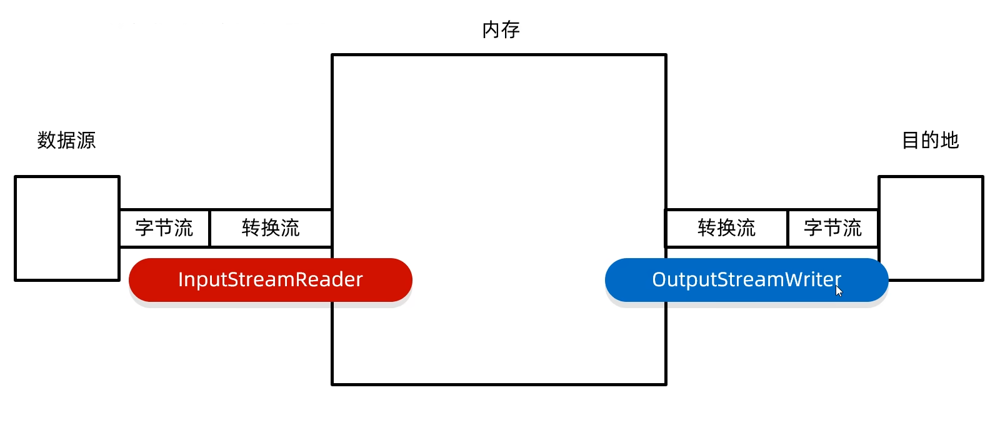

# day 01 集合进阶

## 1 双列集合

### 1.1 特点

- 双列集合一次需要存一对数据，分别为键和值
- 键不能重复，值可以重复
- 键和值是一一对应的，每一个键只能找到自己对应的值
- 键+值这个整体 我们称之为“键值对”或者“键值对对象”，在Java中叫做```Entry```对象

### 1.2 Map 的常见 API

> Map是双列集合的顶层接口，它的功能是全部双列集合都可以继承使用的

|                 方法名称                  |                 说明                 |
| :---------------------------------------: | :----------------------------------: |
|        ```V put(K key,V value)```         |               添加元素               |
|        ```V remove(object key)```         |         根据键删除键值对元素         |
|            ```void clear()```             |         移除所有的键值对元素         |
|   ```boolean containsKey(object key)```   |       判断集合是否包含指定的键       |
| ```boolean containsValue(object value)``` |       判断集合是否包含指定的值       |
|          ```boolean isEmpty()```          |           判断集合是否为空           |
|             ```int size()```              | 集合的长度，也就是集合中键值对的个数 |

```java
import java.util.HashMap;
import java.util.Map;

public class A01_MapDemo1 {
    public static void main(String[] args) {
        Map<String, String> map = new HashMap<>();

        // 1. 添加
        map.put("郭靖", "黄蓉");
        map.put("韦小宝", "沐剑屏");
        String value1 = map.put("尹志平", "小龙女");
        System.out.println(value1);  // null

        // 在添加数据的时候，如果键不存在，那么直接把键值对对象添加到 map 集合当中
        // 在添加数据的时候，如果键是存在的，那么会把原有的键值对对象覆盖，会把被覆盖的值进行返回.
        String value = map.put("韦小宝", "双儿");
        System.out.println(value);  // 沐剑屏
        System.out.println(map);

        // 2. 删除
        String res = map.remove("韦小宝");
        System.out.println(res);
        System.out.println(map);

        // 3. 清空
        // map.clear();

        // 4. 判断是否存在
        System.out.println(map.containsKey("郭靖"));  // true
        System.out.println(map.containsKey("郭靖1"));  // false
        System.out.println(map.containsValue("郭靖1"));  // false

        // 5 是否空
        boolean res1 = map.isEmpty();
        System.out.println(res1);  // false

        // 6 长度
        int size = map.size();  // false
        System.out.println(size);  // 2
    }
}
```

### 1.3 Map 集合遍历——键找值

```java
import java.util.HashMap;
import java.util.Iterator;
import java.util.Map;
import java.util.Set;
import java.util.function.Consumer;

public class A02_MapDemo2 {
    public static void main(String[] args) {
        Map<String, String> map = new HashMap<>();
        map.put("郭靖", "黄蓉");
        map.put("韦小宝", "沐剑屏");
        map.put("尹志平", "小龙女");

        // 1. 键找值...
        Set<String> keys = map.keySet();
        // 1.1 增强 for
        for (String key : keys) {
            System.out.println(key + " = " + map.get(key));
        }
        
        // 1.2 迭代器
        Iterator<String> it = keys.iterator();
        while (it.hasNext()) {
            String key = it.next();
            System.out.println(key + " = " + map.get(key));
        }
        
        // 1.3 Lambda
        keys.forEach(new Consumer<String>() {
            @Override
            public void accept(String s) {
                System.out.println(s + " = " + map.get(s));
            }
        });
        keys.forEach(s -> System.out.println(s + " = " + map.get(s)));
    }
}
```

### 1.3 Map 集合遍历——键值对

```java
import java.util.HashMap;
import java.util.Map;
import java.util.Set;

public class A03_MapDemo3 {
    public static void main(String[] args) {
        Map<String, String> map = new HashMap<>();
        map.put("郭靖", "黄蓉");
        map.put("韦小宝", "沐剑屏");
        map.put("尹志平", "小龙女");

        Set<Map.Entry<String, String>> entries = map.entrySet();
        for (Map.Entry<String, String> entry : entries) {
            System.out.println(entry.getKey() + " = " + entry.getValue());
        }
    }
}
```

### 1.3 Map 集合遍历——Lambda 表达式

|                           方法名称                           |         说明          |
| :----------------------------------------------------------: | :-------------------: |
| ```default void forEach(BiConsumer<? super K ? super V> action)``` | 结合lambda遍历Map集合 |

```java
public class A04_MapDemo4 {
    public static void main(String[] args) {
        Map<String, String> map = new HashMap<>();
        map.put("郭靖", "黄蓉");
        map.put("韦小宝", "沐剑屏");
        map.put("尹志平", "小龙女");

        map.forEach(new BiConsumer<String, String>() {
            @Override
            public void accept(String key, String value) {
                System.out.println(key + " = " + value);
            }
        });

        map.forEach((key, value) -> System.out.println(key + " = " + value));
    }
}
```

## 2 HashMap

### 2.1 HashMap 特点

- ```HashMap```是```Map```里面的一个实现类
- 没有额外需要学习的特有方法，直接使用Map里面的方法就可以了
- 特点都是由键决定的：无序、不重复、无索引
- ```HashMap```跟```HashSet```底层原理是一模一样的，都是哈希表结构

### 2.2 底层原理

- ```HashMap```底层是哈希表结构的
- 依赖```hashCode```方法和```equals```法保证键的唯一
- 如果键存储的是自定义对象，需要重写```hashCode```和```equals```方法。如果值存储自定义对象，不需要重写```hashCode```和```equals```方法

### 2.3 经典 python 统计词频 java 实现

```java
import java.util.*;

public class A05_HashDemo2 {
    public static void main(String[] args) {
        String[] arr = {"A", "B", "C", "D"};

        ArrayList<String> list = new ArrayList<>();
        Random r = new Random();
        for (int i = 0; i < 80; i++) {
            list.add(arr[r.nextInt(arr.length)]);
        }

        HashMap<String, Integer> hm = new HashMap<>();

        for (String name : list) {
            if (hm.containsKey(name)) {
                hm.put(name, hm.get(name) + 1);
            } else {
                hm.put(name, 1);
            }
        }

        System.out.println(hm);

        int max = 0;
        String result = null;
        Set<Map.Entry<String, Integer>> entries = hm.entrySet();
        for (Map.Entry<String, Integer> entry : entries) {
            if (entry.getValue() > max) {
                max = entry.getValue();
                result = entry.getKey();
            }
        }

        System.out.println(result);
    }
}
```

## 3 LinkedHashMap

- 由键决定：**有序**、不重复、无索引。
- 这里的有序指的是保证存储和取出的元素顺序一致
- **原理**：底层数据结构是依然哈希表，只是每个键值对元素又额外的多了一个双链表的机制记录存储的顺序。

```java
import java.util.LinkedHashMap;

public class A07_LinkedHashMapDemo1 {
    public static void main(String[] args) {
        LinkedHashMap<String, Integer> lhm = new LinkedHashMap<>();

        lhm.put("a", 789);
        lhm.put("b", 585);
        lhm.put("c", 455);

        System.out.println(lhm);
    }
}
```

## 4 TreeMap

### 4.1 介绍

- ```TreeMap```跟```TreeSet```底层原理一样，都是红黑树结构的
- 由键决定特性：不重复、无索引、可排序
- 可排序：**对键进行排序**
- 注意：默认按照键的从小到大进行排序，也可以自己规定键的排序规则
  - 实现```Comparable```接口，指定比较规则。
  - 创建集合时传递```Comparator```比较器对象，指定比较规则

### 4.2 简单的

```java
import java.util.Comparator;
import java.util.TreeMap;

public class A08_TreeMapDemo1 {
    /*
        降序排列
     */
    public static void main(String[] args) {
        TreeMap<Integer, String> tm = new TreeMap<>(new Comparator<Integer>() {
            @Override
            public int compare(Integer o1, Integer o2) {
                return o2 - o1;
            }
        });

        tm.put(1, "奥利奥");
        tm.put(2, "康师傅");
        tm.put(4, "六个核桃");
        tm.put(5, "可口可乐");
        tm.put(3, "雪碧");

        System.out.println(tm);  // {5=可口可乐, 4=六个核桃, 3=雪碧, 2=康师傅, 1=奥利奥}
    }
}
```

### 4.3 自定义对象

```java
import java.util.TreeMap;

public class A09_TreeMapDemo2 {
    public static void main(String[] args) {
        TreeMap<Student1, String> tm = new TreeMap<>();

        Student1 s1 = new Student1("张三", 23);
        Student1 s2 = new Student1("李四", 24);
        Student1 s3 = new Student1("王五", 25);

        tm.put(s1, "北京");
        tm.put(s2, "天津");
        tm.put(s3, "上海");

        System.out.println(tm);
    }
}
```

```java
package com.itheima.a01mymap;

public class Student1 implements Comparable<Student1>{
    private String name;
    private int age;

    ...

    @Override
    public int compareTo(Student1 o) {
        // this: 要添加
        // o: 红黑树的元素

        //返回值:
        //负数: 表示当前要添加的元是小的，存左边
        // 正数:表示当前要添加的元素是人的，存右边
        // 0: 表示当前要添加的元素已经存在，舍弃
        int i = this.getAge() - o.getAge();
        i = i == 0 ? this.getName().compareTo(o.getName()) : i;

        return i;
    }
}
```

### 4.4 小案例：统计个数

```java
import java.util.TreeMap;
import java.util.function.BiConsumer;

public class A10_TreeMapDemo3 {
    public static void main(String[] args) {
        /*
            需求:
                学符串“aababcabcdabcde”
                请统计字符串中每一个字符出现的次数，并按照以下格式输出
            输出结果:
                a(5) b(4) c(3) d(2) e(1)
         */
        String s = "aababcabcdabcde";
        TreeMap<Character, Integer> tm = new TreeMap<>();
        for (int i = 0; i < s.length(); i++) {
            char c = s.charAt(i);

            if (tm.containsKey(c)) {
                tm.put(c, tm.get(c) + 1);
            } else {
                tm.put(c, 1);
            }
        }

        StringBuilder sb = new StringBuilder();

        tm.forEach(new BiConsumer<Character, Integer>() {
            @Override
            public void accept(Character key, Integer value) {
                sb.append(key).append("(").append(value).append(") ");
            }
        });

        System.out.println(sb);  // a(5) b(4) c(3) d(2) e(1) 
    }
}
```

### 4.5 源码分析

- ```TreeMap```添加元素的时候，键是否需要重写```hashCode```和```equals```方法?

  此时是不需要重写的。

  ```HashMap```是哈希表结构的，```JDK8```开始由数组，链表，红黑树组成的。

- 既然有红黑树，```HashMap```的键是否需要实现```Compareable```接口或者传递比较器对象呢?

  不需要的。

  因为在```Hashmap```的底层，默认是利用哈希值的大小关系来创建红黑树的

- ```TreeMap```和```HashMap```谁的效率更高？

  如果是最坏情况，添加了8个元素，这8个元素形成了链表，此时```TreeMap```的效率要更高但是这种情况出现的几率非常的少。一般而言，还是```HashMap```的效率要更高。

- 你觉得在```Map```集合中，Java会提供一个如果键重复了，不会覆盖的```put```方法呢？

  此时```putIfAbsent```本身不重要。

  传递一个思想:代码中的逻辑都有两面性，如果我们只知道了其中的A面，而且代码中还发现了有变量可以控制两面性的发生。

  那么该逻辑一定会有B面。

  习惯：

  - ```boolean```类型的变量控制

    一般只有AB两面，因为```boolean```只有两个值

  - ```int```类型的变量控制

    一般至少有三面，因为```int```可以取多个值。

- 三种双列集合，以后如何选择?
  ```HashMap``` ```LinkedHashMap``` ```TreeMap```

  - 默认：```HashMap```（效率最高）
  - 如果要保证存取有序：```LinkedHashMap```
  - 如果要进行排序：```TreeMap```

# day 02 综合项目

## 1 可变参数

### 1.1 使用方法

```java
public class A11_ArgsDemo1 {
    public static void main(String[] args) {
        // JDK 5
        // 可变参数
        // 方法的形参个数可以是变化的
        // 底层:
        // 可变参数底层就是一个数组
        // 只不过不需要我们自己创建了，Java会帮我们创建好

        getSum(1, 2, 3, 4, 5);

    }

    public static void getSum(int ... args) {
        int sum = 0;
        for (int arg : args) {
            sum += arg;
        }
        System.out.println(sum);
    }
}
```

### 1.2 总结

- 可变参数本质上就是一个数组

- 作用：在形参中接收多个数据

- 格式：```数据类型...参数名称```

  举例：```int...a```

- 注意事项：

  形参列表中可变参数只能有一个

  可变参数必须放在形参列表的最后面

## 2 Collections

> - java.util.Collections：是集合工具类
> - 作用```Collections```不是集合，而是集合的工具类

### 2.1 Collections 常用 API

|                           方法名称                           |              说明               |
| :----------------------------------------------------------: | :-----------------------------: |
| ```public static <T> boolean addAll(Collection<T> c, T ... elements)``` |          批量添加元素           |
|        ```public static void shuffle(List<?> list)```        |     打乱List集合元素的顺序      |
|       ```public static <T> void sort(List<T> list)```        |              排序               |
| ```public static <T> void sort(List<T> list，Comparator<T> c)``` |     根据指定的规则进行排序      |
| ```public static <T> int binarySearch (List<T> list, T key)``` |      以二分查找法查找元素       |
| ```public static <T> void copy(List<T> dest, List<T> src)``` |        拷贝集合中的元素         |
|    ```public static <T> int fill (List<T> list, T obj)```    |     使用指定的元素填充集合      |
|   ```public static <T> void max/min(Collection<T> coll)```   | 根据默认的自然排序获取最大/小值 |
| ```public static <T> void swap(List<?> list,int i,int j)```  |    交换集合中指定位置的元素     |

```java
import java.util.ArrayList;
import java.util.Collections;

public class A13_CollectionsDemo1 {
    public static void main(String[] args) {
        ArrayList<String> list = new ArrayList<>();

        Collections.addAll(list, "abxc", "ac", "abc", "123");
        System.out.println(list);  // [abxc, ac, abc, 123]

        Collections.shuffle(list);
        System.out.println(list);  // [ac, abxc, abc, 123]
    }
}
```

### 2.2 综合小练习

#### 2.2.1 随机点名

```java
import java.util.ArrayList;
import java.util.Collections;
import java.util.Random;

public class Test1 {
    public static void main(String[] args) {
        /*
            随机点名
         */
        ArrayList<String> list = new ArrayList<>();
        Collections.addAll(list, "范闲","范建","范统","杜子腾","杜琦燕","宋合泛","侯笼藤","朱益群","朱穆朗玛峰","袁明媛");
        Random r = new Random();
        int index = r.nextInt(list.size());
        System.out.println(list.get(index));

        Collections.shuffle(list);
        System.out.println(list.get(0));
    }
}
```

#### 2.2.2 带概率的随机点名

```java
import java.util.ArrayList;
import java.util.Collections;
import java.util.Random;

public class Test2 {
    public static void main(String[] args) {
        /*
            班级里有N个学生
            要求:
                70%的概率随机到男生
                30%的概率随机到女生
         */
        ArrayList<Integer> list = new ArrayList<>();
        Collections.addAll(list, 1, 1, 1, 1, 1, 1, 1);
        Collections.addAll(list, 0, 0, 0);
        Collections.shuffle(list);

        Random r = new Random();
        Integer number = list.get(r.nextInt(list.size()));

        ArrayList<String> boyList = new ArrayList<>();
        ArrayList<String> girlList = new ArrayList<>();

        Collections.addAll(boyList, "范闲", "范建", "范统", "杜子腾", "杜琦燕", "宋合泛", "侯笼藤", "朱益群", "朱穆朗玛峰", "袁明媛");
        Collections.addAll(girlList, "杜琦燕", "袁明媛", "李猜", "田蜜蜜");

        if (number == 1) {
            System.out.println(boyList.get(r.nextInt(boyList.size())));
        } else {
            System.out.println(girlList.get(r.nextInt(girlList.size())));
        }
    }
}
```

#### 2.2.3 不重复的随机点名

```java
import java.util.ArrayList;
import java.util.Collections;
import java.util.Random;

public class Test3 {
    public static void main(String[] args) {
        /*
            班级里有5个学生
            要求:
            被点到的学生，不会再被点到。
            但是如果班级中所有的学生都点完了，需要重新开启第二轮点名。
        */

        ArrayList<String> list1 = new ArrayList<>();
        ArrayList<String> list2 = new ArrayList<>();
        Collections.addAll(list1, "范闲", "范建", "范统", "杜子腾", "杜琦燕", "宋合泛", "侯笼藤", "朱益群", "朱穆朗玛峰", "袁明媛");
        int count = list1.size();
        Random r = new Random();

        for (int j = 0; j < 10; j++) {

            System.out.println("----------第" + j + "轮点名----------");

            for (int i = 0; i < count; i++) {
                int index = r.nextInt(list1.size());
                String name = list1.remove(index);
                list2.add(name);
                System.out.println(name);
            }

            list1.addAll(list2);
            list2.clear();
        }
    }
}
```

## 3 集合嵌套

```java
import java.util.*;

public class Test4 {
    public static void main(String[] args) {
        HashMap<String, ArrayList<String>> hm = new HashMap<>();

        ArrayList<String> city1 = new ArrayList<>();
        city1.add("南京市");
        city1.add("扬州市");

        ArrayList<String> city2 = new ArrayList<>();
        city2.add("石家庄市");
        city2.add("唐山市");

        ArrayList<String> city3 = new ArrayList<>();
        city3.add("遂宁市");
        city3.add("成都市");

        hm.put("江苏省", city1);
        hm.put("河北省", city2);
        hm.put("四川省", city3);

        Set<Map.Entry<String, ArrayList<String>>> entries = hm.entrySet();
        for (Map.Entry<String, ArrayList<String>> entry : entries) {
            String key = entry.getKey();
            ArrayList<String> value = entry.getValue();
            
            StringJoiner sj = new StringJoiner("", "", "");
            for (String s : value) {
                sj.add(s);
            }

            System.out.println(key + " = " + sj);
            
        }
    }
}
```

# day 03 集合进阶

## 1 创建不可变集合

### 1.1 创建不可变集合的应用场景

- 如果某个数据不能被修改，把它防御性地拷贝到不可变集合中是个很好的实践
- 或者当集合对象被不可信的库调用时，不可变形式是安全的。

### 1.2 List 集合

```java
List<String> list = List.of("张三", "李四", "王五");

System.out.println(list.get(1));
System.out.println(list.get(2));
System.out.println(list.get(0));

for (String s : list) {
    System.out.println(s);
}

Iterator<String> it = list.listIterator();
while (it.hasNext()) {
    System.out.println(it.next());
}

for (int i = 0; i < list.size(); i++) {
    String s = list.get(i);
    System.out.println(s);
}

// list.remove("李四");
```

### 1.3 Set 集合

```java
// 创建不可变的 set 集合时 要保证参数的唯一性
Set<String> set = Set.of("张三", "李四", "王五");

for (String s : set) {
    System.out.println(s);
}

Iterator<String> it = set.iterator();
while (it.hasNext()) {
    System.out.println(it.next());
}
```

### 1.4 HashMap 集合

```java
public static void main(String[] args) {
    /*
            细节1：键不能重复
            细节2：最多传 20 个参数 也就是说只能有 10 对键值对
            细节3：如果非要大于 20 个 可以把键值对看成一个整体
         */

    Map<String, String> map = Map.of("张三", "南京", "李四", "北京", "王五", "天津");

    Set<String> keys = map.keySet();
    for (String key : keys) {
        System.out.println(key + "=" + map.get(key));
    }

    Set<Map.Entry<String, String>> entries = map.entrySet();
    for (Map.Entry<String, String> entry : entries) {
        String key = entry.getKey();
        String value = entry.getValue();
        System.out.println(key + "=" + value);
    }
}

// 为什么要有最大的个数限制
//    public static<K, V> void of(K...keys, V...values) {
//        // 可以看到这个地方报错了 因为可变参数只能有一个且在最后
//    }
```

大于10对键值对的方法

```java
// 细节3：如果非要大于 20 个 可以把键值对看成一个整体

// 1. 创建普通的 map 集合
HashMap<String, String> hm = new HashMap<>();
hm.put("张三", "南京");
hm.put("李四", "北京");
hm.put("王五", "上海");
hm.put("赵六", "北京");
hm.put("孙七", "深圳");
hm.put("周八", "杭州");
hm.put("吴九", "宁波");
hm.put("郑十", "无锡");
hm.put("刘一", "苏州");
hm.put("陈二", "嘉兴");
hm.put("aaa", "111");

// 2. 利用上面的数据获取一个不可变集合的方法一
// 获取键值对（entry对象）
Set<Map.Entry<String, String>> entries = hm.entrySet();

// 把 entry 变成数组
// 这个地方的 0 是数组的长度
Map.Entry[] arr1 = new Map.Entry[0];

// toArray 方法在底层会比较集合的长度跟数组的长度两者的大小
// 如果集合的长度 > 数组的长度 : 数据在数组中放不下，此时会根据实际数据的个数，重新创建数组
// 如果集合的长度 <= 数组的长度: 数据在数组中放的下，此时不会创建新的数组，而是直接用
// 所以上面那个 0 可以随便写
Map.Entry[] arr2 = entries.toArray(arr1);  // 这里使用的带参构造 是为了告诉他 数组里面的类型是 Entry 对象

// 得到不可变的 map 集合
Map map1 = Map.ofEntries(arr2);

// 3. 利用上面的数据获取一个不可变集合的方法二（方法一精简版）
Map map2 = Map.ofEntries(hm.entrySet().toArray(new Map.Entry[0]));

// 4. 利用上面的数据获取一个不可变集合的方法三（方法二的接口）
// JDK 10 才有的 底层就是方法二
Map<String, String> map3 = Map.copyOf(hm);
```

### 1.5 总结

1. 不可变集合的特点?

   定义完成后不可以修改，或者添加、删除

2. 如何创建不可变集合?

   ```List```、```Set```、```Map```接口中，都存在```of```方法可以创建不可变集合

3. 三种方式的细节

   - ```List```：直接用

   - ```Set```：元素不能重复

   - ```Map```：元素不能重复、键值对数量最多是10个

     超过10个用```ofEntries```方法，JDK10通过接口

## 2 Stream 流

### 2.1 stream 流的作用

结合了Lambda表达式，简化集合、数组的操作

### 2.2 Stream 流的使用步骤
- 先得到一条```Stream```流（流水线），并把数据放上去
- 利用```Stream```流中的```API```进行各种操作
  - 中间方法
    - 过滤转换
    - 统计
  - 终结方法
    - 打印
- 方法调用完毕之后，还可以调用其他方法

注意

1. 中间方法，返回新的```Stream```流，原来的```Stream```流**只能使用一次**，建议使用链式编程注意
2. 修改```Stream```流中的数据，不会影响原来集合或者数组中的数据

### 2.3 获取 Stream 流

|   获取方式   |                        方法名                        |                             说明                             |
| :----------: | :--------------------------------------------------: | :----------------------------------------------------------: |
|   单列集合   |          ```default Streame<E> stream()```           |                 ```Collection```中的默认方法                 |
|   双列集合   |                          无                          | 无法直接使用```stream```流，需要用```getKey()```或```getValue()```取到键或值 |
|     数组     | ```public static <T> Streame<T> stream(T[] array)``` |                ```Arrays```工具类中的静态方法                |
| 一堆零散数据 |  ```public static<T> Streame<T> of(T... values)```   |                 ```Stream```接口中的静态方法                 |

- 单列集合

  ```java
  ArrayList<String> list1 = new ArrayList<>();
  Collections.addAll(list1, "a", "b", "C", "a", "b", "C", "a", "b", "C");
  Stream<String> stream1 = list1.stream();
  stream1.forEach(s -> System.out.println(s));
  ```

- 双列集合

  ```java
  HashMap<String, String> hm = new HashMap<>();
  hm.put("张三", "南京");
  hm.put("李四", "北京");
  hm.put("王五", "上海");
  hm.put("赵六", "北京");
  
  // 1. 获取 stream 的第一种方法
  hm.keySet().stream().forEach(s -> System.out.println(s));
  
  // 2. 获取 stream 的第二种方法
  hm.entrySet().stream().forEach(s -> System.out.println(s));
  ```

- 数组

  ```java
  // 基本数据类型
  int[] arr1 = {1, 2, 3, 4, 5};
  Arrays.stream(arr1).forEach(s -> System.out.println(s));
  
  // 引用数据类型
  String[] arr2 = {"1", "2", "3", "4", "5"};
  Arrays.stream(arr2).forEach(s -> System.out.println(s));
  ```

- 一堆零散的数据

  ```java
  Stream.of(1, 2, 5, 6, 8).forEach(s -> System.out.println(s));
  ```

注意：```Stream```接口中静态方法```of```的细节：方法的形参是一个可变参数，可以传递一堆零散的数据，也可以传递数组。但是数组必须是**引用数据类型**的，如果传递**基本数据类型**，是会把整个数组当做一个元素，放到```Stream```当中。所以这个地方，我们应该用获取数组的```Stream```的方法。

### 2.4 Stream 流中间方法

|                        中间方法                        |                 说明                 |
| :----------------------------------------------------: | :----------------------------------: |
| ```Stream<T> filter(Predicate<? super T> predicate)``` |                 过滤                 |
|          ```Stream<T> limit(long maxSize)```           |            获取前几个元素            |
|              ```Stream<T> skip(long n)```              |            跳过前几个元素            |
|               ```Stream<T> distinct()```               | 元素去重，依赖(hashCode和equals方法) |
|  ```static<T> Stream<T> concat(Stream a Stream b)```   |        合并a和b两个流为一个流        |
|       ```Stream<R> map(Function<T,R> mapper)```        |          转换流中的数据类型          |

```java
public class StreamDemo6 {
    public static void main(String[] args) {
        ArrayList<String> list = new ArrayList<>();
        Collections.addAll(list, "张无忌", "周芷若", "赵镇", "张", "张三丰", "张攀山", "张良", "王二麻子", "谢广坤");

        // 1. 过滤
        // 匿名内部类
        list.stream().filter(new Predicate<String>() {
            @Override
            public boolean test(String s) {
                return s.startsWith("张");
            }
        }).forEach(s -> System.out.println(s));
        // Lambda 表达式
        list.stream().filter(s -> s.startsWith("张")).forEach(s -> System.out.println(s));

        // 2. 获取前几个
        list.stream().
                limit(3).  // 前 3 个
                forEach(s -> System.out.println(s));

        // 3. 跳过前几个
        list.stream()
                .skip(3)  // 跳过前 3 个
                .forEach(s -> System.out.println(s));
    }
}
```

```java
public class StreamDemo7 {
    public static void main(String[] args) {
        ArrayList<String> list1 = new ArrayList<>();
        Collections.addAll(list1, "张无忌", "张无忌", "周芷若", "赵镇", "张", "张三丰", "张攀山", "张良", "王二麻子", "谢广坤");

        ArrayList<String> list2 = new ArrayList<>();
        Collections.addAll(list2, "fafa");

        // 去重
        list1.stream().distinct().forEach(s -> System.out.println(s));

        // 合并 a 和 b 两个流
        Stream.concat(list1.stream(), list2.stream()).forEach(s -> System.out.println(s));
    }
}
```

```java
public class StreamDemo8 {
    public static void main(String[] args) {
        // 输出每一个人的年龄
        ArrayList<String> list1 = new ArrayList<>();
        Collections.addAll(list1, "张无忌-10", "周芷若-50", "赵镇-30", "张-20");

        // 类型装换之匿名内部类

        // 第一个类型：流中原有是数据类型
        // 第二个类型：转换为什么类型

        // apply 的形参 s ：依次表示流里面的每一个数据
        // 返回值：表示转换后的数据
        list1.stream().map(new Function<String, Integer>() {

            @Override
            public Integer apply(String s) {
                return Integer.parseInt(s.split("-")[1]);
            }
        }).forEach(s -> System.out.println(s));

        // 类型装换之 Lambda 表达式
        list1.stream().map(s -> Integer.parseInt(s.split("-")[1])).forEach(s -> System.out.println(s));
    }
}
```

### 2.5 Stream 流的终结方法

|                名称                 |            说明            |
| :---------------------------------: | :------------------------: |
| ```void forEach(Consumer action)``` |            遍历            |
|         ```long count()```          |            统计            |
|           ```toArray()```           | 收集流中的数据，放到数组中 |
| ```collect(Collector collector)```  | 收集流中的数据，放到集合中 |

```java
public class StreamDemo9 {
    public static void main(String[] args) {
        ArrayList<String> list = new ArrayList<>();
        Collections.addAll(list, "张无忌-10", "周芷若-50", "赵镇-30", "张-20");

        // 1. 遍历
        // 1.1 匿名内部类
        list.stream().forEach(new Consumer<String>() {
            @Override
            public void accept(String s) {
                System.out.println(s);
            }
        });
        // 1.2 Lambda 表达式
        list.stream().forEach(s -> System.out.println(s));

        // 2. 统计
        long count = list.stream().count();
        System.out.println(count);

        // 3. 搜集
        // 3.1 空参构造 但是是 object 类型的
        Object[] arr1 = list.stream().toArray();
        System.out.println(arr1);

        // 3.2 带参构造之匿名内部类
        // IntFunction 的泛型：具体类型的数组
        // apply 的形参：流中数据的个数，要跟数组的长度保持一致
        // apply 的返回值：具体类型的数组
        // 方法体：就是创建数组
        String[] arr2 = list.stream().toArray(new IntFunction<String[]>() {
            // toArray 方法的参数的作用: 负责创建一个指定类型的数组
            // toArray 方法的底层，会依次得到流里面的每一个数据，并把数据放到数组当中
            // toArray 方法的返回值: 是一个装着流里面所有数据的数组
            @Override
            public String[] apply(int value) {
                return new String[value];
            }
        });

        System.out.println(Arrays.toString(arr2));  // [张无忌-10, 周芷若-50, 赵镇-30, 张-20]

        // 3.3 带参构造之 Lambda 表达式
        String[] arr3 = list.stream().toArray(value -> new String[value]);
        System.out.println(Arrays.toString(arr3));
    }
}
```

```java
public class StreamDemo10 {
    public static void main(String[] args) {
        ArrayList<String> list = new ArrayList<>();
        Collections.addAll(list, "张三丰-男-10", "张无忌-男-15", "周芷若-女-14", "赵敏-女-13", "张强-男-20",
                "张翠山-男-4", "张良-男-35", "王二麻子-男-37", "谢广坤-男-41");

        // 1. 收集男性到 List 集合中
        List<String> newList1 = list.stream()
                .filter(s -> "男".equals(s.split("-")[1]))
                .collect(Collectors.toList());
        System.out.println(newList1);

        // 2. 收集男性到 Set 集合中
        Set<String> newList2 = list.stream().filter(s -> "男".equals(s.split("-")[1])).collect(Collectors.toSet());
        System.out.println(newList2);

        // 3. 收集男性到 Map 集合中
        // 3.1 匿名内部类
        // 键：姓名
        // 值：年龄
        /**
         * toMap：参数一：键的生成规则
         *        参数二：值的生成规则
         * <p>
         * 参数一：
         *      Function：泛型一：流中每一个数据的类型
         *                泛型二：Map 集合的键的数据类型
         *      apply 形参：流里面的每一个数据
         *          方法体：生成键的代码
         *          返回值：已经生成的键
         * <p>
         * 参数二：
         *      Function：泛型一：流中每一个数据的类型
         *                泛型二：Map 集合的值的数据类型
         *      apply 形参：流里面的每一个数据
         *          方法体：生成值的代码
         *          返回值：已经生成的值
         */
        Map<String, Integer> newList3 = list.stream()
                .filter(s -> "男".equals(s.split("-")[1]))
                .collect(Collectors.toMap(new Function<String, String>() {
                    @Override
                    public String apply(String s) {
                        return s.split("-")[0];
                    }
                }, new Function<String, Integer>() {
                    @Override
                    public Integer apply(String s) {
                        return Integer.parseInt(s.split("-")[2]);
                    }
                }));
        System.out.println(newList3);

        // 3.2 Lambda 表达式
        Map<String, Integer> newList4 = list.stream()
                .filter(s -> "男".equals(s.split("-")[1]))
                .collect(Collectors.toMap(k -> k.split("-")[0],
                        v -> Integer.parseInt(v.split("-")[2])));
        System.out.println(newList4);
    }
}
```

### 2.6 总结：常用方法

- 中间方法：```filter```，``` limit```，```skip```，```distinct```，```concat```，```map```
- 终结方法：```forEach```，```count```，```collect```

### 2.7 小练习

- 数据过滤

  ```java
  public static void main(String[] args) {
      /*
          定义一个集合，并添加一些整数 1,2,3,4,5,6,7,8,9,18
          过滤奇数，只留下偶数。
          并将结果保存起来
       */
      ArrayList<Integer> list = new ArrayList<>();
      Collections.addAll(list, 1, 2, 3, 4, 5, 6, 7, 8, 9, 18);
  
      List<Integer> newList = list.stream()
              .filter(s -> s % 2 == 0)
              .collect(Collectors.toList());
      System.out.println(newList);
  }
  ```

- 提取

  ```java
  public class Test2 {
      public static void main(String[] args) {
          /*
              创建一个ArrayList集合，并添加以下宁符串，宁符中中前面是姓名，后面是年龄
              zhangsan.23
              lisi 24"
              wangwu 25"
              保留年龄大于等于24岁的人，并将结果收集到Map集合中，姓名为键，年龄为值
           */
          ArrayList<String> list = new ArrayList<>();
          list.add("zhangsan,23");
          list.add("lisi,24");
          list.add("wangwu,25");
  
          Map<String, Integer> newList = list.stream()
                  .filter(s -> Integer.parseInt(s.split(",")[1]) >= 24)
                  .collect(Collectors.toMap(s -> s.split(",")[0],
                          s -> Integer.parseInt(s.split(",")[1])));
          System.out.println(newList);
      }
  }
  ```

- 练习三

  ```java
  public class Test3 {
      public static void main(String[] args) {
          /*
              现在有两个ArrayList集合，分别存储6名男演员的名字和年龄以及6名女演员的名字和年龄。
              姓名和年龄中间用逗号隔开。
              比如:张三,23
              要求完成如下的操作:
                  1，男演员只要名字为3个字的前两人
                  2，女演员只要姓杨的，并且不要第一个
                  3，把过滤后的男演员姓名和女演员姓名合并到一起
                  4，将上一步的演员姓名封装成Actor对象。
                  5，将所有的演员对象都保存到List集合中
              备注:演员类Actor，属性有: name，age
  
              男演员: "蔡坤坤,24", "谷嘉,39", "肖梁梁,27", "张天天,31", "刘诗,35", "杨小幂,33"
              女演员: "杨颖,36", "高元元,43", "叶咸,23", "刘不甜,22", "吴签,24", "赵小颖,35"
           */
          ArrayList<String> list1 = new ArrayList<>();
          ArrayList<String> list2 = new ArrayList<>();
          Collections.addAll(list1, "蔡坤坤,24", "谷嘉,39", "肖梁梁,27", "张天天,31", "刘诗,35", "杨小幂,33");
          Collections.addAll(list2, "杨颖,36", "高元元,43", "叶咸,23", "刘不甜,22", "吴签,24", "赵小颖,35");
  
          Stream<String> stream1 = list1.stream()
                  .filter(s -> s.split(",")[0].length() == 3)
                  .limit(2);
  
          Stream<String> stream2 = list2.stream()
                  .filter(s -> s.startsWith("杨"))
                  .skip(1);
  
          // 类型转换之匿名内部类
          List<Actor> newList1 = Stream.concat(stream1, stream2)
                  .map(new Function<String, Actor>() {
                      @Override
                      public Actor apply(String s) {
                          String name = s.split(",")[0];
                          int age = Integer.parseInt(s.split(",")[1]);
                          return new Actor(name, age);
                      }
                  }).collect(Collectors.toList());
          System.out.println(newList1);
          // 类型转换之 Lambda 表达式
          List<Actor> newList2 = Stream.concat(stream1, stream2)
                          .map(s -> new Actor(s.split(",")[0],
                                  Integer.parseInt(s.split(",")['1'])))
                  .collect(Collectors.toList());
          System.out.println(newList2);
      }
  }
  ```

## 3 方法引用

> 把已经有的方法拿过来用，当做函数式接口中抽象方法的方法体

### 3.1 使用条件

- 引用处需要是函数式接口
- 被引用的方法需要已经存在
- 被引用方法的形参和返回值需要跟抽象方法的形参和返回值保持一致
- 被引用方法的功能需要满足当前的要求

```::```：方法引用符

```java
public class FunctionDemo1 {
    public static void main(String[] args) {
        Integer[] arr = {3, 5, 8, 4, 1, 6, 2};
        // 匿名内部类
        Arrays.sort(arr, new Comparator<Integer>() {
            @Override
            public int compare(Integer o1, Integer o2) {
                return o2 - o1;
            }
        });
        System.out.println(Arrays.toString(arr));

        // lambda 表达式
        Arrays.sort(arr, (Integer o1, Integer o2) -> {
            return o2 - o1;
        });
        System.out.println(Arrays.toString(arr));

        // lambda 表达式简化
        Arrays.sort(arr, (o1, o2) -> o2 - o1);
        System.out.println(Arrays.toString(arr));

        // 方法引用
        Arrays.sort(arr, FunctionDemo1::subtraction);
        System.out.println(Arrays.toString(arr));
    }

    public static int subtraction (int num1, int num2) {
        return num2 - num1;
    }
}
```

### 3.2 引用静态方法

- 格式：```类名::静态方法```
- 范例：```Integer::parseInt```

```java
public class FunctionDemo2 {
    public static void main(String[] args) {
        ArrayList<String> list = new ArrayList<>();
        Collections.addAll(list, "1", "2", "3", "4");

        // 匿名内部类
        list.stream().map(new Function<String, Integer>() {
            @Override
            public Integer apply(String s) {
                return Integer.parseInt(s);
            }
        }).forEach(s -> System.out.println(s));

        // 方法引用
        // 方法需要已经存在
        // 方法的形参和返回值需要跟抽象方法的形参和返回值保持一致
        // 方法的功能需要把形参的字符中转换成整数
        list.stream().map(Integer::parseInt).forEach(s -> System.out.println(s));
    }
}
```

### 3.3 引用成员方法

- 格式：```对象::成员方法```

- 其他类：```其他类对象::方法名```

- 本类：```this::方法名```

  只能在非静态方法中使用，因为静态方法没有```this```

- 父类：```super::方法名```

  只能在非静态方法中使用，因为静态方法没有```supper```

```java
public class FunctionDemo3 {
    public static void main(String[] args) {
        ArrayList<String> list = new ArrayList<>();
        Collections.addAll(list, "张无忌", "周芷若", "赵敏", "张强", "张三丰");

        // 其他类
        list.stream().filter(new StringOperation1()::stringJude).forEach(s -> System.out.println(s));

        // 本类
        // list.stream().filter(this.stringJude()).forEach(s -> System.out.println(s));  // 静态方法是不能 this 的
        list.stream().filter(new FunctionDemo3()::stringJude).forEach(s -> System.out.println(s));  // 静态方法是不能 this 的

    }
    
    public boolean stringJude(String s) {
        return s.startsWith("张")  && s.length() == 3;
    }
}
```

### 3.4 引用构造方法

- 格式：```类名::new```

  注意该类的构造方法是否接受该类型的参数

```java
List<Student> newList = list.stream().map(Student::new).collect(Collectors.toList());
```

### 3.5 其他调用方式

- 使用类名引用成员方法

  不能引用所有类中的成员方法。如果抽象方法的第一个参数是```A```类型的，只能引用```A```类中的方法。

  - 格式：```类名::成员方法```
  - 范例：```String::substring```
  - 方法引用的规则
    1. 需要有函数式接口
    2. 被引用的方法必须已经存在
    3. 被引用方法的形参，需要跟抽象方怯的第二个形参到最后一个形参保持一致，返回值需要保持一致。
    4. 被引用方法的功能需要满足当前的需求
  - 抽象方法形参的详解
    - 第一个参数：表示被引用方法的调用者，决定了可以引用哪些类中的方法。在Stream流当中，第一个参数一般都表示流里面的每一个数据。假设流里面的数据是字符串，那么使用这种方式进行方法引用，只能引用```String```这个类中的方法。
    - 第二个参数到最后一个参数：跟被引用方法的形参保持一致，如果没有第二个参数，说明被引用的方法需要是无参的成员方法。
  - 局限性
    - 不能引用所有类中的成员方法。
    - 是跟抽象方法的第一个参数有关，这个参数是什么类型的，那么就只能引用这个类中的方法。

  ```java
  public class FunctionDemo5 {
      public static void main(String[] args) {
          ArrayList<String> list = new ArrayList<>();
          Collections.addAll(list, "aaa", "bbb", "ccc", "ddd");
  
          // 拿着流里面的每一个数据，去调用 String 类中的 toUpperCase 方法，方法的返回值就是转换之后的结果。
          list.stream().map(String::toUpperCase).forEach(s -> System.out.println(s));
      }
  }
  ```

- 引用数组的构造方法

  - 格式：```数据类型l]::new```
  - 范例：```int[]::new```

  ```java
  public class FunctionDemo {
      public static void main(String[] args) {
          ArrayList<Integer> list = new ArrayList<>();
          Collections.addAll(list, 1, 2, 3, 4, 5);
  
          // 匿名内部类
          Integer[] arr = list.stream().toArray(new IntFunction<Integer[]>() {
              @Override
              public Integer[] apply(int value) {
                  return new Integer[5];
              }
          });
  
          System.out.println(Arrays.toString(arr));
  
          // 方法引用
          Integer[] arr2 = list.stream().toArray(Integer[]::new);
          System.out.println(Arrays.toString(arr2));
      }
  }
  ```

- 综合小例子

  ```java
  public class FunctionDemo8 {
      public static void main(String[] args) {
          /**
           * 需求:
           *      创建集合添加学生对象学牛对象属性
           *      name, age
           * 要求:
           *      获取姓名并放到数组当中
           *      使用方法引用完成
           */
          ArrayList<Student> list = new ArrayList<>();
          list.add(new Student("张三", 123));
          list.add(new Student("张三1", 1234));
          list.add(new Student("张三2", 12134));
  
          String[] nameList = list.stream().map(Student::getName).toArray(String[]::new);
          Integer[] ageList = list.stream().map(Student::getAge).toArray(Integer[]::new);
  
          System.out.println(Arrays.toString(nameList));
          System.out.println(Arrays.toString(ageList));
      }
  }
  ```

# day 04 异常 File

## 1 异常


### 1.1 Error

代表的系统级别错误(属于严重问题系统一旦出现问题，sun公司会把这些错误封装成Error对象。Error是给sun公司自己用的，不是给我们程序员用的。因此我们开发人员不用管它。

### 1.2 Exception

> 异常，代表程序可能出现的问题。我们通常会用Exception以及他的子类来封装程序出现的问题。

- 运行时异常: ```RuntimeException```及其子类，编译阶段不会出现异常提醒，运行时出现的异常（如：数组索引越界异常）
- 编译时异常: 编译阶段就会出现异常提醒的。（如：日期解析异常）

```java
public class Exception {
    public static void main(String[] args) throws ParseException {
        // 编译时异常（编译阶段，需要手动处理，否则代码报错）
        String time = "2023年1月1日";
        SimpleDateFormat sdf = new SimpleDateFormat("yyyy年mm月dd日");
        Date date = sdf.parse(time);
        System.out.println(date);

        // 运行时异常（编译阶段不需要处理，代码运行时出现的异常）
        int[] arr = {1, 2, 3};
        System.out.println(arr[10]);  // ArrayIndexOutOfBoundsException
    }
}
```

### 1.3 异常的作用

- 作用一：异常是用来查询bug的关键参考信息
- 作用二：异常可以作为方法内部的一种特殊返回值，以便通知调用者底层的执行情况

### 1.4 异常的处理方式

- JVM 默认的处理方式

  - 把异常的名称，异常原因及异常出现的位置等信息输出在了控制台
  - 程序停止执行，下面的代码不会再执行了

- 捕获异常

  - 目的：当代码出现异常时可以让程序继续往下执行。

    ```java
    int[] arr = {1, 2, 5, 10, 5};
    try {
        System.out.println(arr[10]);
    } catch (ArrayIndexOutOfBoundsException e) {
        // 出现了 ArrayIndexOutOfBoundsException 异常 我该如何处理
        System.out.println("索引越界了");
    }
    System.out.println("看看我执行了吗？");
    ```

### 1.5 四个小问题

1. 如果```try```中没有遇到问题，怎么执行?

   会把```try```里面所有的代码全部执行完毕，不会执行```catch```里面的代码

2. 如果```try```中可能会遇到多个问题，怎么执行?

   会写多个```catch```与之对应。注意：父类异常需要写在下面。

   在JDK7以后，可以在```catch```中写多个异常以捕获。

   ```catch (ArrayIndexOutOfBoundsException | xxxxxx e)```

3. 如果```try```中遇到的问题没有被抽获，怎么执行?

   相当```try...catch```的代码白写了，最终还是会交给虚拟机进行处理。

4. 如果```try```中遇到了问题，那么```try```下面的其他代码还会执行吗?

   下面的代码就不会执行了，直按跳转到对应的```cateh```当中，执行```catch```里面的语句体。但是如果没有对应```catch```与之匹配，那么还是会交给虚拟机进行处理。

### 1.6 对异常的处理

|              方法名称               |                             说明                             |
| :---------------------------------: | :----------------------------------------------------------: |
|  ```public string getMessage()```   |            返回此```throwable```的详细消息字符串             |
|   ```public string tostring()```    |                    返回此可抛出的简短描述                    |
| ```public void printStackTrace()``` | 把异常的错误信息输出在控制台<br/>底层使用的```System.err```输出红色的语句，但是不会终止程序的运行的 |

```java
int[] arr = {11, 12, 0};
try {
    System.out.println(arr[10]);
} catch (ArrayIndexOutOfBoundsException e) {
    String message = e.getMessage();
    System.out.println(message);  // Index 10 out of bounds for length 3

    String string = e.toString();
    System.out.println(string);  // java.lang.ArrayIndexOutOfBoundsException: Index 10 out of bounds for length 3

    e.printStackTrace();  // java.lang.ArrayIndexOutOfBoundsException: Index 10 out of bounds for length 3 at com.itheima.a01myexception.ExceptionDemo11.main(ExceptionDemo11.java:7)
}
System.out.println("看看我执行了吗");
```

扩展：

```java
// 正常的输出语句
System.out.println(123);
// 错误的输出顺序
System.err.println(123);
```

### 1.7 抛出异常

- ```throws```

  写在方法定义处，表示声明一个异常告诉调用者，使用本方法可能会有哪些异常

  - 编译时异常：必须要写。
  - 运行时异常：可以不写。

- ```throw```

  写在方法内，结束方法

  手动抛出异常对象，交给调用者方法中下面的代码不再执行了

```java
public class ExceptionDemo12 {
    public static void main(String[] args) {
        int[] arr = {};
        int max = 0;
        try {
            max = getMax(arr);
        } catch (NullPointerException e) {
            System.out.println("空指针异常");
        } catch (ArrayIndexOutOfBoundsException e) {
            System.out.println("索引越界异常");
        }
        System.out.println(max);
    }
    
    public static int getMax(int[] arr) throws NullPointerException, ArrayIndexOutOfBoundsException {
        if (arr == null) {
            // 手动创建一个异常对象，并把这个异常交给方法的调用者处理
            // 此时方法就会结束，下面的代码不会再执行了
            throw new NullPointerException();
        }

        if (arr.length == 0) {
            throw new ArrayIndexOutOfBoundsException();
        }

        int max = arr[0];
        for (int i = 1; i < arr.length; i++) {
            if (arr[i] > max) {
                max = arr[i];
            }
        }
        return max;
    }
}
```

### 1.8 综合案例

```java
public class Test {
    public static void main(String[] args) {
        Scanner sc = new Scanner(System.in);
        GirlFriend gf = new GirlFriend();

        while (true) {
            try {
                System.out.println("请输入名字：");
                String name = sc.nextLine();
                gf.setName(name);

                System.out.println("请输入年龄：");
                int age = Integer.parseInt(sc.nextLine());
                gf.setAge(age);

                break;
            } catch (NumberFormatException e) {
                System.out.println("年龄格式有误，请输入数字");
            } catch (RuntimeException e) {
                System.out.println("姓名的长度或年龄有误");
            }
        }
        System.out.println(gf);
    }
}
```

```java
public void setName(String name) {
    int len = name.length();
    if (len < 3 || len > 10) {
        throw new RuntimeException();
    }
    this.name = name;
}

public void setAge(int age) {
    if (age < 18 || age > 40) {
        throw new RuntimeException();
    }
    this.age = age;
}
```

### 1.9 自定义异常

1. 定义异常类

   ```xxxException```

2. 写继承关系

   - 运行时：```RuntimeException```核心就表示由于参数错误而导效的问题
   - 编译时：```Exception```核心提醒程序员检查本地信息

3. 空参构造

4. 带参构造

   报错信息

```java
public class AgeOutOfBoundsException extends RuntimeException {
    public AgeOutOfBoundsException() {
    }

    public AgeOutOfBoundsException(String message) {
        super(message);
    }
}
```

## 2 File 类

### 2.1 File 类

- ```File```对象就表示一个路径，可以是文件的路径、也可以是文件夹的路径
- 这个路径可以是存在的，也允许是不存在的

|                    方法名称                    |                        说明                        |
| :--------------------------------------------: | :------------------------------------------------: |
|       ```public File(String pathname)```       |              根据文件路径创建文件对象              |
| ```public File(String parent, String child)``` |   根据父路径名字符串和子路径名字符串创建文件对象   |
|  ```public File(File parent, String child)```  | 根据父路径对应文件对象和子路径名字符串创建文件对象 |

```java
// 1. 字符串变成 File 对象
String str = "C\\User\\Desktop\\a.txt";
File f1 = new File(str);
System.out.println(f1);

// 2. 拼接为 File 对象
String parent = "C\\User\\Desktop";
String child = "a.txt";
File f2 = new File(parent, child);
System.out.println(f2);

// 3. File 对象与字符串拼接
File f3 = new File("C\\User\\Desktop");
File f4 = new File(f3, "a.txt");
System.out.println(f4);
```

### 2.2 常见成员方法（获取、判断）

|               方法名称                |                   说明                   |
| :-----------------------------------: | :--------------------------------------: |
|  ```public boolean isDirectory()```   | 判断此路径名表示的```File```是否为文件夹 |
|     ```public boolean isFile()```     |  判断此路径名表示的```File```是否为文件  |
|     ```public boolean exists()```     |   判断此路径名表示的```File```是否存在   |
|      ```public long length()```       |        返回文件的大小（字节数量）        |
| ```public String getAbsolutePath()``` |            返回文件的绝对路径            |
|     ```public String getPath()```     |         返回定义文件时使用的路径         |
|     ```public String getName()```     |          返回文件的名称，带后缀          |
|   ```public long lastModified()```    |  返回文件的最后修改时间 （时间毫秒值）   |

```java
// 1. 文件夹路径判断
File f1 = new File("D:\\aaa\\a.txt");
System.out.println(f1.isDirectory());

// 2. 文件路径判断
System.out.println(f1.isFile());

// 3. 是否存在
System.out.println(f1.exists());
```

```java
File f1 = new File("D:\\aaa\\a.txt");

// 1. 文件大小
// 细节一：只能获得文件的大小 单位 kb
// 细节二：不能获得文件夹的大小
long len = f1.length();
System.out.println(len);

// 2. 绝对路径
File f2 = new File("a.txt");
System.out.println(f2.getAbsoluteFile());

// 3. 定义文件对象的路径
System.out.println(f2.getPath());

// 4. 获取文件名字
// 细节一：调用者是文件：返回文件名+后缀名
//       调用者是文件夹：返回文件夹名字
System.out.println(f2.getName());

// 5. 文件最后的修改时间（时间毫秒值）
long time = f2.lastModified();

Date date = new Date();
date.setTime(time);

SimpleDateFormat sdf = new SimpleDateFormat("yyyy-MM-dd HH:mm:ss");
String timeFormat = sdf.format(date);
System.out.println(timeFormat);
```

### 2.3 File 的常见成员方法（创建、删除）

|               方法名称               |         说明         |
| :----------------------------------: | :------------------: |
| ```public boolean createNewFile()``` | 创建一个新的空的文件 |
|     ```public boolean mkdir()```     |    创建单级文件夹    |
|    ```public boolean mkdirs()```     |    创建多级文件夹    |
|    ```public boolean delete()```     |  删除文件、空文件夹  |

```java
// 1. 创建文件
// 细节1：文件不存在，创建成功，返回 true
//       文件存在，创建失败，返回 false
// 细节2：父级路径不存在 IOException
// 细节3：创建的一定是文件 没有后缀名 也会创建一个没有后缀名的文件
File f1 = new File("\\b.mp3");
boolean b = f1.createNewFile();
System.out.println(b);  // 是否成功

// 2. 创建文件夹
// 细节1：Windows 路径必须唯一（所以一个没有后缀名的文件路径和文件夹路径会冲突...）
// 细节2：只能创建单击文件夹 不能创建多级文件夹
File f2 = new File("\\d");
boolean bb = f2.mkdir();
System.out.println(bb);  // 是否成功

// 3. 创建多级文件夹
File f3 = new File("\\d\\dd\\ccc");
boolean bbb = f3.mkdirs();
System.out.println(bbb);

// 细节1：删除不走回收站
// 细节2：删除文件夹
//       有内容：失败
//       空文件夹：成功
File f1 = new File("\\d");
boolean b = f1.delete();
System.out.println(b);
```

### 2.4 File 的常见成员方法（获取并遍历）

|            方法名称             |           说明           |
| :-----------------------------: | :----------------------: |
| ```public File[] listFiles()``` | 获取当前该路径下所有内容 |

```java
File f = new File("D:\\大学牲");
File[] files = f.listFiles();
for (File file : files) {
    System.out.println(file);
}
```

- 当调用者```File```表示的路径不存在时，返回```null```
- 当调用者```File```表示的路径是文件时，返回```null```
- 当调用者```File```表示的路径是一个空文件夹时，返回一个长度为0的数组
- 当调用者```File```表示的路径是一个有内容的文件夹时，将里面所有文件和文件夹的路径放在```File```数组中返回
- 当调用者```File```表示的路径是一个有隐藏文件的文件夹时，将里面所有文件和文件夹的路径放在```File```数组中返回，包含隐藏文件
- 当调用者```File```表示的路径是需要权限才能访问的文件夹时，返回```null```

|                       方法名称                       |                   说明                   |
| :--------------------------------------------------: | :--------------------------------------: |
|        ```public static File[] listRoots()```        |           列出可用的文件系统根           |
|             ```public String[] list()```             |         获取当前该路径下所有内容         |
|   ```public String[] ist(FilenameFilter filter)```   | 利用文件名过滤器获取当前该路径下所有内容 |
|           ```public File[] listFiles()```            |         获取当前该路径下所有内容         |
|   ```public File[] listFiles(FileFilter filter)```   | 利用文件名过滤器获取当前该路径下所有内容 |
| ```public File[] listFiles(FilenameFilter filter)``` | 利用文件名过滤器获取当前该路径下所有内容 |

```java
// 1. 获取盘符
File[] arr = File.listRoots();
System.out.println(Arrays.toString(arr));

// 2. 获取内容（只有名字 没有路径）
File f1 = new File("D:\\大学牲");
String[] list = f1.list();
for (String s : list) {
    System.out.println(s);
}

// 3. 文件过滤器
String[] arr3 = f1.list(new FilenameFilter() {
    @Override
    public boolean accept(File dir, String name) {
        return name.endsWith(".pdf");
    }
});
System.out.println(Arrays.toString(arr3));
```

```java
File f = new File("D:\\大学牲");

File[] files1 = f.listFiles(new FileFilter() {
    @Override
    public boolean accept(File pathname) {
        return pathname.getName().endsWith(".pdf");
    }
});
for (File file : files1) {
    System.out.println(file);
}

System.out.println("----------------------------");

File[] files2 = f.listFiles(new FilenameFilter() {
    @Override
    public boolean accept(File dir, String name) {
        return name.endsWith(".pdf");
    }
});
for (File file : files2) {
    System.out.println(file);
}
```

### 2.5 小练习：递归删除文件夹

```java
public static void delete(File src) {
    File[] files = src.listFiles();
    for (File file : files) {
        if (file.isFile()) {
            file.delete();
        } else {
            delete(file);
        }
    }
    src.delete();
}
```


### 2.6 小练习：统计文件类型个数

```java
public static HashMap<String, Integer> countFileInfo(File src) {
    HashMap<String, Integer> hm = new HashMap<>();

    File[] files = src.listFiles();
    if (files != null) {
        for (File file : files) {
            if (file.isFile()) {
                String fileName = file.getName();
                String type = fileName;
                if (fileName.contains(".")) {
                    String[] fileNameSplit = fileName.split("\\.");
                    type = fileNameSplit[fileNameSplit.length - 1];
                }

                if (hm.containsKey(type)) {
                    hm.put(type, hm.get(type) + 1);
                } else {
                    hm.put(type, 1);
                }
            } else {
                HashMap<String, Integer> sonMap = countFileInfo(file);
                for (String k : sonMap.keySet()) {
                    if (hm.containsKey(k)) {
                        hm.put(k, hm.get(k) + sonMap.get(k));
                    } else {
                        hm.put(k, sonMap.get(k));
                    }
                }
            }
        }
    }
    return hm;
}
```

# day 05 IO 流（上）

> ```IO```流:存储和读取数据的解决方案
>
> - ```I```：input
> - ```O```：output

## 1 IO 流分类

- 按照流向

  - 输出流：程序
  - 输入流：文件

- 按照操作文件的类型

  > 能够用记事本打开的就是纯文本文件

  - 字节流：可以操作所有类型的文件

  - 字符流：只能操作纯文本文件


## 2 FileOutputStream

### 2.1 小例子

```java
public static void main(String[] args) throws IOException {
    // 1. 创建对象
    // 细节1：参数是字符中表示的路径或者是 File 对象都是可以的
    // 细节2：如果文件不存在会创建一个新的文件，但是要保证父级路径是存在的
    // 细节3：如果文件已经存在，会清空文件
    FileOutputStream fos = new FileOutputStream("day05-code\\src\\a.txt");

    // 2. 写出数据
    // 细节: write 方法的参数是整数，但是实际上写到本地文件中的是整数在 ASCII 上对应的字符 (显而易见啊 这个是字节流？是吗？)
    fos.write(97);

    // 3. 释放资源
    fos.close();
}
```

### 2.2 FileOutputStream 写数据的 3 种方式

|                   方法名称                   |             说明             |
| :------------------------------------------: | :--------------------------: |
|           ```void write(int b)```            |      一次写一个字节数据      |
|          ```void write(byte[] b)```          |    一次写一个字节数组数据    |
| ```void write(byte[] b, int off, int len)``` | 一次写一个字节数组的部分数据 |

```java
public static void main(String[] args) throws IOException {
    FileOutputStream fos = new FileOutputStream("day05-code\\src\\b.txt");

    // 1. 第一种
    fos.write(97);
    fos.write(98);

    // 2. 第二种：一次写一个字节数组
    byte[] arr1 = {11, 22, 33};
    fos.write(arr1);

    // 3. 第三种：一次写一个字节数组的部分数据
    // 参数 1：数组
    // 参数 2：起始索引
    // 参数 1：个数
    byte[] arr2 = {97, 98, 99, 100};
    fos.write(arr2, 1, 2);

    fos.close();
}
```

### 2.3 换行写与续写

```java
public static void main(String[] args) throws IOException {
    FileOutputStream fos = new FileOutputStream("day05-code\\src\\a.txt");

    // 1. 换行写
    String str = "fafa";
    byte[] arr = str.getBytes();
    fos.write(arr);

    fos.write("\r\n".getBytes());
    fos.write("666".getBytes());

    fos.write("\r\nfafafafa\r\n666".getBytes());  // 所以为什么不一步到位...

    fos.close();

    // 2. 续写
    // append 为 true
    FileOutputStream fos1 = new FileOutputStream("day05-code\\src\\a.txt", true);
    fos1.write("ahhhh".getBytes());
    fos1.close();
}
```

## 3 FilelnputStream

> 操作本地文件的字节输入流，可以把本地文件中的数据读取到程序中来。

### 3.1 小例子

```java
public static void main(String[] args) throws IOException {
    // 1. 创建对象
    // 细节1：如果文件不存在 直接报错
    FileInputStream fis = new FileInputStream("day05-code\\src\\a.txt");

    // 2. 读数据
    // 细节1：一次读一个字节 读出来的数据是 ASCII 上对应的数据
    // 细节2：读到文件末尾，read 返回的是 -1
    int b1 = fis.read();
    System.out.println((char) b1);

    int b2 = fis.read();
    System.out.println(b2);

    int b3 = fis.read();
    System.out.println(b3);

    int b4 = fis.read();
    System.out.println(b4);

    fis.close();
}
```

### 3.2 循环读取

```java
FileInputStream fls = new FileInputStream("day05-code\\src\\a.txt");

int b;
// 这比较复杂捏
while ((b = fls.read()) != -1) {
    System.out.println((char) b);
}

fls.close();
```

### 3.3 文件拷贝

```java
FileInputStream fls = new FileInputStream("D:\\大学牲\\大二上_2021_2022\\会展概论\\小组作业\\PPT\\会展概论.pdf");
FileOutputStream fos = new FileOutputStream("day05-code\\src\\res.pdf");

// 核心思想：边读不写
int b;
while ((b = fls.read()) != -1) {
    fos.write(b);
}

fos.close();
fls.close();
```

### 3.3 大文件拷贝——一次读多个字节

|               方法名称               |          说明          |
| :----------------------------------: | :--------------------: |
|       ```public int read()```        |   一次读一个字节数据   |
| ```public int read(byte[] buffer)``` | 一次读一个字节数组数据 |

```java
FileInputStream fls = new FileInputStream("day05-code\\src\\a.txt");

byte[] bytes = new byte[3];

// 一次读取多个字节数据，具体读多少，跟散组的长度有关
// 返回值：本次读取到了多少个字节数据
int len1 = fls.read(bytes);
System.out.println(len1);
String str1 = new String(bytes, 0, len1);
System.out.println(str1);

int len2 = fls.read(bytes); // 返回值：本次读取到了多少个字节数据
System.out.println(len2);
// 这个地方 相当于是在往 数组 里面添加数据
// 如果此时，文本里面读剩下的数据填不满数组 则这一次的没有填写到的数组部分的值是上一次的
// 所以，这个地方 我们把数组转化为字符串时 根据 len 的值 把本次读到的数据转化为字符串了
String str2 = new String(bytes, 0, len2);
System.out.println(str2);

fls.close();
```

```java
long start = System.currentTimeMillis();

FileInputStream fls = new FileInputStream("D:\\百度网盘\\学习OpenCV 3 中文版.zip");
FileOutputStream fos = new FileOutputStream("D:\\百度网盘\\学习OpenCV 3 中文版2.zip");

int len;
byte[] bytes = new byte[1024 * 1024 * 5];
while ((len = fls.read(bytes)) != -1) {
    fos.write(bytes, 0, len);
}

fos.close();
fls.close();

long end = System.currentTimeMillis();
System.out.println(end - start);
```

## 4 try...catch 异常处理（了解）

### 4.1 try 完整

```java
try {
    
} catch (IOException e) {
    
} finnally {
    
}
```

特点：```finally```里面的代码一定被执行，除非虚拟机停止

### 4.2 try 捕获 IO 流


- 基本做法

```java
public static void main(String[] args) {

    // 为什么要这样
    // 因为 直接写在 try 里面 变量就会只存在在 try 这个大括号里面 catch 就拿不到
    // 但是又不能在外面直接定义 因为有可能会编译时异常 放在外面就 try 不到了
    FileInputStream fls = null;
    FileOutputStream fos = null;

    try {
        fls = new FileInputStream("D:\\百度网盘\\学习OpenCV 3 中文版.zip");
        fos = new FileOutputStream("D:\\百度网盘\\学习OpenCV 3 中文版2.zip");

        int len;
        byte[] bytes = new byte[1024 * 1024 * 5];
        while ((len = fls.read(bytes)) != -1) {
            fos.write(bytes, 0, len);
        }
    } catch (IOException e) {
        throw new RuntimeException(e);
    } finally {

        // 有可能在创建 FileOutputStream 对象时出现异常
        // 会被上面的 try 捕获
        // 但是 此时 fos 就是 null 了所以我们要先判断 fos 是不是 null
        // fos 不是 null 我们才要把他 close 掉
        if (fos != null) {
            try {
                fos.close();
            } catch (IOException e) {
                throw new RuntimeException(e);
            }
        }

        if (fls != null) {
            try {
                fls.close();
            } catch (IOException e) {
                throw new RuntimeException(e);
            }
        }
    }
}
```

- JDK7

```java
public static void main(String[] args) {
    // 注意：只有实现了 Autocloseable 接口的类，才能在小括号中创建对象。
    try(FileInputStream fls = new FileInputStream("D:\\百度网盘\\学习OpenCV 3 中文版.zip");
        FileOutputStream fos = new FileOutputStream("D:\\百度网盘\\学习OpenCV 3 中文版2.zip")) {

        int len;
        byte[] bytes = new byte[1024 * 1024 * 5];
        while ((len = fls.read(bytes)) != -1) {
            fos.write(bytes, 0, len);
        }

    } catch (IIOException e) {
        e.printStackTrace();
    }
}
```

- JDK9

```java
public static void main(String[] args) throws FileNotFoundException {
    FileInputStream fls = new FileInputStream("D:\\百度网盘\\学习OpenCV 3 中文版.zip");
    FileOutputStream fos = new FileOutputStream("D:\\百度网盘\\学习OpenCV 3 中文版2.zip")

    try(fls; fos) {
        int len;
        byte[] bytes = new byte[1024 * 1024 * 5];
        while ((len = fls.read(bytes)) != -1) {
            fos.write(bytes, 0, len);
        }

    } catch (IIOException e) {
        e.printStackTrace();
    }
}
```

## 5 字符集

### 5.1 ASCII 字符集

- 存储英文，一个字节（8位）就可以了
- ASCII编码规则：查表，讲二进制数，前面补0，补齐8位
- ASCII解码规则：直接转成十进制，查表

### 5.2 不知道叫什么

- GB2312 字符集：1980年发布，1981年5月1日实施的简体中文汉字编码国家标准。收录7445个图形字符，其中包括6763个简体汉字。

- BIG5 字符集（大五码）：台湾地区繁体中文标准字符集，共收录13053个中文字，1984年实施

- GBK 字符集：2000年3月17日发布，收录21003个汉字3。包含国家标准 GB13000-1 中的全部中日韩汉字，和 BIG5 编码中的所有汉字。

  windows 系统默认使用的就是 GBK。系统显示：ANSI

- Unicode 字符集（万国码）：国际标准字符集，它将世界各种语言的每个字符定义一个唯一的编码，以满足跨语言、跨平台的
  文本信息转换。

### 5.3 GBK 存储规则

- 英文

  和 ASCII 一样。

- 汉字

  - 规则1：汉字两个字节存储

  - 规则2：高位字节二进制一定以1开头，转成十进制之后是一个负数

    就是为了和英文区分。因为英文是0开头的，此时汉字1开头，便可以区分了

    ```
    10111010 10111010 01100001
    1 开头是中文 所以读两个字节：10111010 10111010：汉
    0 开头是英文 所以：01100001：a
    
    01100001 01100010 0110 0011：abc
    ```

### 5.4 Unicode 字符集

- UTF-16 编码规则：用2~4个字节保存

- UTF-32 编码规则：固定使用四个字节保存

- UTF-8 编码规则：用1~4个字节保存

  - 英文是1个字节

  - 简体中文是3个字节

  - 编码方式

    ```
    xxx 是查 Unicode 查表得到的二进制的值
    
    0xxxxxxx （ASCII码）
    110xxxxx 10xxxxxx
    1110xxxx 10xxxxxx 10xxxxxx
    1110xxxx 10xxxxxx 10xxxxxx 10xxxxxx
    ```

注意：UTF-8 不是一个字符集，他是 Unicode 字符集的一种编码方式

### 5.5 为什么会乱码

原因1：读取数据时未读完整个汉字

原因2：编码和解码时的方式不统一

### 5.6 Java 编码与解码

- 编码

|                String 类中的方法                 |         说明         |
| :----------------------------------------------: | :------------------: |
|          ```public byte[] getBytes()```          | 使用默认方式进行编码 |
| ```public byte[] getBytes(String charsetName)``` | 使用指定方式进行编码 |

- 解码

|                String 类中的方法                |         说明         |
| :---------------------------------------------: | :------------------: |
|           ```string(byte[] bytes)```            | 使用默认方式进行解码 |
| ```string(byte[] bytes， string charsetName)``` | 使用指定方式进行解码 |

```java
// 1. 编码
String str1 = "ai你哟";
byte[] bytes1 = str1.getBytes();  // idea 默认是 utf-8
System.out.println(Arrays.toString(bytes1));

byte[] bytes2 = str1.getBytes("GBK");  // idea 默认是 utf-8
System.out.println(Arrays.toString(bytes2));

// 2. 编码
String str2 = new String(bytes1);
System.out.println(str2);

String str3 = new String(bytes2, "GBK");
System.out.println(str3);
```

## 6 字符流

- 字符流的底层其实就是字节流。
- 字符流 = 字节流 + 字符集
- 特点
  - 输入流：一次读一个字节，遇到中文时，一次读多个字节
  - 输出流：底层会把数据按照指定的编码方式进行编码，变成字节再写到文件中
- 使用场景：对于纯文本文件进行读写操作

## 7 FileReader

### 7.1 创建字符流对象

|                 构造方法                 |                         说明                         |
| :--------------------------------------: | :--------------------------------------------------: |
|    ```public FileReader(File file)```    |                         说明                         |
| ```public FileReader(string pathname)``` | 创建字符输入流关联本地文件创建字符输入流关联本地文件 |

### 7.2 读取数据

|               成员方法               |                说明                |          区别          |
| :----------------------------------: | :--------------------------------: | :--------------------: |
|       ```public int read()```        |   读取数据，读到末尾返回```-1```   |    读取数据 + 解码     |
| ```public int read(char[] buffer)``` | 读取多个数据，读到末尾返回```-1``` | 读取数据 + 解码 + 强转 |

- 细节1：按字节进行读取，遇到中文，一次读多个字节，读取后解码，返回一个整数
- 细节2：读到文件末尾了，read方法返回-1。

### 7.3 释放资源

```java
public int close()
```

```java
FileReader fr = new FileReader("day05-code\\aaa\\a.txt");

// 字符流的底层也是字节流，默认也是一个宁节一个字节的读取的。
// 如果遇到中文就会一次读取多个，GBK 一次读两个字节，UTF-8 一次读三个字节
// read () 细节:
//      1.read():默认也是一个字节一个字节的读取的
//      2.在读取之后，方法的底层还会进行解码并转成十进制。
//          最终把这个十进制作为返回值
//          这个十进制的数据也表示在字符集上的数字

// 我想看到中文汉字，就是把这些十进制数据，再进行强转就可以了
int ch;
while ((ch = fr.read()) != -1) {
    System.out.print((char) ch);
}
fr.close();
```

```java
FileReader fr = new FileReader("day05-code\\aaa\\a.txt");

char[] chars = new char[2];
int len;

// 读取数据 解码 强转
while ((len = fr.read(chars)) != -1) {
    System.out.print(new String(chars, 0, len));
}

fr.close();
```

## 8 FileWriter

### 8.1 构造方法

|                         构造方法                         |               说明               |
| :------------------------------------------------------: | :------------------------------: |
|            ```public Filewriter(File file)```            |    创建字符输出流关联本地文件    |
|         ```public Filewriter(string pathname)```         |    创建字符输出流关联本地文件    |
|    ```public Filewriter(File file，boolean append)```    | 创建字符输出流关联本地文件，续写 |
| ```public Filewriter(string pathname，boolean append)``` | 创建字符输出流关联本地文件，续写 |

### 8.2 成员方法

|                   成员方法                    |          说明          |
| :-------------------------------------------: | :--------------------: |
|            ```void write(int c)```            |      写出一个字符      |
|         ```void write(String str)```          |     写出一个字符串     |
| ```void write(String str,int off, int len)``` | 写出一个字符串的一部分 |
|         ```void write(char[] cbuf)```         |    写出一个字符数组    |
| ```void write(char[] cbuf,int off,int len)``` |  写出字符数组的一部分  |

### 8.3 小细节

- 创建字符输出对象
  - 细节1：参数是字符串表示的路径或者```File```对象都是可以的
  - 细节2：如果文件不存在会创建一个新的文件，但是要保证父级路径是存在的
  - 细节3：如果文件已经存在，则会清空文件，如果不想清空可以打开续写开关
- 写数据
  - 细节：如果```write```方法的参数是整数，但是实际上写到本地文件中的是整数在字符集上对应的字符
- 释放资源
  - 细节：每次使用完流之后都要释放资源

```java
FileWriter fw = new FileWriter("day05-code\\aaa\\a0.txt");

// 1. 写一个字符
fw.write(25105);

// 2. 写一个字符串
fw.write("huo下午茶呀！");

// 3. 写一个字符串的一部分
fw.write("huo下午茶呀！", 1, 3);

// 4. 写出一个字符数组
char[] chars = {'a', 'b', '我'};
fw.write(chars);

// 5. 写出一个字符数组的一部分
fw.write(chars, 2, 1);

fw.close();
```

## 9 字符流原理解析

### 9.1 字符输入流

- 创建字符输入流对象

  底层：关联文件，并创建缓冲区（长度为```8192```的字节数组）（字节流没有缓冲区）

- 读取数据

  - 判断缓冲区中是否有数据可以读取
    - 缓冲区没有数据：就从文件中获取数据，装到缓冲区中，每次尽可能装满缓冲区。如果文件中也没有数据了，返回-1。
    - 缓冲区有数据：就从缓冲区中读取

- 空参的```read```方法：一次读取一个字节，遇到中文一次读多个字节，把字节解码并转成十进制返回。如果需要看字符，需要手动强转。
- 有参的```read```方法：把读取字节，解码，强转三步合并了，强转之后的字符放到数组中。

```java
FileReader fr = new FileReader("day05-code\\aaa\\a0.txt");

// 这个地方 把文件的 8192 字节读到缓冲区
// 并且这个地方会返回第一个字符
fr.read();

// 写这个文件 此时会清空该文件
// 但是此时缓冲区仍有数据！
FileWriter fw = new FileWriter("day05-code\\aaa\\a0.txt");

int b;
while ((b = fr.read()) != -1) {
    // 输出本次缓冲区的 8191 个字节的数据（因为第一个字节的已经在 14 行输出了）
    // 但是由于文件清空 所以接下来也不会有第一次缓冲区没得完的数据的输出了
    System.out.println((char) b);
}

fw.close();
fr.close();
```

### 9.2 字节输出流


- 什么时候数据会去文件里面

  - 装满了

    意思就是，就算没有```flush```或```close```，如果满了，还是会到文件里面。但是没满的话，就不会去文件里面，那么这部分数据就会丢失

  - ```flush```

  - ```close```

- ```flush```和```close```方法

  ```flush```刷新：刷新之后，还可以继续往文件中写出数据

  ```close```关流：断开通道，无法再往文件中写出数据

|         成员方法          |                说明                |
| :-----------------------: | :--------------------------------: |
| ```public void flush()``` | 将缓冲区中的数据，刷新到本地文件中 |
| ```public void close()``` |          释放资源 / 关流           |

## 10 综合练习

### 10.1 字节流和字符流的使用场景

- 字节流

  拷贝任意类型的文件

- 字符流

  读取纯文本文件中的数据

  往纯文本文件中写出数据

### 10.2 文件夹拷贝

```java
private static void copyDir(File src, File dest) throws IOException {

    dest.mkdirs();

    File[] files = src.listFiles();
    if (files != null) {
        for (File file : files) {
            if (file.isFile()) {
                FileInputStream fls = new FileInputStream(file);
                FileOutputStream fos = new FileOutputStream(new File(dest, file.getName()));

                byte[] bytes = new byte[1024];
                int len;
                while ((len = fls.read(bytes)) != -1) {
                    fos.write(bytes, 0, len);
                }

                fos.close();
                fls.close();
            } else {
                copyDir(file, new File(dest, file.getName()));
            }
        }
    }
}
```

### 10.3 文件加密

> 一个数 与 另一个数进行 异或```^``` 运算后得到新的一个数 新的这个数和另一个数再进行异或```^``` 运算后 又会回到最开始的那个数

```java
FileInputStream fis = new FileInputStream("day05-code\\aaa\\ency_xyn_pic.jpg");
FileOutputStream fos = new FileOutputStream("day05-code\\aaa\\decry_xyn_pic.jpg");

int b;
while ((b = fis.read()) != -1) {
    fos.write(b ^ 2227);
}

fos.close();
fis.close();
```

# day 06 IO 流（）


## 1 缓冲流

### 1.1 字节缓冲流

- 底层自带了长度为8192的缓冲区提高性能

|                      方法名称                      |                   说明                   |
| :------------------------------------------------: | :--------------------------------------: |
|   ```public BufferedInputStream(Inputeam is)```    | 把基本流包装成高级流，提高读取数据的性能 |
| ```public BufferedOutputStream(OutputStream os)``` | 把基本流包装成高级流，提高写出数据的性能 |

- 一次读一个字节

```java
BufferedInputStream bis = new BufferedInputStream(new FileInputStream("day06-code\\a.txt"));
BufferedOutputStream bos = new BufferedOutputStream(new FileOutputStream("day06-code\\ab.txt"));

int b;
while ((b = bis.read()) != -1) {
    bos.write(b);
}

bos.close();
bis.close();
```

- 一次读多个字节

```java
BufferedInputStream bis = new BufferedInputStream(new FileInputStream("day06-code\\a.txt"));
BufferedOutputStream bos = new BufferedOutputStream(new FileOutputStream("day06-code\\ab.txt"));

byte[] bytes = new byte[1024];
int len;

while ((len = bis.read(bytes)) != -1) {
    bos.write(bytes, 0, len);
}

bos.close();
bis.close();
```

### 1.2 字节缓冲流底层原理


### 1.3 字符缓冲流

> 由于字符流有缓冲区，所以字符缓冲流提高的性能并不是很明显

|              方法名称               |        说明        |
| :---------------------------------: | :----------------: |
| ```public BufferedReader(Reader)``` | 把基本流变成高级流 |
| ```public BufferedWriter(Writer)``` | 把基本流变成高级流 |

- 字符缓冲流特有方法

|        特有方法        |              方法              | 说明                                               |
| :--------------------: | :----------------------------: | -------------------------------------------------- |
| 字符缓冲输入流特有方法 | ```public string readLine()``` | 读取一行数据，如果没有数据可读了，会返回```null``` |
| 字符缓冲输出流特有方法 |  ```public void newLine()```   | 跨平台的换行                                       |

- 换行
  - Mac：```\r```
  - Linux：```\n```
  - Windows：```\r\n```

```java
BufferedReader br = new BufferedReader(new FileReader("day06-code\\a.txt"));

// readLine 会读一行 但是最后的回车换行符不会读的
String line1 = br.readLine();
System.out.println(line1);

String line2 = br.readLine();
System.out.println(line2);

// 循环
String line;
while ((line = br.readLine()) != null) {
    System.out.println(line);
}

br.close();
```

```java
BufferedWriter bw = new BufferedWriter(new FileWriter("day06-code\\ac.txt", true));

bw.write("你嘴角上扬的样子，百度收不到");

// 这样是不能跨平台的
bw.write("\r\n");
// 跨平台换行并换行
bw.newLine();
bw.write("床前明月光");

bw.close();
```

### 1.4 总结

- 缓冲流有哪些

  - 字节缓冲输入流：```BufferedinputStream```
  - 字节缓冲输出流：```BufferedOutputStream```
  - 字符缓冲输入流：```BufferedReader```
  - 字符缓冲输出流：```BufferedWriter```

- 缓冲流为什么能提高性能

  - 缓冲流自带长度为8192的缓冲区

    注意，字节输出流是8192的字节数组，即```8192/1024=8kb```缓冲区。

    对于字符输出流，是8192个字符数组，一个字符两个字节，即```8192*2/1024=16kb```缓冲区。

  - 可以显著提高字节流的读写性能

  - 对于字符缓冲流而言提升不明显，对于字符缓冲流而言，关键点是两个特有的方法

- 字符缓冲流两个特有的方法是什么?

  - 字符缓冲输入流```BufferedReader: readLine()```
  - 字符缓冲输出流```BufferedWriter: newLine()```

### 4.5小练习——四种方式拷贝文件

```java
public class Test1 {
    public static void main(String[] args) throws IOException {
        long start = System.currentTimeMillis();

//        method1();  // 38.145秒
//        method2();  // 0.014秒
//        method3();  // 21.321秒
        method4();  // 1.716秒

        long end = System.currentTimeMillis();
        System.out.println((end - start) / 1000.0 + "秒");
    }

    public static void method1() throws IOException {
        FileInputStream fis = new FileInputStream("E:\\绿色软件_不可多得的安装包\\安装包\\setupproplus2019retail.x86.zh-cn安装包.exe");
        FileOutputStream fos = new FileOutputStream("E:\\绿色软件_不可多得的安装包\\安装包\\学习java的复制粘贴时的文件.iso");

        int b;
        while ((b = fis.read()) != -1){
            fos.write(b);
        }

        fos.close();
        fis.close();
    }

    public static void method2() throws IOException {
        FileInputStream fis = new FileInputStream("E:\\绿色软件_不可多得的安装包\\安装包\\setupproplus2019retail.x86.zh-cn安装包.exe");
        FileOutputStream fos = new FileOutputStream("E:\\绿色软件_不可多得的安装包\\安装包\\学习java的复制粘贴时的文件.iso");

        byte[] bytes = new byte[8192];
        int len;
        while ((len = fis.read(bytes)) != -1) {
            fos.write(bytes, 0, len);
        }

        fos.close();
        fis.close();
    }

    public static void method3() throws IOException {
        BufferedInputStream bis = new BufferedInputStream(new FileInputStream("E:\\绿色软件_不可多得的安装包\\安装包\\ideaIU-2022.3.1.exe"));
        BufferedOutputStream bos = new BufferedOutputStream(new FileOutputStream("E:\\绿色软件_不可多得的安装包\\安装包\\学习java的复制粘贴时的文件.iso"));

        int b;
        while ((b = bis.read()) != -1) {
            bos.write(b);
        }

        bos.close();
        bis.close();
    }

    public static void method4() throws IOException {
        BufferedInputStream bis = new BufferedInputStream(new FileInputStream("E:\\绿色软件_不可多得的安装包\\安装包\\ideaIU-2022.3.1.exe"));
        BufferedOutputStream bos = new BufferedOutputStream(new FileOutputStream("E:\\绿色软件_不可多得的安装包\\安装包\\学习java的复制粘贴时的文件.iso"));

        byte[] bytes = new byte[8192];
        int len;
        while ((len = bis.read(bytes)) != -1) {
            bos.write(bytes, 0, len);
        }

        bos.close();
        bis.close();
    }
}
```

## 2 转换流

### 2.1 简介

转换流是字符流和字节流之间的桥梁。



- 作用
  - 指定字符集读写（JDK11淘汰）
  - 字节流想要使用字符流的方法

### 2.2 转换文件编码

- 读 GBK


- 写 GBK


- GBK 文件转 UTF-8


### 2.3 读取文件数据

利用字节流读取文件中的数据，每次读一整行，而且不能出现乱码


## 3 序列化流


## 4 打印流


## 5 压缩流


## 6 Commons-ion


