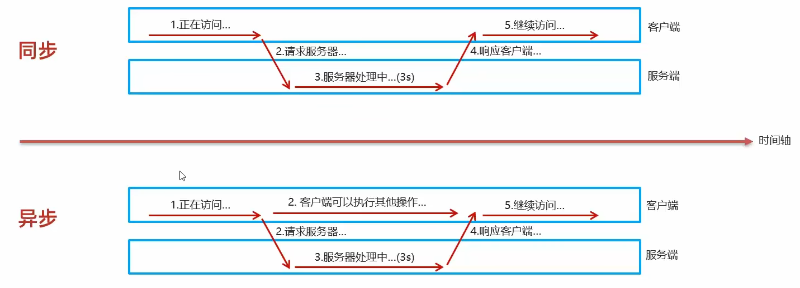

2023年3月23日开始学习

# day 02

## 2 Vue

### 2.1 简介

- Vue 是一套前端框架，免除原生JavaScript中的DOM操作，简化书写
- 基于MVVM（Model-View-ViewModel）思想，实现数据的双向绑定，将编程的关注点放在数据上。
- [官网](https://v2.cn.vuejs.org/)

```html
<head>
    <meta charset="UTF-8">
    <meta http-equiv="X-UA-Compatible" content="IE=edge">
    <meta name="viewport" content="width=device-width, initial-scale=1.0">
    <title>Document</title>
    <script src="js/vue.js"></script>
</head>

<body>
    <div id="app">
        <input type="text" v-model="message"> {{ message }}
    </div>
</body>

<script>
    // 定义一个 Vue 对象
    new Vue({
        el: "#app", // Vue 接管的区域
        data: {
            message: "Hello Vue"
        }
    })
</script>
```

### 2.2 常用属性

指令：HTML 标签上带有 v-前缀 的特殊属性，不同指令具有不同含义。例如：`v-if`，`v-for`...

|    指令     |                         作用                          |
| :---------: | :---------------------------------------------------: |
|  `v-bind`   |    为HTML标签绑定属性值，如设置`href`，`css`样式等    |
|  `v-model`  |             在表单元素上创建双向数据绑定              |
|   `v-on`    |                  为HTML标签绑定事件                   |
|   `v-if`    |  条件性的渲染某元素，判定为`true`时渲染，否则不渲染   |
| `v-else-if` |  条件性的渲染某元素，判定为`true`时渲染，否则不渲染   |
|  `v-else`   |  条件性的渲染某元素，判定为`true`时渲染，否则不渲染   |
|  `v-show`   | 根据条件展示某元素，区别在于切换的是`display`属性的值 |
|   `v-for`   |        列表渲染，遍历容器的元素或者对象的属性         |

### 2.3 v-bind v-model

```html
<body>
    <div id="app">
        <!-- 为HTML标签绑定属性值 -->
        <a v-bind:href="url">链接1</a>
        <a :href="url">简写形式</a>

        <!-- 在表单元素上创建双向数据绑定 -->
        <input type="text" v-model="url">
    </div>
</body>
<script>
    new Vue({
        el: "#app",
        data: {
            url: "https://www.baidu.com"
        }
    })
</script>
```

### 2.4 v-on

```html
<body>
    <div id="app">
        // 绑定事件
        <input type="button" name="" id="" value="点我一下" v-on:click="handle()">
        // 简写
        <input type="button" name="" id="" value="点我一下" @click="handle()">
    </div>
</body>

<script>
    new Vue({
        el: "#app",
        data: {
        },
        methods: {
            handle: function() {
                alert("点我一下")
            },
        },
    })
</script>
```

### 2.5 条件渲染

```html
<body>
    <div id="app">
        年龄：<input type="text" name="" id="" v-model="age">经判定为：
        <span v-if="age <= 35">年轻人</span>
        <span v-else-if="age > 35 && age < 50">中年人</span>
        <span v-else>老年人</span>
        
        <br><br>
		
        <!-- 不满足条件 则 display: none -->
        年龄：<input type="text" name="" id="" v-model="age">经判定为：
        <span v-show="age <= 35">年轻人</span>
        <span v-show="age > 35 && age < 50">中年人</span>
        <span v-show="age >= 50">老年人</span>
    </div>
    
</body>
<script>
    new Vue({
        el: "#app",
        data() {
            return {
                age: 20,
            };
        },
    })
</script>
```

### 2.6 列表渲染

```html
<body>
    <div id="app">
        <div v-for="addr in addres">{{addr}}</div>
        <div v-for="(addr, index) in addres">{{addr}}  --  {{index}}</div>
    </div>
</body>

<script>
    new Vue({
        el: "#app",
        data: {
            addres: ["北京", "成都", "上海"]
        }
    })
</script>
```

### 2.7 小例子

```html
<body>
    <div id="app">
        <table border="1" width="60%">
            <tr>
                <th>编号</th>
                <th>姓名</th>
                <th>年龄</th>
                <th>性别</th>
                <th>成绩</th>
                <th>等级</th>
            </tr>
        
            <tr align="center" v-for="(user, index) in users">
                <td>{{index + 1}}</td>
                <td>{{user.name}}</td>
                <td>{{user.age}}</td>
                <td>
                    <span v-show="user.gender == 1">男</span>
                    <span v-show="user.gender == 0">女</span>
                </td>
                <td>{{user.score}}</td>
                <td>
                    <span v-if="user.score >= 85">优秀</span>
                    <span v-else-if="user.score >= 60">及格</span>
                    <span style="color: red;" v-else>不及格</span>
                </td>
            </tr>
        </table>
    </div>
</body>
<script>
    new Vue ({
        el: "#app",
        data: {
            users: [
                {
                    name: "Toxm", 
                    age: 12,
                    gender: 1,
                    score: 80
                },
            ]
        }
    })
</script>
```

### 2.8 Vue 的生命周期

- 生命周期：指一个对象从创建到销毁的整个过程
- 生命周期的八个阶段：每触发一个生命周期事件，会自动执行一个生命周期方法（钩子）。

|      状态       |   阶段周期   |
| :-------------: | :----------: |
| `beforeCreate`  |    创建前    |
|    `created`    |    创建后    |
|  `beforeMount`  |    挂载前    |
|  **`mounted`**  | **挂载完成** |
| `beforeUpdate`  |    更新前    |
|    `updated`    |    更新后    |
| `beforeDestroy` |    销毁前    |
|   `destroyed`   |    销毁后    |


```javascript
new Vue({
    el: "#app",
    mounted () {
        alert("vue 已挂载完成")
    }
})
```

# day 03

## 1 Ajax

### 1.1 简介

- 概念：**A**synchronous **J**avaScript **A**nd **X**ML，**异步**的JavaScript和XML。
- 作用
  - 数据交换：通过Ajax可以给服务器发送请求，并获取服务器响应的数据。
  - 异步交互：可以在**不重新加载整个页面**的情况下，与服务器交换数据并**更新部分网页**的技术，如：搜索联想、用户名是否可用的校验等等。

### 1.2 同步与异步



### 1.3 原生 Ajax

- [W3C官网](https://www.w3school.com.cn/js/js_ajax_http.asp)

```javascript
function getData() {
    var xmlHttpRequest = new XMLHttpRequest();

    xmlHttpRequest.open('GET', 'http://yapi.smart-xwork.cn/mock/169327/emp/list');
    xmlHttpRequest.send();

    xmlHttpRequest.onreadystatechange = function() {
        if (xmlHttpRequest.readyState == 4 && xmlHttpRequest.status == 200) {
            document.getElementById('div').innerHTML = xmlHttpRequest.responseText;
        }
    }
}
```

### 1.4 Axios

- 介绍：Axios 对原生的Ajax进行了封装，简化书写，快速开发

- [官网](https://www.axios-http.cn/)：https://www.axios-http.cn/

- 使用步骤

  - 引入Axios的js文件

  - 发送请求`GET`请求与`POST`请求

    ```javascript
    function get() {
        // 通过 axios 发送异步请求 get
        axios({
            method: "get",
            url: "http://yapi.smart-xwork.cn/mock/169327/emp/list"
        }).then(result => {
            console.log(result.data)
        })
    }
    
    function post() {
        // 通过 axios 发送异步请求 post
        axios({
            method: "POST",
            url: "http://yapi.smart-xwork.cn/mock/169327/emp/deleteByld",
            data: "id=1",
        }).then(result => {
            console.log(result)
        })
    }
    ```

- axios 别名

  - `axios.get(url[, config])`
  - `axios.delete(url[, config])`
  - `axios.post(url[, data[, config]])`
  - `axios.put(url[, datal, config]])`

### 1.5 综合案例

```html
<body>
    <div id="app">
        <table border="1" width="60%">
            <tr>
                <th>编号</th>
                <th>姓名</th>
                <th>头像</th>
                <th>性别</th>
                <th>职位</th>
                <th>入职时间</th>
                <th>最后操作时间</th>
            </tr>
        
            <tr align="center" v-for="(emp, index) in emps">
                <td>{{index + 1}}</td>
                <td>{{emp.name}}</td>
                <td>
                    
                </td>
                <td>
                    <span v-show="emp.gender == 1">男</span>
                    <span v-show="emp.gender == 0">女</span>
                </td>
                <td>{{emp.job}}</td>
                <td>{{emp.entrydate}}</td>
                <td>{{emp.updata}}</td>
            </tr>
        </table>
    </div>
</body>

<script>
    new Vue({
        el: "#app",
        data: {
            emps: []
        },
        mounted(){
            axios.get('http://yapi.smart-xwork.cn/mock/169327/emp/list').then(result => {
                this.emps = result.data.data
            })
            console.log(this.emps)
        }
    })
</script>
```

## 2 前后端分离开发

### 2.1 介绍

### 2.2 YApi

- 介绍：YApi 是高效、易用、功能强大的 api 管理平台，旨在为开发、产品、测试人员提供更优雅的接口管理服务
- [地址](http://yapi.smart-xwork.cn/)：http://yapi.smart-xwork.cn/

## 3 前端工程化

- 模块化

  JS、CSS

- 组件化

  UI结构、样式、行为、

- 规范化

  目录结构、编码、接口

- 自动化

  构建、部署、测试

### 3.1 Vue 脚手架环境准备

- 介绍：Vue-cli 是 Vue 官方提供的一个脚手架，用于快速生成一个 Vue 的项目模板
- Vue-cli 提供了如下功能
  - 统一的目录结构
  - 本地调试
  - 热部署
  - 单元测试
  - 集成打包上线
- 依赖环境：NodeJS

### 3.2 Vue 项目简介与凯风珑城

- Vue 项目 - 创建

  - 命令行：`vue create vue-projectName`
  - 图形化界面：`vue ui`

- Vue 项目 - 目录结构

  

- Vue 项目 - 启动

  - 图形化界面
  - 命令行：`npm serve`

- Vue 项目 - 配置端口

  更改`vue.config.js`文件

  ```javascript
  const { defineConfig } = require('@vue/cli-service')
  module.exports = defineConfig({
    transpileDependencies: true,
    // 更改端口号
    devServer: {
      port: 7000
    }
  })
  ```

- Vue 的组件文件以`.vue`结尾，每个组件由三个部分组成：`<template>`、`<script>`、`<style>`。

## 4 Vue 组件库 Element

### 4.1 简介

- Element：是饿了么团队研发的，一套为开发者、设计师和产品经理准备的基于 Vue 2.0 的桌面端**组件**库。
- 组件：组成网页的部件，例如 超链接、按钮、图片、表格、表单、分页条等等。
- 官网：https://element.eleme.cn/#/zh-CNListener

### 4.2 快速入门

- 安装 ElementUI 组件库

  **项目文件夹下**`npm install element-ui@2.15.3`。（组件库文件会下载到项目文件夹的 node_modules 文件夹。）

- 在`main.js`引入 ElementUI 组件库

  ```javascript
  import ElementUI from 'element-ui'
  import 'element-ui/lib/theme-chalk/index.css';
  
  Vue.use(ElementUI);
  ```

- 访问官网，复制组件代码

### 4.3 常见组件

- 按钮

- 表格

- 分页器

- 对话框

  Dialog 对话框：在保留当前页面状态的情况下，告知用户并承载相关操作

- From 表单

## 5 Vue 路由

> 前端路由：URL中的hash(#号)与组件之间的对应关系

### 5.1 Vue Router
- 介绍：Vue Router 是 Vue 的官方路由。
- 组成
  - VueRouter：路由器类，根据路由请求在路由视图中动态渲染选中的组件
  - `<router-link>`：请求链接组件，浏览器会解析成`<a>`
  - `<router-view>`：动态视图组件，用来染展示与路由路径对应的组件

## 6 打包部署

### 6.1 打包

- `npm run build`

### 6.2 部署

- 介绍：Nginx 是一款轻量级的Web服务器/反向代理服务器及电子邮件（IMAP / POP3）代理服务器。其特点是占有内存少，并发能力强，在各大型互联网公司都有非常广泛的使用。
- 官网: https://nginx.org/

- 部署：将打包好的 dist 目录下的文件，复制到nginx安装目录的html目录下
- 启动：双击 nginx.exe 文件即可，Nginx服务器默认占用80端口号
- 查进程：`netstat -ano | findStr 80`
- 改端口号：conf 文件夹下的 nginx.conf 文件中更改端口号

# day 04

## 1 Maven

### 1.1 概述

- 介绍

  Maven 是 apache 旗下的一个开源项目，是一款用于管理和构建 Java 项目的工具。

  Apache Maven 是一个项目管理和构建工具，它基于项目对象模型（POM：Project Object Model）的概念，通过一小段描述信息来管理项目的构建。

- 作用

  - 依赖管理
  - 项目结构
  - 项目构建

- 官网：https://maven.apache.org/

- 仓库：用于存储资源，管理各种 jar 包。

  - 本地仓库：自己计算机上的一个目录。
  - 中央仓库：由 Maven 团队维护的全球唯一的。仓库地址：https://repo.maven.org/maven2
  - 远程仓库（私服）：一般由公司团队搭建的私有仓库。

- 安装与配置

  - 配置本地仓库：修改 conf/settings.xml 中的`<localRepository>`为一个指定目录

    ```
    <localRepository>D:\install\apache-maven-3.9.1\mvn_repo</localRepository>
    ```

  - 配置阿里云私服：修改conf/settings.xml 中的`<mirrors>`标签，为其添加如下子标签
  
    ```
    <mirror>
        <id>alimaven</id>
        <mirrorOf>central</mirrorOf>
        <name>aliyun maven</name>
        <url>http://maven.aliyun.com/nexus/content/groups/public/</url>
    </mirror>
    ```
  
  - 配置环境变量：MAVEN_HOME 为 maven 的解压目录，并将其 bin 目录加入 PATH 环境变量
  
  - 查看版本：`mvn -v`

### 1.2 IDEA 集成  Maven

#### 1.1.2 配置Maven环境

- 局部配置：在项目里面
- 全局配置：在 close project 后的弹窗里面选择 settings


#### 1.2.3 创建Maven项目


- 什么是Maven坐标?

  - Maven 中的坐标是**资源的唯一标识，通过该坐标可以唯一定位资源位置**
  - 使用坐标来定义项目或引入项目中需要的依赖

- Maven 坐标主要组成

  - groupld：定义当前Maven项目隶属组织名称（通常是域名反写，例如:com.itheima）
  - artifactld：定义当前Maven项目名称（通常是模块名称，例如 order-service、goods-service）
  - version：定义当前项目版本号

- 举个栗子

  ```xml
  <groupld>com.itheima</groupld>
  <artifactld>maven-project01</artifactld>
  <version>1.0-SNAPSHOT</version>
  ```

  ```xml
  <dependency>
  	<groupld>ch.qos.logback</groupld>
      <artifactld>logback-classic</artifactld>
      <version>1.2.3</version>
  </dependency>
  ```

好棒好棒，终于解决啦

#### 1.2.4 导入Maven项目

- 方式一：打开IDEA，选择右侧 Maven 面板，点击+号，选中对应项目的 pom.xml 文件，双击即可。
- 方式二：打开IDEA，【File】-【Project Structure】-【Modules】- 【+号】-【Import Module】- 选中对应项目的pom.xm文件，双击即可。

### 1.3 依赖管理

#### 1.3.1 依赖配置

- 依赖：指当前项目运行所需要的 jar 包，一个项目中可以引入多
- 配置
  1. 在 pom.xml 中编写`<dependencies>`标签
  2. 在`<dependencies>`标签中使用`<dependency>`引入坐标
  3. 定义坐标的`groupld`、`artifactld`、`version`
  4. 点击刷新按钮，引入最新加入的坐标
- 如果引入的依赖，在本地仓库不存在，将会连接远程仓库 / 中央仓库，然后下载依赖。（这个过程会比较耗时，耐心等待）
- 如果不知道依赖的坐标信息，可以到https://mvnrepository.com/中搜索。

```xml
<dependencies>
    <dependency>
        <groupId>org.projectlombok</groupId>
        <artifactId>lombok</artifactId>
        <version>1.18.16</version>
        <optional>true</optional>
    </dependency>

    <dependency>
        <groupId>ch.qos.logback</groupId>
        <artifactId>logback-classic</artifactId>
        <version>1.4.6</version>
    </dependency>
</dependencies>
```

#### 1.3.2 依赖传递

- 依赖具有传递性

  - 直接依赖：在当前项目中通过依赖配置建立的依赖关系
  - 间接依赖：被依赖的资源如果依赖其他资源，当前项目间接依赖其他资源

- 排除依赖

  排除依赖指主动断开依赖的资源，被排除的资源无需指定版本

  ```xml
  <dependency>
      <groupId>ch.qos.logback</groupId>
      <artifactId>logback-classic</artifactId>
      <version>1.4.6</version>
  
      <!-- 排除依赖 -->
      <exclusions>
          <exclusion>
              <groupId>org.slf4j</groupId>
              <artifactId>slf4j-api</artifactId>
          </exclusion>
      </exclusions>
  </dependency>
  ```

#### 1.3.3 依赖范围

- 依赖的 jar 包，默认情况下，可以在任何地方使用。可以通过`<scope>...</ scope>`设置其作用范围
- 作用范围
  - 主程序范围有效。（`main`文件夹范围内）
  - 测试程序范围有效。（`test`文件夹范围内）
  - 是否参与打包运行。（`package`指令范围内）

|      scope值      | 主程序 | 测试程序 | 打包（运行） |     范例      |
| :---------------: | :----: | :------: | :----------: | :-----------: |
| `compile`（默认） |   Y    |    Y     |      Y       |    `log4j`    |
|      `test`       |   -    |    Y     |      -       |    `junit`    |
|    `provided`     |   Y    |    Y     |      -       | `servlet-api` |
|     `runtime`     |   -    |    Y     |      Y       |  `jdbc`驱动   |

#### 1.3.4 生命周期

- Maven中有3套**相互独立**的生命周期
  - clean：清理工作
  - default：核心工作，如：编译、测试、打包、安装、部署等
  - site：生成报告、发布站点等


- 每套生命周期包含一些阶段（phase），阶段是有顺序的，后面的阶段依赖于前面的阶段。

  注意注意：是同一套生命周期，才是后面的阶段依赖于前面的阶段。比如说运行`default`这一套生命周期的`install`时，`clean`这一套生命周期的`clean`是不会执行的。

- 常见的生命周期阶段

  - clean：移除上一次构建生成的文件
  - compile：编译项目源代码
  - test：使用合适的单元测试框架运行测试（junit）
  - package：将编译后的文件打包，如：jar、war等
  - install：安装项目到本地仓库

- 执行指定生命周期的两种方式

  - 在idea中，右侧的maven工具栏，选中对应的生命周期，双击执行。亦可单击后，选中闪电图标后，跳过。
  - 在命令行中，通过命令执行：`mnv xxx`

## 2 Web 入门

### 2.1 SpringBootWeb 入门

- 官网：https://spring.io
- Spring 发展到今天已经形成了一种开发生态圈，Spring 提供了若干个子项目，每个项目用于完成特定的功能。


### 2.2 HTTP 协议

### 2.2.1 HTTP-概述

- 概念：**H**yper **T**ext **T**ransfer **P**otocol，超文本传输协议，规定了浏览器和服务器之间数据传输的规则。
- 特点
  1. 基于TCP协议:面向连接，安全
  2. 基于请求-响应模型的：一次请求对应一次响应
  3. HTTP协议是无状态的协议：对于事务处理没有记忆能力。每次请求-响应都是独立的。
    + 缺点：多次请求间不能共享数据
    + 优点：速度快

#### 2.2.2 HTTP-请求协议

> 请求协议由：请求行、请求头、请求体三部分构成。

- 请求行

  ```
  GET /hello HTTP/1.1
  ```

  请求数据第一行

  - 请求方式
  - 请求路径
  - 协议及其版本

- 请求头

  ```
  Accept: text/html,application/xhtml+xml,application/xml;q=0.9,image/avif,image/webp,image/apng,*/*;q=0.8,application/signed-exchange;v=b3;q=0.7
  Accept-Encoding: gzip, deflate, br
  Accept-Language: zh-CN,zh;q=0.9,en-US;q=0.8,en;q=0.7
  Cache-Control: no-cache
  Connection: keep-alive
  Host: 127.0.0.1:8080
  Pragma: no-cache
  Sec-Fetch-Dest: document
  Sec-Fetch-Mode: navigate
  Sec-Fetch-Site: none
  Sec-Fetch-User: ?1
  Upgrade-Insecure-Requests: 1
  User-Agent: Mozilla/5.0 (Windows NT 10.0; Win64; x64) AppleWebKit/537.36 (KHTML, like Gecko) Chrome/111.0.0.0 Safari/537.36
  sec-ch-ua: "Google Chrome";v="111", "Not(A:Brand";v="8", "Chromium";v="111"
  sec-ch-ua-mobile: ?0
  sec-ch-ua-platform: "Windows"
  ```

  第二行开始

  |    请求头键     |                             含义                             |
  | :-------------: | :----------------------------------------------------------: |
  |      Host       |                         请求的主机名                         |
  |   User-Agent    | 浏览器版本，例如Chrome浏览器的标识类似 Mozilla/5.0 ...Chrome/79<br>IE浏览器的标识类似Mozilla/5.0(Window9NT ...) like Gecko |
  |     Accept      | 表示浏览器能接收的资源类型，如`text/*`，`image/*`或者`*/`表示所有 |
  | Accept-Language |    表示浏览器偏好的语言，服务器可以据此返回不同语言的网页    |
  | Accept-Encoding |     表示浏览器可以支持的压缩类型，例如 gzip、deflate 等      |
  |  Content-Type   |                      请求主体的数据类型                      |
  | Content-Length  |                 请求主体的大小（单位：字节）                 |

- 请求体

  和请求体之间隔一个空行

  请求体：POST 请求，存放请求参数

- 请求方式 - POST：请求参数在请求体中，POST 请求大小是没有限制的
- 请求方式 - GET：请求参数在请求行中，没有请求体，如：/brand/findA11?name=OPPOstatus=1。GET请求大小是有限制的。

#### 2.2.3 HTTP-响应协议

> 响应协议由响应行、响应头、响应体三部分构成。

- 响应行

  ```
  HTTP/1.1 200 OK
  ```

  响应据第一行

  - 协议
  - 状态码
  - 描述

- 响应头

  第二行开始，格式为：`key: value`

- 响应体

  最后一部分，存放响应数据

| 响应码大类 |    类别    |                             含义                             |
| :--------: | :--------: | :----------------------------------------------------------: |
|    1xx     |   响应中   | 临时状态码、表示请求已经接收，告诉客户端应该继续请求或者如果它已经完成则忽略它。 |
|    2xx     |    成功    |             表示请求已经被成功接收，处理已完成。             |
|    3xx     |   重定向   |    重定向到其他地方；让客户端再发起一次请求以完成整个处理    |
|    4xx     | 客户端错误 | 处理发生错误，责任在客户端。如：请求了不存在的资源、客户端未被授权、禁止访问等， |
|    5xx     | 服务器错误 |       处理发生错误，责任在服务端。如：程序抛出异常等。       |

|     响应头键     |                             含义                             |
| :--------------: | :----------------------------------------------------------: |
|   Content-Type   |  表示该响应内容的类型，例如`text/html`、`application/json`   |
|  Content-Length  |                表示该响应内容的长度（字节数）                |
| Content-Encoding |                表示该响应压缩算法，例如`gzip`                |
|  Cache-Control   | 指示客户端应如何缓存，例如`max-age=300`表示可以最多缓存300秒 |
|    Set-Cookie    |           告诉浏览器为当前页面所在的域设置`cookie`           |

#### 2.2.4 HTTP-协议解析

### 2.3 Web 服务器-Tomcat

#### 2.3.1 Web 服务器

Web 服务器是一个软件程序，对 HTTP 协议的操作进行封装，使得程序员不必直接对协议进行操作，让Web开发更加便捷主要功能是“提供网上信息浏览服务”。

#### 2.3.2 Tomcat 简介

- 概念：Tomcat 是 Apache 软件基金会一个核心项目，是一个开源免费的轻量级Web服务器，支持 Servlet / JSP 少量 JavaEE 规范
- JavaEE：Java Enterprise Edition，Java 企业版。指 Java 企业级开发的技术规范总和。包含13项技术规范：JDBC、INDI、EJB、RMI、JSP、Servlet、XML、JMS、Java IDL、JTS、JTA、JavaMail、JAF
- Tomcat 也被称为 Web 容器、Servlet 容器。Servlet 程序需要依赖于 Tomcat 才能运行
- 官网：https://tomcat.apache.org/

#### 2.3.3 Tomcat 基本使用

- 下载：官网下载，地址：https://tomcat.apache.org/download-90.cgl

- 安装：绿色版，直接解压即可

- 卸载：直接删除目录即可

- 启动

  - 双击：`bin\startup.bat`

  - 控制台中文乱码：修改`conf/ logging.properties`

    ```properties
    java.util.logging.ConsoleHandler.encoding = GBK
    ```

- 关闭

  - 直接 x 掉运行窗口：强制关闭
  - `bin\shutdown.bat`：正常关闭
  - `Ctrl+C`：正常关闭

- 出现的问题

  - 启动窗口一闪而过：检查 JAVA_HOME 环境变量是否正确配置

  - 端口号冲突

    - 找到对应程序，将其关闭掉

      ```
      Caused by: java.net.BindException: Address already
      ```

    - 配置 Tomcat 端口号：`conf/serverxml`

      ```xml
      <Connector port="8080" protocol="HTTP/1.1" connectionTimeout="20000" redirectPort="8443" />
      ```

注意：HTTP 协议默认端口号为80，如果将 Tomcat 端口号改为80，则将来访问 Tomcat 时，将不用输入端口号

Tomcat 部署项目：将项目放置到 webapps 目录下，即部署完成

### 2.4 入门程序解析

- 起步依赖
  - spring-boot-starter-web：包含了web应用开发所需要的常见依赖
  - spring-boot-starter-test：包含了单元测试所需要的常见依赖。
  - 官方提供的 starter：https://dors.spring.io/spring-hoot/dacs/2.7.4/reference/htmlsingle/#using.build-systems.starters

# day 05 请求响应


- 请求（HttpServletRequest）：获取请求数据
- 响应（HttpServletResponse）：设置响应数据
- BS架构：Browser / Server，浏览器 / 服务器架构模式。客户端只需要浏览器，应用程序的逻辑和数据都存储在服务端。
- CS架构：Client / Server，客户端 / 服务器架构模式。

## 1 请求

### 1.1 Postman

- Postman 是一款功能强大的网页调试与发送网页 HTTP 请求的 Chrome 插件
- 作用：常用于进行接口测试

### 1.2 简单参数

- 原始方式

  在原始的 web 程序中，获取请求参数，需要通过 HttpServletRequest 对象手动获取。

  ```java
  @RequestMapping("/simpleParam1")
  public String simpleParam1(HttpServletRequest request) {
      // 获取参数
      String name = request.getParameter("name");
      String ageStr = request.getParameter("age");
  
      int age = Integer.parseInt(ageStr);
      System.out.println(name + " - " + age);
      return "OK";
  }
  ```

- SpringBoot 方式

  简单参数：参数名与形参变量名相同，定义形参即可接收参数

  ```java
  @RequestMapping("/simpleParam2")
  public String simpleParam2(String name, Integer age) {
      System.out.println(name + " - " + age);
      return "OK";
  }
  ```

  简单参数：如果方法形参名称与请求参数名称不匹配，可以使用`@RequestParam`完成映射。

  注意：`@RequestParam中`的`required`属性默认为`true`，代表该请求参数必须传递，如果不传递将报错。如果该参数是可选的，可
  以将`required`属性设置为`false`。

  ```java
  @RequestMapping("/simpleParam4")
  public String simpleParam4(@RequestParam(name = "name", required = false) String username, Integer age) {
      System.out.println(username + " - " + age);
      return "OK";
  }
  ```

### 1.3 实体参数

- 简单实体对象：请求参数名与形参对象属性名相同，定义`POJO`接收即可

  ```java
  @RequestMapping("/simplePojo")
  public String simplePojo(User user) {
      System.out.println(user);
      return "Ok";
  }
  ```

  ```java
  public class User {
      private String name;
      private Integer age;
  }
  ```

- 复杂实体对象：请求参数名与形参对象属性名相同，按照对象层次结构关系即可接收嵌套`POJO`属性参数

  ```java
  @RequestMapping("/complexPojo")
  public String complexPojo(User user) {
      System.out.println(user);
      return "Ok";
  }
  ```
  
  ```java
  public class User {
      private String name;
      private Integer age;
  
      private Address address;
  }
  ```
  
  ```java
  public class Address {
      private String province;
      private String city;
  }
  ```
  
  `http://127.0.0.1:8080/complexPojo?name=fafa&age=20&address.province=%E5%9B%9B%E5%B7%9D&address.city=%E6%88%90%E9%83%BD`

### 1.4 数组集合参数

- 数组参数：请求参数名与形参数组名称相同且请求参数为多个，定义数组类型形参即可接收参数

  ```java
  @RequestMapping("/arrayParam")
  public String arrayParam(String[] hobby) {
      System.out.println(Arrays.toString(hobby));
      return "Ok";
  }
  ```

  `http://127.0.0.1:8080/arrayParam?hobby=java&hobby=python`

- 集合参数：请求参数名与形参集合名称相同且请求参数为多个，`@RequestParam`绑定参数关系

  ```java
  @RequestMapping("/listParam")
  public String listParam(@RequestParam List<String> hobby) {
      System.out.println(hobby);
      return "Ok";
  }
  ```

  `http://127.0.0.1:8080/listParam?hobby=java&hobby=python`

### 1.5 日期参数

日期参数：使用`@DateTimeFormat`注解完成日期参数格式转换

```java
@RequestMapping("/dateParam")
public String dateParam(@DateTimeFormat(pattern = "yyyy-MM-dd HH:mm:ss") LocalDateTime updateTime) {
    System.out.println(updateTime);
    return "OK";
}
```

`http://127.0.0.1:8080/dateParam?updateTime=2022-12-12%2010:00:06`

### 1.6 Json 参数

JSON参数：JSON 数据键名与形参对象属性名同，定义 POJO 类型形参即可接收参数，需要使用`@RequestBody`标识

```java
@RequestMapping("/jsonParam")
public String jsonParam(@RequestBody User user) {
    System.out.println(user);
    return "OK";
}
```

### 1.7 路径参数

路径参数：通过请求URL直接传递参数，使用 {...} 来标识该路径参数，需要使用`@PathVariable`获取路径参数

```java
@RequestMapping("/path/{id}/{username}")
public String pathParam(@PathVariable Integer id, @PathVariable String username) {
    System.out.println(id + " - " + username);
    return "OK";
}
```

`http://127.0.0.1:8080/path/50`

## 2 响应

### 2.1 响应数据

- `@ResponseBody`

  - 类型：方法注解、类注解
  - 位置：`Controller`方法上 / 类上
  - 作用：将方法返回值直接响应，如果返回值类型是实体对象 / 集合，将会转换为 JSON 格式响应
  - 说明：`@RestController` = `@Controller` + `@ResponseBody`

- 统一响应结果

  ```java
  result(code, msg, data)
  ```

```java
public class Result {
    private int code;
    private String msg;
    private Object data;

    public Result() {
    }

    public Result(int code, String msg, Object data) {
        this.code = code;
        this.msg = msg;
        this.data = data;
    }
    ...
        
    public static Result success(Object data) {
        return new Result(1, "success", data);
    }

    public static Result success() {
        return new Result(1, "success", null);
    }

    public static Result error(String msg) {
        return new Result(0, msg, null);
    }
    ...
}
```

```java
@RequestMapping("/hello")
public Result hello() {
    System.out.println("Hello World ~");
    return Result.success("Hello World ~");
}

@RequestMapping("/getAddr")
public Result getAddr() {
    Address addr = new Address();
    addr.setProvince("广东");
    addr.setCity("深圳");
    return Result.success(addr);
}

@RequestMapping("/listAddr")
public Result listAddr() {
    List<Address> list = new ArrayList<>();

    Address addr1 = new Address();
    addr1.setProvince("广东");
    addr1.setCity("深圳");

    Address addr2 = new Address();
    addr2.setProvince("四川");
    addr2.setCity("成都");

    list.add(addr1);
    list.add(addr2);

    return Result.success(list);
}
```

### 2.2 小案例：解析 xml 文件并响应


## 3 分层解耦


 
