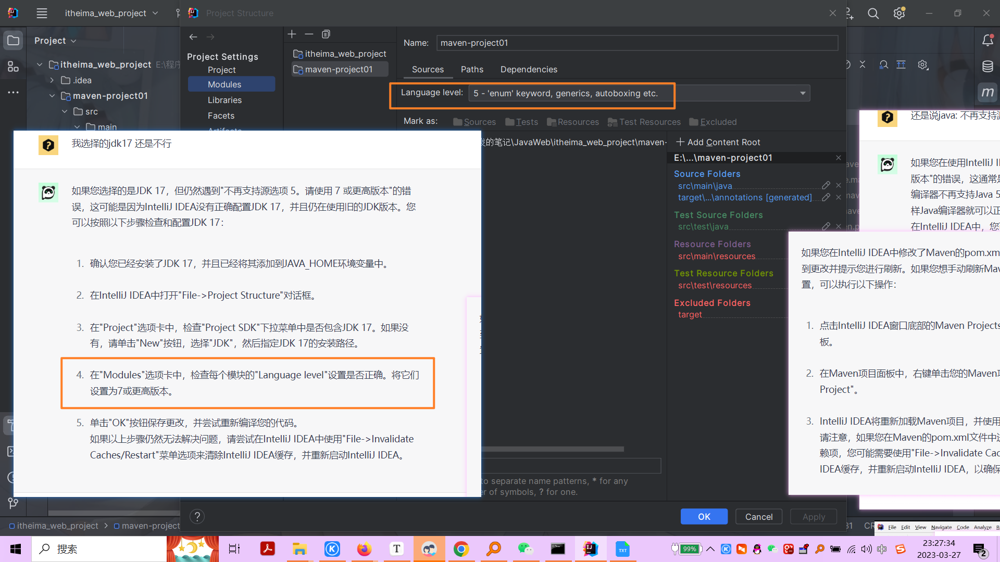
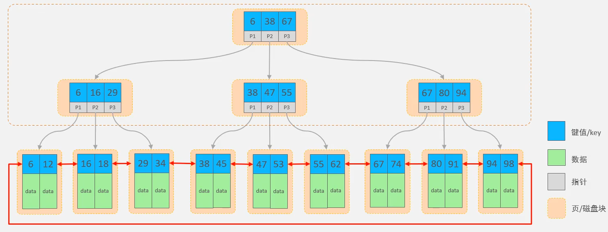

2023年3月23日开始学习

# day 02

## 2 Vue

### 2.1 简介

- Vue 是一套前端框架，免除原生JavaScript中的DOM操作，简化书写
- 基于MVVM（Model-View-ViewModel）思想，实现数据的双向绑定，将编程的关注点放在数据上。
- [官网](https://v2.cn.vuejs.org/)

```html
<head>
    <meta charset="UTF-8">
    <meta http-equiv="X-UA-Compatible" content="IE=edge">
    <meta name="viewport" content="width=device-width, initial-scale=1.0">
    <title>Document</title>
    <script src="js/vue.js"></script>
</head>

<body>
    <div id="app">
        <input type="text" v-model="message"> {{ message }}
    </div>
</body>

<script>
    // 定义一个 Vue 对象
    new Vue({
        el: "#app", // Vue 接管的区域
        data: {
            message: "Hello Vue"
        }
    })
</script>
```

### 2.2 常用属性

指令：HTML 标签上带有 v-前缀 的特殊属性，不同指令具有不同含义。例如：`v-if`，`v-for`...

|    指令     |                         作用                          |
| :---------: | :---------------------------------------------------: |
|  `v-bind`   |    为HTML标签绑定属性值，如设置`href`，`css`样式等    |
|  `v-model`  |             在表单元素上创建双向数据绑定              |
|   `v-on`    |                  为HTML标签绑定事件                   |
|   `v-if`    |  条件性的渲染某元素，判定为`true`时渲染，否则不渲染   |
| `v-else-if` |  条件性的渲染某元素，判定为`true`时渲染，否则不渲染   |
|  `v-else`   |  条件性的渲染某元素，判定为`true`时渲染，否则不渲染   |
|  `v-show`   | 根据条件展示某元素，区别在于切换的是`display`属性的值 |
|   `v-for`   |        列表渲染，遍历容器的元素或者对象的属性         |

### 2.3 v-bind v-model

```html
<body>
    <div id="app">
        <!-- 为HTML标签绑定属性值 -->
        <a v-bind:href="url">链接1</a>
        <a :href="url">简写形式</a>

        <!-- 在表单元素上创建双向数据绑定 -->
        <input type="text" v-model="url">
    </div>
</body>
<script>
    new Vue({
        el: "#app",
        data: {
            url: "https://www.baidu.com"
        }
    })
</script>
```

### 2.4 v-on

```html
<body>
    <div id="app">
        // 绑定事件
        <input type="button" name="" id="" value="点我一下" v-on:click="handle()">
        // 简写
        <input type="button" name="" id="" value="点我一下" @click="handle()">
    </div>
</body>

<script>
    new Vue({
        el: "#app",
        data: {
        },
        methods: {
            handle: function() {
                alert("点我一下")
            },
        },
    })
</script>
```

### 2.5 条件渲染

```html
<body>
    <div id="app">
        年龄：<input type="text" name="" id="" v-model="age">经判定为：
        <span v-if="age <= 35">年轻人</span>
        <span v-else-if="age > 35 && age < 50">中年人</span>
        <span v-else>老年人</span>
        
        <br><br>
		
        <!-- 不满足条件 则 display: none -->
        年龄：<input type="text" name="" id="" v-model="age">经判定为：
        <span v-show="age <= 35">年轻人</span>
        <span v-show="age > 35 && age < 50">中年人</span>
        <span v-show="age >= 50">老年人</span>
    </div>
    
</body>
<script>
    new Vue({
        el: "#app",
        data() {
            return {
                age: 20,
            };
        },
    })
</script>
```

### 2.6 列表渲染

```html
<body>
    <div id="app">
        <div v-for="addr in addres">{{addr}}</div>
        <div v-for="(addr, index) in addres">{{addr}}  --  {{index}}</div>
    </div>
</body>

<script>
    new Vue({
        el: "#app",
        data: {
            addres: ["北京", "成都", "上海"]
        }
    })
</script>
```

### 2.7 小例子

```html
<body>
    <div id="app">
        <table border="1" width="60%">
            <tr>
                <th>编号</th>
                <th>姓名</th>
                <th>年龄</th>
                <th>性别</th>
                <th>成绩</th>
                <th>等级</th>
            </tr>
        
            <tr align="center" v-for="(user, index) in users">
                <td>{{index + 1}}</td>
                <td>{{user.name}}</td>
                <td>{{user.age}}</td>
                <td>
                    <span v-show="user.gender == 1">男</span>
                    <span v-show="user.gender == 0">女</span>
                </td>
                <td>{{user.score}}</td>
                <td>
                    <span v-if="user.score >= 85">优秀</span>
                    <span v-else-if="user.score >= 60">及格</span>
                    <span style="color: red;" v-else>不及格</span>
                </td>
            </tr>
        </table>
    </div>
</body>
<script>
    new Vue ({
        el: "#app",
        data: {
            users: [
                {
                    name: "Toxm", 
                    age: 12,
                    gender: 1,
                    score: 80
                },
            ]
        }
    })
</script>
```

### 2.8 Vue 的生命周期

- 生命周期：指一个对象从创建到销毁的整个过程
- 生命周期的八个阶段：每触发一个生命周期事件，会自动执行一个生命周期方法（钩子）。

|      状态       |   阶段周期   |
| :-------------: | :----------: |
| `beforeCreate`  |    创建前    |
|    `created`    |    创建后    |
|  `beforeMount`  |    挂载前    |
|  **`mounted`**  | **挂载完成** |
| `beforeUpdate`  |    更新前    |
|    `updated`    |    更新后    |
| `beforeDestroy` |    销毁前    |
|   `destroyed`   |    销毁后    |


```javascript
new Vue({
    el: "#app",
    mounted () {
        alert("vue 已挂载完成")
    }
})
```

# day 03

## 1 Ajax

### 1.1 简介

- 概念：**A**synchronous **J**avaScript **A**nd **X**ML，**异步**的JavaScript和XML。
- 作用
  - 数据交换：通过Ajax可以给服务器发送请求，并获取服务器响应的数据。
  - 异步交互：可以在**不重新加载整个页面**的情况下，与服务器交换数据并**更新部分网页**的技术，如：搜索联想、用户名是否可用的校验等等。

### 1.2 同步与异步


### 1.3 原生 Ajax

- [W3C官网](https://www.w3school.com.cn/js/js_ajax_http.asp)

```javascript
function getData() {
    var xmlHttpRequest = new XMLHttpRequest();

    xmlHttpRequest.open('GET', 'http://yapi.smart-xwork.cn/mock/169327/emp/list');
    xmlHttpRequest.send();

    xmlHttpRequest.onreadystatechange = function() {
        if (xmlHttpRequest.readyState == 4 && xmlHttpRequest.status == 200) {
            document.getElementById('div').innerHTML = xmlHttpRequest.responseText;
        }
    }
}
```

### 1.4 Axios

- 介绍：Axios 对原生的Ajax进行了封装，简化书写，快速开发

- [官网](https://www.axios-http.cn/)：https://www.axios-http.cn/

- 使用步骤

  - 引入Axios的js文件

  - 发送请求`GET`请求与`POST`请求

    ```javascript
    function get() {
        // 通过 axios 发送异步请求 get
        axios({
            method: "get",
            url: "http://yapi.smart-xwork.cn/mock/169327/emp/list"
        }).then(result => {
            console.log(result.data)
        })
    }
    
    function post() {
        // 通过 axios 发送异步请求 post
        axios({
            method: "POST",
            url: "http://yapi.smart-xwork.cn/mock/169327/emp/deleteByld",
            data: "id=1",
        }).then(result => {
            console.log(result)
        })
    }
    ```

- axios 别名

  - `axios.get(url[, config])`
  - `axios.delete(url[, config])`
  - `axios.post(url[, data[, config]])`
  - `axios.put(url[, datal, config]])`

### 1.5 综合案例

```html
<body>
    <div id="app">
        <table border="1" width="60%">
            <tr>
                <th>编号</th>
                <th>姓名</th>
                <th>头像</th>
                <th>性别</th>
                <th>职位</th>
                <th>入职时间</th>
                <th>最后操作时间</th>
            </tr>
        
            <tr align="center" v-for="(emp, index) in emps">
                <td>{{index + 1}}</td>
                <td>{{emp.name}}</td>
                <td>
                    
                </td>
                <td>
                    <span v-show="emp.gender == 1">男</span>
                    <span v-show="emp.gender == 0">女</span>
                </td>
                <td>{{emp.job}}</td>
                <td>{{emp.entrydate}}</td>
                <td>{{emp.updata}}</td>
            </tr>
        </table>
    </div>
</body>

<script>
    new Vue({
        el: "#app",
        data: {
            emps: []
        },
        mounted(){
            axios.get('http://yapi.smart-xwork.cn/mock/169327/emp/list').then(result => {
                this.emps = result.data.data
            })
            console.log(this.emps)
        }
    })
</script>
```

## 2 前后端分离开发

### 2.1 介绍

### 2.2 YApi

- 介绍：YApi 是高效、易用、功能强大的 api 管理平台，旨在为开发、产品、测试人员提供更优雅的接口管理服务
- [地址](http://yapi.smart-xwork.cn/)：http://yapi.smart-xwork.cn/

## 3 前端工程化

- 模块化

  JS、CSS

- 组件化

  UI结构、样式、行为、

- 规范化

  目录结构、编码、接口

- 自动化

  构建、部署、测试

### 3.1 Vue 脚手架环境准备

- 介绍：Vue-cli 是 Vue 官方提供的一个脚手架，用于快速生成一个 Vue 的项目模板
- Vue-cli 提供了如下功能
  - 统一的目录结构
  - 本地调试
  - 热部署
  - 单元测试
  - 集成打包上线
- 依赖环境：NodeJS

### 3.2 Vue 项目简介与凯风珑城

- Vue 项目 - 创建

  - 命令行：`vue create vue-projectName`
  - 图形化界面：`vue ui`

- Vue 项目 - 目录结构

  

- Vue 项目 - 启动

  - 图形化界面
  - 命令行：`npm serve`

- Vue 项目 - 配置端口

  更改`vue.config.js`文件

  ```javascript
  const { defineConfig } = require('@vue/cli-service')
  module.exports = defineConfig({
    transpileDependencies: true,
    // 更改端口号
    devServer: {
      port: 7000
    }
  })
  ```

- Vue 的组件文件以`.vue`结尾，每个组件由三个部分组成：`<template>`、`<script>`、`<style>`。

## 4 Vue 组件库 Element

### 4.1 简介

- Element：是饿了么团队研发的，一套为开发者、设计师和产品经理准备的基于 Vue 2.0 的桌面端**组件**库。
- 组件：组成网页的部件，例如 超链接、按钮、图片、表格、表单、分页条等等。
- 官网：https://element.eleme.cn/#/zh-CNListener

### 4.2 快速入门

- 安装 ElementUI 组件库

  **项目文件夹下**`npm install element-ui@2.15.3`。（组件库文件会下载到项目文件夹的 node_modules 文件夹。）

- 在`main.js`引入 ElementUI 组件库

  ```javascript
  import ElementUI from 'element-ui'
  import 'element-ui/lib/theme-chalk/index.css';
  
  Vue.use(ElementUI);
  ```

- 访问官网，复制组件代码

### 4.3 常见组件

- 按钮

- 表格

- 分页器

- 对话框

  Dialog 对话框：在保留当前页面状态的情况下，告知用户并承载相关操作

- From 表单

## 5 Vue 路由

> 前端路由：URL中的hash(#号)与组件之间的对应关系

### 5.1 Vue Router
- 介绍：Vue Router 是 Vue 的官方路由。
- 组成
  - VueRouter：路由器类，根据路由请求在路由视图中动态渲染选中的组件
  - `<router-link>`：请求链接组件，浏览器会解析成`<a>`
  - `<router-view>`：动态视图组件，用来染展示与路由路径对应的组件

## 6 打包部署

### 6.1 打包

- `npm run build`

### 6.2 部署

- 介绍：Nginx 是一款轻量级的Web服务器/反向代理服务器及电子邮件（IMAP / POP3）代理服务器。其特点是占有内存少，并发能力强，在各大型互联网公司都有非常广泛的使用。
- 官网: https://nginx.org/

- 部署：将打包好的 dist 目录下的文件，复制到nginx安装目录的html目录下
- 启动：双击 nginx.exe 文件即可，Nginx服务器默认占用80端口号
- 查进程：`netstat -ano | findStr 80`
- 改端口号：conf 文件夹下的 nginx.conf 文件中更改端口号

# day 04

## 1 Maven

### 1.1 概述

- 介绍

  Maven 是 apache 旗下的一个开源项目，是一款用于管理和构建 Java 项目的工具。

  Apache Maven 是一个项目管理和构建工具，它基于项目对象模型（POM：Project Object Model）的概念，通过一小段描述信息来管理项目的构建。

- 作用

  - 依赖管理
  - 项目结构
  - 项目构建

- 官网：https://maven.apache.org/

- 仓库：用于存储资源，管理各种 jar 包。

  - 本地仓库：自己计算机上的一个目录。
  - 中央仓库：由 Maven 团队维护的全球唯一的。仓库地址：https://repo.maven.org/maven2
  - 远程仓库（私服）：一般由公司团队搭建的私有仓库。

- 安装与配置

  - 配置本地仓库：修改 conf/settings.xml 中的`<localRepository>`为一个指定目录

    ```
    <localRepository>D:\install\apache-maven-3.9.1\mvn_repo</localRepository>
    ```

  - 配置阿里云私服：修改conf/settings.xml 中的`<mirrors>`标签，为其添加如下子标签
  
    ```
    <mirror>
        <id>alimaven</id>
        <mirrorOf>central</mirrorOf>
        <name>aliyun maven</name>
        <url>http://maven.aliyun.com/nexus/content/groups/public/</url>
    </mirror>
    ```
  
  - 配置环境变量：MAVEN_HOME 为 maven 的解压目录，并将其 bin 目录加入 PATH 环境变量
  
  - 查看版本：`mvn -v`

### 1.2 IDEA 集成  Maven

#### 1.1.2 配置Maven环境

- 局部配置：在项目里面
- 全局配置：在 close project 后的弹窗里面选择 settings


#### 1.2.3 创建Maven项目


- 什么是Maven坐标?

  - Maven 中的坐标是**资源的唯一标识，通过该坐标可以唯一定位资源位置**
  - 使用坐标来定义项目或引入项目中需要的依赖

- Maven 坐标主要组成

  - groupld：定义当前Maven项目隶属组织名称（通常是域名反写，例如:com.itheima）
  - artifactld：定义当前Maven项目名称（通常是模块名称，例如 order-service、goods-service）
  - version：定义当前项目版本号

- 举个栗子

  ```xml
  <groupld>com.itheima</groupld>
  <artifactld>maven-project01</artifactld>
  <version>1.0-SNAPSHOT</version>
  ```

  ```xml
  <dependency>
  	<groupld>ch.qos.logback</groupld>
      <artifactld>logback-classic</artifactld>
      <version>1.2.3</version>
  </dependency>
  ```

好棒好棒，终于解决啦

#### 1.2.4 导入Maven项目

- 方式一：打开IDEA，选择右侧 Maven 面板，点击+号，选中对应项目的 pom.xml 文件，双击即可。
- 方式二：打开IDEA，【File】-【Project Structure】-【Modules】- 【+号】-【Import Module】- 选中对应项目的pom.xm文件，双击即可。

### 1.3 依赖管理

#### 1.3.1 依赖配置

- 依赖：指当前项目运行所需要的 jar 包，一个项目中可以引入多
- 配置
  1. 在 pom.xml 中编写`<dependencies>`标签
  2. 在`<dependencies>`标签中使用`<dependency>`引入坐标
  3. 定义坐标的`groupld`、`artifactld`、`version`
  4. 点击刷新按钮，引入最新加入的坐标
- 如果引入的依赖，在本地仓库不存在，将会连接远程仓库 / 中央仓库，然后下载依赖。（这个过程会比较耗时，耐心等待）
- 如果不知道依赖的坐标信息，可以到https://mvnrepository.com/中搜索。

```xml
<dependencies>
    <dependency>
        <groupId>org.projectlombok</groupId>
        <artifactId>lombok</artifactId>
        <version>1.18.16</version>
        <optional>true</optional>
    </dependency>

    <dependency>
        <groupId>ch.qos.logback</groupId>
        <artifactId>logback-classic</artifactId>
        <version>1.4.6</version>
    </dependency>
</dependencies>
```

#### 1.3.2 依赖传递

- 依赖具有传递性

  - 直接依赖：在当前项目中通过依赖配置建立的依赖关系
  - 间接依赖：被依赖的资源如果依赖其他资源，当前项目间接依赖其他资源

- 排除依赖

  排除依赖指主动断开依赖的资源，被排除的资源无需指定版本

  ```xml
  <dependency>
      <groupId>ch.qos.logback</groupId>
      <artifactId>logback-classic</artifactId>
      <version>1.4.6</version>
  
      <!-- 排除依赖 -->
      <exclusions>
          <exclusion>
              <groupId>org.slf4j</groupId>
              <artifactId>slf4j-api</artifactId>
          </exclusion>
      </exclusions>
  </dependency>
  ```

#### 1.3.3 依赖范围

- 依赖的 jar 包，默认情况下，可以在任何地方使用。可以通过`<scope>...</ scope>`设置其作用范围
- 作用范围
  - 主程序范围有效。（`main`文件夹范围内）
  - 测试程序范围有效。（`test`文件夹范围内）
  - 是否参与打包运行。（`package`指令范围内）

|      scope值      | 主程序 | 测试程序 | 打包（运行） |     范例      |
| :---------------: | :----: | :------: | :----------: | :-----------: |
| `compile`（默认） |   Y    |    Y     |      Y       |    `log4j`    |
|      `test`       |   -    |    Y     |      -       |    `junit`    |
|    `provided`     |   Y    |    Y     |      -       | `servlet-api` |
|     `runtime`     |   -    |    Y     |      Y       |  `jdbc`驱动   |

#### 1.3.4 生命周期

- Maven中有3套**相互独立**的生命周期
  - clean：清理工作
  - default：核心工作，如：编译、测试、打包、安装、部署等
  - site：生成报告、发布站点等


- 每套生命周期包含一些阶段（phase），阶段是有顺序的，后面的阶段依赖于前面的阶段。

  注意注意：是同一套生命周期，才是后面的阶段依赖于前面的阶段。比如说运行`default`这一套生命周期的`install`时，`clean`这一套生命周期的`clean`是不会执行的。

- 常见的生命周期阶段

  - clean：移除上一次构建生成的文件
  - compile：编译项目源代码
  - test：使用合适的单元测试框架运行测试（junit）
  - package：将编译后的文件打包，如：jar、war等
  - install：安装项目到本地仓库

- 执行指定生命周期的两种方式

  - 在idea中，右侧的maven工具栏，选中对应的生命周期，双击执行。亦可单击后，选中闪电图标后，跳过。
  - 在命令行中，通过命令执行：`mnv xxx`

## 2 Web 入门

### 2.1 SpringBootWeb 入门

- 官网：https://spring.io
- Spring 发展到今天已经形成了一种开发生态圈，Spring 提供了若干个子项目，每个项目用于完成特定的功能。


### 2.2 HTTP 协议

### 2.2.1 HTTP-概述

- 概念：**H**yper **T**ext **T**ransfer **P**otocol，超文本传输协议，规定了浏览器和服务器之间数据传输的规则。
- 特点
  1. 基于TCP协议:面向连接，安全
  2. 基于请求-响应模型的：一次请求对应一次响应
  3. HTTP协议是无状态的协议：对于事务处理没有记忆能力。每次请求-响应都是独立的。
    + 缺点：多次请求间不能共享数据
    + 优点：速度快

#### 2.2.2 HTTP-请求协议

> 请求协议由：请求行、请求头、请求体三部分构成。

- 请求行

  ```
  GET /hello HTTP/1.1
  ```

  请求数据第一行

  - 请求方式
  - 请求路径
  - 协议及其版本

- 请求头

  ```
  Accept: text/html,application/xhtml+xml,application/xml;q=0.9,image/avif,image/webp,image/apng,*/*;q=0.8,application/signed-exchange;v=b3;q=0.7
  Accept-Encoding: gzip, deflate, br
  Accept-Language: zh-CN,zh;q=0.9,en-US;q=0.8,en;q=0.7
  Cache-Control: no-cache
  Connection: keep-alive
  Host: 127.0.0.1:8080
  Pragma: no-cache
  Sec-Fetch-Dest: document
  Sec-Fetch-Mode: navigate
  Sec-Fetch-Site: none
  Sec-Fetch-User: ?1
  Upgrade-Insecure-Requests: 1
  User-Agent: Mozilla/5.0 (Windows NT 10.0; Win64; x64) AppleWebKit/537.36 (KHTML, like Gecko) Chrome/111.0.0.0 Safari/537.36
  sec-ch-ua: "Google Chrome";v="111", "Not(A:Brand";v="8", "Chromium";v="111"
  sec-ch-ua-mobile: ?0
  sec-ch-ua-platform: "Windows"
  ```

  第二行开始

  |    请求头键     |                             含义                             |
  | :-------------: | :----------------------------------------------------------: |
  |      Host       |                         请求的主机名                         |
  |   User-Agent    | 浏览器版本，例如Chrome浏览器的标识类似 Mozilla/5.0 ...Chrome/79<br>IE浏览器的标识类似Mozilla/5.0(Window9NT ...) like Gecko |
  |     Accept      | 表示浏览器能接收的资源类型，如`text/*`，`image/*`或者`*/`表示所有 |
  | Accept-Language |    表示浏览器偏好的语言，服务器可以据此返回不同语言的网页    |
  | Accept-Encoding |     表示浏览器可以支持的压缩类型，例如 gzip、deflate 等      |
  |  Content-Type   |                      请求主体的数据类型                      |
  | Content-Length  |                 请求主体的大小（单位：字节）                 |

- 请求体

  和请求体之间隔一个空行

  请求体：POST 请求，存放请求参数

- 请求方式 - POST：请求参数在请求体中，POST 请求大小是没有限制的
- 请求方式 - GET：请求参数在请求行中，没有请求体，如：/brand/findA11?name=OPPOstatus=1。GET请求大小是有限制的。

#### 2.2.3 HTTP-响应协议

> 响应协议由响应行、响应头、响应体三部分构成。

- 响应行

  ```
  HTTP/1.1 200 OK
  ```

  响应据第一行

  - 协议
  - 状态码
  - 描述

- 响应头

  第二行开始，格式为：`key: value`

- 响应体

  最后一部分，存放响应数据

| 响应码大类 |    类别    |                             含义                             |
| :--------: | :--------: | :----------------------------------------------------------: |
|    1xx     |   响应中   | 临时状态码、表示请求已经接收，告诉客户端应该继续请求或者如果它已经完成则忽略它。 |
|    2xx     |    成功    |             表示请求已经被成功接收，处理已完成。             |
|    3xx     |   重定向   |    重定向到其他地方；让客户端再发起一次请求以完成整个处理    |
|    4xx     | 客户端错误 | 处理发生错误，责任在客户端。如：请求了不存在的资源、客户端未被授权、禁止访问等， |
|    5xx     | 服务器错误 |       处理发生错误，责任在服务端。如：程序抛出异常等。       |

|     响应头键     |                             含义                             |
| :--------------: | :----------------------------------------------------------: |
|   Content-Type   |  表示该响应内容的类型，例如`text/html`、`application/json`   |
|  Content-Length  |                表示该响应内容的长度（字节数）                |
| Content-Encoding |                表示该响应压缩算法，例如`gzip`                |
|  Cache-Control   | 指示客户端应如何缓存，例如`max-age=300`表示可以最多缓存300秒 |
|    Set-Cookie    |           告诉浏览器为当前页面所在的域设置`cookie`           |

#### 2.2.4 HTTP-协议解析

### 2.3 Web 服务器-Tomcat

#### 2.3.1 Web 服务器

Web 服务器是一个软件程序，对 HTTP 协议的操作进行封装，使得程序员不必直接对协议进行操作，让Web开发更加便捷主要功能是“提供网上信息浏览服务”。

#### 2.3.2 Tomcat 简介

- 概念：Tomcat 是 Apache 软件基金会一个核心项目，是一个开源免费的轻量级Web服务器，支持 Servlet / JSP 少量 JavaEE 规范
- JavaEE：Java Enterprise Edition，Java 企业版。指 Java 企业级开发的技术规范总和。包含13项技术规范：JDBC、INDI、EJB、RMI、JSP、Servlet、XML、JMS、Java IDL、JTS、JTA、JavaMail、JAF
- Tomcat 也被称为 Web 容器、Servlet 容器。Servlet 程序需要依赖于 Tomcat 才能运行
- 官网：https://tomcat.apache.org/

#### 2.3.3 Tomcat 基本使用

- 下载：官网下载，地址：https://tomcat.apache.org/download-90.cgl

- 安装：绿色版，直接解压即可

- 卸载：直接删除目录即可

- 启动

  - 双击：`bin\startup.bat`

  - 控制台中文乱码：修改`conf/ logging.properties`

    ```properties
    java.util.logging.ConsoleHandler.encoding = GBK
    ```

- 关闭

  - 直接 x 掉运行窗口：强制关闭
  - `bin\shutdown.bat`：正常关闭
  - `Ctrl+C`：正常关闭

- 出现的问题

  - 启动窗口一闪而过：检查 JAVA_HOME 环境变量是否正确配置

  - 端口号冲突

    - 找到对应程序，将其关闭掉

      ```
      Caused by: java.net.BindException: Address already
      ```

    - 配置 Tomcat 端口号：`conf/serverxml`

      ```xml
      <Connector port="8080" protocol="HTTP/1.1" connectionTimeout="20000" redirectPort="8443" />
      ```

注意：HTTP 协议默认端口号为80，如果将 Tomcat 端口号改为80，则将来访问 Tomcat 时，将不用输入端口号

Tomcat 部署项目：将项目放置到 webapps 目录下，即部署完成

### 2.4 入门程序解析

- 起步依赖
  - spring-boot-starter-web：包含了web应用开发所需要的常见依赖
  - spring-boot-starter-test：包含了单元测试所需要的常见依赖。
  - 官方提供的 starter：https://dors.spring.io/spring-hoot/dacs/2.7.4/reference/htmlsingle/#using.build-systems.starters

# day 05 请求响应


- 请求（HttpServletRequest）：获取请求数据
- 响应（HttpServletResponse）：设置响应数据
- BS架构：Browser / Server，浏览器 / 服务器架构模式。客户端只需要浏览器，应用程序的逻辑和数据都存储在服务端。
- CS架构：Client / Server，客户端 / 服务器架构模式。

## 1 请求

### 1.1 Postman

- Postman 是一款功能强大的网页调试与发送网页 HTTP 请求的 Chrome 插件
- 作用：常用于进行接口测试

### 1.2 简单参数

- 原始方式

  在原始的 web 程序中，获取请求参数，需要通过 HttpServletRequest 对象手动获取。

  ```java
  @RequestMapping("/simpleParam1")
  public String simpleParam1(HttpServletRequest request) {
      // 获取参数
      String name = request.getParameter("name");
      String ageStr = request.getParameter("age");
  
      int age = Integer.parseInt(ageStr);
      System.out.println(name + " - " + age);
      return "OK";
  }
  ```

- SpringBoot 方式

  简单参数：参数名与形参变量名相同，定义形参即可接收参数

  ```java
  @RequestMapping("/simpleParam2")
  public String simpleParam2(String name, Integer age) {
      System.out.println(name + " - " + age);
      return "OK";
  }
  ```

  简单参数：如果方法形参名称与请求参数名称不匹配，可以使用`@RequestParam`完成映射。

  注意：`@RequestParam中`的`required`属性默认为`true`，代表该请求参数必须传递，如果不传递将报错。如果该参数是可选的，可
  以将`required`属性设置为`false`。

  ```java
  @RequestMapping("/simpleParam4")
  public String simpleParam4(@RequestParam(name = "name", required = false) String username, Integer age) {
      System.out.println(username + " - " + age);
      return "OK";
  }
  ```

### 1.3 实体参数

- 简单实体对象：请求参数名与形参对象属性名相同，定义`POJO`接收即可

  ```java
  @RequestMapping("/simplePojo")
  public String simplePojo(User user) {
      System.out.println(user);
      return "Ok";
  }
  ```

  ```java
  public class User {
      private String name;
      private Integer age;
  }
  ```

- 复杂实体对象：请求参数名与形参对象属性名相同，按照对象层次结构关系即可接收嵌套`POJO`属性参数

  ```java
  @RequestMapping("/complexPojo")
  public String complexPojo(User user) {
      System.out.println(user);
      return "Ok";
  }
  ```
  
  ```java
  public class User {
      private String name;
      private Integer age;
  
      private Address address;
  }
  ```
  
  ```java
  public class Address {
      private String province;
      private String city;
  }
  ```
  
  `http://127.0.0.1:8080/complexPojo?name=fafa&age=20&address.province=%E5%9B%9B%E5%B7%9D&address.city=%E6%88%90%E9%83%BD`

### 1.4 数组集合参数

- 数组参数：请求参数名与形参数组名称相同且请求参数为多个，定义数组类型形参即可接收参数

  ```java
  @RequestMapping("/arrayParam")
  public String arrayParam(String[] hobby) {
      System.out.println(Arrays.toString(hobby));
      return "Ok";
  }
  ```

  `http://127.0.0.1:8080/arrayParam?hobby=java&hobby=python`

- 集合参数：请求参数名与形参集合名称相同且请求参数为多个，`@RequestParam`绑定参数关系

  ```java
  @RequestMapping("/listParam")
  public String listParam(@RequestParam List<String> hobby) {
      System.out.println(hobby);
      return "Ok";
  }
  ```

  `http://127.0.0.1:8080/listParam?hobby=java&hobby=python`

### 1.5 日期参数

日期参数：使用`@DateTimeFormat`注解完成日期参数格式转换

```java
@RequestMapping("/dateParam")
public String dateParam(@DateTimeFormat(pattern = "yyyy-MM-dd HH:mm:ss") LocalDateTime updateTime) {
    System.out.println(updateTime);
    return "OK";
}
```

`http://127.0.0.1:8080/dateParam?updateTime=2022-12-12%2010:00:06`

### 1.6 Json 参数

JSON参数：JSON 数据键名与形参对象属性名同，定义 POJO 类型形参即可接收参数，需要使用`@RequestBody`标识

```java
@RequestMapping("/jsonParam")
public String jsonParam(@RequestBody User user) {
    System.out.println(user);
    return "OK";
}
```

### 1.7 路径参数

路径参数：通过请求URL直接传递参数，使用 {...} 来标识该路径参数，需要使用`@PathVariable`获取路径参数

```java
@RequestMapping("/path/{id}/{username}")
public String pathParam(@PathVariable Integer id, @PathVariable String username) {
    System.out.println(id + " - " + username);
    return "OK";
}
```

`http://127.0.0.1:8080/path/50`

## 2 响应

### 2.1 响应数据

- `@ResponseBody`

  - 类型：方法注解、类注解
  - 位置：`Controller`方法上 / 类上
  - 作用：将方法返回值直接响应，如果返回值类型是实体对象 / 集合，将会转换为 JSON 格式响应
  - 说明：`@RestController` = `@Controller` + `@ResponseBody`

- 统一响应结果

  ```java
  result(code, msg, data)
  ```

```java
public class Result {
    private int code;
    private String msg;
    private Object data;

    public Result() {
    }

    public Result(int code, String msg, Object data) {
        this.code = code;
        this.msg = msg;
        this.data = data;
    }
    ...
        
    public static Result success(Object data) {
        return new Result(1, "success", data);
    }

    public static Result success() {
        return new Result(1, "success", null);
    }

    public static Result error(String msg) {
        return new Result(0, msg, null);
    }
    ...
}
```

```java
@RequestMapping("/hello")
public Result hello() {
    System.out.println("Hello World ~");
    return Result.success("Hello World ~");
}

@RequestMapping("/getAddr")
public Result getAddr() {
    Address addr = new Address();
    addr.setProvince("广东");
    addr.setCity("深圳");
    return Result.success(addr);
}

@RequestMapping("/listAddr")
public Result listAddr() {
    List<Address> list = new ArrayList<>();

    Address addr1 = new Address();
    addr1.setProvince("广东");
    addr1.setCity("深圳");

    Address addr2 = new Address();
    addr2.setProvince("四川");
    addr2.setCity("成都");

    list.add(addr1);
    list.add(addr2);

    return Result.success(list);
}
```

### 2.2 小案例：解析 xml 文件并响应

XmlParserUtils.java

```java
import org.dom4j.Document;
import org.dom4j.Element;
import org.dom4j.io.SAXReader;

import java.io.File;
import java.lang.reflect.Constructor;
import java.lang.reflect.Field;
import java.util.ArrayList;
import java.util.List;

public class XmlParserUtils {

    public static <T> List<T> parse(String file, Class<T> targetClass) {
        ArrayList<T> list = new ArrayList<T>(); //封装解析出来的数据
        try {
            //1.获取一个解析器对象
            SAXReader saxReader = new SAXReader();
            //2.利用解析器把xml文件加载到内存中,并返回一个文档对象
            Document document = saxReader.read(new File(file));
            //3.获取到根标签
            Element rootElement = document.getRootElement();
            //4.通过根标签来获取 user 标签
            List<Element> elements = rootElement.elements("emp");

            //5.遍历集合,得到每一个 user 标签
            for (Element element : elements) {
                //获取 name 属性
                String name = element.element("name").getText();
                //获取 age 属性
                String age = element.element("age").getText();
                //获取 image 属性
                String image = element.element("image").getText();
                //获取 gender 属性
                String gender = element.element("gender").getText();
                //获取 job 属性
                String job = element.element("job").getText();

                //组装数据
                Constructor<T> constructor = targetClass.getDeclaredConstructor(String.class, Integer.class, String.class, String.class, String.class);
                constructor.setAccessible(true);
                T object = constructor.newInstance(name, Integer.parseInt(age), image, gender, job);

                list.add(object);
            }
        } catch (Exception e) {
            e.printStackTrace();
        }
        return list;
    }
}
```

## 3 分层解耦

### 3.1 三层架构

- `controller`：控制层，接收前端发送的请求，对请求进行处理，并响应数据
- `service`：业务逻辑层，处理具体的业务逻辑
- `dao`: 数据访问层(Data Access obiect)(持久层)，负责数据访问操作，包括数据的增、删、改、查


### 3.2 分层解耦

- 内聚：软件中各个功能模块内部的功能联系
- 耦合：衡量软件中各个层 / 模块之间的依赖、关联的程度
- 软件设计原则：高内聚，低耦合


- 控制反转：**I**nversion **o**f **c**ontrol，简称**IOC**。对象的创建控制权由程序自身转移到外部（容器），这种思想称为控制反转
- 依赖注入：**D**ependency **I**njection，简称**DI**。容器为应用程序提供运行时，所依赖的资源，称之为依赖注入
- Bean 对象：IOC 容器中创建、管理的对象，称之为 **bean**

### 3.3 IOC & DI 入门


### 3.4 lOC详解

- Bean的声明

  - 要把某个对象交给IOC容器管理，需要在对应的类上加上如下注解之一

    |     注解      |          说明          |                             位置                             |
    | :-----------: | :--------------------: | :----------------------------------------------------------: |
    | `@Component`  |  声明`bean`的基础注解  |                  不属于以下三类时，用此注解                  |
    | `@Controller` | `@Component`的衍生注解 | 标注在控制器类上<br>（因为`@RestController` = `@Controller` + `@ResponseBody`所以可以不加了） |
    |  `@Service`   | `@Component`的衍生注解 |                        标注在业务类上                        |
    | `@Repository` | `@Component`的衍生注解 |      标注在数据访问类上（由于与`mybatis`整合，用的少）       |

  - 声明`bean`的时候，可以通过`value`属性指定`bean`的名字，如果没有指定，默认为类名首字母小写。

    ```java
    // @Component("dao")
    @Component
    public class EmpDaoA implements EmpDao {
        ...
    }
    ```

  - 使用以上四个注解都可以声明`bean`，但是在`springboot`集成`web`开发中，声明控制器`bean`只能用`@Controller`。

- Bean 组件扫描

  - 前面声明`bean`的四大注解，要想生效，还需要被组件扫描注解`@ComponentScan`扫描
  - `@ComponentScan`注解虽然没有显式配置，但是实际上已经包含在了启动类声明注解`@SpringBootApplication`中，默认扫描的范围是启动类所在包及其子包。

  所以，如果把需要扫描的包放到其他地方了（不推荐这个亚子），就可以重新配置`@SpringBootApplication`

  ```java
  // 重新配置
  // "dao": 需要额外扫描的包
  // "com.itheima": 当前类及其子包 由于重新配置会覆盖掉默认的 所以这个地方要重新写出来
  @ComponentScan({"dao", "com.itheima"})
  @SpringBootApplication  // 默认扫描当前包及其子包
  public class SpringbootWebReqRespApplication {
  
      public static void main(String[] args) {
          SpringApplication.run(SpringbootWebReqRespApplication.class, args);
      }
  
  }
  ```

### 3.5 DI 详解

#### 3.5.1 Bean 注入

- `@Autowired`注解，默认是按照类型进行，如果存在多个相同类型的bean，将会报错。

  - 通过以下几种方案来解决

    - `@Primary`

      ```java
      @Primary
      @Service
      public class EmpServiceB implements EmpService {
          ...
      }
      ```

    - `@Qualifier`

      ```java
      @RestController
      public class EmpController {
          @Autowired // 运行时，IOC 容器会提供该类型的 bean 对象，并赋值给该变量 - 依赖注入
          @Qualifier("empServiceA")
          private EmpService empService;
          ...
      }
      ```

    - `@Resource`

      ```java
      @RestController
      public class EmpController {
          @Resource(name = "empServiceA")
          private EmpService empService;
          ...
      }
      ```

#### 3.5.2 总结

- `@Autowired`：默认按照类型自动装配。
- 如果同类型的bean存在多个
  - `@Primary`
  - `@Autowired` + `@Qualifier("bean的名称”)`
  - `@Resource(name="bean的名称”)`

`@Resource`与`@Autowired`区别

- `@Autowired`是 spring 框架提供的注解。而`@Resource`是 JDK 提供的注解
- `@Autowired`默认是按照类型注入，而`@Resource`默认是按照名称注入。

# day 06 数据库（上）

## 1 MySQL 概述

### 1.1 数据库简介

- 数据库：**D**ata**B**ase（DB），是存储和管理数据的仓库
- 数据库管理系统：**D**ata**B**ase **M**anagement **S**ystem（DBMS），操纵和管理数据库的大型软件
- SQL：**S**tructured **Q**uery **L**anguage，操作关系型数据库的编程语言，定义了一套操作关系型数据库统一标准。

|   数据库   |                             简介                             |
| :--------: | :----------------------------------------------------------: |
|   Oracle   |             收费的大型数据库，Oracle公司的产品。             |
|   MySQL    |                   开源免费的中小型数据库。                   |
| SQL Server | Sun公司收购了MySOL，Oracle收购Sun公司MicroSoft公司收费的中型的数据库。C#、net等语言常使用。 |
| PostgreSQL |                    开源免费中小型的数据库                    |
|    DB2     |                 IBM公司的大型收费数据库产品                  |
|   SQLite   |        嵌入式的微型数据库。如：作为Android内置数据库         |
|  MariaDB   |                  开源免费的中小型的数据库。                  |

### 1.2 数据模型

`mysql -u用户名 -p密码 [-h数据库服务器IP地址 -P端口号]`

关系型数据库（RDBMS）：建立在关系模型基础上，由多张相互连接的二维表组成的数据库

- 特点
  - 使用表存储数据，格式统一，便于维护
  - 使用SQL语言操作，标准统一，使用方便，可用于复杂查询

### 1.3 SQL 简介

SQL：一门操作关系型数据库的编程语言，定义操作所有关系型数据库的统一标准

- 通用语法

  - SQL 语句可以单行或多行书写，以分号结尾
  - SOL 语句可以使用空格 / 缩进来增强语句的可读性
  - MySQL 数据库的 SQL 语句不区分大小写
  - 注释
    - 单行注释：`-- 注释内容`或`# 注释内容`（MySQL 特有）
    - 多行注释：`/* 注释内容 */`

- SQL 分类

  | 分类 |                  全称                  |                          说明                          |
  | :--: | :------------------------------------: | :----------------------------------------------------: |
  | DDL  |  **D**ata **D**efinition **L**anguage  |  数据定义语言，用来定义数据库对象（数据库，表，字段）  |
  | DML  | **D**ata **M**anipulation **L**anguage |     数据操作语言，用来对数据库表中的数据进行增删改     |
  | DQL  |    **D**ata **Q**uery **L**anguage     |         数据查询语言，用来查询数据库中表的记录         |
  | DCL  |   **D**ata **C**ontrol **L**anguage    | 数据控制语言，用来创建数据库用户、控制数据库的访问权限 |

## 2 数据库设计 - DDL

### 2.1 数据库操作

- 查询所有数据库

  ```sql
  show databases;
  ```

- 创建数据库

  ```sql
  create database [if not exists] db01;
  ```

- 切换数据库

  ```sql
  use db01;
  ```

- 查看当前正在使用的数据库

  ```sql
  select database();
  ```

- 删除数据库

  ```sql
  drop database [if exists] dp04;
  ```

上述语法中的`database`，也可以替换成`schema`。如：`create schema db01;`。

### 2.2 图形化界面

- 介绍：DataGrip 是 JetBrains 旗下的一款数据库管理工具，是管理和开发 MySQL、Oracle、PostgreSQL 的理想解决方案
- 官网：https://www.jetbrains.com/zh-cn/datagrip/
- 安装：参考资料中提供的《DataGrip安装手册》

### 2.3 表操作

#### 2.3.1 创建

```sql
create table 表名(
	字段1 字段类型[约束][comment 字段1注释],
    ...
    字段n 字段类型[约束][comment 字段n注释]
)[ comment 表注释];
```

- 约束
  - 概念：约束是作用于表中字段上的规则，用于限制存储在表中的数据
  - 目的：保证数据库中数据的正确性、有效性和完整性

|   约束   |                       描述                       |                  关键字                   |
| :------: | :----------------------------------------------: | :---------------------------------------: |
| 非空约束 |             限制该字段值不能为`null`             |                `not null`                 |
| 唯一约束 |       保证字段的所有数据都是唯一、不重复的       |                 `unique`                  |
| 主键约束 |     主键是一行数据的唯一标识，要求非空且唯一     | `primary key`<br>（`auto increment`自增） |
| 默认约束 |   保存数据时，如果未指定该字段值，则采用默认值   |                 `default`                 |
| 外键约束 | 让两张表的数据建立连接，保证数据的一致性和完整性 |               `foreign key`               |

```sql
create table tb_user(
    id int primary key comment 'ID 唯一标识',
    username varchar(20) not null unique comment '用户名',
    name varchar(20) not null comment '姓名',
    age int comment '年龄',
    gender char(1) default '男' comment '性别'
) comment '用户表';
```

#### 2.3.2 数据类型

数值类型

|    类型     | 大小（byte） |                 有符号（SIGNED）范围                 |                  无符号（UNSIGNED）范围                  |        描述        |
| :---------: | :----------: | :--------------------------------------------------: | :------------------------------------------------------: | :----------------: |
| **tinyint** |      1       |                     (-128，127)                      |                         (0,255)                          |      小整数值      |
|  smallint   |      2       |                   (-32768，32767)                    |                        (0，65535)                        |      大整数值      |
|  mediumint  |      3       |                 (-8388608，8388607)                  |                      (0，16777215)                       |      大整数值      |
|   **int**   |      4       |              (-2147483648，2147483647)               |                     (0，4294967295)                      |      大整数值      |
| **bigint**  |      8       |                   (-2^63，2^63-1)                    |                       (0，2^64-1)                        |     极大整数值     |
|    float    |      4       |       (-3.402823466 E+38，3.402823466351 E+38)       |        0 和 (1.175494351 E-38，3.402823466 E+38)         |   单精度浮点数值   |
|   double    |      8       | (-1.7976931348623157 E+308,1.7976931348623157 E+308) | 0和 (2.2250738585072014 E-308，1.7976931348623157 E+308) |   双精度浮点数值   |
|   decimal   |              |                                                      |                                                          | （小数值精度更高） |

- 默认是有符号的，无符号需要在数据类型后加上关键字`unsigned`
- float(5,2)：表示整个数字长度，2 表示小数位个数
- double(5,2)：5表示整个数字长度，2表示小数位个数
- decimal(5,2)：5表示整个数字长度，2表示小数位个数

字符串类型

|    类型     |         大小          |             描述             |
| :---------: | :-------------------: | :--------------------------: |
|  **char**   |      0-255 bytes      |          定长字符串          |
| **varchar** |     0-65535 bytes     |          变长字符串          |
|  tinyblob   |      0-255 bytes      | 不超过255个字符的二进制数据  |
|  tinytext   |      0-255 bytes      |         短文本字符串         |
|    blob     |    0-65 535 bytes     |    二进制形式的长文本数据    |
|    text     |     0-65535 bytes     |          长文本数据          |
| mediumblob  |  0-16 777 215 bytes   | 二进制形式的中等长度文本数据 |
| mediumtext  |  0-16 777 215 bytes   |       中等长度文本数据       |
|  longblob   | 0-4 294 967 295 bytes |   二进制形式的极大文本数据   |
|  longtext   | 0-4 294 967 295 bytes |         极大文本数据         |

- char(10)：最多只能存10个宇符，不足10个字符，占用10个字符空间
- varchar(10)：最多只能存10个字符，不足10个字符，按照实际长度存储

日期

|     类型     | 大小(byte) |                    范围                    |        格式         |           描述           |
| :----------: | :--------: | :----------------------------------------: | :-----------------: | :----------------------: |
|   **date**   |     3      |          1000-01-01 至 9999-12-31          |     YYYY-MM-DD      |          日期值          |
|     time     |     3      |          -838:59:59 至 838:59:59           |      HH:MM:SS       |     时间值或持续时间     |
|     year     |     1      |                1901 至 2155                |        YYYY         |          年份值          |
| **datetime** |     8      | 1000-01-01 00:00:00 至 9999-12-31 23:59:59 | YYYY-MM-DD HH:MM:SS |     混合日期和时间值     |
|  timestamp   |     4      | 1970-01-01 00:00:01 至 2038-01-19 03:14:07 | YYYY-MM-DD HH:MM:SS | 混合日期和时间值，时间戳 |

```sql
create table db02.tb_emp
(
    id          int primary key auto_increment comment '主键ID',
    username    varchar(20)                not null comment '用户名',
    password    varchar(32) default 123456 not null comment '密码',
    name        varchar(10)                not null comment '姓名',
    gender      tinyint unsigned           null comment '性别 1:男 2:女',
    image       varchar(300)               null comment '头像',
    job         tinyint unsigned           null comment '职位 1:班主任 2:讲师 3:学工主管 4:教研主管',
    entry_date  date                       null comment '入职日期',
    create_time datetime                   not null comment '创建时间',
    update_time datetime                   null comment '更新时间',
    constraint tb_emp_pk2
        unique (username)
)
    comment '员工表';
```

#### 2.3.3 查询

- 查看数据库下的表

  ```sql
  show tables;
  ```

- 查询表结构

  ```sql
  desc tb_emp;
  ```

- 查询建表语句

  ```sql
  show create table tb_emp;
  ```

#### 2.3.4 修改

- 添加字段

  ```sql
  alter table tb_emp add qq varchar(11) comment 'QQ';
  ```

- 修改字段

  ```sql
  alter table tb_emp modify qq varchar(13) comment 'QQ';
  ```

- 修改字段名

  ```sql
  alter table tb_emp change qq qq_num varchar(13) comment 'QQ';
  ```

- 删掉字段

  ```sql
  alter table tb_emp change qq qq_num varchar(13) comment 'QQ';
  ```

- 修改表名

  ```sql
  rename table emp to tb_emp;
  ```

#### 2.3.5 删除

```sql
drop table if exists tb_emp;
```

## 3 数据库操作 - DML

### 3.1 添加数据（insert）

- 指定字段添加数据

  ```sql
  insert into 表名 (字段名1, 字段名2) values (值1, 值2);
  insert into tb_emp (username, name, gender, create_time, update_time) values ('fafa', '发发', 0, now(), now());
  ```

- 全部字段添加数据

  ```sql
  insert into 表名 values (值1, 值2, ...);
  insert into tb_emp value (null, "fafafa", '555555s', "发发发发", 2, '1.jpg', 1, '2010-01-01', now(), now())
  ```

- 批量添加数据（指定字段）

  ```sql
  insert into 表名 (字段名1, 字段名2) values (值1, 值2), (值1, 值2), ...;
  
  insert into tb_emp (username, name, gender, create_time, update_time)
  values ('fafa1', '发发', 0, now(), now()),
         ('fafa2', '发发', 0, now(), now()),
         ('fafa3', '发发', 0, now(), now());
  ```

- 批量添加数据（全部字段）

  ```sql
  insert into 表名 values (值1, 值2, ...), (值1, 值2, ...), ...;
  
  insert into tb_emp value (null, "fafafa1", '555555s', "发发发发", 2, '1.jpg', 1, '2010-01-01', now(), now()),
                           (null, "fafafa2", '555555s', "发发发发", 2, '1.jpg', 1, '2010-01-01', now(), now()),
                           (null, "fafafa3", '555555s', "发发发发", 2, '1.jpg', 1, '2010-01-01', now(), now());
  ```

- 注意事项
  1. 插入数据时，指定的字段顺序需要与值的顺序是一一对应的；
  2. 字符串和日期型数据应该包含在引号中；
  3. 插入的数据大小会应该在字段的规定范围内。

### 3.2 修改数据（update）

```sql
update 表名 set 字段名1=值1, 字段名2=值2, ...[where 条件];

update tb_emp set name = 'afaf', update_time = now() where id = 1;
update tb_emp set entry_date = '2023-03-31', update_time = now();
```

修改语句的条件可以有，也可以没有，如果没有条件，则会修改整张表的所有数据。

### 3.3 删除数据（delete）

```sql
delete from 表名 [where 条件];

delete from tb_emp where id = 1;
delete from tb_emp;
```

- 注意事项
  1. `DELETE`语句的条件可以有，也可以没有，如果没有条件，则会删除整张表的所有数据
  2. `DELETE`语句不能删除某一个字段的值（如果要操作，可以使用`UPDATE`，将该字段的值置为`NULL`）

# day 08 数据库（中）

## 1 数据库操作 - DQL

```sql
select
    字段列表
from
    表名列表
where
    条件列表
group by
    分组字段列表
having
    分组后条件列表
order by
    排序字段列表
limit
    分页参数
```

### 1.1 基本查询

- 查询多个字段

  ```sql
  select 字段1, 字段2, ... from 表名;
  
  select name, entrydate from tb_emp;
  ```

- 查询所有字段（通配符）

  ```sql
  select * from tb_emp;
  ```

- 设置别名

  `as`可以省略

  别名如果有特殊符号需要引号引起来

  ```sql
  select 字段1 [[as] 别名1], 字段2 [[as] 别名2], ... from 表名;
  
  select name as 姓名, entrydate as 入职日期 from tb_emp;
  select name 姓名, entrydate '入职 日期' from tb_emp;
  ```

- 去除重复记录

  ```sql
  select distinct 字段列表 from 表名;
  
  select distinct job from tb_emp;
  ```

注意事项：`*`号代表查询所有字段，在实际开发中尽量少用（不直观、影响效率）

### 1.2 条件查询

```sql
select 字段列表 from 表名 where 条件列表;
```

|      比较运算符       |                      功能                      |
| :-------------------: | :--------------------------------------------: |
|          `>`          |                      大于                      |
|         `>=`          |                    大于等于                    |
|          `<`          |                      小于                      |
|         `<=`          |                    小于等于                    |
|          `=`          |                      等于                      |
|      `<>`或`!=`       |                     不等于                     |
| `between ... and ...` |        在某个范围之内（含最小、最大值）        |
|       `in(...)`       |          在in之后的列表中的值，多选一          |
|     `like 占位符`     | 模糊匹配（`_`匹配单个字符，`%`匹配任意个字符） |
|       `is null`       |                    是`null`                    |

| 逻辑运算符  |             功能             |
| :---------: | :--------------------------: |
| `and`或`&&` |   并且（多个条件同时成立）   |
| `or`或`||`  | 或者（多个条件任意一个成立） |
| `not`或`!`  |          非 ，不是           |

```sql
select * from tb_emp where name = '杨';

select * from tb_emp where id <= 5;

select * from tb_emp where job is null;

select * from tb_emp where job is not null;

select * from tb_emp where password <> '123456';
select * from tb_emp where password != '123456';

select * from tb_emp where entrydate >= '2000-01-01' and entrydate <= '2016-05-02';
select * from tb_emp where entrydate between '2000-01-01' and '2016-05-02';

select * from tb_emp where entrydate between '2000-01-01' and '2010-01-01' and gender = 2;

select * from tb_emp where job = 2 or job = 3 or job = 4;
select * from tb_emp where job in (2, 3, 4);

select * from tb_emp where name like '__';
select * from tb_emp where name like '张%';
```

### 1.3 分组查询

介绍：将一列数据作为一个整体，进行纵向计算。

```sql
select 聚合函数(字段列表) from 表名
```

|  函数   |   功能   |
| :-----: | :------: |
| `count` | 统计数量 |
|  `max`  |  最大值  |
|  `min`  |  最小值  |
|  `avg`  |  平均值  |
|  `sum`  |   求和   |

```sql
# count(字段)
select count(job) from tb_emp;  # 不对 null 值进行运算
# count(常量)
select count(0) from tb_emp;
# count(*)  推荐使用
select count(*) from tb_emp;

select min(entrydate) from tb_emp;

select max(entrydate) from tb_emp;

select avg(id) from tb_emp;

select sum(id) from tb_emp;
```

### 1.4 分组查询

```sql
select 字段列表 from 表名[where 条件] group by 分组字段名[having 分组后过滤条件];
```

```sql
# 根据性别分组，统计男性和女性员工的数量 - count(*)
select gender, count(*) from tb_emp group by gender;

# 先查询入职时间在，2015-01-01 (包含) 以前的员工，并对结果根据职位分组，获取员工数量大于等于2的职位
select job, count(*) from tb_emp where entrydate <= '2015-01-01' group by job having count(*) >= 2;
```

- `where`与`having`区别
  1. 执行时机不同：`where`是分组之前进行过滤，不满足`where`条件，不参与分组；而`having`是分组之后对结果进行过滤。
  2. 判断条件不同：`where`不能对聚合函数进行判断，而`having`可以
- 注意事项
  - 分组之后，查询的字段一般为聚合函数和分组字段，查询其他字段无任何意义
  - 执行顺序：`where` > 聚合函数 > `having`

### 1.5 排序查询

```sql
select 字段列表 from 表名 [where 条件列表] [group by 分组字段] order by 字段1 排序方式1, 字段2 排序方式2, ...;

ASC：升序(默认值)
DESC：降序
```

```sql
# 根据 入职时间 对公司的员工进行 降序排序
select * from tb_emp order by entrydate desc;

# 根据 入职时间 对公司的员工进行 升序排序，入职时间相同，再按照 更新时间 进行降序排序
select * from tb_emp order by entrydate, update_time desc;
```

注意事项：如果是多字段排序，当第一个字段值相同时，才会根据第二个字段进行排序。

### 1.6 分页查询

```sql
select 字段列表 from 表名 limit 起始索引, 查询记录数;
```

```sql
# 1.从起始索引0开始查询员工数据，每页展示 5 条记录
select * from tb_emp limit 0, 5;

# 2.查询 第1页 员工数据，每页展示 5 条记录
select * from tb_emp limit 0, 5;

# 3，查询 第2页 员工数据，每页展示 5 条记录
select * from tb_emp limit 5, 5;

# 4.查询 第3页 员工数据，每页展示 5 条记录
select * from tb_emp limit 10, 5;
```

- 注意事项
  - 起始索引从0开始，起始索引 = (查询页码 - 1) * 每页显示记录数
  - 分页查询是数据库的方言，不同的数据库有不同的实现，MySQL 中是`LIMIT`
  - 如果查询的是第一页数据，起始索引可以省略，直接简写为`limit 10`

### 1.7 综合案例

```sql
# 案例1 : 按需求完成员工管理的条件分页查询 - 根据输入条件，查询第一页数据，每页展示10条记录输入条件:
# 姓名:张
# 性别: 男--
# 入职时间: 2000-01-01   2015-12-31
select *
from tb_emp
where name like '%张%'
  and gender = 1
  and entrydate between '2000-01-01' and '2015-12-31'
order by update_time desc
limit 0, 10;
```

```sql
# 案俩2-1: 想据需求，定成员工性别信息的统计 - count (*)
# if(条件表达式, true 取值, false 取值)
select if(gender = 1, '男性员工', '女性员工') as 性别, gender, count(*) from tb_emp group by gender;
```

|      |   性别   | gender | count(*) |
| :--: | :------: | :----: | :------: |
|  1   | 男性员工 |   1    |    24    |
|  2   | 女性员工 |   2    |    5     |

```sql
# 案例2-2: 想据需求，完成员工职位信息的统计
# case 表达式 when 值1 then 结果1 when 值2 then 结果2 ... else ... end;
select (case job
            when 1 then '班主任'
            when 2 then '讲师'
            when 3 then '学工主管'
            when 4 then '教研组管'
            else '未分配' end) as '职工信息', count(*)
from tb_emp
group by job;
```

|      | 职工信息 | count(*) |
| :--: | :------: | :------: |
|  1   | 教研组管 |    1     |
|  2   |   讲师   |    21    |
|  3   | 学工主管 |    1     |
|  4   |  班主任  |    5     |
|  5   |  未分配  |    1     |

- 函数

  ```sql
  # 当表达式为`true`时，取值`tvalue`；当表达式为`false`时，取值`fvalue`
  if(表达式, tvalue, fvalue)
  ```

  ```sql
  case expr when value1 then result1 [when value2 then value2 ...] [else result] end
  ```

## 2 多表设计

### 2.1 概述

项目开发中，在进行数据库表结构设计时，会根据业务需求及业务模块之间的关系，分析并设计表结构，由于业务之间相互关联，所以各个表结构之间也存在着各种联系，基本上分为三种

- 一对多（多对一）
- 多对多
- 一对一

### 2.2 一对多

#### 2.2.1 一对多代码

```sql
# 创建表时指定
create table 表名(
	字段名 数据类型
    ...
	[constraint] [外键名称] foreign key(外键字段名) references 主表(字段名)
);

# 建完表后，添加外键
alter table 表名 add constraint 外键名称 foreign key(外键字段名) references 主表(字段名);
```

#### 2.2.2 物理外键

- 概念：使用`foreign key`定义外键关联另外一张表
- 缺点
  - 影响增、删、改的效率（需要检查外键关系）
  - 仅用于单节点数据库，不适用与分布式、集群场景
  - 容易引发数据库的死锁问题，消耗性能

#### 2.2.3 逻辑外键

- 概念：在业务层逻辑中，解决外键关联
- 通过逻辑外键，就可以很方便的解决上述问题

### 2.3 一对一

- 案例：用户与身份证信息的关系
- 关系：一对一关系，多用于单表拆分，将一张表的基础字段放在一张表中，其他字段放在另一张表中，以提升操作效率
- 实现：在任意一方加入外键，关联另外一方的主键，并且设置外键为唯一的`UNIQUE`

### 2.4 多对多

实现：建立第三张中间表，中间表至少包含两个外键，分别关联两方主键


### 2.5 案例

# day 09 数据库（下）

## 1 多表查询

### 1.1 概述

- 多表查询：指从多张表中查询数据
- 笛卡尔积：笛卡尔乘积是指在数学中，两个集合(A集合和B集合)的所有组合情况

- 分类
  - 连接查询
    - 内连接：相当于查询A、B交集部分数据
    - 外连接
      - 左外连接：查询左表所有数据（包括两张表交集部分数据）
      - 右外连接：查询右表所有数据（包括两张表交集部分数据）
  - 子查询

### 1.2 内连接查询

- 隐式内连接

  ```sql
  select 字段列表 from 表1,表2 where 条件 ...;
  ```

- 显式内连接

  ```sql
  select 字段列表 from 表1 [inner] join 表2 on 连接条件 ...;
  ```

```sql
# 1. 查询员工的姓名，及所属的部门名称 (隐式内连接实现)
select emp.name, dept.name from dept, emp where dept.id = emp.dept_id;

# 2. 查询员工的姓名，及所属的部门名称 (显式内连接实现)
select emp.name, dept.name from dept inner join emp on dept.id = emp.dept_id;

# 起别名
select e.name, d.name from emp e, dept d where d.id = e.dept_id;
```

### 1.3 外连接查询

- 左外连接

  ```sql
  select 字段列表 from 表1 left [outer] join 表2 on 连接条件 ...;
  ```

- 右外连接

  ```sql
  select 字段列表 from 表1 right [outer] join 表2 on 连接条件 ...;
  ```

```sql
# 1. 查询员工表 所有 员工的姓名， 和对应的部门名称 (左外连接)
select e.name, d.name from emp e left outer join dept d on d.id = e.dept_id;

# 2. 查询部表 所有 部的名称，和对应的员工名称 (外连接)
select e.name, d.name from emp e right outer join dept d on e.dept_id = d.id;
select e.name, d.name from dept d left outer join emp e on e.dept_id = d.id;
```

### 1.4 子查询

#### 1.4.1 概述

- 介绍：SQL语句中嵌套`select`语句，称为嵌套查询，又称子查询。

- 形式

  ```sql
  select * from tl where column1 = ( select column1 from t2 ... );
  ```

- 子查询外部的语句可以是`insert`、`update`、`delete`、`select`的任何一个，最常见的是 select。

#### 1.4.2 分类

- 标量子查询：子查询返回的结果为单个值
- 列子查询：子查询返回的结果为一列
- 行子查询：子查询返回的结果为一行
- 表子查询：子查询返回的结果为多行多列

#### 1.4.3 标量子查询

- 子查询返回的结果是单个值（数字、字符串、日期等），最简单的形式
- 常用的操作符：`=`、`<>`、`>`、`>=`、`<`、`<=`

```sql
# 1. 查询“教研部”的所有员工信息
select * from emp where dept_id = (select id from dept where name = '教研部');

# 2. 查询在“方东白” 入职之后的员工信息
select * from emp where entrydate > (select entrydate from emp where name = '方东白');
```

#### 1.4.4 列子查询

- 子查询返回的结果是一列（可以是多行）
- 常用的操作符：`in` 、`not in`等

```sql
# 列子查询
# 1. 查询“教研部”和“咨询部” 的所有员工信息
select * from emp where dept_id in (select id from dept where name = '教研部' or name = '咨询部');
```

#### 1.4.5 行子查询

- 子查询返回的结果是一行（可以是多列）
- 常用的操作符：`=`、`<>`、`in` 、`not in`

```sql
# 行子查询
# 1. 查询与"韦一笑”的入职日期 及 职位都相同的员工信息
select entrydate, job from emp where name = '韦一笑';

select * from emp where entrydate = '2007-01-01' and job = 2;
select * from emp where (entrydate, job) = ('2007-01-01', 2);

select * from emp where (entrydate, job) = (select entrydate, job from emp where name = '韦一笑');
```

#### 1.4.6 表子查询

- 子查询返回的结果是多行多列，常作为临时表
- 常用的操作符：`in`

```sql
# 表子查询
# 1. 查询入职日期是 “2006-01-01”之后的员工信息，及其部名称
select * from (select * from emp where entrydate > '2006-01-01') e, dept d where e.dept_id = d.id;
```

### 1. 5 综合案例

```sql
# 1. 查询价格低于 10元 的菜品的名称、价格 及其 品的分类名称
select d.name, d.price, c.name
from dish d,
     category c
where d.category_id = c.id
  and d.price < 10;

# 2. 查询所有价格在 10元(含)到50元(含)之同 且 状态为起售”的菜品，
# 展示出菜品的名称、价格 及其 品的分类名称 即便英品没有分类 ，也需要将菜品查询出来。
select d.name, d.price, c.name
from dish d
         left outer join category c on d.category_id = c.id
where d.price between 10 and 50
  and d.status = 1;

# 3. 查询每个分类下最贵的菜品，展示出分类的名称、最贵的菜品的价格
select c.name, max(d.price), d.name
from dish d,
     category c
where d.category_id = c.id
group by c.name;

# 4. 查询各个分类下 菜品状态为‘起售’， 并且 该分类下菜总数大于等于 3 的 分类名称
select c.name, count(*) count
from dish d,
     category c
where d.category_id = c.id
  and d.status = 1
group by c.name
having count >= 3;

# 5. 查询出“商务套餐A” 中包含了哪些菜品(展示出套餐名称、价格，包含的菜品名称、价格、份数)
select s.name, s.price, d.name, d.price, sd.copies
from setmeal s,
     setmeal_dish sd,
     dish d
where s.id = sd.setmeal_id
  and sd.dish_id = d.id
  and s.name = '商务套餐A';

# 6. 查询出低于菜品平均价格的菜品信息 (展示出菜品名称、菜品价格)
select d.name, d.price
from dish as d
where d.price < (select avg(d.price) from dish d);
```

## 2 实务

### 2.1 概念

**事务**是一组操作的集合，它是一个不可分割的工作单位。事务会把所有的操作作为一个整体一起向系统提交或撤销操作请求，即这些
操作**要么同时成功，要么同时失败**。

例如，下面这个，是一步一步执行的，是不应该的。违反了事务的一致性`Consistency`。

```sql
# 删除部门
delete from dept where id = 1;

# 删除 员工表
delete from emp where dept_id = 1;
```

默认情况下，MySQL 的事务是自动提交的，也就是说，当执行一条 DML 语句，MySOL 会立即隐式的提交事务。

### 2.2 事务操作

- 开启事务：`start transaction;`或 `begin ;`
- 提交事务：`commit;`
- 回滚事务：`rollback;`

```sql
# 开启事务
start transaction;

# 删除部门
delete from dept where id = 2;

# 删除 员工表
delete from emp where dept_id == 2;

# 提交事务
commit;

# 回滚事务
rollback;
```

### 2.3 四大特性

- 原子性`Atomicity`

  事务是不可分割的最小单元，要么全部成功，要么全部失败

- 一致性`Consistency`

  事务完成时，必须使所有的数据都保持一致状态

- 隔离性`lsolation`

  数据库系统提供的隔离机制，保证事务在不受外部并发操作影响

- 持久性`Durability`

  事务一旦提交或回滚，它对数据库中的数据的改变就是永久的的独立环境下运行

## 3 索引

### 3.1 介绍

- 素引（index）是帮助数据库**高效获取数据**的**数据结构**。
- 优点
  - 提高数据查询的效率，降低数据库的 IO 成本
  - 通过索引列对数据进行排序，降低数据排序的成本降低 CPU 消耗
- 缺点
  - 索引会占用存储空间
  - 索引大大提高了查询效率，同时却也降低了`insert`、`update`、`delete`的效率

### 3.2 结构

MySQL 数据库支持的索引结构有很多，如：`Hash`索引、`B+Tree`索引、`Full-Text`索引等。我们平常所说的索引，如果没有特别指明，都是指默认的`B+Tree`（多路平衡搜索树）结构组织的索引。

大数据量情况下，层级深，检索速度慢，所以没有使用二叉平衡树或红黑树。



- 每一个节点，可以存储多个`key`（有`n`个`key`，就有`n`个指针）
- 所有的数据都存储在叶子节点，非叶子节点仅用于索引数据
- 叶子节点形成了一颗双向链表，便于数据的排序及区间范围查询

### 3.3 语法

- 创建索引

  ```sql
  create [unique] index 索引名 on 表名 (字段名, ...);
  ```

- 查看索引

  ```sql
  show index from 表名;
  ```

- 删除索引

  ```sql
  drop index 索引名 on 表名;
  ```

```sql
# 创建
create index idx_emp_name on emp(name);

# 查询
show index from emp;

# 删除
drop index idx_emp_name on emp;
```

- 注意事项
  - 主键字段，在建表时，会自动创建主键索引。主键索引性能最高
  - 添加唯一约束时，数据库实际上会添加唯一索引

## 4 Mybatis 入门

MyBatis 是一款优秀的**持久层**框架，用于简化 JDBC 的开发

### 4.1 快速入门


### 4.2 JDBC介绍

- JDBC：（**J**ava **D**ata**B**ase **C**onnectivity），就是使用 Java 语言操作关系型数据库的一套 API
- sun 公司官方定义的一套操作所有关系型数据库的规范，即接口
- 各个数据库厂商去实现这套接口，提供数据库驱动 jar 包
- 我们可以使用这套接口（DBC）编程，真正执行的代码是驱动 jar 包中的实现类

### 4.3 数据库连接池

#### 4.3.1 简介

- 数据库连接池是个容器，负责分配、管理数据库连接（Connection）
- 它允许应用程序重复使用一个现有的数据库连接，而不是再重新建立一个
- 释放空闲时间超过最大空闲时间的连接，来避免因为没有释放连接而引起的数据库连接遗漏

- 优势
  - 资源重用
  - 提升系统响应速度
  - 避免数据库连接遗漏

- 标准接口：`DataSource`
  - 官方（sun）提供的数据库连接池接口，由第三方组织实现此接口
  - 功能：获取连接：`Connection getConnection() throwsSOLException;`
- 常见产品
  - C3P0
  - DBCP
  - Druid（德鲁伊）
    - Druid 连接池是阿里巴巴开源的数据库连接池项目
    - 功能强大，性能优秀，是 Java 语言最好的数据库连接池之一
  - Hikari（追光者）
    - Springboot 默认

#### 4.3.2 切换数据库连接池

- 官方地址: https://github,com/alibaba/druid/tree/master/druid-spring-boot-starter

```xml
<dependency>
    <groupld>com.alibaba</groupld>
    <artifactld>druid-spring-boot-starter</artifactld>
    <version>1.2.8</version>
</dependency>
```

```properties
spring.datasource.driver-class-name=com.mysqlcj.jdbc.Driver
spring.datasource.url=jdbc:mysgl://localhost:3306/mybatis
spring.datasource.username=root
spring.datasource.password=1234
```

### 4.4 lombok

Lombok 是一个实用的 Java 类库，能通过注解的形式自动生成构造器、`getter`/`setter`、`equals`、`hashcode`、`toString`等方法，并可以自动化生成日志变量，简化 java 开发、提高效率。

|           注解            |                             作用                             |
| :-----------------------: | :----------------------------------------------------------: |
|   `@Getter` / `@Setter`   |               为所有的属性提供`get`/`set`方法                |
|        `@ToString`        |             会给类自动生成易阅读的`tostring`方法             |
|   `@EqualsAndHashCode`    | 根据类所拥有的非静态字段自动重写`equals`方法和`hashCode`方法 |
|        **`@Data`**        | 提供了更综合的生成代码功能：`@Getter`+`@Setter`+`@Totring`+`@EqualsAndHashCode` |
| **`@NoArgsConstructor`**  |                 为实体类生成无参的构造器方法                 |
| **`@AllArgsConstructor`** | 为实体类生成除了`static`修饰的字段之外带有各参数的构造器方法 |

注意事项：Lombok 会在编译时，自动生成对应的 Java 代码。我们使用 lombok 时，还需要安装一个 lombok 的插件（idea 自带）。

解决报错：


`-Djps.track.ap.dependencies=false`

【File】-【Invalidate Caches】

# day 10

## 5 Mybatis 基础增删改查

### 5.1 根据主键删除

```sql
// 根据 id 删除数据
@Delete("delete from emp where id = #{id}")
// public void delete(Integer id);
public int delete(Integer id);
```

注意事项：如果`mapper`接口方法形参只有一个普通类型的参数，`#{}`里面的属性名可以随便写，如：`#{id}`、`#{value}`

### 5.2 日志输出

- 可以在`application.properties`中，打开`mybatis`的日志，并指定输出到控制台

```sql
# 指定 mybatis 输出日志的位置 输出控制台
mybatis.configuration.log-impl=org.apache.ibatis.logging.stdout.StdOutImpl
```

### 5.3 预编译 SQL

- 性能更高

- 更安全（防止 SQL 注入）

  SQL 注入是通过操作输入的数据来修改事先定义好的 SQL 语句，以达到执行代码对服务器进行**攻击**的方法。

  ```sql
  ' or '1' = '1
  ```

- 参数占位符

  - `#{...}`
    - 执行SQL时，会将`#{...}`替换为`?`，生成预编译 SQL，会自动设置参数值
    - 使用时机：参数传递，都使用`#{...}`
  - `${...}`
    - 拼接SQL时，直接将参数拼接在 SQL 语句中，存在SQL注入问题
    - 使用时机：如果对表名、列表进行动态设置时使用

### 5.4 新增

#### 5.4.1 语法

```java
@Insert("insert into emp(username, name, gender, image, job, entrydate, dept_id, create_time, update_time) values (#{username}, #{name}, #{gender}, #{image}, #{job}, #{entryDate}, #{deptId}, #{createTime}, #{updateTime})")
public void insert(Emp emp);
```

```java
public void testInsert() {
    Emp emp = new Emp();
    emp.setUsername("Tom");
    emp.setName("汤姆");
    emp.setImage("1.jpg");
    emp.setGender((short) 1);
    emp.setJob((short) 1);
    emp.setEntryDate(LocalDate.of(2000, 1, 1));
    emp.setCreateTime(LocalDateTime.now());
    emp.setUpdateTime(LocalDateTime.now());
    emp.setDeptId(1);

    empMapper.insert(emp);
}
```

#### 5.4.2 主键返回

描述：在数据添加成功后，需要获取插入数据库数据的主键。如：添加套餐数据时，还需要维护套餐菜品关系表数据。

```java
@Options(useGeneratedKeys = true,  // 要获取返回主键
        keyProperty = "id")  // 赋值给 emp 的 id 属性
@Insert("insert into emp(username, name, gender, image, job, entrydate, dept_id, create_time, update_time) values (#{username}, #{name}, #{gender}, #{image}, #{job}, #{entryDate}, #{deptId}, #{createTime}, #{updateTime})")
public void insert(Emp emp);
```

### 5.5 更新

```java
@Update("update emp set username = #{username}, name = #{name}, gender = #{gender}, image = #{image}, job = #{job}, entrydate = #{entryDate}, dept_id = #{deptId} where id = #{id}")
public void update(Emp emp);
```

```java
@Test
public void testUpdate() {
    Emp emp = new Emp();
    emp.setId(19);
    emp.setUsername("Tom 2");
    emp.setName("汤姆 2");
    emp.setImage("1.jpg");
    emp.setGender((short) 1);
    emp.setJob((short) 1);
    emp.setEntryDate(LocalDate.of(2000, 1, 1));
    emp.setCreateTime(LocalDateTime.now());
    emp.setUpdateTime(LocalDateTime.now());
    emp.setDeptId(1);

    empMapper.update(emp);
}
```

### 5.6 查询（根据 ID 查询）

#### 5.6.1 语法

```java
@Select("select * from emp where id = #{id}")
public Emp getById(Integer id);
```

```java
@Test
public void testGetById() {
    Emp emp = empMapper.getById(19);
    System.out.println(emp);
}
```

#### 5.6.2 数据封装

- 实体类属性名和数据库表查询返回的字段名一致，mybatis 会自动封装
- 如果实体类属性名和数据库表查询返回的字段名不一致，不能自动封装

```java
// 解决方法一：给字段起别名 让别名和实体类的属性一致
@Select("select id, username, password, name, gender, image, job, entrydate, dept_id deptId, create_time crrateTime, update_time updateTime from emp where id = #{id}")
public Emp getById(Integer id);

// 解决方法二：通过 @Results 与 @Result 手动映射封装
@Results({
    @Result(column = "dept_id", property = "deptId"),
    @Result(column = "create_time", property = "createTime"),
    @Result(column = "update_time", property = "updateTime")
})
@Select("select * from emp where id = #{id}")
public Emp getById(Integer id);

// 解决方法三：开启 mybatis 的驼峰命名自动映射开关 --- a_column --> aColumn
@Select("select * from emp where id = #{id}")
public Emp getById(Integer id);
```

```properties
# 开启驼峰命名自动映射，即从数据库字段名 a_column 映射到 Java 属性名 aColumn
mybatis.configuration.map-underscore-to-camel-case=true
```

### 5.7 查询（条件查询）

```java
public void testList(){
    List<Emp> list = empMapper.list("张", (short) 1, LocalDate.of(2010, 1, 1), LocalDate.of(2020, 1, 1));
    list.stream().forEach(emp -> {
        System.out.println(emp);
    });
}
```

```java
// 根据条件查询
// 此处使用 #{} 是写死到字符串里面的 是不对的 所以这个地方就使用了 ${} 进行字符串的拼接
@Select("select * from emp where name like '%${name}%' and gender = #{gender} and entrydate between #{begin} and #{end} order by update_time desc")
// 也可以使用 字符串 的拼接函数 concat
@Select("select * from emp where name like concat('%', #{name} , '%') and gender = #{gender} and entrydate between #{begin} and #{end} order by update_time desc")
public List<Emp> list(String name, short gender, LocalDate begin, LocalDate end);
```

注意：参数名说明。在 SpringBoot 的 1.x 版本或单独使用 mybatis，多个参数需要```@Param```

```java
@Select("select * from emp where name like concat('%',#(name),'g') and gender = #igender) and " +"entrydate between #{begin) and #lend) order by update time desc")
public List<Emp> list(@Param("name")String name, @Param("gender") Short gender, @Param("begin") LocalDate begin, @Param("end") LocalDat end);
```

因为编译后的字节码文件中，参数形参的名称会变为`var1`、`var2`、...，所就需要```@Param```。

## 6 XML 映射文件

- XML 映射文件的名称与 Mapper 接口名称一致，并且将 XML 映射文件和 Mapper 接口放置在相同包下（同包同名）
- XML 映射文件的 namespace 属性为 Mapper 接口全限定名一致
- XML 映射文件中 sql 语句的 id 与 Mapper 接口中的方法名一致，并保持返回类型一致


```xml
<?xml version="1.0" encoding="UTF-8" ?>
<!DOCTYPE mapper
        PUBLIC "-//mybatis.org//DTD Mapper 3.0//EN"
        "http://mybatis.org/dtd/mybatis-3-mapper.dtd">
<mapper namespace="com.itheima.mapper.EmpMapper">
    
</mapper>
```

```xml
<!--  resultType 是单条记录的类型  -->
<select id="list" resultType="com.itheima.pojo.Emp">
    select * from emp where name like concat('%', #{name} , '%') and gender = #{gender} and entrydate between #{begin} and #{end} order by update_time desc
</select>
```

使用 Mybatis 的注解，主要是来完成一些简单的增删改查功能。如果需要实现复杂的 SQL 功能，建议使用 XML 来配置映射语句。

官方说明：https://mybatis.net.cn/getting-started.html

## 6 Mybatis 动态 SQL

随着用户的输入或外部条件的变化而变化的 SQL 语句，我们称为**动态SQL**

### 6.1 if

- `<if>`：用于判断条件是否成立。使用`test`属性进行条件判断，如果条件为`true`，则拼接 SQL
- `<where>` ：`<where>` 元素只会在子元素有内容的情况下才插入`where`子句。而且会自动去除子句的开头的`AND`或`OR`

```xml
<select id="list" resultType="com.itheima.pojo.Emp">
    select *
    from emp
    <!--  作用一：根据条件决定是否有 where  -->
    <!--  作用二：根据情况 条件之间 and 拼接  -->
    <where>
        <if test="name != null">
            name like concat('%', #{name}, '%')
        </if>
        <if test="gender != null">
            and gender = #{gender}
        </if>
        <if test="begin != null and end != null">
            and entrydate between #{begin} and #{end}
        </if>
    </where>
    order by update_time desc
</select>
```

- `<set>`：动态地在行首插入`SET`关键字，并会删掉额外的逗号。 （用在`update`语句中）

```xml
<!--  动态更新 数据  -->
<update id="update2">
    update emp
    <set>
        <if test="username != null">
            username = #{username},
        </if>
        <if test="name != null">
            name = #{name},
        </if>
        <if test="gender != null">
            gender = #{gender},
        </if>
        <if test="image != null">
            image = #{image},
        </if>
        <if test="job != null">
            job = #{job},
        </if>
        <if test="entryDate != null">
            entrydate = #{entryDate},
        </if>
        <if test="deptId != null">
            dept_id = #{deptId},
        </if>
    </set>
    where id = #{id}
</update>
```

### 6.2 foreach

```xml
<!--  批量删除员工  -->
<!--
  collection: 遍历的集合
  item: 遍历出来的元素
  separator:分隔符
  open: 遍历开始前拼接的SQL片段
  close: 遍历结束后拼接的SQL片段
  -->
<delete id="deleteByIds">
    delete from emp where id in
    <foreach collection="ids" item="id" separator="," open="(" close=")">
        #{id}
    </foreach>
</delete>
```

### 6.3 sql...incline

- `<sql>`：定义可重用的 SQL 片段
- `<include>`：通过属性`refid`，指定包含的 SQL 片段

```xml
<!--  抽取  -->
<sql id="commonSelect">
    select id,
           username,
           password,
           name,
           gender,
           image,
           job,
           entrydate,
           dept_id,
           create_time,
           update_time
    from emp
</sql>

<!--  引用  -->
<select id="list" resultType="com.itheima.pojo.Emp">
    <include refid="commonSelect" />
    <!--  作用一：根据条件决定是否有 where  -->
    <!--  作用二：根据情况 条件之间 and 拼接  -->
    <where>
        <if test="name != null">
            name like concat('%', #{name}, '%')
        </if>
        <if test="gender != null">
            and gender = #{gender}
        </if>
        <if test="begin != null and end != null">
            and entrydate between #{begin} and #{end}
        </if>
    </where>
    order by update_time desc
</select>
```


# day 11-12 小项目捏

## 1 开发规范 - Restful

REST（**RE**presentational **S**tate **T**ransfer），表述性状态转换，它是一种软件架构风格

- REST 接口

  - http://localhost:8080/users/1

    GET：查询`id`为`1`的用户

  - http://localhost:8080/users

    POST：新增用户

  - http://localhost:8080/users

    PUT：修改用户

  - http://localhost:8080/users/1

    DELETE：删除`id`为`1`的用户

- 注意事项

  - REST 是风格，是约定方式，约定不是规定，可以打破
  - 描述模块的功能通常使用复数，也就是加`s`的格式来描述，表示此类资源，而非单个资源。如：`users`、`emps`、`books`

## 2 开发流程

- 查看页面原型明确需求
- 阅读接口文档
- 思路分析
- 接口开发
- 接口测试
- 前后端联调

## 3 分页查询

### 3.1 原生代码

```java
public PageBean page(Integer page, Integer pageSize) {
    // 1. 获取 总记录数
    Long count = empMapper.count();

    // 2. 获取 分页查询的结果
    List<Emp> empList = empMapper.page((page - 1) * pageSize, pageSize);

    // 3. 封装并返回 PageBean
    return new PageBean(count, empList);
}
```

```java
/**
 * 查询总记录数
 * @return
 */
@Select("select count(*) from emp")
public Long count();

/**
 * 分页查询
 * @return
 */
@Select("select * from emp limit #{start}, #{pageSize}")
public List<Emp> page(Integer start, Integer pageSize);
```

### 3.2PageHelper 插件

```java
// 1. 设置分页参数
PageHelper.startPage(page, pageSize);

// 2. 执行查询
List<Emp> empList = empMapper.list();
Page<Emp> p = (Page<Emp>) empList;

// 3. 封装并返回 PageBean
return new PageBean(p.getTotal(), p.getResult());
```

## 4 文件上传

### 4.1 简介

- 文件上传，是指将本地图片、视频、音频等文件上传到服务器，供其他用户浏览或下载的过程
- 文件上传在项目中应用非常广泛，我们经常发微博、发微信朋友圈都用到了文件上传功能

### 4.2 前端

- 要素一：`from`表单与`<input type="file" ...`
- 要素二：`POST`请求：`method="post"`
- 要素三：`enctype="multipart/form-data"`。普通默认的编码格式，不支持较大的二进制文件。

```html
<form action="/upload" method="post" enctype="multipart/form-data">
    姓名: <input type="text" name="username"><br>
    年龄: <input type="text" name="age"><br>
    头像: <input type="file" name="image"><br>
    <input type="submit" value="提交">
</form>
```

### 4.3 后端

```java
@PostMapping("/upload")
public Result upload(String username, Integer age, MultipartFile image) throws IOException {
    log.info("文件上传：{}，{}，{}", username, age, image);
    String originalFilename = image.getOriginalFilename();
    int index = originalFilename.lastIndexOf(".");

    String newFilename =  UUID.randomUUID().toString() + originalFilename.substring(index);
    image.transferTo(new File("E:\\学习java的\\" + newFilename));

    return Result.success();
}
```

### 4.4 本地存储

在服务端，接收到上传上来的文件之后，将文件存储在本地服务器磁盘中。

在SpringBoot中，文件上传，默认单个文件允许最大大小为 1M。如果需要上传大文件，可以进行如下配置:

```properties
# 配置单个文件最大上传大小
spring.servlet.multipart.max-file-size=10MB
# 配置单个诗求最大上传大小(一次请求可以上传多个文件)
spring.servletmultipart.max-request-size=100MB
```

- `String getOriginalFilename();`：获取原始文件名
- `void transferTo(File dest);`：将接收的文件转存到磁盘文件中
- `long getSize();`：获取文件的大小，单位：字节
- `[bytel] getBytes();`：获取文件内容的字节数组
- `InputStream getInputStream();`：获取热收到的文件内容的输入流

### 4.5 阿里云 OSS

阿里云对象存储OSS（**O**biect **S**torae **S**ervice），是一款海量、安全、低成本、高可靠的云存储服务。使用 OSS，您可以通过网络随时存储和调用包括文本、图片、音频和视频等在内的各种文件。

## 5 配置文件

### 5.1 参数配置化

- `@Value`注解通常用于外部配置的属性注入，具体用法为：`@Value("${配置文件中的key}")`

```properties
# 阿里云 oss 配置
aliyun.oss.endpoint =
aliyun.oss.accessKeyId = 
aliyun.oss.accessKeySecret =
aliyun.oss.bucketName = 
```

```java
public class AliOSSUtils {
    @Value("${aliyun.oss.endpoint}")
    private String endpoint ;
    @Value("${aliyun.oss.accessKeyId}")
    private String accessKeyId ;
    @Value("${aliyun.oss.accessKeySecret}")
    private String accessKeySecret ;
    @Value("${aliyun.oss.bucketName}")
    private String bucketName ;
    ...
}
```

### 5.2 yml 配置文件

#### 5.2.1 常见的配置文件

- XML

  ```xml
  <server>
  	<port>8080</port>
      <address>127.0.0.1</address>
  </server>
  ```

- properties

  ```properties
  server.port=8080
  serveraddress=127.0.0.1
  ```

- yml / yaml（推荐）

  ```yaml
  server:
    port: 9000
    address: 127.0.0.1
  ```

#### 5.2.2 yml

- 基本语法

  - 大小写敏感
  - 数值前边必须有空格，作为分隔符
  - 使用缩进表示层级关系，缩进时，不允许使用`Tab`键，只能用空格（idea 中会自动将`Tab`转换为空格）
  - 缩进的空格数目不重要，只要相同层级的元素左侧对齐即可
  - `#`表示注释，从这个字符一直到行尾，都会被解析器忽略

- 数据格式

  ```yml
  # 定义对象 / Map 集合
  user:
    name: Tom
    age: 20
    address: beijing
  
  # 定义 数组 / List / Set
  hobby:
    - java
    - C
    - game
    - sport
  ```

### 5.3 @ConfigurationProperties

#### 5.3.1 语法

```java
@Data
@Component
@ConfigurationProperties(prefix = "aliyun.oss")
public class AliOSSProperties {
    private String endpoint;
    private String accessKeyId;
    private String accessKeySecret;
    private String bucketName;
}
```

```java
@Autowired
private AliOSSProperties aliOSSProperties;
```

#### 5.3.2 与 @Value 的区别

- 相同点
  - 都是用来注入外部配置的属性的
- 不同点
  - `@Value`注解只能一个一个的进行外部属性的注入
  - `@ConfigurationProperties`可以批量的将外部的属性配置注入到`bean`对象的属性中

# day 13 登录认证

## 1 登录功能

```java
@PostMapping
public Result login(@RequestBody Emp emp){
    log.info("员工登录：{}", emp);
    Emp e = empService.login(emp);
    return e != null ? Result.success() : Result.error("用户名或密码错误");
}
```

```java
@Override
public Emp login(Emp emp) {
    return empMapper.geyByUsernameAndPassword(emp);
}
```

```java
@Select("select * from emp where username = #{username} and password = #{password}")
Emp geyByUsernameAndPassword(Emp emp);
```

## 2 登录校验（重点）

### 2.1 会话技术

#### 2.1.2 简介

- 会话：用户打开浏览器，访问 web 服务器的资源，会话建立，直到有一方断开连接，会话结束。在一次会话中可以包含多次请求和响应。
- 会话跟踪：一种维护浏览器状态的方法，服务器需要识别多次请求是否来自于同一浏览器，以便在同一次会话的多次请求间共享数据。
- 会话跟踪方案
  - 客户端会话跟踪技术：Cookie
  - 服务端会话跟踪技术：Session
  - 令牌技术

#### 2.1.2 Cookie


```java
@GetMapping("/c1")
public Result cookie1(HttpServletResponse response) {
    response.addCookie(new Cookie("login_username", "itheima"));
    return Result.success();
}

@GetMapping("/c2")
public Result cookie2(HttpServletRequest request) {
    Cookie[] cookies = request.getCookies();
    for (Cookie cookie : cookies) {
        System.out.println(cookie.getName() + " --- " + cookie.getValue());
    }
    return Result.success();
}
```

- 优点：HTTP 协议中支持的技术
- 缺点
  - 移动端 APP 无法使用 Cookie 不安全，用户可以自己禁用 Cookie
  - Cookie 不能跨域
    - 跨域区分三个维度：协议、IP / 域名、端口


### 2.2 JWT 令牌

### 2.3 过滤器 Filter

### 2.4 拦截器 Interceptor


## 3 异常处理


