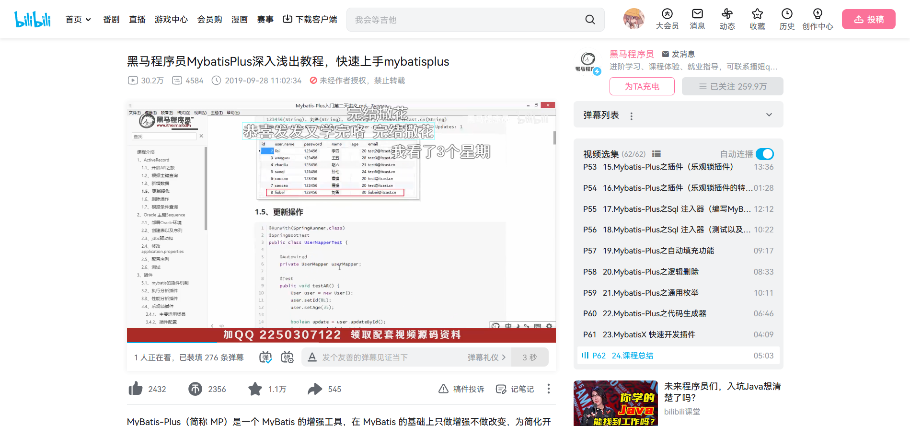

2023年4月19日16:00发发我呀开始学习mybatis-plus咯

# 课程介绍 Mybatis-Plus

- 了解 Mybatis-Plus
- 整合 Mybatis-Plus
- 通用CRUD
- Mybatis-Plus的配置
- 条件构造器

# day 01

# 1 了解 Mybatis-Plus

## 1.1 Mybatis-Plus 介绍

- MyBatis-Plus（简称 MP）是一个 MyBatis 的增强工具，在 MyBatis 的基础上只做增强不做改变，为简化开发提高效率而生。
- 官网：https://mybatis.plus/或https://baomidou.com/


## 1.2 代码及文档

- 文档地址：https://mybatis.plus/guide/
- 代码地址：https://github.com/baomidou/mybatis-plus

## 1.3 特性

- 无侵入：只做增强不做改变，引入它不会对现有工程产生影响，如丝般顺滑
- 损耗小：启动即会自动注入基本 CURD，性能基本无损耗，直接面向对象操作
- 强大的 CRUD 操作：内置通用 Mapper、通用 Service，仅仅通过少量配置即可实现单表大部分 CRUD 操作更有强大的条件构造器，满足各类使用需求
- 支持 Lambda 形式调用：通过 Lambda 表达式，方便的编写各类查询条件，无需再担心字段写错支持多种数据库: 支持 MySQL、MariaDB、Oracle、DB2、H2、HSQL、SQLite、 PostgreSQLServer2005、SQLServer 等多种数据库
- 支持主键自动生成:支持多达 4 种主键策略（内含分布式唯id 生成器-Sequene），可自由配置，完美解决主键问题
- 支持XML 热加载：Mapper 对应的 XML 支持热加载，对于简单的 CRUD 操作，甚至可以无XML 启动
- 支持ActiveRecord 模式：支持 AtiveRecord 形式调用，实体类只需继承 Model 类即可进行强大的 CRUD操作
- 支持自定义全局通用操作：支持全局通用方法注入（Write once, use anywhere）
- 支持关键词自动转义：支持数据库关键词（order、key......）自动转义，还自定义关键词
- 内置代码生成器：采用代码或者 Maven 插件可快速生成 Mapper 、Model、Service 、Controller 层代码，支持模板引擎，更有超多自定义配置等您来使用
- 内置分页插件：基于 MyBatis 物理分页，开发者无需关心具体操作，配置好插件之后，写分页等同于普通 List询
- 内置性能分析插件：可输出 SQL 语句以及其执行时间，建议开发测试时启用该功能，能快速揪出慢查询
- 内置全局拦截插件：提供全表 delete 、 update 操作智能分析阻断，也可自定义拦截规则，预防误操作

## 1.4 架构


## 1.5 作者

- Mybatis-Plus 是由 baomidou（苞米豆）组织开发并且开源的，目前该组织大概有30人左右
- 码云地址: https://gitee.com/organizations/baomidou

# 2 快速开始

对于 Mybatis 整合 MP 有常常有三种用法，分别是 Mybatis+MP、Spring+Mybatis+MP、SpringBoot+Mybatis+MP

## 2.1 创建数据库及表

```sql
-- 创建测试表
CREATE TABLE `tb_user` (
    `id` bigint(20) NOT NULL AUTO_INCREMENT COMMENT '主键ID',
    `user_name` varchar(20) NOT NULL COMMENT '用户名',
    `password` varchar(20) NOT NULL COMMENT '密码',
    `name` varchar(30) DEFAULT NULL COMMENT '姓名',
    `age` int(11) DEFAULT NULL COMMENT '年龄',
    `email` varchar(50) DEFAULT NULL COMMENT '邮箱',
PRIMARY KEY (`id`)
) ENGINE=InnoDB AUTO_INCREMENT=1 DEFAULT CHARSET=utf8;

-- 插入测试数据
INSERT INTO `tb_user` (`id`, `user_name`, `password`, `name`, `age`, `email`) VALUES ('1', 'zhangsan', '123456', '张三', '18', 'test1@itcast.cn');
INSERT INTO `tb_user` (`id`, `user_name`, `password`, `name`, `age`, `email`) VALUES ('2', 'lisi', '123456', '李四', '20', 'test2@itcast.cn');
INSERT INTO `tb_user` (`id`, `user_name`, `password`, `name`, `age`, `email`) VALUES ('3', 'wangwu', '123456', '王五', '28', 'test3@itcast.cn');
INSERT INTO `tb_user` (`id`, `user_name`, `password`, `name`, `age`, `email`) VALUES ('4', 'zhaoliu', '123456', '赵六', '21', 'test4@itcast.cn');
INSERT INTO `tb_user` (`id`, `user_name`, `password`, `name`, `age`, `email`) VALUES ('5', 'sunqi', '123456', '孙七', '24', 'test5@itcast.cn');
```

## 2.2 搭环境

logf4

```properties
log4f.rootLogger=DEBUG,A1

log4j.appender.A1=org.apache.log4j.ConsoleAppender
log4j.appender.A1.layout=org.apache.log4j.PatternLayout
log4j.appender.Al.layout.ConversionPattern=[%t] [%c]-[%p] %m%n
```

## 2.3 Mybatis + MP

### 2.3.1 Mybatis 实现查询 User

- 第一步：创建 mybatis-config.xml 配置文件

```xml
<?xml version="1.0" encoding="UTF-8" ?>
<!DOCTYPE configuration
        PUBLIC "-//mybatis.org//DTD Config 3.0//EN"
        "http://mybatis.org/dtd/mybatis-3-config.dtd">
<configuration>
    <settings>
        <!--    开启大驼峰命名法转换    -->
        <setting name="mapUnderscoreToCamelCase" value="true"/>
    </settings>
    <environments default="development">
        <environment id="development">
            <transactionManager type="JDBC"/>
            <dataSource type="POOLED">
                <property name="driver" value="com.mysql.cj.jdbc.Driver"/>
                <property name="url" value="jdbc:mysql://127.0.0.1:3306/mp?
useUnicode=true&amp;characterEncoding=utf8&amp;autoReconnect=true&amp;allowMultiQuerie
s=true&amp;useSSL=false"/>
                <property name="username" value="root"/>
                <property name="password" value="555555s"/>
            </dataSource>
        </environment>
    </environments>
    <mappers>
        <mapper resource="UserMapper.xml"/>
    </mappers>
</configuration>
```

- 第二步：编写 User 实体对象

```java
import lombok.AllArgsConstructor;
import lombok.Data;
import lombok.NoArgsConstructor;

@Data
@AllArgsConstructor
@NoArgsConstructor
public class User {

    private Long id;
    private String userName;
    private String name;
    private Integer age;
    private String email;
}
```

- 第三步：编写 UserMapper 接口

```java
public interface UserMapper {
    public List<User> findAll();
}
```

- 第四步：编写 UserMapper.xml 文件

```xml
<?xml version="1.0" encoding="UTF-8" ?>
<!DOCTYPE mapper
        PUBLIC "-//mybatis.org//DTD Mapper 3.0//EN"
        "http://mybatis.org/dtd/mybatis-3-mapper.dtd">
<mapper namespace="com.itheima.mp.simple.mapper.UserMapper">
    <select id="findAll" resultType="com.itheima.mp.simple.pojo.User">
        select * from tb_user
    </select>
</mapper>
```

- 第五步：测试

```java
import com.itheima.mp.simple.mapper.UserMapper;
import com.itheima.mp.simple.pojo.User;
import org.apache.ibatis.io.Resources;
import org.apache.ibatis.session.SqlSession;
import org.apache.ibatis.session.SqlSessionFactory;
import org.apache.ibatis.session.SqlSessionFactoryBuilder;
import org.junit.Test;

import java.io.IOException;
import java.io.InputStream;
import java.util.List;

public class TestMybatis {
    @Test
    public void testFindAll() throws IOException {
        // 1. 读取 mybatis 的核心配置文件(mybatis-config.xml)
        String config = "mybatis-config.xml";
        InputStream inputStream = Resources.getResourceAsStream(config);

        // 2. 通过配置信息获取一个 SqlSessionFactory 工厂对象
        SqlSessionFactory sqlSessionFactory = new SqlSessionFactoryBuilder().build(inputStream);

        // 3. 通过工厂获取一个 SqlSession 对象
        SqlSession sqlSession = sqlSessionFactory.openSession();

        // 4. 找到要执行的 sql 语句并执行 sql 语句
        UserMapper userMapper = sqlSession.getMapper(UserMapper.class);
        List<User> users = userMapper.findAll();

        // 5. 输出结果
        for (User user : users) {
            System.out.println(user);
        }
    }
}

```

### 2.3.2 Mybatis + MP 实现查询 User

- 第一步：将 UserMapper 继承 BaseMapper，将拥有了 BaseMapper 中的所有方法

```java
public interface UserMapper extends BaseMapper<User> {
    public List<User> findAll();
}
```

- 表名映射

```java
@Data
@AllArgsConstructor
@NoArgsConstructor
@TableName("tb_user")  // 表名进行映射
public class User {
    private Long id;
    private String userName;
    ...
}
```

- 第二步：使用 MP 中的 MybatisSglSessionFactoryBuilder 进程构建

```java
import com.baomidou.mybatisplus.core.MybatisSqlSessionFactoryBuilder;
import com.itheima.mp.simple.mapper.UserMapper;
import com.itheima.mp.simple.pojo.User;
import org.apache.ibatis.io.Resources;
import org.apache.ibatis.session.SqlSession;
import org.apache.ibatis.session.SqlSessionFactory;
import org.junit.Test;

import java.io.IOException;
import java.io.InputStream;
import java.util.List;

public class TestMybatisPlus {
    @Test
    public void testFindAll() throws IOException {
        // 1. 读取 mybatis 的核心配置文件(mybatis-config.xml)
        String config = "mybatis-config.xml";
        InputStream inputStream = Resources.getResourceAsStream(config);

        // 2. 通过配置信息获取一个 SqlSessionFactory 工厂对象
        // 使用 mybatis plus 提供的 MybatisSqlSessionFactoryBuilder 进行构建 实现 mybatis 和插件的整合
        SqlSessionFactory sqlSessionFactory = new MybatisSqlSessionFactoryBuilder().build(inputStream);

        // 3. 通过工厂获取一个 SqlSession 对象
        SqlSession sqlSession = sqlSessionFactory.openSession();

        // 4. 找到要执行的 sql 语句并执行 sql 语句
        UserMapper userMapper = sqlSession.getMapper(UserMapper.class);
        // List<User> users = userMapper.findAll();

        // 使用 mybatis 提供的方法
        List<User> users = userMapper.selectList(null);

        // 5. 输出结果
        for (User user : users) {
            System.out.println(user);
        }
    }
}
```

##  2.4 Spring + Mybatis + MP

引入了Spring框架，数据源、构建等工作就交给了 Spring 管理

## 2.5 SpringBoot + Mybatis + Mp

使用 SpringBoot 将进一步的简化 MP 的整合，需要注意的是，由于使用 SpringBoot 需要继承 parent，所以需要重新创
建工程，并不是创建子 Module

# 3 通用 CRUD

## 3.1 插入

### 3.1.1 id 增长策略

```java
package com.baomidou.mybatisplus.annotation;
import lombok.Getter;
/**
* 生成ID类型枚举类
*
* @author hubin
* @since 2015-11-10
*/
@Getter
public enum IdType {
    /**
    * 数据库ID自增
    */
    AUTO(0),
    
    /**
    * 该类型为未设置主键类型
    */
    NONE(1),
    
    /**
    * 用户输入ID
    * 该类型可以通过自己注册自动填充插件进行填充
    */
    INPUT(2),
    
    /* 以下3种类型、只有当插入对象ID 为空，才自动填充。 */
    /**
    * 全局唯一ID (idWorker)
    */
    ID_WORKER(3),
    
    /**
    * 全局唯一ID (UUID)
    */
    UUID(4),

    /**
    * 字符串全局唯一ID (idWorker 的字符串表示)
    */
    ID_WORKER_STR(5);
    
    private final int key;
    
    IdType(int key) {
    	this.key = key;
    }
}
```

### 3.1.2 修改 User 的 id 自增

```java
@TableName("tb_user")
@Data
@AllArgsConstructor
@NoArgsConstructor
public class User {
    // 设置 id 模式是 auto 自增
    @TableId(type = IdType.AUTO)
    private Long id;
    private String userName ;
    ...
}
```

### 3.1.3 插入代码

```java
@Test
public void testInsert() {
    User user = new User(null, "fafa", "123456", "发发", 18, "136@163.com");
    int result = userMapper.insert(user);
    log.info("插入{}行数据：{}", result, user);
    // 自增长的 id 会回填到 user 里面 发发我呀 大为震惊
    log.info("id为{}", user.getId());
}
```

### 3.1.4 @TableField 注解

- 在 MP 中通过`@TableField`注解可以指定字段的一些属性，常常解决的问题有2个
  - 对象中的属性名和字段名不一致的问题（非驼峰）：驼峰会自动转换
  - 对象中的属性字段在表中不存在的问题：不写该值到数据库
  - 安全问题：不查该值

```java
public class User {
    // 设置 id 模式是 auto 自增
    @TableId(type = IdType.AUTO)
    private Long id;
    private String userName ;

    // 查询时不查该值
    @TableField(select = false)
    private String password;
    private String name;
    private Integer age;

    // 指定数据库中的字段名 进行映射对应
    @TableField(value = "email")
    private String mail;

    // 数据表中不存在该字段 就不会报错: Unknown column 'address' in 'field list'
    @TableField(exist = false)
    private String address;
}
```

## 3.2 更新

### 3.2.1 根据 id 更新

```java
/**
* 根据 ID 修改
*
* @param entity 实体对象
*/
int updateById(@Param(Constants.ENTITY) T entity);
```

```java
@Test
public void testUpdateById() {
    User user = new User();
    user.setId(5L);  // 条件
    user.setName("fafa");  // 更新这个值
    int result = userMapper.updateById(user);
    log.info("修改{}行数据：{}", result, user);
}
```

### 3.2.2 根据条件更新

```java
/**
* 根据 whereEntity 条件，更新记录
*
* @param entity 实体对象 (set 条件值,可以为 null)
* @param updateWrapper 实体对象封装操作类（可以为 null,里面的 entity 用于生成 where 语句）
*/
int update(@Param(Constants.ENTITY) T entity, @Param(Constants.WRAPPER) Wrapper<T> updateWrapper);
```

- 更新方法一

```java
@Test
public void testUpdate1() {
    // 准备更新的数据
    User user = new User();
    user.setAge(20);
    user.setPassword("666666");

    // 更新条件
    QueryWrapper<User> wrapper = new QueryWrapper<>();
    wrapper.eq("user_name", "zhangsan");  // 匹配 user_name 为 zhangsan 的用户

    int result = userMapper.update(user, wrapper);
    log.info("修改{}行数据：{}", result, user);
}
```

- 更新方法二

```java
@Test
public void testUpdate2() {
    // 更新字段 + 条件
    UpdateWrapper<User> wrapper = new UpdateWrapper<>();
    wrapper.eq("user_name", "zhangsan").set("name", "fafa").set("password", "99999");

    int result = userMapper.update(null, wrapper);
    log.info("修改{}行数据", result);
}
```

## 3.3 删除

### 3.3.1 根据 id 删除

```java
/**
* 根据 ID 删除
*
* @param id 主键ID
*/
int deleteById(Serializable id);
```

```java
@Test
public void testDeleteById() {
    int result = userMapper.deleteById(2L);
    log.info("删除了{}条数据", result);
}
```

### 3.3.2 根据 map 删除

```java
/**
* 根据 columnMap 条件，删除记录
*
* @param columnMap 表字段 map 对象
*/
int deleteByMap(@Param(Constants.COLUMN_MAP) Map<String, Object> columnMap);
```

```java
@Test
public void testDeleteByMap() {
    Map<String, Object> map = new HashMap<>();
    map.put("user_name", "wangwu");
    map.put("password", "123456");

    // 根据 map 删除 多条件之间是 and
    int result = userMapper.deleteByMap(map);
    log.info("删除了{}条数据", result);
}
```

### 3.3.3 delete

```java
/**
* 根据 entity 条件，删除记录
*
* @param wrapper 实体对象封装操作类（可以为 null）
*/
int delete(@Param(Constants.WRAPPER) Wrapper<T> wrapper);
```

- 方法一

```java
@Test
public void testDelete1() {
    QueryWrapper<User> wrapper = new QueryWrapper<>();
    wrapper.eq("user_name", "lisi")
            .eq("password", "123456");

    int result = userMapper.delete(wrapper);
    log.info("删除了{}条数据", result);
}
```

- 方法二：基于面向对象的 更推荐

```java
@Test
public void testDelete2() {
    User user = new User();
    user.setPassword("123456");
    user.setName("zhaoliu");

    QueryWrapper<User> wrapper = new QueryWrapper<>(user);

    int result = userMapper.delete(wrapper);
    log.info("删除了{}条数据", result);
}
```

### 3.3.4  根据 id 批量删除

```java
/**
* 删除（根据 ID 批量删除）
*
* @param idList 主键 ID 列表(不能为 null 以及 empty)
*/
int deleteBatchIds(@Param(Constants.COLLECTION) Collection<? extends Serializable> idList);
```

```java
@Test
public void testDeleteBatchIds() {
    // 批量删除
    int result = userMapper.deleteBatchIds(Arrays.asList(1, 2, 3));
    log.info("删除了{}条数据", result);
}
```

## 3.4 查询

### 3.4.1 根据 id 查询

```java
/**
* 根据 ID 查询
*
* @param id 主键ID
*/
T selectById(Serializable id);
```

```java
@Test
public void testSelectById() {
    User result = userMapper.selectById(4L);
    log.info("查询到了 {}", result);
}
```

### 3.4.2 根据 id 批量查询

```java
/**
* 查询（根据 ID 批量查询）
*
* @param idList 主键 ID 列表（不能为 null 以及 empty）
*/
List<T> selectBatchIds(@Param(Constants.COLLECTION) Collection<? extends Serializable> idList);
```

```java
@Test
public void testSelectBatchByIds() {
    List<User> users = userMapper.selectBatchIds(Arrays.asList(1, 2, 3, 4, 5, 6));
    for (User user : users) {
        log.info("查询到了: {}", user);
    }
}
```

### 3.4.3 查询一条

```java
/**
* 根据 entity 条件，查询一条记录
*
* @param queryWrapper 实体对象封装操作类（可以为 null）
*/
T selectOne(@Param(Constants.WRAPPER) Wrapper<T> queryWrapper);
```

```java
@Test
public void testSelectOne() {
    QueryWrapper<User> wrapper = new QueryWrapper<>();
    wrapper.eq("user_name", "fafa").eq("id", "1648964096160178183");
    // 查询数据超过 1 条会超出异常
    // 1 条或 null 就不会报错
    User user = userMapper.selectOne(wrapper);
    log.info("查询到一条结果为：{}", user);
}
```

### 3.4.4 计数

```java
/**
* 根据 Wrapper 条件，查询总记录数
*
* @param queryWrapper 实体对象封装操作类（可以为 null）
*/
Integer selectCount(@Param(Constants.WRAPPER) Wrapper<T> queryWrapper);
```

```java
@Test
public void testSelectCount() {
    QueryWrapper<User> wrapper = new QueryWrapper<>();
    // 条件 age 大于 20 的用户
    wrapper.gt("age", 20);
    Integer count = userMapper.selectCount(wrapper);
    log.info("查询到 {} 条数据", count);
}
```

### 3.4.5 selectList

```java
/**
* 根据 entity 条件，查询全部记录
*
* @param queryWrapper 实体对象封装操作类（可以为 null）
*/
List<T> selectList(@Param(Constants.WRAPPER) Wrapper<T> queryWrapper);
```

```java
@Test
public void testSelectList() {
    QueryWrapper<User> wrapper = new QueryWrapper<>();
    wrapper.like("email", "@163.com");
    List<User> users = userMapper.selectList(wrapper);
    for (User user : users) {
        System.out.println(user);
    }
}
```

### 3.4.6 selectPage 分页查询

```java
/**
* 根据 entity 条件，查询全部记录（并翻页）
*
* @param page 分页查询条件（可以为 RowBounds.DEFAULT）
* @param queryWrapper 实体对象封装操作类（可以为 null）
*/
IPage<T> selectPage(IPage<T> page, @Param(Constants.WRAPPER) Wrapper<T> queryWrapper);
```

- 配置分页插件

```java
import com.baomidou.mybatisplus.extension.plugins.PaginationInterceptor;
import org.mybatis.spring.annotation.MapperScan;
import org.springframework.context.annotation.Bean;
import org.springframework.context.annotation.Configuration;

@MapperScan("com.itheima.mapper")
@Configuration
public class MybatisPlusConfig {

    // 配置分页插件
    @Bean
    public PaginationInterceptor paginationInterceptor() {
        return new PaginationInterceptor();
    }
}
```

- 分页代码

```java
@Test
public void testSelectPage() {
    Page<User> page = new Page<>(1, 1);  // 查询第一页 查询 2 条数据
    QueryWrapper<User> wrapper = new QueryWrapper<>();
    wrapper.like("email", "@163.com");

    Page<User> iPager = userMapper.selectPage(page, wrapper);

    log.info("数据总条数：{}", iPager.getTotal());
    log.info("数据总页数：{}", iPager.getPages());
    log.info("当前页：{}", iPager.getCurrent());

    List<User> records = iPager.getRecords();
    for (User record : records) {
        log.info("{}", record);
    }
}
```

## 3.5 SQL 注入原理

前面我们已经知道，MP 在启动后会将`BaseMapper`中的一系列的方法注册到`meppedStatements`中，那么究竟是如何注入的呢？流程又是怎么样的？下面我们将一起来分析下。

在 MP 中，`ISqlInjector`负责 SQL 的注入工作，它是一个接口，`AbstractSqlInjector`是它的实现类，实现关系如下：


在`AbstractSqlInjector`中，主要是由`inspectInject()`方法进行注入的，如下：

```java
@Override
public void inspectInject(MapperBuilderAssistant builderAssistant, Class<?> mapperClass) {
    Class<?> modelClass = extractModelClass(mapperClass);
    if (modelClass != null) {
        String className = mapperClass.toString();
        Set<String> mapperRegistryCache = GlobalConfigUtils.getMapperRegistryCache(builderAssistant.getConfiguration());
        if (!mapperRegistryCache.contains(className)) {
        	List<AbstractMethod> methodList = this.getMethodList();
            if (CollectionUtils.isNotEmpty(methodList)) {
                TableInfo tableInfo = TableInfoHelper.initTableInfo(builderAssistant, modelClass);
                // 循环注入自定义方法
                methodList.forEach(m -> m.inject(builderAssistant, mapperClass, modelClass, tableInfo));
            } else {
                logger.debug(mapperClass.toString() + ", No effective injection method was found.");
            }
        	mapperRegistryCache.add(className);
        }
    }
}
```

在实现方法中， `methodList.forEach(m -> m.inject(builderAssistant, mapperClass, modelClass, tableInfo));` 是关键，循环遍历方法，进行注入。

最终调用抽象方法`injectMappedStatement`进行真正的注入：

```java
/**
* 注入自定义 MappedStatement
*
* @param mapperClass mapper 接口
* @param modelClass mapper 泛型
* @param tableInfo 数据库表反射信息
* @return MappedStatement
*/
public abstract MappedStatement injectMappedStatement(Class<?> mapperClass, Class<?> modelClass, TableInfo tableInfo);
```

该方法的实现有很多，以`SelectById`为例查看：

```java
public class SelectById extends AbstractMethod {
    @Override
    public MappedStatement injectMappedStatement(Class<?> mapperClass, Class<?> modelClass, TableInfo tableInfo) {
        SqlMethod sqlMethod = SqlMethod.LOGIC_SELECT_BY_ID;
        SqlSource sqlSource = new RawSqlSource(configuration,
        String.format(sqlMethod.getSql(),sqlSelectColumns(tableInfo, false),tableInfo.getTableName(), tableInfo.getKeyColumn(),tableInfo.getKeyProperty(),tableInfo.getLogicDeleteSql(true, false)), Object.class);
        return this.addSelectMappedStatement(mapperClass, sqlMethod.getMethod(), sqlSource, modelClass, tableInfo);
    }
}
```

可以看到，生成了`SqlSource`对象，再将SQL通过`addSelectMappedStatement`方法添加到`meppedStatements`中。

# 4 配置

在 MP 中有大量的配置，其中有一部分是 Mybatis 原生的配置，另一部分是 MP 的配置，详情：https://mybatis.plus/config/

## 4.1 基本配置

### 4.1.1 configLocation

MyBatis 配置文件位置，如果您有单独的 MyBatis 配置，请将其路径配置到 configLocation 中。 MyBatis Configuration 的具体内容请参考 MyBatis 官方文档

- Spring Boot

  ```properties
  mybatis-plus.config-location = classpath:mybatis-config.xml
  ```

- Spring MVC

  ```xml
  <bean id="sqlSessionFactory" class="com.baomidou.mybatisplus.extension.spring.MybatisSqlSessionFactoryBean">
  	<property name="configLocation" value="classpath:mybatis-config.xml"/>
  </bean>
  ```

### 4.1.2 mapperLocations

MyBatis Mapper 所对应的 XML 文件位置，如果您在 Mapper 中有自定义方法（XML 中有自定义实现），需要进行该配置，告诉 Mapper 所对应的 XML 文件位置。

- Spring Boot

  ```properties
  mybatis-plus.mapper-locations = classpath*: mybatis/*.xml
  ```

- Spring MVC

  ```xml
  <bean id="sqlSessionFactory" class="com.baomidou.mybatisplus.extension.spring.MybatisSqlSessionFactoryBean">
  	<property name="mapperLocations" value="classpath*:mybatis/*.xml"/>
  </bean>
  ```

### 4.1.3 typeAliasesPackage

MyBaits 别名包扫描路径，通过该属性可以给包中的类注册别名，注册后在 Mapper 对应的 XML 文件中可以直接使用类名，而不用使用全限定的类名（即 XML 中调用的时候不用包含包名）。

- Spring Boot

  ```properties
  mybatis-plus.type-aliases-package = cn.itcast.mp.pojo
  ```

- Spring MVC

  ```xml
  <bean id="sqlSessionFactory" class="com.baomidou.mybatisplus.extension.spring.MybatisSqlSessionFactoryBean">
      <property name="typeAliasesPackage" value="com.baomidou.mybatisplus.samples.quickstart.entity"/>
  </bean>
  ```

## 4.2 进阶配置

本部分（Configuration）的配置大都为 MyBatis 原生支持的配置，这意味着您可以通过 MyBatis XML 配置文件的形
式进行配置。

### 4.2.1 mapUnderscoreToCamelCase

- 类型：`boolean`
- 默认值：`true`

是否开启自动驼峰命名规则（camel case）映射，即从经典数据库列名 A_COLUMN（下划线命名）到经典 Java 属性名`aColumn`（驼峰命名） 的类似映射。

> 注意：此属性在 MyBatis 中原默认值为`false`，在 MyBatis-Plus 中，此属性也将用于生成最终的 SQL 的`select body`如果您的数据库命名符合规则无需使用`@TableField`注解指定数据库字段名

SpringBoot

```properties
#关闭自动驼峰映射，该参数不能和 mybatis-plus.config-location 同时存在
mybatis-plus.configuration.map-underscore-to-camel-case=false
```

### 4.2.2 cacheEnabled

- 类型：`boolean`
- 默认值：`true`

全局地开启或关闭配置文件中的所有映射器已经配置的任何缓存，默认为`true`。

```properties
mybatis-plus.configuration.cache-enabled = false
```

## 4.3 DB 策略配置

### 4.3.1 idType

- 类型：`com.baomidou.mybatisplus.annotation.IdType`
- 默认值：`ID_WORKER`

全局默认主键类型，设置后，即可省略实体对象中的`@TableId(type = IdType.AUTO)`配置。

- SpringBoot

  ```properties
  mybatis-plus.global-config.db-config.id-type = auto
  ```

- SpringMVC

  ```xml
  <!--这里使用MP提供的sqlSessionFactory，完成了Spring与MP的整合-->
  <bean id="sqlSessionFactory" class="com.baomidou.mybatisplus.extension.spring.MybatisSqlSessionFactoryBean">
      <property name="dataSource" ref="dataSource"/>
      <property name="globalConfig">
          <bean class="com.baomidou.mybatisplus.core.config.GlobalConfig">
              <property name="dbConfig">
                  <bean class="com.baomidou.mybatisplus.core.config.GlobalConfig$DbConfig">
               	   <property name="idType" value="AUTO"/>
                  </bean>
              </property>
          </bean>
      </property>
  </bean>
  ```

### 4.3.2 tablePrefix

- 类型：`String`
- 默认值：`null`

MP 默认是类名首字母小写，去数据库里面查。如果查不到，则需要`@TableName()`进行手动的映射。如果是表名前缀，全局配置后则可省略`@TableName()`配置。

- SpringBoot

  ```properties
  # 指定表名前缀为 tb_
  mybatis-plus.global-config.db-config.table-prefix = tb_
  ```

- SpringMVC

  ```xml
  <bean id="sqlSessionFactory" class="com.baomidou.mybatisplus.extension.spring.MybatisSqlSessionFactoryBean">
      <property name="dataSource" ref="dataSource"/>
      <property name="globalConfig">
          <bean class="com.baomidou.mybatisplus.core.config.GlobalConfig">
              <property name="dbConfig">
                  <bean class="com.baomidou.mybatisplus.core.config.GlobalConfig$DbConfig">
                      <property name="idType" value="AUTO"/>
                      <property name="tablePrefix" value="tb_"/>
                  </bean>
              </property>
          </bean>
      </property>
  </bean>
  ```

# 5 条件构造器

在 MP 中，Wrapper接口的实现类关系如下 :


可以看到，`AbstractWrapper`和`AbstractChainWrapper`是重点实现，接下来我们重点学习`AbstractWrapper`以及其子类。

> 说明：`QueryWrapper`（`LambdaQueryWrappe`）和`UpdateWrapper`（`LambdaUpdateWrapper`）的父类，用于生成 SQL 的 where 条件，`entity`属性也用于生成 SQL 的`where`条件。注意：`entity`生成的`where`条件与使用各个 api 生成的 where 条件没有任何关联行为。
>
> 官网文档地址：https://mybatis.plus/guide/wrapper.html


## 5.1 allEq

### 5.1.1 说明

```java
allEq(Map<R, V> params)
allEq(Map<R, V> params, boolean null2IsNull)
allEq(boolean condition, Map<R, V> params, boolean null2IsNull)
```

- 参数说明

  - `params`：`key`为数据库字段名，`value`为字段值

  - `null2IsNull`：为`true`则在`map`的`value`为`null`时调用`isNull`方法，为`false`时则忽略`value`为`null`的

    - 例1

      ```java
      allEq({id:1, name: "老王", age: null})
      ```

      ```sql
      id = 1 and name = '老王' and age is null
      ```

    - 例2

      ```java
      allEq({id: 1, name: "老王", age: null}, false)
      ```

      ```sql
      id = 1 and name = '老王'
      ```

  - `filter` 过滤函数，是否允许字段传入比对条件中`params`与`null2IsNull`

    - 例1

      ```java
      allEq((k,v) -> k.indexOf("a") > 0, {id: 1, name: "老王", age: null})
      ```

      ```sql
      name = '老王' and age is null
      ```

    - 例2

      ```java
      allEq((k,v) -> k.indexOf("a") > 0, {id: 1, name: "老王", age: null}, false)
      ```

      ```sql
      name ='老王'
      ```

### 5.1.2 代码

```java
@Test
public void testAllEq() {
    Map<String, Object> map = new HashMap<>();
    map.put("user_name", "fafa");
    map.put("email", "136.com");
    map.put("password", null);

    QueryWrapper<User> wrapper = new QueryWrapper<>();
    // 用法一
    wrapper.allEq(map);

    // 用法二
    // false: null 值不作为条件 is null
    wrapper.allEq(map, false);

    // 用法
    // map 中的键值对 是否作为条件 取决于箭头函数返回的结果是 true 还是 false
    wrapper.allEq((k, v) -> (k.equals("age") || k.equals("id")), map);

    List<User> users = userMapper.selectList(wrapper);
    for (User user : users) {
        System.out.println(user);
    }
}
```

## 5.2 基本比较操作

|     符号     |                    含义                     |
| :----------: | :-----------------------------------------: |
|     `eq`     |                   等于`=`                   |
|     `ne`     |                 不等于`<>`                  |
|     `gt`     |                   大于`>`                   |
|     `ge`     |                大于等于`>=`                 |
|     `lt`     |                   小于`<`                   |
|     `le`     |                小于等于`<=`                 |
|  `between`   |            `BETWEEN 值1 AND 值2`            |
| `notBetween` |          `NOT BETWEEN 值1 AND 值2`          |
|     `in`     | `字段 IN (value.get(0), value.get(1), ...)` |

```java
@Test
public void testEq() {
    QueryWrapper<User> wrapper = new QueryWrapper<>();
    wrapper.eq("password", "123456")
            .gt("age", 18)
            .in("name", "张三", "发发");
    List<User> users = userMapper.selectList(wrapper);
    for (User user : users) {
        System.out.println(user);
    }
}
```

## 5.3 模糊查询

|    符号     |       含义        |         举个栗子          |       SQL 代码       |
| :---------: | :---------------: | :-----------------------: | :------------------: |
|   `like`    |   `LIKE '%值%'`   |   `like("name", "王")`    |  `name like '%王%'`  |
|  `notLike`  | `NOT LIKE '%值%'` |   notLike("name", "王")   | name not like '%王%' |
| `likeLeft`  |   `LIKE '%值'`    |  likeLeft("name", "王")   |   name like '%王'    |
| `likeRight` |   `LIKE '值%'`    | `likeRight("name", "王")` |   name like '王%'    |

```java
@Test
public void testLike() {
    QueryWrapper<User> wrapper = new QueryWrapper<>();
    wrapper.like("password", "345")
            .likeRight("name", "张");
    List<User> users = userMapper.selectList(wrapper);
    for (User user : users) {
        System.out.println(user);
    }
}
```

## 5.4 排序

|     符号      |           含义            |              举个栗子               |           SQL 代码           |
| :-----------: | :-----------------------: | :---------------------------------: | :--------------------------: |
|   `orderBy`   |   `ORDER BY 字段, ...`    | `orderBy(true, true, "id", "name")` | `order by id ASC, name ASC`  |
| `orderByAsc`  | `ORDER BY 字段, ... ASC`  |     `orderByAsc("id", "name")`      |  `order by id ASC,name ASC`  |
| `orderByDesc` | `ORDER BY 字段, ... DESC` |     `orderByDesc("id", "name")`     | `order by id DESC,name DESC` |

```java
@Test
public void testOrderByAgeDesc() {
    QueryWrapper<User> wrapper = new QueryWrapper<>();
    wrapper.orderByDesc("age");
    List<User> users = userMapper.selectList(wrapper);
    for (User user : users) {
        System.out.println(user);
    }
}
```

## 5.5 逻辑查询

| 符号  |   含义    |                           举个栗子                           |
| :---: | :-------: | :----------------------------------------------------------: |
| `or`  | 拼接`OR`  | 主动调用`or`，表示紧接着下一个方法不是用`and`连接（不调用`or`则默认为使用`and`连接） |
| `and` | `AND`嵌套 | `and(i -> i.eq("name", "李白").ne("status", "活着"))` 的 SQL 为 `and(name = '李白' and status <> '活着')` |

```java
@Test
public void testOr(){
    QueryWrapper<User> wrapper = new QueryWrapper<>();
    wrapper.eq("name", "fafa")
            .or().eq("age", 20);
    List<User> users = userMapper.selectList(wrapper);
    for (User user : users) {
        log.info("{}", user);
    }
}
```

## 5.6 select

在 MP 查询中，默认查询所有的字段，如果有需要也可以通过`select`方法进行指定字段

```java
@Test
public void testSelect() {
    QueryWrapper<User> wrapper = new QueryWrapper<>();
    wrapper.eq("name", "fafa")
            .or()
            .eq("age", 20)
            .likeLeft("email", "@163.com")
            .select("id", "password", "age");
    List<User> users = userMapper.selectList(wrapper);
    for (User user : users) {
        log.info("{}", user);
    }
}
```

# day02

# 1 ActiveRecord

ActiveRecord（简称AR）一直广受动态语言（PHP、Ruby 等）的喜爱，而 Java 作为准静态语言，对于 ActiveRecord 往往只能感叹其优雅，所以我们也在 AR 道路上进行了一定的探索，喜欢大家能够喜欢。

- 什么是ActiveRecord？

  ActiveRecord 也属于 ORM（对象关系映射）层，由 Rails 最早提出，遵循标准的 ORM 模型：表映射到记录，记录映射到对象，字段映射到对象属性。配合遵循的命名和配置惯例，能够很大程度的快速实现模型的操作，而且简洁易懂。

- ActiveRecord 的主要思想

  - 每一个数据库表对应创建一个类，类的每一个对象实例对应于数据库中表的一行记录；通常表的每个字段在类中都有相应的Field；
  - ActiveRecord 同时负责把自己持久化，在 ActiveRecord 中封装了对数据库的访问，即 CURD；
  - ActiveRecord 是一种领域模型（Domain Model），封装了部分业务逻辑

## 1.1 开启 AR 之旅

在 MP 中，开启 AR 非常简单，只需要将实体对象继承`Model`即可

```java
public class User extends Model<User> {
    private Long id;
    private String userName;
    ...
}
```

## 1.2 根据主键查询

```java
@Test
public void testSelectById() {
    User user = new User();
    user.setId(4L);
    User user1 = user.selectById();
    log.info("{}", user1);
}
```

## 1.3 插入数据

```java

@Test
public void testInsert() {
    User user = new User();
    user.setName("fafa");
    user.setUserName("fafafafa");
    user.setAge(20);
    user.setPassword("555555s");
    user.setMail("54321@163.com");

    boolean bool = user.insert();
    log.info("插入数据 {}，是否成功 {}", user, bool);
}
```

## 1.4 更新数据

```java
@Test
public void testUpdate(){
    User user = new User();
    user.setId(4L);
    user.setAge(100);
    boolean bool = user.updateById();
    log.info("更新数据 {}，结果为 {}", user, bool);
}
```

## 1.5 删除数据

```java
@Test
public void testDelete() {
    User user = new User();
    user.setId(4L);
    boolean bool = user.deleteById();
    log.info("删除数据：{}，结果为 {}", user, bool);
}
```

## 1.6 查询数据

```java
@Test
public void testSelect() {
    User user = new User();
    QueryWrapper<User> wrapper = new QueryWrapper<>();
    wrapper.ge("id", 100);
    List<User> users = user.selectList(wrapper);

    for (User user1 : users) {
        log.info("{}", user1);
    }
}
```

# 2 Oracle 主键 Sequence

在 mysql 中，主键往往是自增长的，这样使用起来是比较方便的，如果使用的是 Oracle 数据库，那么就不能使用自增长了，就得使用Sequence 序列生成 id 值了。

## 2.1 部署 Oracle 环境

为了简化环境部署，这里使用 Docker 环境进行部署安装 Oracle

```dockerfile
#拉取镜像
docker pull sath89/oracle-12c

#创建容器
docker create --name oracle -p 1521:1521 sath89/oracle-12c

#启动
docker start oracle && docker logs -f oracle

#下面是启动过程
Database not initialized. Initializing database.
Starting tnslsnr
Look at the log file "/u01/app/oracle/cfgtoollogs/dbca/xe/xe.log" for further details.
Configuring Apex console
Database initialized. Please visit http://#containeer:8080/em
http://#containeer:8080/apex for extra configuration if needed
Starting web management console
PL/SQL procedure successfully completed.
Starting import from '/docker-entrypoint-initdb.d':
ls: cannot access /docker-entrypoint-initdb.d/*: No such file or directory
Import finished
Database ready to use. Enjoy! ;)

#通过用户名密码即可登录
用户名和密码为： system/oracle
```

## 2.2 创建表以及序列

```mysql
--创建表，表名以及字段名都要大写
CREATE TABLE "TB_USER" (
    "ID" NUMBER(20) VISIBLE NOT NULL ,
    "USER_NAME" VARCHAR2(255 BYTE) VISIBLE ,
    "PASSWORD" VARCHAR2(255 BYTE) VISIBLE ,
    "NAME" VARCHAR2(255 BYTE) VISIBLE ,
    "AGE" NUMBER(10) VISIBLE ,
    "EMAIL" VARCHAR2(255 BYTE) VISIBLE
)

--创建序列
CREATE SEQUENCE SEQ_USER START WITH 1 INCREMENT BY 1
```

## 2.3 jdbc 驱动包

由于版权原因，我们不能直接通过 maven 的中央仓库下载 oracle 数据库的jdbc驱动包，所以我们需要将驱动包安装到本地仓库。

```java
# ojdbc8.jar文件在资料中可以找到
mvn install:install-file -DgroupId=com.oracle -DartifactId=ojdbc8 -Dversion=12.1.0.1 -Dpackaging=jar -Dfile=ojdbc8.jar
```

安装完成后的坐标

```xml
<dependency>
    <groupId>com.oracle</groupId>
    <artifactId>ojdbc8</artifactId>
    <version>12.1.0.1</version>
</dependency>
```

## 2.4 修改 application.properties

对于 application.properties 的修改，需要修改2个位置，分别是：

```properties
# 数据库连接配置
spring.datasource.driver-class-name=oracle.jdbc.OracleDriver
spring.datasource.url=jdbc:oracle:thin:@192.168.31.81:1521:xe
spring.datasource.username=system
spring.datasource.password=oracle
# id生成策略
mybatis-plus.global-config.db-config.id-type=input
```

## 2.5 配置序列

使用 Oracle 的序列需要做2件事情

第一，需要配置 MP 的序列生成器到 Spring 容器

```java
package cn.itcast.mp;
import com.baomidou.mybatisplus.extension.incrementer.OracleKeyGenerator;
import com.baomidou.mybatisplus.extension.plugins.PaginationInterceptor;
import org.mybatis.spring.annotation.MapperScan;
import org.springframework.context.annotation.Bean;
import org.springframework.context.annotation.Configuration;

@Configuration
@MapperScan("cn.itcast.mp.mapper") //设置mapper接口的扫描包
public class MybatisPlusConfig {
    /**
    * 分页插件
    */
    @Bean
    public PaginationInterceptor paginationInterceptor() {
    	return new PaginationInterceptor();
    }
    
    /**
    * 序列生成器
    */
    @Bean
    public OracleKeyGenerator oracleKeyGenerator(){
    	return new OracleKeyGenerator();
    }
}
```

第二，在实体对象中指定序列的名称：

```java
@KeySequence(value = "SEQ_USER", clazz = Long.class)
public class User{
    ...
}
```

## 2.6 测试

```java
package cn.itcast.mp;
import cn.itcast.mp.mapper.UserMapper;
import cn.itcast.mp.pojo.User;
import org.junit.Test;
import org.junit.runner.RunWith;
import org.springframework.beans.factory.annotation.Autowired;
import org.springframework.boot.test.context.SpringBootTest;
import org.springframework.test.context.junit4.SpringRunner;
import java.util.List;

@RunWith(SpringRunner.class)
@SpringBootTest
public class UserMapperTest {
    
    @Autowired
    private UserMapper userMapper;
    
    @Test
    public void testInsert(){
        User user = new User();
        user.setAge(20);
        user.setEmail("test@itcast.cn");
        user.setName("曹操");
        user.setUserName("caocao");
        user.setPassword("123456");
        int result = this.userMapper.insert(user); //返回的result是受影响的行数，并不是自增
        后的id
        System.out.println("result = " + result);
        System.out.println(user.getId()); //自增后的id会回填到对象中
    }
    
    @Test
    public void testSelectById(){
        User user = this.userMapper.selectById(8L);
        System.out.println(user);
    }
}
```

# 3 插件

## 3.1 mybatis的插件机制

MyBatis 允许你在已映射语句执行过程中的某一点进行拦截调用。默认情况下，MyBatis 允许使用插件来拦截的方法调用包括

1. Executor (update, query, flushStatements, commit, rollback, getTransaction, close, isClosed)
2. ParameterHandler (getParameterObject, setParameters)
3. ResultSetHandler (handleResultSets, handleOutputParameters)
4. StatementHandler (prepare, parameterize, batch, update, query)

我们看到了可以拦截 Executor 接口的部分方法，比如 update，query，commit，rollback 等方法，还有其他接口的一些方法等。总体概括为：

1. 拦截执行器的方法
2. 拦截参数的处理
3. 拦截结果集的处理
4. 拦截 Sql 语法构建的处理

- 拦截器示例：

```java
import org.apache.ibatis.mapping.MappedStatement;
import org.apache.ibatis.plugin.Interceptor;
import org.apache.ibatis.plugin.Intercepts;
import org.apache.ibatis.plugin.Invocation;
import org.apache.ibatis.plugin.Signature;

import java.util.Properties;
import java.util.concurrent.Executor;

@Intercepts({@Signature(
        type = Executor.class,  // 拦截的类型
        method = "update",  // 拦截 Executor 的 update 方法
        args = {
                MappedStatement.class,
                Object.class
        }
)})
public class MyInterceptor implements Interceptor {
    @Override
    public Object intercept(Invocation invocation) throws Throwable {
        // 拦截方法，具体的逻辑编写位置
        return null;
    }

    @Override
    public Object plugin(Object target) {
        // 创建 target 对象的代理对象，目的是将当前拦截器加入到该对象中
        return Interceptor.super.plugin(target);
    }

    @Override
    public void setProperties(Properties properties) {
        // 属性设置
        Interceptor.super.setProperties(properties);
    }
}
```

- 注入到 Spring 容器

```java
/**
* 自定义拦截器
*/
@Bean
public MyInterceptor myInterceptor(){
	return new MyInterceptor();
}
```

- 或者通过 xml 配置，mybatis-config.xml

```xml
<?xml version="1.0" encoding="UTF-8" ?>
<!DOCTYPE configuration
PUBLIC "-//mybatis.org//DTD Config 3.0//EN"
"http://mybatis.org/dtd/mybatis-3-config.dtd">
<configuration>
    <plugins>
	    <plugin interceptor="cn.itcast.mp.plugins.MyInterceptor"></plugin>
    </plugins>
</configuration>
```

## 3.2 执行分析插件

在 MP 中提供了对 SQL 执行的分析的插件，可用作阻断全表更新、删除的操作，注意：该插件仅适用于开发环境，不适用于生产环境。

SpringBoot 配置

```java
@Bean
public SqlExplainInterceptor sqlExplainInterceptor() {

    SqlExplainInterceptor sqlExplainInterceptor = new SqlExplainInterceptor();

    List<ISqlParser> list = new ArrayList<>();
    // 添加了一个 全表删除更新的阻断器
    list.add(new BlockAttackSqlParser());
    sqlExplainInterceptor.setSqlParserList(list);

    return sqlExplainInterceptor;
}
```

```java
@Test
public void testUpdateAll() {
    User user = new User();
    user.setAge(105);

    boolean bool = user.update(null);  // 全表更新
    log.info("{}", bool);
}
```

可以看到，当执行全表更新时，会抛出异常，这样有效防止了一些误操作。

## 3.3 性能分析插件

性能分析拦截器，用于输出每条 SQL 语句及其执行时间，可以设置最大执行时间，超过时间会抛出异常。该插件只用于开发环境，不建议生产环境使用。

### 3.3.1 已被移出

```xml
<?xml version="1.0" encoding="UTF-8" ?>
<!DOCTYPE configuration
PUBLIC "-//mybatis.org//DTD Config 3.0//EN"
"http://mybatis.org/dtd/mybatis-3-config.dtd">
<configuration>
    <plugins>
        <!-- SQL 执行性能分析，开发环境使用，线上不推荐。 -->
        <plugin interceptor="com.baomidou.mybatisplus.extension.plugins.PerformanceInterceptor">
            <!-- maxTime 指的是 sql 最大执行时长 此处为 100 毫秒 -->
            <property name="maxTime" value="100" />
            <!--SQL 是否格式化 默认 false -->
            <property name="format" value="true" />
        </plugin>
    </plugins>
</configuration>
```

### 3.3.1 使用 p6spy

- 依赖配置

```xml
<dependency>
    <groupId>p6spy</groupId>
    <artifactId>p6spy</artifactId>
    <version>3.9.0</version>
</dependency>
```

- 配置文件

```properties
spring.datasource.driver-class-name=com.p6spy.engine.spy.P6SpyDriver
spring.datasource.url=jdbc:p6spy:mysql://localhost:3306/mp
```

- spy.properties 配置文件

```properties
# 3.2.1 以上使用
modulelist=com.baomidou.mybatisplus.extension.p6spy.MybatisPlusLogFactory,com.p6spy.engine.outage.P6OutageFactory

# 3.2.1 以下使用
modulelist=com.p6spy.engine.logging.P6LogFactory,com.p6spy.engine.outage.P6OutageFactory

# 自定义日志打印
logMessageFormat=com.baomidou.mybatisplus.extension.p6spy.P6SpyLogger
#日志输出到控制台
appender=com.baomidou.mybatisplus.extension.p6spy.StdoutLogger
# 使用日志系统记录 sql
#appender=com.p6spy.engine.spy.appender.Slf4JLogger
# 设置 p6spy driver 代理
deregisterdrivers=true
# 取消JDBC URL前缀
useprefix=true
# 配置记录 Log 例外,可去掉的结果集有error,info,batch,debug,statement,commit,rollback,result,resultset.
excludecategories=info,debug,result,commit,resultset
# 日期格式
dateformat=yyyy-MM-dd HH:mm:ss
# 实际驱动可多个
# driverlist=org.h2.Driver
# 是否开启慢SQL记录
outagedetection=true
# 慢SQL记录标准 2 秒
outagedetectioninterval=2
```

## 3.4 乐观锁插件
### 3.4.1 主要适用场景

意图：当要更新一条记录的时候，希望这条记录没有被别人更新

乐观锁实现方式：

- 取出记录时，获取当前`version`
- 更新时，带上这个`version`
- 执行更新时， `set version = newVersion where version = oldVersion`
- 如果`version`不对，就更新失败

### 3.4.2 插件配置

- spring  xml

```xml
<bean class="com.baomidou.mybatisplus.extension.plugins.OptimisticLockerInterceptor"/>
```

- spring boot

```java
@Bean
public OptimisticLockerInterceptor optimisticLockerInterceptor() {
	return new OptimisticLockerInterceptor();
}
```

### 3.4.3 注解实体字段

需要为实体字段添加`@Version`注解。

- 第一步，为表添加`version`字段，并且设置初始值为1

```sql
ALTER TABLE `tb_user`
ADD COLUMN `version` int(10) NULL AFTER `email`;
UPDATE `tb_user` SET `version`='1';
```

- 第二步，为`User`实体对象添加`version`字段，并且添加`@Version`注解

```java
public class User extends Model<User> {

	...

    // 乐观锁版本字段
    @Version
    private Integer version;
}
```

### 3.4.4 测试

```java
@Test
public void testUpdateVersion(){
    User user = new User();
    user.setId(5L);
    // 先查版本
    User userVersion = user.selectById();
    // 修改数据
    user.setAge(80);
    user.setVersion(userVersion.getVersion());  // 读到当前版本
    // UPDATE tb_user SET age=80, version=2 WHERE id=5 AND version=1
    // 这个 更新的 2 就是插件自增的
    boolean bool = user.updateById();
    log.info("更新数据 {}，结果为 {}", user, bool);
}
```

可以看到，更新的条件中有`version`条件，并且更新的`version`为2。如果再次执行，更新则不成功。这样就避免了多人同时更新时导致数据的不一致。

### 3.4.5 特别说明

- 支持的数据类型只有：`int`、`Integer`、`long`、`Long`、`Date`、`Timestamp`、`LocalDateTime`
- 整数类型下`newVersion = oldVersion + 1`
- `newVersion`会回写到`entity`中
- 仅支持`updateById(id)`与`update(entity, wrapper)`方法
- 在`update(entity, wrapper)`方法下，`wrapper`**不能复用**！！！

# 4 Sql 注入器

我们已经知道，在 MP 中，通过`AbstractSqlInjector`将`BaseMapper`中的方法注入到了 Mybatis 容器，这样这些方法才可以正常执行。

那么，如果我们需要扩充`BaseMapper`中的方法，又该如何实现呢？下面我们以扩展`findAll`方法为例进行学习。

## 4.1 编写 MyBaseMapper

```java
public interface MyBaseMapper<T> extends BaseMapper<T> {
    List<T> findAll();
}
```

所以，其他的`Mapper`都可以继承该我们的`MyBaseMapper`，而我们的`MyBaseMapper`继承了 MP 的`BaseMapper`，这样实现了统一的扩展。

```java
@Component
public interface UserMapper extends MyBaseMapper<User> {

    User findById(Long id);
}
```

## 4.2 编写 MySqlInjector

如果直接继承`AbstractSqlInjector`的话，原有的`BaseMapper`中的方法将失效，所以我们选择继承`DefaultSqlInjector`进行扩展。

```java
public class MySqlInjector extends DefaultSqlInjector {
    @Override
    public List<AbstractMethod> getMethodList(Class<?> mapperClass) {

        // 获取父类 即 DefaultSqlInjector 中返回的 List<AbstractMethod>
        List<AbstractMethod> list = super.getMethodList(mapperClass);

        // 添加我们自定义的
        list.add(new FindAll());
        return list;
    }
}
```

## 4.3 编写FindAll

可以参考比如说`selectById`

```java
public class FindAll extends AbstractMethod {
    @Override
    public MappedStatement injectMappedStatement(Class<?> mapperClass, Class<?> modelClass, TableInfo tableInfo) {
        String sql = "select * from " + tableInfo.getTableName();
        SqlSource sqlSource = languageDriver.createSqlSource(configuration, sql, modelClass);
        return this.addSelectMappedStatementForTable(mapperClass, "findAll", sqlSource, tableInfo);
    }
}
```

## 4.4 注册到Spring容器

```java
@Bean
public MySqlInjector mySqlInjector() {
    return new MySqlInjector();
}
```

## 4.5 测试

```java
/**
 * 测试 自定义的 sql 注入器
 */
@Test
public void testFindAll() {
    List<User> users = userMapper.findAll();
    for (User user : users) {
        log.info("{}", user);
    }
}
```

至此，我们实现了全局扩展SQL注入器。
# 5 自动填充功能

有些时候我们可能会有这样的需求，插入或者更新数据时，希望有些字段可以自动填充数据，比如密码、`version`等。在 MP 中提供了这样的功能，可以实现自动填充。
## 5.1 添加 @TableField 注解

为`password`添加自动填充功能，在新增数据时有效

```java
@TableField(
        select = false,  // 查询时不查该值
        fill = FieldFill.INSERT  // 插入数据是填充
)
private String password;
```

`FieldFill`提供了多种模式选择

```java
public enum FieldFill {
    /**
    * 默认不处理
    */
    DEFAULT,
    /**
    * 插入时填充字段
    */
    INSERT,
    /**
    * 更新时填充字段
    */
    UPDATE,
    /**
    * 插入和更新时填充字段
    */
    INSERT_UPDATE
}
```

## 5.2 编写 MyMetaObjectHandler

```java
@Component
public class MyMetaObjectHandler implements MetaObjectHandler {
    // 插入数据时填充
    @Override
    public void insertFill(MetaObject metaObject) {
        // 获取到 password 的值
        Object password = getFieldValByName("password", metaObject);

        if (null == password) {
        // 如果为空 填充
            setFieldValByName("password", "888888", metaObject);
        }
    }

    // 更新数据时填充
    @Override
    public void updateFill(MetaObject metaObject) {

    }
}
```

# 6 逻辑删除

开发系统时，有时候在实现功能时，删除操作需要实现逻辑删除，所谓逻辑删除就是将数据标记为删除，而并非真正的物理删除（非`DELETE`操作），查询时需要携带状态条件，确保被标记的数据不被查询到。这样做的目的就是避免数据被真正的删除。

MP 就提供了这样的功能，方便我们使用，接下来我们一起学习下。
## 6.1 修改表结构

为`tb_user`表增加`deleted`字段，用于表示数据是否被删除，1代表删除，0代表未删除。

```sql
ALTER TABLE `tb_user`
ADD COLUMN `deleted` int(1) NULL DEFAULT 0 COMMENT '1代表删除，0代表未删除' AFTER `version`;
```

同时，也修改`User`实体，增加`deleted`属性并且添加`@TableLogic`注解

```java
// 逻辑删除 1 删除 0 未删除
@TableLogic
private Integer deleted;
```

## 6.2 配置

application.properties

```properties
# 删除状态的值为 1
mybatis-plus.global-config.db-config.logic-delete-value=1
# 未删除状态的值为 0
mybatis-plus.global-config.db-config.logic-not-delete-value=0
```

# 7 通用枚举

解决了繁琐的配置，让 mybatis 优雅的使用枚举属性！

## 7.1 修改表结构

```sql
ALTER TABLE `tb_user`
ADD COLUMN `sex` int(1) NULL DEFAULT 1 COMMENT '1-男，2-女' AFTER `deleted`;
```

## 7.2 定义枚举

```java
public enum SexEnum implements IEnum<Integer> {
    MAN(1, "男"),
    WOMAN(2, "女");

    private int values;
    private String desc;

    SexEnum(int values, String desc) {
        this.values = values;
        this.desc = desc;
    }

    @Override
    public Integer getValue() {
        return values;
    }

    @Override
    public String toString() {
        return desc;
    }
}
```

## 7.3 配置

```properties
# 枚举包扫描
mybatis-plus.type-enums-package=com.itheima.enums
```

## 7.4 修改实体

```java
// 性别 枚举类
private SexEnum sex;
```

从测试可以看出，可以很方便的使用枚举了。查询条件时也是有效的。也可以由枚举类别对应的值，进行大小比较的查询。

# 8 代码生成器

- https://juejin.cn/post/7075598068233535495

AutoGenerator 是 MyBatis-Plus 的代码生成器，通过 AutoGenerator 可以快速生成`Entity`、`Mapper`、`Mapper`、`XML`、`Service`、`Controller` 等各个模块的代码，极大的提升了开发效率。

```java
package com.itheima.mp.generator;

import java.util.ArrayList;
import java.util.List;
import java.util.Scanner;

import com.baomidou.mybatisplus.core.exceptions.MybatisPlusException;
import com.baomidou.mybatisplus.core.toolkit.StringPool;
import com.baomidou.mybatisplus.core.toolkit.StringUtils;
import com.baomidou.mybatisplus.generator.AutoGenerator;
import com.baomidou.mybatisplus.generator.InjectionConfig;
import com.baomidou.mybatisplus.generator.config.DataSourceConfig;
import com.baomidou.mybatisplus.generator.config.FileOutConfig;
import com.baomidou.mybatisplus.generator.config.GlobalConfig;
import com.baomidou.mybatisplus.generator.config.PackageConfig;
import com.baomidou.mybatisplus.generator.config.StrategyConfig;
import com.baomidou.mybatisplus.generator.config.TemplateConfig;
import com.baomidou.mybatisplus.generator.config.po.TableInfo;
import com.baomidou.mybatisplus.generator.config.rules.NamingStrategy;
import com.baomidou.mybatisplus.generator.engine.FreemarkerTemplateEngine;

/**
 * <p>
 * mysql 代码生成器演示例子
 * </p>
 */
public class MysqlGenerator {

    /**
     * <p>
     * 读取控制台内容
     * </p>
     */
    public static String scanner(String tip) {
        Scanner scanner = new Scanner(System.in);
        StringBuilder help = new StringBuilder();
        help.append("请输入" + tip + "：");
        System.out.println(help.toString());
        if (scanner.hasNext()) {
            String ipt = scanner.next();
            if (StringUtils.isNotEmpty(ipt)) {
                return ipt;
            }
        }
        throw new MybatisPlusException("请输入正确的" + tip + "！");
    }

    /**
     * RUN THIS
     */
    public static void main(String[] args) {
        // 代码生成器
        AutoGenerator mpg = new AutoGenerator();

        // 全局配置
        GlobalConfig gc = new GlobalConfig();
        String projectPath = System.getProperty("user.dir");
        gc.setOutputDir(projectPath + "/src/main/java");
        gc.setAuthor("itcast");
        gc.setOpen(false);
        mpg.setGlobalConfig(gc);

        // 数据源配置
        DataSourceConfig dsc = new DataSourceConfig();
        dsc.setUrl("jdbc:mysql://127.0.0.1:3306/mp?useUnicode=true&useSSL=false&characterEncoding=utf8");
        // dsc.setSchemaName("public");
        dsc.setDriverName("com.mysql.jdbc.Driver");
        dsc.setUsername("root");
        dsc.setPassword("555555s");
        mpg.setDataSource(dsc);

        // 包配置
        PackageConfig pc = new PackageConfig();
        pc.setModuleName(scanner("模块名"));
        pc.setParent("cn.itcast.mp.generator");
        mpg.setPackageInfo(pc);

        // 自定义配置
        InjectionConfig cfg = new InjectionConfig() {
            @Override
            public void initMap() {
                // to do nothing
            }
        };
        List<FileOutConfig> focList = new ArrayList<>();
        focList.add(new FileOutConfig("/templates/mapper.xml.ftl") {
            @Override
            public String outputFile(TableInfo tableInfo) {
                // 自定义输入文件名称
                return projectPath + "/itcast-mp-generator/src/main/resources/mapper/" + pc.getModuleName()
                        + "/" + tableInfo.getEntityName() + "Mapper" + StringPool.DOT_XML;
            }
        });
        cfg.setFileOutConfigList(focList);
        mpg.setCfg(cfg);
        mpg.setTemplate(new TemplateConfig().setXml(null));

        // 策略配置
        StrategyConfig strategy = new StrategyConfig();
        strategy.setNaming(NamingStrategy.underline_to_camel);
        strategy.setColumnNaming(NamingStrategy.underline_to_camel);
//        strategy.setSuperEntityClass("com.baomidou.mybatisplus.samples.generator.common.BaseEntity");
        strategy.setEntityLombokModel(true);
//        strategy.setSuperControllerClass("com.baomidou.mybatisplus.samples.generator.common.BaseController");
        strategy.setInclude(scanner("表名"));
        strategy.setSuperEntityColumns("id");
        strategy.setControllerMappingHyphenStyle(true);
        strategy.setTablePrefix(pc.getModuleName() + "_");
        mpg.setStrategy(strategy);
        // 选择 freemarker 引擎需要指定如下加，注意 pom 依赖必须有！
        mpg.setTemplateEngine(new FreemarkerTemplateEngine());
        mpg.execute();
    }
}
```

# 9 MybatisX 快速开发插件

- MybatisX 是一款基于 IDEA 的快速开发插件，为效率而生。
- 安装方法：打开 IDEA，进入 File -> Settings -> Plugins -> Browse Repositories，输入 mybatisx 搜索并安装。
- 功能
  - Java 与 XML 调回跳转
  - Mapper 方法自动生成 XML

# itheima-mybatis-plus


```
文件夹 PATH 列表
卷序列号为 9B70-56F8
E:.
+---itheima-mybatis-plus-simple
|   |   pom.xml
|   |
|   \---src
|       +---main
|       |   +---java
|       |   |   \---com
|       |   |       \---itheima
|       |   |           \---mp
|       |   |               \---simple
|       |   |                   +---mapper
|       |   |                   |       UserMapper.java
|       |   |                   |
|       |   |                   \---pojo
|       |   |                           User.java
|       |   |
|       |   \---resources
|       |           log4f.properties
|       |           mybatis-config.xml
|       |           UserMapper.xml
|       |
|       \---test
|           \---java
|               \---com
|                   \---itheima
|                       \---mp
|                           \---simple
|                                   TestMybatis.java
|                                   TestMybatisPlus.java
|
\---itheima-mybatis-plus-spring
    |   pom.xml
    |
    \---src
        +---main
        |   +---java
        |   |   \---com
        |   |       \---itheima
        |   |           \---mp
        |   |               \---simple
        |   |                   +---mapper
        |   |                   |       UserMapper.java
        |   |                   |
        |   |                   \---pojo
        |   |                           User.java
        |   |
        |   \---resources
        |           applicationContext.xml
        |           jdbc.properties
        |
        \---test
            +---java
            |   \---com
            |       \---itheima
            |           \---mp
            |               \---simple
            |                       TestMybatisSpring.java
            |
            \---resources
                    applicationContext.xml
                    jdbc.properties
```

# itheima-mybatis-plus-springboot

```
文件夹 PATH 列表
卷序列号为 9B70-56F8
E:.
|   pom.xml
|   spy.log
|
\---src
    +---main
    |   +---java
    |   |   \---com
    |   |       \---itheima
    |   |           |   ItheimaMybatisPlusSpringbootApplication.java
    |   |           |   MybatisPlusConfig.java
    |   |           |
    |   |           +---enums
    |   |           |       SexEnum.java
    |   |           |
    |   |           +---handler
    |   |           |       MyMetaObjectHandler.java
    |   |           |
    |   |           +---injectors
    |   |           |       FindAll.java
    |   |           |       MySqlInjector.java
    |   |           |
    |   |           +---mapper
    |   |           |       MyBaseMapper.java
    |   |           |       UserMapper.java
    |   |           |
    |   |           +---plugins
    |   |           |       MyInterceptor.java
    |   |           |
    |   |           \---pojo
    |   |                   User.java
    |   |
    |   \---resources
    |       |   application.properties
    |       |   mybatis-config.xml
    |       |   spy.properties
    |       |
    |       +---mybatis
    |       |       UserMapper.xml
    |       |
    |       +---static
    |       \---templates
    \---test
        \---java
            \---com
                \---itheima
                        ItheimaMybatisPlusSpringbootApplicationTests.java
                        MyInterceptor.java
                        TestUserMapper.java
                        TestUserMapperAR.java
                        unirun.java
```

恭喜发发在 2023年4月24日19:10 学完咯


