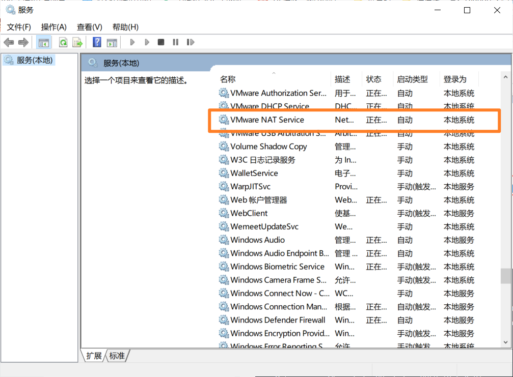
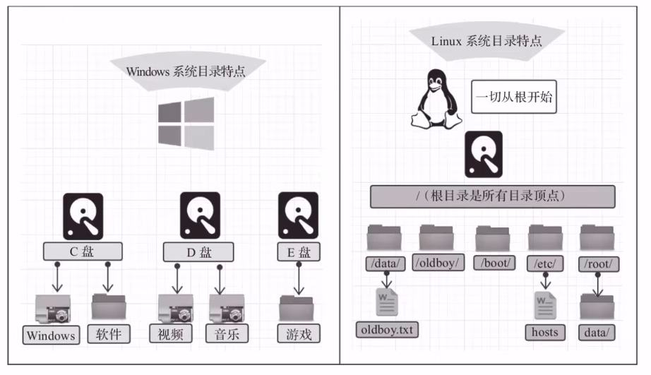
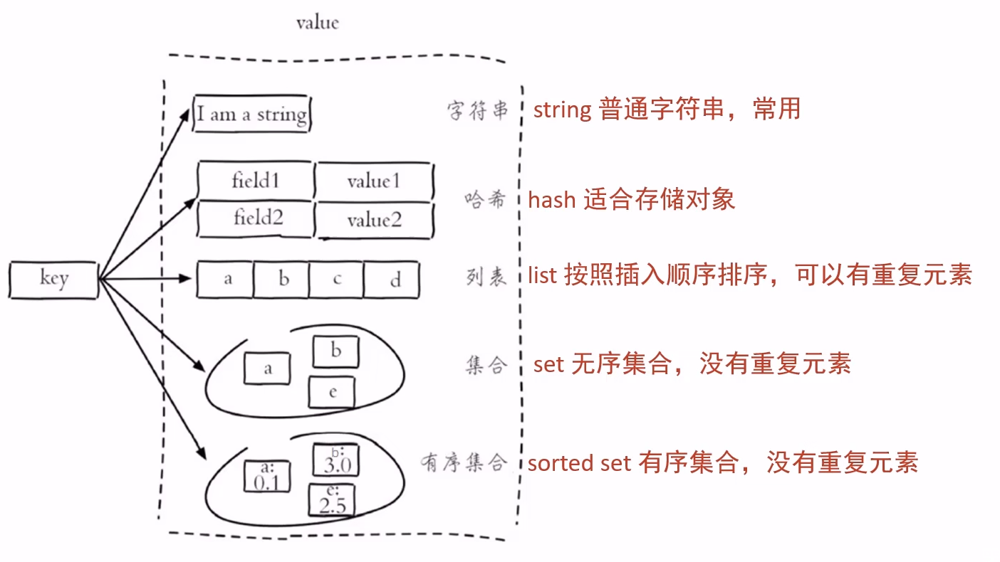
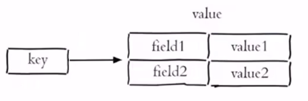
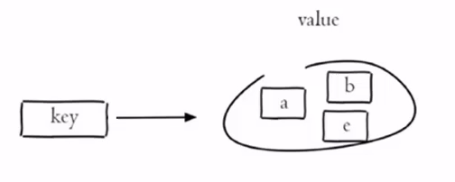

2023年4月25日14:23 虔诚地打开


# 瑞吉外卖

## 前置知识

- Java基础知识
- Java Web
- MySQL
- Spring BootSSM（Spring、Spring MVC、MyBatis）
- Maven

## 学习收获

- 了解企业项目开发的完整流程，增长开发经验
- 了解需求分析的过程，提高分析和设计能力
- 对所学技术进行灵活应用，提高编码能力
- 解决各种异常情况，提高代码调试能力

# day 01

## 1 软件开发整体介绍

### 1.1 软件开发流程

- 需求分析

  产品原型、需求规格说明书

- 设计

  产品文档、UI 界面设计、概要设计、详细设计、数据库设计

- 编码

  项目代码、单元测试

- 测试

  测试用例、测试报告

- 上线运维

  软件环境安装、配置

### 1.2 角色分工

- 项目经理：对整个项目负责，任务分配、把控进度
- 产品经理：进行需求调研，输出需求调研文档、产品原型等
- UI 设计师：根据产品原型输出界面效果图
- 架构师：项目整体架构设计、技术选型等
- 开发工程师：代码实现
- 测试工程师：编写测试用例，输出测试报告运维工程师:软件环境搭建、项目上线

### 1.3 软件环境

- 开发环境（development）：开发人员在开发阶段使用的环境，一般外部用户无法访问
- 测试环境（testing）：专门给测试人员使用的环境，用于测试项目，一般外部用户无法访问
- 生产环境（production）：即线上环境，正式提供对外服务的环境

## 2 瑞吉外卖项目介绍

### 2.1 项目介绍

本项目（瑞吉外卖）是专门为餐饮企业（餐厅、饭店）定制的一款软件产品，包括系统管理后台和移动端应用两部分其中系统管理后台主要提供给餐饮企业内部员工使用，可以对餐厅的菜品、套餐、订单等进行管理维护。移动端应用主要提供给消费者使用，可以在线浏览菜品、添加购物车、下单等。

本项目共分为 3 期进行开发

- 第一期主要实现基本需求，其中移动端应用通过 H5 实现，用户可以通过手机浏览器访问
- 第二期主要针对移动端应用进行改进，使用微信小程序实现，用户使用起来更加方便
- 第三期主要针对系统进行优化升级，提高系统的访问性能。

### 2.2 产品原型展示

产品原型，就是一款产品成型之前的一个简单的框架，就是将页面的排版布局展现出来，使产品的初步构思有一个可视化的展示。通过原型展示，可以更加直观的了解项目的需求和提供的功能。

产品原型主要用于展示项目的功能，并不是最终的页面效果。

### 2.3 技术选型


### 2.4 功能架构

- 移动端前台（H5、微信小程序）
  - 手机号登录
  - 菜品规格
  - 微信登录
  - 购物车
  - 地址管理
  - 下单
  - 历史订单
  - 菜品浏览
- 系统管理后台
  - 分类管理
  - 员工登录
  - 菜品管理
  - 员工退出
  - 套餐管理
  - 员工管理
  - 菜品口味管理
  - 订单管理

### 2.5 角色

- 后台系统管理员：登录后台管理系统，拥有后台系统中的所有操作权限
- 后台系统普通员工：登录后台管理系统，对菜品、套餐、订单等进行管理
- C端用户：登录移动端应用，可以浏览菜品、添加购物车、设置地址、在线下单等

## 3 开发环境搭建

### 3.1 数据库

```sql
CREATE DATABASE reggie CHARACTER SET utf8mb4;
```

|       表名        | 说明             |
| :---------------: | ---------------- |
|    `employee`     | 员工表           |
|    `category`     | 菜品和套餐分类表 |
|      `dish`       | 菜品表           |
|     `setmeal`     | 套餐表           |
|  `setmeal_dish`   | 套餐菜品关系表   |
| `dishdish_flavor` | 菜品口味关系表   |
|      `user`       | 用户表（C端）    |
|  `address_book`   | 地址簿表         |
|  `shopping_cart`  | 购物车表         |
|     `orders`      | 订单表           |
|  `order_detail`   | 订单明细表       |

### 3.2 Maven

### 3.3 启动类与相关配置

将静态资源`backend`与`front`放置到`resources`文件夹。由于 SpringBoot 默认的静态文件是在`static`或`template`文件夹，所以创建配置类进行配置。

```java
@Slf4j
@Configuration
public class WebMvcConfig extends WebMvcConfigurationSupport {
    /**
     * 设置静态资源映射
     * @param registry
     */
    @Override
    protected void addResourceHandlers(ResourceHandlerRegistry registry) {
        log.info("开始静态资源映射...");
        // classpath: 指的是 resources 文件夹
        registry.addResourceHandler("/backend/**").addResourceLocations("classpath:/backend/");  // 斜线不要漏了...
        registry.addResourceHandler("/front/**").addResourceLocations("classpath:/front/");
    }
}
```

## 4 后台登录功能开发

### 4.2 代码开发

1. 将页面提交的密码`password`进行 md5 加密处理
2. 根据页面提交的用户名`username`查询数据库
3. 如果没有查询到则返回登录失败结果
4. 密码比对，如果不一致则返回登录失败结果
5. 查看员工状态，如果为已禁用状态，则返回员工已禁用结果
6. 登录成功，将员工`id`存入`Session`并返回登录成功结果


### 4.3 功能测试

测啊测，测测测...

## 5 后台退出功能开发

- 用户点击页面中退出按钮，发送请求，请求地址为`/employee/logout`，请求方式为POST
- 我们只需要在`Controller`中创建对应的处理方法即可，具体的处理逻辑
  - 清理`Session`中的用户`id`
  - 返回结果

# day 02 员工管理业务

## 1 完善登录功能

### 1.1 需求分析

前面我们已经完成了后台系统的员工登录功能开发，但是还存在一个问题：用户如果不登录，直接访问系统首页面，照样可以正常访问。这种设计并不合理，我们希望看到的效果应该是，只有登录成功后才可以访问系统中的页面，如果没有登录则跳转到登录页面。

那么，具体应该怎么实现呢？答案就是使用过滤器或者拦截器，在过滤器或者拦截器中判断用户是否已经完成登录，如果没有登录则跳转到登录页面，

### 1.2 代码实现

1. 创建自定义过滤器`LoginCheckFilter`
2. 在启动类上加入注解`@ServletComponentScan`
3. 完善过滤器的处理逻辑

过滤器具体的处理逻辑如下：

1. 获取本次请求的 URL
2. 判断本次请求是否需要处理
3. 如果不需要处理，则直接放行
4. 判断登录状态，如果已登录，则直接放行
5. 如果未登录则返回未登录结果


```java
package com.itheima.reggie.filter;

import com.alibaba.fastjson.JSON;
import com.itheima.reggie.common.Result;
import lombok.extern.slf4j.Slf4j;
import org.springframework.util.AntPathMatcher;

import javax.servlet.*;
import javax.servlet.annotation.WebFilter;
import javax.servlet.http.HttpServletRequest;
import javax.servlet.http.HttpServletResponse;
import java.io.IOException;

/**
 * 检查用户是否完成登录
 */
@Slf4j
@WebFilter(filterName = "loginCheckFilter", urlPatterns = "/*")
public class LoginCheckFilter implements Filter {

    // 路径匹配器 支持通配符
    public static final AntPathMatcher PATH_MATCHER = new AntPathMatcher();

    @Override
    public void doFilter(ServletRequest servletRequest, ServletResponse servletResponse, FilterChain filterChain) throws IOException, ServletException {
        HttpServletRequest request = (HttpServletRequest) servletRequest;
        HttpServletResponse response = (HttpServletResponse) servletResponse;

        // 1. 获取本次请求的 URL
        String requestURI = request.getRequestURI();
        log.info("拦截到请求：{}", requestURI);

        // 2. 判断本次请求是否需要处理
        // 定义不需要处理的请求路径
        String[] urls = new String[]{
                "/employee/login",
                "/employee/logout",
                "/backend/**",
                "/front/**",
        };
        boolean check = check(urls, requestURI);

        // 3. 如果不需要处理，则直接放行
        if (check) {
            log.info("本次请求不需要处理：{}", requestURI);
            filterChain.doFilter(request, response);
            return;
        }

        // 4. 判断登录状态，如果已登录，则直接放行
        Object attribute = request.getSession().getAttribute("employee");
        // log.info("\n\n\n{}\n\n\n{}\n\n\n", attribute, attribute.toString());
        if (attribute != null) {
            log.info("用户已登录，用户 id 为 {}", attribute);

            filterChain.doFilter(request, response);
            return;
        }

        // 5. 如果未登录则返回未登录结果
        response.getWriter().write(JSON.toJSONString(Result.error("NOTLOGIN")));
        log.info("用户未登录");
        return;
    }

    /**
     * 路径匹配 判断本次请求是否需要放行
     * @param urls
     * @param requestURI
     * @return true: 放行 false: 需要校验是否登录
     */
    public boolean check(String[] urls, String requestURI) {
        for (String url : urls) {
            boolean match = PATH_MATCHER.match(url, requestURI);
            if (match) {
                return true;
            }
        }
        return false;
    }
}
```

## 2 新增员工

### 2.1 需求分析

1. 页面发送`ajax`请求，将新增员工页面中输入的数据以`json`的形式提交到服务端
2. 服务端`Controller`接收页面提交的数据并调用`Service`将数据进行保存
3. `Service`调用`Mapper`操作数据库，保存数据

前面的程序还存在一个问题，就是当我们在新增员工时输入的账号已经存在，由于`emplovee`表中对该字段加入了唯一约束，此时程序会抛出异常：

```java
java.sql.SQLIntegrityConstraintViolationException: Duplicate entry 'fafa' for key 'employee.idx_username'
```

### 2.2 代码实现

```java
/**
 * 新增员工
 * @param employee
 * @return
 */
@PostMapping
public Result<String> save(@RequestBody Employee employee, HttpServletRequest request) {
    log.info("新增员工，员工信息：{}", employee);

    // 初始密码
    employee.setPassword(DigestUtils.md5DigestAsHex("123456".getBytes()));
    employee.setCreateTime(LocalDateTime.now());
    employee.setUpdateTime(LocalDateTime.now());
    employee.setCreateUser((Long) request.getSession().getAttribute("employee"));
    employee.setUpdateUser((Long) request.getSession().getAttribute("employee"));

    employeeService.save(employee);

    return Result.success("添加成功");
}
```

### 2.3 全局异常处理器

```java
import lombok.extern.slf4j.Slf4j;
import org.springframework.stereotype.Controller;
import org.springframework.web.bind.annotation.*;

import java.sql.SQLIntegrityConstraintViolationException;

/**
 * 全局异常处理器
 */
@ControllerAdvice(annotations = {RestController.class, Controller.class})  // 捕获加了这些注解的类所抛出的异常
@ResponseBody
@Slf4j
public class GlobalExceptionHandle {

    /**
     * 异常处理方法 该方法处理的是 sql 的 SQLIntegrityConstraintViolationException 异常
     * @return
     */
    @ExceptionHandler(java.sql.SQLIntegrityConstraintViolationException.class)
    public Result<String> exceptHandler(SQLIntegrityConstraintViolationException ex) {
        String exMessage = ex.getMessage();

        // 判断是不是 username 重复的异常
        if (exMessage.contains("Duplicate entry")) {
            String[] split = exMessage.split(" ");
            String errorMsg = "用户名" + split[2] + "已经存在了...";
            return Result.error(errorMsg);
        }

        return Result.error("未知错误...");
    }
}
```

## 3 员工信息分页查询

### 3.1 需求分析

系统中的员工很多的时候，如果在一个页面中全部展示出来会显得比较乱，不便于查看，所以一般的系统中都会以分页的方式来展示列表数据。

1. 页面发送`ajax`请求，将分页查询参数（`page`、`pageSize`、`name`）提交到服务端
2. 服务端`Controller`接收页面提交的数据并调用`Service`查询数据
3. `Service`调用`Mapper`操作数据库，查询分页数据
4. `Controller`将查询到的分页数据响应给页面
5. 页面接收到分页数据并通过`Elementul`的`Table`组件展示到页面上

### 3.2 代码实现

- 配置分页器插件

  ```java
  import com.baomidou.mybatisplus.extension.plugins.MybatisPlusInterceptor;
  import com.baomidou.mybatisplus.extension.plugins.inner.PaginationInnerInterceptor;
  import org.springframework.context.annotation.Bean;
  import org.springframework.context.annotation.Configuration;
  
  /**
   * 配置 MP 的分页插件
   */
  @Configuration
  public class MybatisPlusConfig {
  
      @Bean
      public MybatisPlusInterceptor mybatisPlusInterceptor() {
          MybatisPlusInterceptor mybatisPlusInterceptor = new MybatisPlusInterceptor();
          mybatisPlusInterceptor.addInnerInterceptor(new PaginationInnerInterceptor());
          return mybatisPlusInterceptor;
      }
  }
  ```

- 分页查询

  ```java
  /**
       * 员工信息分页查询
       * @param page
       * @param pageSize
       * @param name
       * @return
       */
  @GetMapping("page")
  public Result<Page<Employee>> page(Integer page, Integer pageSize, String name) {
      log.info("员工分页查询：page = {}， pageSize = {}，name = {}", page, pageSize, name);
  
      // 分页构造器
      Page<Employee> pageInfo = new Page<>(page, pageSize);
      // 条件构造器
      LambdaQueryWrapper<Employee> queryWrapper = new LambdaQueryWrapper<>();
      queryWrapper.like(name != null, Employee:: getName, name);  // 满足第一个条件时 才会加入构造
  
      // 执行查询
      employeeService.page(pageInfo, queryWrapper);
      return Result.success(pageInfo);
  }
  ```

## 4 启用 / 禁用员工账号

### 4.1 需求分析

在员工管理列表页面，可以对某个员工账号进行启用或者禁用操作。账号禁用的员工不能登录系统，启用后的员工可以正常登录。

需要注意，只有管理员（`admin`用户）可以对其他普通用户进行启用、禁用操作，所以普通用户登录系统后启用禁用按钮不显示。

### 4.2 代码实现

```java
/**
     * 根据 id 修改员工信息
     * @param employee
     * @return
     */
@PutMapping
public Result<String> update(HttpServletRequest request, @RequestBody Employee employee) {
    log.info("{}", employee);

    Long empId = (Long) request.getSession().getAttribute("employee");

    if (employee.getStatus() != null){
        // todo: 查管理员
        if (empId != 1L){
            return Result.error("没有权限...");
        }
    }

    employee.setUpdateUser(empId);
    employee.setUpdateTime(LocalDateTime.now());
    employeeService.updateById(employee);
    return Result.success("员工信息更新成功...");
}
```

### 4.2 Long 类型精度丢失

前面我们已经发现了问题的原因，即 js 对 Long 型数据进行处理时丢失精度，导致提交的 id 和数据库中的 id 不一致。如何解决这个问题？我们可以在服务端给页面响应 json 数据时进行处理，将 Long 型数据统一转为 String 字符串

- 提供对象转换器`JacksonObjectMapper`，基于`Jackson`进行 Java 对象到 json 数据的转换

  ```java
  import com.fasterxml.jackson.databind.DeserializationFeature;
  import com.fasterxml.jackson.databind.ObjectMapper;
  import com.fasterxml.jackson.databind.module.SimpleModule;
  import com.fasterxml.jackson.databind.ser.std.ToStringSerializer;
  import com.fasterxml.jackson.datatype.jsr310.deser.LocalDateDeserializer;
  import com.fasterxml.jackson.datatype.jsr310.deser.LocalDateTimeDeserializer;
  import com.fasterxml.jackson.datatype.jsr310.deser.LocalTimeDeserializer;
  import com.fasterxml.jackson.datatype.jsr310.ser.LocalDateSerializer;
  import com.fasterxml.jackson.datatype.jsr310.ser.LocalDateTimeSerializer;
  import com.fasterxml.jackson.datatype.jsr310.ser.LocalTimeSerializer;
  import java.math.BigInteger;
  import java.time.LocalDate;
  import java.time.LocalDateTime;
  import java.time.LocalTime;
  import java.time.format.DateTimeFormatter;
  import static com.fasterxml.jackson.databind.DeserializationFeature.FAIL_ON_UNKNOWN_PROPERTIES;
  
  /**
   * 对象映射器:基于jackson将Java对象转为json，或者将json转为Java对象
   * 将JSON解析为Java对象的过程称为 [从JSON反序列化Java对象]
   * 从Java对象生成JSON的过程称为 [序列化Java对象到JSON]
   */
  public class JacksonObjectMapper extends ObjectMapper {
  
      public static final String DEFAULT_DATE_FORMAT = "yyyy-MM-dd";
      public static final String DEFAULT_DATE_TIME_FORMAT = "yyyy-MM-dd HH:mm:ss";
      public static final String DEFAULT_TIME_FORMAT = "HH:mm:ss";
  
      public JacksonObjectMapper() {
          super();
          //收到未知属性时不报异常
          this.configure(FAIL_ON_UNKNOWN_PROPERTIES, false);
  
          //反序列化时，属性不存在的兼容处理
          this.getDeserializationConfig().withoutFeatures(DeserializationFeature.FAIL_ON_UNKNOWN_PROPERTIES);
  
          SimpleModule simpleModule = new SimpleModule()
                  .addDeserializer(LocalDateTime.class, new LocalDateTimeDeserializer(DateTimeFormatter.ofPattern(DEFAULT_DATE_TIME_FORMAT)))
                  .addDeserializer(LocalDate.class, new LocalDateDeserializer(DateTimeFormatter.ofPattern(DEFAULT_DATE_FORMAT)))
                  .addDeserializer(LocalTime.class, new LocalTimeDeserializer(DateTimeFormatter.ofPattern(DEFAULT_TIME_FORMAT)))
  
                  .addSerializer(BigInteger.class, ToStringSerializer.instance)
                  .addSerializer(Long.class, ToStringSerializer.instance)
                  .addSerializer(LocalDateTime.class, new LocalDateTimeSerializer(DateTimeFormatter.ofPattern(DEFAULT_DATE_TIME_FORMAT)))
                  .addSerializer(LocalDate.class, new LocalDateSerializer(DateTimeFormatter.ofPattern(DEFAULT_DATE_FORMAT)))
                  .addSerializer(LocalTime.class, new LocalTimeSerializer(DateTimeFormatter.ofPattern(DEFAULT_TIME_FORMAT)));
  
          //注册功能模块 例如，可以添加自定义序列化器和反序列化器
          this.registerModule(simpleModule);
      }
  }
  ```

- 在`WebMvcConfig`配置类中扩展 Spring mvc 的消息转换器，在此消息转换器中使用我们自己提供的对象转换器进行 Java 对象到 Json 数据的转换

  ```java
  /**
       * 扩展 mvc 框架的消息转换器
       * @param converters
       */
  @Override
  protected void extendMessageConverters(List<HttpMessageConverter<?>> converters) {
      // 创建一个新的消息转换器
      MappingJackson2HttpMessageConverter messageConverter = new MappingJackson2HttpMessageConverter();
      // 设置这个新的对象转换器底层使用我们的转换器
      messageConverter.setObjectMapper(new JacksonObjectMapper());
      // 把上面的消息转换器 追加到mvc框架的转换器集合中
      // 索引为 0 放到首位 会优先使用我们的消息转换器
      converters.add(0, messageConverter);
  }
  ```

## 5 编辑员工信息

### 5.1 需求分析

在员工管理列表页面点击编辑按钮，跳转到编辑页面，在编辑页面回显员工信息并进行修改，最后点击保存按钮完成编辑操作

### 5.2 代码开发

1. 点击编辑按钮时，页面跳转到 add.html，并在 url 中携带参数[员工id]
2. 在 add.html 页面获取 url 中的参数[员工id]
3. 发送 ajax 请求，请求服务端，同时提交员工 id 参数
4. 服务端接收请求，根据员工 id 查询员工信息，将员工信息以 json 形式响应给页面
5. 页面接收服务端响应的 json 数据，通过 VUE 的数据绑定进行员工信息回显
6. 点击保存按钮，发送 ajax 请求，将页面中的员工信息以 json 方式提交给服务端
7. 服务端接收员工信息，并进行处理，完成后给页面响应
8. 页面接收到服务端响应信息后进行相应处理

# day 03 分类管理业务

## 1 公共字段自动填充

### 1.1 需求分析

前面我们已经完成了后台系统的员工管理功能开发，在新增员工时需要设置创建时间、创建人、修改时间、修改人等字段，在编辑员工时需要设置修改时间和修改人等字段。这些字段属于公共字段，也就是很多表中都有这些字段。

### 1.2 代码实现

Mybatis Plus 公共字段自动填充，也就是在插入或者更新的时候为指定字段赋予指定的值，使用它的好处就是可以统一对这些字段进行处理，避免了重复代码

1. 在实体类的属性上加入`@TableField`注解，指定自动填充的策略
2. 按照框架要求编写元数据对象处理器，在此类中统一为公共字段赋值，此类需要实现`MetaobiectHandler`接口

代码在下面捏

### 1.3 功能完善：ThreadLocal

#### 1.3.1 发现问题

前面我们已经完成了公共字段自动填充功能的代码开发，但是还有一个问题没有解决，就是我们在自动填充`createUser`和`updateUser`时设置的用户`id`是固定值，现在我们需要改造成动态获取当前登录用户的`id`。有的同学可能想到，用户登录成功后我们将用户`id`存入了`HttpSession`中，现在我从`HttpSession`中获取不就行了？注意，我们在`MyMetaObjectHandler`类中是不能获得`HttpSession`对象的，所以我们需要通过其他方式来获取登录用户`id`。

可以使用`ThreadLocal`来解决此问题，它 JDK 中提供的一个类。

在学习`ThreadLocal`之前，我们需要先确认一个事情，就是客户端发送的每次 http 请求，对应的在服务端都会分配一个新的线程来处理,在处理过程中涉及到下面类中的方法都属于相同的一个线程：

- `LoginCheckFilter`的`doFilter`方法
- `EmployeeController`的`update`方法
- `MyMetaobjectHandler`的`updateFill`方法

可以在上面的三个方法中分别加入代码来获取当前线程`id` 

```java
long id = Thread.currentThread().getId();
log.info("线程id: {}", id);
```

执行编辑员工功能进行验证，通过观察控制台输出可以发现，一次请求对应的线程 id 是相同的。

#### 1.3.2 什么是 ThreadLocal
`ThreadLocal`并不是一个`Thread`，而是`Thread`的局部变量。当使用`ThreadLocal`维护变量时，`ThreadLocal`为每个使用该变量的线程提供独立的变量副本，所以每一个线程都可以独立地改变自己的副本，而不会影响其它线程所对应的副本。`ThreadLocal`为每个线程提供单独一份存储空间，具有线程隔离的效果，只有在线程内才能获取到对应的值，线程外则不能访问。
#### 1.3.3 ThreadLocal 常用方法

- 设置当前线程的线程局部变量的值

  ```java
  public void set(T value)
  ```

- 返回当前线程所对应的线程局部变量的值

  ```java
  public T get()
  ```

我们可以在`LoginCheckFilter`的`doFilter`方法中获取当前登录用户 id，并调用`ThreadLocal`的`set`方法来设置当前线程的线程局部变量的值（用户 id），然后在`MyMetaobjectHandler`的`updateFill`方法中调用`ThreadLocal`的`get`方法来获得当前线程所对应的线程局部变量的值（用户 id）。

#### 1.3.4 具体代码

1. 编写`BaseContext`工具类，基于`ThreadLocal`封装的工具类
2. 在`LoginCheckFilter`的`doFilter`方法中调用`BaseContext`来设置当前登录用户的 id
3. 在`MyMetaobjectHandler`的方法中调用`BaseContext`获取登录用户的 id

```java
/**
 * 基于 ThreadLocal 封装的工具类 用户保存和获取当前的登录名 id
 */
public class BaseContext {
    private static ThreadLocal<Long> threadLocal = new ThreadLocal<>();

    public static void setCurrentId(Long id) {
        threadLocal.set(id);
    }

    public static Long getCurrentId() {
        return threadLocal.get();
    }
}
```

```java
...
if (attribute != null) {
    log.info("用户已登录，用户 id 为 {}", attribute);

    // 设置 ThreadLocal 的值为 用户 id 便于后面取值
    BaseContext.setCurrentId((Long) attribute);

    filterChain.doFilter(request, response);
    return;
}
...
```

```java
/**
 * 自定义元数据处理器
 */
@Component
@Slf4j
public class MyMeteObjectHandle implements MetaObjectHandler {
    @Override
    public void insertFill(MetaObject metaObject) {
        log.info("公共字段自动填充 【insert】");
        metaObject.setValue("createTime", LocalDateTime.now());
        metaObject.setValue("updateTime", LocalDateTime.now());
        metaObject.setValue("password", DigestUtils.md5Digest("123456".getBytes()));
        metaObject.setValue("createUser", BaseContext.getCurrentId());
        metaObject.setValue("updateUser", BaseContext.getCurrentId());
    }

    @Override
    public void updateFill(MetaObject metaObject) {
        log.info("公共字段自动填充 【update】");
        metaObject.setValue("updateTime", LocalDateTime.now());
        metaObject.setValue("updateUser", BaseContext.getCurrentId());
    }
}
```

## 2 新增分类

### 2.1 需求分析

后台系统中可以管理分类信息，分类包括两种类型，分别是菜品分类和套餐分类。当我们在后台系统中添加菜品时需要选择一个菜品分类，当我们在后台系统中添加一个套餐时需要选择一个套餐分类，在移动端也会按照菜品分类和套餐分类来展示对应的菜品和套餐。

### 2.2 代码实现

```java
/**
 * 新增 菜品 或 套餐 分类
 * @param category
 * @return
 */
@PostMapping
public Result<String> save(@RequestBody Category category) {
    log.info("新增: {}", category);
    categoryService.save(category);
    return Result.success("新增成功");
}
```

## 3 分类信息分页查询

```java
public Result<IPage<Category>> page(Integer page, Integer pageSize) {
    log.info("分页查询 page = {}，pageSiz = {}", page, pageSize);
    // 分页构造器
    Page<Category> pageInfo = new Page<>(page, pageSize);
    // 条件构造器 需要用 sort 字段进行排序
    LambdaQueryWrapper<Category> queryWrapper = new LambdaQueryWrapper<>();
    queryWrapper.orderByAsc(Category:: getSort);
    categoryService.page(pageInfo, queryWrapper);

    return Result.success(pageInfo);
}
```

## 4 删除分类

### 4.1 需求分析

在分类管理列表页面，可以对某个分类进行删除操作。需要注意的是当分类关联了菜品或者套餐时，此分类不允许删除。

### 4.2 代码实现

由于分类是与菜品或套餐有对应关系，故删除分类时是不能直接删除的。此处需要在删除前查数据库，判断待删除的分类是否有对应的菜品或套餐。所以需要我们自己去写删除的逻辑。

- 在`categoryService`接口中定义我们自己的`remove()`方法

  ```java
  public interface CategoryService extends IService<Category> {
  
      public void remove(Long id);
  }
  ```

- 在`categoryServiceImpl`中实现我们自己的`remove()`方法

  ```java
  import com.baomidou.mybatisplus.core.conditions.query.LambdaQueryWrapper;
  import com.baomidou.mybatisplus.extension.service.impl.ServiceImpl;
  import com.itheima.reggie.common.CustomException;
  import com.itheima.reggie.entity.Category;
  import com.itheima.reggie.entity.Dish;
  import com.itheima.reggie.entity.Setmeal;
  import com.itheima.reggie.mapper.CategoryMapper;
  import com.itheima.reggie.service.CategoryService;
  import com.itheima.reggie.service.DishService;
  import com.itheima.reggie.service.SetmealService;
  import org.springframework.beans.factory.annotation.Autowired;
  import org.springframework.stereotype.Service;
  
  @Service
  public class CategoryServiceImpl extends ServiceImpl<CategoryMapper, Category> implements CategoryService {
  
      @Autowired
      private DishService dishService;
  
      @Autowired
      private SetmealService setmealService;
  
      /**
       * 根据 id 有条件的删除分类
       *
       * @param id
       */
      @Override
      public void remove(Long id) {
          // 查询当前分类是否关联了菜品，如果已经关联，抛出一个业务异常
          LambdaQueryWrapper<Dish> dishLambdaQueryWrapper = new LambdaQueryWrapper<>();
          dishLambdaQueryWrapper.eq(Dish:: getCategoryId, id);
  
          int dishCount = dishService.count(dishLambdaQueryWrapper);
          if (dishCount > 0) {
              // 关联了菜品
              throw new CustomException("当前分类下关联了菜品，不能删除...");
          }
  
          // 查询当前分类是否关联了套餐，如果已经关晚抛出一个业务异常
          LambdaQueryWrapper<Setmeal> setmealLambdaQueryWrapper = new LambdaQueryWrapper<>();
          setmealLambdaQueryWrapper.eq(Setmeal:: getCategoryId, id);
  
          int setmealCount = setmealService.count(setmealLambdaQueryWrapper);
          if (setmealCount > 0) {
              // 关联了套餐
              throw new CustomException("当前分类下关联了套餐，不能删除...");
          }
  
          // 正常删除
          super.removeById(id);
      }
  }
  ```

- 于是便可以在`controller`中

  ```java
  /**
   * 删除分类
   * @param id
   * @return
   */
  @DeleteMapping
  public Result<String> delete(Long id) {
      categoryService.remove(id);
      return Result.success("删除分类成功");
  }
  ```

- 对于分类关联了菜品或套餐，即不能删除的情况，可以直接`return`回去结果。此处的逻辑是抛出业务异常的。故需要先定义异常

  ```java
  /**
   * 自定义业务异常类
   */
  public class CustomException extends RuntimeException{
      public CustomException(String message) {
          super(message);
      }
  }
  ```

  即可在全局异常处理器中统一捕获异常并`response`最终`error`给前端

  ```java
  /**
   * 处理我们自己的 CustomException
   */
  @ExceptionHandler(CustomException.class)
  public Result<String> exceptHandler(CustomException ex) {
      String exMessage = ex.getMessage();
      log.error(exMessage);
  
      return Result.error(exMessage);
  }
  ```

## 5 修改分类

在分类管理列表页面点击修改按钮，弹出修改窗口，在修改窗口回显分类信息并进行修改，最后点击确定按钮完成修改操作。

```java
/**
 * 根据 id 修改
 * @param category
 * @return
 */
@PutMapping
public Result<String> update(@RequestBody Category category) {
    log.info("修改信息：{}", category);
    categoryService.updateById(category);
    return Result.success("修改分类成功...");
}
```

# day 04 菜品管理业务

## 1 文件上传下载

### 1.1 文件上传介绍

- 文件上传，也称为`upload`，是指将本地图片、视频、音频等文件上传到服务器上，可以供其他用户浏览或下载的过程。文件上传在项目中应用非常广泛，我们经常发微博、发微信朋友圈都用到了文件上传功能。

- 文件上传时，对页面的`form`表单有如下要求

  - `method="post"`：采用post方式提交数据
  - `enctype="multipart/form-data'`：采用`multipart`格式上传文件
  - `type="file"`：使用`input`的`file`控件上传

- 举个例子

  ```html
  <form method="post" action="/common/upload" enctype="multipart/form-data">
      <input name="myFile" type="file"/>
      <input type="submit" value="提交"/>                          
  </form>
  ```

- 文件上传，页面端可以使用 ElementUl 提供的上传组件

- 服务端要接收客户端页面上传的文件，通常都会使用 Apache 的两个组件

  - `commons-fileupload`
  - `commons-io`

- Spring 框架在 spring-web 包中对文件上传进行了封装，大大简化了服务端代码，我们只需要在`Controller`的方法中声明一个`MultipartFile`类型的参数即可接收上传的文件。

### 1.2 文件下载介绍

- 文件下载，也称为 download，是指将文件从服务器传输到本地计算机的过程
- 通过浏览器进行文件下载，通常有两种表现形式
  - 以附件形式下载，弹出保存对话框，将文件保存到指定磁盘目录
  - 直接在浏览器中打开
- 通过浏览器进行文件下载，本质上就是服务端将文件以流的形式写回浏览器的过程

### 1.3 文件上传下载代码

```java
import com.itheima.reggie.common.Result;
import lombok.extern.slf4j.Slf4j;
import org.springframework.beans.factory.annotation.Value;
import org.springframework.web.bind.annotation.GetMapping;
import org.springframework.web.bind.annotation.PostMapping;
import org.springframework.web.bind.annotation.RequestMapping;
import org.springframework.web.bind.annotation.RestController;
import org.springframework.web.multipart.MultipartFile;

import javax.servlet.ServletOutputStream;
import javax.servlet.http.HttpServletResponse;
import java.io.File;
import java.io.FileInputStream;
import java.io.IOException;
import java.util.UUID;

/**
 * 文件上传和下载
 */
@RestController
@Slf4j
@RequestMapping("common")
public class CommonController {

    @Value("${reggie.file.path}")
    private String basePath;

    /**
     * 文件上传
     * @param file
     * @return
     * @throws IOException
     */
    @PostMapping("/upload")
    // file 这个参数名必须要和 name 一样
    // Content-Disposition: form-data; name="file"; filename="image-20230315112348651.png"
    public Result<String> upload(MultipartFile file) throws IOException {
        // file 是一个临时文件，需要转存到指定位置，否则本次请求完成后临时文件会删除
        log.info(file.toString());

        // 判断文件路径是否存在
        File dir = new File(basePath);
        if (!dir.exists()) {
            dir.mkdirs();
        }

        String originalFilename = file.getOriginalFilename();
        // file.transferTo(new File(basePath + originalFilename));  // 使用原始文件名

        String fileName = UUID.randomUUID() + originalFilename.substring(originalFilename.lastIndexOf("."));
        file.transferTo(new File(basePath + fileName));
        return Result.success(fileName);  // 图片回显时 会直接请求文件下载的路径 参数为文件保存时的名字
    }

    /**
     * 文件下载
     * @param name
     * @param response
     */
    @GetMapping("/download")
    public void download(String name, HttpServletResponse response) throws IOException {
        // 输入流 读取文件
        FileInputStream fileInputStream = new FileInputStream(new File(basePath + name));

        // 输出流
        ServletOutputStream responseOutputStream = response.getOutputStream();
        response.setContentType("image/jpeg");

        int len;
        byte[] bytes = new byte[1024];
        while ((len = fileInputStream.read(bytes)) != -1) {
            responseOutputStream.write(bytes, 0, len);
            responseOutputStream.flush();
        }

        responseOutputStream.close();
        fileInputStream.close();
    }
}
```

## 2 新增菜品

### 2.1 需求分析

后台系统中可以管理菜品信息，通过新增功能来添加一个新的菜品，在添加菜品时需要选择当前菜品所属的菜品分类并且需要上传菜品图片，在移动端会按照菜品分类来展示对应的菜品信息。

在开发代码之前，需要梳理一下新增菜品时前端页面和服务端的交互过程

1. 页面（backend/page/food/add.html）发送 ajax 请求，请求服务端获取菜品分类数据并展示到下拉框中
2. 页面发送请求进行图片上传，请求服务端将图片保存到服务器
3. 页面发送请求进行图片下载，将上传的图片进行回显
4. 点击保存按钮，发送 ajax 请求，将菜品相关数据以 Json 形式提交到服务端

开发新增菜品功能，其实就是在服务端编写代码去处理前端页面发送的这4次请求即可

### 2.2 代码实现

#### 2.2.1 DTO

DTO，全称为Data Transfer Object，即数据传输对象，一般用于展示层与服务层之间的数据传输。

此处前端提交的数据，有一个`flavors`字段，故目前的实体类无法接收。

```json
{
	"name": "00",
	"price": 2000,
	"code": "",
	"image": "b0b17090-eb4c-42a4-ae5e-1f6bc07d98a8.jpg",
	"description": "",
	"status": 1,
	"categoryId": "1397844263642378242",
	"flavors": [{
		"name": "甜味",
		"value": "[\"无糖\",\"少糖\",\"半糖\",\"多糖\",\"全糖\"]",
		"showOption": false
	}, {
		"name": "辣度",
		"value": "[\"不辣\",\"微辣\",\"中辣\",\"重辣\"]",
		"showOption": false
	}]
}
```

定义一个 DTO 为 DishDto。继承了`Dish`实体

```java
import com.itheima.reggie.entity.Dish;
import com.itheima.reggie.entity.DishFlavor;
import lombok.Data;
import java.util.ArrayList;
import java.util.List;

@Data
public class DishDto extends Dish {
    private List<DishFlavor> flavors = new ArrayList<>();
    private String categoryName;
    private Integer copies;
}
```

#### 2.2.2 具体代码

- 由于需要自定义 所以在`DishService`中定义`saveWithFlavor`方法，在`DishServiceImpl`中实现`saveWithFlavor`方法

  ```java
  public interface DishService extends IService<Dish> {
  
      // 新增菜品 同时插入菜品表 与 口味表
      public void saveWithFlavor(DishDto dishDto);
  }
  ```

  ```java
  /**
   * 新增菜品 同时插入菜品表 与 口味表
   *
   * @param dishDto
   */
  @Override
  @Transactional
  public void saveWithFlavor(DishDto dishDto) {
      // 保存基本信息到菜品表
      // this.save(dishDto);
      save(dishDto);
  
      // 保存口味表
      // 注意 现在的 Flavor 中 只有 name 和 value。没有 dishId 即不能将 口味 和 和菜品形成关系
      // 由于上面已经将 dish 写入了数据库 故 dishId 已经回写了 故可以直接拿值
      Long dishId = dishDto.getId();
      List<DishFlavor> flavors = dishDto.getFlavors();
      for (DishFlavor flavor : flavors) {
          flavor.setDishId(dishId);
      }
  
      dishFlavorService.saveBatch(flavors);
  }
  ```

- 由于是同时操控多张 SQL 表，故需要加上`@Transactional`注解。同时在启动类中开始事务支持

  ```java
  @Slf4j
  @SpringBootApplication
  @ServletComponentScan  // 过滤器支持
  @EnableTransactionManagement  // 开启事务支持
  public class ReggieApplication {
      public static void main(String[] args) {
          SpringApplication.run(ReggieApplication.class, args);
          log.info("项目启动成功...");
      }
  }
  ```

## 3 菜品信息分页查询

### 3.1 需求分析

系统中的菜品数据很多的时候，如果在一个页面中全部展示出来会显得比较乱，不便于查看，所以一般的系统中都会以分页的方式来展示列表数据。

1. 页面（backend/page/food/list.html）发送 ajax 请求，将分页查询参数`page`、`pageSize`、`name`）提交到服务端，获取分页数据
2. 页面发送请求，请求服务端进行图片下载，用于页面图片展示

开发菜品信息分页查询功能，其实就是在服务端编写代码去处理前端页面发送的这 2 次请求即可

### 3.2 代码实现

```java
/**
 * 菜品分页查询
 * 页面需要返回的数据中有 categoryName 字段
 * 故此处返回的是 有 categoryName 字段的 DishDto 的实体
 * 使用 对象拷贝 把查到的数据拷贝给 DishDto 并单独给 categoryName 字段赋值
 * @param page
 * @param pageSize
 * @param name
 * @return
 */
@GetMapping("/page")
public Result<Page<DishDto>> page(Integer page, Integer pageSize, String name) {
    log.info("菜品分页查询：page = {}, pageSize = {}, name = {}", page, pageSize, name);
    // 返回的数据
    Page<DishDto> dishDtoPage = new Page<>();

    //分页器
    Page<Dish> pageInfo = new Page<>(page, pageSize);

    // 条件构造器
    LambdaQueryWrapper<Dish> queryWrapper = new LambdaQueryWrapper<>();
    queryWrapper.like(name != null, Dish:: getName, name);
    queryWrapper.orderByDesc(Dish::getUpdateTime);
    // 查询数据
    dishService.page(pageInfo, queryWrapper);

    // 对象拷贝
    // 把除了 records 外的属性拷贝过去
    BeanUtils.copyProperties(pageInfo, dishDtoPage, "records");
    // 单独处理 records
    List<Dish> records = pageInfo.getRecords();
    List<DishDto> newRecords = records.stream().map(item -> {
        // new 一个 DishDto 里面有 categoryName 这一个属性
        DishDto dishDto = new DishDto();
        Long categoryId = item.getCategoryId();  // 拿到分类的 id
        String categoryName = categoryService.getById(categoryId).getName();

        BeanUtils.copyProperties(item, dishDto);
        dishDto.setCategoryName(categoryName);

        return dishDto;
    }).collect(Collectors.toList());

    // 把处理好的 newRecords 给将要返回的 dishDtoPage 里面
    dishDtoPage.setRecords(newRecords);

    return Result.success(dishDtoPage);
}
```

## 4 修改菜品

### 4.1 需求分析

在菜品管理列表页面点击修改按钮，跳转到修改菜品页面，在修改页面回显菜品相关信息并进行修改，最后点击确定按钮完成修改操作。

1. 页面发送 ajax 请求，请求服务端获取分类数据，用于菜品分类下拉框中数据展示
2. 页面发送 ajax 请求，请求服务端，根据 id 查询当前菜品信息，用于菜品信息回显页面
3. 发送请求，请求服务端进行图片下载，用于页图片回显
4. 点击保存按钮，页面发送 ajax 请求，将修改后的菜品相关数据以 json 形式提交到服务端

### 4.2 代码实现

自定义在`DishServiceImpl`中

```java
/**
 * 更新 菜品 + 口味 信息
 *
 * @param dishDto
 */
@Override
public void updateWithFlavor(DishDto dishDto) {
    // 更新 dish 表基本信息
    this.updateById(dishDto);

    // 清理 口味表 中菜品对应的口味数据
    LambdaQueryWrapper<DishFlavor> queryWrapper = new LambdaQueryWrapper<>();
    queryWrapper.eq(DishFlavor:: getDishId, dishDto.getId());
    dishFlavorService.remove(queryWrapper);

    // 新增当前的口味数据到 口味表
    List<DishFlavor> flavors = dishDto.getFlavors();
    // 口味表要添加菜品的 id 形成对应
    for (DishFlavor flavor : flavors) {
        flavor.setDishId(dishDto.getId());
    }
    dishFlavorService.saveBatch(flavors);
}
```

# day 05 套餐管理业务开发

## 5.1 新增套餐

### 5.1.1 需求分析

套餐就是菜品的集合。后台系统中可以管理套餐信息，通过新增套餐功能来添加一个新的套餐，在添加套餐时需要选择当前套餐所属的套餐分类和包含的菜品，并且需要上传套餐对应的图片，在移动端会按照套餐分类来展示对应的套餐。

1. 页面（backend/page/ombo/add.htm）发送 ajax 请求，请求服务端获取套餐分类数据并展示到下拉框中
2. 页面发送 ajax 请求，请求服务端获取菜品分类数据并展示到添加菜品窗口中
3. 页面发送 ajax 请求，请求服务端，根据菜品分类查询对应的菜品数据并展示到添加菜品窗口中
4. 页面发送请求进行图片上传，请求服务端将图片保存到服务器
5. 页面发送请求进行图片下载，将上传的图片进行回显
6. 点击保存按钮，发送 ajax 请求，将套餐相关数据以 json 形式提交到服务端

### 5.1.2 代码实现

#### 5.1.2.1 查询菜品分类

```java
/**
 * 根据条件查菜品数据
 * @param dish
 * @return
 */
@GetMapping("/list")
public Result<List<Dish>> list(Dish dish) {
    log.info("根据条件查询 dish: {}", dish);
    LambdaQueryWrapper<Dish> queryWrapper = new LambdaQueryWrapper<>();
    queryWrapper.eq(dish.getCategoryId() != null, Dish::getCategoryId, dish.getCategoryId());
    queryWrapper.eq(Dish::getStatus, 1);
    queryWrapper.orderByAsc(Dish::getSort).orderByDesc(Dish::getUpdateTime);

    List<Dish> list = dishService.list(queryWrapper);
    return Result.success(list);
}
```


## 5.2 套餐信息分页查询

```java
/**
 * 套餐分页查询
 *
 * @param page
 * @param pageSize
 * @param name
 * @return
 */
@GetMapping("/page")
public Result<Page<SetmealDto>> page(Integer page, Integer pageSize, String name) {
    log.info("套餐分页查询：page = {}，pageSize = {}，name = {}", page, pageSize, name);

    Page<Setmeal> pageInfo = new Page<>(page, pageSize);
    Page<SetmealDto> pageDto = new Page<>();

    LambdaQueryWrapper<Setmeal> queryWrapper = new LambdaQueryWrapper<>();
    queryWrapper.like(name != null, Setmeal::getName, name);
    queryWrapper.orderByDesc(Setmeal::getUpdateTime);
    setmealService.page(pageInfo, queryWrapper);

    // 对象拷贝
    BeanUtils.copyProperties(pageInfo, pageDto, "records");

    List<SetmealDto> setmealDtoList = pageInfo.getRecords().stream().map(record -> {
        // 每一个 record 是一个 Setmeal
        SetmealDto setmealDto = new SetmealDto();
        BeanUtils.copyProperties(record, setmealDto);
        setmealDto.setCategoryName(categoryService.getById(record.getCategoryId()).getName());
        return setmealDto;
    }).collect(Collectors.toList());

    pageDto.setRecords(setmealDtoList);

    return Result.success(pageDto);
}
```

## 5.3 删除套餐

所以是不是可以理解为，这个操作走完，就可以默认删除成功。如果逻辑上不符和删除条件，则直接抛业务异常，由全局异常处理器返回报错信息。

这样的话，是不是不用把`Reuslt`传来传去，使各版块更加独立。

```java
/**
 * 删除套餐
 * 前提是已经停售
 *
 * @param ids
 * @return
 */
@DeleteMapping
public Result<String> deleteByIds(@RequestParam List<Long> ids) {
    log.info("批量删除：{}", ids);

    // 默认这个操作走完 都是删除成功的
    // 删除失败的会直接抛业务异常
    setmealService.removeWithDish(ids);
    return Result.success("删除成功");
}
```

```java
/**
 * 删除 套餐 与 关联 的菜品
 * 前提是已经停售
 *
 * @param ids
 * @return
 */
@Transactional
@Override
public void removeWithDish(List<Long> ids) {
    // 判断是否停售
    // select count(*) from setmeal where id in ids and status == 1
    LambdaQueryWrapper<Setmeal> queryWrapper = new LambdaQueryWrapper<>();
    queryWrapper.eq(Setmeal:: getStatus, 1);
    queryWrapper.in(Setmeal:: getId, ids);
    int count = this.count(queryWrapper);
    if (count > 0) {
        throw new CustomException("不能删除未停售的套餐！");
    }

    // 都停售了 处理删除业务
    // 删除套餐
    this.removeByIds(ids);

    // 删除关联数据
    LambdaQueryWrapper<SetmealDish> queryWrapper1 = new LambdaQueryWrapper<>();
    queryWrapper1.in(SetmealDish:: getSetmealId, ids);
    setmealDishService.remove(queryWrapper1);
}
```

# day 06 手机验证码登录

## 1 短信发送

### 1.1 短信服务介绍

- 目前市面上有很多第三方提供的短信服务，这些第三方短信服务会和各个运营商（移动、联通、电信）对接，我们只需要注册成为会员并且按照提供的开发文档进行调用就可以发送短信。需要说明的是，这些短信服务一般都是收费服务。

- 常用短信服务

  - 阿里云

  - 华为云

  - 腾讯云

  - 京东

  - 梦网

  - 乐信

### 1.2 阿里云短信服务

- 阿里云短信服务（Short Message Service）是广大企业客户快速触达手机用户所优选使用的通信能力。调用 API 或用群发助手，即可发送验证码、通知类和营销类短信；国内验证短信秒级触达，到达率最高可达99%，国际/港澳台短信覆盖200多个国家和地区，安全稳定，广受出海企业选用。

- 应用场景

  - 验证码

  - 短信通知

  - 推广短信

### 1.3 代码开发

## 2 手机验证码登录

### 2.1 需求分析

- 为了方便用户登录，移动端通常都会提供通过手机验证码登录的功能。
- 手机验证码登录的优点
  - 方便快捷，无需注册，直接登录
  - 使用短信验证码作为登录凭证，无需记忆密码
  - 安全
- 登录流程
  - 输入手机号 > 获取验证码 > 输入验证码 > 点击登录 > 登录成功
- 注意：通过手机验证码登录，手机号是区分不同用户的标识。

### 2.2 代码开发

### 2.3 功能测试

# day 07 产品展示 购物车 下单

## 1 地址簿相关功能

### 1.1 更新默认地址信息

```java
/**
 * 更新默认地址信息
 * @param addressBook
 */
@Override
public void updateDefault(AddressBook addressBook) {
    // 取消默认
    // UPDATE address_book SET is_default=0, update_time=xxx, update_user=xxx WHERE (is_default = 1)
    LambdaQueryWrapper<AddressBook> queryWrapper = new LambdaQueryWrapper<>();
    queryWrapper.eq(AddressBook:: getIsDefault, 1);
    AddressBook addressBook1 = new AddressBook();
    addressBook1.setIsDefault(0);
    this.update(addressBook1, queryWrapper);

    // 设为默认
    addressBook.setIsDefault(1);
    this.updateById(addressBook);
}
```

## 2 菜品展示

## 3 购物车

### 3.1 需求分析

移动端用户可以将菜品或者套餐添加到购物车。对于菜品来说，如果设置了口味信息，则需要选择规格后才能加入购物车；对于套餐来说，可以直接点击`+`将当前套餐加入购物车。在购物车中可以修改菜品和套餐的数量也可以清空购物车。

### 3.2 交互过程

1. 点击加入购物车或者 按钮，页面发送 ajax 请求，请求服务端，将菜品或者套餐添加到购物车
2. 点击购物车图标，页面发送 ajax 请求，请求服务端查询购物车中的菜品和套餐
3. 点击清空购物车按钮，页面发送 ajax 请求，请求服务端来执行清空购物车操作

## 4 用户下单

移动端用户将菜品或者套餐加入购物车后，可以点击“去支付”按钮，页面跳转到订单确认页面，点击购物车中的“去支付”按钮则完成下单操作。

# day 08 Linux 系统

## 1 Linux简介

### 1.1 不同应用领域的主流操作系统

### 1.2 Linux 发展历史

- 时间：1991年
- 地点：芬兰赫尔辛基大学
- 人物：Linus Torvalds（21岁）
- 语言：C语言、汇编语言
- Logo：企鹅
- 特点：免费、开源、多用户、多任务

### 1.3 Linux 系统版本

- 内核版
  - 由 Linus Torvalds 及其团队开发、维护
  - 免费、开源
  - 负责控制硬件
- 发行版
  - 基于 Linux 内核版进行扩展
  - 由各个 Linux 厂商开发、维护
  - 有收费版本和免费版本

- Linux 系统发行版
  - Ubuntu：以桌面应用为主
  - RedHat：应用最广泛、收费
  - CentOS：RedHat的社区版、免费
  - openSUSE：对个人完全免费、图形界面华丽
  - Fedora：功能完备、快速更新、免费
  - 红旗Linux：北京中科红旗软件技术有限公司开发

## 2 Linux 安装

### 2.1 安装方式

+ Linux 系统的安装方式
  + 物理机安装：直接将操作系统安装到服务器硬件上
  + 虚拟机安装：通过虚拟机软件安装
+ 虚拟机（Virtual Machine）指通过软件模拟的具有完整硬件系统功能、运行在完全隔离环境中的完整计算机系统
+ 常用虚拟机软件
  + VMWare
  + VirtualBox
  + VMLite WorkStation
  + Qemu
  + Hopeddot Vos

### 2.2 网卡设置

由于启动服务器时未加载网卡，导致 IP 地址初始化失败

### 2.3 安装 SSH 连接工具 

- SSH（Secure shell），建立在应用层基础上的安全协议。
- 常用的SSH连接工具
  - putty
  - secureCRT
  - xshell
  - **finalshell**
- 通过 SSH 连接工具就可以实现从本地连接到远程的 Linux 服务器

如果`ip addr`无法显示 ip 地址



### 2.4 Linux 目录结构



- bin 存放二进制可执行文件
- boot 存放系统导时使用的各种文件
- dev 存放设备文件
- etc存放系统配置文件
- home 存放系统用户的文件
- lib 存放程序运行所需的共享库和内核模块
- opt 额外安装的可选应用程序包所放置的位置
- root 超级用户目录
- sbin 存放二进制可执行文件，只有 root 用户才能访问
- tmp 存放临时文件
- usr 存放系统应用程序
- var 存放运行时需要改变数据的文件，例如日志文件

## 3 Linux 常用命令

### 3.1 Linux 命令初体验

| 序号 |       命令       |       对应英文       |           作用           |
| :--: | :--------------: | :------------------: | :----------------------: |
|  1   |       `ls`       |         list         |   查看当前目录下的内容   |
|  2   |      `pwd`       | print work directory |     查看当前所在目录     |
|  3   |  `cd [目录名]`   |   change directory   |         切换目录         |
|  4   | `touch [文件名]` |        touch         | 如果文件不存在，新建文件 |
|  5   | `mkdir [目录名]` |    make directory    |         创建目录         |
|  6   |  `rm [文件名]`   |        remove        |       删除指定文件       |

在执行 Linux 命令时，提示信息如果显示为乱。这是由于编码问题导致，只需要修改 Linux 的编码即可

```shell
echo 'LANG="en US.UTF-8"' >> /etc/profile
source /etc/profile
```

Linux 使用技巧

- Tab 键自动补全
- 连续两次 Tab 键，给出操作提示
- 使用上下箭头快速调出曾经使用过的命令
- 使用 clear 命令或者 Ctrl+l 快捷键实现清屏

Linux 命令格式

```shell
command [-options] [parameter]
```

- `command`：命令名
- `[-options]`：选项，可用来对命令进行控制，也可以省略
- `[parameter]`：传给命令的参数，可以是零个、一个或者多个
- 注意：`[]`代表可选命令名、选项、参数之间有空格进行分隔

### 3.2 文件目录操作命令 ls

- 作用：显示指定目录下的内容
- 语法：`[s[-al] [dir]`
- 说明
  - `-a`显示所有文件及目录（`.`开头的隐藏文件也会列出）
  - `-l`除文件名称外，同时将文件型态（`d`表示目录，`-`表示文件）、权限、拥有者、文件大小等信息详细列出
- 注意：由于我们使用`ls`命令时经常需要加入`-l`选项，所以 Linux 为`ls -l`命令提供了一种简写方式，即`ll`

### 3.3 文件目录操作命令 cd

- 作用：用于切换当前工作目录，即进入指定目录
- 语法：`cd [dirName]`
- 特殊说明
  - `~`表示用户的 home 目录
  - `.`表示目前所在的目录
  - `..`表示目前目录位置的上级目录
- 举例
  - `cd ..`：切换到当前目录的上级目录
  - `cd ~`：切换到用户的 home 目录
  - `cd /usr/local`：切换到 /usr/local 目录

### 3.4 文件目录操作命令 cat

- 作用：用于显示文件内容
- 语法：`cat [-n] fileName`
- 说明:
  - `-n`：由1开始对所有输出的行数编号
- 举例
  - `cat /etc/profile`：查看 /etc 目录下的 profile 文件内容

### 3.5 文件目录操作命令 more

- 作用：以分页的形式显示文件内容
- 语法：`more fileName`
- 操作说明
  - 回车键：向下滚动一行
  - 空格键：向下滚动一屏
  - `b`：返回上一屏
  - `q`或者`Ctrl+C`：退出`more`
- 举例
  - `more /etc/profile`：以分页方式显示 /etc 目录下的 profile 文件内容

### 3.6 文件目录操作命令 tail

- 作用：查看文件末尾的内容
- 语法：`tail[-f] fileName`
- 说明
  - `f`：动态读取文件末尾内容并显示，通常用于日志文件的内容输出
- 举例
  - `tail /etc/profile`：显示 /etc 目录下的 profile 文件末尾10行的内容
  - `tail -20 /etc/profile`：显示 /etc 目录下的 profile 文件末尾20行的内容
  - `tail -f /itcast/my.log`：动态读取 /itcast 目录下的 my.log 文件末尾内容并显示

### 3.7 文件目录操作命令 mkdir

- 作用：创建目录
- 语法：`mkdir [-p] dirName`
- 说明
  - `-p`：确保目录名称存在，不存在的就创建一个。通过此选项，可以实现多层目录同时创建
- 举例
  - `mkdir itcast`：在当前目录下，建立一个名为 itcast 的子目录
  - `mkdir -p itcast/test`：在工作目录下的 itcast 目录中建立一个名为 test 的子目录，若 itcast 目录不存在，则建立一个

### 3.8 文件目录操作命令 rmdir

- 作用：删除空目录
- 语法：`rmdir [-p] dirName`
- 说明
  - `-p`：当子目录被删除后使父目录为空目录的话，则一并删除
- 举例
  - `rmdir itcast`：删除名为 itcast 的空目录
  - `rmdir -p itcast/test`：删除 itcast 目录中名为 test 的子目录，若 test 目录删除后 itcast 目录变为空目录，则也被删除
  - `rmdir itcast*`：删除名称以 itcast 开始的空目录

### 3.9 文件目录操作命令 rm

- 作用：删除文件或者目录
- 语法：`rm [-rf] name`
- 说明
  - `-r`：将目录及目录中所有文件（目录）逐一删除，即递归删除
  - `-f`：无需确认，直接刑除
- 举例
  - `rm -r itcast/`：删除名为`itcast`的目录和目录中所有文件，删除前需确认
  - `rm -rf itcast/`：无需确认，直接删除名为 itcast 的目录和目录中所有文件
  - `rm -f hello.txt`：无需确认，直接删除 hello.txt 文件

### 3.10 拷贝移动命令 cp

- 作用：用于复制文件或目录
- 语法：`cp[-] source dest`
- 说明
  - `-r`：如果复制的是目录需要使用此选项，此时将复制该目录下所有的子目录和文件
- 举例
  - `cp hello.txt itcast/`将 hello.txt 复制到 itcast 目录中
  - `cp hello.txt ./hi.txt`：将 hello.txt 复制到当前目录，并改名为 hi.txt
  - `cp -r itcast/ ./itheima/`：将 itcast 目录和目录下所有文件复制到 itheima 目录下
  - `cp -r itcast/* ./itheima/` 将 itcast 目录下所有文件复制到 itheima 目录下

### 3.11 拷贝移动命令 mv

- 作用：为文件或目录改名、或将文件或目录移动到其它位置
- 语法：`mv source dest`
- 举例
- `mv hello.txt hi.txt`：将 hello.txt 改名为 hi.txt
- `mv hi.txt itheima/`：将文件 hi.txt 移动到 itheima 目录中
- `mv hi.txt itheima/hello.txt`：将 hi.txt 移动到 itheima 目录中，并改名为 hello.txt 
- `mv itcast/ itheima/`：如果 itheima 目录不存在，将 itcast 目录改名为 itheima
- `mv itcast/ itheima/`：如果 itheima 目录存在，将 itcast 目录移动到 itheima 目录中

### 3.12 打包压缩命令 tar

- 作用：对文件进行打包、解包、压缩、解压
- 语法：`tar [-zcxvf] fileName [files]
- 包文件后缀为`.tar`表示只是完成了打包，并没有压缩包文件
- 后缀为`.tar.gz`表示打包的同时还进行了压缩
- 说明
  - `-z`：`z`代表的是`gzip`，通过`gzip`命令处理文件，`gzip`可以对文件压缩或者解压
  - `-c`：`c`代表的是`create`，即创建新的包文件
  - `-x`：`x`代表的是`extract`，实现从包文件中还原文件
  - `-v`：`v`代表的是`verbose`，显示命令的执行过程
  - `-f`：f代表的是`file`，用于指定包文件的名称
- 举例
  - 打包
    - `tar -cvf hello.tar ./*`：将当前目录下所有文件打包，打包后的文件名为 hello.tar
    - `tar -zcvf hello.tar.gz ./*`：将当前目录下所有文件打包并压缩，打包后的文件名为 hello.tar.gz
  - 解包
    - `tar -xvf hello.tar`：将 hello.tar 文件进行解包，并将解包后的文件放在当前目录
    - `tar -zxvf hello.tar.gz`：将 hello.tar.gz 文件进行解压，并将解压后的文件放在当前目录
    - `tar -zxvf hello.tar.gz -C /usr/local`：将 hello.tar.gz 文件进行解压，并将解压后的文件放在 /usr/local 目录

### 3.13 文本编辑命令

- 作用：`vi`命令是 Linux 系统提供的一个文本编辑工具，可以对文件内容进行编辑，类似于 Windows 中的记事本

- 语法：`vi fileName`

- 说明

  - `vim`是从`vi`发展来的一个功能更加强大的文本编辑工具，在编辑文件时可以对文本内容进行着色，方便我们对文件进行编辑处理，所以实际工作中`vim`更加常用

  - 要使用`vim`命令，需要我们自己完成安装。可以使用命令来完成安装

    ```shell
    vum install vim
    ```

- 作用：对文件内容进行编辑，`vim`其实就是一个文本编辑器

- 语法：`vim fileName`

- 说明

  - 在使用`vim`命令编辑文件时，如果指定的文件存在则直接打开此文件。如果指定的文件不存在则新建文件
  - `vim`在进行文本编辑时共分为三种模式，分别是命令模式（Command mode），插入模式（Insert mode）和底行模式（Last ine mode）。这三种模式之间可以相互切换。我们在使用`vim`时一定要注意我们当前所处的是哪种模式。

- 命令模式

  - 命令模式下可以查看文件内容、移动光标（上下左右箭头、`gg`、`G`）
  - 通过`vim`命令打开文件后，默认进入命令模式
  - 另外两种模式需要首先进入命令模式，才能进入彼此

- 插入模式

  - 插入模式下可以对文件内容进行编辑
  - 在命令模式下按下`i`、`a`、`o`任意一个，可以进入插入模式。进入插入模式后，下方会出现`[insert]` 字样
  - 在插入模式下按下ESC键，回到命令模式

- 底行模式

  - 底行模式下可以通过命令对文件内容进行查找、显示行号、退出等操作
  - 在命令模式下按下`:`、`/`任意一个，可以进入底行模式
  - 通过`/`方式进入底行模式后，可以对文件内容进行查找
  - 通过`:`方式进入底行模式后，可以输入`wg`（保存并退出）、`q!`（不保存退出）、`set nu` （显示行号）

### 3.14 查找命令 find

- 作用：在指定目录下查找文件
- 语法：`find dirName -option fileName`
- 举例
  - `find . -name “*.java”`：在当前目录及其子目录下查找 .java 结尾文件
  - `find /itcast -name "*java"`在 /itcast 目录及其子目录下查找 .java 结尾的文件

### 3.15 查找命令 grep

- 作用：从指定文件中查找指定的文本内容
- 语法：`grep word fileName`
- 举例
  - `grep Hello HelloWorld.java`：查找 HelloWorld.java 文件中出现的 Hello 字符串的位置
  - `grep hello *.java`：查找当前目录中所有 .java 结尾的文件中包含 hello 字符串的位置

## 4 Linux 软件安装

### 4.0 安装 VIM

- 查看系统是否安装完整vim

```shell
rpm -qa|grep vim
```

- 如果已经正确安装的话，会显示如下三行

```shell
vim-enhanced-7.0.109-7.el5
vim-minimal-7.0.109-7.el5
vim-common-7.0.109-7.el5
```

- 安装 vim
- 如果少了其中的某一条，比如 vim-enhanced 的，就用命令 yum -y install vim-enhanced 来安裝

```shell
yum -y install vim-enhanced
```

- 如果上面的三条一条都沒有返回，可以直接用 yum -y install vim* 命令

```shell
yum -y install vim*
```

### 4.1 软件安装方式

- 二进制发布包安装

  软件已经针对具体平台编译打包发布，只要解压，修改配置即可

- rpm 安装

  软件已经按照 redhat 的包管理规范进行打包，使用 rpm 命令进行安装，不能自行解决库依赖问题

- yum 安装

  一种在线软件安装方式，本质上还是 rpm 安装，自动下载安装包并安装，安装过程中自动解决库依赖问题

- 源码编译安装

  软件以源码工程的形式发布，需要自己编译打包

### 4.2 安装 jdk

- 使用 Finalshell 自带的上传工具将 jdk 的二进制发布包上传到 Linux：jdk-8u171-linux-x64.tar.gz

- 解压安装包，命令为`tar -zxvf jdk-8u171-linux-x64.tar.gz -C /usr/local`

- 配置环境变量，使用`vim`命令修改`/etc/profile`文件，在文件末尾加入如下配置

  ```shell
  JAVA_HOME=/usr/local/jdk1.8u171
  PATH=$JAVA HOME/bin:$PATH
  ```

- 重新加载`profile`文件，使更改的配置立即生效，命令为`source /etc/profile`

- 检查安装是否成功，命令为`java -version`

### 4.3 安装 Tomcat

#### 4.3.1 安装与启动

- 使用 Finalshell 自带的上传工具将 Tomcat 的二进制发布包上传到 Linux 
- 解压安装包，命令为`tar -zxvf apache-tomcat-7.0.57.tar.gz -C /usr/local`
- 进入 Tomcat 的 bin 目录启动服务，命令为`sh startup.sh`或者`./startup.sh`

#### 4.3.2 验证 Tomcat 启动是否成功

- 查看启动日志

  `more /usr/local/apache-tomcat-7.0.57/logs/catalina.out`

  `tail -50 /usr/local/apache-tomcat-7.0.57/logs/catalina.out`

- 查看进程：`ps -ef|grep tomcat`

- 注意

  - `ps`命令是 Linux 下非常强大的进程查看命令，通过`ps -ef`可以查看当前运行的所有进程的详细信息
  - `|`：在 Linux 中称为管道符，可以将前一个命令的结果输出给后一个命令作为输入
  - 使用`ps`命令查看进程时，经常配合管道符和查找命令`grep`一起使用，来查看特定进程

#### 4.3.3 防火墙操作

- 查看防火墙状态：`systemctl status firewalld`、`firewall-cmd --state`
- 暂时关闭防火墙：`systemctl stop firewalld`
- 永久关闭防火墙：`systemctl disable firewalld`
- 开启防火墙：`systemctl start firewalld`
- 开放指定端口：`firewall-cmd --zone=public --add-port=8080/tcp --permanent`
- 关闭指定端口：`firewall-cmd --zone=public --remove-port=8080/tcp --permanent`
- 立即生效：`firewall-cmd --reload`
- 查看开放的端口：`firewall-cmd --zone=public --list-ports`
- 注意
  - `systemctl`是管理 Linux 中服务的命令，可以对服务进行启动、停止、重启、查看状态等操作
  - `firewall-cmd`是 Linux 中专门用于控制防火墙的命令
  - 为了保证系统安全，服务器的防火墙不建议关闭

#### 4.3.4 停止 Tomcat 服务

- 运行 Tomcat 的 bin 目录中提供的停止服务的脚本文件

  `sh shutdown.sh`

  `./shutdown.sh`

- 结束 Tomcat 进程

  - 查看 Tomcat 进程，获得进程 id
  - 执行命令结束进程 kill -9 id
  - 注意：`kill`命令是 Linux 提供的用于结束进程的命令，`-9`表示强制结束

### 4.4 安装 MySQL

#### 4.4.1 安装

- 如果当前系统中已经安装有 MySQL 数据库，安装将失败。CentOS7 自带 mariadb，与 MySQL 数据库冲突

- 检测当前系统中是否安装 MySQL 数据库

  - `rpm -qa`：查询当前系统中安装的所有软件
  - `rpm -qa | grep mysql`：查询当前系统中安装的名称带 mysql 的软件
  - `rpm -qa | grep mariadb`：查询当前系统中安装的名称带 mariadb 的软件

- RPM（Red-Hat Package Manager）：RPM 软件包管理器，是红帽 Linux 用于管理和安装软件的工具

- 卸载已经安装的冲突软件

  - `rpm -e --nodeps 软件名称`
  - `rpm -e --nodeps mariadb-libs-5.5.60-1el7 5.x86 64`

- 按顺序安装

  ```shell
  rpm -ivh mysql-community-common-5.7.25-1.el7.x86_64.rpm
  rpm -ivh mysql-community-libs-5.7.25-1.el7.x86_64.rpm
  rpm -ivh mysql-community-devel-5.7.25-1.el7.x86_64.rpm
  rpm -ivh mysql-community-libs-compat-5.7.25-1.el7.x86_64.rpm
  rpm -ivh mysql-community-client-5.7.25-1.el7.x86_64.rpm
  yum install net-tools
  rpm -ivh mysql-community-server-5.7.25-1.el7.x86_64.rpm
  ```

- 说明

  - 说明1：安装过程中提示缺少 net-tools 依赖，使用 yum 安装
  - 说明2：可以通过指令升级现有软件及系统内核`yum update`


#### 4.4.2 启动

- `systemctl status mysqld`：查看 mysql 服务状态
- `systemctl start mysqld`：启动 mysql 服务
- 可以设置开机时启动 mysql 服务，避免每次开机启动 mysql
  - `systemctl enable mysqld`：开机启动mysql服务
  - `netstat -tunlp`：查看已经启动的服务（刚刚安装的 net 工具）
  - `netstat -tunlp | grep mysql`：查找 mysql
  - `ps -ef | grep mysql`：查看 mysql 进程

#### 4.4.3 查阅临时密码

- 登录到 MySQL 数据库，查阅临时密码

  - `cat /var/log/mysqld.log`：查看文件内容

  - `cat /var/log/mysqld.log | grep password`：查看文件内容包含`password`的行信息

    ```shell
    2023-05-15T07:23:01.391873Z 1 [Note] A temporary password is generated for root@localhost: wlYdEP:7a!xl
    2023-05-15T07:27:44.089976Z 2 [Note] Access denied for user 'root'@'localhost' (using password: NO)
    ```

- 登录MySQL，修改密码，开放访问权限

  - `mysql -uroot -p`：登录 mysql（使用临时密码登录）
  - 修改密码
    - `set global validate_password_length=4;`：设置密码长度最低位数
    - `set global validate_password_policy=LOW;`：设置密码安全等级低，便于密码可以修改成root
    - `set password = password('root');`：设置密码为`root`

  - 开启访问权限
    - `grant all on *.* to 'root@'%' identified by 'root';`
    - `flush privileges;`


### 4.4.4 安装 lrzsz

- Yum（全称为 Yellow dog Updater，Modified）是一个在 Fedora 和 RedHat 以及 CentOS 中的 Shell 前端软件包管理器。基于 RPM 包管理，能够从指定的服务器自动下载 RPM 包并且安装，可以自动处理依赖关系，并且一次安装所有依赖的软件包，无须繁琐地一次次下载、安装。
- 搜索 lrzsz 安装包，命令为`yum list lrzsz`
- 使用 yum 命令在线安装，命令为`yum install lrzsz.x86 64`

## 5 项目部署

### 5.1 手工部署项目

#### 5.1.1 后台运行

- 目前程序运行的问题
  - 线上程序不会采用控制台霸屏的形式运行程序，而是将程序在后台
  - 运行线上程序不会将日志输出到控制台，而是输出到日志文件，方便运维查阅信息
- `nohup`命令：英文全称 no hang up（不挂起），用于不挂断地运行指定命令，退出终端不会影响程序的运行
- 语法格式：`nohup Command [Arg ...] [&]`
- 参数说明
  - `Command`：要执行的命令
  - `Arg`：一些参数，可以指定输出文件
  - `&`：让命令在后台运行
- 举例
  - `nohupjava -jar boot工程.jar &> hello.log &`：后台运行`java -jar`命令，并将日志输出到 hello.log 文件

#### 5.1.2 杀进程结束进行

- `ps -ef | gerp 'java -jar'`
- `kill -9 xxxxxxx`

### 5.2 通过 Shell 脚本自动部署项目

- 在 Linux 中安装 Git
- 在 Linux 中安装 maven
- 编写 shell 脚本（拉取代码、编译、打包、启动）
- 为用户授予执行 shell 脚本的权限
- 执行 shell 脚本

#### 5.2.1 安装配置 maven

- `tar -zxvf apache-maven-3.5.4-bin.tar.gz -C /usr/local`
- `vim /etc/profile`：修改配置文件，加入如下内容
  - `export MAVEN_HOME=/usr/local/apache-maven-3.5.4`
  - `export PATH=$JAVA_HOME/bin:$MAVEN_HOME/bin:$PATH`
- `source /etc/profile`
- `mvn -version`
- `vim /usr/local/apache-maven-3.5.4/conf/settings.xml`：修改配置文件内容如下
  - `<localRepository>/usr/local/repo</localRepository>`

#### 5.2.2 使用 shell 脚本

```shell
#!/bin/sh
echo =================================
echo  自动化部署脚本启动
echo =================================

echo 停止原来运行中的工程
APP_NAME=helloworld

tpid=`ps -ef|grep $APP_NAME|grep -v grep|grep -v kill|awk '{print $2}'`
if [ ${tpid} ]; then
    echo 'Stop Process...'
    kill -15 $tpid
fi
sleep 2
tpid=`ps -ef|grep $APP_NAME|grep -v grep|grep -v kill|awk '{print $2}'`
if [ ${tpid} ]; then
    echo 'Kill Process!'
    kill -9 $tpid
else
    echo 'Stop Success!'
fi

echo 准备从Git仓库拉取最新代码
cd /usr/local/helloworld

echo 开始从Git仓库拉取最新代码
git pull
echo 代码拉取完成

echo 开始打包
output=`mvn clean package -Dmaven.test.skip=true`

cd target

echo 启动项目
nohup java -jar helloworld-1.0-SNAPSHOT.jar &> helloworld.log &
echo 项目启动完成
```

#### 5.2.3 为用户授权

- chmod（英文全拼：change mode）命令是控制用户对文件的权限的命令
- Linux 中的权限分为：读（r）、写（w）、执行（x）三种权限
- Linux 的文件调用权限分为三级：文件所有者（Owner）、用户组（Group）、其它用户（Other Users）
- 只有文件的所有者和超级用户可以修改文件或目录的权限
- 要执行 shell 脚本需要有对此脚本文件的执行权限，如果没有则不能执行


| 数字 |     权限     |  rwx  |
| :--: | :----------: | :---: |
|  7   | 读+写+执行长 | `rwx` |
|  6   |    读+写     | `rw-` |
|  5   |   读+执行    | `r-x` |
|  4   |     只读     | `r--` |
|  3   |   写+执行    | `-wx` |
|  2   |     只写     | `-w-` |
|  1   |    只执行    | `--x` |
|  0   |      无      | `---` |

- 三位数字分别代表不同用户的权限
  - 第1位表示文件拥有者的权限
  - 第2位表示同组用户的权限
  - 第3位表示其他用户的权限
- 举个例子
  - `chmod 777 bootstart.sh`：为所有用户授予读、写、执行权限
  - `chmod 755 bootStart.sh`：为文件拥有者授予读、写、执行权限，同组用户和其他用户授予读、执行权限
  - `chmod 210 bootstart.sh`：为文件拥有者授予写权限，同组用户授予执行权限，其他用户没有任何权限

#### 5.2.4 设置静态 ip

- 修改文件：`/etc/sysconfig/network-scripts/ifcfg-ens33`

  ```shell
  BOOTPROTO="static"  # 使用静态IP地址，默认为dhcp
  IPADDR="192.168.174.100"  # 设置的静态IP地址
  NETMASK="255.255.255.0"  # 子网掩码
  GATEWAY="192.168.138.2"  # 网关地址
  DNS1="192.168.138.2"  # DNS服务器
  ```

- 重置网络服务

  ```shell
  systemctl restart network
  ```

# day 09 Redis 基础

- Redis 是一个基于内存的 key-value 结构数据库
- 基于内存存储，读写性能高
- 适合存储热点数据（热点商品、资讯、新闻）
- 企业应用广泛

## 1 Redis 入门

### 1.1 Redis 简介

- Redis is an open source (BSD licensed), in-memory data structure store, used as a database, cache, andmessage broker，翻译为：Redis是一个开源的内存中的数据结构存储系统，它可以用作：数据库、缓存和消息中间件
- 官网：https://redis.io
- Redis 是用 C 语言开发的一个开源的高性能键值对（key-value）数据库，官方提供的数据是可以达到100000+的QPS（每秒内查询次数）。它存储的 value 类型比较丰富，也被称为结构化的 NoSql 数据库
- NoSql（NotOnly SQL），不仅仅是SQL，泛指非关系型数据库。NoSql 数据库并不是要取代关系型数据库，而是关系型数据库的补充。

- 关系型数据库（RDBMS）
  - Mysql
  - Oracle
  - DB2
  - SQLServer
- 关系型数据库（NoSql）
  - Redis
  - Mongo db
  - MemCached
- 应用场景
  - 缓存
  - 任务队列
  - 消息队列
  - 分布式锁

### 1.2 Redis 下载与安装

- 将 Redis 安装包上传到 Linux
- 解压安装包，命令：`tar -zxvf redis-4.0.0.tar.gz-C/usr/local`
- 安装 Redis 的依赖环境 gcc，命令：`yum install gcc-c++`
- 进入`/usr/local/redis-4.0.0`，进行编译，命令：`make`
- 进入 redis 的 src 目录，进行安装，命令：`make install`

### 1.3 Redis 服务启动与停止

#### 1.3.1 Linux

- 启动

  `src/redis-server`

- 修改配置

  在`redis.conf`中，修改

- 在后台运行

  `src/redis-server ./redis.conf`

#### 1.3.2 设置密码

- 设置密码

  配置文件中设置`requirepass`的值为123456

- 登录时

  ```shell
  src/redis-cli  # 默认为本机的 6379 端口
  # -h 为 ip
  # -p 为端口号
  # -a 为 author 输入密码
  src/redis-cli -h localhost -p 6379 -a 123456
  ```

#### 1.3.3 远程连接

- 注释掉`bind 127.0.0.1`

## 2 数据类型

- Redis 存储的是 key-value 结构的数据，其中 key 是字符串类型，value 有5种常用的数据类型
  - 字符串`string`
  - 哈希`hash`
  - 列表`list`
  - 集合`set`
  - 有序集合`sorted set`



## 3 常用命令

### 3.1 字符串 string 操作命令

- `SET key value`：设置指定`key`的值
- `GET key`：获取指定`key`的值
- `SETEX key seconds value`：设置指定`key`的值，并将`key`的过期时间设为`seconds`秒
- `SETNX key value`：只有在`key`不存在时设置`key`的值

更多命令可以参考 Redis 中文网：https://www.redis.net.cn

### 3.2 哈希 hash 操作命令

Redis hash 是一个 string 类型的 field 和 value 的映射表，hash 特别适合用于存储对象，常用命令：

- `HSET key field value`：将哈希表`key`中的字段`field`的值设为`value`
- `HGET key field`：获取存储在哈希表中指定字段的值
- `HDEL key field`：删除存储在哈希表中的指定字段
- `HKEYS key`：获取哈希表中所有字段
- `HVALS key`：获取哈希表中所有值
- `HGETALL key`：获取在哈希表中指定`key`的所有字段和值



### 3.3 列表 list 操作命令

Redis 列表是简单的字符串列表，按照插入顺序排序，常用命令:

- `LPUSH key value1 [value2]`：将一个或多个值插入到列表头部
- `LRANGE key start stop`：获取列表指定范围内的元素
- `RPOP key`：移除并获取列表最后一个元素
- `LLEN key`：获取列表长度
- `BRPoP key1 [key2] timeout`：移出并获取列表的最后一个元素，如果列表没有元素会阻塞列表直到等待超时或发现可弹出元素为止


### 3.4 集合 set 操作命令

Redis set 是 string 类型的无序集合。集合成员是唯一的，这就意味着集合中不能出现重复的数据，常用命令

- `SADD key member1 [member2]`：向集合添加一个或多个成员
- `SMEMBERS key`：返回集合中的所有成员
- `SCARD key`：获取集合的成员数
- `SINTER key1 [key2]`：返回给定所有集合的交集
- `SUNION key1 [key2]`：返回所有给定集合的并集
- `SDIFF key1 [key2]`：返回给定所有集合的差集
- `SREM key member1 [member2]`：移除集合中一个或多个成员



### 3.5 有序集合 sorted set 操作命令

Redis sorted set 有序集合是 string 类型元素的集合，且不允许重复的成员。每个元素都会关联一个 double 类型的分数 score。redis 正是通过分数来为集合中的成员进行从小到大排序。有序集合的成员是唯一的，但分数却可以重复。

- `ZADD key score1 member1 [score2 member2]`：向有序集合添加一个或多个成员，或者更新已存在成员的分数
- `ZRANGE key start stop [WITHSCORES]`：通过索引区间返回有序集合中指定区间内的成员
- `ZINCRBY key increment member`：有序集合中对指定成员的分数加上增量`increment`
- `ZREM key member [member ...]`：移除有序集合中的一个或多个成员


### 3.6 通用命令

- `KEYS pattern`：查找所有符合给定模式（pattern）的`key`
- `EXISTs key`：检查给定`key`是否存在
- `TYPE key`：返回`key`所储存的值的类型
- `TTL key`：返回给定`key`的剩余生存时间（TTL，time to live），以秒为单位
- `DEL key`：该命令用于在`key`存在是删除`key`

## 4 在 Java 中操作 Redis

### 4.1 介绍

- Redis 的 Java 客户端很多，官方推荐的有三种
  - Jedis
  - Lettuce
  - Redisson
- Spring 对 Redis 客户端进行了整合，提供了 Spring Data Redis，在 Spring Boot 项目中还提供了对应的 Starter，即 spring-boot-starter-data-redis

### 4.2 Jedis

```java
import org.junit.Test;
import redis.clients.jedis.Jedis;

/**
 * 使用 Jedis 操作 Redis
 */

public class JedisTest {
    @Test
    public void redisTest() {
        // 1 获取连接
        Jedis jedis = new Jedis("localhost", 6379);

        // 2 执行具体操作
        // 2.1 字符串
        jedis.set("username", "fafa");
        System.out.println(jedis.get("username"));
        jedis.del("username");

        // 2.2 哈希
        jedis.hset("myhash", "addr", "bj");
        System.out.println(jedis.hget("myhash", "addr"));

        for (String key : jedis.keys("*")) {
            System.out.println(key);
        }

        // 3 关闭连接
        jedis.close();
    }
}
```

### 4.3 Spring Data Redis

#### 4.3.1 简介

- Spring Data Redis中提供了一个高度封装的类：RedisTemplate，针对 jedis 客户端中大量 api 进行了归类封装将同一类型操作封装为operation 接口，具体分类如下
  - `ValueOperations`：简单`K-V`操作
  - `SetOperations`：`set`类型数据操作
  - `ZSetOperations`：`zset`类型数据操作
  - `HashOperations`：针对`map`类型的数据操作
  - `ListOperations`：针对`list`类型的数据操作

#### 4.3.2 使用与配置


