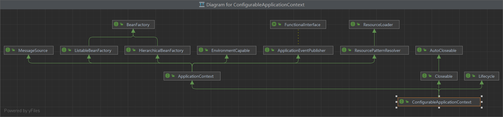

# Spring高级49讲

2023年6月14日18:00

# 容器与 Bean

## 第一讲 容器接口

### 1 BeanFactory 能做哪些事



* BeanFactory 接口，典型功能有：
  * `getBean`

* 到底什么是 BeanFactory

  - 它是 ApplicationContext 的父接口
  - 它才是 Spring 的核心容器, 主要的 ApplicationContext 实现都【组合】了它的功能，【组合】是指 ApplicationContext 的一个重要成员变量就是 BeanFactory

* BeanFactory 能干点啥
  - 表面上只有 getBean
  - 实际上控制反转、基本的依赖注入、直至 Bean 的生命周期的各种功能，都由它的实现类提供
  - 例子中通过反射查看了它的成员变量`singletonObjects`，内部包含了所有的单例 bean
  - 如果 jdk > 8, 运行时请添加`--add-opens java.base/java.lang=ALL-UNNAMED`，这是因为这些版本的 jdk 默认不允许跨 module 反射

```java
// 通过反射拿到了这个 hashmap：singletonObjects
Field singletonObjects = DefaultSingletonBeanRegistry.class.getDeclaredField("singletonObjects");
singletonObjects.setAccessible(true);
ConfigurableListableBeanFactory beanFactory = context.getBeanFactory();
// 使用刚刚拿到的这个 singletonObjects 取 beanFactory 里面的具体的那个 singletonObjects
Map<String, Object> map = (Map<String, Object>) singletonObjects.get(beanFactory);
map.entrySet().stream().filter(e -> e.getKey().startsWith("component"))
    .forEach(e -> System.out.println(e.getKey() + "=" + e.getValue()));
```

### 2 ApplicationContext 有哪些扩展功能

ApplicationContext 接口，是 BeanFactory 的子接口。它扩展了 BeanFactory 接口的功能，如：

#### 2.1 国际化

```java
public class TestMessageSource {
    public static void main(String[] args) {
        GenericApplicationContext context = new GenericApplicationContext();

        context.registerBean("messageSource", MessageSource.class, () -> {
            ResourceBundleMessageSource ms = new ResourceBundleMessageSource();
            ms.setDefaultEncoding("utf-8");
            ms.setBasename("messages");
            return ms;
        });

        context.refresh();

        System.out.println(context.getMessage("hi", null, Locale.ENGLISH));
        System.out.println(context.getMessage("hi", null, Locale.CHINESE));
        System.out.println(context.getMessage("hi", null, Locale.JAPANESE));
    }
}
```

- 国际化文件均在 src/resources 目录下

  - messages.properties（空）

  - messages_en.properties

    ```properties
    hi=Hello
    ```

  - messages_ja.properties

    ```properties
    hi=こんにちは
    ```

  - messages_zh.properties

    ```properties
    hi=你好
    ```

- 注意
  - ApplicationContext 中 MessageSource bean 的名字固定为 messageSource
  - 使用 SpringBoot 时，国际化文件名固定为 messages
  - 空的 messages.properties 也必须存在

#### 2.2 通配符方式获取一组 Resource 资源

```java
Resource[] resources = context.getResources("classpath*:META-INF/spring.factories");
for (Resource resource : resources) {
    System.out.println(resource);
}
```

#### 2.3 整合 Environment 环境（能通过它获取各种来源的配置信息）

```java
System.out.println(context.getEnvironment().getProperty("java_home"));  // 环境变量可以不分大小小
System.out.println(context.getEnvironment().getProperty("server.port"));
```

#### 2.4 事件发布与监听，实现组件之间的解耦

> 事件发布还可以异步，这个视频中没有展示，请自行查阅`@EnableAsync`，`@Async`的用法


