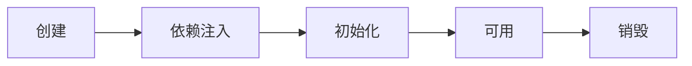

# Spring高级49讲

2023年6月14日18:00

# 容器与 Bean

## 第一讲 容器接口

### 1 BeanFactory 能做哪些事


* BeanFactory 接口，典型功能有：
  * `getBean`

* 到底什么是 BeanFactory

  - 它是 ApplicationContext 的父接口
  - 它才是 Spring 的核心容器, 主要的 ApplicationContext 实现都【组合】了它的功能，【组合】是指 ApplicationContext 的一个重要成员变量就是 BeanFactory

* BeanFactory 能干点啥
  - 表面上只有 getBean
  - 实际上控制反转、基本的依赖注入、直至 Bean 的生命周期的各种功能，都由它的实现类提供
  - 例子中通过反射查看了它的成员变量`singletonObjects`，内部包含了所有的单例 bean
  - 如果 jdk > 8, 运行时请添加`--add-opens java.base/java.lang=ALL-UNNAMED`，这是因为这些版本的 jdk 默认不允许跨 module 反射

```java
// 通过反射拿到了这个 hashmap：singletonObjects
Field singletonObjects = DefaultSingletonBeanRegistry.class.getDeclaredField("singletonObjects");
singletonObjects.setAccessible(true);
ConfigurableListableBeanFactory beanFactory = context.getBeanFactory();
// 使用刚刚拿到的这个 singletonObjects 取 beanFactory 里面的具体的那个 singletonObjects
Map<String, Object> map = (Map<String, Object>) singletonObjects.get(beanFactory);
map.entrySet().stream().filter(e -> e.getKey().startsWith("component"))
    .forEach(e -> System.out.println(e.getKey() + "=" + e.getValue()));
```

### 2 ApplicationContext 有哪些扩展功能

ApplicationContext 接口，是 BeanFactory 的子接口。它扩展了 BeanFactory 接口的功能，如：

#### 2.1 国际化

```java
public class TestMessageSource {
    public static void main(String[] args) {
        GenericApplicationContext context = new GenericApplicationContext();

        context.registerBean("messageSource", MessageSource.class, () -> {
            ResourceBundleMessageSource ms = new ResourceBundleMessageSource();
            ms.setDefaultEncoding("utf-8");
            ms.setBasename("messages");
            return ms;
        });

        context.refresh();

        System.out.println(context.getMessage("hi", null, Locale.ENGLISH));
        System.out.println(context.getMessage("hi", null, Locale.CHINESE));
        System.out.println(context.getMessage("hi", null, Locale.JAPANESE));
    }
}
```

- 国际化文件均在 src/resources 目录下

  - messages.properties（空）

  - messages_en.properties

    ```properties
    hi=Hello
    ```

  - messages_ja.properties

    ```properties
    hi=こんにちは
    ```

  - messages_zh.properties

    ```properties
    hi=你好
    ```

- 注意
  - ApplicationContext 中 MessageSource bean 的名字固定为 messageSource
  - 使用 SpringBoot 时，国际化文件名固定为 messages
  - 空的 messages.properties 也必须存在

#### 2.2 通配符方式获取一组 Resource 资源

```java
Resource[] resources = context.getResources("classpath*:META-INF/spring.factories");
for (Resource resource : resources) {
    System.out.println(resource);
}
```

#### 2.3 整合 Environment 环境（能通过它获取各种来源的配置信息）

```java
System.out.println(context.getEnvironment().getProperty("java_home"));  // 环境变量可以不分大小小
System.out.println(context.getEnvironment().getProperty("server.port"));
```

#### 2.4 事件发布与监听，实现组件之间的解耦

> - 事件发布还可以异步，这个视频中没有展示，请自行查阅`@EnableAsync`，`@Async`的用法
> - 这也是设计模式中 发布-订阅模式、观察者模式的一种实现。
> - 观察者模式：简单的来讲就是你在做事情的时候身边有人在盯着你，当你做的某一件事情是旁边观察的人感兴趣的事情的时候，他会根据这个事情做一些其他的事，但是盯着你看的人必须要到你这里来登记，否则你无法通知到他（或者说他没有资格来盯着你做事情）。

- 比如说，我们先定义一个事件

```java
import org.springframework.context.ApplicationEvent;

// 继承事件
public class UserRegisteredEvent extends ApplicationEvent {
    public UserRegisteredEvent(Object source) {
        super(source);
    }
}
```

- 定义一个监视器

  自己定义的监听器需要实现ApplicationListener，同时泛型参数要加上自己要监听的事件Class名，在重写的方法onApplicationEvent中，添加自己的业务处理：

```java
@Component
public class MyNoAnnotationListener implements ApplicationListener<MyTestEvent> {

    @Override
    public void onApplicationEvent(MyTestEvent event) {
        System.out.println("非注解监听器：" + event.getMsg());
    }
}

```

- 也可以用注解`@EventListener`

```java
@Component
public class Component2 {

    private static final Logger log = LoggerFactory.getLogger(Component2.class);

    // 监听事件
    @EventListener
    public void aaa(UserRegisteredEvent event) {
        log.debug("监听到事件：{}", event);
        log.debug("发送短信");
    }

}
```

- 事件发布

  有了事件，有了事件监听者，那么什么时候触发这个事件呢？每次想让监听器收到事件通知的时候，就可以调用一下事件发布的操作。首先在类里自动注入了`ApplicationEventPublisher`，这个也就是我们的`ApplicationContext`，它实现了这个接口。

```java
@Component
public class MyTestEventPubLisher {
    
    @Autowired
    private ApplicationEventPublisher applicationEventPublisher;

    /**
     *  事件发布方法
      */
    public void pushListener(String msg) {
        applicationEventPublisher.publishEvent(new MyTestEvent(this, msg));
    }
}
```

- 举个例子

  我们想用户注册后，继续执行一部分逻辑，但是这部分逻辑是不定的，不能直接写死，所以需要解耦

```java
import org.slf4j.Logger;
import org.slf4j.LoggerFactory;
import org.springframework.beans.factory.annotation.Autowired;
import org.springframework.context.ApplicationContext;
import org.springframework.stereotype.Component;

@Component
public class Component1 {

    private static final Logger log = LoggerFactory.getLogger(Component1.class);

    @Autowired
    private ApplicationContext context;

    public void register() {
        log.debug("用户注册");
        // 用户注册后 后续逻辑不确定 所以不能定死了 因此可以发一个事件
        context.publishEvent(new UserRegisteredEvent(this));
    }

}
```

## 第二讲 容器实现

### 1 BeanFactory实现的特点

* beanFactory 可以通过 registerBeanDefinition 注册一个 bean definition 对象
  * 我们平时使用的配置类、xml、组件扫描等方式都是生成 bean definition 对象注册到 beanFactory 当中
  * bean definition 描述了这个 bean 的创建蓝图：scope 是什么、用构造还是工厂创建、初始化销毁方法是什么，等等
* beanFactory 需要手动调用 beanFactory 后处理器对它做增强
  * 例如通过解析 @Bean、@ComponentScan 等注解，来补充一些 bean definition
* beanFactory 需要手动添加 bean 后处理器，以便对后续 bean 的创建过程提供增强
  * 例如 @Autowired，@Resource 等注解的解析都是 bean 后处理器完成的
  * bean 后处理的添加顺序会对解析结果有影响，见视频中同时加 @Autowired，@Resource 的例子
* beanFactory 需要手动调用方法来初始化单例
* beanFactory 需要额外设置才能解析 ${} 与 #{}

```java
package com.itheima.a02;

import org.slf4j.Logger;
import org.slf4j.LoggerFactory;
import org.springframework.beans.factory.annotation.Autowired;
import org.springframework.beans.factory.config.BeanFactoryPostProcessor;
import org.springframework.beans.factory.config.BeanPostProcessor;
import org.springframework.beans.factory.support.AbstractBeanDefinition;
import org.springframework.beans.factory.support.BeanDefinitionBuilder;
import org.springframework.beans.factory.support.DefaultListableBeanFactory;
import org.springframework.context.annotation.AnnotationConfigUtils;
import org.springframework.context.annotation.Bean;
import org.springframework.context.annotation.Configuration;
import org.springframework.core.Ordered;
import org.springframework.stereotype.Component;

import javax.annotation.Resource;

public class TestBeanFactory {

    public static void main(String[] args) {
        DefaultListableBeanFactory beanFactory = new DefaultListableBeanFactory();

        // 描述 bean 的定义（class, scope, 初始化, 销毁）
        AbstractBeanDefinition beanDefinition = BeanDefinitionBuilder
                .genericBeanDefinition(Config.class)  // 通过 class
                .setScope("singleton")  // 单例还是多例
                .getBeanDefinition();  // 最后得到 BeanDefinition
        // 注册 这个时候 beanFactory 就有了一个名字叫 config 的单例，类型是 Config
        beanFactory.registerBeanDefinition("config", beanDefinition);  // 第一个是名字
        // 验证一下 看看是不是有
        for (String name : beanFactory.getBeanDefinitionNames()) {
            System.out.println(name);
        }
        // 但是但是 这个地方只输出了刚刚添加的 config
        // 而没有解析里面的注解
        System.out.println("*********************************");

        // 给 BeanFactory 添加一些常用的后处理器
        // 添加了 后处理器到 bean 工厂里面 注意只是添加了
        AnnotationConfigUtils.registerAnnotationConfigProcessors(beanFactory);
        // 验证一下 看看是不是有
        for (String name : beanFactory.getBeanDefinitionNames()) {
            System.out.println(name);
        }
        /*
            输出了这些
            config
            org.springframework.context.annotation.internalConfigurationAnnotationProcessor
            org.springframework.context.annotation.internalAutowiredAnnotationProcessor
            org.springframework.context.annotation.internalCommonAnnotationProcessor
            org.springframework.context.event.internalEventListenerProcessor
            org.springframework.context.event.internalEventListenerFactory
         */
        System.out.println("*********************************");

        // 所以我们把 bean 工厂里面的后处理器取出来 去执行他们
        // BeanFactory 后处理器主要功能，补充了一些 bean 定义
        beanFactory.getBeansOfType(BeanFactoryPostProcessor.class)
                .values()  // 返回的 map 集合 我们只需要集合的值
                .forEach(beanFactoryPostProcessor -> {
                    beanFactoryPostProcessor.postProcessBeanFactory(beanFactory);
                });
        // 验证一下 看看是不是有
        for (String name : beanFactory.getBeanDefinitionNames()) {
            System.out.println(name);
        }
        /*
            config
            org.springframework.context.annotation.internalConfigurationAnnotationProcessor
            org.springframework.context.annotation.internalAutowiredAnnotationProcessor
            org.springframework.context.annotation.internalCommonAnnotationProcessor
            org.springframework.context.event.internalEventListenerProcessor
            org.springframework.context.event.internalEventListenerFactory
            bean1
            bean2
            bean3
            bean4
         */
        System.out.println("*********************************");

        // 虽然 bean1 放进去了 但是 bean1 中 @Autowired 的 bean2 没有放进去
        System.out.println(beanFactory.getBean(Bean1.class).getBean2());
        // [DEBUG] 16:30:50.256 [main] c.itheima.a02.TestBeanFactory$Bean1 - 构造 Bean1()
        // null

        // Bean 后处理器, 针对 bean 的生命周期的各个阶段提供扩展, 例如 @Autowired @Resource ...
        // addBeanPostProcessor: 建立 后处理器 和 bean 工厂的联系
        beanFactory.getBeansOfType(BeanPostProcessor.class).values().forEach(beanFactory::addBeanPostProcessor);
        System.out.println("+++++++++++" + beanFactory.getBean(Bean1.class).getBean2());


        for (String name : beanFactory.getBeanDefinitionNames()) {
            System.out.println(name);
        }

        beanFactory.preInstantiateSingletons(); // 准备好所有单例 否则只有用的时候 才会去创造 即延迟创建
        System.out.println(">>>>>>>>>>>>>>>>>>>>>>>>>>>>>>>>>>>> ");
        System.out.println(beanFactory.getBean(Bean1.class).getBean2());
        System.out.println(beanFactory.getBean(Bean1.class).getInter());

        System.out.println("Common:" + (Ordered.LOWEST_PRECEDENCE - 3));
        System.out.println("Autowired:" + (Ordered.LOWEST_PRECEDENCE - 2));
    }

    @Configuration
    static class Config {
        @Bean
        public Bean1 bean1() {
            return new Bean1();
        }

        @Bean
        public Bean2 bean2() {
            return new Bean2();
        }

        @Bean
        public Bean3 bean3() {
            return new Bean3();
        }

        @Bean
        public Bean4 bean4() {
            return new Bean4();
        }
    }

    interface Inter {

    }

    static class Bean3 implements Inter {

    }

    static class Bean4 implements Inter {

    }

    @Component
    static class Bean1 {
        private static final Logger log = LoggerFactory.getLogger(Bean1.class);

        public Bean1() {
            log.debug("构造 Bean1()");
        }

        @Autowired
        private Bean2 bean2;

        public Bean2 getBean2() {
            return bean2;
        }

        @Autowired
        @Resource(name = "bean4")
        private Inter bean3;

        public Inter getInter() {
            return bean3;
        }
    }

    static class Bean2 {
        private static final Logger log = LoggerFactory.getLogger(Bean2.class);

        public Bean2() {
            log.debug("构造 Bean2()");
        }
    }
}
```

### 2 ApplicationContext 的常见实现和用法

```xml
<?xml version="1.0" encoding="UTF-8"?>
<beans xmlns="http://www.springframework.org/schema/beans"
       xmlns:xsi="http://www.w3.org/2001/XMLSchema-instance"
       xsi:schemaLocation="http://www.springframework.org/schema/beans http://www.springframework.org/schema/beans/spring-beans.xsd">

    <bean id="bean1" class="com.itheima.a02.A02.Bean1"/>
    <bean id="bean2" class="com.itheima.a02.A02.Bean2">
        <property name="bean1" ref="bean1"/>
    </bean>

</beans>
```

```java
// ⬇️较为经典的容器, 基于 classpath 下 xml 格式的配置文件来创建
private static void testClassPathXmlApplicationContext() {
    ClassPathXmlApplicationContext context = new ClassPathXmlApplicationContext("b01.xml");

    for (String name : context.getBeanDefinitionNames()) {
        System.out.println(name);
    }
    // 可以看到 xml 文件中的 bean 成功注入了
    // bean1
    // bean2

    System.out.println(context.getBean(Bean2.class).getBean1());  // com.itheima.a02.A02$Bean1@209da20d
}

// ⬇️基于磁盘路径下 xml 格式的配置文件来创建
private static void testFileSystemXmlApplicationContext() {
    String configLocation = "E:\\程序员\\4、Spring高级四十九讲\\代码\\show\\src\\main\\resources\\b01.xml";
    FileSystemXmlApplicationContext context = new FileSystemXmlApplicationContext(configLocation);

    for (String name : context.getBeanDefinitionNames()) {
        System.out.println(name);
    }

    System.out.println(context.getBean(Bean2.class).getBean1());
}
```

```java
// ⬇️较为经典的容器, 基于 java 配置类来创建
private static void testAnnotationConfigApplicationContext() {
    AnnotationConfigApplicationContext context = new AnnotationConfigApplicationContext(Config.class);

    for (String name : context.getBeanDefinitionNames()) {
        System.out.println(name);
    }

    System.out.println(context.getBean(Bean2.class).getBean1());
}

@Configuration
static class Config {
    @Bean
    public Bean1 bean1() {
        return new Bean1();
    }

    @Bean
    public Bean2 bean2(Bean1 bean1) {
        Bean2 bean2 = new Bean2();
        bean2.setBean1(bean1);
        return bean2;
    }
}

static class Bean1 {
}

static class Bean2 {

    private Bean1 bean1;

    public void setBean1(Bean1 bean1) {
        this.bean1 = bean1;
    }

    public Bean1 getBean1() {
        return bean1;
    }
}
```

之前是这个样子的

```java
private static void test() {
    DefaultListableBeanFactory beanFactory = new DefaultListableBeanFactory();
    System.out.println("读取之前的 bean ");
    for (String beanDefinitionName : beanFactory.getBeanDefinitionNames()) {
        System.out.println(beanDefinitionName);
    }

    System.out.println("读取之后的 bean ");
    XmlBeanDefinitionReader reader = new XmlBeanDefinitionReader(beanFactory);
    reader.loadBeanDefinitions(new ClassPathResource("b01.xml"));
    for (String beanDefinitionName : beanFactory.getBeanDefinitionNames()) {
        System.out.println(beanDefinitionName);
    }
}
```

### 3 内嵌容器、注册 DispatcherServlet

```java
// ⬇️较为经典的容器, 基于 java 配置类来创建, 用于 web 环境
private static void testAnnotationConfigServletWebServerApplicationContext() {
    AnnotationConfigApplicationContext context = new AnnotationConfigApplicationContext(WebConfig.class);

    for (String name : context.getBeanDefinitionNames()) {
        System.out.println(name);
    }
}

@Configuration
static class WebConfig {
    @Bean
    public ServletWebServerFactory servletWebServerFactory(){
        return new TomcatServletWebServerFactory();
    }
    @Bean
    public DispatcherServlet dispatcherServlet() {
        return new DispatcherServlet();
    }
    @Bean
    public DispatcherServletRegistrationBean registrationBean(DispatcherServlet dispatcherServlet) {
        // 把 DispatcherServlet 注册到 TomcatServletWebServerFactory
        return new DispatcherServletRegistrationBean(dispatcherServlet, "/");
    }
    @Bean("/hello")
    public Controller controller1() {
        return (request, response) -> {
            response.getWriter().print("hello");
            return null;
        };
    }
}
```

## 第三讲

### 1 Spring bean 生命周期各个阶段



- 类的初始化

  是完成程序执行前的准备工作。在这个阶段，**静态的**（变量，方法，代码块）会被执行。同时在会开辟一块存储空间用来存放静态的数据。初始化只在类加载的时候执行一次

- 类的实例化（实例化对象）

  是指创建一个对象的过程。这个过程中会在堆中开辟内存，将一些**非静态**的方法，变量存放在里面。在程序执行的过程中，可以创建多个对象，既多次实例化。每次实例化都会开辟一块新的内存。（就是调用构造函数）

```java
@Component
public class LifeCycleBean {
    private static final Logger log = LoggerFactory.getLogger(LifeCycleBean.class);

    // 构造方法
    public LifeCycleBean() {
    log.debug("构造");
    }

    // 依赖注入的方法
    @Autowired
    public void autowire(@Value("${JAVA_HOME}") String home) {
    log.debug("依赖注入: {}", home);
    }

    // 初始化方法
    @PostConstruct
    public void init() {
    log.debug("初始化");
    }

    // 销毁的方法
    @PreDestroy
    public void destroy() {
    log.debug("销毁");
    }
}
```

- 创建前后的增强

  * postProcessBeforeInstantiation
    * 这里返回的对象若不为 null 会替换掉原本的 bean，并且仅会走 postProcessAfterInitialization 流程

  * postProcessAfterInstantiation
    * 这里如果返回 false 会跳过依赖注入阶段

- 依赖注入前的增强

  * postProcessProperties
    * 如 @Autowired、@Value、@Resource 

- 初始化前后的增强

  * postProcessBeforeInitialization
    * 这里返回的对象会替换掉原本的 bean
    * 如 @PostConstruct、@ConfigurationProperties

  * postProcessAfterInitialization 
    * 这里返回的对象会替换掉原本的 bean
    * 如代理增强

- 销毁之前的增强

  * postProcessBeforeDestruction
    * 如 @PreDestroy 

```java
@Component
public class MyBeanPostProcessor implements InstantiationAwareBeanPostProcessor, DestructionAwareBeanPostProcessor {

    private static final Logger log = LoggerFactory.getLogger(MyBeanPostProcessor.class);

    @Override
    public void postProcessBeforeDestruction(Object bean, String beanName) throws BeansException {
        if (beanName.equals("lifeCycleBean"))
            log.debug("<<<<<< 销毁之前执行, 如 @PreDestroy");
    }

    @Override
    public Object postProcessBeforeInstantiation(Class<?> beanClass, String beanName) throws BeansException {
        if (beanName.equals("lifeCycleBean"))
            log.debug("<<<<<< 实例化之前（还没有调用构造方法）执行, 这里返回的对象会替换掉原本的 bean");
        return null;
    }

    @Override
    public boolean postProcessAfterInstantiation(Object bean, String beanName) throws BeansException {
        if (beanName.equals("lifeCycleBean")) {
            log.debug("<<<<<< 实例化之后执行, 这里如果返回 false 会跳过依赖注入阶段");
//            return false;
        }
        return true;  // 还会执行后续依赖注入的阶段
    }

    @Override
    public PropertyValues postProcessProperties(PropertyValues pvs, Object bean, String beanName) throws BeansException {
        if (beanName.equals("lifeCycleBean"))
            log.debug("<<<<<< 依赖注入阶段执行, 如 @Autowired、@Value、@Resource");
        return pvs;
    }

    @Override
    public Object postProcessBeforeInitialization(Object bean, String beanName) throws BeansException {
        if (beanName.equals("lifeCycleBean"))
            log.debug("<<<<<< 初始化之前执行, 这里返回的对象会替换掉原本的 bean, 如 @PostConstruct、@ConfigurationProperties");
        return bean;
    }

    @Override
    public Object postProcessAfterInitialization(Object bean, String beanName) throws BeansException {
        if (beanName.equals("lifeCycleBean"))
            log.debug("<<<<<< 初始化之后执行, 这里返回的对象会替换掉原本的 bean, 如代理增强");
        return bean;
    }
}
```

### 2 模板设计模式

- 模板模式

  模板模式（Template Pattern），定义一个操作中算法的骨架，而将一些步骤延迟到子类中，模板方法使得子类可以不改变算法的结构，只是重定义该算法的某些特定步骤。这种类型的设计模式属于行为型模式。

- 模板模式解决的问

  一些方法通用，却在每一个子类都重新写了这一方法，带来大量重复的代码的问题。相同的部分父类给出统一的模板，不同的部分，子类进行重写。

```java
public class TestMethodTemplate {

    public static void main(String[] args) {
        MyBeanFactory beanFactory = new MyBeanFactory();
        // 添加后处理器
        beanFactory.addBeanPostProcessor(bean -> System.out.println("解析 @Autowired"));
        beanFactory.addBeanPostProcessor(bean -> System.out.println("解析 @Resource"));
        beanFactory.getBean();
    }

    // 模板方法  Template Method Pattern
    static class MyBeanFactory {
        public Object getBean() {
            Object bean = new Object();
            System.out.println("构造 " + bean);
            System.out.println("依赖注入 " + bean); // @Autowired, @Resource

            // 循环 执行所有的后处理器
            for (BeanPostProcessor processor : processors) {
                processor.inject(bean);
            }

            System.out.println("初始化 " + bean);
            return bean;
        }

        // 后处理器集合
        private List<BeanPostProcessor> processors = new ArrayList<>();
        // 都添加进去
        public void addBeanPostProcessor(BeanPostProcessor processor) {
            processors.add(processor);
        }
    }

    static interface BeanPostProcessor {
        public void inject(Object bean); // 对依赖注入阶段的扩展
    }
}
```

## 第四讲 Bean 后处理器


