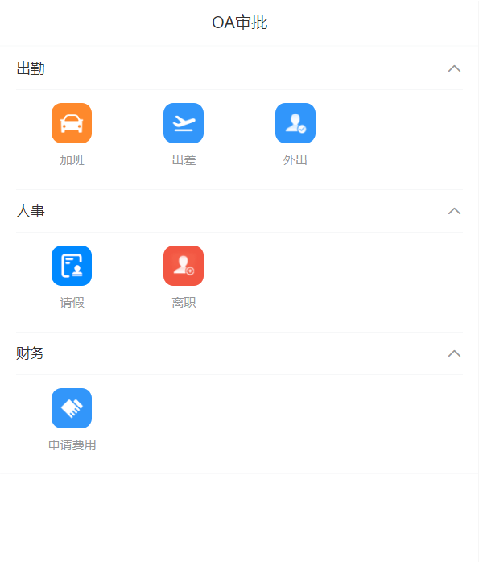
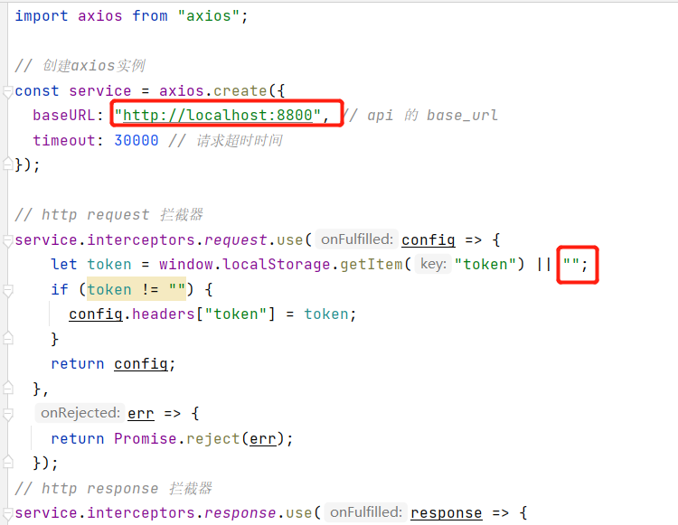
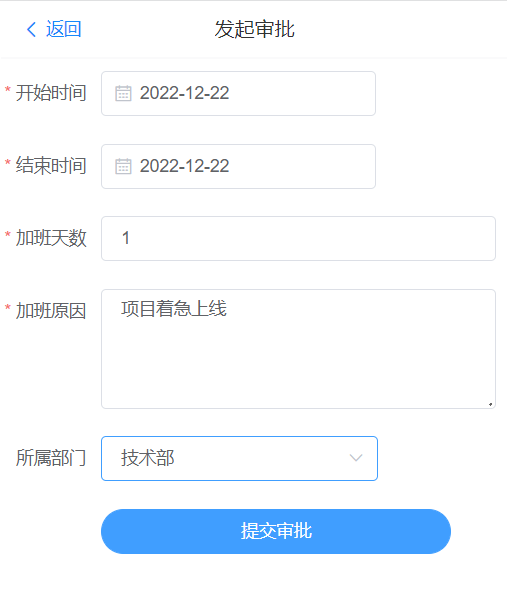
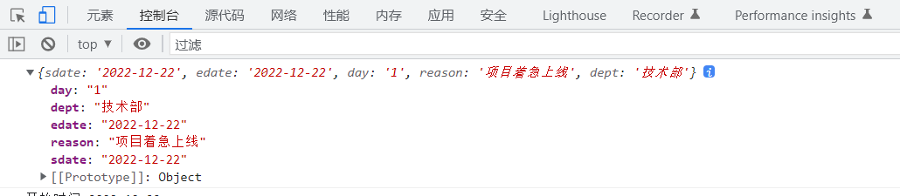
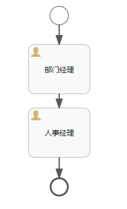
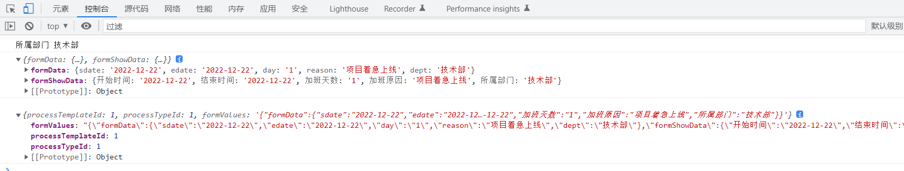
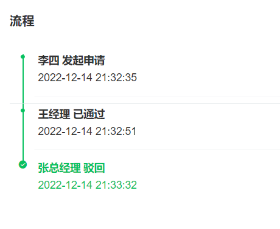

# 云尚办公系统：员工端审批

## 一、功能说明

后台管理已经把审批都设计好了，员工就可以通过移动端提交需要的审批申请了，接下来就是Activiti审批的核心流程部分。审批负责人审批包含：审批通过与审批拒绝，审批通过后自动到下一个审批节点，审批拒绝直接到结束节点，流程结束。


## 二、员工端审批

### 1、OA审批

OA审批在移动端，公司员工使用，如图所示：



#### 1.1、查询审批分类与模板接口

获取审批分类与对应的审批模板

##### 1.1.1、定义service接口

操作类：ProcessTypeService

```java
List<ProcessType> findProcessType();
```

##### 1.1.2、service接口实现

```java
@Autowired
private ProcessTemplateService processTemplateService;
	
@Override
public List<ProcessType> findProcessType() {
    //1 查询所有审批分类，返回list集合
    List<ProcessType> processTypeList = baseMapper.selectList(null);

    //2 遍历返回所有审批分类list集合
    for (ProcessType processType:processTypeList) {
        //3 得到每个审批分类，根据审批分类id查询对应审批模板
        //审批分类id
        Long typeId = processType.getId();
        //根据审批分类id查询对应审批模板
        LambdaQueryWrapper<ProcessTemplate> wrapper = new LambdaQueryWrapper<>();
        wrapper.eq(ProcessTemplate::getProcessTypeId,typeId);
        List<ProcessTemplate> processTemplateList = processTemplateService.list(wrapper);

        //4 根据审批分类id查询对应审批模板数据（List）封装到每个审批分类对象里面
        processType.setProcessTemplateList(processTemplateList);
    }
    return processTypeList;
}
```

##### 1.1.3、controller接口

创建类 ProcessApiController

```java
@Api(tags = "审批流管理")
@RestController
@RequestMapping(value="/admin/process")
@CrossOrigin  //跨域
public class ProcessApiController {
    
    @Autowired
    private ProcessTypeService processTypeService;

    @ApiOperation(value = "获取全部审批分类及模板")
    @GetMapping("findProcessType")
    public Result findProcessType() {
       return Result.ok(processTypeService.findProcessType());
    }
}
```

#### 1.2、前端开发

##### 1.2.1、引用前端开发环境

从资源库引入前端项目框架：guigu-oa-web，该框架包含了静态资源页面，我们直接使用。

第一步：安装依赖

```shell
npm install
```

第二步：启动

```shell
npm run serve
```

第三步：更改配置

1、更改src/utils/request.js文件api base路径

2、更改src/utils/request.js文件token信息，

**在idea使用token工具生成临时token使用，后续会完善微信授权登录**



##### 1.2.2、定义api接口

创建src/api/process.js

```javascript
import request from '@/utils/request'

const api_name = '/admin/process'

export default {

  findProcessType() {
    return request({
      url: `${api_name}/findProcessType`,
      method: 'get'
    })
  }
}
```

##### 1.2.3、添加路由

在src/router/index.js添加路由

```javascript
{
  path: '/',
  name: 'OA审批',
  component: () =>
    import('../views/index.vue'),
}
```

##### 1.2.4、页面渲染

**views/index.vue页面**

```vue
<template>
  <div>
    <div class="container">
      <van-nav-bar
        title="OA审批"
      />
      <van-collapse v-model="activeNames">
        <van-collapse-item
          v-for="(item,key) in list"
          :title="item.name"
          :name="item.key">
          <van-row>
            <van-col v-for="template in item.processTemplateList" :key="template.id" span="6">
              <div class="item" @click="apply(template.id)">
                
                <span>{{template.name}}</span>
              </div>
            </van-col>
          </van-row>
        </van-collapse-item>
      </van-collapse>
    </div>
  </div>
</template>
<script>
import api from '@/api/process'
export default {
  name: "process",
  data() {
    return {
      list: [],
      activeNames: [0,1,2,3,4]
    };
  },
  created(){
    this.fetchData();
  },
  methods: {
    fetchData() {
      api.findProcessType().then(response => {
        console.log(response.data);
        this.list = response.data;
        //全部展开
        this.activeNames = []
        this.list.forEach((item,index) => {
          this.activeNames.push(index)
        })
      });
    },
    apply(id) {
      this.$router.push({ path: '/apply/'+id })
    }
  }
}
</script>
<style lang="scss" scoped>
.container {
  padding-bottom: 50px;
  .item {
    display: flex;
    flex-direction: column;
    align-items: center;
    justify-content: center;
    img {
      width: 40px;
      height: 40px;
      border-radius: 10px;
    }
    span {
      font-size: 12px;
      padding: 8px 4px;
      text-align: center;
    }
  }
}
</style>
```


### 2、审批申请

根据审批模板渲染动态表单，根据动态表单启动流程实例

#### 2.1、获取审批模板数据

操作类：ProcessApiController

```java
@Autowired
private ProcessTemplateService processTemplateService;

@ApiOperation(value = "获取审批模板")
@GetMapping("getProcessTemplate/{processTemplateId}")
public Result get(@PathVariable Long processTemplateId) {
   ProcessTemplate processTemplate = processTemplateService.getById(processTemplateId);
   return Result.ok(processTemplate);
}
```


#### 2.2、审批申请页面渲染

##### 2.2.1、定义接口

在src/api/process.js文件添加接口

```javascript
getProcessTemplate(processTemplateId) {
  return request({
    url: `${api_name}/getProcessTemplate/`+processTemplateId,
    method: 'get'
  })
}
```

##### 2.2.2、渲染动态表单

初始化环境已集成：form-create组件，我们将表单设计器组件保存的数据直接渲染即可

创建src/views/apply.vue

```vue
<template>
  <div>
    <van-nav-bar
      title="发起审批"
      left-text="返回"
      left-arrow
      @click-left="() => $router.back()"
    />
    <div style="margin: 10px 10px 0 0;border: 0px solid red;">
    <form-create
      :rule="rule"
      :option="option"
      @submit="onSubmit"
    ></form-create>
    </div>
  </div>
</template>

<script>
import api from "@/api/process";

export default {
  name: "process",

  data() {
    return {
      processTemplateprocessTemplate: null,
      rule: [],
      option: {}
    };
  },

  created() {
    let processTemplateId = this.$route.params.processTemplateId;
    this.fetchData(processTemplateId);
  },

  methods: {
    fetchData(processTemplateId) {
      api.getProcessTemplate(processTemplateId).then(response => {
        console.log(response.data);
        this.processTemplate = response.data;

        this.rule = JSON.parse(this.processTemplate.formProps);
        this.option = JSON.parse(this.processTemplate.formOptions);
      });
    },

    onSubmit(formData) {
		console.log(formData)
    }
  }
};
</script>

<style lang="scss" scoped>
.el-form {
  .el-form-item {
    /deep/ .el-form-item__label {
      font-size: 18px;
      font-weight: 800;
      color: blue;
    }
  }
}
</style>
```

##### 2.2.3、测试

我们以加班为例，其他都可以



提交打印数据：



打印数据为我们自定义表单属性与对于输入值。

后续这些数据有两方面用途：

​	1、审批详细展示

​	2、作为流程实例参数，判断流程走向，如下图：



##### 2.2.4、封装提交数据

```javascript
onSubmit(formData) {
  console.log(formData)
  let formShowData = {};
  this.rule.forEach(item => {
    for (let key in formData) {
      if (key === item.field) {
        console.log(item.title, formData[key]);
        formShowData[item.title] = formData[key];
      }
    }
  });
  let DATA = {
    formData: formData,
    formShowData: formShowData
  };
  console.log(DATA);
  let processFormVo = {
    "processTemplateId": this.processTemplate.id,
    "processTypeId": this.processTemplate.processTypeId,
    "formValues": JSON.stringify(DATA)
  };
  console.log(processFormVo)
}
```

打印数据



我们把表单数据转换2部分：formData表单数据，formShowData表单展示数据，构造成为一个formValues属性 json对象，后续使用时可方便获取


#### 2.3、启动流程实例

##### 2.3.1、修改认证过滤器

**spring-security模块添加工具类，通过ThreadLocal记录当前登录人信息**

```java
package com.atguigu.security.custom;

/**
 * 获取当前用户信息帮助类
 */
public class LoginUserInfoHelper {

    private static ThreadLocal<Long> userId = new ThreadLocal<Long>();
    private static ThreadLocal<String> username = new ThreadLocal<String>();

    public static void setUserId(Long _userId) {
        userId.set(_userId);
    }
    public static Long getUserId() {
        return userId.get();
    }
    public static void removeUserId() {
        userId.remove();
    }
    public static void setUsername(String _username) {
        username.set(_username);
    }
    public static String getUsername() {
        return username.get();
    }
    public static void removeUsername() {
        username.remove();
    }
}
```

**修改过滤器TokenAuthenticationFilter**

添加以下内容

```java
/**
 * <p>
 * 认证解析token过滤器
 * </p>
 */
public class TokenAuthenticationFilter extends OncePerRequestFilter {

...................
    
    private UsernamePasswordAuthenticationToken getAuthentication(HttpServletRequest request) {
    
        ....................
            
            if (!StringUtils.isEmpty(username)) {
                //通过ThreadLocal记录当前登录人信息
                LoginUserInfoHelper.setUserId(JwtHelper.getUserId(token));
                LoginUserInfoHelper.setUsername(username);
                
        ....................
            
    }
}
```


##### 2.3.2、封装启动流程对象

对于审批申请属性

```java
@Data
@ApiModel(description = "流程表单")
public class ProcessFormVo {

   @ApiModelProperty(value = "审批模板id")
   private Long processTemplateId;

   @ApiModelProperty(value = "审批类型id")
   private Long processTypeId;

   @ApiModelProperty(value = "表单值")
   private String formValues;

}
```

##### 2.3.3、service实现功能

```java
    @Autowired
    private ProcessTemplateService processTemplateService;

    @Autowired
    private SysUserService sysUserService;

    @Autowired
    private RuntimeService runtimeService;

    @Autowired
    private TaskService taskService;

    public void startUp(ProcessFormVo processFormVo) {
        SysUser sysUser = sysUserService.getById(LoginUserInfoHelper.getUserId());

        ProcessTemplate processTemplate = processTemplateService.getById(processFormVo.getProcessTemplateId());
        Process process = new Process();
        BeanUtils.copyProperties(processFormVo, process);
        String workNo = System.currentTimeMillis() + "";
        process.setProcessCode(workNo);
        process.setUserId(LoginUserInfoHelper.getUserId());
        process.setFormValues(processFormVo.getFormValues());
        process.setTitle(sysUser.getName() + "发起" + processTemplate.getName() + "申请");
        process.setStatus(1);
        processMapper.insert(process);

        //绑定业务id
        String businessKey = String.valueOf(process.getId());
        //流程参数
        Map<String, Object> variables = new HashMap<>();
        //将表单数据放入流程实例中
        JSONObject jsonObject = JSON.parseObject(process.getFormValues());
        JSONObject formData = jsonObject.getJSONObject("formData");
        Map<String, Object> map = new HashMap<>();
        //循环转换
        for (Map.Entry<String, Object> entry : formData.entrySet()) {
            map.put(entry.getKey(), entry.getValue());
        }
        variables.put("data", map);
        ProcessInstance processInstance = runtimeService.startProcessInstanceByKey(processTemplate.getProcessDefinitionKey(), businessKey, variables);
        //业务表关联当前流程实例id
        String processInstanceId = processInstance.getId();
        process.setProcessInstanceId(processInstanceId);

        //计算下一个审批人，可能有多个（并行审批）
        List<Task> taskList = this.getCurrentTaskList(processInstanceId);
        if (!CollectionUtils.isEmpty(taskList)) {
            List<String> assigneeList = new ArrayList<>();
            for(Task task : taskList) {
                SysUser user = sysUserService.getByUsername(task.getAssignee());
                assigneeList.add(user.getName());

                //推送消息给下一个审批人，后续完善
            }
            process.setDescription("等待" + StringUtils.join(assigneeList.toArray(), ",") + "审批");
        }
        processMapper.updateById(process);
    }

    /**
     * 获取当前任务列表
     * @param processInstanceId
     * @return
     */
    private List<Task> getCurrentTaskList(String processInstanceId) {
        List<Task> tasks = taskService.createTaskQuery().processInstanceId(processInstanceId).list();
        return tasks;
    }
```

##### 2.3.4、controller接口

```java
@Autowired
private ProcessService processService;

@ApiOperation(value = "启动流程")
@PostMapping("/startUp")
public Result start(@RequestBody ProcessFormVo processFormVo) {
   processService.startUp(processFormVo);
   return Result.ok();
}
```


#### 2.4、更新前端提交接口

1、添加api接口

```javascript
startUp(processFormVo) {
  return request({
    url: `${api_name}/startUp`,
    method: 'post',
    data: processFormVo
  })
},
```

2、更新提交接口

```javascript
onSubmit(formData) {
  ...
  console.log(processFormVo)
  api.startUp(processFormVo).then(response => {
    //调整到已发起列表
    this.$router.push({ path: "/list/2" });
  });
}
```


#### 2.5、记录提交记录

类似下面数据



每个节点我们要记录操作行为

##### 2.5.1、mapper类

```java
package com.atguigu.process.mapper;

import com.atguigu.model.process.ProcessRecord;
import com.baomidou.mybatisplus.core.mapper.BaseMapper;
import org.apache.ibatis.annotations.Mapper;

@Mapper
public interface ProcessRecordMapper extends BaseMapper<ProcessRecord> {

}
```

##### 2.5.2、service接口

```java
package com.atguigu.process.service;

import com.atguigu.model.process.ProcessRecord;
import com.baomidou.mybatisplus.extension.service.IService;

public interface ProcessRecordService extends IService<ProcessRecord> {

    void record(Long processId, Integer status, String description);

}
```

##### 2.5.3、service接口

```java
package com.atguigu.process.service.impl;

import com.atguigu.model.process.ProcessRecord;
import com.atguigu.model.system.SysUser;
import com.atguigu.process.mapper.ProcessRecordMapper;
import com.atguigu.process.service.ProcessRecordService;
import com.atguigu.security.custom.LoginUserInfoHelper;
import com.atguigu.system.service.SysUserService;
import com.baomidou.mybatisplus.extension.service.impl.ServiceImpl;
import org.springframework.beans.factory.annotation.Autowired;
import org.springframework.stereotype.Service;

@Service
@SuppressWarnings({"unchecked", "rawtypes"})
public class ProcessRecordServiceImpl extends ServiceImpl<ProcessRecordMapper, ProcessRecord> implements ProcessRecordService {

   @Autowired
   private ProcessRecordMapper processRecordMapper;

   @Autowired
   private SysUserService sysUserService;

   @Override
   public void record(Long processId, Integer status, String description) {
      SysUser sysUser = sysUserService.getById(LoginUserInfoHelper.getUserId());
      ProcessRecord processRecord = new ProcessRecord();
      processRecord.setProcessId(processId);
      processRecord.setStatus(status);
      processRecord.setDescription(description);
      processRecord.setOperateUserId(sysUser.getId());
      processRecord.setOperateUser(sysUser.getName());
      processRecordMapper.insert(processRecord);
   }

}
```

##### 2.5.4、更改启动流程接口

```java
@Autowired
private ProcessRecordService processRecordService;

public void startUp(ProcessFormVo processFormVo) {
    ...

    //记录操作行为
    processRecordService.record(process.getId(), 1, "发起申请");
}
```


### 3、待处理列表

启动流程后，审批人就可以在待处理列表中获取审批列表了

#### 3.1、服务器端接口

##### 3.1.1、定义接口

```
IPage<ProcessVo> findPending(Page<Process> pageParam);
```

##### 3.1.2、接口实现

```java
@Override
public IPage<ProcessVo> findPending(Page<Process> pageParam) {
    // 根据当前人的ID查询
    TaskQuery query = taskService.createTaskQuery().taskAssignee(LoginUserInfoHelper.getUsername()).orderByTaskCreateTime().desc();
    List<Task> list = query.listPage((int) ((pageParam.getCurrent() - 1) * pageParam.getSize()), (int) pageParam.getSize());
    long totalCount = query.count();

    List<ProcessVo> processList = new ArrayList<>();
    // 根据流程的业务ID查询实体并关联
    for (Task item : list) {
        String processInstanceId = item.getProcessInstanceId();
        ProcessInstance processInstance = runtimeService.createProcessInstanceQuery().processInstanceId(processInstanceId).singleResult();
        if (processInstance == null) {
            continue;
        }
        // 业务key
        String businessKey = processInstance.getBusinessKey();
        if (businessKey == null) {
            continue;
        }
        Process process = this.getById(Long.parseLong(businessKey));
        ProcessVo processVo = new ProcessVo();
        BeanUtils.copyProperties(process, processVo);
        processVo.setTaskId(item.getId());
        processList.add(processVo);
    }
    IPage<ProcessVo> page = new Page<ProcessVo>(pageParam.getCurrent(), pageParam.getSize(), totalCount);
    page.setRecords(processList);
    return page;
}
```

##### 3.1.3、controller接口

```java
@ApiOperation(value = "待处理")
@GetMapping("/findPending/{page}/{limit}")
public Result findPending(
      @ApiParam(name = "page", value = "当前页码", required = true)
      @PathVariable Long page,

      @ApiParam(name = "limit", value = "每页记录数", required = true)
      @PathVariable Long limit) {
   Page<Process> pageParam = new Page<>(page, limit);
   return Result.ok(processService.findPending(pageParam));
}
```

#### 3.2、前端渲染

##### 3.2.1、定义api接口

在src/api/process.js添加接口

```javascript
findPending(page, limit) {
    return request({
      url: `${api_name}/findPending/`+page+`/`+ limit,
      method: 'get'
    })
  }
```

##### 3.2.2、添加路由

在src/router/index.js添加路由

列表有三个tab切换，activeIndex代表切换的序号，0：待审批 1：已审批 2：已发起

```javascript
{
    path: '/list/:activeIndex',
    name: '审批列表',
    component: () =>
      import('../views/list.vue'),
  },
```

##### 3.2.3、页面渲染

创建src/views/list.vue

```vue
<template>
  <div class="container">
    <van-nav-bar
      title="审批列表"
    />
    <van-tabs v-model="activeIndex" @click="tabSwitch">
      <van-tab
        v-for="(item,key) in tabList"
        :key="key"
        :title="item.title"
      >
      </van-tab>
    </van-tabs>

    <div class="list-wrap" >
      <van-pull-refresh v-model="refreshing" @refresh="onRefresh">
      <van-list
        v-model="loading"
        :finished="finished"
        finished-text="没有更多了"
        @load="onLoad"
        :immediate-check="false"
      >
        <van-cell v-for="item in list" :key="item.id" @click="info(item.id, item.taskId)">
          <template slot="default">
            <div class="item-wrap">
              <div class="item-header">
                
                <h3>{{item.title}}</h3>
                <span>{{item.createTime}}</span>
              </div>
              <div class="item-block">
                <p v-for="(value,key) in item.formValues.formShowData" v-if="key !== '图片'">{{ key }}：<span v-html="value"></span></p>
              </div>
              <div class="item-status">
                <span :class="item.status === 1 ? '审批中' : item.status === 2 ? 'pass' : 'refused'">{{ item.status === 1 ? '审批中' : item.status === 2 ? '审批通过' : '审批拒绝' }}</span>
              </div>
            </div>
          </template>
        </van-cell>
      </van-list>
      </van-pull-refresh>
    </div>
  </div>
</template>

<script>
import api from '@/api/process'
export default {
  name: "process",

  data() {
    return {
      list: [],
      loading: false,
      finished: false,
      refreshing: false,

      pageNo: 1,
      pageSize: 10,
      pages: 1,

      activeIndex: 0,
      tabList: [
        { title:"待处理", },
        { title:"已处理", },
        { title:"已发起", }
      ]
    };
  },

  created(){
    this.activeIndex = parseInt(this.$route.params.activeIndex);
    this.onLoad()
  },

  methods: {
    tabSwitch() {
      //tab切换，重新初始化数据
      this.list = []
      this.pageNo = 1
      this.finished = false

      //tabs切换时，如果之前的tab已经滚动到底部（list加载到底部），直接点击其他的tab，将再触发一次onload事件。
      //可能调用2次onLoad()方法，延迟执行，通过时间差解决问题
      setTimeout(() => {
        if(!this.finished) {
          this.onLoad();
        }
      }, 500);
    },

    onLoad() {
      if(this.activeIndex === 0) {
        this.findPending()
      }
      if(this.activeIndex === 1) {
        this.findProcessed()
      }
      if(this.activeIndex === 2) {
        this.findStarted()
      }
    },

    onRefresh() {
      // 清空列表数据
      this.finished = false;

      this.pageNo = 1;
      // 重新加载数据
      // 将 loading 设置为 true，表示处于加载状态
      this.loading = true;
      this.onLoad();
    },

    findPending() {
      console.log(this.pageNo)
      api.findPending(this.pageNo, this.pageSize).then(response => {
        console.log(response.data);
        if (this.refreshing) {
          this.list = [];
          this.refreshing = false;
        }
        for (let i=0;i<response.data.records.length;i++) {
          let item = response.data.records[i]
          item.formValues = JSON.parse(item.formValues)
          this.list.push(item);
        }
        this.pages = response.data.pages;

        this.loading = false;
        if(this.pageNo >= this.pages) {
          this.finished = true;
        }

        this.pageNo++;
      });
    },

    findProcessed() {
      
    },

    findStarted() {
      
    },

    info(id, taskId) {
      this.$router.push({ path: '/show/'+id+'/'+taskId })
    }
  }
}
</script>

<style lang="scss" scoped>
/deep/ .van-nav-bar {
  background: #1D1E20;
}
/deep/ .van-nav-bar__title {
  color: #fff;
}
.container {
  padding-bottom: 50px;
  .list-wrap {
    margin-top: 4px;
    border-top: 1px solid #ebedf0;
  }
  .item-wrap {
    font-size: 12px;
    color: #A7A8A9;
    .item-header {
      display: flex;
      align-items: center;
      img {
        width: 20px;
        height: 20px;
        border-radius: 4px;
        margin-right: 4px;
      }
      h3 {
        flex: 1;
        font-size: 15px;
        color: #000;
        padding: 0;
        margin: 0;
      }

    }

    .item-block {
      padding: 4px 0;
      font-size: 14px;
      p {
        padding: 0;
        margin: 0;
        line-height: 20px;
      }
    }
    .item-status {
      .pass {
        color: #4CB971;
      }
      .refused {
        color: #EB8473;
      }
    }
  }
}
</style>
```

##### 3.2.4、测试

当前是部门经理审批，切换token为部门经理账号，查看待审批

为了方便测试，我们做一个账号切换页面

1、添加路由

```js
{
  path: '/test',
  name: '切换测试账号',
  component: () =>
    import('../views/test.vue'),
}
```

2、新建vue页面

新建views/test.vue

说明：token可能过期了，可通过JwtHelper.java类动态生成一次

```vue
<template>
  <div>
    <div>账号切换</div>
    <button @click="wjl()" type="default" size="mini">王经理</button>
    <button @click="rsjl()" type="default" size="mini">李人事经理</button>
    <button @click="zzjl()" type="default" size="mini">张总经理</button>
    <button @click="lisi()" type="default" size="mini">李四</button>
    <div>当前token：{{ token }}</div>
  </div>
</template>

<script>
export default {
  name: "Test",

  data() {
    return {
      token: ''
    };
  },

  created(){

  },

  methods: {
    wjl() {
      window.localStorage.setItem('token', '');
      let token = 'eyJhbGciOiJIUzUxMiIsInppcCI6IkdaSVAifQ.H4sIAAAAAAAAAKtWKi5NUrJScgwN8dANDXYNUtJRSq0oULIyNDM3tDA3NTQ311EqLU4t8kxRsjKCMPMSc1OBWrIy89JzMoHqofznfd3Pd_c_n9CmVAsAgwZGsFYAAAA.H9lJkVALwz35h4BN1TNCAh1FttynUkIcsSdDJr46sA8O7pHtDZLA2TCNlTiPFI5ifYJ3nEyPdQnlqq1KM_dR3A'
      window.localStorage.setItem('token', token);
      this.token = window.localStorage.getItem('token')
    },

    rsjl() {
      window.localStorage.setItem('token', '');
      let token = 'eyJhbGciOiJIUzUxMiIsInppcCI6IkdaSVAifQ.H4sIAAAAAAAAAKtWKi5NUrJScgwN8dANDXYNUtJRSq0oULIyNDM3tDA3NTIz11EqLU4t8kxRsjKGMPMSc1OBWoqKs3KAqqG8Z3P7nuza9WRX9_Pd_c8ntCnVAgAxtvYPWgAAAA.za6RgrrHFBfBFudpawIwHB4EfKloakef0CEmXwITPFpaS7LC2RJ7a2uFw4MwA9FlQS_YTm2xSPmDBI_zDUOQbQ'
      window.localStorage.setItem('token', token);
      this.token = window.localStorage.getItem('token')
    },

    zzjl() {
      window.localStorage.setItem('token', '');
      let token = 'eyJhbGciOiJIUzUxMiIsInppcCI6IkdaSVAifQ.H4sIAAAAAAAAAKtWKi5NUrJScgwN8dANDXYNUtJRSq0oULIyNDM3tDA3NTYy1VEqLU4t8kxRsoIy8xJzU4FaqrJygIqhnKd7Fjxr2P18d__zCW1KtQAR8Ch1VgAAAA.szrvYa3nJprMhVjLGcGZ1mptv0Q5nQDOu81l4CtvtMXtEzsSuEUrf3sHL8v9jJF30Iq2qUXUMQYBgD5kYapd_A'
      window.localStorage.setItem('token', token);
      this.token = window.localStorage.getItem('token')
    },

    lisi() {
      window.localStorage.setItem('token', '');
      let token = 'eyJhbGciOiJIUzUxMiIsInppcCI6IkdaSVAifQ.H4sIAAAAAAAAAKtWKi5NUrJScgwN8dANDXYNUtJRSq0oULIyNDM3NjA1M7M001EqLU4t8kxRsjKBMPMSc1OBWnIyizOVagG7ronSQQAAAA.Tw_w8JwifsxxQQVPQWTfTiJb3AL8xA2v9DcfZrqxm8R0Lgy3qAA9Sf5NPcVpFsdwip7gWdX31qwzUf10LAnM2w'
      window.localStorage.setItem('token', token);
      this.token = window.localStorage.getItem('token')
    }
  }
}
</script>
```

3、访问测试

http://localhost:9090/#/test

后续需要谁审批，就在该页面切换一下即可


### 4、审批详情

审批分2部分：

​	1、审批详情

​	2、执行审批：审批通过与审批不通过（直接结束流程）

#### 4.1、审批详情接口

##### 4.1.1、service接口

```java
Map<String, Object> show(Long id);
```

##### 4.1.2、service接口实现

```java
@Override
public Map<String, Object> show(Long id) {
    Process process = this.getById(id);
    List<ProcessRecord> processRecordList = processRecordService.list(new LambdaQueryWrapper<ProcessRecord>().eq(ProcessRecord::getProcessId, id));
    ProcessTemplate processTemplate = processTemplateService.getById(process.getProcessTemplateId());
    Map<String, Object> map = new HashMap<>();
    map.put("process", process);
    map.put("processRecordList", processRecordList);
    map.put("processTemplate", processTemplate);
    //计算当前用户是否可以审批，能够查看详情的用户不是都能审批，审批后也不能重复审批
    boolean isApprove = false;
    List<Task> taskList = this.getCurrentTaskList(process.getProcessInstanceId());
    if (!CollectionUtils.isEmpty(taskList)) {
        for(Task task : taskList) {
           if(task.getAssignee().equals(LoginUserInfoHelper.getUsername())) {
               isApprove = true;
           }
        }
    }
    map.put("isApprove", isApprove);
    return map;
}
```

##### 4.1.3、controller接口

```java
@ApiOperation(value = "获取审批详情")
@GetMapping("show/{id}")
public Result show(@PathVariable Long id) {
   return Result.ok(processService.show(id));
}
```

#### 4.2、前端渲染

##### 4.2.1、定义api接口

在src/api/process.js添加接口

```javascript
show(id) {
    return request({
      url: `${api_name}/show/`+id,
      method: 'get'
    })
  },
```

##### 4.2.2、添加路由

在src/router/index.js添加路由

执行任务会用到当前任务id：taskId

```javascript
{
    path: '/show/:id/:taskId',
    name: '审批详情',
    component: () =>
      import('../views/show.vue'),
  },
```

##### 4.2.3、页面渲染

创建src/views/show.vue

```vue
<template>
  <div class="container">
    <van-nav-bar
      title="审批详情"
      left-text="返回"
      left-arrow
      @click-left="() => $router.back()"
    />
    <van-list>
      <van-cell>
        <template slot="default">
          <div class="header-warp">
            <h4>{{ process.title }}</h4>
            <p>{{ process.createTime }}</p>
            <span class="pass" v-if="process.status === 1">审批中</span>
            <div class="seal-wrap" v-if="process.status === 2">
              <seal-avatar></seal-avatar>
            </div>
            <div class="seal-wrap" v-if="process.status === -1">
              <seal-avatar title="已拒绝" color="#EB8473"></seal-avatar>
            </div>
          </div>
        </template>
      </van-cell>
      <van-cell>
        <template slot="default">
          <div class="detail-wrap">
            <div class="item" v-for="(value,key) in formValues.formShowData">
              <h5>{{ key }}</h5>
              <p v-html="value"></p>
            </div>
          </div>
        </template>
      </van-cell>

      <van-cell>
        <template slot="default">
          <div class="result">
            <h3>流程</h3>
            <van-steps direction="vertical" :active="processRecordList.length - 1">
              <van-step v-for="item in processRecordList">
                <h4>{{ item.operateUser }} {{ item.description }}</h4>
                <p>{{ item.createTime }}</p>
              </van-step>
            </van-steps>

          </div>
        </template>
      </van-cell>
    </van-list>

    <div class="notice" v-if="isApprove">
      <van-icon name="bullhorn-o" />
      <p>{{ process.title }}</p>
      <span class="pass">{{ process.status === 1 ? '审批中' : process.status === 2 ? '审批通过' : '审批拒绝' }}</span>
    </div>

    <div class="footer" v-if="taskId != 0">
      <div class="left-action">
        <div class="action back" @click="() => $router.back()">
          <van-icon name="revoke" />
          <span>返回</span>
        </div>
      </div>
      <div class="right-button">
        <van-button @click="approve(-1)" type="default" size="small">审批拒绝</van-button>
        <span style="margin: 0 4px"></span>
        <van-button @click="approve(1)" type="info" size="small">审批通过</van-button>
      </div>
    </div>
  </div>
</template>

<script>
import SealAvatar from '../components/Seal.vue';
import api from '@/api/process'
export default {
  name: "process",

  components: {
    SealAvatar,
  },
  props: {
    msg: String
  },

  data() {
    return {
      taskId: 0,
      process: { },
      formValues: {},
      processRecordList: [],
      isApprove: false
    };
  },

  created(){
    this.taskId = this.$route.params.taskId;
    let id = this.$route.params.id;
    this.fetchData(id);
  },

  methods: {
    fetchData(id) {
      api.show(id).then(response => {
        this.process = response.data.process
        this.formValues = JSON.parse(this.process.formValues)
        this.processRecordList = response.data.processRecordList
        this.isApprove = response.data.isApprove
      })
    },

    approve(status) {
      
    }
  }
}
</script>

<style lang="scss" scoped>
.container {
  padding-bottom: 86px;
  .header-warp {
    position: relative;
    h4 {
      font-size: 16px;
      margin: 5px;
    }
    p {
      font-size: 16px;
      margin: 5px;
    }
    .pass {
      color: #4CB971;
      margin: 5px;
    }
    .refused {
      color: #EB8473;
      margin: 5px;
    }
  }
  .detail-wrap {
    .item {
      h5 {
        color: #838485;
        margin: 5px;
      }
      p {
        color: #1B1F22;
        font-size: 16px;
        margin: 5px;
      }
    }
  }
  .result {
    font-size: 14px;
    h4, p {
      margin: 5px;
      font-size: 14px;
    }
  }
  .seal-wrap {
    position: absolute;
    top: 20px;
    right: 30px;
  }

  .notice {
    display: flex;
    align-items: center;
    width: 100%;
    font-size: 12px;
    padding: 8px 10px;
    background: #FEFBE8;
    position: fixed;
    bottom: 53px;
    z-index: 10;
    p {
      flex: 1;
      margin: 4px;
    }
    .pass {
      color: #07c160;
      margin-right: 20px;
    }
  }
  .footer {
    // height: 50px;
    padding: 10px;
    background: #F8F8F8;
    display: flex;
    align-items: center;
    position: fixed;
    width: 100%;
    bottom: 0;
    z-index: 10;
    .left-action {
      flex: 1;
      .action {
        display: flex;
        flex-direction: column;
        justify-content: center;
        align-items: center;

        span {
          font-size: 12px;
          color: #838485;
        }
      }
    }

    .right-button {
      margin-right: 20px;
    }
  }
}

/deep/ .van-cell {
  position: inherit;
  overflow: visible;
}

/deep/ .van-cell__value{
  position: inherit;
  overflow: visible;
}
</style>
```


### 5、审批

#### 5.1、审批接口

##### 5.1.1、service接口

```java
void approve(ApprovalVo approvalVo);
```

##### 5.1.2、service接口实现

如果审批不通过，直接结束流程（说明：并行审批流程不能满足，我们的业务当前不需要并行处理）

```java
public void approve(ApprovalVo approvalVo) {
    Map<String, Object> variables1 = taskService.getVariables(approvalVo.getTaskId());
    for (Map.Entry<String, Object> entry : variables1.entrySet()) {
        System.out.println("Key = " + entry.getKey() + ", Value = " + entry.getValue());
    }
    String taskId = approvalVo.getTaskId();
    if (approvalVo.getStatus() == 1) {
        //已通过
        Map<String, Object> variables = new HashMap<String, Object>();
        taskService.complete(taskId, variables);
    } else {
        //驳回
        this.endTask(taskId);
    }
    String description = approvalVo.getStatus().intValue() == 1 ? "已通过" : "驳回";
    processRecordService.record(approvalVo.getProcessId(), approvalVo.getStatus(), description);

    //计算下一个审批人
    Process process = this.getById(approvalVo.getProcessId());
    List<Task> taskList = this.getCurrentTaskList(process.getProcessInstanceId());
    if (!CollectionUtils.isEmpty(taskList)) {
        List<String> assigneeList = new ArrayList<>();
        for(Task task : taskList) {
            SysUser sysUser = sysUserService.getByUsername(task.getAssignee());
            assigneeList.add(sysUser.getName());

            //推送消息给下一个审批人
        }
        process.setDescription("等待" + StringUtils.join(assigneeList.toArray(), ",") + "审批");
        process.setStatus(1);
    } else {
        if(approvalVo.getStatus().intValue() == 1) {
            process.setDescription("审批完成（同意）");
            process.setStatus(2);
        } else {
            process.setDescription("审批完成（拒绝）");
            process.setStatus(-1);
        }
    }
    //推送消息给申请人
    this.updateById(process);
}

private void endTask(String taskId) {
    //  当前任务
    Task task = taskService.createTaskQuery().taskId(taskId).singleResult();

    BpmnModel bpmnModel = repositoryService.getBpmnModel(task.getProcessDefinitionId());
    List endEventList = bpmnModel.getMainProcess().findFlowElementsOfType(EndEvent.class);
    // 并行任务可能为null
    if(CollectionUtils.isEmpty(endEventList)) {
        return;
    }
    FlowNode endFlowNode = (FlowNode) endEventList.get(0);
    FlowNode currentFlowNode = (FlowNode) bpmnModel.getMainProcess().getFlowElement(task.getTaskDefinitionKey());

    //  临时保存当前活动的原始方向
    List originalSequenceFlowList = new ArrayList<>();
    originalSequenceFlowList.addAll(currentFlowNode.getOutgoingFlows());
    //  清理活动方向
    currentFlowNode.getOutgoingFlows().clear();

    //  建立新方向
    SequenceFlow newSequenceFlow = new SequenceFlow();
    newSequenceFlow.setId("newSequenceFlowId");
    newSequenceFlow.setSourceFlowElement(currentFlowNode);
    newSequenceFlow.setTargetFlowElement(endFlowNode);
    List newSequenceFlowList = new ArrayList<>();
    newSequenceFlowList.add(newSequenceFlow);
    //  当前节点指向新的方向
    currentFlowNode.setOutgoingFlows(newSequenceFlowList);

    //  完成当前任务
    taskService.complete(task.getId());
}
```

##### 5.1.3、controller接口

```java
@ApiOperation(value = "审批")
@PostMapping("approve")
public Result approve(@RequestBody ApprovalVo approvalVo) {
   processService.approve(approvalVo);
   return Result.ok();
}
```

#### 5.2、前端实现

##### 5.2.1、定义api接口

在src/api/process.js添加接口

```javascript
approve(approvalVo) {
    return request({
      url: `${api_name}/approve`,
      method: 'post',
      data: approvalVo
    })
  },
```

##### 5.2.2、页面处理

补充src/views/show.vue页面审批功能

```javascript
approve(status) {
  let approvalVo = {
    processId: this.process.id,
    taskId: this.taskId,
    status: status
  }
  api.approve(approvalVo).then(response => {
    this.$router.push({ path: '/list/1' })
  })
}
```


### 6、已处理

#### 6.1、已处理接口

##### 6.1.1、service接口

```java
IPage<ProcessVo> findProcessed(Page<Process> pageParam);
```

##### 6.1.2、service接口实现

```java
@Autowired
private HistoryService historyService;

@Override
public IPage<ProcessVo> findProcessed(Page<Process> pageParam) {
    // 根据当前人的ID查询
    HistoricTaskInstanceQuery query = historyService.createHistoricTaskInstanceQuery().taskAssignee(LoginUserInfoHelper.getUsername()).finished().orderByTaskCreateTime().desc();
    List<HistoricTaskInstance> list = query.listPage((int) ((pageParam.getCurrent() - 1) * pageParam.getSize()), (int) pageParam.getSize());
    long totalCount = query.count();

    List<ProcessVo> processList = new ArrayList<>();
    for (HistoricTaskInstance item : list) {
        String processInstanceId = item.getProcessInstanceId();
        Process process = this.getOne(new LambdaQueryWrapper<Process>().eq(Process::getProcessInstanceId, processInstanceId));
        ProcessVo processVo = new ProcessVo();
        BeanUtils.copyProperties(process, processVo);
        processVo.setTaskId("0");
        processList.add(processVo);
    }
    IPage<ProcessVo> page = new Page<ProcessVo>(pageParam.getCurrent(), pageParam.getSize(), totalCount);
    page.setRecords(processList);
    return page;
}
```

##### 6.1.3、controller接口

```java
@ApiOperation(value = "已处理")
@GetMapping("/findProcessed/{page}/{limit}")
public Result findProcessed(
      @ApiParam(name = "page", value = "当前页码", required = true)
      @PathVariable Long page,
      @ApiParam(name = "limit", value = "每页记录数", required = true)
      @PathVariable Long limit) {
   Page<Process> pageParam = new Page<>(page, limit);
   return Result.ok(processService.findProcessed(pageParam));
}
```

#### 6.2、前端实现

##### 6.2.1、定义api接口

在src/api/process.js添加接口

```javascript
findProcessed(page, limit) {
    return request({
      url: `${api_name}/findProcessed/`+page+`/`+ limit,
      method: 'get'
    })
  },
```

##### 6.2.2、页面处理

补充src/views/list.vue页面方法

```javascript
findProcessed() {
  console.log(this.pageNo)
  api.findProcessed(this.pageNo, this.pageSize).then(response => {
    console.log(response.data);
    if (this.refreshing) {
      this.list = [];
      this.refreshing = false;
    }
    for (let i=0;i<response.data.records.length;i++) {
      let item = response.data.records[i]
      item.formValues = JSON.parse(item.formValues)
      this.list.push(item);
    }
    this.pages = response.data.pages;

    this.loading = false;
    if(this.pageNo >= this.pages) {
      this.finished = true;
    }

    this.pageNo++;
  });
},
```


### 7、已发起

#### 7.1、已发起接口

##### 7.1.1、service接口

```java
IPage<ProcessVo> findStarted(Page<ProcessVo> pageParam);
```

##### 7.1.2、service接口实现

```java
@Override
    public IPage<ProcessVo> findStarted(Page<ProcessVo> pageParam) {
        ProcessQueryVo processQueryVo = new ProcessQueryVo();
        processQueryVo.setUserId(LoginUserInfoHelper.getUserId());
        IPage<ProcessVo> page = processMapper.selectPage(pageParam, processQueryVo);
        for (ProcessVo item : page.getRecords()) {
            item.setTaskId("0");
        }
        return page;
    }
```

##### 7.1.3、controller接口

```java
@ApiOperation(value = "已发起")
@GetMapping("/findStarted/{page}/{limit}")
public Result findStarted(
      @ApiParam(name = "page", value = "当前页码", required = true)
      @PathVariable Long page,

      @ApiParam(name = "limit", value = "每页记录数", required = true)
      @PathVariable Long limit) {
   Page<ProcessVo> pageParam = new Page<>(page, limit);
   return Result.ok(processService.findStarted(pageParam));
}
```

#### 7.2、前端实现

##### 7.2.1、定义api接口

在src/api/process.js添加接口

```javascript
findStarted(page, limit) {
    return request({
      url: `${api_name}/findStarted/`+page+`/`+ limit,
      method: 'get'
    })
  },
```

##### 7.2.2、页面处理

补充src/views/list.vue页面方法

```javascript
findStarted() {
  console.log(this.pageNo)
  api.findStarted(this.pageNo, this.pageSize).then(response => {
    console.log(response.data);
    if (this.refreshing) {
      this.list = [];
      this.refreshing = false;
    }
    for (let i=0;i<response.data.records.length;i++) {
      let item = response.data.records[i]
      item.formValues = JSON.parse(item.formValues)
      this.list.push(item);
    }
    this.pages = response.data.pages;

    this.loading = false;
    if(this.pageNo >= this.pages) {
      this.finished = true;
    }

    this.pageNo++;
  });
},
```


## 三、我的

### 1、基本信息

#### 1.1、基本信息接口

##### 1.1.1、service接口

操作类：SysUserService

```java
Map<String, Object> getCurrentUser();
```

##### 1.1.2、service接口实现

操作类：SysUserServiceImpl

```java
@Autowired
private SysDeptService sysDeptService;

@Autowired
private SysPostService sysPostService;

@Override
	public Map<String, Object> getCurrentUser() {
		SysUser sysUser = sysUserMapper.selectById(LoginUserInfoHelper.getUserId());
		//SysDept sysDept = sysDeptService.getById(sysUser.getDeptId());
		//SysPost sysPost = sysPostService.getById(sysUser.getPostId());
		Map<String, Object> map = new HashMap<>();
		map.put("name", sysUser.getName());
		map.put("phone", sysUser.getPhone());
		//map.put("deptName", sysDept.getName());
		//map.put("postName", sysPost.getName());
		return map;
	}
```

##### 1.1.3、controller接口

操作类：SysUserController

```java
@ApiOperation(value = "获取当前用户基本信息")
@GetMapping("getCurrentUser")
public Result getCurrentUser() {
    return Result.ok(sysUserService.getCurrentUser());
}
```

#### 1.2、前端实现

##### 1.2.1、定义api接口

创建src/api/userInfo.js

```javascript
import request from '@/utils/request'

export default {

  getCurrentUser() {
    return request({
      url: `/admin/system/sysUser/getCurrentUser/`,
      method: 'get'
    })
  },
}
```

##### 2.2.2、添加路由

在src/router/index.js添加路由

```javascript
{
  path: '/user',
  name: '基本信息',
  component: () =>
    import('../views/user.vue'),
},
```

##### 2.2.4、页面实现

创建src/views/user.vue

```javascript
<template>
  <div class="container">
    <van-nav-bar
      title="基本信息"
    />
    <div class="detail-wrap">
      <div class="item">
        <h5>用户姓名：{{ user.name }}</h5>
      </div>
      <div class="item">
        <h5>手机号：{{ user.phone }}</h5>
      </div>
      <div class="item">
        <h5>所在部门：{{ user.deptName }}</h5>
      </div>
      <div class="item">
        <h5>岗位：{{ user.postName }}</h5>
      </div>
    </div>

  </div>
</template>

<script>
import api from '@/api/userInfo'
export default {
  name: "process",

  data() {
    return {
      user: { }
    };
  },

  created(){
    this.fetchData();
  },

  methods: {
    fetchData() {
      // debugger
      api.getCurrentUser().then(response => {
        this.user = response.data
      })
    }
  }
}
</script>

<style lang="scss" scoped>
.container {
  padding: 20px;

  .detail-wrap {
    .item {
      h5 {
        color: #838485;
        margin: 10px;
      }

      p {
        color: #1B1F22;
        margin: 0;
      }
    }
  }
}
</style>
```

### 2、关于我们

#### 2.1、添加路由

在src/router/index.js添加路由

```javascript
{
  path: '/about',
  name: '关于我们',
  component: () =>
    import('../views/about.vue'),
},
```

#### 2.2、添加页面

```javascript
<template>
  <div class="container">
    <van-nav-bar
      title="关于我们"
    />
    <div class="detail-wrap">
      <div class="item">
        尚硅谷IT教育（以下简称尚硅谷），隶属于北京晟程华科教育科技有限公司，是一家专业的IT教育培训机构，现拥有北京、深圳、上海、武汉、西安、成都六处教学基地。自2013年成立以来，凭借优秀的教育理念、前瞻的课程体系、专业的教学团队、科学的考评制度、严格的教务管理，已经为行业输送了大量IT技术人才。

        尚硅谷开设有Java、大数据、HTML5前端等多门课程，在互联网上发布的Java、大数据、HTML5前端、Python、区块链、Linux、C语言等视频教程广受赞誉。通过面授课程、视频分享、在线学习、直播课堂、图书出版等多种方式，满足了全国编程爱好者对多样化学习场景的需求。

        截止2022年10月，尚硅谷已累计发布视频教程20167集，总计时长265879分钟，B站粉丝百万播放量破亿。尚硅谷将始终秉承“让天下没有难学的技术，帮助到更多需要帮助的人”的教育理念，坚持开源精神，不断打磨产品，为众多技术爱好者提供免费的教学资源，帮助更多的人走上了软件开发之路，为中国的软件人才培养尽一点绵薄之力。

        尚硅谷一直坚持“技术为王，课比天大”的发展理念，专注技术，死磕课程，团队中技术型人才占比60%以上，来自清华、北航、北邮、哈工大、中科院电子所等多所名校。尚硅谷设有独立的研究院，与多家互联网大厂的研发团队保持技术交流，保障教学内容始终基于实战项目，聘用名校名企的技术专家，源码级别的授课讲解，培养高素质软件开发人才。

        尚硅谷一方面为多所高等院校大学生提供专业技术培训，一方面为阿里巴巴、百度、腾讯、华为、京东、小米、360等多家企业输送高素质软件开发人才，打通了企业招聘和人才就业的双向渠道，为整个IT产业的健康快速发展，做出了强有力的贡献！

        2014年，尚硅谷荣获新浪“最具综合实力职业培训机构”大奖；
        2018年，在腾讯年度盛典中脱颖而出，被评为“2018年度综合实力教育集团”；
        2020年，被凤凰网华人教育家大会评选为“2019-2020年度华人影响力职业教育品牌”；
        2021年，喜获央广网“年度公信力教育品牌”。
      </div>
    </div>

  </div>
</template>

<script>
export default {
  name: "process",

  data() {
    return {
    };
  },

  created(){
  },

  methods: {
  
  }
}
</script>

<style lang="scss" scoped>
.container {
  padding: 20px;
  .detail-wrap {
    .item {
      color: #838485;
    }
  }
}
</style>
```