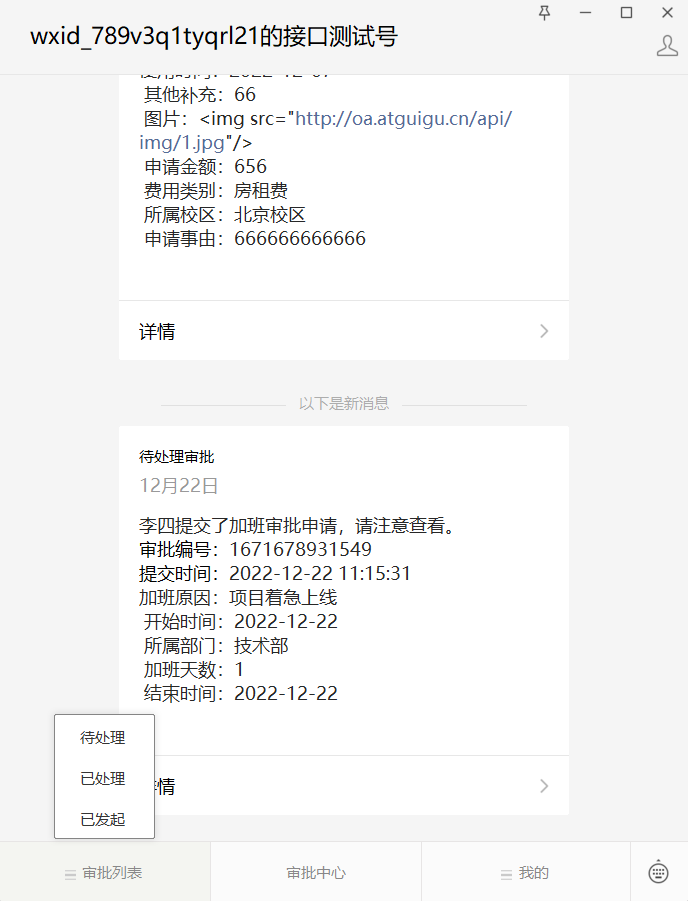
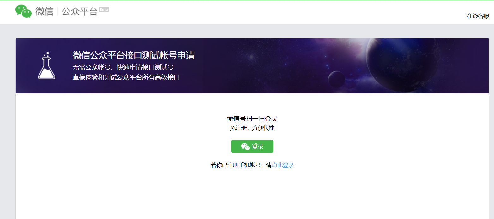
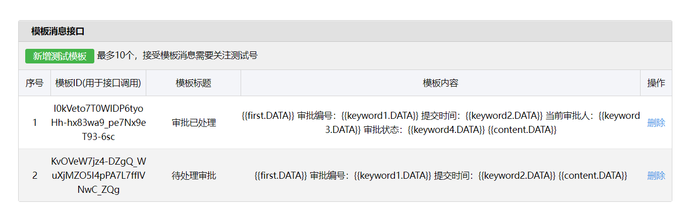

# 云尚办公系统：微信公众号

## 一、功能说明

员工端使用微信公众号完成审批操作，涉及到的功能包含：自定义菜单、授权登录、消息

1、微信公众号一级菜单为：审批列表、审批中心、我的

2、员工关注公众号，员工第一次登录微信公众号，通过微信授权登录进行员工账号绑定

3、员工通过微信公众号提交审批和审批信息，系统根据微信公众号推送审批信息，及时反馈审批过程

项目截图：




## 二、公众号菜单管理

公众号一级菜单，数据库默认初始化（审批列表、审批中心、我的）

页面效果如下：


### 1、菜单管理CRUD

#### 1.1、mapper

```java
package com.atguigu.wechat.mapper;

import com.atguigu.model.wechat.Menu;
import com.baomidou.mybatisplus.core.mapper.BaseMapper;
import org.apache.ibatis.annotations.Mapper;

@Mapper
public interface MenuMapper extends BaseMapper<Menu> {

}
```

#### 1.2、service接口

```java
package com.atguigu.wechat.service;

import com.atguigu.model.wechat.Menu;
import com.atguigu.vo.wechat.MenuVo;
import com.baomidou.mybatisplus.extension.service.IService;
import java.util.List;

public interface MenuService extends IService<Menu> {

    List<MenuVo> findMenuInfo();

}
```

#### 1.3、service接口实现

```java
package com.atguigu.wechat.service.impl;

import com.atguigu.model.wechat.Menu;
import com.atguigu.vo.wechat.MenuVo;
import com.atguigu.wechat.mapper.MenuMapper;
import com.atguigu.wechat.service.MenuService;
import com.baomidou.mybatisplus.extension.service.impl.ServiceImpl;
import lombok.extern.slf4j.Slf4j;
import org.springframework.beans.BeanUtils;
import org.springframework.beans.factory.annotation.Autowired;
import org.springframework.stereotype.Service;
import java.util.ArrayList;
import java.util.Comparator;
import java.util.List;
import java.util.stream.Collectors;

@Service
public class MenuServiceImpl extends ServiceImpl<MenuMapper, Menu> implements MenuService {

    @Autowired
    private MenuMapper menuMapper;

    @Override
    public List<MenuVo> findMenuInfo() {
        List<MenuVo> list = new ArrayList<>();
        List<Menu> menuList = menuMapper.selectList(null);
        List<Menu> oneMenuList = menuList.stream().filter(menu -> menu.getParentId().longValue() == 0).collect(Collectors.toList());
        for (Menu oneMenu : oneMenuList) {
            MenuVo oneMenuVo = new MenuVo();
            BeanUtils.copyProperties(oneMenu, oneMenuVo);

            List<Menu> twoMenuList = menuList.stream()
                    .filter(menu -> menu.getParentId().longValue() == oneMenu.getId())
                    .sorted(Comparator.comparing(Menu::getSort))
                    .collect(Collectors.toList());
            List<MenuVo> children = new ArrayList<>();
            for (Menu twoMenu : twoMenuList) {
                MenuVo twoMenuVo = new MenuVo();
                BeanUtils.copyProperties(twoMenu, twoMenuVo);
                children.add(twoMenuVo);
            }
            oneMenuVo.setChildren(children);
            list.add(oneMenuVo);
        }
        return list;
    }
}
```

#### 1.4、controller接口

```java
package com.atguigu.wechat.controller;

import com.atguigu.common.result.Result;
import com.atguigu.model.wechat.Menu;
import com.atguigu.wechat.service.MenuService;
import io.swagger.annotations.ApiOperation;
import lombok.extern.slf4j.Slf4j;
import org.springframework.beans.factory.annotation.Autowired;
import org.springframework.security.access.prepost.PreAuthorize;
import org.springframework.web.bind.annotation.*;

@RestController
@RequestMapping("/admin/wechat/menu")
@Slf4j
public class MenuController {

    @Autowired
    private MenuService menuService;

    //@PreAuthorize("hasAuthority('bnt.menu.list')")
    @ApiOperation(value = "获取")
    @GetMapping("get/{id}")
    public Result get(@PathVariable Long id) {
        Menu menu = menuService.getById(id);
        return Result.ok(menu);
    }

    //@PreAuthorize("hasAuthority('bnt.menu.add')")
    @ApiOperation(value = "新增")
    @PostMapping("save")
    public Result save(@RequestBody Menu menu) {
        menuService.save(menu);
        return Result.ok();
    }

    //@PreAuthorize("hasAuthority('bnt.menu.update')")
    @ApiOperation(value = "修改")
    @PutMapping("update")
    public Result updateById(@RequestBody Menu menu) {
        menuService.updateById(menu);
        return Result.ok();
    }

    //@PreAuthorize("hasAuthority('bnt.menu.remove')")
    @ApiOperation(value = "删除")
    @DeleteMapping("remove/{id}")
    public Result remove(@PathVariable Long id) {
        menuService.removeById(id);
        return Result.ok();
    }

    //@PreAuthorize("hasAuthority('bnt.menu.list')")
    @ApiOperation(value = "获取全部菜单")
    @GetMapping("findMenuInfo")
    public Result findMenuInfo() {
        return Result.ok(menuService.findMenuInfo());
    }
}
```


### 2、前端实现

#### 2.1、定义api接口

创建src/api/wechat/menu.js

```javascript
import request from '@/utils/request'

const api_name = '/admin/wechat/menu'

export default {

  findMenuInfo() {
    return request({
      url: `${api_name}/findMenuInfo`,
      method: `get`
    })
  },

  save(menu) {
    return request({
      url: `${api_name}/save`,
      method: `post`,
      data: menu
    })
  },

  getById(id) {
    return request({
      url: `${api_name}/get/${id}`,
      method: `get`
    })
  },

  updateById(menu) {
    return request({
      url: `${api_name}/update`,
      method: `put`,
      data: menu
    })
  },

  removeById(id) {
    return request({
      url: `${api_name}/remove/${id}`,
      method: 'delete'
    })
  }
}
```

#### 2.2、页面实现

创建views/wechat/menu/list.vue

```vue
<template>
  <div class="app-container">

    <!-- 工具条 -->
    <div class="tools-div">
      <el-button class="btn-add" size="mini" @click="add">添 加</el-button>
    </div>

    <el-table
      :data="list"
      style="width: 100%;margin-bottom: 20px;"
      row-key="id"
      border
      default-expand-all
      :tree-props="{children: 'children'}">

      <el-table-column label="名称" prop="name" width="350"></el-table-column>
      <el-table-column label="类型" width="100">
        <template slot-scope="scope">
          {{ scope.row.type == 'view' ? '链接' : scope.row.type == 'click' ? '事件' : '' }}
        </template>
      </el-table-column>
      <el-table-column label="菜单URL" prop="url" ></el-table-column>
      <el-table-column label="菜单KEY" prop="meunKey"  width="130"></el-table-column>
      <el-table-column label="排序号" prop="sort"  width="70"></el-table-column>
      <el-table-column label="操作" width="170" align="center">
        <template slot-scope="scope">
          <el-button v-if="scope.row.parentId > 0" type="text" size="mini" @click="edit(scope.row.id)">修改</el-button>
          <el-button v-if="scope.row.parentId > 0" type="text" size="mini" @click="removeDataById(scope.row.id)">删除</el-button>
        </template>
      </el-table-column>
    </el-table>

    <el-dialog title="添加/修改" :visible.sync="dialogVisible" width="40%" >
      <el-form ref="flashPromotionForm" label-width="150px" size="small" style="padding-right: 40px;">

        <el-form-item label="选择一级菜单">
          <el-select
            v-model="menu.parentId"
            placeholder="请选择">
            <el-option
              v-for="item in list"
              :key="item.id"
              :label="item.name"
              :value="item.id"/>
          </el-select>
        </el-form-item>
        <el-form-item label="菜单名称">
          <el-input v-model="menu.name"/>
        </el-form-item>
        <el-form-item label="菜单类型">
          <el-radio-group v-model="menu.type">
            <el-radio label="view">链接</el-radio>
            <el-radio label="click">事件</el-radio>
          </el-radio-group>
        </el-form-item>
        <el-form-item v-if="menu.type == 'view'" label="链接">
          <el-input v-model="menu.url"/>
        </el-form-item>
        <el-form-item v-if="menu.type == 'click'" label="菜单KEY">
          <el-input v-model="menu.meunKey"/>
        </el-form-item>
        <el-form-item label="排序">
          <el-input v-model="menu.sort"/>
        </el-form-item>
      </el-form>
      <span slot="footer" class="dialog-footer">
        <el-button @click="dialogVisible = false" size="small">取 消</el-button>
        <el-button type="primary" @click="saveOrUpdate()" size="small">确 定</el-button>
      </span>
    </el-dialog>
  </div>
</template>
<script>
import menuApi from '@/api/wechat/menu'
const defaultForm = {
  id: null,
  parentId: 1,
  name: '',
  nameId: null,
  sort: 1,
  type: 'view',
  meunKey: '',
  url: ''
}
export default {

  // 定义数据
  data() {
    return {
      list: [],
      dialogVisible: false,
      menu: defaultForm,
      saveBtnDisabled: false
    }
  },

  // 当页面加载时获取数据
  created() {
    this.fetchData()
  },

  methods: {
    // 调用api层获取数据库中的数据
    fetchData() {
      console.log('加载列表')
      menuApi.findMenuInfo().then(response => {
        this.list = response.data
        console.log(this.list)
      })
    },

    // 根据id删除数据
    removeDataById(id) {
      // debugger
      this.$confirm('此操作将永久删除该记录, 是否继续?', '提示', {
        confirmButtonText: '确定',
        cancelButtonText: '取消',
        type: 'warning'
      }).then(() => { // promise
        // 点击确定，远程调用ajax
        return menuApi.removeById(id)
      }).then((response) => {
        this.fetchData(this.page)
        this.$message.success(response.message || '删除成功')
      }).catch(() => {
        this.$message.info('取消删除')
      })
    },

    // -------------
    add() {
      this.dialogVisible = true
      this.menu = Object.assign({}, defaultForm)
    },

    edit(id) {
      this.dialogVisible = true
      this.fetchDataById(id)
    },

    fetchDataById(id) {
      menuApi.getById(id).then(response => {
        this.menu = response.data
      })
    },

    saveOrUpdate() {
      this.saveBtnDisabled = true // 防止表单重复提交

      if (!this.menu.id) {
        this.saveData()
      } else {
        this.updateData()
      }
    },

    // 新增
    saveData() {
      menuApi.save(this.menu).then(response => {
        this.$message.success(response.message || '操作成功')
        this.dialogVisible = false
        this.fetchData(this.page)
      })
    },

    // 根据id更新记录
    updateData() {
      menuApi.updateById(this.menu).then(response => {
        this.$message.success(response.message || '操作成功')
        this.dialogVisible = false
        this.fetchData(this.page)
      })
    }
  }
}
</script>
```


### 3、推送菜单

后台配置好菜单后，我们要推送到微信公众平台

#### 3.1、申请账号

云尚办公系统没有微信支付等高级功能，因此无需使用服务号，使用测试账号即可完成测试。

我们使用“微信公众平台接口测试帐号”，申请地址：https://mp.weixin.qq.com/debug/cgi-bin/sandbox?t=sandbox/login，以后有了正式账号，直接一切换即可



扫描登录进入，获取测试号信息：appID与appsecret


查看“自定义菜单“api文档：

https://developers.weixin.qq.com/doc/offiaccount/Custom_Menus/Creating_Custom-Defined_Menu.html

推送菜单有两种实现方式：

​	1、完全按照接口文档http方式，但这种方式比较繁琐

​	2、使用weixin-java-mp工具，这个是封装好的工具，可以直接使用，方便快捷，后续我们使用这种方式开发

#### 3.2、添加配置

在application-dev.yml添加配置

```yaml
wechat:
  mpAppId: wx13db7dcf69bc1223
  mpAppSecret: de3d7888d30febf84b64d0e6571e4027
```


#### 3.3、工具类方式

##### 3.3.1、引入依赖

```xml
<dependency>
    <groupId>com.github.binarywang</groupId>
    <artifactId>weixin-java-mp</artifactId>
    <version>4.1.0</version>
</dependency>
```

##### 3.3.2、添加工具类和配置类

工具类

```java
package com.atguigu.wechat.config;

import lombok.Data;
import org.springframework.beans.factory.InitializingBean;
import org.springframework.beans.factory.annotation.Value;
import org.springframework.boot.context.properties.ConfigurationProperties;
import org.springframework.stereotype.Component;

@Data
@Component
@ConfigurationProperties(prefix = "wechat")
public class WechatAccountConfig {

    private String mpAppId;

    private String mpAppSecret;

}
```

配置类

```java
package com.atguigu.wechat.config;

import me.chanjar.weixin.mp.api.WxMpService;
import me.chanjar.weixin.mp.api.impl.WxMpServiceImpl;
import me.chanjar.weixin.mp.config.WxMpConfigStorage;
import me.chanjar.weixin.mp.config.impl.WxMpDefaultConfigImpl;
import org.springframework.beans.factory.annotation.Autowired;
import org.springframework.context.annotation.Bean;
import org.springframework.stereotype.Component;

@Component
public class WeChatMpConfig {

    @Autowired
    private WechatAccountConfig wechatAccountConfig;

    @Bean
    public WxMpService wxMpService(){
        WxMpService wxMpService = new WxMpServiceImpl();
        wxMpService.setWxMpConfigStorage(wxMpConfigStorage());
        return wxMpService;
    }

    @Bean
    public WxMpConfigStorage wxMpConfigStorage(){
        WxMpDefaultConfigImpl wxMpConfigStorage = new WxMpDefaultConfigImpl();
        wxMpConfigStorage.setAppId(wechatAccountConfig.getMpAppId());
        wxMpConfigStorage.setSecret(wechatAccountConfig.getMpAppSecret());
        return wxMpConfigStorage;
    }
}
```

##### 3.3.3、推送接口实现

操作类：MenuServiceImpl

```java
@Autowired
private WxMpService wxMpService;

@Override
public void syncMenu() {
    List<MenuVo> menuVoList = this.findMenuInfo();
    //菜单
    JSONArray buttonList = new JSONArray();
    for(MenuVo oneMenuVo : menuVoList) {
        JSONObject one = new JSONObject();
        one.put("name", oneMenuVo.getName());
        if(CollectionUtils.isEmpty(oneMenuVo.getChildren())) {
            one.put("type", oneMenuVo.getType());
            one.put("url", "http://oa.atguigu.cn/#"+oneMenuVo.getUrl());
        } else {
            JSONArray subButton = new JSONArray();
            for(MenuVo twoMenuVo : oneMenuVo.getChildren()) {
                JSONObject view = new JSONObject();
                view.put("type", twoMenuVo.getType());
                if(twoMenuVo.getType().equals("view")) {
                    view.put("name", twoMenuVo.getName());
                    //H5页面地址
                    view.put("url", "http://oa.atguigu.cn#"+twoMenuVo.getUrl());
                } else {
                    view.put("name", twoMenuVo.getName());
                    view.put("key", twoMenuVo.getMeunKey());
                }
                subButton.add(view);
            }
            one.put("sub_button", subButton);
        }
        buttonList.add(one);
    }
    //菜单
    JSONObject button = new JSONObject();
    button.put("button", buttonList);
    try {
        wxMpService.getMenuService().menuCreate(button.toJSONString());
    } catch (WxErrorException e) {
        throw new RuntimeException(e);
    }
}
```

##### 3.3.4、controller接口

```java
//@PreAuthorize("hasAuthority('bnt.menu.syncMenu')")
@ApiOperation(value = "同步菜单")
@GetMapping("syncMenu")
public Result createMenu() {
    menuService.syncMenu();
    return Result.ok();
}
```


#### 3.4 前端实现

##### 3.4.1、api接口

在api/wechat/menu.js添加

```javascript
syncMenu() {
  return request({
    url: `${api_name}/syncMenu`,
    method: `get`
  })
},
```

##### 3.4.2、菜单列表添加同步功能

1、添加按钮

```vue
<el-button class="btn-add" size="mini" @click="syncMenu" >同步菜单</el-button>
```

2、添加方法

```javascript
syncMenu() {
  this.$confirm('你确定上传菜单吗, 是否继续?', '提示', {
    confirmButtonText: '确定',
    cancelButtonText: '取消',
    type: 'warning'
  }).then(() => {
    return menuApi.syncMenu()
  }).then((response) => {
    this.$message.success(response.message)
  }).catch(error => {
    console.log('error', error)
    if (error === 'cancel') {
      this.$message.info('取消上传')
    }
  })
}
```

### 4、删除推送菜单

#### 4.1、删除接口

##### 4.1.1、service接口

```java
void removeMenu();
```

##### 4.1.2、service接口实现

```java
@SneakyThrows
@Override
public void removeMenu() {
    wxMpService.getMenuService().menuDelete();
}
```

##### 4.1.3、controller接口

```java
@PreAuthorize("hasAuthority('bnt.menu.removeMenu')")
@ApiOperation(value = "删除菜单")
@DeleteMapping("removeMenu")
public Result removeMenu() {
    menuService.removeMenu();
    return Result.ok();
}
```

#### 4.2、前端实现

##### 4.2.1、api接口

在api/wechat/menu.js添加

```javascript
removeMenu() {
    return request({
      url: `${api_name}/removeMenu`,
      method: `delete`
    })
  }
```

##### 4.2.2、菜单列表添加同步功能

1、添加按钮

```vue
<el-button class="btn-add" size="mini" @click="removeMenu">删除菜单</el-button>
```

2、添加方法

```javascript
removeMenu() {
  menuApi.removeMenu().then(response => {
    this.$message.success('菜单已删除')
  })
}
```


## 三、微信授权登录

当前后台员工账号与微信账号是没有关联的，因此在点击微信菜单时，要判断是否登录，如果是第一次访问则弹出关联层，建立微信账号与员工账号的绑定，即：通过员工手机号码与微信openId建立绑定，后续进入就知道用户身份了。

### 1、服务器端接口开发

#### 1.1、配置内网穿透(ngrok)

##### 1.1.1、注册用户

网址：https://ngrok.cc/login/register


##### 1.1.2、实名认证

**（1）注册成功之后，登录系统，进行实名认证，认证费2元，认证通过后才能开通隧道**


##### 1.1.3、开通隧道

**（1）选择隧道管理 -> 开通隧道**

**最后一个是免费服务器，建议选择付费服务器，10元/月，因为免费服务器使用人数很多，经常掉线**


**（2）点击立即购买 -> 输入相关信息**


**（3）开通成功后，查看开通的隧道**

**这里开通了两个隧道，一个用于后端接口调用，一个用于公众号前端调用**


##### 1.1.4、启动隧道

**（1）下载客户端工具**


**（2）选择windows版本**


**（3）解压，找到bat文件，双击启动**


**（4）输入隧道id，多个使用逗号隔开，最后回车就可以启动**


#### 1.2、配置“授权回调页面域名”

在“[网页授权获取用户基本信息]”后面，点击“修改”，添加“授权回调页面域名”（本地使用内网穿透地址）


#### 1.3、配置授权回调获取用户信息接口地址

```yaml
wechat:
  mpAppId: wx13db7dcf69bq1233
  mpAppSecret: de3d7888d30febf84b64d041231e4027
  # 授权回调获取用户信息接口地址
  userInfoUrl: http://ggkt2.vipgz1.91tunnel.com/admin/wechat/userInfo
```

#### 1.4、controller接口

```java
package com.atguigu.wechat.controller;

import com.alibaba.fastjson.JSON;
import com.atguigu.common.jwt.JwtHelper;
import com.atguigu.common.result.Result;
import com.atguigu.model.system.SysUser;
import com.atguigu.system.service.SysUserService;
import com.atguigu.vo.wechat.BindPhoneVo;
import com.baomidou.mybatisplus.core.conditions.query.LambdaQueryWrapper;
import io.swagger.annotations.ApiOperation;
import lombok.extern.slf4j.Slf4j;
import me.chanjar.weixin.common.api.WxConsts;
import me.chanjar.weixin.common.bean.WxOAuth2UserInfo;
import me.chanjar.weixin.common.bean.oauth2.WxOAuth2AccessToken;
import me.chanjar.weixin.mp.api.WxMpService;
import org.springframework.beans.factory.annotation.Autowired;
import org.springframework.beans.factory.annotation.Value;
import org.springframework.stereotype.Controller;
import org.springframework.web.bind.annotation.*;

import javax.annotation.Resource;
import javax.servlet.http.HttpServletRequest;
import java.net.URLEncoder;

@Controller
@RequestMapping("/admin/wechat")
@Slf4j
public class WechatController {

    @Resource
    private SysUserService sysUserService;

    @Autowired
    private WxMpService wxMpService;

    @Value("${wechat.userInfoUrl}")
    private String userInfoUrl;

    @GetMapping("/authorize")
    public String authorize(@RequestParam("returnUrl") String returnUrl, HttpServletRequest request) {
        //由于授权回调成功后，要返回原地址路径，原地址路径带“#”号，当前returnUrl获取带“#”的url获取不全，因此前端把“#”号替换为“guiguoa”了，这里要还原一下
        String redirectURL = wxMpService.getOAuth2Service().buildAuthorizationUrl(userInfoUrl, WxConsts.OAuth2Scope.SNSAPI_USERINFO, URLEncoder.encode(returnUrl.replace("guiguoa", "#")));
        log.info("【微信网页授权】获取code,redirectURL={}", redirectURL);
        return "redirect:" + redirectURL;
    }

    @GetMapping("/userInfo")
    public String userInfo(@RequestParam("code") String code,
                           @RequestParam("state") String returnUrl) throws Exception {
        log.info("【微信网页授权】code={}", code);
        log.info("【微信网页授权】state={}", returnUrl);
        WxOAuth2AccessToken accessToken = wxMpService.getOAuth2Service().getAccessToken(code);
        String openId = accessToken.getOpenId();
        log.info("【微信网页授权】openId={}", openId);

        WxOAuth2UserInfo wxMpUser = wxMpService.getOAuth2Service().getUserInfo(accessToken, null);
        log.info("【微信网页授权】wxMpUser={}", JSON.toJSONString(wxMpUser));

        SysUser sysUser = sysUserService.getOne(new LambdaQueryWrapper<SysUser>().eq(SysUser::getOpenId, openId));
        String token = "";
        //null != sysUser 说明已经绑定，反之为建立账号绑定，去页面建立账号绑定
        if(null != sysUser) {
            token = JwtHelper.createToken(sysUser.getId(), sysUser.getUsername());
        }
        if(returnUrl.indexOf("?") == -1) {
            return "redirect:" + returnUrl + "?token=" + token + "&openId=" + openId;
        } else {
            return "redirect:" + returnUrl + "&token=" + token + "&openId=" + openId;
        }
    }

    @ApiOperation(value = "微信账号绑定手机")
    @PostMapping("bindPhone")
    @ResponseBody
    public Result bindPhone(@RequestBody BindPhoneVo bindPhoneVo) {
        SysUser sysUser = sysUserService.getOne(new LambdaQueryWrapper<SysUser>().eq(SysUser::getPhone, bindPhoneVo.getPhone()));
        if(null != sysUser) {
            sysUser.setOpenId(bindPhoneVo.getOpenId());
            sysUserService.updateById(sysUser);

            String token = JwtHelper.createToken(sysUser.getId(), sysUser.getUsername());
            return Result.ok(token);
        } else {
            return Result.fail("手机号码不存在，绑定失败");
        }
    }
}
```

#### 1.5、排除拦截

在WebSecurityConfig类配置排除拦截

```java
   /**
     * 配置哪些请求不拦截
     * 排除swagger相关请求
     * @param web
     * @throws Exception
     */
    @Override
    public void configure(WebSecurity web) throws Exception {
        web.ignoring().antMatchers("/admin/modeler/**","/diagram-viewer/**","/editor-app/**","/*.html",
                "/admin/processImage/**",
                "/admin/wechat/authorize","/admin/wechat/userInfo","/admin/wechat/bindPhone",
                "/favicon.ico","/swagger-resources/**", "/webjars/**", "/v2/**", "/swagger-ui.html/**", "/doc.html");
    }
```


### 2、移动端前端处理

#### 2.1、添加api接口

在src/api/userInfo.js添加方法

```javascript
bindPhone(bindPhoneVo) {
  return request({
    url: `/admin/wechat/bindPhone`,
    method: 'post',
    data: bindPhoneVo
  })
},
```

#### 2.2、绑定关系

由于移动端所有页面都需要授权登录后在可以访问，因此我们把处理业务放到入口页面处理，scr/App.vue

```vue
<template>
  <div id="app">
    <router-view />

    <el-dialog title="绑定手机" :visible.sync="dialogVisible" width="80%" >
      <el-form ref="dataForm" :model="bindPhoneVo" size="small">
        <h4>绑定你的手机号，建立云尚办公系统关联关系</h4>
        <el-form-item label="手机号码">
          <el-input v-model="bindPhoneVo.phone"/>
        </el-form-item>
      </el-form>
      <span slot="footer" class="dialog-footer">
        <el-button type="primary" icon="el-icon-check" @click="saveBind()" size="small">确 定</el-button>
      </span>
    </el-dialog>
  </div>
</template>
<script>
import userInfoApi from '@/api/userInfo'
export default {
  data() {
    return {
      show: true,
      dialogVisible: false,
      bindPhoneVo: {
        openId: '',
        phone: ''
      }
    };
  },

  created() {
    // 处理微信授权登录
    this.wechatLogin();
  },

  methods: {
    wechatLogin() {
      // 处理微信授权登录
      let token = this.getQueryString('token') || '';
      let openId = this.getQueryString('openId') || '';
      // token === '' && openId != '' 只要这种情况，未绑定账号
      if(token === '' && openId != '') {
        // 绑定账号
        this.bindPhoneVo.openId = openId
        this.dialogVisible = true
      } else {
        // 如果绑定了，授权登录直接返回token
        if(token !== '') {
          window.localStorage.setItem('token', token);
        }
        token = window.localStorage.getItem('token') || '';
        if (token == '') {
          let url = window.location.href.replace('#', 'guiguoa')
          window.location = 'http://oa.atguigu.cn/admin/wechat/authorize?returnUrl=' + url
        }
      }
    },

    saveBind() {
      if(this.bindPhoneVo.phone.length != 11) {
        alert('手机号码格式不正确')
        return
      }
      userInfoApi.bindPhone(this.bindPhoneVo).then(response => {
        window.localStorage.setItem('token', response.data);
        this.dialogVisible = false
        window.location = 'http://oa.atguigu.cn'
      })
    },

    getQueryString (paramName) {
      if(window.location.href.indexOf('?') == -1) return '';

      let searchString = window.location.href.split('?')[1];
      let i, val, params = searchString.split("&");

      for (i=0;i<params.length;i++) {
        val = params[i].split("=");
        if (val[0] == paramName) {
          return val[1];
        }
      }
      return '';
    }
  }
};
</script>
<style lang="scss">
#app {
  font-family: Avenir, Helvetica, Arial, sans-serif;
  -webkit-font-smoothing: antialiased;
  -moz-osx-font-smoothing: grayscale;
  color: #2c3e50;
}
</style>
```

#### 2.3、添加微信js引用

在public/index.html添加js引用

```js
<script src="http://res.wx.qq.com/open/js/jweixin-1.4.0.js" type="text/javascript"></script>
```

#### 2.4、调整request.js

```js
import axios from "axios";

// 创建axios实例
const service = axios.create({
  baseURL: "http://oa.atguigu.cn", // api 的 base_url
  timeout: 30000 // 请求超时时间
});

// http request 拦截器
service.interceptors.request.use(config => {
    let token = window.localStorage.getItem("token") || "";
    if (token != "") {
      config.headers["token"] = token;
    }
    return config;
  },
  err => {
    return Promise.reject(err);
  });
// http response 拦截器
service.interceptors.response.use(response => {
    if (response.data.code == 208) {
      // debugger
      // 替换# 后台获取不到#后面的参数
      let url = window.location.href.replace('#', 'guiguoa')
      window.location = 'http://oa.atguigu.cn/admin/wechat/authorize?returnUrl=' + url
    } else {
      if (response.data.code == 200) {
        return response.data;
      } else {
        // 209没有权限 系统会自动跳转授权登录的，已在App.vue处理过，不需要提示
        if (response.data.code != 209) {
          alert(response.data.message || "error");
        }
        return Promise.reject(response);
      }
    }
  },
  error => {
    return Promise.reject(error.response);   // 返回接口返回的错误信息
  });

export default service;
```

#### 2.5、测试


## 四、消息推送

有待审批消息，我们需要通知审批人审批信息，审批人审批过了，我们要通知提交申请人查看信息。

消息推送我们使用“微信模板消息”接口

### 1、配置微信模板消息

1、待处理审批：{{first.DATA}} 审批编号：{{keyword1.DATA}} 提交时间：{{keyword2.DATA}} {{content.DATA}}

2、审批已处理：{{first.DATA}} 审批编号：{{keyword1.DATA}} 提交时间：{{keyword2.DATA}} 当前审批人：{{keyword3.DATA}} 审批状态：{{keyword4.DATA}} {{content.DATA}}



### 2、定义接口

```java
package com.atguigu.wechat.service;

public interface MessageService {

    /**
     * 推送待审批人员
     * @param processId
     * @param userId
     * @param taskId
     */
    void pushPendingMessage(Long processId, Long userId, String taskId);

    /**
     * 审批后推送提交审批人员
     * @param processId
     * @param userId
     * @param status
     */
    void pushProcessedMessage(Long processId, Long userId, Integer status);

}
```

### 3、service接口实现

```java
package com.atguigu.wechat.service.impl;

import com.alibaba.fastjson.JSON;
import com.alibaba.fastjson.JSONObject;
import com.atguigu.model.process.Process;
import com.atguigu.model.process.ProcessTemplate;
import com.atguigu.model.system.SysUser;
import com.atguigu.process.service.ProcessService;
import com.atguigu.process.service.ProcessTemplateService;
import com.atguigu.security.custom.LoginUserInfoHelper;
import com.atguigu.system.service.SysUserService;
import com.atguigu.wechat.service.MessageService;
import lombok.SneakyThrows;
import lombok.extern.slf4j.Slf4j;
import me.chanjar.weixin.mp.api.WxMpService;
import me.chanjar.weixin.mp.bean.template.WxMpTemplateData;
import me.chanjar.weixin.mp.bean.template.WxMpTemplateMessage;
import org.joda.time.DateTime;
import org.springframework.stereotype.Service;
import org.springframework.util.StringUtils;

import javax.annotation.Resource;
import java.util.Map;

@Slf4j
@Service
public class MessageServiceImpl implements MessageService {

    @Resource
    private WxMpService wxMpService;

    @Resource
    private ProcessService processService;

    @Resource
    private ProcessTemplateService processTemplateService;

    @Resource
    private SysUserService sysUserService;

    @SneakyThrows
    @Override
    public void pushPendingMessage(Long processId, Long userId, String taskId) {
        Process process = processService.getById(processId);
        ProcessTemplate processTemplate = processTemplateService.getById(process.getProcessTemplateId());
        SysUser sysUser = sysUserService.getById(userId);
        SysUser submitSysUser = sysUserService.getById(process.getUserId());
        String openid = sysUser.getOpenId();
        //方便测试，给默认值（开发者本人的openId）
        if(StringUtils.isEmpty(openid)) {
            openid = "omwf25izKON9dktgoy0dogqvnGhk";
        }
        WxMpTemplateMessage templateMessage = WxMpTemplateMessage.builder()
        .toUser(openid)//要推送的用户openid
        .templateId("KvOVeW7jz4-DZgQ_WuXjMZO5I4pPA7L7fflVNwC_ZQg")//模板id
        .url("http://oa.atguigu.cn/#/show/"+processId+"/"+taskId)//点击模板消息要访问的网址
        .build();
        JSONObject jsonObject = JSON.parseObject(process.getFormValues());
        JSONObject formShowData = jsonObject.getJSONObject("formShowData");
        StringBuffer content = new StringBuffer();
        for (Map.Entry entry : formShowData.entrySet()) {
            content.append(entry.getKey()).append("：").append(entry.getValue()).append("\n ");
        }
        templateMessage.addData(new WxMpTemplateData("first", submitSysUser.getName()+"提交了"+processTemplate.getName()+"审批申请，请注意查看。", "#272727"));
        templateMessage.addData(new WxMpTemplateData("keyword1", process.getProcessCode(), "#272727"));
        templateMessage.addData(new WxMpTemplateData("keyword2", new DateTime(process.getCreateTime()).toString("yyyy-MM-dd HH:mm:ss"), "#272727"));
         templateMessage.addData(new WxMpTemplateData("content", content.toString(), "#272727"));
        String msg = wxMpService.getTemplateMsgService().sendTemplateMsg(templateMessage);
        log.info("推送消息返回：{}", msg);
    }

    @SneakyThrows
    @Override
    public void pushProcessedMessage(Long processId, Long userId, Integer status) {
        Process process = processService.getById(processId);
        ProcessTemplate processTemplate = processTemplateService.getById(process.getProcessTemplateId());
        SysUser sysUser = sysUserService.getById(userId);
        SysUser currentSysUser = sysUserService.getById(LoginUserInfoHelper.getUserId());
        String openid = sysUser.getOpenId();
        if(StringUtils.isEmpty(openid)) {
            openid = "omwf25izKON9dktgoy0dogqvnGhk";
        }
        WxMpTemplateMessage templateMessage = WxMpTemplateMessage.builder()
                .toUser(openid)//要推送的用户openid
                .templateId("I0kVeto7T0WIDP6tyoHh-hx83wa9_pe7Nx9eT93-6sc")//模板id
                .url("http://oa.atguigu.cn/#/show/"+processId+"/0")//点击模板消息要访问的网址
                .build();
        JSONObject jsonObject = JSON.parseObject(process.getFormValues());
        JSONObject formShowData = jsonObject.getJSONObject("formShowData");
        StringBuffer content = new StringBuffer();
        for (Map.Entry entry : formShowData.entrySet()) {
            content.append(entry.getKey()).append("：").append(entry.getValue()).append("\n ");
        }
        templateMessage.addData(new WxMpTemplateData("first", "你发起的"+processTemplate.getName()+"审批申请已经被处理了，请注意查看。", "#272727"));
        templateMessage.addData(new WxMpTemplateData("keyword1", process.getProcessCode(), "#272727"));
        templateMessage.addData(new WxMpTemplateData("keyword2", new DateTime(process.getCreateTime()).toString("yyyy-MM-dd HH:mm:ss"), "#272727"));
        templateMessage.addData(new WxMpTemplateData("keyword3", currentSysUser.getName(), "#272727"));
        templateMessage.addData(new WxMpTemplateData("keyword4", status == 1 ? "审批通过" : "审批拒绝", status == 1 ? "#009966" : "#FF0033"));
        templateMessage.addData(new WxMpTemplateData("content", content.toString(), "#272727"));
        String msg = wxMpService.getTemplateMsgService().sendTemplateMsg(templateMessage);
        log.info("推送消息返回：{}", msg);
    }

}
```

### 4、推送调用

#### 4.1、启动流程实例接口

代码片段

```java
@Autowired
private MessageService messageService;
```

```java
@Transactional
public Process startUp(ProcessFormVo processFormVo) {
    ...

    //计算下一个审批人
    List<Task> taskList = this.getCurrentTaskList(processInstanceId);
    if (!CollectionUtils.isEmpty(taskList)) {
        List<String> assigneeList = new ArrayList<>();
        for(Task task : taskList) {
            SysUser sysUser = sysUserService.getByUsername(task.getAssignee());
            assigneeList.add(sysUser.getName());

            //推送消息给下一个审批人
            messageService.pushPendingMessage(process.getId(), sysUser.getId(), task.getId());
        }
        process.setDescription("等待" + StringUtils.join(assigneeList.toArray(), ",") + "审批");
    }

    processMapper.updateById(process);
    return process;
}
```

#### 4.2、审批接口

代码片段

```java
public void approve(ApprovalVo approvalVo) {
    ...

    //计算下一个审批人
    Process process = this.getById(approvalVo.getProcessId());
    List<Task> taskList = this.getCurrentTaskList(process.getProcessInstanceId());
    if (!CollectionUtils.isEmpty(taskList)) {
        List<String> assigneeList = new ArrayList<>();
        for(Task task : taskList) {
            SysUser sysUser = sysUserService.getByUsername(task.getAssignee());
            assigneeList.add(sysUser.getName());

            //推送消息给下一个审批人
            messageService.pushPendingMessage(process.getId(), sysUser.getId(), task.getId());
        }

        process.setDescription("等待" + StringUtils.join(assigneeList.toArray(), ",") + "审批");
        process.setStatus(1);
    } else {
        ...
    }
    //推送消息给申请人
    messageService.pushProcessedMessage(process.getId(), process.getUserId(), approvalVo.getStatus());
    this.updateById(process);
}
```


