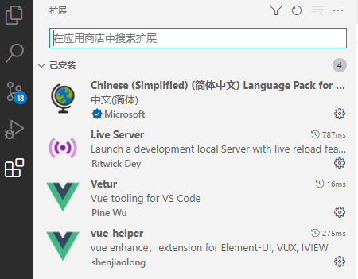
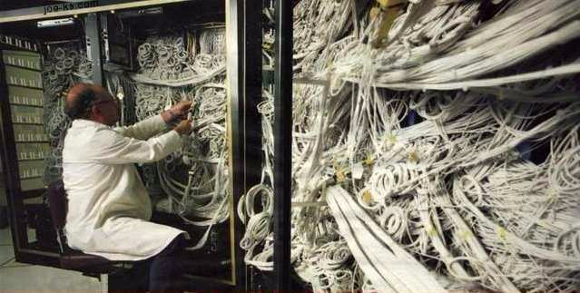

# 										云尚办公系统：前端基础知识

## 1、前端开发介绍

前端工程师“Front-End-Developer”源自于美国。大约从2005年开始正式的前端工程师角色被行业所认可，到了2010年，互联网开始全面进入移动时代，前端开发的工作越来越重要。

最初所有的开发工作都是由后端工程师完成的，随着业务越来越繁杂，工作量变大，于是我们将项目中的可视化部分和一部分交互功能的开发工作剥离出来，形成了前端开发。

由于互联网行业的急速发展，导致了在不同的国家，有着截然不同的分工体制。

在日本和一些人口比较稀疏的国家，例如加拿大、澳洲等，流行“Full-Stack Engineer”，也就是我们通常所说的全栈工程师。通俗点说就是一个人除了完成前端开发和后端开发工作以外，有的公司从产品设计到项目开发再到后期运维可能都是同一个人，甚至可能还要负责UI、配动画，也可以是扫地、擦窗、写文档、维修桌椅等等。

而在美国等互联网环境比较发达的国家项目开发的分工协作更为明确，整个项目开发分为前端、中间层和后端三个开发阶段，这三个阶段分别由三个或者更多的人来协同完成。

国内的大部分互联网公司只有前端工程师和后端工程师，中间层的工作有的由前端来完成，有的由后端来完成。

PRD（产品原型-产品经理） - PSD（视觉设计-UI工程师） - HTML/CSS/JavaScript（PC/移动端网页，实现网页端的视觉展示和交互-前端工程师）


## 2、下载和安装VS Code

### 2.1、下载地址

https://code.visualstudio.com/

### 2.2、插件安装

为方便后续开发，建议安装如下插件



### 2.3、创建项目

vscode本身没有新建项目的选项，所以要先创建一个空的文件夹，如project_xxxx。

然后打开vscode，再在vscode里面选择 File -> Open Folder 打开文件夹，这样才可以创建项目。

### 2.4、保存工作区

打开文件夹后，选择“文件 -> 将工作区另存为...”，为工作区文件起一个名字，存储在刚才的文件夹下即可

### 2.5、新建文件夹和网页

### 2.6、预览网页

**以文件路径方式打开网页预览**

需要安装“open in browser”插件：

文件右键 -> Open In Default Browser

**以服务器方式打开网页预览**

需要安装“Live Server”插件：

文件右键 -> Open with Live Server

### 2.7、设置字体大小

左边栏Manage -> settings -> 搜索 “font” -> Font size


## 二、ES6入门

### 1、ECMAScript 6 简介

ECMAScript 6.0（以下简称 ES6）是 JavaScript 语言的下一代标准，已经在 2015 年 6 月正式发布了。它的目标，是使得 JavaScript 语言可以用来编写复杂的大型应用程序，成为企业级开发语言。

### 2、基本语法

本部分只学习前端开发中ES6的最少必要知识，方便后面项目开发中对代码的理解。

#### 2.1、模板字符串

创建 模板字符串.html

```javascript
// 2、字符串插入变量和表达式。变量名写在 ${} 中，${} 中可以放入 JavaScript 表达式。
let name = "Mike"
let age = 27
let info = `My Name is ${name},I am ${age+1} years old next year.`
console.log(info)
// My Name is Mike,I am 28 years old next year.
```

 

#### 2.2、对象拓展运算符

创建 对象拓展运算符.html

拓展运算符（...）用于取出参数对象所有可遍历属性然后拷贝到当前对象。

```javascript
// 1、拷贝对象
let person1 = {name: "Amy", age: 15}
let someone = { ...person1 }
console.log(someone)  //{name: "Amy", age: 15}
```


#### **2.3、箭头函数**

创建 箭头函数.html

箭头函数提供了一种更加简洁的函数书写方式。基本语法是：`参数 => 函数体`

```javascript
// 传统
var f1 = function(a){
    return a
}
console.log(f1(1))
// ES6
var f2 = a => a
console.log(f2(1))
```

 

```javascript
// 当箭头函数没有参数或者有多个参数，要用 () 括起来。
// 当箭头函数函数体有多行语句，用 {} 包裹起来，表示代码块，
// 当只有一行语句，并且需要返回结果时，可以省略 {} , 结果会自动返回。
var f3 = (a,b) => {
    let result = a+b
    return result
}
console.log(f3(6,2))  // 8
// 前面代码相当于：
var f4 = (a,b) => a+b
```

箭头函数多用于匿名函数的定义


## 三、Vue基础

### 1、入门

#### 1.1、Vue.js 是什么

Vue (读音 /vjuː/，类似于 view) 是一套用于构建用户界面的渐进式框架。

Vue 的核心库只关注视图层，不仅易于上手，还便于与第三方库或既有项目整合。另一方面，当与现代化的工具链以及各种支持类库结合使用时，Vue 也完全能够为复杂的单页应用提供驱动。

官方网站：https://cn.vuejs.org 


#### 1.2、示例

创建 demo.html

```html
<!-- id标识vue作用的范围 -->
<div id="app">
    <!-- {{}} 插值表达式，绑定vue中的data数据 -->
    {{ message }}
</div>
<script src="vue.min.js"></script>
<script>
    // 创建一个vue对象
    new Vue({
        el: '#app',//绑定vue作用的范围
        data: {//定义页面中显示的模型数据
            message: 'Hello Vue!'
        }
    })
</script>
```

这就是声明式渲染：Vue.js 的核心是一个允许采用简洁的模板语法来声明式地将数据渲染进 DOM 的系统

这里的核心思想就是没有繁琐的DOM操作，例如jQuery中，我们需要先找到div节点，获取到DOM对象，然后进行一系列的节点操作


### 2、实例生命周期


创建 vue实例的生命周期.html

```html
<body>
    <div id="app">
        {{info}}
    </div>
    <script src="vue.min.js"></script>
    <script>
        new Vue({
            el: '#app',
            data: {
               info:'hello atguigu' 
            },
            created() { //渲染前
                debugger
                console.log('created....')
            },
            mounted() { //渲染后
                debugger
                console.log('mounted....')
            }
        })
    </script>
</body>
```

 

### 3、Axios

Axios是独立于Vue的一个项目，基于promise用于浏览器和node.js的http客户端

- 在浏览器中可以帮助我们完成 ajax请求的发送

- 在node.js中可以向远程接口发送请求

  **引入vue和axios的js文件**

```html
<script src="vue.min.js"></script>
<script src="axios.min.js"></script>
```

**进行axios调用**

```javascript
var app = new Vue({
    el: '#app',
    data: {
        memberList: []//数组
    },
    created() {
        this.getList()
    },
    methods: {
        getList(id) {
            axios.get('data.json')
            .then(response => {
                console.log(response)
                this.memberList = response.data.data.items
            })
            .catch(error => {
                console.log(error)
            })
        }
    }
})
```

**创建data.json文件**

```json
{
    "success":true,
    "code":20000,
    "message":"成功",
    "data":{
        "list":[
            {"name":"lucy","age":20},
            {"name":"mary","age":30},
            {"name":"jack","age":40}
        ]
    }
}
```

**控制台查看输出**


## 四、Node.js入门

### 1、Node.js简介

#### 1.1、什么是Node.js

简单的说 Node.js 就是运行在服务端的 JavaScript。

Node.js是一个事件驱动I/O服务端JavaScript环境，基于Google的V8引擎，V8引擎执行Javascript的速度非常快，性能非常好。

#### 1.2、Node.js有什么用

如果你是一个前端程序员，你不懂得像PHP、Python或Ruby等动态编程语言，然后你想创建自己的服务，那么Node.js是一个非常好的选择。

Node.js 是运行在服务端的 JavaScript，如果你熟悉Javascript，那么你将会很容易的学会Node.js。

当然，如果你是后端程序员，想部署一些高性能的服务，那么学习Node.js也是一个非常好的选择。


### 2、Node.js安装

#### 2.1、下载

官网：https://nodejs.org/en/ 

中文网：http://nodejs.cn/ 

LTS：长期支持版本

Current：最新版

#### 2.2、安装和查看版本

```shell
node -v
```

### 3、简单入门

创建 01-控制台程序.js

```javascript
console.log('Hello Node.js')
```

进入到程序所在的目录，输入

```cmake
node 01-控制台程序.js
```

浏览器的内核包括两部分核心：

- DOM渲染引擎；
- js解析器（js引擎）
- js运行在浏览器中的内核中的js引擎内部

Node.js是脱离浏览器环境运行的JavaScript程序，基于V8 引擎（Chrome 的 JavaScript的引擎）


## 三、NPM

### 1、NPM简介

#### 1.1、什么是NPM

NPM全称Node Package Manager，是Node.js包管理工具，是全球最大的模块生态系统，里面所有的模块都是开源免费的；也是Node.js的包管理工具，相当于前端的Maven 。

#### 1.2、NPM工具的安装位置

我们通过npm 可以很方便地下载js库，管理前端工程。

Node.js默认安装的npm包和工具的位置：Node.js目录\node_modules

- 在这个目录下你可以看见 npm目录，npm本身就是被NPM包管理器管理的一个工具，说明 Node.js已经集成了npm工具

```shell
#在命令提示符输入 npm -v 可查看当前npm版本
npm -v
```


### 2、使用npm管理项目

#### 2.1、创建文件夹npm

#### 2.2、项目初始化

```shell
#建立一个空文件夹，在命令提示符进入该文件夹  执行命令初始化
npm init
#按照提示输入相关信息，如果是用默认值则直接回车即可。
#name: 项目名称
#version: 项目版本号
#description: 项目描述
#keywords: {Array}关键词，便于用户搜索到我们的项目
#最后会生成package.json文件，这个是包的配置文件，相当于maven的pom.xml
#我们之后也可以根据需要进行修改。
```

```shell
#如果想直接生成 package.json 文件，那么可以使用命令
npm init -y
```

#### 2.3、修改npm镜像

NPM官方的管理的包都是从 http://npmjs.com下载的，但是这个网站在国内速度很慢。

这里推荐使用淘宝 NPM 镜像 http://npm.taobao.org/ ，淘宝 NPM 镜像是一个完整 npmjs.com 镜像，同步频率目前为 10分钟一次，以保证尽量与官方服务同步。

**设置镜像地址：**

```shell
#经过下面的配置，以后所有的 npm install 都会经过淘宝的镜像地址下载
npm config set registry https://registry.npm.taobao.org 
#查看npm配置信息
npm config list
```

#### 2.4、npm install命令的使用

```shell
#使用 npm install 安装依赖包的最新版，
#模块安装的位置：项目目录\node_modules
#安装会自动在项目目录下添加 package-lock.json文件，这个文件帮助锁定安装包的版本
#同时package.json 文件中，依赖包会被添加到dependencies节点下，类似maven中的 <dependencies>
npm install jquery
#npm管理的项目在备份和传输的时候一般不携带node_modules文件夹
npm install #根据package.json中的配置下载依赖，初始化项目
#如果安装时想指定特定的版本
npm install jquery@2.1.x
```


## 四、模块化开发

### 1、模块化简介 

#### 1.1、模块化产生的背景

随着网站逐渐变成"互联网应用程序"，嵌入网页的Javascript代码越来越庞大，越来越复杂。



Javascript模块化编程，已经成为一个迫切的需求。理想情况下，开发者只需要实现核心的业务逻辑，其他都可以加载别人已经写好的模块。

但是，Javascript不是一种模块化编程语言，它不支持"类"（class），包（package）等概念，更遑论"模块"（module）了。

#### 1.2、什么是模块化开发

传统非模块化开发有如下的缺点：

- 命名冲突
- 文件依赖

模块化规范：

- CommonJS模块化规范

- ES6模块化规范

  

### 2、ES6模块化写法（一）

每个文件就是一个模块，有自己作用域。在一个文件里定义的变量、函数、类，都是私有的，对其他文件不可见。ES6使用 export 和 import 来导出、导入模块。

#### 2.1、导出模块

创建 src/userApi.js

```javascript
export function getList() {
    console.log('获取数据列表')
}
export function save() {
    console.log('保存数据')
}
```

#### 2.2、导入模块

创建 src/userComponent.js

```javascript
//只取需要的方法即可，多个方法用逗号分隔
import { getList, save } from "./userApi.js"
getList()
save()
```

**注意：这时程序无法运行，因为ES6的模块化无法在Node.js中执行，需要用Babel编辑成ES5后再执行。**

#### 2.3、安装Babel

Babel是一个广泛使用的转码器，可以将ES6代码转为ES5代码，从而在现有环境执行执行

**安装命令行转码工具**

Babel提供babel-cli工具，用于命令行转码。它的安装命令如下：

```shell
npm install --global babel-cli
#查看是否安装成功
babel --version
```

#### 2.4、配置.babelrc

Babel的配置文件是.babelrc，存放在项目的根目录下，该文件用来设置转码规则和插件，presets字段设定转码规则，将es2015规则加入 .babelrc：

```javascript
{
    "presets": ["es2015"],
    "plugins": []
}
```

#### 2.5、安装转码器

在项目中安装

```shell
npm install --save-dev babel-preset-es2015
```

#### 2.6、转码

```shell
# 整个目录转码
mkdir dist1
# --out-dir 或 -d 参数指定输出目录
babel src -d dist1
```

#### 2.7、运行程序 

```shell
node dist1/userComponent.js
```


### 3、ES6模块化写法（二）

#### 3.1、导出模块

创建 es6/userApi2.js

```javascript
export default {
    getList() {
        console.log('获取数据列表2')
    },
    save() {
        console.log('保存数据2')
    }
}
```

#### 3.2、导入模块

创建 es6/userComponent2.js

```javascript
import user from "./userApi2.js"
user.getList()
user.save()
```

#### 3.3、转码

```shell
# 整个目录转码
mkdir dist2
# --out-dir 或 -d 参数指定输出目录
babel es6 -d dist2
```

#### 3.4、运行程序 

```shell
node dist2/userComponent2.js
```

