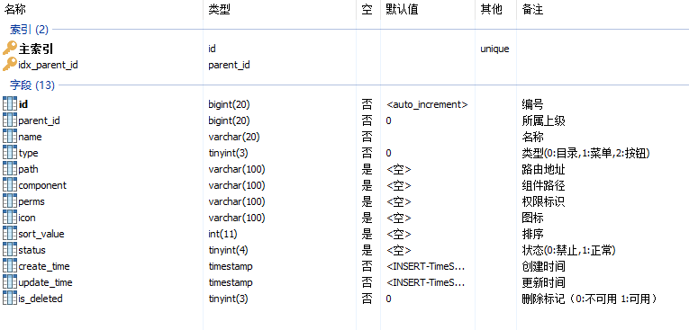
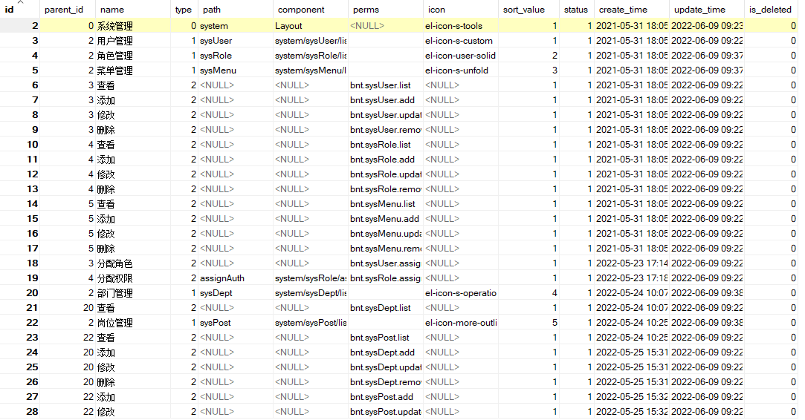
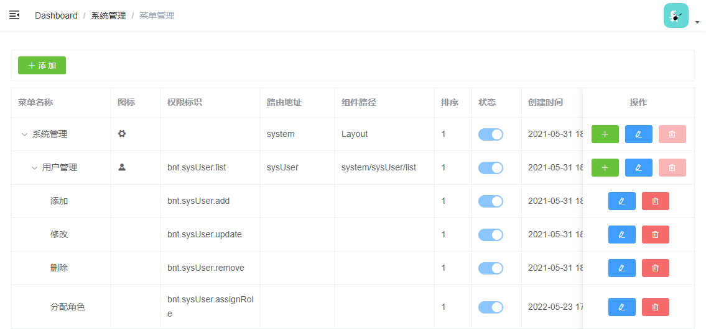

# 云尚办公系统：菜单管理

## 一、菜单管理需求

### 1、需求描述

不同角色的用户登录后台管理系统拥有不同的菜单权限与功能权限，我们前端是基于：vue-admin-template这个模块开发的，因此我们菜单表设计也必须基于前端模板进行设计。

前端框架vue-admin-template菜单其实就是我们配置的路由：

```js
{
  path: '/system',
  component: Layout,
  meta: {
    title: '系统管理',
    icon: 'el-icon-s-tools'
  },
  alwaysShow: true,
  children: [
    {
      name: 'sysUser',
      path: 'sysUser',
      component: () => import('@/views/system/sysUser/list'),
      meta: {
        title: '用户管理',
        icon: 'el-icon-s-custom'
      },
    },
    {
      path: 'sysRole',
      component: () => import('@/views/system/sysRole/list'),
      meta: {
        title: '角色管理',
        icon: 'el-icon-s-help'
      },
    },
    {
      name: 'sysMenu',
      path: 'sysMenu',
      component: () => import('@/views/system/sysMenu/list'),
      meta: {
        title: '菜单管理',
        icon: 'el-icon-s-unfold'
      },
    },
    {
      path: 'assignAuth',
      component: () => import('@/views/system/sysRole/assignAuth'),
      meta: {
        activeMenu: '/system/sysRole',
        title: '角色授权'
      },
      hidden: true,
    }
  ]
}
```

因此，菜单表的设计必须满足路由配置的必要信息

### 2、菜单表设计

#### 2.1、表结构



重点字段说明：

​	type：菜单类型，分为：目录、菜单与按钮

​				目录：一个分类（可理解为一级菜单）、目录下级节点可以为目录与菜单

​				菜单：一个具体页面，菜单的下级节点只能是按钮

​				按钮：页面上的功能

​	path：对应路由里面的路由地址path

​	component：对应路由里面的组件component

​	perms：对应菜单的功能权限标识

​	icom：对应路由的菜单图标

#### 2.2、示例数据



#### 2.3、页面效果




## 二、菜单管理

### 1、菜单管理CRUD

#### 1.1、Mapper

```java
package com.atguigu.system.mapper;


import com.atguigu.model.system.SysMenu;
import com.baomidou.mybatisplus.core.mapper.BaseMapper;
import org.apache.ibatis.annotations.Mapper;
import org.apache.ibatis.annotations.Param;
import org.springframework.stereotype.Repository;

import java.util.List;

@Repository
@Mapper
public interface SysMenuMapper extends BaseMapper<SysMenu> {

}

```

#### 1.2、service接口及实现

**SysUserService接口**

```java
package com.atguigu.system.service;


import com.atguigu.model.system.SysMenu;
import com.baomidou.mybatisplus.extension.service.IService;

import java.util.List;

public interface SysMenuService extends IService<SysMenu> {

    /**
     * 菜单树形数据
     * @return
     */
    List<SysMenu> findNodes();

}
```

**SysUserServiceImpl实现**

```java
package com.atguigu.system.service.impl;

import com.atguigu.common.execption.GuiguException;
import com.atguigu.common.result.ResultCodeEnum;
import com.atguigu.model.system.SysMenu;
import com.atguigu.system.helper.MenuHelper;
import com.atguigu.system.mapper.SysMenuMapper;
import com.atguigu.system.service.SysMenuService;
import com.baomidou.mybatisplus.core.conditions.query.LambdaQueryWrapper;
import com.baomidou.mybatisplus.extension.service.impl.ServiceImpl;
import org.springframework.beans.factory.annotation.Autowired;
import org.springframework.stereotype.Service;
import org.springframework.util.CollectionUtils;

import java.io.Serializable;
import java.util.List;

@Service
public class SysMenuServiceImpl extends ServiceImpl<SysMenuMapper, SysMenu> implements SysMenuService {

    @Autowired
    private SysMenuMapper sysMenuMapper;

    @Override
    public List<SysMenu> findNodes() {
        //全部权限列表
        List<SysMenu> sysMenuList = this.list();
        if (CollectionUtils.isEmpty(sysMenuList)) return null;

        //构建树形数据
        List<SysMenu> result = MenuHelper.buildTree(sysMenuList);
        return result;
    }

    @Override
    public boolean removeById(Serializable id) {
        int count = this.count(new LambdaQueryWrapper<SysMenu>().eq(SysMenu::getParentId, id));
        if (count > 0) {
            throw new GuiguException(201,"菜单不能删除");
        }
        sysMenuMapper.deleteById(id);
        return false;
    }

}
```

**添加帮助类**

新建：com.atguigu.system.helper.MenuHelper

```java
package com.atguigu.system.helper;


import com.atguigu.model.system.SysMenu;

import java.util.ArrayList;
import java.util.List;

/**
 * <p>
 * 根据菜单数据构建菜单数据
 * </p>
 *
 */
public class MenuHelper {

    /**
     * 使用递归方法建菜单
     * @param sysMenuList
     * @return
     */
    public static List<SysMenu> buildTree(List<SysMenu> sysMenuList) {
        List<SysMenu> trees = new ArrayList<>();
        for (SysMenu sysMenu : sysMenuList) {
            if (sysMenu.getParentId().longValue() == 0) {
                trees.add(findChildren(sysMenu,sysMenuList));
            }
        }
        return trees;
    }

    /**
     * 递归查找子节点
     * @param treeNodes
     * @return
     */
    public static SysMenu findChildren(SysMenu sysMenu, List<SysMenu> treeNodes) {
        sysMenu.setChildren(new ArrayList<SysMenu>());

        for (SysMenu it : treeNodes) {
            if(sysMenu.getId().longValue() == it.getParentId().longValue()) {
                if (sysMenu.getChildren() == null) {
                    sysMenu.setChildren(new ArrayList<>());
                }
                sysMenu.getChildren().add(findChildren(it,treeNodes));
            }
        }
        return sysMenu;
    }
}
```

#### 1.4、controller

```java
package com.atguigu.system.controller;

import com.atguigu.common.result.Result;
import com.atguigu.model.system.SysMenu;
import com.atguigu.system.service.SysMenuService;
import io.swagger.annotations.Api;
import io.swagger.annotations.ApiOperation;
import org.springframework.beans.factory.annotation.Autowired;
import org.springframework.web.bind.annotation.*;
import java.util.List;

@Api(tags = "菜单管理")
@RestController
@RequestMapping("/admin/system/sysMenu")
public class SysMenuController {

    @Autowired
    private SysMenuService sysMenuService;

    @ApiOperation(value = "获取菜单")
    @GetMapping("findNodes")
    public Result findNodes() {
        List<SysMenu> list = sysMenuService.findNodes();
        return Result.ok(list);
    }

    @ApiOperation(value = "新增菜单")
    @PostMapping("save")
    public Result save(@RequestBody SysMenu permission) {
        sysMenuService.save(permission);
        return Result.ok();
    }

    @ApiOperation(value = "修改菜单")
    @PutMapping("update")
    public Result updateById(@RequestBody SysMenu permission) {
        sysMenuService.updateById(permission);
        return Result.ok();
    }

    @ApiOperation(value = "删除菜单")
    @DeleteMapping("remove/{id}")
    public Result remove(@PathVariable Long id) {
        sysMenuService.removeById(id);
        return Result.ok();
    }

}
```

#### 1.5、knife4j测试

http://localhost:8800/doc.html

### 2、用户管理前端实现

#### 2.1、添加路由

**修改 src/router/index.js 文件**

```js
{
  name: 'sysMenu',
  path: 'sysMenu',
  component: () => import('@/views/system/sysMenu/list'),
  meta: {
    title: '菜单管理',
    icon: 'el-icon-s-unfold'
  },
}
```

#### 2.2、定义基础api

**创建文件 src/api/system/sysMenu.js**

```js
import request from '@/utils/request'

/*
菜单管理相关的API请求函数
*/
const api_name = '/admin/system/sysMenu'

export default {

  /*
  获取权限(菜单/功能)列表
  */
  findNodes() {
    return request({
      url: `${api_name}/findNodes`,
      method: 'get'
    })
  },

  /*
  删除一个权限项
  */
  removeById(id) {
    return request({
      url: `${api_name}/remove/${id}`,
      method: "delete"
    })
  },

  /*
  保存一个权限项
  */
  save(sysMenu) {
    return request({
      url: `${api_name}/save`,
      method: "post",
      data: sysMenu
    })
  },

  /*
  更新一个权限项
  */
  updateById(sysMenu) {
    return request({
      url: `${api_name}/update`,
      method: "put",
      data: sysMenu
    })
  }
}
```

#### 2.3、实现页面功能

**创建src/views/system/sysMenu/list.vue**

```vue
<template>
  <div class="app-container">

    <!-- 工具条 -->
    <div class="tools-div">
      <el-button type="success" icon="el-icon-plus" size="mini" @click="add()">添 加</el-button>
    </div>
    <el-table
      :data="sysMenuList"
      style="width: 100%;margin-bottom: 20px;margin-top: 10px;"
      row-key="id"
      border
      :default-expand-all="false"
      :tree-props="{children: 'children'}">

      <el-table-column prop="name" label="菜单名称" width="160"/>
      <el-table-column label="图标">
        <template slot-scope="scope">
          <i :class="scope.row.icon"></i>
        </template>
      </el-table-column>
      <el-table-column prop="perms" label="权限标识" width="160"/>
      <el-table-column prop="path" label="路由地址" width="120"/>
      <el-table-column prop="component" label="组件路径" width="160"/>
      <el-table-column prop="sortValue" label="排序" width="60"/>
      <el-table-column label="状态" width="80">
        <template slot-scope="scope">
          <el-switch
            v-model="scope.row.status === 1" disabled="true">
          </el-switch>
        </template>
      </el-table-column>
      <el-table-column prop="createTime" label="创建时间" width="160"/>
      <el-table-column label="操作" width="180" align="center" fixed="right">
        <template slot-scope="scope">
          <el-button type="success" v-if="scope.row.type !== 2" icon="el-icon-plus" size="mini" @click="add(scope.row)" title="添加下级节点"/>
          <el-button type="primary" icon="el-icon-edit" size="mini" @click="edit(scope.row)" title="修改"/>
          <el-button type="danger" icon="el-icon-delete" size="mini" @click="removeDataById(scope.row.id)" title="删除" :disabled="scope.row.children.length > 0"/>
        </template>
      </el-table-column>
    </el-table>

    <el-dialog :title="dialogTitle" :visible.sync="dialogVisible" width="40%" >
      <el-form ref="dataForm" :model="sysMenu" label-width="150px" size="small" style="padding-right: 40px;">
        <el-form-item label="上级部门" v-if="sysMenu.id === ''">
          <el-input v-model="sysMenu.parentName" disabled="true"/>
        </el-form-item>
        <el-form-item label="菜单类型" prop="type">
          <el-radio-group v-model="sysMenu.type" :disabled="typeDisabled">
            <el-radio :label="0" :disabled="type0Disabled">目录</el-radio>
            <el-radio :label="1" :disabled="type1Disabled">菜单</el-radio>
            <el-radio :label="2" :disabled="type2Disabled">按钮</el-radio>
          </el-radio-group>
        </el-form-item>
        <el-form-item label="菜单名称" prop="name">
          <el-input v-model="sysMenu.name"/>
        </el-form-item>
        <el-form-item label="图标" prop="icon" v-if="sysMenu.type !== 2">
          <el-select v-model="sysMenu.icon" clearable>
            <el-option v-for="item in iconList" :key="item.class" :label="item.class" :value="item.class">
            <span style="float: left;">
             <i :class="item.class"></i>  <!-- 如果动态显示图标，这里添加判断 -->
            </span>
              <span style="padding-left: 6px;">{{ item.class }}</span>
            </el-option>
          </el-select>
        </el-form-item>
        <el-form-item label="排序">
          <el-input-number v-model="sysMenu.sortValue" controls-position="right" :min="0" />
        </el-form-item>
        <el-form-item prop="path">
              <span slot="label">
                <el-tooltip content="访问的路由地址，如：`sysUser`" placement="top">
                <i class="el-icon-question"></i>
                </el-tooltip>
                路由地址
              </span>
          <el-input v-model="sysMenu.path" placeholder="请输入路由地址" />
        </el-form-item>
        <el-form-item prop="component" v-if="sysMenu.type !== 0">
              <span slot="label">
                <el-tooltip content="访问的组件路径，如：`system/user/index`，默认在`views`目录下" placement="top">
                <i class="el-icon-question"></i>
                </el-tooltip>
                组件路径
              </span>
          <el-input v-model="sysMenu.component" placeholder="请输入组件路径" />
        </el-form-item>
        <el-form-item v-if="sysMenu.type === 2">
          <el-input v-model="sysMenu.perms" placeholder="请输入权限标识" maxlength="100" />
          <span slot="label">
                <el-tooltip content="控制器中定义的权限字符，如：@PreAuthorize(hasAuthority('bnt.sysRole.list'))" placement="top">
                <i class="el-icon-question"></i>
                </el-tooltip>
                权限字符
              </span>
        </el-form-item>
        <el-form-item label="状态" prop="type">
          <el-radio-group v-model="sysMenu.status">
            <el-radio :label="1">正常</el-radio>
            <el-radio :label="0">停用</el-radio>
          </el-radio-group>
        </el-form-item>
      </el-form>
      <span slot="footer" class="dialog-footer">
        <el-button @click="dialogVisible = false" size="small" icon="el-icon-refresh-right">取 消</el-button>
        <el-button type="primary" icon="el-icon-check" @click="saveOrUpdate()" size="small">确 定</el-button>
      </span>
    </el-dialog>
  </div>
</template>


<script>
import api from '@/api/system/sysMenu'
const defaultForm = {
  id: '',
  parentId: '',
  name: '',
  type: 0,
  path: '',
  component: '',
  perms: '',
  icon: '',
  sortValue: 1,
  status: 1
}
export default {
  // 定义数据
  data() {
    return {
      sysMenuList: [],
      expandKeys: [], // 需要自动展开的项

      typeDisabled: false,
      type0Disabled: false,
      type1Disabled: false,
      type2Disabled: false,
      dialogTitle: '',

      dialogVisible: false,
      sysMenu: defaultForm,
      saveBtnDisabled: false,

      iconList: [
        {
          class: "el-icon-s-tools",
        },
        {
          class: "el-icon-s-custom",
        },
        {
          class: "el-icon-setting",
        },
        {
          class: "el-icon-user-solid",
        },
        {
          class: "el-icon-s-help",
        },
        {
          class: "el-icon-phone",
        },
        {
          class: "el-icon-s-unfold",
        },
        {
          class: "el-icon-s-operation",
        },
        {
          class: "el-icon-more-outline",
        },
        {
          class: "el-icon-s-check",
        },
        {
          class: "el-icon-tickets",
        },
        {
          class: "el-icon-s-goods",
        },
        {
          class: "el-icon-document-remove",
        },
        {
          class: "el-icon-warning",
        },
        {
          class: "el-icon-warning-outline",
        },
        {
          class: "el-icon-question",
        },
        {
          class: "el-icon-info",
        }
      ]
    }
  },

  // 当页面加载时获取数据
  created() {
    this.fetchData()
  },

  methods: {
    // 调用api层获取数据库中的数据
    fetchData() {
      console.log('加载列表')
      api.findNodes().then(response => {
        this.sysMenuList = response.data
        console.log(this.sysMenuList)
      })
    },

    // 根据id删除数据
    removeDataById(id) {
      // debugger
      this.$confirm('此操作将永久删除该记录, 是否继续?', '提示', {
        confirmButtonText: '确定',
        cancelButtonText: '取消',
        type: 'warning'
      }).then(() => { // promise
        // 点击确定，远程调用ajax
        return api.removeById(id)
      }).then((response) => {
        this.fetchData()
        this.$message({
          type: 'success',
          message: '删除成功!'
        })
      }).catch(() => {
         this.$message.info('取消删除')
      })
    },

    // -------------
    add(row){
      debugger
      this.typeDisabled = false
      this.dialogTitle = '添加下级节点'
      this.dialogVisible = true

      this.sysMenu = Object.assign({}, defaultForm)
      this.sysMenu.id = ''
      if(row) {
        this.sysMenu.parentId = row.id
        this.sysMenu.parentName = row.name
        //this.sysMenu.component = 'ParentView'
        if(row.type === 0) {
          this.sysMenu.type = 1
          this.typeDisabled = false
          this.type0Disabled = false
          this.type1Disabled = false
          this.type2Disabled = true
        } else if(row.type === 1) {
          this.sysMenu.type = 2
          this.typeDisabled = true
        }
      } else {
        this.dialogTitle = '添加目录节点'
        this.sysMenu.type = 0
        this.sysMenu.component = 'Layout'
        this.sysMenu.parentId = 0
        this.typeDisabled = true
      }
    },

    edit(row) {
      debugger
      this.dialogTitle = '修改节点'
      this.dialogVisible = true

      this.sysMenu = Object.assign({}, row)
      this.typeDisabled = true
    },

    saveOrUpdate() {
      if(this.sysMenu.type === 0 && this.sysMenu.parentId !== 0) {
        this.sysMenu.component = 'ParentView'
      }
      this.$refs.dataForm.validate(valid => {
        if (valid) {
          this.saveBtnDisabled = true // 防止表单重复提交
          if (!this.sysMenu.id) {
            this.saveData()
          } else {
            this.updateData()
          }
        }
      })
    },

    // 新增
    saveData() {
      api.save(this.sysMenu).then(response => {
        this.$message.success(response.message || '操作成功')
        this.dialogVisible = false
        this.fetchData(this.page)
      })
    },

    // 根据id更新记录
    updateData() {
      api.updateById(this.sysMenu).then(response => {
        this.$message.success(response.message || '操作成功')
        this.dialogVisible = false
        this.fetchData()
      })
    }
  }
}
</script>
```


## 三、给角色分配权限

### 1、给角色分配权限

#### 1.1、接口分析

1、进入分配页面：获取全部菜单及按钮，选中已选复选框，进行页面展示

2、保存分配权限：删除之前分配的权限和保存现在分配的权限

#### 1.2、controller方法

操作类：SysMenuController

```java
@ApiOperation(value = "根据角色获取菜单")
@GetMapping("toAssign/{roleId}")
public Result toAssign(@PathVariable Long roleId) {
    List<SysMenu> list = sysMenuService.findSysMenuByRoleId(roleId);
    return Result.ok(list);
}

@ApiOperation(value = "给角色分配权限")
@PostMapping("/doAssign")
public Result doAssign(@RequestBody AssignMenuVo assignMenuVo) {
    sysMenuService.doAssign(assignMenuVo);
    return Result.ok();
}
```

#### 1.3、service接口

操作类：SysMenuService

```java
/**
 * 根据角色获取授权权限数据
 * @return
 */
List<SysMenu> findSysMenuByRoleId(Long roleId);

/**
 * 保存角色权限
 * @param  assginMenuVo
 */
void doAssign(AssginMenuVo assginMenuVo);
```

#### 1.4、service接口实现

1、操作类：SysMenuServiceImpl

```java
@Override
public List<SysMenu> findSysMenuByRoleId(Long roleId) {
    //全部权限列表
    List<SysMenu> allSysMenuList = this.list(new LambdaQueryWrapper<SysMenu>().eq(SysMenu::getStatus, 1));

    //根据角色id获取角色权限
    List<SysRoleMenu> sysRoleMenuList = sysRoleMenuMapper.selectList(new LambdaQueryWrapper<SysRoleMenu>().eq(SysRoleMenu::getRoleId, roleId));
    //转换给角色id与角色权限对应Map对象
    List<Long> menuIdList = sysRoleMenuList.stream().map(e -> e.getMenuId()).collect(Collectors.toList());

    allSysMenuList.forEach(permission -> {
        if (menuIdList.contains(permission.getId())) {
            permission.setSelect(true);
        } else {
            permission.setSelect(false);
        }
    });

    List<SysMenu> sysMenuList = MenuHelper.buildTree(allSysMenuList);
    return sysMenuList;
}

@Transactional
@Override
public void doAssign(AssginMenuVo assginMenuVo) {
    sysRoleMenuMapper.delete(new LambdaQueryWrapper<SysRoleMenu>().eq(SysRoleMenu::getRoleId, assginMenuVo.getRoleId()));

    for (Long menuId : assginMenuVo.getMenuIdList()) {
        if (StringUtils.isEmpty(menuId)) continue;
        SysRoleMenu rolePermission = new SysRoleMenu();
        rolePermission.setRoleId(assginMenuVo.getRoleId());
        rolePermission.setMenuId(menuId);
        sysRoleMenuMapper.insert(rolePermission);
    }
}
```

2、添加SysRoleMenuMapper

```java
package com.atguigu.system.mapper;

import com.atguigu.model.system.SysRoleMenu;
import com.baomidou.mybatisplus.core.mapper.BaseMapper;
import org.apache.ibatis.annotations.Mapper;
import org.springframework.stereotype.Repository;

@Repository
@Mapper
public interface SysRoleMenuMapper extends BaseMapper<SysRoleMenu> {

}
```

### 2、前端实现

#### 2.1、添加路由

修改 src/router/index.js 文件

```js
{
  path: 'assignAuth',
  component: () => import('@/views/system/sysRole/assignAuth'),
  meta: {
    activeMenu: '/system/sysRole',
    title: '角色授权'
  },
  hidden: true,
}
```

#### 2.2、角色列表添加按钮及方法

```vue
<el-button type="warning" icon="el-icon-baseball" size="mini" @click="showAssignAuth(scope.row)" title="分配权限"/>
```

```js
showAssignAuth(row) {
  this.$router.push('/system/assignAuth?id='+row.id+'&roleName='+row.roleName);
}
```

#### 2.3、添加api

**创建文件 src/api/system/sysMenu.js**

```js
/*
查看某个角色的权限列表
*/
toAssign(roleId) {
  return request({
    url: `${api_name}/toAssign/${roleId}`,
    method: 'get'
  })
},

/*
给某个角色授权
*/
doAssign(assginMenuVo) {
  return request({
    url: `${api_name}/doAssign`,
    method: "post",
    data: assginMenuVo
  })
}
```

#### 2.4、实现页面功能

**创建src/views/system/sysMenu/assignAuth.vue**

```vue
<template>
    <div class="app-container">
        <div style="padding: 20px 20px 0 20px;">
            授权角色：{{ $route.query.roleName }}
        </div>
        <el-tree
            style="margin: 20px 0"
            ref="tree"
            :data="sysMenuList"
            node-key="id"
            show-checkbox
            default-expand-all
            :props="defaultProps"
        />
        <div style="padding: 20px 20px;">
            <el-button :loading="loading" type="primary" icon="el-icon-check" size="mini" @click="save">保存</el-button>
            <el-button @click="$router.push('/system/sysRole')" size="mini" icon="el-icon-refresh-right">返回
            </el-button>
        </div>
    </div>
</template>
<script>
import api from '@/api/system/sysMenu'

export default {
    name: 'RoleAuth',

    data() {
        return {
            loading: false, // 用来标识是否正在保存请求中的标识, 防止重复提交
            sysMenuList: [], // 所有
            defaultProps: {
                children: 'children',
                label: 'name'
            }
        }
    },

    created() {
        this.fetchData()
    },

    methods: {
        /*
        初始化
        */
        fetchData() {
            const roleId = this.$route.query.id
            api.toAssign(roleId).then(result => {
                const sysMenuList = result.data
                this.sysMenuList = sysMenuList
                const checkedIds = this.getCheckedIds(sysMenuList)
                console.log('getPermissions() checkedIds', checkedIds)
                this.$refs.tree.setCheckedKeys(checkedIds)
            })
        },

        /*
        得到所有选中的id列表
        */
        getCheckedIds(auths, initArr = []) {
            return auths.reduce((pre, item) => {
                if (item.select && item.children.length === 0) {
                    pre.push(item.id)
                } else if (item.children) {
                    this.getCheckedIds(item.children, initArr)
                }
                return pre
            }, initArr)
        },

        /*
        保存权限列表
        */
        save() {
            // 获取到当前子节点
            // const checkedNodes = this.$refs.tree.getCheckedNodes()
            // 获取到当前子节点及父节点
            const allCheckedNodes = this.$refs.tree.getCheckedNodes(false, true)
            const idList = allCheckedNodes.map(node => node.id)
            console.log(idList)
            const assginMenuVo = {
                roleId: this.$route.query.id,
                menuIdList: idList
            }
            this.loading = true
            api.doAssign(assginMenuVo).then(result => {
                this.loading = false
                this.$message.success(result.$message || '分配权限成功')
                this.$router.push('/system/sysRole')
            })
        }
    }
}
</script>
```