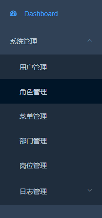
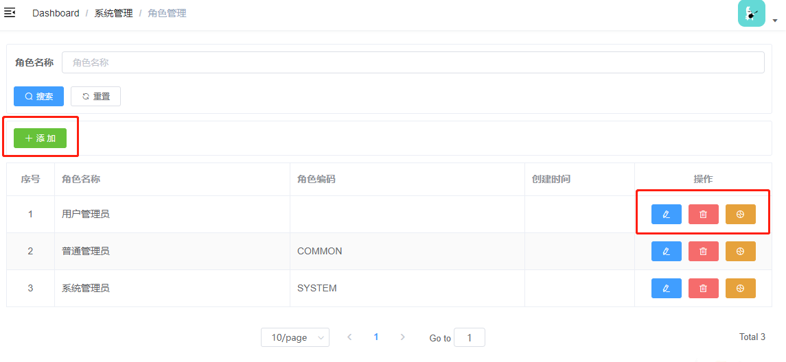
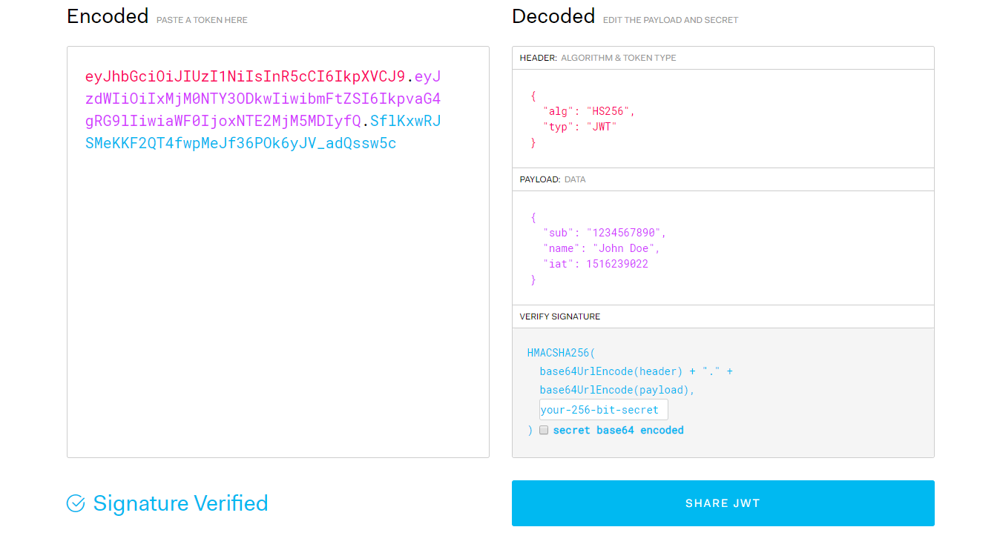
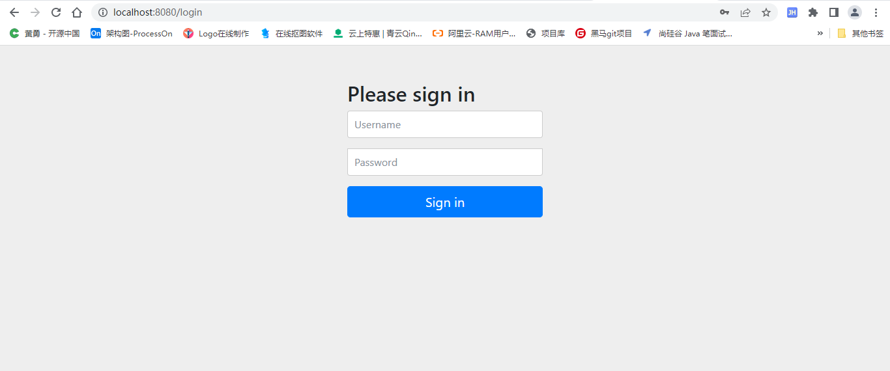
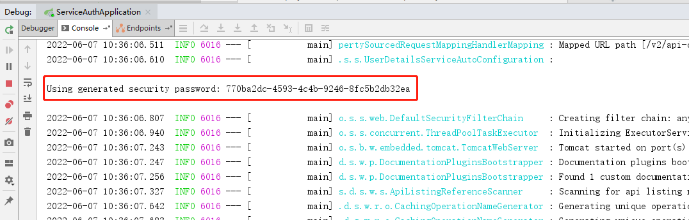
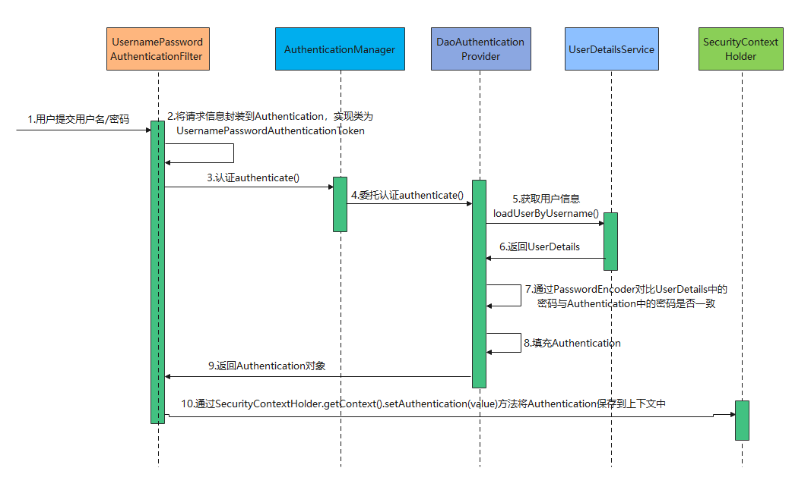

#  云尚办公系统：权限管理

## 一、权限管理

### 1、权限管理介绍

每个系统的权限功能都不尽相同，各有其自身的业务特点，对权限管理的设计也都各有特色。不过不管是怎样的权限设计，大致可归为三种：**页面权限(菜单级)、操作权限（按钮级）、数据权限**。当前系统只是讲解：菜单权限与按钮权限的控制。

#### 1.1、菜单权限

菜单权限就是对页面的控制，就是有这个权限的用户才能访问这个页面，没这个权限的用户就无法访问，它是以整个页面为维度，对权限的控制并没有那么细，所以是一种**粗颗粒权限**。



#### 1.2、按钮权限

按钮权限就是将页面的**操作**视为资源，比如删除操作，有些人可以操作有些人不能操作。对于后端来说，操作就是一个接口。于前端来说，操作往往是一个按钮，是一种**细颗粒权限**。



#### 1.3、权限管理设计思路

前面我们讲解了用户管理、角色管理及菜单管理，我们把菜单权限分配给角色，把角色分配给用户，那么用户就拥有了角色的所有权限（权限包含：菜单权限与按钮权限）。

接下来需要实现这两个接口：

1、用户登录

2、登录成功根据token获取用户相关信息（菜单权限及按钮权限数据等）

用户登录我们需要用到JWT，接下来讲解JWT。


### 2、JWT

#### 2.1、JWT介绍

JWT是JSON Web Token的缩写，即JSON Web令牌，是一种自包含令牌。 是为了在网络应用环境间传递声明而执行的一种基于JSON的开放标准。

JWT的声明一般被用来在身份提供者和服务提供者间传递被认证的用户身份信息，以便于从资源服务器获取资源。比如用在用户登录上。

JWT最重要的作用就是对 token信息的防伪作用。

#### 2.2、JWT令牌的组成

一个JWT由三个部分组成：**JWT头、有效载荷、签名哈希**
最后由这三者组合进行base64url编码得到JWT

典型的，一个JWT看起来如下图：该对象为一个很长的字符串，字符之间通过"."分隔符分为三个子串。
https://jwt.io/



**JWT头**

JWT头部分是一个描述JWT元数据的JSON对象，通常如下所示。

```
{
  "alg": "HS256",
  "typ": "JWT"
}
```

在上面的代码中，alg属性表示签名使用的算法，默认为HMAC SHA256（写为HS256）；

typ属性表示令牌的类型，JWT令牌统一写为JWT。

最后，使用Base64 URL算法将上述JSON对象转换为字符串保存。


**有效载荷**

有效载荷部分，是JWT的主体内容部分，也是一个JSON对象，包含需要传递的数据。 JWT指定七个默认字段供选择。

```
iss: jwt签发者
sub: 主题
aud: 接收jwt的一方
exp: jwt的过期时间，这个过期时间必须要大于签发时间
nbf: 定义在什么时间之前，该jwt都是不可用的.
iat: jwt的签发时间
jti: jwt的唯一身份标识，主要用来作为一次性token,从而回避重放攻击。
```


```
{
  "name": "Helen",
  "role": "editor",
  "avatar": "helen.jpg"
}
```

请注意，默认情况下JWT是未加密的，任何人都可以解读其内容，因此不要构建隐私信息字段，存放保密信息，以防止信息泄露。

JSON对象也使用Base64 URL算法转换为字符串保存。


**签名哈希**

签名哈希部分是对上面两部分数据签名，通过指定的算法生成哈希，以确保数据不会被篡改。

首先，需要指定一个密码（secret）。该密码仅仅为保存在服务器中，并且不能向用户公开。然后，使用标头中指定的签名算法（默认情况下为HMAC SHA256）根据以下公式生成签名。

```
HMACSHA256(base64UrlEncode(header) + "." + base64UrlEncode(claims), secret)    ==>   签名hash
```

在计算出签名哈希后，JWT头，有效载荷和签名哈希的三个部分组合成一个字符串，每个部分用"."分隔，就构成整个JWT对象。


**Base64URL算法**

如前所述，JWT头和有效载荷序列化的算法都用到了Base64URL。该算法和常见Base64算法类似，稍有差别。

作为令牌的JWT可以放在URL中（例如api.example/?token=xxx）。 Base64中用的三个字符是"+"，"/"和"="，由于在URL中有特殊含义，因此Base64URL中对他们做了替换："="去掉，"+"用"-"替换，"/"用"_"替换，这就是Base64URL算法。

#### 2.3、项目集成JWT

操作模块：common-util

##### 2.3.1、 引入依赖

```xml
<dependency>
    <groupId>io.jsonwebtoken</groupId>
    <artifactId>jjwt</artifactId>
</dependency>
```

##### 2.3.2、 添加JWT帮助类

```java
package com.atguigu.common.jwt;

import io.jsonwebtoken.*;
import org.springframework.util.StringUtils;

import java.util.Date;

public class JwtHelper {

    private static long tokenExpiration = 365 * 24 * 60 * 60 * 1000;
    private static String tokenSignKey = "123456";

    public static String createToken(Long userId, String username) {
        String token = Jwts.builder()
                .setSubject("AUTH-USER")
                .setExpiration(new Date(System.currentTimeMillis() + tokenExpiration))
                .claim("userId", userId)
                .claim("username", username)
                .signWith(SignatureAlgorithm.HS512, tokenSignKey)
                .compressWith(CompressionCodecs.GZIP)
                .compact();
        return token;
    }

    public static Long getUserId(String token) {
        try {
            if (StringUtils.isEmpty(token)) return null;

            Jws<Claims> claimsJws = Jwts.parser().setSigningKey(tokenSignKey).parseClaimsJws(token);
            Claims claims = claimsJws.getBody();
            Integer userId = (Integer) claims.get("userId");
            return userId.longValue();
        } catch (Exception e) {
            e.printStackTrace();
            return null;
        }
    }

    public static String getUsername(String token) {
        try {
            if (StringUtils.isEmpty(token)) return "";

            Jws<Claims> claimsJws = Jwts.parser().setSigningKey(tokenSignKey).parseClaimsJws(token);
            Claims claims = claimsJws.getBody();
            return (String) claims.get("username");
        } catch (Exception e) {
            e.printStackTrace();
            return null;
        }
    }

    public static void main(String[] args) {
        String token = JwtHelper.createToken(1L, "admin");
        System.out.println(token);
        System.out.println(JwtHelper.getUserId(token));
        System.out.println(JwtHelper.getUsername(token));
    }
}
```


### 3、用户登录

#### 3.1、修改登录方法

修改IndexController类登录方法

```java
@Autowired
private SysUserService sysUserService;
    
@ApiOperation(value = "登录")
@PostMapping("login")
public Result login(@RequestBody LoginVo loginVo) {
    SysUser sysUser = sysUserService.getByUsername(loginVo.getUsername());
    if(null == sysUser) {
        throw new GuiguException(201,"用户不存在");
    }
    if(!MD5.encrypt(loginVo.getPassword()).equals(loginVo.getPassword())) {
        throw new GuiguException(201,"密码错误");
    }
    if(sysUser.getStatus().intValue() == 0) {
        throw new GuiguException(201,"用户被禁用");
    }

    Map<String, Object> map = new HashMap<>();
    map.put("token", JwtHelper.createToken(sysUser.getId(), sysUser.getUsername()));
    return Result.ok(map);
}
```

#### 3.2、添加service接口及实现

```java
SysUser getByUsername(String username);
```

接口实现：

```java
@Override
public SysUser getByUsername(String username) {
   return this.getOne(new LambdaQueryWrapper<SysUser>().eq(SysUser::getUsername, username));
}
```


### 4、获取用户信息

接口数据：

```java
Map<String, Object> map = new HashMap<>();
map.put("roles","[admin]");
map.put("name","admin");
map.put("avatar","https://oss.aliyuncs.com/aliyun_id_photo_bucket/default_handsome.jpg");
map.put("buttons", new ArrayList<>());
map.put("routers", new ArrayList<>());
```

说明：主要是获取当前登录用户的菜单权限及按钮权限数据

#### 4.1、获取用户菜单权限

说明：获取菜单权限数据，我们要将菜单数据构建成路由数据结构

##### 4.1.1、定义接口

SysMenuService类

```java
/**
 * 获取用户菜单
 * @param userId
 * @return
 */
List<RouterVo> findUserMenuList(Long userId);
```

##### 4.1.2、接口实现

```java
@Override
public List<RouterVo> findUserMenuList(Long userId) {
    //超级管理员admin账号id为：1
    List<SysMenu> sysMenuList = null;
    if (userId.longValue() == 1) {
        sysMenuList = this.list(new LambdaQueryWrapper<SysMenu>().eq(SysMenu::getStatus, 1).orderByAsc(SysMenu::getSortValue));
    } else {
        sysMenuList = sysMenuMapper.findListByUserId(userId);
    }
    //构建树形数据
    List<SysMenu> sysMenuTreeList = MenuHelper.buildTree(sysMenuList);

    List<RouterVo> routerVoList = this.buildMenus(sysMenuTreeList);
    return routerVoList;
}

/**
 * 根据菜单构建路由
 * @param menus
 * @return
 */
private List<RouterVo> buildMenus(List<SysMenu> menus) {
    List<RouterVo> routers = new LinkedList<RouterVo>();
    for (SysMenu menu : menus) {
        RouterVo router = new RouterVo();
        router.setHidden(false);
        router.setAlwaysShow(false);
        router.setPath(getRouterPath(menu));
        router.setComponent(menu.getComponent());
        router.setMeta(new MetaVo(menu.getName(), menu.getIcon()));
        List<SysMenu> children = menu.getChildren();
        //如果当前是菜单，需将按钮对应的路由加载出来，如：“角色授权”按钮对应的路由在“系统管理”下面
        if(menu.getType().intValue() == 1) {
            List<SysMenu> hiddenMenuList = children.stream().filter(item -> !StringUtils.isEmpty(item.getComponent())).collect(Collectors.toList());
            for (SysMenu hiddenMenu : hiddenMenuList) {
                RouterVo hiddenRouter = new RouterVo();
                hiddenRouter.setHidden(true);
                hiddenRouter.setAlwaysShow(false);
                hiddenRouter.setPath(getRouterPath(hiddenMenu));
                hiddenRouter.setComponent(hiddenMenu.getComponent());
                hiddenRouter.setMeta(new MetaVo(hiddenMenu.getName(), hiddenMenu.getIcon()));
                routers.add(hiddenRouter);
            }
        } else {
            if (!CollectionUtils.isEmpty(children)) {
                if(children.size() > 0) {
                    router.setAlwaysShow(true);
                }
                router.setChildren(buildMenus(children));
            }
        }
        routers.add(router);
    }
    return routers;
}

/**
 * 获取路由地址
 *
 * @param menu 菜单信息
 * @return 路由地址
 */
public String getRouterPath(SysMenu menu) {
    String routerPath = "/" + menu.getPath();
    if(menu.getParentId().intValue() != 0) {
        routerPath = menu.getPath();
    }
    return routerPath;
}
```

##### 4.1.3、添加mapper接口

SysMenuMapper类

```java
List<SysMenu> findListByUserId(@Param("userId") Long userId);
```

##### 4.1.4、添加xml方法

新建SysMenuMapper.xml文件

```xml
<?xml version="1.0" encoding="UTF-8" ?>
<!DOCTYPE mapper
PUBLIC "-//ibatis.apache.org//DTD Mapper 3.0//EN"
"http://ibatis.apache.org/dtd/ibatis-3-mapper.dtd">


<mapper namespace="com.atguigu.system.mapper.SysMenuMapper">

   <resultMap id="sysMenuMap" type="com.atguigu.model.system.SysMenu" autoMapping="true">
   </resultMap>

   <!-- 用于select查询公用抽取的列 -->
   <sql id="columns">
      m.id,m.parent_id,m.name,m.type,m.path,m.component,m.perms,m.icon,m.sort_value,m.status,m.create_time,m.update_time,m.is_deleted
   </sql>


    <select id="findListByUserId" resultMap="sysMenuMap">
      select
      distinct <include refid="columns" />
      from sys_menu m
      inner join sys_role_menu rm on rm.menu_id = m.id
      inner join sys_user_role ur on ur.role_id = rm.role_id
      where
      ur.user_id = #{userId}
      and m.status = 1
      and rm.is_deleted = 0
      and ur.is_deleted = 0
      and m.is_deleted = 0
   </select>

</mapper>
```

#### 4.2、获取用户按钮权限

说明：只需要获取按钮标识即可

##### 4.1.1、定义接口

SysMenuService类

```java
/**
 * 获取用户按钮权限
 * @param userId
 * @return
 */
List<String> findUserPermsList(Long userId);
```

##### 4.1.2、接口实现

```java
@Override
public List<String> findUserPermsList(Long userId) {
    //超级管理员admin账号id为：1
    List<SysMenu> sysMenuList = null;
    if (userId.longValue() == 1) {
        sysMenuList = this.list(new LambdaQueryWrapper<SysMenu>().eq(SysMenu::getStatus, 1));
    } else {
        sysMenuList = sysMenuMapper.findListByUserId(userId);
    }
    List<String> permsList = sysMenuList.stream().filter(item -> item.getType() == 2).map(item -> item.getPerms()).collect(Collectors.toList());
    return permsList;
}
```

#### 4.3、修改Controller方法

IndexController类

```java
@ApiOperation(value = "获取用户信息")
@GetMapping("info")
public Result info(HttpServletRequest request) {
    String username = JwtHelper.getUsername(request.getHeader("token"));
    Map<String, Object> map = sysUserService.getUserInfo(username);
    return Result.ok(map);
}
```

#### 4.3、定义service接口

SysUserService类

```java
/**
 * 根据用户名获取用户登录信息
 * @param username
 * @return
 */
Map<String, Object> getUserInfo(String username);
```

#### 4.4、service接口实现

```java
@Autowired
private SysMenuService sysMenuService;
```

```java
@Override
public Map<String, Object> getUserInfo(String username) {
   Map<String, Object> result = new HashMap<>();
   SysUser sysUser = this.getByUsername(username);

   //根据用户id获取菜单权限值
   List<RouterVo> routerVoList = sysMenuService.findUserMenuList(sysUser.getId());
   //根据用户id获取用户按钮权限
   List<String> permsList = sysMenuService.findUserPermsList(sysUser.getId());

   result.put("name", sysUser.getName());
   result.put("avatar", "https://wpimg.wallstcn.com/f778738c-e4f8-4870-b634-56703b4acafe.gif");
   //当前权限控制使用不到，我们暂时忽略
   result.put("roles",  new HashSet<>());
   result.put("buttons", permsList);
   result.put("routers", routerVoList);
   return result;
}
```

### 5、前端对接

参考前端对接文档：《前端权限对接文档》

可直接引入前端项目完整代码

### 6、总结

当前我们已经实现前端菜单及按钮的权限控制，服务器端还没加任何控制，那么服务器端怎么控制呢？其实很简单，就是要在页面按钮对应的controller方法上面加对应的权限控制，即在进入controller方法前判断当前用户是否有访问权限。

怎么实现呢？如果我们自己实现，那么肯定想到的就是Fillter加Aop就可以实现，有现成的开源技术框架吗？答案是肯定的，如：Spring Security、Shiro等一系列开源框架可供选择。


## 二、Spring Security介绍

### 1、Spring Security简介

Spring 是非常流行和成功的 Java 应用开发框架，Spring Security 正是 Spring 家族中的成员。Spring Security 基于 Spring 框架，提供了一套 Web 应用安全性的完整解决方案。

正如你可能知道的关于安全方面的两个核心功能是“**认证**”和“**授权**”，一般来说，Web 应用的安全性包括**用户认证（Authentication）和用户授权（Authorization）**两个部分，这两点也是 SpringSecurity 重要核心功能。

（1）用户认证指的是：验证某个用户是否为系统中的合法主体，也就是说用户能否访问该系统。用户认证一般要求用户提供用户名和密码，系统通过校验用户名和密码来完成认证过程。

**通俗点说就是系统认为用户是否能登录**

（2）用户授权指的是验证某个用户是否有权限执行某个操作。在一个系统中，不同用户所具有的权限是不同的。比如对一个文件来说，有的用户只能进行读取，而有的用户可以进行修改。一般来说，系统会为不同的用户分配不同的角色，而每个角色则对应一系列的权限。

**通俗点讲就是系统判断用户是否有权限去做某些事情。**

### 2、同款产品对比

#### 3.1、Spring Security

Spring 技术栈的组成部分。

https://spring.io/projects/spring-security

通过提供完整可扩展的认证和授权支持保护你的应用程序。

**SpringSecurity 特点：**

- 和 Spring 无缝整合。
- 全面的权限控制。
- 专门为 Web 开发而设计。
  - 旧版本不能脱离 Web 环境使用。
  - 新版本对整个框架进行了分层抽取，分成核心模块和 Web 模块。单独引入核心模块就可以脱离 Web 环境。
- 重量级。

#### 3.2、 Shiro

Apache 旗下的轻量级权限控制框架。

**特点：**

- 轻量级。Shiro 主张的理念是把复杂的事情变简单。针对对性能有更高要求的互联网应用有更好表现。
- 通用性。
  - 好处：不局限于 Web 环境，可以脱离 Web 环境使用。
  - 缺陷：在 Web 环境下一些特定的需求需要手动编写代码定制。

Spring Security 是 Spring 家族中的一个安全管理框架，实际上，在 Spring Boot 出现之前，Spring Security 就已经发展了多年了，但是使用的并不多，安全管理这个领域，一直是 Shiro 的天下。

相对于 Shiro，在 SSM 中整合 Spring Security 都是比较麻烦的操作，所以，Spring Security 虽然功能比 Shiro 强大，但是使用反而没有 Shiro 多（Shiro 虽然功能没有Spring Security 多，但是对于大部分项目而言，Shiro 也够用了）。自从有了 Spring Boot 之后，Spring Boot 对于 Spring Security 提供了自动化配置方案，可以使用更少的配置来使用 Spring Security。


## 三、Spring Security实现权限

要对Web资源进行保护，最好的办法莫过于Filter
要想对方法调用进行保护，最好的办法莫过于[AOP](https://so.csdn.net/so/search?q=AOP&spm=1001.2101.3001.7020)。

Spring Security进行认证和鉴权的时候,就是利用的一系列的Filter来进行拦截的。


如图所示，一个请求想要访问到API就会从左到右经过蓝线框里的过滤器，其中**绿色部分是负责认证的过滤器，蓝色部分是负责异常处理，橙色部分则是负责授权**。进过一系列拦截最终访问到我们的API。


这里面我们只需要重点关注两个过滤器即可：`UsernamePasswordAuthenticationFilter`负责登录认证，`FilterSecurityInterceptor`负责权限授权。

说明：**Spring Security的核心逻辑全在这一套过滤器中，过滤器里会调用各种组件完成功能，掌握了这些过滤器和组件你就掌握了Spring Security**！这个框架的使用方式就是对这些过滤器和组件进行扩展。

### 1、Spring Security入门

我们在现有的项目基础上做集成，Spring Security权限控制部分也是公共模块，后续哪个service服务模块需要，直接引入即可。

后续我们的Spring Cloud微服务项目可能就基于该权限系统开发，因此我们要做好技术扩展。

#### 1.1、创建spring-security模块

在common模块下创建spring-security公共模块，创建方式如：service-util模块

#### 1.2、添加依赖

修改pom.xml

```xml
<?xml version="1.0" encoding="UTF-8"?>
<project xmlns="http://maven.apache.org/POM/4.0.0" xmlns:xsi="http://www.w3.org/2001/XMLSchema-instance"
         xsi:schemaLocation="http://maven.apache.org/POM/4.0.0 https://maven.apache.org/xsd/maven-4.0.0.xsd">
    <modelVersion>4.0.0</modelVersion>

    <parent>
        <groupId>com.atguigu</groupId>
        <artifactId>common</artifactId>
        <version>1.0-SNAPSHOT</version>
    </parent>

    <artifactId>spring-security</artifactId>
    
    <dependencies>
        <dependency>
            <groupId>com.atguigu</groupId>
            <artifactId>common-util</artifactId>
            <version>1.0-SNAPSHOT</version>
        </dependency>
        <!-- Spring Security依赖 -->
        <dependency>
            <groupId>org.springframework.boot</groupId>
            <artifactId>spring-boot-starter-security</artifactId>
        </dependency>
        <dependency>
			<groupId>org.springframework.boot</groupId>
			<artifactId>spring-boot-starter-web</artifactId>
			<scope>provided </scope>
		</dependency>
    </dependencies>

</project>
```

说明：依赖包（spring-boot-starter-security）导入后，Spring Security就默认提供了许多功能将整个应用给保护了起来：

​	1、要求经过身份验证的用户才能与应用程序进行交互

​	2、创建好了默认登录表单

​	3、生成用户名为`user`的随机密码并打印在控制台上

​	等等......

#### 1.3、添加配置类

```java
package com.atguigu.security.config;

import org.springframework.context.annotation.Configuration;
import org.springframework.security.config.annotation.web.configuration.EnableWebSecurity;
import org.springframework.security.config.annotation.web.configuration.WebSecurityConfigurerAdapter;

@Configuration
@EnableWebSecurity //@EnableWebSecurity是开启SpringSecurity的默认行为
public class WebSecurityConfig extends WebSecurityConfigurerAdapter {

}
```

#### 1.4、service-oa模块引入

在service-oa引入权限模块，将依赖添加到pom.mxl文件

```xml
<dependency>
    <groupId>com.atguigu</groupId>
    <artifactId>spring-security</artifactId>
    <version>1.0-SNAPSHOT</version>
</dependency>
```

#### 1.5、启动项目测试

在浏览器访问：http://localhost:8800/admin/system/sysRole/findAll

自动跳转到了登录页面



默认的用户名：user

密码在项目启动的时候在控制台会打印，**注意每次启动的时候密码都回发生变化！**



输入用户名，密码，成功访问到controller方法并返回数据，说明Spring Security默认安全保护生效。

在实际开发中，这些默认的配置是不能满足我们需要的，我们需要扩展Spring Security组件，完成自定义配置，实现我们的项目需求。


### 2、用户认证

用户认证流程：



#### 2.1、用户认证核心组件

我们系统中会有许多用户，确认当前是哪个用户正在使用我们系统就是登录认证的最终目的。这里我们就提取出了一个核心概念：**当前登录用户/当前认证用户**。整个系统安全都是围绕当前登录用户展开的，这个不难理解，要是当前登录用户都不能确认了，那A下了一个订单，下到了B的账户上这不就乱套了。这一概念在Spring Security中的体现就是 **`Authentication`**，它存储了认证信息，代表当前登录用户。

我们在程序中如何获取并使用它呢？我们需要通过 **`SecurityContext`** 来获取`Authentication`，`SecurityContext`就是我们的上下文对象！这个上下文对象则是交由 **`SecurityContextHolder`** 进行管理，你可以在程序**任何地方**使用它：

```java
Authentication authentication = SecurityContextHolder.getContext().getAuthentication();
```

`SecurityContextHolder`原理非常简单，就是使用`ThreadLocal`来保证一个线程中传递同一个对象！

**现在我们已经知道了Spring Security中三个核心组件：**

​	1、`Authentication`：存储了认证信息，代表当前登录用户

​	2、`SeucirtyContext`：上下文对象，用来获取`Authentication`

​	3、`SecurityContextHolder`：上下文管理对象，用来在程序任何地方获取`SecurityContext`

**`Authentication`中是什么信息呢：**

​	1、`Principal`：用户信息，没有认证时一般是用户名，认证后一般是用户对象

​	2、`Credentials`：用户凭证，一般是密码

​	3、`Authorities`：用户权限

#### 2.2、用户认证

Spring Security是怎么进行用户认证的呢？

**`AuthenticationManager`** 就是Spring Security用于执行身份验证的组件，只需要调用它的`authenticate`方法即可完成认证。Spring Security默认的认证方式就是在`UsernamePasswordAuthenticationFilter`这个过滤器中进行认证的，该过滤器负责认证逻辑。

Spring Security用户认证关键代码如下：

```
// 生成一个包含账号密码的认证信息
Authentication authenticationToken = new UsernamePasswordAuthenticationToken(username, passwrod);
// AuthenticationManager校验这个认证信息，返回一个已认证的Authentication
Authentication authentication = authenticationManager.authenticate(authenticationToken);
// 将返回的Authentication存到上下文中
SecurityContextHolder.getContext().setAuthentication(authentication);
```

下面我们来分析一下。

##### 2.2.1、认证接口分析

`AuthenticationManager`的校验逻辑非常简单：

根据用户名先查询出用户对象(没有查到则抛出异常)将用户对象的密码和传递过来的密码进行校验，密码不匹配则抛出异常。

这个逻辑没啥好说的，再简单不过了。重点是这里每一个步骤Spring Security都提供了组件：

​	1、是谁执行 **根据用户名查询出用户对象** 逻辑的呢？用户对象数据可以存在内存中、文件中、数据库中，你得确定好怎么查才行。这一部分就是交由**`UserDetialsService`** 处理，该接口只有一个方法`loadUserByUsername(String username)`，通过用户名查询用户对象，默认实现是在内存中查询。

​	2、那查询出来的 **用户对象** 又是什么呢？每个系统中的用户对象数据都不尽相同，咱们需要确认我们的用户数据是啥样的才行。Spring Security中的用户数据则是由**`UserDetails`** 来体现，该接口中提供了账号、密码等通用属性。

​	3、**对密码进行校验**大家可能会觉得比较简单，`if、else`搞定，就没必要用什么组件了吧？但框架毕竟是框架考虑的比较周全，除了`if、else`外还解决了密码加密的问题，这个组件就是**`PasswordEncoder`**，负责密码加密与校验。

我们可以看下`AuthenticationManager`校验逻辑的大概源码：

```java
public Authentication authenticate(Authentication authentication) throws AuthenticationException {
...省略其他代码

    // 传递过来的用户名
    String username = authentication.getName();
    // 调用UserDetailService的方法，通过用户名查询出用户对象UserDetail（查询不出来UserDetailService则会抛出异常）
    UserDetails userDetails = this.getUserDetailsService().loadUserByUsername(username);
    String presentedPassword = authentication.getCredentials().toString();

    // 传递过来的密码
    String password = authentication.getCredentials().toString();
    // 使用密码解析器PasswordEncoder传递过来的密码是否和真实的用户密码匹配
    if (!passwordEncoder.matches(password, userDetails.getPassword())) {
        // 密码错误则抛出异常
        throw new BadCredentialsException("错误信息...");
    }

    // 注意哦，这里返回的已认证Authentication，是将整个UserDetails放进去充当Principal
    UsernamePasswordAuthenticationToken result = new UsernamePasswordAuthenticationToken(userDetails,
            authentication.getCredentials(), userDetails.getAuthorities());
    return result;

...省略其他代码
}
```

`UserDetialsService`、`UserDetails`、`PasswordEncoder`，这三个组件Spring Security都有默认实现，这一般是满足不了我们的实际需求的，所以这里我们自己来实现这些组件！


**下面我们就在项目里面来实现用户认证。**

##### 2.2.3、加密器PasswordEncoder

加密我们项目采取MD5加密

操作模块：spring-security模块

**自定义加密处理组件：CustomMd5PasswordEncoder**

```java
package com.atguigu.security.custom;

import com.atguigu.common.util.MD5;
import org.springframework.security.crypto.password.PasswordEncoder;
import org.springframework.stereotype.Component;

/**
 * <p>
 * 密码处理
 * </p>
 *
 */
@Component
public class CustomMd5PasswordEncoder implements PasswordEncoder {

    public String encode(CharSequence rawPassword) {
        return MD5.encrypt(rawPassword.toString());
    }

    public boolean matches(CharSequence rawPassword, String encodedPassword) {
        return encodedPassword.equals(MD5.encrypt(rawPassword.toString()));
    }
}
```

##### 2.2.4、用户对象UserDetails

该接口就是我们所说的用户对象，它提供了用户的一些通用属性，源码如下：

```java
public interface UserDetails extends Serializable {
	/**
     * 用户权限集合（这个权限对象现在不管它，到权限时我会讲解）
     */
    Collection<? extends GrantedAuthority> getAuthorities();
    /**
     * 用户密码
     */
    String getPassword();
    /**
     * 用户名
     */
    String getUsername();
    /**
     * 用户没过期返回true，反之则false
     */
    boolean isAccountNonExpired();
    /**
     * 用户没锁定返回true，反之则false
     */
    boolean isAccountNonLocked();
    /**
     * 用户凭据(通常为密码)没过期返回true，反之则false
     */
    boolean isCredentialsNonExpired();
    /**
     * 用户是启用状态返回true，反之则false
     */
    boolean isEnabled();
}
```

实际开发中我们的用户属性各种各样，这些默认属性可能是满足不了，所以我们一般会自己实现该接口，然后设置好我们实际的用户实体对象。实现此接口要重写很多方法比较麻烦，我们可以继承Spring Security提供的`org.springframework.security.core.userdetails.User`类，该类实现了`UserDetails`接口帮我们省去了重写方法的工作：

操作模块：spring-security模块

**添加CustomUser对象**

```java
package com.atguigu.security.custom;

import com.atguigu.model.system.SysUser;
import lombok.Data;
import org.springframework.security.core.GrantedAuthority;
import org.springframework.security.core.userdetails.User;

import java.util.Collection;

public class CustomUser extends User {

    /**
     * 我们自己的用户实体对象，要调取用户信息时直接获取这个实体对象。（这里我就不写get/set方法了）
     */
    private SysUser sysUser;

    public CustomUser(SysUser sysUser, Collection<? extends GrantedAuthority> authorities) {
        super(sysUser.getUsername(), sysUser.getPassword(), authorities);
        this.sysUser = sysUser;
    }

    public SysUser getSysUser() {
        return sysUser;
    }

    public void setSysUser(SysUser sysUser) {
        this.sysUser = sysUser;
    }
    
}
```

##### 2.2.5 业务对象UserDetailsService

该接口很简单只有一个方法：

```java
public interface UserDetailsService {
    /**
     * 根据用户名获取用户对象（获取不到直接抛异常）
     */
    UserDetails loadUserByUsername(String username) throws UsernameNotFoundException;
}
```

我们实现该接口，就完成了自己的业务

**操作模块：service-oa**

**添加UserDetailsServiceImpl类，实现UserDetailsService接口**

```java
package com.atguigu.system.service.impl;

import com.atguigu.common.execption.GuiguException;
import com.atguigu.common.result.ResultCodeEnum;
import com.atguigu.model.system.SysUser;
import com.atguigu.security.custom.CustomUser;
import com.atguigu.system.service.SysUserService;
import org.springframework.beans.factory.annotation.Autowired;
import org.springframework.security.core.userdetails.UserDetails;
import org.springframework.security.core.userdetails.UserDetailsService;
import org.springframework.security.core.userdetails.UsernameNotFoundException;
import org.springframework.stereotype.Component;

import java.util.Collections;


@Component
public class UserDetailsServiceImpl implements UserDetailsService {

    @Autowired
    private SysUserService sysUserService;
 
    @Override
    public UserDetails loadUserByUsername(String username) throws UsernameNotFoundException {
        SysUser sysUser = sysUserService.getByUsername(username);
        if(null == sysUser) {
            throw new UsernameNotFoundException("用户名不存在！");
        }

        if(sysUser.getStatus().intValue() == 0) {
            throw new RuntimeException("账号已停用");
        }
        return new CustomUser(sysUser, Collections.emptyList());
    }
}
```

`AuthenticationManager`校验所调用的三个组件我们就已经做好实现了！

##### 2.2.6、自定义用户认证接口

```java
package com.atguigu.security.fillter;

import com.atguigu.common.jwt.JwtHelper;
import com.atguigu.common.result.Result;
import com.atguigu.common.result.ResultCodeEnum;
import com.atguigu.common.util.ResponseUtil;
import com.atguigu.security.custom.CustomUser;
import com.atguigu.vo.system.LoginVo;
import com.fasterxml.jackson.databind.ObjectMapper;
import org.springframework.security.authentication.AuthenticationManager;
import org.springframework.security.authentication.UsernamePasswordAuthenticationToken;
import org.springframework.security.core.Authentication;
import org.springframework.security.core.AuthenticationException;
import org.springframework.security.web.authentication.UsernamePasswordAuthenticationFilter;
import org.springframework.security.web.util.matcher.AntPathRequestMatcher;

import javax.servlet.FilterChain;
import javax.servlet.ServletException;
import javax.servlet.http.HttpServletRequest;
import javax.servlet.http.HttpServletResponse;
import java.io.IOException;
import java.util.HashMap;
import java.util.Map;

/**
 * <p>
 * 登录过滤器，继承UsernamePasswordAuthenticationFilter，对用户名密码进行登录校验
 * </p>
 */
public class TokenLoginFilter extends UsernamePasswordAuthenticationFilter {

    public TokenLoginFilter(AuthenticationManager authenticationManager) {
        this.setAuthenticationManager(authenticationManager);
        this.setPostOnly(false);
        //指定登录接口及提交方式，可以指定任意路径
        this.setRequiresAuthenticationRequestMatcher(new AntPathRequestMatcher("/admin/system/index/login","POST"));
    }

    /**
     * 登录认证
     * @param req
     * @param res
     * @return
     * @throws AuthenticationException
     */
    @Override
    public Authentication attemptAuthentication(HttpServletRequest req, HttpServletResponse res)
            throws AuthenticationException {
        try {
            LoginVo loginVo = new ObjectMapper().readValue(req.getInputStream(), LoginVo.class);

            Authentication authenticationToken = new UsernamePasswordAuthenticationToken(loginVo.getUsername(), loginVo.getPassword());
            return this.getAuthenticationManager().authenticate(authenticationToken);
        } catch (IOException e) {
            throw new RuntimeException(e);
        }

    }

    /**
     * 登录成功
     * @param request
     * @param response
     * @param chain
     * @param auth
     * @throws IOException
     * @throws ServletException
     */
    @Override
    protected void successfulAuthentication(HttpServletRequest request, HttpServletResponse response, FilterChain chain,
                                            Authentication auth) throws IOException, ServletException {
        CustomUser customUser = (CustomUser) auth.getPrincipal();
        String token = JwtHelper.createToken(customUser.getSysUser().getId(), customUser.getSysUser().getUsername());

        Map<String, Object> map = new HashMap<>();
        map.put("token", token);
        ResponseUtil.out(response, Result.ok(map));
    }

    /**
     * 登录失败
     * @param request
     * @param response
     * @param e
     * @throws IOException
     * @throws ServletException
     */
    @Override
    protected void unsuccessfulAuthentication(HttpServletRequest request, HttpServletResponse response,
                                              AuthenticationException e) throws IOException, ServletException {

        if(e.getCause() instanceof RuntimeException) {
            ResponseUtil.out(response, Result.build(null, 204, e.getMessage()));
        } else {
            ResponseUtil.out(response, Result.build(null, ResultCodeEnum.LOGIN_MOBLE_ERROR));
        }
    }
}
```

添加工具类：ResponseUtil

添加模块：common-util

```java
package com.atguigu.common.util;

import com.atguigu.common.result.Result;
import com.fasterxml.jackson.databind.ObjectMapper;
import org.springframework.http.HttpStatus;
import org.springframework.http.MediaType;

import javax.servlet.http.HttpServletResponse;
import java.io.IOException;

public class ResponseUtil {

    public static void out(HttpServletResponse response, Result r) {
        ObjectMapper mapper = new ObjectMapper();
        response.setStatus(HttpStatus.OK.value());
        response.setContentType(MediaType.APPLICATION_JSON_UTF8_VALUE);
        try {
            mapper.writeValue(response.getWriter(), r);
        } catch (IOException e) {
            e.printStackTrace();
        }
    }
}
```

##### 2.2.7、认证解析token

因为用户登录状态在token中存储在客户端，所以每次请求接口请求头携带token， 后台通过自定义token过滤器拦截解析token完成认证并填充用户信息实体。

```java
package com.atguigu.security.fillter;

import com.atguigu.common.jwt.JwtHelper;
import com.atguigu.common.result.Result;
import com.atguigu.common.result.ResultCodeEnum;
import com.atguigu.common.util.ResponseUtil;
import org.springframework.security.authentication.UsernamePasswordAuthenticationToken;
import org.springframework.security.core.context.SecurityContextHolder;
import org.springframework.util.StringUtils;
import org.springframework.web.filter.OncePerRequestFilter;
import javax.servlet.FilterChain;
import javax.servlet.ServletException;
import javax.servlet.http.HttpServletRequest;
import javax.servlet.http.HttpServletResponse;
import java.io.IOException;
import java.util.Collections;

/**
 * <p>
 * 认证解析token过滤器
 * </p>
 */
public class TokenAuthenticationFilter extends OncePerRequestFilter {

    public TokenAuthenticationFilter() {

    }

    @Override
    protected void doFilterInternal(HttpServletRequest request, HttpServletResponse response, FilterChain chain)
            throws IOException, ServletException {
        logger.info("uri:"+request.getRequestURI());
        //如果是登录接口，直接放行
        if("/admin/system/index/login".equals(request.getRequestURI())) {
            chain.doFilter(request, response);
            return;
        }

        UsernamePasswordAuthenticationToken authentication = getAuthentication(request);
        if(null != authentication) {
            SecurityContextHolder.getContext().setAuthentication(authentication);
            chain.doFilter(request, response);
        } else {
            ResponseUtil.out(response, Result.build(null, ResultCodeEnum.PERMISSION));
        }
    }

    private UsernamePasswordAuthenticationToken getAuthentication(HttpServletRequest request) {
        // token置于header里
        String token = request.getHeader("token");
        logger.info("token:"+token);
        if (!StringUtils.isEmpty(token)) {
            String useruame = JwtHelper.getUsername(token);
            logger.info("useruame:"+useruame);
            if (!StringUtils.isEmpty(useruame)) {
                return new UsernamePasswordAuthenticationToken(useruame, null, Collections.emptyList());
            }
        }
        return null;
    }
}
```

##### 2.2.8、配置用户认证

修改WebSecurityConfig配置类

```java
package com.atguigu.security.config;

import com.atguigu.security.custom.CustomMd5PasswordEncoder;
import com.atguigu.security.filter.TokenAuthenticationFilter;
import com.atguigu.security.filter.TokenLoginFilter;
import org.springframework.beans.factory.annotation.Autowired;
import org.springframework.context.annotation.Bean;
import org.springframework.context.annotation.Configuration;
import org.springframework.security.authentication.AuthenticationManager;
import org.springframework.security.config.annotation.authentication.builders.AuthenticationManagerBuilder;
import org.springframework.security.config.annotation.web.builders.HttpSecurity;
import org.springframework.security.config.annotation.web.builders.WebSecurity;
import org.springframework.security.config.annotation.web.configuration.EnableWebSecurity;
import org.springframework.security.config.annotation.web.configuration.WebSecurityConfigurerAdapter;
import org.springframework.security.config.http.SessionCreationPolicy;
import org.springframework.security.core.userdetails.UserDetailsService;
import org.springframework.security.crypto.password.PasswordEncoder;
import org.springframework.security.web.authentication.UsernamePasswordAuthenticationFilter;
import org.springframework.web.cors.CorsUtils;

@Configuration
@EnableWebSecurity //@EnableWebSecurity是开启SpringSecurity的默认行为
public class WebSecurityConfig extends WebSecurityConfigurerAdapter {

    @Autowired
    private UserDetailsService userDetailsService;

    @Autowired
    private CustomMd5PasswordEncoder customMd5PasswordEncoder;


    @Bean
    @Override
    protected AuthenticationManager authenticationManager() throws Exception {
        return super.authenticationManager();
    }

    @Override
    protected void configure(HttpSecurity http) throws Exception {
        // 这是配置的关键，决定哪些接口开启防护，哪些接口绕过防护
        http
                //关闭csrf跨站请求伪造
                .csrf().disable()
                // 开启跨域以便前端调用接口
                .cors().and()
                .authorizeRequests()
                // 指定某些接口不需要通过验证即可访问。登陆接口肯定是不需要认证的
                .antMatchers("/admin/system/index/login").permitAll()
                // 这里意思是其它所有接口需要认证才能访问
                .anyRequest().authenticated()
                .and()
                //TokenAuthenticationFilter放到UsernamePasswordAuthenticationFilter的前面，这样做就是为了除了登录的时候去查询数据库外，其他时候都用token进行认证。
                .addFilterBefore(new TokenAuthenticationFilter(), UsernamePasswordAuthenticationFilter.class)
                .addFilter(new TokenLoginFilter(authenticationManager()));

        //禁用session
        http.sessionManagement().sessionCreationPolicy(SessionCreationPolicy.STATELESS);
    }

    @Override
    protected void configure(AuthenticationManagerBuilder auth) throws Exception {
        // 指定UserDetailService和加密器
    auth.userDetailsService(userDetailsService)
        .passwordEncoder(customMd5PasswordEncoder);
    }

    /**
     * 配置哪些请求不拦截
     * 排除swagger相关请求
     * @param web
     * @throws Exception
     */
    @Override
    public void configure(WebSecurity web) throws Exception {
        web.ignoring().antMatchers("/favicon.ico","/swagger-resources/**", "/webjars/**", "/v2/**", "/swagger-ui.html/**", "/doc.html");
    }
}
```

**说明：**

**1、我们是前后端分离项目，使用`jwt`生成token ，即用户状态保存在客户端中，前后端交互通过api接口 `无session`生成，所以我们不需要配置`formLogin`，session禁用**

**2、在浏览器访问：http://localhost:8800/admin/system/sysRole/findAll**

```
{
    "code": 209,
    "message": "没有权限",
    "data": null
}
```

##### 2.2.9、通过swagger测试登录

在相应的自定义组件设置断点，查看是否按照预期执行。

1、先输入正确的用户名与密码

2、输入错误的用户名与密码

结论：跟预期一致


### 3、用户授权

 在SpringSecurity中，会使用默认的FilterSecurityInterceptor来进行权限校验。在FilterSecurityInterceptor中会从SecurityContextHolder获取其中的**Authentication**，然后获取其中的权限信息。判断当前用户是否拥有访问当前资源所需的权限。

**SpringSecurity中的Authentication类：**

```java
public interface Authentication extends Principal, Serializable {
	//权限数据列表
    Collection<? extends GrantedAuthority> getAuthorities();

    Object getCredentials();

    Object getDetails();

    Object getPrincipal();

    boolean isAuthenticated();

    void setAuthenticated(boolean var1) throws IllegalArgumentException;
}
```


前面登录时执行loadUserByUsername方法时，return new CustomUser(sysUser, Collections.emptyList());后面的空数据对接就是返回给Spring Security的权限数据。

在TokenAuthenticationFilter中怎么获取权限数据呢？登录时我们把权限数据保存到redis中（用户名为key，权限数据为value即可），这样通过token获取用户名即可拿到权限数据，这样就可构成出完整的Authentication对象。

#### 3.1、修改loadUserByUsername接口方法

```java
@Override
public UserDetails loadUserByUsername(String username) throws UsernameNotFoundException {
    SysUser sysUser = sysUserService.getByUsername(username);
    if(null == sysUser) {
        throw new UsernameNotFoundException("用户名不存在！");
    }

    if(sysUser.getStatus().intValue() == 0) {
        throw new GuiguException(ResultCodeEnum.ACCOUNT_STOP);
    }
    List<String> userPermsList = sysMenuService.findUserPermsList(sysUser.getId());
    List<SimpleGrantedAuthority> authorities = new ArrayList<>();
    for (String perm : userPermsList) {
        authorities.add(new SimpleGrantedAuthority(perm.trim()));
    }
    return new CustomUser(sysUser, authorities);
}
```

#### 3.2、spring-security模块配置redis

添加依赖

```xml
<dependency>
    <groupId>org.springframework.boot</groupId>
    <artifactId>spring-boot-starter-data-redis</artifactId>
</dependency>
```

#### 3.3、修改TokenLoginFilter登录成功方法

登录成功我们将权限数据保单到reids

```java
public class TokenLoginFilter extends UsernamePasswordAuthenticationFilter {

    private RedisTemplate redisTemplate;

    public TokenLoginFilter(AuthenticationManager authenticationManager, RedisTemplate redisTemplate) {
        this.setAuthenticationManager(authenticationManager);
        this.setPostOnly(false);
        //指定登录接口及提交方式，可以指定任意路径
        this.setRequiresAuthenticationRequestMatcher(new AntPathRequestMatcher("/admin/system/index/login","POST"));
        this.redisTemplate = redisTemplate;
    }

    /**
     * 登录认证
     * @param req
     * @param res
     * @return
     * @throws AuthenticationException
     */
    @Override
    public Authentication attemptAuthentication(HttpServletRequest req, HttpServletResponse res)
            throws AuthenticationException {
        try {
            LoginVo loginVo = new ObjectMapper().readValue(req.getInputStream(), LoginVo.class);

            Authentication authenticationToken = new UsernamePasswordAuthenticationToken(loginVo.getUsername(), loginVo.getPassword());
            return this.getAuthenticationManager().authenticate(authenticationToken);
        } catch (IOException e) {
            throw new RuntimeException(e);
        }

    }

    /**
     * 登录成功
     * @param request
     * @param response
     * @param chain
     * @param auth
     * @throws IOException
     * @throws ServletException
     */
    @Override
    protected void successfulAuthentication(HttpServletRequest request, HttpServletResponse response, FilterChain chain,
                                            Authentication auth) throws IOException, ServletException {
        CustomUser customUser = (CustomUser) auth.getPrincipal();
        String token = JwtHelper.createToken(customUser.getSysUser().getId(), customUser.getSysUser().getUsername());
        //保存权限数据
        redisTemplate.opsForValue().set(customUser.getUsername(), JSON.toJSONString(customUser.getAuthorities()));

        Map<String, Object> map = new HashMap<>();
        map.put("token", token);
        ResponseUtil.out(response, Result.ok(map));
    }

    /**
     * 登录失败
     * @param request
     * @param response
     * @param e
     * @throws IOException
     * @throws ServletException
     */
    @Override
    protected void unsuccessfulAuthentication(HttpServletRequest request, HttpServletResponse response,
                                              AuthenticationException e) throws IOException, ServletException {

        if(e.getCause() instanceof RuntimeException) {
            ResponseUtil.out(response, Result.build(null, 204, e.getMessage()));
        } else {
            ResponseUtil.out(response, Result.build(null, ResultCodeEnum.LOGIN_MOBLE_ERROR));
        }
    }
}
```

#### 3.4、修改TokenAuthenticationFilter

认证是从redis里面获取权限数据

完整代码：

```java
package com.atguigu.security.fillter;

import com.alibaba.fastjson.JSON;
import com.atguigu.common.jwt.JwtHelper;
import com.atguigu.common.result.Result;
import com.atguigu.common.result.ResultCodeEnum;
import com.atguigu.common.util.ResponseUtil;
import org.springframework.data.redis.core.RedisTemplate;
import org.springframework.security.authentication.UsernamePasswordAuthenticationToken;
import org.springframework.security.core.authority.SimpleGrantedAuthority;
import org.springframework.security.core.context.SecurityContextHolder;
import org.springframework.util.StringUtils;
import org.springframework.web.filter.OncePerRequestFilter;

import javax.servlet.FilterChain;
import javax.servlet.ServletException;
import javax.servlet.http.HttpServletRequest;
import javax.servlet.http.HttpServletResponse;
import java.io.IOException;
import java.util.List;
import java.util.Map;
import java.util.stream.Collectors;

/**
 * <p>
 * 认证解析token过滤器
 * </p>
 */
public class TokenAuthenticationFilter extends OncePerRequestFilter {

    private RedisTemplate redisTemplate;

    public TokenAuthenticationFilter(RedisTemplate redisTemplate) {
        this.redisTemplate = redisTemplate;
    }

    @Override
    protected void doFilterInternal(HttpServletRequest request, HttpServletResponse response, FilterChain chain)
            throws IOException, ServletException {
        logger.info("uri:"+request.getRequestURI());
        //如果是登录接口，直接放行
        if("/admin/system/index/login".equals(request.getRequestURI())) {
            chain.doFilter(request, response);
            return;
        }

        UsernamePasswordAuthenticationToken authentication = getAuthentication(request);
        if(null != authentication) {
            SecurityContextHolder.getContext().setAuthentication(authentication);
            chain.doFilter(request, response);
        } else {
            ResponseUtil.out(response, Result.build(null, ResultCodeEnum.PERMISSION));
        }
    }

    private UsernamePasswordAuthenticationToken getAuthentication(HttpServletRequest request) {
        // token置于header里
        String token = request.getHeader("token");
        logger.info("token:"+token);
        if (!StringUtils.isEmpty(token)) {
            String username = JwtHelper.getUsername(token);
            logger.info("useruame:"+username);
            if (!StringUtils.isEmpty(username)) {
                String authoritiesString = (String) redisTemplate.opsForValue().get(useruame);
                List<Map> mapList = JSON.parseArray(authoritiesString, Map.class);
                List<SimpleGrantedAuthority> authorities = new ArrayList<>();
                for (Map map : mapList) {
                    authorities.add(new SimpleGrantedAuthority((String)map.get("authority")));
                }
                return new UsernamePasswordAuthenticationToken(useruame, null, authorities);
                } else {
                    return new UsernamePasswordAuthenticationToken(username, null, new ArrayList<>());
                }
            }
        }
        return null;
    }
}
```

#### 3.5、修改配置类

修改WebSecurityConfig类

配置类添加注解：

开启基于方法的安全认证机制，也就是说在web层的controller启用注解机制的安全确认

```java
@EnableGlobalMethodSecurity(prePostEnabled = true)
```

添加注入bean：

```java
@Autowired
private RedisTemplate redisTemplate;
```

添加参数：

连个fillter添加redisTemplate参数

**完整代码如下：**

```java
package com.atguigu.security.config;

import com.atguigu.security.custom.CustomMd5PasswordEncoder;
import com.atguigu.security.fillter.TokenAuthenticationFilter;
import com.atguigu.security.fillter.TokenLoginFilter;
import org.springframework.beans.factory.annotation.Autowired;
import org.springframework.context.annotation.Bean;
import org.springframework.context.annotation.Configuration;
import org.springframework.data.redis.core.RedisTemplate;
import org.springframework.security.authentication.AuthenticationManager;
import org.springframework.security.config.annotation.authentication.builders.AuthenticationManagerBuilder;
import org.springframework.security.config.annotation.method.configuration.EnableGlobalMethodSecurity;
import org.springframework.security.config.annotation.web.builders.HttpSecurity;
import org.springframework.security.config.annotation.web.builders.WebSecurity;
import org.springframework.security.config.annotation.web.configuration.EnableWebSecurity;
import org.springframework.security.config.annotation.web.configuration.WebSecurityConfigurerAdapter;
import org.springframework.security.config.http.SessionCreationPolicy;
import org.springframework.security.core.userdetails.UserDetailsService;
import org.springframework.security.web.authentication.UsernamePasswordAuthenticationFilter;


@Configuration
@EnableWebSecurity //@EnableWebSecurity是开启SpringSecurity的默认行为
@EnableGlobalMethodSecurity(prePostEnabled = true)//开启注解功能，默认禁用注解
public class WebSecurityConfig extends WebSecurityConfigurerAdapter {

    @Autowired
    private UserDetailsService userDetailsService;

    @Autowired
    private CustomMd5PasswordEncoder customMd5PasswordEncoder;

    @Autowired
    private RedisTemplate redisTemplate;

    @Bean
    @Override
    protected AuthenticationManager authenticationManager() throws Exception {
        return super.authenticationManager();
    }

    @Override
    protected void configure(HttpSecurity http) throws Exception {
        // 这是配置的关键，决定哪些接口开启防护，哪些接口绕过防护
        http
                //关闭csrf
                .csrf().disable()
                // 开启跨域以便前端调用接口
                .cors().and()
                .authorizeRequests()
                // 指定某些接口不需要通过验证即可访问。登陆接口肯定是不需要认证的
                //.antMatchers("/admin/system/index/login").permitAll()
                // 这里意思是其它所有接口需要认证才能访问
                .anyRequest().authenticated()
                .and()
                //TokenAuthenticationFilter放到UsernamePasswordAuthenticationFilter的前面，这样做就是为了除了登录的时候去查询数据库外，其他时候都用token进行认证。
                .addFilterBefore(new TokenAuthenticationFilter(redisTemplate), UsernamePasswordAuthenticationFilter.class)
                .addFilter(new TokenLoginFilter(authenticationManager(), redisTemplate));

        //禁用session
        http.sessionManagement().sessionCreationPolicy(SessionCreationPolicy.STATELESS);
    }

    @Override
    protected void configure(AuthenticationManagerBuilder auth) throws Exception {
        // 指定UserDetailService和加密器
        auth.userDetailsService(userDetailsService).passwordEncoder(customMd5PasswordEncoder);
    }

    /**
     * 配置哪些请求不拦截
     * 排除swagger相关请求
     * @param web
     * @throws Exception
     */
    @Override
    public void configure(WebSecurity web) throws Exception {
        web.ignoring().antMatchers("/favicon.ico","/swagger-resources/**", "/webjars/**", "/v2/**", "/swagger-ui.html/**", "/doc.html");
    }
}
```

#### 3.6、service-oa模块添加redis配置

application-dev.yml配文件

```yaml
spring:
  redis:
    host: localhost
    port: 6379
    database: 0
    timeout: 1800000
    password:
    jedis:
      pool:
        max-active: 20 #最大连接数
        max-wait: -1    #最大阻塞等待时间(负数表示没限制)
        max-idle: 5    #最大空闲
        min-idle: 0     #最小空闲
```

#### 3.7、控制controller层接口权限

**Spring Security默认是禁用注解的，要想开启注解，需要在继承WebSecurityConfigurerAdapter的类上加@EnableGlobalMethodSecurity注解，来判断用户对某个控制层的方法是否具有访问权限**

通过@PreAuthorize标签控制controller层接口权限

```java
public class SysRoleController {

    @Autowired
    private SysRoleService sysRoleService;

    @PreAuthorize("hasAuthority('bnt.sysRole.list')")
    @ApiOperation(value = "获取分页列表")
    @GetMapping("{page}/{limit}")
    public Result index(
            @ApiParam(name = "page", value = "当前页码", required = true)
            @PathVariable Long page,

            @ApiParam(name = "limit", value = "每页记录数", required = true)
            @PathVariable Long limit,

            @ApiParam(name = "roleQueryVo", value = "查询对象", required = false)
                    SysRoleQueryVo roleQueryVo) {
        Page<SysRole> pageParam = new Page<>(page, limit);
        IPage<SysRole> pageModel = sysRoleService.selectPage(pageParam, roleQueryVo);
        return Result.ok(pageModel);
    }

    @PreAuthorize("hasAuthority('bnt.sysRole.list')")
    @ApiOperation(value = "获取")
    @GetMapping("get/{id}")
    public Result get(@PathVariable Long id) {
        SysRole role = sysRoleService.getById(id);
        return Result.ok(role);
    }

    @PreAuthorize("hasAuthority('bnt.sysRole.add')")
    @ApiOperation(value = "新增角色")
    @PostMapping("save")
    public Result save(@RequestBody @Validated SysRole role) {
        sysRoleService.save(role);
        return Result.ok();
    }

    @PreAuthorize("hasAuthority('bnt.sysRole.update')")
    @ApiOperation(value = "修改角色")
    @PutMapping("update")
    public Result updateById(@RequestBody SysRole role) {
        sysRoleService.updateById(role);
        return Result.ok();
    }

    @PreAuthorize("hasAuthority('bnt.sysRole.remove')")
    @ApiOperation(value = "删除角色")
    @DeleteMapping("remove/{id}")
    public Result remove(@PathVariable Long id) {
        sysRoleService.removeById(id);
        return Result.ok();
    }

    @PreAuthorize("hasAuthority('bnt.sysRole.remove')")
    @ApiOperation(value = "根据id列表删除")
    @DeleteMapping("batchRemove")
    public Result batchRemove(@RequestBody List<Long> idList) {
        sysRoleService.removeByIds(idList);
        return Result.ok();
    }
    ...
}
```

#### 3.8、测试服务器端权限

登录后台，分配权限进行测试，页面如果添加了按钮权限控制，可临时去除方便测试

测试结论：

​	1、分配了权限的能够成功返回接口数据

​	2、没有分配权限的会抛出异常：org.springframework.security.access.AccessDeniedException: 不允许访问

#### 3.9、异常处理

异常处理有2种方式：

​	1、扩展Spring Security异常处理类：AccessDeniedHandler、AuthenticationEntryPoint

​	2、在spring boot全局异常统一处理

**第一种方案说明：如果系统实现了全局异常处理，那么全局异常首先会获取AccessDeniedException异常，要想Spring Security扩展异常生效，必须在全局异常再次抛出该异常。**

**我们使用第二种方案。**

**全局异常添加处理**

操作模块：service-util

```java
/**
 * spring security异常
 * @param e
 * @return
 */
@ExceptionHandler(AccessDeniedException.class)
@ResponseBody
public Result error(AccessDeniedException e) throws AccessDeniedException {
    return Result.build(null, ResultCodeEnum.PERMISSION);
}
```

AccessDeniedException需要引入依赖，Spring Security对应的异常

在service-util模块引入依赖

```java
<dependency>
    <groupId>org.springframework.boot</groupId>
    <artifactId>spring-boot-starter-security</artifactId>
    <scope>provided</scope>
</dependency>
```
