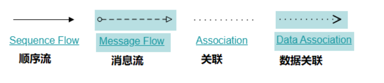

# 云尚办公系统：Activiti入门

## 一、了解工作流

### 1、什么是工作流

**工作流（Workflow）**，就是通过计算机对业务流程自动化执行管理。它主要解决的是“使在多个参与者之间按照某种**预定义的规则**自动进行传递文档、信息或任务的过程，从而实现某个预期的业务目标，或者促使此目标的实现”。**通俗来讲，就是业务上一个完整的审批流程。**例如员工的请假，出差，外出采购，合同审核等等，这些过程，都是一个工作流。

### 2、工作流引擎

对于工作流的处理，如果采用原始的方式，我们需要拿着各种文件到各个负责人那里去签字，需要在多个部门之间不断审批，这种方式费时费力。而我们可以借助软件系统来协助我们处理这些审批流程，这样就出现了工作流系统，使用工作流系统后可以极大的提高工作效率。

在学习工作流的过程中，我们肯定看到过这个模型:填写请假单->部门经理审批->总经理审批->人事备案。

（1）要实现上述的流程，我们自己可以通过字段标识来实现这个审批效果，在业务表中加个字段，比如填写请假单用1标识，部门经理用2标识，总经理用3标识，人事备案用4标识，好像看起来没啥问题，也实现了审批效果。可是一旦我们的流程出现了变化，这个时候我们就需要改动我们的代码了，这显然是不可取的，那么有没有专业的方式来实现工作流的管理呢？并且可以做到业务流程变化之后，我们的程序可以不用改变，如果可以实现这样的效果，那么我们的业务系统的适应能力就得到了极大提升。在这样的背景下，就出现了**工作流引擎**。

**为什么使用工作流引擎，能实现业务流程改变，不用修改代码，流程还能自动推进？**

（1）我们先来说说为什么流程改变，不用修改代码：我们的工作流引擎都实现了一个规范，这个规范要求我们的流程管理与状态字段无关，始终都是读取业务流程图的下一个节点。当业务更新的时候我们只需要更新业务流程图就行了。这就实现了业务流程改变，不用修改代码。

（2）再来说说流程自动推进，这个原理就更简单了，就拿上面的请假模型来说，工作流引擎会用一张表来记录当前处在的节点。当填写完请假单后肯定是要轮到部门经理来审批了，所以我们一旦完成了请假单填写那么这条记录将会被从这张表删除掉，并且会把下一个节点部门经理的信息插入到这张表中，当我们用部门经理的信息去这张表中查询的时候就能查出部门经理相关的审批的信息了，以此类推，这样层层递进，就实现了流程的自动递交了。

### 3、常见工作流引擎

主流的框架有：**Activiti**、jBPM、Camunda 、Flowable 、还有我们国产的盘古BPM、云程

### 4、Activiti7概述

#### 4.1、Activiti介绍

activiti是一个工作流引擎，可以将业务系统中复杂的业务流程抽取出来，使用专门的建模语言BPMN进行定义，业务流程按照预先定义的流程进行执行。实现了系统的流程由activiti进行管理，减少业务系统由于流程变更进行系统升级改造的工作流量，从而提高系统的健壮性，同时也减少了系统开发维护成本。

官方网站：https://www.activiti.org

#### 4.2、建模语言BPMN

BPM（Business Process Management）即业务流程管理，是一种规范化的构造端到端的业务流程，以持续提高组织业务效率

BPM 软件就是根据企业中业务环境的变化，推进人与人之间、人与系统之间以及系统与系统之间的整理及调整的经营方法与解决方案的 IT 工具。使用 BPM 软件对企业内部及外部的业务流程的整个生命周期进行建模、自动化、管理监控和优化，可以降低企业成本，提高利润

BPMN（Business Process Model AndNotation）即业务流程模型和符号，是一套标准的业务流程建模符号，使用 BPMN 提供的符号可以创建业务流程。Activit 就是使用 BPMN 进行流程建模、流程执行管理的

BPMN2.0 是业务流程建模符号 2.0 的缩写，它由 Business Process Management Initiative 这个非营利协会创建并不断发展。BPMN2.0 是使用一些符号来明确业务流程设计流程图的一套符号规范，能增进业务建模时的沟通效率。目前 BPMN2.0 是最新的版本，它用于在 BPM 上下文中进行布局和可视化的沟通

BPMN2.0 的基本符号主要包含：

- **事件 Event**

  开始：表示一个流程的开始

  中间：发生的开始和结束事件之间，影响处理的流程

  结束：表示该过程结束

  

- **活动 Activities**

  活动是工作或任务的一个通用术语。一个活动可以是一个任务，还可以是一个当前流程的子处理流程；其次，你还可以为活动指定不同的类型。常见活动如下：

  

- **网关 GateWay**

  用于表示流程的分支与合并，有几种常用网关需要了解：

  

  - 排他网关：只有一条路径会被选择

  - xxxxxxxxxx <el-button type="success" icon="el-icon-plus" size="mini" @click="add" :disabled="$hasBP('bnt.sysRole.add')  === false">添 加</el-button>vue
  
  - 包容网关：可以同时执行多条线路，也可以在网关上设置条件
  
  - 事件网关：专门为中间捕获事件设置的，允许设置多个输出流指向多个不同的中间捕获事件。当流程执行到事件网关后，流程处于等待状态，需要等待抛出事件才能将等待状态转换为活动状态
  
  
  
- **流向 Flow**

  流是连接两个流程节点的连线，常见的流向包含以下几种：

  顺序流：用一个带实心箭头的实心线表示，用于指定活动执行的顺序
  
  信息流：用一条带箭头的虚线表示，用于描述两个独立的业务参与者（业务实体/业务角色）之间发送和接受的消息流动
  
  关联：用一根带有线箭头的点线表示，用于将相关的数据、文本和其他人工信息与流对象联系起来。用于展示活动的输入和输出
  
  

**流程示例：**


#### 4.3、Activiti使用流程

**第一步：** 引入依赖并初始化数据库

既然activiti是一个框架，那么我们肯定是需要引入对应的jar包坐标的，具体参考代码中的。

**第二步：**  通过工具绘画流程图

使用 activiti 流程建模工具(activity-designer)定义业务流程(.bpmn 文件) 

.bpmn 文件就是业务流程定义文件，通过 xml 定义业务流程。

**第三步**：流程定义部署;

向 activiti 部署业务流程定义（.bpmn 文件），使用 activiti 提供的 api 向 activiti 中部署.bpmn 文件，

通俗来讲，就是让activiti认识要使用的流程

**第四步：** 启动一个流程实例（ProcessInstance）

启动一个流程实例表示开始一次业务流程的运行，比如员工请假流程部署完成，如果张三要请假就可以启动一个流程实例，如果李四要请假也启动一个流程实例，两个流程的执行互相不影响，就好比定义一个java类，实例化两个对象一样，部署的流程就好比java类，启动一个流程实例就好比new一个java对象

**第五步：** 用户查询待办任务(Task)

因为现在系统的业务流程已经交给 activiti 管理，通过 activiti 就可以查询当前流程执行到哪了，当前用户需要办理什么任务了，这些 activiti帮我们管理了。实际上我们学习activiti也只是学习它的API怎么使用，因为很多功能activiti都已经封装好了，我们会调用就行了

**第六步：** 用户办理任务

用户查询待办任务后，就可以办理某个任务，如果这个任务办理完成还需要其它用户办理，比如请假单创建后由部门经理审核，这个过程也是由 activiti 帮我们完成了，不需要我们在代码中硬编码指定下一个任务办理人了

**第七步：** 流程结束

当任务办理完成没有下一个任务节点了，这个流程实例就完成了。


## 二、Activiti7

### 1、Activiti使用

#### 1.1、数据库支持

Activiti 运行必须要有数据库的支持，支持的数据库有：mysql、oracle、postgres、mssql、db2、h2

#### 1.2、Activiti环境

我们直接在当前项目：guigu-oa-parent做Activiti入门讲解

##### 1.2.1、引入依赖

```xml
<!--引入activiti的springboot启动器 -->
<dependency>
    <groupId>org.activiti</groupId>
    <artifactId>activiti-spring-boot-starter</artifactId>
    <version>7.1.0.M6</version>
    <exclusions>
        <exclusion>
            <artifactId>mybatis</artifactId>
            <groupId>org.mybatis</groupId>
        </exclusion>
    </exclusions>
</dependency>
```

说明：Activiti7与SpringBoot整合后，默认集成了SpringSecurity安全框架，当前我们项目已经集成过了SpringSecurity，后续案例设置审批人时都必须是系统用户，Activiti框架会检查用户是否存在，否则会出现异常，后续大家可以在案例中测试。


##### 1.2.2、添加配置

数据源项目已经添加，只需要如下配置即可

```java
spring:    
	activiti:
      #    false:默认，数据库表不变，但是如果版本不对或者缺失表会抛出异常（生产使用）
      #    true:表不存在，自动创建（开发使用）
      #    create_drop: 启动时创建，关闭时删除表（测试使用）
      #    drop_create: 启动时删除表,在创建表 （不需要手动关闭引擎）
      database-schema-update: true
      #监测历史表是否存在，activities7默认不开启历史表
      db-history-used: true
      #none：不保存任何历史数据，流程中这是最高效的
      #activity：只保存流程实例和流程行为
      #audit：除了activity，还保存全部的流程任务以及其属性，audit为history默认值
      #full：除了audit、还保存其他全部流程相关的细节数据，包括一些流程参数
      history-level: full
      #校验流程文件，默认校验resources下的process 文件夹的流程文件
      check-process-definitions: true
```

##### 1.2.3、启动项目

启动项目，即可生成项目数据库表


##### 1.2.4、数据库表介绍

Activiti 的运行支持必须要有这 25 张表的支持，主要是在业务流程运行过程中，记录参与流程的用户主体，用户组信息，以及流程的定义，流程执行时的信息，和流程的历史信息等等

**1、 表的命名规则和作用**

观察创建的表，我们发现 Activiti 的表都以 act_ 开头，紧接着是表示表的用途的两个字母标识，也和 Activiti 所提供的服务的 API 对应：

- ACT_RE：RE 表示 repository，这个前缀的表包含了流程定义和流程静态资源 （图片、规则、等等）
- ACT_RU：RU 表示 runtime，这些表运行时，会包含流程实例、任务、变量、异步任务等流程业务进行中的数据。Activiti 只在流程实例执行过程中保存这些数据，在流程结束时就会删除这些记录。这样表就可以一直保持很小的体积，并且速度很快
- ACT_HI：HI 表示 history，这些表包含一些历史数据，比如历史流程实例、变量、任务等等
- ACT_GE：GE 表示 general，通用数据

**2、Activiti 数据表介绍**

| **表分类**   | **表名**              | **解释**                                           |
| ------------ | --------------------- | -------------------------------------------------- |
| 一般数据     |                       |                                                    |
|              | [ACT_GE_BYTEARRAY]    | 通用的流程定义和流程资源                           |
|              | [ACT_GE_PROPERTY]     | 系统相关属性                                       |
| 流程历史记录 |                       |                                                    |
|              | [ACT_HI_ACTINST]      | 历史的流程实例                                     |
|              | [ACT_HI_ATTACHMENT]   | 历史的流程附件                                     |
|              | [ACT_HI_COMMENT]      | 历史的说明性信息                                   |
|              | [ACT_HI_DETAIL]       | 历史的流程运行中的细节信息                         |
|              | [ACT_HI_IDENTITYLINK] | 历史的流程运行过程中用户关系                       |
|              | [ACT_HI_PROCINST]     | 历史的流程实例                                     |
|              | [ACT_HI_TASKINST]     | 历史的任务实例                                     |
|              | [ACT_HI_VARINST]      | 历史的流程运行中的变量信息                         |
| 流程定义表   |                       |                                                    |
|              | [ACT_RE_DEPLOYMENT]   | 部署单元信息                                       |
|              | [ACT_RE_MODEL]        | 模型信息                                           |
|              | [ACT_RE_PROCDEF]      | 已部署的流程定义                                   |
| 运行实例表   |                       |                                                    |
|              | [ACT_RU_EVENT_SUBSCR] | 运行时事件                                         |
|              | [ACT_RU_EXECUTION]    | 运行时流程执行实例                                 |
|              | [ACT_RU_IDENTITYLINK] | 运行时用户关系信息，存储任务节点与参与者的相关信息 |
|              | [ACT_RU_JOB]          | 运行时作业                                         |
|              | [ACT_RU_TASK]         | 运行时任务                                         |
|              | [ACT_RU_VARIABLE]     | 运行时变量表                                       |

#### 1.3、Activiti常用Service服务接口

简单介绍一下各个 Service 的实现类：

- RepositoryService

  Activiti 的资源管理类，该服务负责部署流程定义，管理流程资源。在使用 Activiti 时，一开始需要先完成流程部署，即将使用建模工具设计的业务流程图通过 RepositoryService 进行部署

- RuntimeService

  Activiti 的流程运行管理类，用于开始一个新的流程实例，获取关于流程执行的相关信息。流程定义用于确定一个流程中的结构和各个节点间行为，而流程实例则是对应的流程定义的一个执行，可以理解为 Java 中类和对象的关系

- TaskService

  Activiti 的任务管理类，用于处理业务运行中的各种任务，例如查询分给用户或组的任务、创建新的任务、分配任务、确定和完成一个任务

- HistoryService

  Activiti 的历史管理类，可以查询历史信息。执行流程时，引擎会保存很多数据，比如流程实例启动时间、任务的参与者、完成任务的时间、每个流程实例的执行路径等等。这个服务主要通过查询功能来获得这些数据

- ManagementService

  Activiti 的引擎管理类，提供了对 Activiti 流程引擎的管理和维护功能，这些功能不在工作流驱动的应用程序中使用，主要用于 Activiti 系统的日常维护

#### 1.4、流程设计工具

IDEA版本小于等于2019，可使用Activiti插件actiBPM，大于该版本的IDEA可使用Activiti BPMN visualizer插件绘制流程设计。

今天我们主角是：**Activiti Modeler**

Activiti Modeler 是 Activiti 官方提供的一款在线流程设计的前端插件，开发人员可以方便在线进行流程设计，保存流程模型，部署至流程定义等等，后续我们的项目也是集成Activiti Modeler绘制流程定义。

##### 1.4.1、下载activiti-explorer

官网下载：https://www.activiti.org/get-started


##### 1.4.2、解压获取部署包

解压activiti-5.22.0.zip，在activiti-5.22.0\wars目录下获取activiti-explorer.war

##### 1.4.3、部署activiti-explorer.war

将activiti-explorer.war放到tomcat部署目录，启动tomcat

##### 1.4.4、访问activiti-explorer

http://localhost:8080/activiti-explorer

默认登录账号：kermit

kermit


上面有很多功能，我们关注流程设计即可，如下图：

点击上图：流程 --> 新建模型 --> 输入模型名称（请假）--> 创建


### 2、Activiti流程操作

#### 2.1、流程定义

我们定义一个请假流程

##### 2.1.1、新建模型


##### 2.1.2、开始节点


##### 2.1.3、任务节点


##### 2.1.4、结束节点


##### 2.1.5、设置节点属性

指定标签名称：张三审批，节点任务负责人：zhangsan


指定标签名称：李四审批，节点任务负责人：lisi


##### 2.1.5、设置流程定义key


##### 2.1.6、保存流程定义模型


##### 2.1.7、下载流程定义文件


下载文件为：qingjia.bpmn20.xml

```xml
<?xml version="1.0" encoding="UTF-8"?>
<definitions xmlns="http://www.omg.org/spec/BPMN/20100524/MODEL" xmlns:xsi="http://www.w3.org/2001/XMLSchema-instance" xmlns:xsd="http://www.w3.org/2001/XMLSchema" xmlns:activiti="http://activiti.org/bpmn" xmlns:bpmndi="http://www.omg.org/spec/BPMN/20100524/DI" xmlns:omgdc="http://www.omg.org/spec/DD/20100524/DC" xmlns:omgdi="http://www.omg.org/spec/DD/20100524/DI" typeLanguage="http://www.w3.org/2001/XMLSchema" expressionLanguage="http://www.w3.org/1999/XPath" targetNamespace="http://www.activiti.org/processdef">
  <process id="qingjia" isExecutable="true">
    <startEvent id="sid-14A3E2A6-84E4-49E0-BF92-3DABD741430B"></startEvent>
    <userTask id="sid-38632C81-C407-4F0D-944D-FC30F90637A3" name="张三审批" activiti:assignee="zhangsan"></userTask>
    <sequenceFlow id="sid-081A176E-6756-4C4C-B36C-2649B12CFC5D" sourceRef="sid-14A3E2A6-84E4-49E0-BF92-3DABD741430B" targetRef="sid-38632C81-C407-4F0D-944D-FC30F90637A3"></sequenceFlow>
    <userTask id="sid-655780D5-8492-494F-9E30-2CFD6691E98D" name="李四审批" activiti:assignee="lisi"></userTask>
    <sequenceFlow id="sid-7DCE821D-4AE0-4F27-9811-80B575E7A758" sourceRef="sid-38632C81-C407-4F0D-944D-FC30F90637A3" targetRef="sid-655780D5-8492-494F-9E30-2CFD6691E98D"></sequenceFlow>
    <endEvent id="sid-7EE28419-BC61-49AC-8990-C63C4D2F7C0D"></endEvent>
    <sequenceFlow id="sid-2E583A5C-265A-4C05-B5E1-7F5DB98291F1" sourceRef="sid-655780D5-8492-494F-9E30-2CFD6691E98D" targetRef="sid-7EE28419-BC61-49AC-8990-C63C4D2F7C0D"></sequenceFlow>
  </process>
  <bpmndi:BPMNDiagram id="BPMNDiagram_qingjia">
    <bpmndi:BPMNPlane bpmnElement="qingjia" id="BPMNPlane_qingjia">
      <bpmndi:BPMNShape bpmnElement="sid-14A3E2A6-84E4-49E0-BF92-3DABD741430B" id="BPMNShape_sid-14A3E2A6-84E4-49E0-BF92-3DABD741430B">
        <omgdc:Bounds height="30.0" width="30.0" x="93.5" y="75.0"></omgdc:Bounds>
      </bpmndi:BPMNShape>
      <bpmndi:BPMNShape bpmnElement="sid-38632C81-C407-4F0D-944D-FC30F90637A3" id="BPMNShape_sid-38632C81-C407-4F0D-944D-FC30F90637A3">
        <omgdc:Bounds height="80.0" width="100.0" x="168.5" y="50.0"></omgdc:Bounds>
      </bpmndi:BPMNShape>
      <bpmndi:BPMNShape bpmnElement="sid-655780D5-8492-494F-9E30-2CFD6691E98D" id="BPMNShape_sid-655780D5-8492-494F-9E30-2CFD6691E98D">
        <omgdc:Bounds height="80.0" width="100.0" x="313.5" y="50.0"></omgdc:Bounds>
      </bpmndi:BPMNShape>
      <bpmndi:BPMNShape bpmnElement="sid-7EE28419-BC61-49AC-8990-C63C4D2F7C0D" id="BPMNShape_sid-7EE28419-BC61-49AC-8990-C63C4D2F7C0D">
        <omgdc:Bounds height="28.0" width="28.0" x="458.5" y="76.0"></omgdc:Bounds>
      </bpmndi:BPMNShape>
      <bpmndi:BPMNEdge bpmnElement="sid-7DCE821D-4AE0-4F27-9811-80B575E7A758" id="BPMNEdge_sid-7DCE821D-4AE0-4F27-9811-80B575E7A758">
        <omgdi:waypoint x="268.5" y="90.0"></omgdi:waypoint>
        <omgdi:waypoint x="313.5" y="90.0"></omgdi:waypoint>
      </bpmndi:BPMNEdge>
      <bpmndi:BPMNEdge bpmnElement="sid-081A176E-6756-4C4C-B36C-2649B12CFC5D" id="BPMNEdge_sid-081A176E-6756-4C4C-B36C-2649B12CFC5D">
        <omgdi:waypoint x="123.5" y="90.0"></omgdi:waypoint>
        <omgdi:waypoint x="168.5" y="90.0"></omgdi:waypoint>
      </bpmndi:BPMNEdge>
      <bpmndi:BPMNEdge bpmnElement="sid-2E583A5C-265A-4C05-B5E1-7F5DB98291F1" id="BPMNEdge_sid-2E583A5C-265A-4C05-B5E1-7F5DB98291F1">
        <omgdi:waypoint x="413.5" y="90.0"></omgdi:waypoint>
        <omgdi:waypoint x="458.5" y="90.0"></omgdi:waypoint>
      </bpmndi:BPMNEdge>
    </bpmndi:BPMNPlane>
  </bpmndi:BPMNDiagram>
</definitions>
```

##### 2.1.8、下载流程定义图片

单击右键上图图片，图片另存为：qingjia.png


##### 2.1.9、将资源文件放入项目

在service-oa模块resources下新建process资源文件夹

将qingjia.bpmn20.xml与qingjia.png放入process目录


#### 2.2、流程定义部署

将上面在设计器中定义的流程部署到activiti数据库中，就是流程定义部署。通过调用activiti的api将流程定义的bpmn和png两个文件一个一个添加部署到activiti中，也可以将两个文件打成zip包进行部署。

##### 2.2.1、单个文件部署方式

```java
package com.atguigu;

import org.activiti.engine.RepositoryService;
import org.activiti.engine.repository.Deployment;
import org.junit.Test;
import org.junit.runner.RunWith;
import org.springframework.beans.factory.annotation.Autowired;
import org.springframework.boot.test.context.SpringBootTest;
import org.springframework.test.context.junit4.SpringRunner;


@RunWith(SpringRunner.class)
@SpringBootTest
public class ProcessTest {

    @Autowired
    private RepositoryService repositoryService;

    @Test
    public void deployProcess() {
        // 流程部署
        Deployment deploy = repositoryService.createDeployment()
                .addClasspathResource("process/qingjia.bpmn20.xml")
                .addClasspathResource("process/qingjia.png")
                .name("请假申请流程")
                .deploy();
        System.out.println(deploy.getId());
        System.out.println(deploy.getName());
    }
}
```

##### 2.2.2、压缩包部署方式

```java
@Test
public void deployProcessByZip() {
    // 定义zip输入流
    InputStream inputStream = this
            .getClass()
            .getClassLoader()
            .getResourceAsStream(
                    "process/qingjia.zip");
    ZipInputStream zipInputStream = new ZipInputStream(inputStream);

    // 流程部署
    Deployment deployment = repositoryService.createDeployment()
            .addZipInputStream(zipInputStream)
            .name("请假申请流程")
            .deploy();
    System.out.println("流程部署id：" + deployment.getId());
    System.out.println("流程部署名称：" + deployment.getName());
}
```

##### 2.2.3、操作数据库表

流程定义部署后操作activiti的3张表如下：

act_re_deployment     流程定义部署表，每部署一次增加一条记录

act_re_procdef            流程定义表，部署每个新的流程定义都会在这张表中增加一条记录

act_ge_bytearray        流程资源表 


#### 2.3、启动流程实例

流程定义:将bpmn文件放到activiti的三张表中,好比是java中的一个类
流程实例:好比是java中的一个实例对象(一个流程定义可以对应多个流程实例)，张三可以启动一个请假流程实例，李四也可以启动一个请假流程实例，他们互不影响

```java
@Autowired
private RuntimeService runtimeService;

@Test
public void startUpProcess() {
    //创建流程实例,我们需要知道流程定义的key
    ProcessInstance processInstance = runtimeService.startProcessInstanceByKey("qingjia");
    //输出实例的相关信息
    System.out.println("流程定义id：" + processInstance.getProcessDefinitionId());
    System.out.println("流程实例id：" + processInstance.getId());
    System.out.println("当前活动Id：" + processInstance.getActivityId());
}
```

**操作数据表**

act_hi_actinst     流程实例执行历史

act_hi_identitylink  流程的参与用户历史信息

act_hi_procinst      流程实例历史信息

act_hi_taskinst       流程任务历史信息

act_ru_execution   流程执行信息

act_ru_identitylink  流程的参与用户信息

act_ru_task              任务信息


#### 2.4、查询任务

每个节点都配置了Assignee，流程启动后，任务的负责人就可以查询自己当前需要处理的任务，查询出来的任务都是该用户的待办任务。

```java
@Autowired
private TaskService taskService;

/**
 * 查询当前个人待执行的任务
 */
@Test
public void findPendingTaskList() {
    //任务负责人
    String assignee = "zhangsan";
    List<Task> list = taskService.createTaskQuery()
            .taskAssignee(assignee)//只查询该任务负责人的任务
            .list();
    for (Task task : list) {
        System.out.println("流程实例id：" + task.getProcessInstanceId());
        System.out.println("任务id：" + task.getId());
        System.out.println("任务负责人：" + task.getAssignee());
        System.out.println("任务名称：" + task.getName());
    }
}
```

说明：

​	流程实例id:一个流程只有一个,标识这个流程

​	任务id:流程每进行到某个节点,就会给这个节点分配一个任务id

输出结果如下：

​	流程实例id：d969f534-825e-11ed-95b4-7c57581a7819
​	任务id：d96c3f28-825e-11ed-95b4-7c57581a7819
​	任务负责人：zhangsan
​	任务名称：张三审批


#### 2.5、处理当前任务

任务负责人查询待办任务，选择任务进行处理，完成任务。

```java
/**
 * 完成任务
 */
@Test
public void completTask(){
    Task task = taskService.createTaskQuery()
            .taskAssignee("zhangsan")  //要查询的负责人
            .singleResult();//返回一条

    //完成任务,参数：任务id
    taskService.complete(task.getId());
}
```

完成任务后，任务自动到下一个节点


#### 2.6、查询已处理任务

```java
@Autowired
private HistoryService historyService;

/**
 * 查询已处理历史任务
 */
@Test
public void findProcessedTaskList() {
    //张三已处理过的历史任务
    List<HistoricTaskInstance> list = historyService.createHistoricTaskInstanceQuery().taskAssignee("zhangsan").finished().list();
    for (HistoricTaskInstance historicTaskInstance : list) {
        System.out.println("流程实例id：" + historicTaskInstance.getProcessInstanceId());
        System.out.println("任务id：" + historicTaskInstance.getId());
        System.out.println("任务负责人：" + historicTaskInstance.getAssignee());
        System.out.println("任务名称：" + historicTaskInstance.getName());
    }
}
```


#### 2.7、其他接口（了解）

```java
/**
 * 查询流程定义
 */
@Test
public void findProcessDefinitionList(){
    List<ProcessDefinition> definitionList = repositoryService.createProcessDefinitionQuery()
            .orderByProcessDefinitionVersion()
            .desc()
            .list();
    //输出流程定义信息
    for (ProcessDefinition processDefinition : definitionList) {
        System.out.println("流程定义 id="+processDefinition.getId());
        System.out.println("流程定义 name="+processDefinition.getName());
        System.out.println("流程定义 key="+processDefinition.getKey());
        System.out.println("流程定义 Version="+processDefinition.getVersion());
        System.out.println("流程部署ID ="+processDefinition.getDeploymentId());
    }
}

/**
 * 删除流程定义
 */
public void deleteDeployment() {
    //部署id
    String deploymentId = "82e3bc6b-81da-11ed-8e03-7c57581a7819";
    //删除流程定义，如果该流程定义已有流程实例启动则删除时出错
    repositoryService.deleteDeployment(deploymentId);
    //设置true 级联删除流程定义，即使该流程有流程实例启动也可以删除，设置为false非级别删除方式
    //repositoryService.deleteDeployment(deploymentId, true);
}
```


### 3、流程实例

#### 3.1、什么是流程实例

流程定义ProcessDefinition和流程实例ProcessInstance是Activiti重要的概念，类似于Java类和Java实例的关系

启动一个流程实例表示开始一次业务流程的运行，比如员工请假流程部署完成，如果张三要请假就可以启动一个流程实例，如果李四要请假也启动一个流程实例，两个流程的执行互相不影响，就好比定义一个 java 类，实例化两个对象一样，部署的流程就好比 java 类，启动一个流程实例就好比 new 一个 java 对象

#### 3.2、让实际业务与activiti表关联(BusinessKey)

比如我们填写一个请假单，一定会有一个请假单的唯一标识，我们通常使用这个标识来关联activiti，这个标识在activiti中称为businesskey

BusinessKey：业务标识，通常为业务的主键，业务标识和流程标识一一对应，业务标识来源于业务系统，存储业务标识就是根据业务标识来关联查询业务系统的数据

举例：请假流程启动一个流程实例，就可以将请假单的id作为业务标识存储到activiti中，将来查询activiti的流程实例信息就可以获取请假单的id从而关联查询业务系统数据库得到请假单信息

```java
/**
 * 启动流程实例，添加businessKey
 */
@Test
public void startUpProcessAddBusinessKey(){
    String businessKey = "1";
    // 启动流程实例，指定业务标识businessKey，也就是请假申请单id
    ProcessInstance processInstance = runtimeService.
            startProcessInstanceByKey("qingjia",businessKey);
    // 输出
    System.out.println("业务id:"+processInstance.getBusinessKey());
}
```

#### 3.3、挂起，激活流程实例

某些情况可能由于流程变更需要将当前运行的流程暂停而不是直接删除，流程暂停后将不会执行；

##### 3.3.1、全部流程实例挂起

操作流程定义为挂起状态，该流程定义下面的所有流程实例全部暂停:
流程定义为挂起状态，该流程定义将不允许启动新的流程实例，同时该流程定义下所有的流程实例将全部挂起暂停执行

```java
@Test
public void suspendProcessInstance() {
    ProcessDefinition qingjia = repositoryService.createProcessDefinitionQuery().processDefinitionKey("qingjia").singleResult();
    // 获取到当前流程定义是否为暂停状态 suspended方法为true是暂停的，suspended方法为false是运行的
    boolean suspended = qingjia.isSuspended();
    if (suspended) {
        // 暂定,那就可以激活
        // 参数1:流程定义的id  参数2:是否激活    参数3:时间点
        repositoryService.activateProcessDefinitionById(qingjia.getId(), true, null);
        System.out.println("流程定义:" + qingjia.getId() + "激活");
    } else {
        repositoryService.suspendProcessDefinitionById(qingjia.getId(), true, null);
        System.out.println("流程定义:" + qingjia.getId() + "挂起");
    }
}
```

##### 3.3.2、单个流程实例挂起

操作流程实例对象，针对单个流程执行挂起操作，某个流程实例挂起则此流程不在继续执行，完成该流程实例的当前任务将报异常；

```java
@Test
public void SingleSuspendProcessInstance() {
    String processInstanceId = "8bdff984-ab53-11ed-9b17-f8e43b734677";
    ProcessInstance processInstance = runtimeService.createProcessInstanceQuery().processInstanceId(processInstanceId).singleResult();
    //获取到当前流程定义是否为暂停状态   suspended方法为true代表为暂停   false就是运行的
    boolean suspended = processInstance.isSuspended();
    if (suspended) {
        runtimeService.activateProcessInstanceById(processInstanceId);
        System.out.println("流程实例:" + processInstanceId + "激活");
    } else {
        runtimeService.suspendProcessInstanceById(processInstanceId);
        System.out.println("流程实例:" + processInstanceId + "挂起");
    }
}
```


### 4、任务分配

任务分配有三种方式

1. 固定分配
2. UEL表达式分配
3. 监听器分配

#### 4.1、固定分配

在前面进行业务流程建模时指定固定的任务负责人，如：Assignee：zhangsan/lisi

#### 4.2、表达式分配

activiti使用UEL表达式，UEL是java EE6规范的一部分,UEL即统一表达式语言，activiti支持两个UEL表达式：UEL-value和UEL-method。 

##### 4.2.1、UEL-value

新建：一个加班流程

如图：


assignee1 这个变量是 activiti 的一个流程变量

我们启动流程实例，这个启动实例的方法跟之前的方法基本一致,唯一的不同是在启动时,添加了一个参数

```java
@Test
public void deployProcess01() {
    // 流程部署
    Deployment deploy = repositoryService.createDeployment()
        .addClasspathResource("process/jiaban01.bpmn20.xml")
        .name("加班申请流程")
        .deploy();
    System.out.println(deploy.getId());
    System.out.println(deploy.getName());
}

/**
 * 启动流程实例
 */
@Test
public void startUpProcess01() {
    Map<String, Object> variables = new HashMap<>();
    variables.put("assignee1","zhangsan");
    variables.put("assignee2","lisi");
    //创建流程实例,我们需要知道流程定义的key
    ProcessInstance processInstance = runtimeService.startProcessInstanceByKey("qingjia01", variables);
    //输出实例的相关信息
    System.out.println("流程定义id：" + processInstance.getProcessDefinitionId());
    System.out.println("流程实例id：" + processInstance.getId());
}
```

##### 4.2.2、UEL-method 方式

如图：


userBean 是 spring 容器中的一个 bean，表示调用该 bean 的 getUsername(int id)方法。

经理审批：${userBean.getUsername(1)}

人事审批：${userBean.getUsername(2)} 

```java
package com.atguigu.process.bean;

import org.springframework.stereotype.Component;

@Component
public class UserBean {

    public String getUsername(int id) {
        if(id == 1) {
            return "zhangsan";
        }
        if(id == 2) {
            return "lisi";
        }
        return "admin";
    }
}
```

部署与启动

```java
@Test
public void deployProcess02() {
    // 流程部署
    Deployment deploy = repositoryService.createDeployment()
        .addClasspathResource("process/jiaban02.bpmn20.xml")
        .name("加班申请流程")
        .deploy();
    System.out.println(deploy.getId());
    System.out.println(deploy.getName());
}

/**
 * 启动流程实例
 */
@Test
public void startUpProcess02() {
    //创建流程实例,我们需要知道流程定义的key
    ProcessInstance processInstance = runtimeService.startProcessInstanceByKey("qingjia02");
    //输出实例的相关信息
    System.out.println("流程定义id：" + processInstance.getProcessDefinitionId());
    System.out.println("流程实例id：" + processInstance.getId());
}
```

启动流程实例，就会调用bean方法，参数为：1，经理审批后，接着调用bean方法，参数为：2

#### 4.3、监听器分配

使用监听器的方式来指定负责人，那么在流程设计时就不需要指定assignee。

任务监听器是发生对应的任务相关事件时执行自定义 java 逻辑 或表达式

Event的选项包含：

```
Create：任务创建后触发
Assignment：任务分配后触发
Delete：任务完成后触发
All：所有事件发生都触发
```

定义任务监听类，且类必须实现 org.activiti.engine.delegate.TaskListener 接口 

```java
package com.atguigu.process.bean;

import org.activiti.engine.delegate.DelegateTask;
import org.activiti.engine.delegate.TaskListener;

public class MyTaskListener implements TaskListener {

    @Override
    public void notify(DelegateTask delegateTask) {
        if(delegateTask.getName().equals("经理审批")){
            //这里指定任务负责人
            delegateTask.setAssignee("zhangsan");
        } else if(delegateTask.getName().equals("人事审批")){
            //这里指定任务负责人
            delegateTask.setAssignee("lisi");
        }
    }
}
```

配置监听器


经理审批与人事审批，都设置一样的监听即可

部署与测试

```java
@Test
public void deployProcess03() {
    // 流程部署
    Deployment deploy = repositoryService.createDeployment()
            .addClasspathResource("process/jiaban03.bpmn20.xml")
            .name("加班申请流程")
            .deploy();
    System.out.println(deploy.getId());
    System.out.println(deploy.getName());
}

/**
 * 启动流程实例
 */
@Test
public void startUpProcess03() {
    //创建流程实例,我们需要知道流程定义的key
    ProcessInstance processInstance = runtimeService.startProcessInstanceByKey("jiaban03");
    //输出实例的相关信息
    System.out.println("流程定义id：" + processInstance.getProcessDefinitionId());
    System.out.println("流程实例id：" + processInstance.getId());
}
```

启动流程实例，就会调用MyTaskListener监听方法


### 5、流程变量

#### 5.1、什么是流程变量

流程变量在 activiti 中是一个非常重要的角色，流程运转有时需要靠流程变量，业务系统和 activiti
结合时少不了流程变量，流程变量就是 activiti 在管理工作流时根据管理需要而设置的变量。
比如：在请假申请流程流转时如果请假天数大于2 天则由总经理审核，否则由部门经理直接审核， 请假天
数就可以设置为流程变量，在流程流转时使用。 

#### 5.2、流程变量的作用域

流程变量的作用可以是一个流程实例，但也可以是一个任务(task)或是一个执行实例

##### 5.2.1、globa变量

流程变量的默认作用域是流程实例。当一个流程变量的作用域为流程实例时，可以称为 global 变量

global 变量中变量名不允许重复，设置相同名称的变量，后设置的值会覆盖前设置的变量值。

##### 5.2.2、local变量

任务和执行实例仅仅是针对一个任务和一个执行实例范围，范围没有流程实例大， 称为 local 变量。

Local 变量由于在不同的任务或不同的执行实例中，作用域互不影响，变量名可以相同没有影响。Local 变量名也可以和 global 变量名相同，没有影响。 

#### 5.3、流程变量的使用方法

通过UEL表达式使用流程变量

1、之前我们也使用过UEL表达式来设置任务处理人，例如${assignee1}，activiti获取UEL表达式的值，即流程变量assignee1的值，将值作为任务的负责人进行任务分配
2、我们也可以在任务和任务间的连线上使用UEL表达式，决定流程走向 比如${ day > 2 }和${day <= 2}，day就是一个流程变量名称，UEL表达式的执行结果是布尔类型

#### 5.4、设置globa变量

##### 5.4.1、启动流程时设置变量

在启动流程时设置流程变量，**变量的作用域是整个流程实例。**
通过 Map<key,value> 设置流程变量，map 中可以设置多个变量，这个 key 就是流程变量的名字

这是前面的实例代码

```java
@Test
public void startUpProcess() {
    Map<String, Object> variables = new HashMap<>();
    variables.put("assignee1", "zhangsan");
    variables.put("assignee2", "lisi");
    //创建流程实例,我们需要知道流程定义的key
    ProcessInstance processInstance = runtimeService.startProcessInstanceByKey("qingjia", variables);
    //输出实例的相关信息
    System.out.println("流程定义id：" + processInstance.getProcessDefinitionId());
    System.out.println("流程实例id：" + processInstance.getId());
}
```

##### 5.4.2、在任务办理时设置流程变量

**它的作用域是整个流程实例** ，如果设置的流程变量的   key   在流程实例中已存在相同的名字则后设置的变量替换前边设置的变量。

模拟实例代码：

```java
@Test
public void completTask() {
    Task task = taskService.createTaskQuery()
            .taskAssignee("zhangsan")  //要查询的负责人
            .singleResult();//返回一条

    Map<String, Object> variables = new HashMap<>();
    variables.put("assignee2", "zhao");
    //完成任务,参数：任务id
    taskService.complete(task.getId(), variables);
}
```

##### 5.4.3、通过当前流程实例设置

通过流程实例 id   设置全局变量， **它的作用域是整个流程实例** ，该流程实例必须未执行完成。

模拟实例代码：

```java
@Test
public void processInstanceIdSetVariables() {
    Map<String, Object> variables = new HashMap<>();
    variables.put("assignee2", "wang");
    runtimeService.setVariables("1c347a90-82c6-11ed-96ca-7c57581a7819", variables);
}
```

#### 5.5、设置Local变量

local 流程变量的作用域只在当前任务节点下可用

任务办理时设置local流程变量，当前运行的流程实例只能在该任务结束前使用，任务结束该变量无法在当前流程实例使用

模拟实例代码：

```java
@Test
public void completLocalTask() {
    Task task = taskService.createTaskQuery()
            .taskAssignee("zhangsan")  //要查询的负责人
            .singleResult();//返回一条

    // 设置local变量，作用域为该任务
    taskService.setVariableLocal(task.getId(),"assignee2","li");
    // 查看local变量
    System.out.println(taskService.getVariableLocal(task.getId(), "assignee2"));
    //完成任务,参数：任务id
    taskService.complete(task.getId());
}
```


### 6、任务组

#### 6.1、Candidate-users候选人

**1、需求**
在流程定义中在任务结点的assignee固定设置任务负责人，在流程定义时将参与者固定设置在.bpmn文件中，如果要临时变更任务负责人则需要修改流程定义，系统扩展性很差，针对这种情况，我们可以给任务设置多个候选人，从候选人中选择参与者来完成任务

**2、设置任务候选人**


#### 6.2、组任务办理流程

**第一步:查询组任务**

指定候选人，查询该候选人当前的待办任务
候选人不能办理任务
**第二步:拾取(claim)任务**

该组任务的所有候选人都能拾取
将候选人的组任务，变成个人任务，原来的候选人就变成了该任务的负责人
如果拾取后不想办理该任务
需要将已经拾取
**第三步:查询个人任务**

查询方式同个人任务部分，根据assignee查询用户负责的个人任务
**第四步:办理个人任务**

#### 6.3、关键代码

##### 6.3.1、部署及启动

```java
@Test
public void deployProcess04() {
    // 流程部署
    Deployment deploy = repositoryService.createDeployment()
            .addClasspathResource("process/jiaban04.bpmn20.xml")
            .name("请假申请流程")
            .deploy();
    System.out.println(deploy.getId());
    System.out.println(deploy.getName());

    ProcessInstance processInstance = runtimeService.startProcessInstanceByKey("jiaban04");
    System.out.println(processInstance.getId());
}
```

##### 6.3.2、查询组任务

```java
@Test
public void findGroupTaskList() {
    //查询组任务
    List<Task> list = taskService.createTaskQuery()
            .taskCandidateUser("zhangsan01")//根据候选人查询
            .list();
    for (Task task : list) {
        System.out.println("----------------------------");
        System.out.println("流程实例id：" + task.getProcessInstanceId());
        System.out.println("任务id：" + task.getId());
        System.out.println("任务负责人：" + task.getAssignee());
        System.out.println("任务名称：" + task.getName());
    }
}
```

##### 6.3.2、拾取组任务

```java
@Test
public void claimTask(){
    //拾取任务,即使该用户不是候选人也能拾取(建议拾取时校验是否有资格)
    //校验该用户有没有拾取任务的资格
    Task task = taskService.createTaskQuery()
            .taskCandidateUser("zhangsan01")//根据候选人查询
            .singleResult();
    if(task!=null){
        //拾取任务
        taskService.claim(taskId, "zhangsan01");
        System.out.println("任务拾取成功");
    }
}
```

张三01拾取任务了，张三02就不能拾取了

##### 6.3.3、  查询个人待办任务

查询方式同个人任务查询

```java
@Test
public void findGroupPendingTaskList() {
    //任务负责人
    String assignee = "zhangsan01";
    List<Task> list = taskService.createTaskQuery()
            .taskAssignee(assignee)//只查询该任务负责人的任务
            .list();
    for (Task task : list) {
        System.out.println("流程实例id：" + task.getProcessInstanceId());
        System.out.println("任务id：" + task.getId());
        System.out.println("任务负责人：" + task.getAssignee());
        System.out.println("任务名称：" + task.getName());
    }
}
```

##### 6.3.4、  办理个人任务

同个人任务办理

```java
@Test
public void completGroupTask() {
    Task task = taskService.createTaskQuery()
            .taskAssignee("zhangsan01")  //要查询的负责人
            .singleResult();//返回一条
    taskService.complete(task.getId());
}
```

##### 6.3.5、归还组任务

如果个人不想办理该组任务，可以归还组任务，归还后该用户不再是该任务的负责人

```java
@Test
public void assigneeToGroupTask() {
    String taskId = "d96c3f28-825e-11ed-95b4-7c57581a7819";
    // 任务负责人
    String userId = "zhangsan01";
    // 校验userId是否是taskId的负责人，如果是负责人才可以归还组任务
    Task task = taskService
            .createTaskQuery()
            .taskId(taskId)
            .taskAssignee(userId)
            .singleResult();
    if (task != null) {
        // 如果设置为null，归还组任务,该 任务没有负责人
        taskService.setAssignee(taskId, null);
    }
}
```

##### 6.3.6、  任务交接

任务交接，任务负责人将任务交给其它候选人办理该任务

```java
@Test
public void assigneeToCandidateUser() {
    // 当前待办任务
    String taskId = "d96c3f28-825e-11ed-95b4-7c57581a7819";
    // 校验zhangsan01是否是taskId的负责人，如果是负责人才可以归还组任务
    Task task = taskService
            .createTaskQuery()
            .taskId(taskId)
            .taskAssignee("zhangsan01")
            .singleResult();
    if (task != null) {
        // 将此任务交给其它候选人zhangsan02办理该 任务
        taskService.setAssignee(taskId, "zhangsan02");
    }
}
```


### 7、网关

网关用来控制流程的流向，通常会和流程变量一起使用。

#### 7.1、排他网关

- 排他网关：只有一条路径会被选择

当你的流程出现这样的场景：请假申请，两天以内，部门经理审批流程就结束了，两天以上需要总经理直接审批，这个时候就需要排他网关


#### 7.2、并行网关

- 并（平）行网关：所有路径会被同时选择

当出现这样的场景：请假申请开始，需要部门经理和总经理都审批，两者没有前后需要两个人全部审批才能进入下个节点人事审批。这个时候就需要并行网关


**与排他网关的主要区别是，并行网关不会解析条件。** **即使顺序流中定义了条件，也会被忽略。**

#### 7.3、包含网关

包容网关：可以同时执行多条线路，也可以在网关上设置条件，可以看做是排他网关和并行网关的结合体。 
当出现这样的场景：请假申请大于等于2天需要由部门总经理审批，小于2天由部门经理审批，请假申请必须经过人事经理审批。这个时候就需要包含网关

