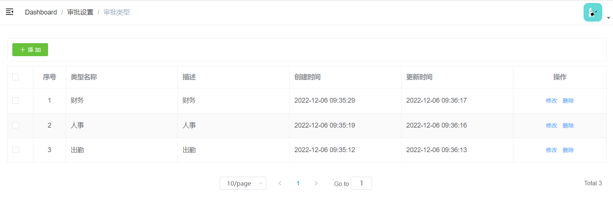
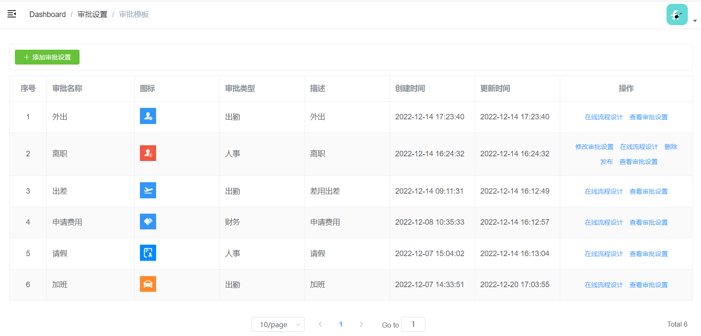
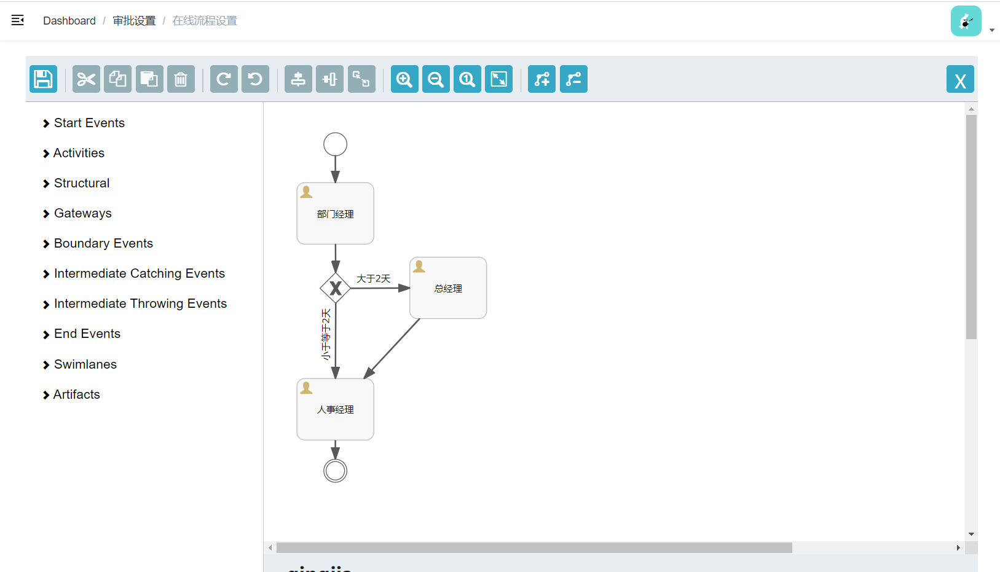
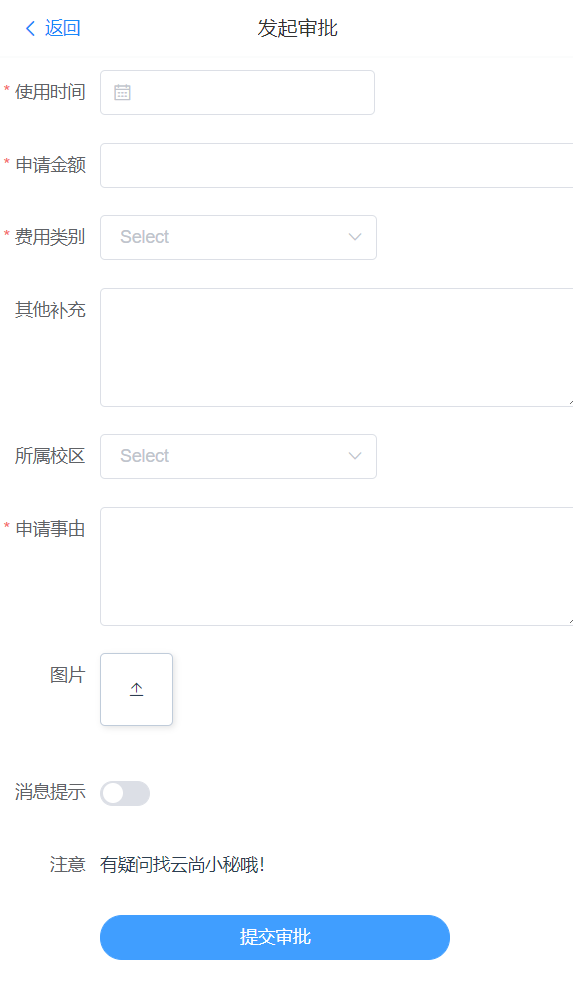
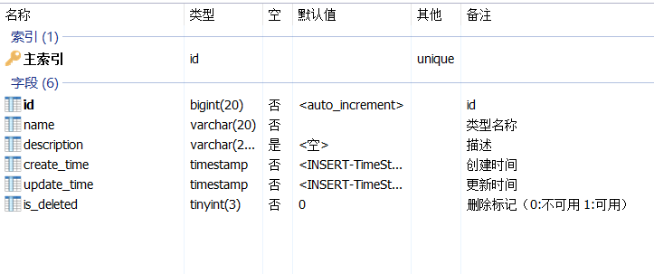
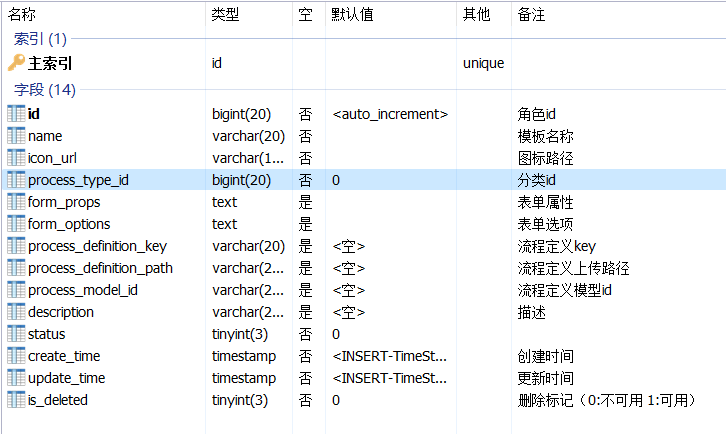
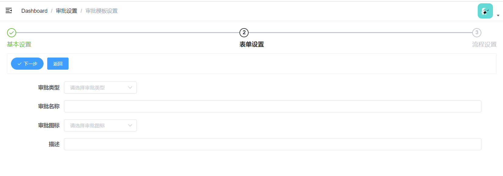
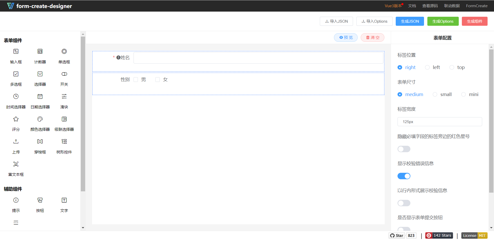
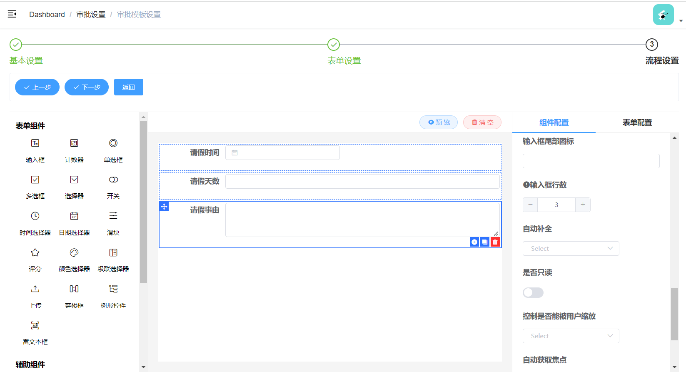

# 云尚办公系统：管理端-审批设置

## 一、审批设置需求

### 1、需求描述

公司日常办公，审批是必不可少的一个功能，例如常用的钉钉OA审批，今天我们就要做类似的审批功能。

**审批设置模块包含：审批类型与审批模板**

**审批类型：**审批类型即为审批的分类，如：出勤、人事、财务等

**审批模板：**设置具体审批的基本信息、表单信息与审批流程定义，审批流涉及工作流引擎Activiti，常见的审批模板如：加班、出差、请假、费用报销等，我们可以根据公司具体业务配置具体的审批模板

### 2、页面效果

#### 2.1、管理端

1、审批类型



2、审批模板



3、在线流程设计



#### 2.2、员工端

1、审批中心


2、发起审批，显示动态表单



### 3、数据库表设计

1、审批类型表：oa_process_type



2、审批模板表：oa_process_template



重要字段说明：

​	form_props：动态表单的表单属性，后续入门form-create组件会详细讲解

​	form_options：动态表单的表单选项，后续入门form-create组件会详细讲解，这两项就是配置动态表单的

​	process_definition_key：流程定义key，前面Activiti入门已讲解，我们启动流程实例会使用它

​	process_definition_path：保存流程定义文件的路径

​	process_model_id：流程定义模型id，流程定义实现两种方式，一种：上传，第二种：在线制作，分别使用这两个字段保存记录


## 二、审批类型

### 1、审批类型CRUD

#### 1.1、mapper

```java
package com.atguigu.process.mapper;

import com.atguigu.model.process.ProcessType;
import com.baomidou.mybatisplus.core.mapper.BaseMapper;
import org.apache.ibatis.annotations.Mapper;

@Mapper
public interface ProcessTypeMapper extends BaseMapper<ProcessType> {

}
```

#### 1.2、service接口

```java
package com.atguigu.process.service;

import com.atguigu.model.process.ProcessType;
import com.baomidou.mybatisplus.core.metadata.IPage;
import com.baomidou.mybatisplus.extension.plugins.pagination.Page;
import com.baomidou.mybatisplus.extension.service.IService;

public interface ProcessTypeService extends IService<ProcessType> {

}
```

#### 1.3、service接口实现

```java
package com.atguigu.process.service.impl;

import com.atguigu.model.process.ProcessType;
import com.atguigu.process.mapper.ProcessTypeMapper;
import com.atguigu.process.service.ProcessTypeService;
import com.baomidou.mybatisplus.core.conditions.query.LambdaQueryWrapper;
import com.baomidou.mybatisplus.core.metadata.IPage;
import com.baomidou.mybatisplus.extension.plugins.pagination.Page;
import com.baomidou.mybatisplus.extension.service.impl.ServiceImpl;
import org.springframework.beans.factory.annotation.Autowired;
import org.springframework.stereotype.Service;

@Service
@SuppressWarnings({"unchecked", "rawtypes"})
public class ProcessTypeServiceImpl extends ServiceImpl<ProcessTypeMapper, ProcessType> implements ProcessTypeService {

}
```

#### 1.4、controller接口

```java
package com.atguigu.process.controller;

import com.atguigu.common.result.Result;
import com.atguigu.model.process.ProcessType;
import com.atguigu.process.service.ProcessTypeService;
import com.baomidou.mybatisplus.core.metadata.IPage;
import com.baomidou.mybatisplus.extension.plugins.pagination.Page;
import io.swagger.annotations.Api;
import io.swagger.annotations.ApiOperation;
import io.swagger.annotations.ApiParam;
import org.springframework.beans.factory.annotation.Autowired;
import org.springframework.security.access.prepost.PreAuthorize;
import org.springframework.web.bind.annotation.*;

@Api(value = "审批类型", tags = "审批类型")
@RestController
@RequestMapping(value = "/admin/process/processType")
@SuppressWarnings({"unchecked", "rawtypes"})
public class ProcessTypeController {

    @Autowired
    private ProcessTypeService processTypeService;

    @PreAuthorize("hasAuthority('bnt.processType.list')")
    @ApiOperation(value = "获取分页列表")
    @GetMapping("{page}/{limit}")
    public Result index(@PathVariable Long page,
                        @PathVariable Long limit) {
        Page<ProcessType> pageParam = new Page<>(page,limit);
        IPage<ProcessType> pageModel = processTypeService.page(pageParam);
        return Result.ok(pageModel);
    }

    @PreAuthorize("hasAuthority('bnt.processType.list')")
    @ApiOperation(value = "获取")
    @GetMapping("get/{id}")
    public Result get(@PathVariable Long id) {
        ProcessType processType = processTypeService.getById(id);
        return Result.ok(processType);
    }

    @PreAuthorize("hasAuthority('bnt.processType.add')")
    @ApiOperation(value = "新增")
    @PostMapping("save")
    public Result save(@RequestBody ProcessType processType) {
        processTypeService.save(processType);
        return Result.ok();
    }

    @PreAuthorize("hasAuthority('bnt.processType.update')")
    @ApiOperation(value = "修改")
    @PutMapping("update")
    public Result updateById(@RequestBody ProcessType processType) {
        processTypeService.updateById(processType);
        return Result.ok();
    }

    @PreAuthorize("hasAuthority('bnt.processType.remove')")
    @ApiOperation(value = "删除")
    @DeleteMapping("remove/{id}")
    public Result remove(@PathVariable Long id) {
        processTypeService.removeById(id);
        return Result.ok();
    }
}
```

### 2、前端页面

#### 2.1、动态添加路由

在“系统管理”->“菜单管理”添加“审批设置”->“审批类型”

对于菜单信息，我们也可以直接导入菜单表初始化数据，后续不用再单独配置

#### 2.2、定义api

创建src/api/process/processType.js

```javascript
import request from '@/utils/request'

const api_name = '/admin/process/processType'

export default {

  getPageList(page, limit) {
    return request({
      url: `${api_name}/${page}/${limit}`,
      method: 'get'
    })
  },
  getById(id) {
    return request({
      url: `${api_name}/get/${id}`,
      method: 'get'
    })
  },
  save(role) {
    return request({
      url: `${api_name}/save`,
      method: 'post',
      data: role
    })
  },
  updateById(role) {
    return request({
      url: `${api_name}/update`,
      method: 'put',
      data: role
    })
  },
  removeById(id) {
    return request({
      url: `${api_name}/remove/${id}`,
      method: 'delete'
    })
  }
}
```

#### 2.3、创建vue页面

创建views/processSet/processType/list.vue

```vue
<template>
  <div class="app-container">
    <!-- 工具条 -->
    <div class="tools-div">
      <el-button type="success" icon="el-icon-plus" size="mini" @click="add" :disabled="$hasBP('bnt.processType.add')  === false">添 加</el-button>
    </div>
    <!-- banner列表 -->
    <el-table
      v-loading="listLoading"
      :data="list"
      stripe
      border
      style="width: 100%;margin-top: 10px;"
    >
      <el-table-column
        type="selection"
        width="55"
      />
      <el-table-column
        label="序号"
        width="70"
        align="center"
      >
        <template slot-scope="scope">
          {{ (page - 1) * limit + scope.$index + 1 }}
        </template>
      </el-table-column>
      <el-table-column prop="name" label="类型名称"/>
      <el-table-column prop="description" label="描述"/>
      <el-table-column prop="createTime" label="创建时间"/>
      <el-table-column prop="updateTime" label="更新时间"/>
      <el-table-column label="操作" width="200" align="center">
        <template slot-scope="scope">
          <el-button type="text" size="mini" @click="edit(scope.row.id)" :disabled="$hasBP('bnt.processType.update')  === false">修改</el-button>
          <el-button type="text" size="mini" @click="removeDataById(scope.row.id)" :disabled="$hasBP('bnt.processType.remove')  === false">删除</el-button>
        </template>
      </el-table-column>
    </el-table>
    <!-- 分页组件 -->
    <el-pagination
      :current-page="page"
      :total="total"
      :page-size="limit"
      :page-sizes="[5, 10, 20, 30, 40, 50, 100]"
      style="padding: 30px 0; text-align: center;"
      layout="sizes, prev, pager, next, jumper, ->, total, slot"
      @current-change="fetchData"
      @size-change="changeSize"
    />
    <el-dialog title="添加/修改" :visible.sync="dialogVisible" width="40%">
      <el-form ref="flashPromotionForm" label-width="150px" size="small" style="padding-right: 40px;">
        <el-form-item label="类型名称">
          <el-input v-model="processType.name"/>
        </el-form-item>
        <el-form-item label="描述">
          <el-input v-model="processType.description"/>
        </el-form-item>
      </el-form>
      <span slot="footer" class="dialog-footer">
        <el-button @click="dialogVisible = false" size="small">取 消</el-button>
        <el-button type="primary" @click="saveOrUpdate()" size="small">确 定</el-button>
      </span>
    </el-dialog>
  </div>
</template>
<script>
import api from '@/api/process/processType'

const defaultForm = {
  id: '',
  name: '',
  description: ''
}
export default {
  data() {
    return {
      listLoading: true, // 数据是否正在加载
      list: null, // banner列表
      total: 0, // 数据库中的总记录数
      page: 1, // 默认页码
      limit: 10, // 每页记录数
      searchObj: {}, // 查询表单对象
      dialogVisible: false,
      processType: defaultForm,
      saveBtnDisabled: false
    }
  },
  // 生命周期函数：内存准备完毕，页面尚未渲染
  created() {
    this.fetchData()
  },
  // 生命周期函数：内存准备完毕，页面渲染成功
  mounted() {
  },
  methods: {
    // 当页码发生改变的时候
    changeSize(size) {
      console.log(size)
      this.limit = size
      this.fetchData(1)
    },
    // 加载列表数据
    fetchData(page = 1) {
      this.page = page
      api.getPageList(this.page, this.limit, this.searchObj).then(response => {
        this.list = response.data.records
        this.total = response.data.total
        // 数据加载并绑定成功
        this.listLoading = false
      })
    },
    // 重置查询表单
    resetData() {
      console.log('重置查询表单')
      this.searchObj = {}
      this.fetchData()
    },
    // 根据id删除数据
    removeDataById(id) {
      this.$confirm('此操作将永久删除该记录, 是否继续?', '提示', {
        confirmButtonText: '确定',
        cancelButtonText: '取消',
        type: 'warning'
      }).then(() => { // promise
        // 点击确定，远程调用ajax
        return api.removeById(id)
      }).then((response) => {
        this.fetchData(this.page)
        this.$message.success(response.message)
      }).catch(() => {
        this.$message.info('取消删除')
      })
    },
    add() {
      this.dialogVisible = true
      this.processType = Object.assign({}, defaultForm)
    },
    edit(id) {
      this.dialogVisible = true
      this.fetchDataById(id)
    },
    fetchDataById(id) {
      api.getById(id).then(response => {
        this.processType = response.data
      })
    },
    saveOrUpdate() {
      this.saveBtnDisabled = true // 防止表单重复提交
      if (!this.processType.id) {
        this.saveData()
      } else {
        this.updateData()
      }
    },
    // 新增
    saveData() {
      api.save(this.processType).then(response => {
        this.$message.success(response.message || '操作成功')
        this.dialogVisible = false
        this.fetchData(this.page)
      })
    },
    // 根据id更新记录
    updateData() {
      api.updateById(this.processType).then(response => {
        this.$message.success(response.message || '操作成功')
        this.dialogVisible = false
        this.fetchData(this.page)
      })
    }
  }
}
</script>
```


## 三、审批模板

### 1、审批模板CRUD

#### 1.1、mapper

```java
package com.atguigu.process.mapper;

import com.atguigu.model.process.ProcessTemplate;
import com.baomidou.mybatisplus.core.mapper.BaseMapper;
import org.apache.ibatis.annotations.Mapper;

@Mapper
public interface ProcessTemplateMapper extends BaseMapper<ProcessTemplate> {

}
```

#### 1.2、service接口

```java
package com.atguigu.process.service;

import com.atguigu.model.process.ProcessTemplate;
import com.baomidou.mybatisplus.core.metadata.IPage;
import com.baomidou.mybatisplus.extension.plugins.pagination.Page;
import com.baomidou.mybatisplus.extension.service.IService;

public interface ProcessTemplateService extends IService<ProcessTemplate> {

    IPage<ProcessTemplate> selectPage(Page<ProcessTemplate> pageParam);

}
```

#### 1.3、service接口实现

```java
package com.atguigu.process.service.impl;

import com.atguigu.model.process.ProcessTemplate;
import com.atguigu.model.process.ProcessType;
import com.atguigu.process.mapper.ProcessTemplateMapper;
import com.atguigu.process.service.ProcessTemplateService;
import com.atguigu.process.service.ProcessTypeService;
import com.baomidou.mybatisplus.core.conditions.query.LambdaQueryWrapper;
import com.baomidou.mybatisplus.core.metadata.IPage;
import com.baomidou.mybatisplus.extension.plugins.pagination.Page;
import com.baomidou.mybatisplus.extension.service.impl.ServiceImpl;
import org.springframework.stereotype.Service;
import org.springframework.util.CollectionUtils;
import javax.annotation.Resource;
import java.util.List;
import java.util.Map;
import java.util.stream.Collectors;

@Service
@SuppressWarnings({"unchecked", "rawtypes"})
public class ProcessTemplateServiceImpl extends ServiceImpl<ProcessTemplateMapper, ProcessTemplate> implements ProcessTemplateService {

   @Resource
   private ProcessTemplateMapper processTemplateMapper;

   @Resource
   private ProcessTypeService processTypeService;

   @Override
   public IPage<ProcessTemplate> selectPage(Page<ProcessTemplate> pageParam) {
      LambdaQueryWrapper<ProcessTemplate> queryWrapper = new LambdaQueryWrapper<ProcessTemplate>();
      queryWrapper.orderByDesc(ProcessTemplate::getId);
      IPage<ProcessTemplate> page = processTemplateMapper.selectPage(pageParam, queryWrapper);
      List<ProcessTemplate> processTemplateList = page.getRecords();
       
      List<Long> processTypeIdList = processTemplateList.stream().map(processTemplate -> processTemplate.getProcessTypeId()).collect(Collectors.toList());
       
      if(!CollectionUtils.isEmpty(processTypeIdList)) {
         Map<Long, ProcessType> processTypeIdToProcessTypeMap = processTypeService.list(new LambdaQueryWrapper<ProcessType>().in(ProcessType::getId, processTypeIdList)).stream().collect(Collectors.toMap(ProcessType::getId, ProcessType -> ProcessType));
         for(ProcessTemplate processTemplate : processTemplateList) {
            ProcessType processType = processTypeIdToProcessTypeMap.get(processTemplate.getProcessTypeId());
            if(null == processType) continue;
            processTemplate.setProcessTypeName(processType.getName());
         }
      }
      return page;
   }
}
```

#### 1.4、controller接口

```java
package com.atguigu.process.controller;

import com.atguigu.common.result.Result;
import com.atguigu.model.process.ProcessTemplate;
import com.atguigu.process.service.ProcessTemplateService;
import com.baomidou.mybatisplus.core.metadata.IPage;
import com.baomidou.mybatisplus.extension.plugins.pagination.Page;
import io.swagger.annotations.Api;
import io.swagger.annotations.ApiOperation;
import io.swagger.annotations.ApiParam;
import org.springframework.beans.factory.annotation.Autowired;
import org.springframework.security.access.prepost.PreAuthorize;
import org.springframework.web.bind.annotation.*;

@Api(value = "审批模板管理", tags = "审批模板管理")
@RestController
@RequestMapping(value = "/admin/process/processTemplate")
@SuppressWarnings({"unchecked", "rawtypes"})
public class ProcessTemplateController {

    @Autowired
    private ProcessTemplateService processTemplateService;

    //@PreAuthorize("hasAuthority('bnt.processTemplate.list')")
    @ApiOperation(value = "获取分页列表")
    @GetMapping("{page}/{limit}")
    public Result index(
            @ApiParam(name = "page", value = "当前页码", required = true)
            @PathVariable Long page,

            @ApiParam(name = "limit", value = "每页记录数", required = true)
            @PathVariable Long limit) {
        Page<ProcessTemplate> pageParam = new Page<>(page, limit);
        IPage<ProcessTemplate> pageModel = processTemplateService.selectPage(pageParam);
        return Result.ok(pageModel);
    }

    //@PreAuthorize("hasAuthority('bnt.processTemplate.list')")
    @ApiOperation(value = "获取")
    @GetMapping("get/{id}")
    public Result get(@PathVariable Long id) {
        ProcessTemplate processTemplate = processTemplateService.getById(id);
        return Result.ok(processTemplate);
    }

    //@PreAuthorize("hasAuthority('bnt.processTemplate.templateSet')")
    @ApiOperation(value = "新增")
    @PostMapping("save")
    public Result save(@RequestBody ProcessTemplate processTemplate) {
        processTemplateService.save(processTemplate);
        return Result.ok();
    }

    //@PreAuthorize("hasAuthority('bnt.processTemplate.templateSet')")
    @ApiOperation(value = "修改")
    @PutMapping("update")
    public Result updateById(@RequestBody ProcessTemplate processTemplate) {
        processTemplateService.updateById(processTemplate);
        return Result.ok();
    }

    //@PreAuthorize("hasAuthority('bnt.processTemplate.remove')")
    @ApiOperation(value = "删除")
    @DeleteMapping("remove/{id}")
    public Result remove(@PathVariable Long id) {
        processTemplateService.removeById(id);
        return Result.ok();
    }
}
```


### 2、列表页面

#### 2.1、动态添加路由

在“系统管理”->“菜单管理”添加“审批设置”->“审批类型”

对于菜单信息，我们也可以直接导入菜单表初始化数据，后续不用再单独配置

说明：“审批模板设置”页面内容较多，因此单独打开一个独立页面

#### 2.2、定义api

创建src/api/process/processTemplate.js

基本的增删改查接口

```javascript
import request from '@/utils/request'

const api_name = '/admin/process/processTemplate'

export default {

  getPageList(page, limit) {
    return request({
      url: `${api_name}/${page}/${limit}`,
      method: 'get'
    })
  },
  getById(id) {
    return request({
      url: `${api_name}/get/${id}`,
      method: 'get'
    })
  },

  save(role) {
    return request({
      url: `${api_name}/save`,
      method: 'post',
      data: role
    })
  },

  updateById(role) {
    return request({
      url: `${api_name}/update`,
      method: 'put',
      data: role
    })
  },
  removeById(id) {
    return request({
      url: `${api_name}/remove/${id}`,
      method: 'delete'
    })
  }
}
```

#### 2.3、列表页面

创建views/processSet/processTemplate/list.vue

```vue
<template>
  <div class="app-container">
    <!-- 工具条 -->
    <div class="tools-div">
      <el-button type="success" icon="el-icon-plus" size="mini" @click="add()" :disabled="$hasBP('bnt.processTemplate.templateSet')  === false">添加审批设置</el-button>
    </div>
    <!-- 列表 -->
    <el-table
      v-loading="listLoading"
      :data="list"
      stripe
      border
      style="width: 100%;margin-top: 10px;"
    >
      <el-table-column
        label="序号"
        width="70"
        align="center"
      >
        <template slot-scope="scope">
          {{ (page - 1) * limit + scope.$index + 1 }}
        </template>
      </el-table-column>iconPath
      <el-table-column prop="name" label="审批名称"/>
      <el-table-column label="图标">
        <template slot-scope="scope">
          
        </template>
      </el-table-column>
      <el-table-column prop="processTypeName" label="审批类型"/>
      <el-table-column prop="description" label="描述"/>
      <el-table-column prop="createTime" label="创建时间"/>
      <el-table-column prop="updateTime" label="更新时间"/>
      <el-table-column label="操作" width="250" align="center">
        <template slot-scope="scope">
          <el-button type="text" size="mini" @click="edit(scope.row.id)" :disabled="$hasBP('bnt.processTemplate.templateSet')  === false">修改审批设置</el-button>
          <el-button type="text" size="mini" @click="removeDataById(scope.row.id)" :disabled="$hasBP('bnt.processTemplate.remove')  === false">删除</el-button>
        </template>
      </el-table-column>
    </el-table>
    <!-- 分页组件 -->
    <el-pagination
      :current-page="page"
      :total="total"
      :page-size="limit"
      :page-sizes="[5, 10, 20, 30, 40, 50, 100]"
      style="padding: 30px 0; text-align: center;"
      layout="sizes, prev, pager, next, jumper, ->, total, slot"
      @current-change="fetchData"
      @size-change="changeSize"
    />
  </div>
</template>
<script>
import api from '@/api/process/processTemplate'

export default {
  data() {
    return {
      listLoading: true, // 数据是否正在加载
      list: null, // banner列表
      total: 0, // 数据库中的总记录数
      page: 1, // 默认页码
      limit: 10, // 每页记录数
      searchObj: {} // 查询表单对象
    }
  },
  // 生命周期函数：内存准备完毕，页面尚未渲染
  created() {
    this.fetchData()
  },
  // 生命周期函数：内存准备完毕，页面渲染成功
  mounted() {
  },
  methods: {
    // 当页码发生改变的时候
    changeSize(size) {
      this.limit = size
      this.fetchData(1)
    },
    // 加载banner列表数据
    fetchData(page = 1) {
      // 异步获取远程数据（ajax）
      this.page = page
      api.getPageList(this.page, this.limit, this.searchObj).then(
        response => {
          this.list = response.data.records
          this.total = response.data.total
          // 数据加载并绑定成功
          this.listLoading = false
        }
      )
    },
    // 重置查询表单
    resetData() {
      this.searchObj = {}
      this.fetchData()
    },
    // 根据id删除数据
    removeDataById(id) {
      this.$confirm('此操作将永久删除该记录, 是否继续?', '提示', {
        confirmButtonText: '确定',
        cancelButtonText: '取消',
        type: 'warning'
      }).then(() => { // promise
        // 点击确定，远程调用ajax
        return api.removeById(id)
      }).then((response) => {
        this.fetchData(this.page)
        this.$message.success(response.message)
      }).catch(() => {
        this.$message.info('取消删除')
      })
    },
    add() {
      this.$router.push('/processSet/templateSet')
    },
    edit(id) {
      this.$router.push('/processSet/templateSet?id=' + id)
    }
  }
}
</script>
```


### 3、添加审批模板



1、基本设置：一些基本信息

2、表单设置：动态表单

3、流程设置：本地设计流程定义，上传流程定义文件及流程定义图片（压缩上传）

涉及未实现接口：

1、获取全部审批分类

2、上传流程定义压缩文件

#### 3.1、form-create

官网：http://www.form-create.com/v2/guide/

轻松搞定 form 表单,让你不再为表单而烦恼。

**form-create 是一个可以通过 JSON 生成具有动态渲染、数据收集、验证和提交功能的表单生成组件。**

**form-create-designer 是基于 form-create实现的表单设计器组件。可以通过拖拽的方式快速创建表单，提高开发者对表单的开发效率，节省开发者的时间**

**表单设计器：**

http://www.form-create.com/designer/?fr=home



可以通过拖拽的方式快速配置动态表单，配置好的动态表单可以通过：生成JSON与生成Options获取数据，这两数据对于表字段：form_props与form_options，后续我们通过这两字段渲染动态表单。

 大家可以根据表单设计器，查看数据格式

#### 3.2、集成form-create

1、添加依赖

在package.json文件添加依赖，注意版本号，更高的版本号可能与本项目不兼容

```javascript
"@form-create/element-ui": "^2.5.17",
"@form-create/designer": "^1.0.8",
```

2、在 main.js 中写入以下内容：

```javascript
import formCreate from '@form-create/element-ui'
import FcDesigner from '@form-create/designer'
Vue.use(formCreate)
Vue.use(FcDesigner)
```

3、集成表单设计器

创建views/processSet/processTemplate/templateSet.vue

```javascript
<template>
  <div class="app-container">
    <div id="app1">
      <fc-designer class="form-build" ref="designer"/>
      <el-button @click="save">获取数据</el-button>
    </div>
  </div>
</template>

<script>

export default {
  data() {
    return {
    }
  },

  created() {

  },

  methods: {
    save() {
      console.log(this.$refs.designer.getRule())
      console.log(this.$refs.designer.getOption())
    }
  }
}
</script>

```

显示效果：



随便拉几个表单项，点击“获取数据”，就是我们需要的动态表单数据格式了。

#### 3.3、获取全部审批分类接口

1、在ProcessTypeController类添加接口

```java
@ApiOperation(value = "获取全部审批分类")
@GetMapping("findAll")
public Result findAll() {
    return Result.ok(processTypeService.list());
}
```

2、在processType.js添加前端接口

```javascript
findAll() {
  return request({
    url: `${api_name}/findAll`,
    method: 'get'
  })
}
```

#### 3.4、上传流程定义接口

在ProcessTemplateController类添加接口

```java
@PreAuthorize("hasAuthority('bnt.processTemplate.templateSet')")
@ApiOperation(value = "上传流程定义")
@PostMapping("/uploadProcessDefinition")
public Result uploadProcessDefinition(MultipartFile file) throws FileNotFoundException {
    String path = new File(ResourceUtils.getURL("classpath:").getPath()).getAbsolutePath();

    String fileName = file.getOriginalFilename();
    // 上传目录
    File tempFile = new File(path + "/processes/");
    // 判断目录是否存着
    if (!tempFile.exists()) {
        tempFile.mkdirs();//创建目录
    }
    // 创建空文件用于写入文件
    File imageFile = new File(path + "/processes/" + fileName);
    // 保存文件流到本地
    try {
        file.transferTo(imageFile);
    } catch (IOException e) {
        e.printStackTrace();
        return Result.fail("上传失败");
    }

    Map<String, Object> map = new HashMap<>();
    //根据上传地址后续部署流程定义，文件名称为流程定义的默认key
    map.put("processDefinitionPath", "processes/" + fileName);
    map.put("processDefinitionKey", fileName.substring(0, fileName.lastIndexOf(".")));
    return Result.ok(map);
}
```

#### 3.5、模板设置完整代码

```vue
<template>
  <div class="app-container">
    <el-steps :active="stepIndex" finish-status="success">
      <el-step title="基本设置"></el-step>
      <el-step title="表单设置"></el-step>
      <el-step title="流程设置"></el-step>
    </el-steps>

    <div class="tools-div">
      <el-button v-if="stepIndex > 1" icon="el-icon-check" type="primary" size="small" @click="pre()" round>上一步
      </el-button>
      <el-button icon="el-icon-check" type="primary" size="small" @click="next()" round>{{
          stepIndex == 3 ? '提交保存' : '下一步'
        }}
      </el-button>
      <el-button type="primary" size="small" @click="back()">返回</el-button>
    </div>

    <!-- 第一步 -->
    <div v-show="stepIndex == 1" style="margin-top: 20px;">
      <el-form ref="flashPromotionForm" label-width="150px" size="small" style="padding-right: 40px;">
        <el-form-item label="审批类型">
          <el-select v-model="processTemplate.processTypeId" placeholder="请选择审批类型">
            <el-option v-for="item in processTypeList" :label="item.name" :value="item.id"></el-option>
          </el-select>
        </el-form-item>
        <el-form-item label="审批名称">
          <el-input v-model="processTemplate.name"/>
        </el-form-item>
        <el-form-item label="审批图标">
          <el-select v-model="processTemplate.iconUrl" placeholder="请选择审批图标">
            <el-option v-for="item in iconUrlList" :label="item.iconUrl" :value="item.iconUrl">
              
            </el-option>
          </el-select>
        </el-form-item>

        <el-form-item label="描述">
          <el-input v-model="processTemplate.description"/>
        </el-form-item>
      </el-form>
    </div>

    <!-- 第二步 -->
    <div v-show="stepIndex == 2" style="margin-top: 20px;">
      <!--表单构建器-->
      <fc-designer class="form-build" ref="designer"/>
    </div>

    <!-- 第三步 -->
    <div v-show="stepIndex == 3" style="margin-top: 20px;">
      <el-upload
        class="upload-demo"
        drag
        action="/dev-api/admin/process/processTemplate/uploadProcessDefinition"
        :headers="uploadHeaders"
        multiple="false"
        :before-upload="beforeUpload"
        :on-success="onUploadSuccess"
        :file-list="fileList"
      >
        <i class="el-icon-upload"></i>
        <div class="el-upload__text">将Activiti流程设计文件拖到此处，或<em>点击上传</em></div>
        <div class="el-upload__tip" slot="tip">只能上传zip压缩文件，且不超过2048kb</div>
      </el-upload>
    </div>
  </div>
</template>

<script>
import api from '@/api/process/processTemplate'
import processTypeApi from '@/api/process/processType'
import store from '@/store'

const defaultForm = {
  id: '',
  name: '',
  iconUrl: '',
  formProps: '',
  formOptions: '',
  processDefinitionKey: '',
  processDefinitionPath: '',
  description: ''
}
export default {
  data() {
    return {
      stepIndex: 1,
      processTypeList: [],
      processTemplate: defaultForm,
      iconUrlList: [
        { iconUrl: 'https://gw.alicdn.com/tfs/TB1t695CFYqK1RjSZLeXXbXppXa-102-102.png', tag: '请假' },
        { iconUrl: 'https://gw.alicdn.com/tfs/TB1bHOWCSzqK1RjSZFjXXblCFXa-112-112.png', tag: '出差' },
        { iconUrl: 'https://gw.alicdn.com/tfs/TB1cbCYCPTpK1RjSZKPXXa3UpXa-112-112.png', tag: '机票出差' },
        { iconUrl: 'https://gw.alicdn.com/tfs/TB1cbCYCPTpK1RjSZKPXXa3UpXa-112-112.png', tag: '机票改签' },
        { iconUrl: 'https://gw.alicdn.com/tfs/TB1e76lCOLaK1RjSZFxXXamPFXa-112-112.png', tag: '外出' },
        { iconUrl: 'https://gw.alicdn.com/tfs/TB1Yfa0CG6qK1RjSZFmXXX0PFXa-112-112.png', tag: '补卡申请' },
        { iconUrl: 'https://gw.alicdn.com/tfs/TB1Y8PlCNjaK1RjSZKzXXXVwXXa-112-112.png', tag: '加班' },
        { iconUrl: 'https://gw.alicdn.com/tfs/TB11X99CNTpK1RjSZFKXXa2wXXa-102-102.png', tag: '居家隔离' },
        { iconUrl: 'https://gw.alicdn.com/tfs/TB1_YG.COrpK1RjSZFhXXXSdXXa-102-102.png', tag: '请假' },
        { iconUrl: 'https://gw.alicdn.com/tfs/TB13ca1CMDqK1RjSZSyXXaxEVXa-102-102.png', tag: '调岗' },
        { iconUrl: 'https://gw.alicdn.com/tfs/TB1U9iBCSzqK1RjSZPcXXbTepXa-102-102.png', tag: '离职' },
        { iconUrl: 'https://gw.alicdn.com/tfs/TB11pS_CFzqK1RjSZSgXXcpAVXa-102-102.png', tag: '费用申请' },
        { iconUrl: 'https://gw.alicdn.com/tfs/TB1t695CFYqK1RjSZLeXXbXppXa-102-102.png', tag: '用章申请' },
        { iconUrl: 'https://gw.alicdn.com/tfs/TB13f_aCQzoK1RjSZFlXXai4VXa-102-102.png', tag: '携章外出' },
        { iconUrl: 'https://gw.alicdn.com/tfs/TB1_YG.COrpK1RjSZFhXXXSdXXa-102-102.png', tag: '学期内分期' },
        { iconUrl: 'https://gw.alicdn.com/tfs/TB1_YG.COrpK1RjSZFhXXXSdXXa-102-102.png', tag: '特殊学费' },
        { iconUrl: 'https://gw.alicdn.com/tfs/TB1Yfa0CG6qK1RjSZFmXXX0PFXa-112-112.png', tag: '充值卡申领' },
        { iconUrl: 'https://gw.alicdn.com/tfs/TB1e76lCOLaK1RjSZFxXXamPFXa-112-112.png', tag: '礼品申领' },
        { iconUrl: 'https://gw.alicdn.com/tfs/TB1FNG.CMHqK1RjSZFgXXa7JXXa-102-102.png', tag: '邮寄快递申请' },
        { iconUrl: 'https://gw.alicdn.com/imgextra/i3/O1CN01LLn0YV1LhBXs7T2iO_!!6000000001330-2-tps-120-120.png', tag: '合同审批' },
        { iconUrl: 'https://gw.alicdn.com/tfs/TB1e76lCOLaK1RjSZFxXXamPFXa-112-112.png', tag: '合同借阅' },
        { iconUrl: 'https://gw.alicdn.com/tfs/TB1e76lCOLaK1RjSZFxXXamPFXa-112-112.png', tag: '魔点临时开门权限' },
        { iconUrl: 'https://gw.alicdn.com/tfs/TB1bHOWCSzqK1RjSZFjXXblCFXa-112-112.png', tag: '北京科技园车证审批' },
        { iconUrl: 'https://gw.alicdn.com/tfs/TB1e76lCOLaK1RjSZFxXXamPFXa-112-112.png', tag: '魔点访客提前预约审批' }
      ],

      uploadHeaders: {
        'token': store.getters.token
      },
      fileList: []
    }
  },

  created() {
    let id = this.$route.query.id
    console.log(id)
    if (id > 0) {
      this.fetchDataById(id)
    }
    this.fetchProcessTypeData()
  },

  methods: {
    pre() {
      this.stepIndex -= 1
    },

    next() {
      if (this.stepIndex === 2) {
        this.processTemplate.formProps = JSON.stringify(this.$refs.designer.getRule())
        this.processTemplate.formOptions = JSON.stringify(this.$refs.designer.getOption())
        console.log(JSON.stringify(this.processTemplate))
      }
      if (this.stepIndex === 3) {
        this.saveOrUpdate()
      }

      this.stepIndex += 1
    },

    fetchProcessTypeData() {
      processTypeApi.findAll().then(response => {
        this.processTypeList = response.data
      })
    },
    fetchDataById(id) {
      api.getById(id).then(response => {
        this.processTemplate = response.data
        // 给表单设计器赋值
        this.$refs.designer.setRule(JSON.parse(this.processTemplate.formProps))
        this.$refs.designer.setOption(JSON.parse(this.processTemplate.formOptions))
        this.fileList = [{
          name: this.processTemplate.processDefinitionPath,
          url: this.processTemplate.processDefinitionPath
        }]
      })
    },

    saveOrUpdate() {
      this.saveBtnDisabled = true // 防止表单重复提交
      if (!this.processTemplate.id) {
        this.saveData()
      } else {
        this.updateData()
      }
    },

    // 新增
    saveData() {
      api.save(this.processTemplate).then(response => {
        this.$router.push('/processSet/processTemplate')
      })
    },

    // 根据id更新记录
    updateData() {
      api.updateById(this.processTemplate).then(response => {
        this.$router.push('/processSet/processTemplate')
      })
    },

    // 文件上传限制条件
    beforeUpload(file) {
      const isZip = file.type === 'application/x-zip-compressed'
      const isLt2M = file.size / 1024 / 1024 < 2

      if (!isZip) {
        this.$message.error('文件格式不正确!')
        return false
      }
      if (!isLt2M) {
        this.$message.error('上传大小不能超过 2MB!')
        return false
      }
      return true
    },

    // 上传成功的回调
    onUploadSuccess(res, file) {
      // 填充上传文件列表
      this.processTemplate.processDefinitionPath = res.data.processDefinitionPath
      this.processTemplate.processDefinitionKey = res.data.processDefinitionKey
    },

    back() {
      this.$router.push('/processSet/processTemplate')
    }
  }
}
</script>
```


### 4、查看审批模板

查看审批模板基本信息、动态表单信息

#### 4.1、添加按钮

```vue
<el-button type="text" size="mini" @click="show(scope.row)">查看审批设置</el-button>
```

#### 4.2、定义data

```javascript
rule: [],
option: {},
processTemplate: {},
formDialogVisible: false
```

#### 4.3、定义方法

```javascript
show(row) {
  this.rule = JSON.parse(row.formProps)
  this.option = JSON.parse(row.formOptions)
  this.processTemplate = row
  this.formDialogVisible = true
}
```

#### 4.4、定义弹出层

```vue
<el-dialog title="查看审批设置" :visible.sync="formDialogVisible" width="35%">
  <h3>基本信息</h3>
  <el-divider/>
  <el-form ref="flashPromotionForm" label-width="150px" size="small" style="padding-right: 40px;">
    <el-form-item label="审批类型" style="margin-bottom: 0px;">{{ processTemplate.processTypeName }}</el-form-item>
    <el-form-item label="名称" style="margin-bottom: 0px;">{{ processTemplate.name }}</el-form-item>
    <el-form-item label="创建时间" style="margin-bottom: 0px;">{{ processTemplate.createTime }}</el-form-item>
  </el-form>
  <h3>表单信息</h3>
  <el-divider/>
  <div>
    <form-create
      :rule="rule"
      :option="option"
    ></form-create>
  </div>
  <span slot="footer" class="dialog-footer">
    <el-button @click="formDialogVisible = false" size="small">取 消</el-button>
  </span>
</el-dialog>
```


### 5、发布

发布后审批模板就不可以修改了，然后部署流程定义

#### 5.1、添加controller接口

```java
@PreAuthorize("hasAuthority('bnt.processTemplate.publish')")
@ApiOperation(value = "发布")
@GetMapping("/publish/{id}")
public Result publish(@PathVariable Long id) {
    processTemplateService.publish(id);
    return Result.ok();
}
```

#### 5.2、添加service接口及实现

```java
void publish(Long id);
```

接口实现：

```java
@Transactional
@Override
public void publish(Long id) {
   ProcessTemplate processTemplate = this.getById(id);
   processTemplate.setStatus(1);
   processTemplateMapper.updateById(processTemplate);
    
   //TODO 部署流程定义，后续完善
}
```

#### 5.3、前端实现

1、添加api接口

```javascript
publish(id) {
  return request({
    url: `${api_name}/publish/${id}`,
    method: 'get'
  })
}
```

2、添加按钮

```vue
<el-button v-if="scope.row.status == 0" type="text" size="mini" @click="publish(scope.row.id)" :disabled="$hasBP('bnt.processTemplate.publish')  === false">发布</el-button>
```

3、添加按钮方法

```javascript
publish(id) {
  api.publish(id).then(response => {
    this.$message.success('发布成功')
    this.fetchData(this.page)
  })
}
```


