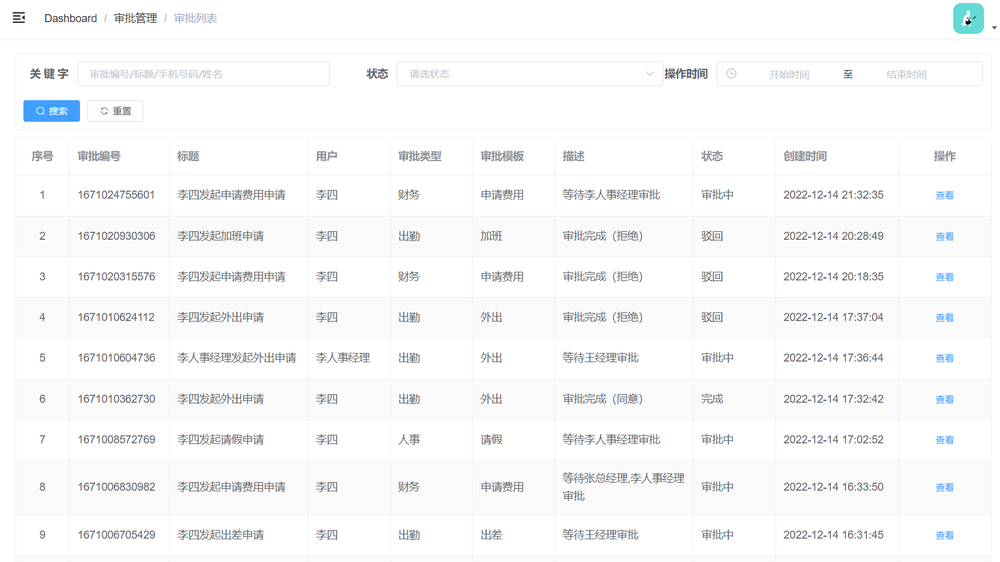
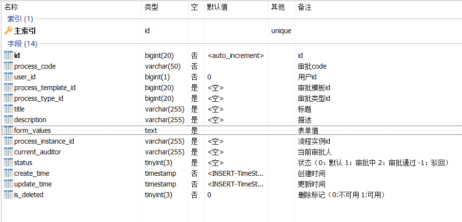

# 云尚办公系统：管理端-审批管理

## 一、审批管理需求

### 1、需求描述

前面我们已经准备好了审批需要的数据：审批类型、审批模板（基本信息、动态表单、流程定义模型），接下来我们要部署审批定义模型，启动审批流，管理审批流

### 2、页面效果



### 3、数据库表设计



## 二、审批管理

### 1、审批管理CRUD

#### 1.1、mapper

```java
package com.atguigu.process.mapper;

import com.atguigu.model.process.Process;
import com.atguigu.vo.process.ProcessQueryVo;
import com.atguigu.vo.process.ProcessVo;
import com.baomidou.mybatisplus.core.mapper.BaseMapper;
import com.baomidou.mybatisplus.core.metadata.IPage;
import com.baomidou.mybatisplus.extension.plugins.pagination.Page;
import org.apache.ibatis.annotations.Mapper;
import org.apache.ibatis.annotations.Param;

@Mapper
public interface ProcessMapper extends BaseMapper<Process> {

    IPage<ProcessVo> selectPage(Page<ProcessVo> page, @Param("vo") ProcessQueryVo processQueryVo);
}
```

#### 1.2、xml

```xml
<?xml version="1.0" encoding="UTF-8" ?>
<!DOCTYPE mapper
PUBLIC "-//ibatis.apache.org//DTD Mapper 3.0//EN"
"http://ibatis.apache.org/dtd/ibatis-3-mapper.dtd">


<mapper namespace="com.atguigu.process.mapper.ProcessMapper">
   
    <select id="selectPage" resultType="com.atguigu.vo.process.ProcessVo">
       select
       a.id,a.process_code,a.user_id,a.process_template_id,a.process_type_id,a.title,a.description,a.form_values,a.process_instance_id,a.current_auditor,a.status,a.create_time,a.update_time,
       b.name as processTemplateName,
       c.name as processTypeName,
       d.name
       from oa_process a
       left join oa_process_template b on b.id = a.process_template_id
      left join oa_process_type c on c.id = a.process_type_id
      left join sys_user d on d.id = a.user_id
      <where>
         <if test="vo.keyword != null and vo.keyword != ''">
            and (a.process_code like CONCAT('%',#{vo.keyword},'%') or  a.title like CONCAT('%',#{vo.keyword},'%') or d.phone like CONCAT('%',#{vo.keyword},'%') or d.name like CONCAT('%',#{vo.keyword},'%'))
         </if>
         <if test="vo.userId != null and vo.userId != ''">
            and a.user_id = #{vo.userId}
         </if>
         <if test="vo.status != null and vo.status != ''">
            and a.status = #{vo.status}
         </if>
         <if test="vo.createTimeBegin != null and vo.createTimeBegin != ''">
            and a.create_time >= #{vo.createTimeBegin}
         </if>
         <if test="vo.createTimeEnd != null and vo.createTimeEnd != ''">
            and a.create_time &lt;= #{vo.createTimeEnd}
         </if>
      </where>
      order by id desc
    </select>

</mapper>
```

#### 1.3、service接口

```java
package com.atguigu.process.service;

import com.atguigu.model.process.Process;
import com.atguigu.vo.process.ProcessQueryVo;
import com.atguigu.vo.process.ProcessVo;
import com.baomidou.mybatisplus.core.metadata.IPage;
import com.baomidou.mybatisplus.extension.plugins.pagination.Page;
import com.baomidou.mybatisplus.extension.service.IService;

public interface ProcessService extends IService<Process> {

    IPage<ProcessVo> selectPage(Page<ProcessVo> pageParam, ProcessQueryVo processQueryVo);

}
```

#### 1.4、service接口实现

```java
package com.atguigu.process.service.impl;

import com.atguigu.model.process.Process;
import com.atguigu.process.mapper.ProcessMapper;
import com.atguigu.process.service.ProcessService;
import com.atguigu.vo.process.ProcessQueryVo;
import com.atguigu.vo.process.ProcessVo;
import com.baomidou.mybatisplus.core.metadata.IPage;
import com.baomidou.mybatisplus.extension.plugins.pagination.Page;
import com.baomidou.mybatisplus.extension.service.impl.ServiceImpl;
import lombok.extern.slf4j.Slf4j;
import org.springframework.beans.factory.annotation.Autowired;
import org.springframework.stereotype.Service;

import javax.annotation.Resource;

@Slf4j
@Service
@SuppressWarnings({"unchecked", "rawtypes"})
public class ProcessServiceImpl extends ServiceImpl<ProcessMapper, Process> implements ProcessService {

    @Autowired
    private ProcessMapper processMapper;

    @Override
    public IPage<ProcessVo> selectPage(Page<ProcessVo> pageParam, ProcessQueryVo processQueryVo) {
        IPage<ProcessVo> page = processMapper.selectPage(pageParam, processQueryVo);
        return page;
    }
}

```

#### 1.5、controller接口

```java
package com.atguigu.process.controller;

import com.atguigu.common.result.Result;
import com.atguigu.process.service.ProcessService;
import com.atguigu.vo.process.ProcessQueryVo;
import com.atguigu.vo.process.ProcessVo;
import com.baomidou.mybatisplus.core.metadata.IPage;
import com.baomidou.mybatisplus.extension.plugins.pagination.Page;
import io.swagger.annotations.Api;
import io.swagger.annotations.ApiOperation;
import io.swagger.annotations.ApiParam;
import org.springframework.beans.factory.annotation.Autowired;
import org.springframework.security.access.prepost.PreAuthorize;
import org.springframework.web.bind.annotation.GetMapping;
import org.springframework.web.bind.annotation.PathVariable;
import org.springframework.web.bind.annotation.RequestMapping;
import org.springframework.web.bind.annotation.RestController;

@Api(tags = "审批流管理")
@RestController
@RequestMapping(value = "/admin/process")
@SuppressWarnings({"unchecked", "rawtypes"})
public class ProcessController {

    @Autowired
    private ProcessService processService;

    @PreAuthorize("hasAuthority('bnt.process.list')")
    @ApiOperation(value = "获取分页列表")
    @GetMapping("{page}/{limit}")
    public Result index(
            @ApiParam(name = "page", value = "当前页码", required = true)
            @PathVariable Long page,

            @ApiParam(name = "limit", value = "每页记录数", required = true)
            @PathVariable Long limit,

            @ApiParam(name = "processQueryVo", value = "查询对象", required = false)
            ProcessQueryVo processQueryVo) {
        Page<ProcessVo> pageParam = new Page<>(page, limit);
        IPage<ProcessVo> pageModel = processService.selectPage(pageParam, processQueryVo);
        return Result.ok(pageModel);
    }

}
```

### 2、前端审批列表

#### 2.1、定义api

创建src/api/process/process.js

```javascript
import request from '@/utils/request'

const api_name = '/admin/process'

export default {

  getPageList(page, limit, searchObj) {
    return request({
      url: `${api_name}/${page}/${limit}`,
      method: 'get',
      params: searchObj // url查询字符串或表单键值对
    })
  }
}
```

#### 2.2、创建vue页面

创建views/processMgr/process/list.vue

```vue
<template>
  <div class="app-container">

    <div class="search-div">
      <el-form label-width="70px" size="small">
        <el-row>
          <el-col :span="8">
            <el-form-item label="关 键 字">
              <el-input style="width: 95%" v-model="searchObj.keyword" placeholder="审批编号/标题/手机号码/姓名"></el-input>
            </el-form-item>
          </el-col>
          <el-col :span="8">
            <el-form-item label="状态">
              <el-select
                v-model="searchObj.status"
                placeholder="请选状态" style="width: 100%;"
              >
                <el-option
                  v-for="item in statusList"
                  :key="item.status"
                  :label="item.name"
                  :value="item.status"
                />
              </el-select>
            </el-form-item>
          </el-col>
          <el-col :span="8">
            <el-form-item label="操作时间">
              <el-date-picker
                v-model="createTimes"
                type="datetimerange"
                range-separator="至"
                start-placeholder="开始时间"
                end-placeholder="结束时间"
                value-format="yyyy-MM-dd HH:mm:ss"
                style="margin-right: 10px;width: 100%;"
              />
            </el-form-item>
          </el-col>
        </el-row>
        <el-row style="display:flex">
          <el-button type="primary" icon="el-icon-search" size="mini" :loading="loading" @click="fetchData()">搜索
          </el-button>
          <el-button icon="el-icon-refresh" size="mini" @click="resetData">重置</el-button>
        </el-row>
      </el-form>
    </div>
    <!-- 列表 -->
    <el-table
      v-loading="listLoading"
      :data="list"
      stripe
      border
      style="width: 100%;margin-top: 10px;"
    >

      <el-table-column
        label="序号"
        width="70"
        align="center"
      >
        <template slot-scope="scope">
          {{ (page - 1) * limit + scope.$index + 1 }}
        </template>
      </el-table-column>
      <el-table-column prop="processCode" label="审批编号" width="130"/>
      <el-table-column prop="title" label="标题" width="180"/>
      <el-table-column prop="name" label="用户"/>
      <el-table-column prop="processTypeName" label="审批类型"/>
      <el-table-column prop="processTemplateName" label="审批模板"/>
      <el-table-column prop="description" label="描述" width="180"/>
      <el-table-column label="状态">
        <template slot-scope="scope">
          {{ scope.row.status === 1 ? '审批中' : scope.row.status === 2 ? '完成' : '驳回' }}
        </template>
      </el-table-column>
      <el-table-column prop="createTime" label="创建时间" width="160"/>

      <el-table-column label="操作" width="120" align="center">
        <template slot-scope="scope">
          <el-button type="text" size="mini" @click="show(scope.row.id)">查看</el-button>
        </template>
      </el-table-column>
    </el-table>

    <!-- 分页组件 -->
    <el-pagination
      :current-page="page"
      :total="total"
      :page-size="limit"
      :page-sizes="[5, 10, 20, 30, 40, 50, 100]"
      style="padding: 30px 0; text-align: center;"
      layout="sizes, prev, pager, next, jumper, ->, total, slot"
      @current-change="fetchData"
      @size-change="changeSize"
    />
  </div>
</template>

<script>
import api from '@/api/process/process'

export default {
  data() {
    return {
      listLoading: true, // 数据是否正在加载
      list: null, // banner列表
      total: 0, // 数据库中的总记录数
      page: 1, // 默认页码
      limit: 10, // 每页记录数
      searchObj: {}, // 查询表单对象
      statusList: [
        { 'status': '1', 'name': '进行中' },
        { 'status': '2', 'name': '已完成' },
        { 'status': '-1', 'name': '驳回' }
      ],
      createTimes: []
    }
  },

  // 生命周期函数：内存准备完毕，页面尚未渲染
  created() {
    console.log('list created......')
    this.fetchData()
  },

  // 生命周期函数：内存准备完毕，页面渲染成功
  mounted() {
    console.log('list mounted......')
  },

  methods: {
    // 当页码发生改变的时候
    changeSize(size) {
      console.log(size)
      this.limit = size
      this.fetchData(1)
    },

    // 加载banner列表数据
    fetchData(page = 1) {
      console.log('翻页。。。' + page)
      // 异步获取远程数据（ajax）
      this.page = page

      if (this.createTimes && this.createTimes.length === 2) {
        this.searchObj.createTimeBegin = this.createTimes[0]
        this.searchObj.createTimeEnd = this.createTimes[1]
      }

      api.getPageList(this.page, this.limit, this.searchObj).then(
        response => {
          this.list = response.data.records
          this.total = response.data.total

          // 数据加载并绑定成功
          this.listLoading = false
        }
      )
    },

    // 重置查询表单
    resetData() {
      console.log('重置查询表单')
      this.searchObj = {}
      this.fetchData()
    },
      
    show(id) {
       console.log(id)
    }
  }
}
</script>
```


### 3、部署流程定义

#### 3.1、根据上传部署

##### 3.1.1、定义service接口

操作类：ProcessService

```java
void deployByZip(String deployPath);
```

##### 3.1.2、service接口实现

操作类：ProcessServiceImpl

```java
@Override
public void deployByZip(String deployPath) {
    // 定义zip输入流
    InputStream inputStream = this
            .getClass()
            .getClassLoader()
            .getResourceAsStream(deployPath);
    ZipInputStream zipInputStream = new ZipInputStream(inputStream);
    // 流程部署
    Deployment deployment = repositoryService.createDeployment()
            .addZipInputStream(zipInputStream)
            .deploy();
}
```

#### 3.2、完善审批模板发布

操作类：ProcessTemplateServiceImpl

```java
@Autowired
private ProcessService processService;

@Transactional
@Override
public void publish(Long id) {
   ProcessTemplate processTemplate = this.getById(id);
   processTemplate.setStatus(1);
   processTemplateMapper.updateById(processTemplate);

   //优先发布在线流程设计
    if(!StringUtils.isEmpty(processTemplate.getProcessDefinitionPath())) {
        processService.deployByZip(processTemplate.getProcessDefinitionPath());
    }
}
```

说明：审批模板发布后不可以再编辑

#### 3.4、页面按钮控制

按钮添加判断，发布后不可以编辑：v-if="scope.row.status == 0"

```xml
<el-button type="text" v-if="scope.row.status == 0" size="mini" @click="edit(scope.row.id)" :disabled="$hasBP('bnt.processTemplate.templateSet')  === false">修改审批设置</el-button>
<el-button type="text" v-if="scope.row.status == 0" size="mini" @click="removeDataById(scope.row.id)" :disabled="$hasBP('bnt.processTemplate.remove')  === false">删除</el-button>
```

