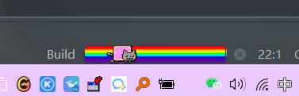

更多资料将发布在```GitHub```：[点我点我](https://github.com/lovely-fafa)

# 1 插件安装


安装后需要重启```idea```或者```pycharm```

# 2 发发的插件

## 2.1 正则表达式

- 插件名：```RegexpTester```

- 左下角会多一个框框，可以测试正则表达式

  

## 2.2 成对括号颜色

- 插件名：```Rainbow Brackets```

- 见名知意，解决多一个或者少一个括号的事情发生

  

## 2.3 缩进色块

- 插件名：```Indent Rainbow```

- 缩进有色块，知道到底有没有缩进...

  

## 2.4 代码预览

- 插件名：```CodeGlance Pro```

  

## 2.5 彩虹猫进度条

- 插件名：```Nyan Progress Bar```

- ```idea```或```pycharm```加载时的进度条美化

  

## 2.6 代码烟花特效

- 插件名：```activate-power-mode-x```

- 你写代码就像是放烟花

  

- 注意取消```shake```，免得摇晕你的小脑袋

  

## 2.7 人工智能代码补全

- 插件名：```AiXcoder Code Completer```

- 会学习你的代码，进行代码补全提示。建议积累了一定有意义的代码再安装，免得他学习你的屎山

  

## 2.8 控制台高亮插件

- 插件名：`Grep console`
- Grep, tail, filter, highlight... everything you need for a console (JS/NPM/GoLand/... Terminals are not supported - IDEA-216442
  ). Also can highlight the editor... 

# 3 idea 设置备忘录

## 1 XML 背景屎黄色

第一步：

- 【Editor】-【Inspections】
- 检索 `No data sources configured`和 `SQL dialect detection`，取消勾选

第二步：

- 取消勾选


