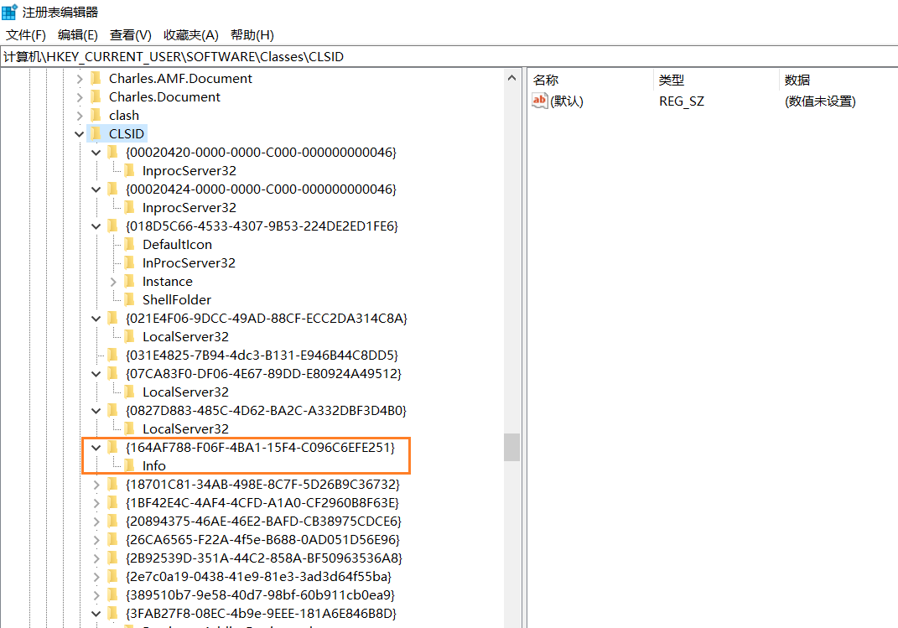

# Navicat激活

> https://www.win7zhijia.cn/win10jc/win10_47847.html

1. 进入注册表

2. 搜索框：```HKEY_CURRENT_USER\Software\PremiumSoft\NavicatPremium```，将```Registration15XCS```文件夹和```Update```文件夹删调

3. 搜索框：```HKEY_CURRENT_USER\Software\Classes\CLSID```，然后一个一个展开看。如果只包含一个名为Info的文件夹，就删除整个文件夹。

   

