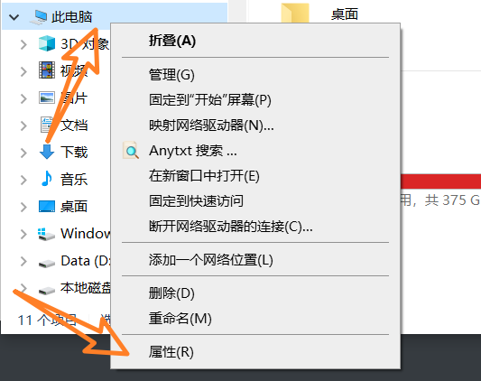
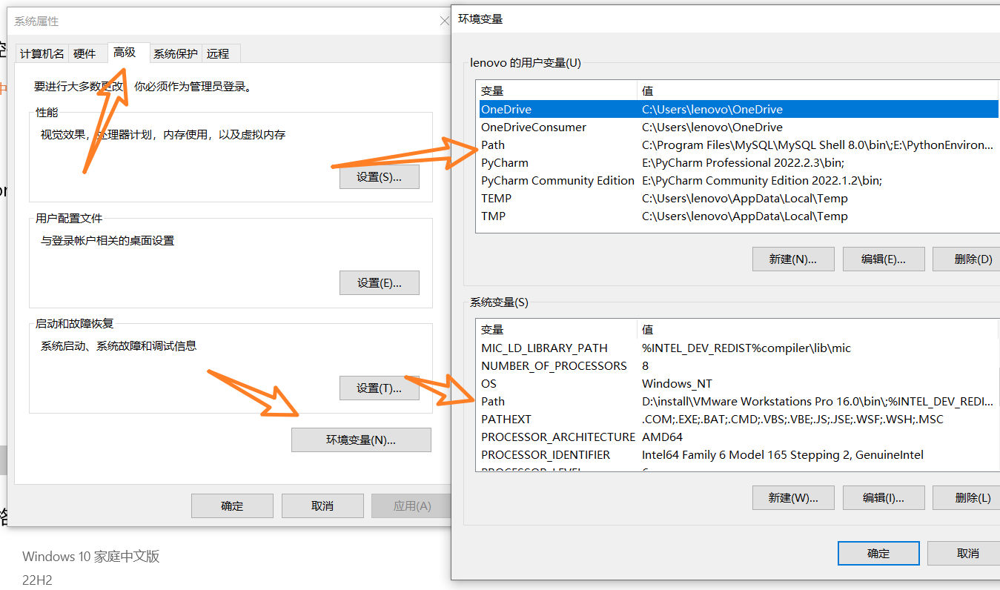
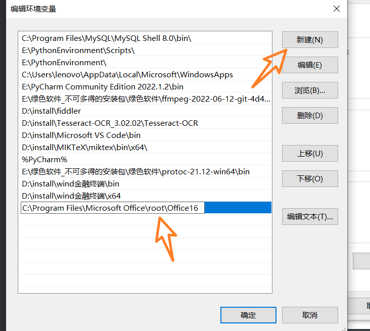

# 设置环境变量

> 此方法下，```excel```的默认打开方式是```wps```还是```office```都不影响代码

1. 找到```excel```的绝对路径：```‪C:\Program Files\Microsoft Office\root\Office16```


2. 【此电脑】-【属性】



【高级系统设置】


3. 找到两个```path```



4. 双击进去-【新建】-把路径粘贴进去

   

5. 检验是否成功

   - ```win + r```

   - 输入```cmd```回车

   - 输入```excel```回车

   - 如下所示即可

     